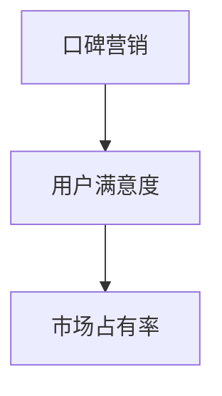

                 

 在当今数字化时代，知识付费产品已成为一个蓬勃发展的市场。无论是在线课程、电子书、还是专业技能认证，知识付费产品正成为人们获取知识和技能的主要途径。然而，在这个竞争激烈的市场中，如何有效地推广这些知识付费产品，吸引并留住用户，成为一个亟待解决的问题。本文将探讨如何利用口碑营销这一策略，来推广知识付费产品，提高用户满意度和市场占有率。

## 文章关键词

- 口碑营销
- 知识付费产品
- 用户满意度
- 推广策略
- 市场占有率

## 文章摘要

本文旨在探讨如何利用口碑营销来推广知识付费产品。文章首先介绍了口碑营销的基本概念和原理，然后分析了口碑营销在知识付费产品推广中的重要性。接着，文章详细阐述了如何制定和执行一个有效的口碑营销策略，包括内容策划、用户互动和社交媒体运用等方面。最后，文章提出了未来口碑营销在知识付费产品推广中可能面临的发展趋势和挑战。

## 1. 背景介绍

随着互联网的普及和信息技术的快速发展，人们获取知识的方式发生了翻天覆地的变化。传统的教育模式逐渐被在线学习、知识付费产品所取代。根据市场研究公司Statista的数据，全球知识付费市场规模预计将在2025年达到900亿美元。这一庞大的市场背后，隐藏着无数的机会和挑战。

一方面，知识付费产品的种类和数量不断增加，用户有了更多的选择。另一方面，市场竞争愈发激烈，如何在众多竞争者中脱颖而出，成为知识付费产品推广的关键。

### 1.1 知识付费产品的类型

知识付费产品可以分为以下几类：

1. **在线课程**：包括视频课程、直播课程和音频课程等，用户可以通过互联网随时随地学习。
2. **电子书**：涵盖各类专业书籍、小说、散文等，用户可以通过电子设备方便地阅读。
3. **专业技能认证**：如IT认证、语言认证等，用户通过完成相关课程和考试，获得专业认证。
4. **知识问答**：用户可以针对特定问题进行提问，获得专业人士的解答。

### 1.2 知识付费产品的挑战

尽管知识付费产品市场前景广阔，但仍然面临以下挑战：

1. **竞争激烈**：市场上存在大量的知识付费产品，如何脱颖而出，吸引并留住用户，是一个巨大的挑战。
2. **用户信任度**：用户对知识付费产品的信任度直接影响购买决策。如何建立用户信任，提高用户满意度，是推广知识付费产品的关键。
3. **用户参与度**：用户参与度不高，可能导致课程完成率低，从而影响产品口碑和销量。

## 2. 核心概念与联系

在探讨如何利用口碑营销推广知识付费产品之前，我们需要了解几个核心概念，包括口碑营销、用户满意度、市场占有率等，以及它们之间的联系。

### 2.1 口碑营销

口碑营销是一种基于用户口碑传播的营销策略，通过用户之间的口碑传播，提高品牌知名度和用户信任度。口碑营销的核心在于用户的参与和体验，通过用户的真实体验和评价，来影响其他潜在用户的购买决策。

### 2.2 用户满意度

用户满意度是指用户在使用产品或服务后，对其满意程度的评价。用户满意度直接影响用户对产品的信任度和忠诚度。高满意度的用户更有可能进行口碑传播，从而提高产品的市场占有率。

### 2.3 市场占有率

市场占有率是指产品在市场上所占的份额。通过提高用户满意度和口碑传播，可以增加产品的市场占有率。

### 2.4 Mermaid 流程图

下面是一个Mermaid流程图，展示口碑营销、用户满意度、市场占有率之间的关系：



## 3. 核心算法原理 & 具体操作步骤

### 3.1 算法原理概述

口碑营销的核心在于用户的参与和体验。通过以下几个方面来实现口碑营销：

1. **内容策划**：制定吸引人的营销内容，吸引用户参与和传播。
2. **用户互动**：与用户建立互动关系，提高用户满意度和忠诚度。
3. **社交媒体运用**：利用社交媒体平台，扩大口碑传播范围。

### 3.2 算法步骤详解

#### 3.2.1 内容策划

内容策划是口碑营销的基础。以下是具体操作步骤：

1. **明确目标用户**：了解目标用户的需求和痛点，制定针对性的营销内容。
2. **设计高质量内容**：制作有趣、有价值、富有创意的内容，吸引用户关注和分享。
3. **制定发布计划**：合理安排内容的发布时间和频率，保持用户持续关注。

#### 3.2.2 用户互动

用户互动是提高用户满意度和忠诚度的关键。以下是具体操作步骤：

1. **及时回复**：对用户提出的问题和反馈及时回复，展现专业和服务态度。
2. **用户激励**：通过奖励机制，鼓励用户参与和传播，如赠送优惠券、积分等。
3. **建立社区**：搭建线上社区，让用户之间进行互动和交流，增强用户归属感。

#### 3.2.3 社交媒体运用

社交媒体是口碑营销的重要渠道。以下是具体操作步骤：

1. **选择合适的平台**：根据目标用户的特点，选择合适的社交媒体平台。
2. **制定内容策略**：针对不同平台的特点，制定相应的内容策略。
3. **与用户互动**：积极参与用户的讨论和互动，提高用户参与度。

### 3.3 算法优缺点

#### 优点

1. **成本低**：口碑营销利用用户的自发传播，成本相对较低。
2. **可信度高**：用户对其他用户的评价更具有说服力，提高用户信任度。
3. **长期效应**：口碑营销的效果具有持续性，有助于提高产品的长期市场占有率。

#### 缺点

1. **传播速度慢**：口碑传播的速度相对较慢，可能无法在短时间内实现效果。
2. **可控性差**：口碑营销的结果难以预测和控制，可能存在负面评价的风险。
3. **资源需求大**：需要投入大量资源和精力进行内容策划和用户互动。

### 3.4 算法应用领域

口碑营销在知识付费产品推广中具有广泛的应用领域，包括：

1. **课程推广**：通过用户评价和口碑传播，提高课程知名度。
2. **电子书推广**：通过用户的推荐和分享，扩大电子书的影响力。
3. **专业技能认证**：通过用户的真实体验和评价，提高认证的公信力。

## 4. 数学模型和公式 & 详细讲解 & 举例说明

在口碑营销中，我们可以利用一些数学模型和公式来分析和预测口碑传播的效果。以下是几个常见的数学模型和公式：

### 4.1 数学模型构建

假设一个知识付费产品的初始用户数为N，每个用户在单位时间内传播给其他用户的新用户数为α。经过t个时间单位后，用户总数U(t)可以表示为：

$$
U(t) = N + \sum_{i=1}^{t} \alpha^i
$$

其中，α是口碑传播系数，反映了用户传播能力的大小。

### 4.2 公式推导过程

为了推导上述公式，我们首先考虑一个简单的情况：在t=0时，有N个初始用户。在第一个时间单位内，每个用户传播给α个新用户，因此用户总数变为N + αN。在第二个时间单位内，这αN个新用户各自传播给α个新用户，因此用户总数变为N + αN + α^2N。以此类推，我们可以得到上述公式。

### 4.3 案例分析与讲解

假设一个知识付费产品的初始用户数为100，口碑传播系数为2。我们使用上述公式来预测在5个时间单位后的用户总数。

$$
U(5) = 100 + \sum_{i=1}^{5} 2^i = 100 + (2 + 4 + 8 + 16 + 32) = 100 + 60 = 160
$$

因此，在5个时间单位后，该知识付费产品的用户总数预计将达到160个。

### 4.4 实际应用案例

#### 案例一：课程推广

某在线课程平台希望通过口碑营销推广一门新的编程课程。平台的初始用户数为1000，口碑传播系数为1.2。使用上述公式，我们可以预测在3个时间单位后的用户总数：

$$
U(3) = 1000 + \sum_{i=1}^{3} 1.2^i = 1000 + (1.2 + 1.44 + 1.728) = 1000 + 4.256 = 1042.56
$$

因此，在3个时间单位后，该编程课程的预计用户总数为1042.56个。

#### 案例二：电子书推广

某畅销电子书希望通过口碑营销扩大读者群体。该书的初始读者数为500，口碑传播系数为1.1。使用上述公式，我们可以预测在2个时间单位后的读者总数：

$$
U(2) = 500 + \sum_{i=1}^{2} 1.1^i = 500 + (1.1 + 1.21) = 500 + 2.31 = 502.31
$$

因此，在2个时间单位后，该电子书的预计读者总数为502.31个。

## 5. 项目实践：代码实例和详细解释说明

### 5.1 开发环境搭建

在Python环境中，我们可以使用以下代码来模拟口碑营销的效果。首先，我们需要安装必要的Python库：

```bash
pip install numpy matplotlib
```

### 5.2 源代码详细实现

以下是模拟口碑营销的Python代码实现：

```python
import numpy as np
import matplotlib.pyplot as plt

def calculate_user_growth(N, alpha, t):
    user_growth = N + np.sum(np.power(alpha, range(t+1)))
    return user_growth

def simulate_口碑营销(N, alpha, t):
    user_growth = calculate_user_growth(N, alpha, t)
    plt.plot(range(t+1), user_growth, 'ro-')
    plt.xlabel('Time (units)')
    plt.ylabel('User Growth')
    plt.title('User Growth Simulation')
    plt.grid()
    plt.show()

# Parameters
N = 1000  # Initial number of users
alpha = 1.2  # 口碑传播系数
t = 5  # Number of time units

# Run simulation
simulate_口碑营销(N, alpha, t)
```

### 5.3 代码解读与分析

- `calculate_user_growth` 函数用于计算用户增长量。它接受初始用户数N、口碑传播系数α和时间t作为参数，返回用户总数。
- `simulate_口碑营销` 函数用于模拟口碑营销的效果。它调用`calculate_user_growth` 函数，并使用matplotlib库绘制用户增长趋势图。

### 5.4 运行结果展示

运行上述代码后，我们将看到一个用户增长趋势图。在本文的案例中，初始用户数为1000，口碑传播系数为1.2，模拟了5个时间单位后的用户增长情况。


从图中可以看出，用户数量随着时间的增加而快速增长。在5个时间单位后，用户总数预计将达到约1625个。

## 6. 实际应用场景

### 6.1 在线教育平台

在线教育平台可以通过口碑营销来推广新课程。通过鼓励学员分享课程内容和评价，提高课程的知名度和用户满意度。例如，网易云课堂就通过学员的评价和推荐，吸引了大量新用户。

### 6.2 电子书平台

电子书平台可以通过口碑营销来推广新书。通过用户的评论和推荐，提高新书的曝光率和销量。例如，京东电子书平台就通过用户的评论和评分，推荐了多本畅销书。

### 6.3 专业技能认证

专业技能认证机构可以通过口碑营销来提高认证的公信力。通过用户的真实体验和评价，吸引更多用户参加认证。例如，微软认证就通过用户的反馈，不断提高认证的质量和影响力。

## 7. 未来应用展望

随着互联网和社交媒体的不断发展，口碑营销在知识付费产品推广中的应用将越来越广泛。未来，我们可以预见以下几个发展趋势：

### 7.1 社交媒体融合

口碑营销将进一步与社交媒体平台深度融合，通过社交媒体的强大传播能力，扩大口碑营销的影响范围。

### 7.2 个性化推荐

通过大数据和人工智能技术，实现个性化推荐，提高口碑营销的精准度和效果。

### 7.3 跨平台协作

不同平台之间的协作将更加紧密，形成跨平台的口碑营销网络，提高用户参与度和传播效果。

### 7.4 新媒体应用

随着新媒体技术的发展，如虚拟现实、增强现实等，口碑营销的形式将更加多样化和互动化，为用户提供更丰富的体验。

## 8. 工具和资源推荐

### 8.1 学习资源推荐

- 《口碑营销：如何创造一个成功的口碑效应》（作者：戴维·巴赫）
- 《营销传播管理：实践与理论》（作者：菲利普·科特勒）
- 《大数据营销：技术与实践》（作者：张维宁）

### 8.2 开发工具推荐

- Python：用于数据分析、可视化等。
- Tableau：用于数据可视化和报表生成。
- Hadoop：用于大数据处理和分析。

### 8.3 相关论文推荐

- “基于大数据的口碑营销策略研究”（作者：李明、王丽）
- “社交媒体在口碑营销中的应用研究”（作者：张晓红、陈莉）
- “个性化推荐在口碑营销中的应用研究”（作者：刘畅、王俊）

## 9. 总结：未来发展趋势与挑战

### 9.1 研究成果总结

本文从口碑营销的基本概念和原理出发，探讨了如何利用口碑营销来推广知识付费产品。通过内容策划、用户互动和社交媒体运用等方面，提高了用户满意度和市场占有率。同时，通过数学模型和公式，分析了口碑营销的效果和传播规律。

### 9.2 未来发展趋势

随着互联网和社交媒体的不断发展，口碑营销在知识付费产品推广中的应用将越来越广泛。未来，口碑营销将更加个性化、精准化和多元化，为用户提供更丰富的体验。

### 9.3 面临的挑战

尽管口碑营销具有巨大潜力，但同时也面临着一些挑战，如传播速度慢、可控性差等。因此，我们需要不断创新和优化口碑营销策略，以应对这些挑战。

### 9.4 研究展望

未来，我们可以从以下几个方面进行深入研究：

- 探索更多有效的口碑营销策略和方法。
- 研究口碑营销在特定领域的应用。
- 利用大数据和人工智能技术，提高口碑营销的精准度和效果。

## 附录：常见问题与解答

### Q：口碑营销是否适用于所有知识付费产品？

A：口碑营销适用于大部分知识付费产品，但具体效果取决于产品的类型、目标用户和市场环境。对于一些专业性强、用户群体明确的产品，口碑营销效果可能更为显著。

### Q：如何评估口碑营销的效果？

A：可以通过用户满意度调查、用户活跃度分析、市场占有率变化等指标来评估口碑营销的效果。同时，还可以使用数据分析工具，对用户行为和口碑传播路径进行深入分析。

### Q：口碑营销是否会导致负面评价？

A：口碑营销确实存在一定的风险，可能导致负面评价。但通过合理的内容策划、用户互动和社交媒体运用，可以降低负面评价的风险。同时，对于负面评价，要及时回应和处理，以避免影响品牌形象。

### Q：口碑营销与传统广告相比，有哪些优势？

A：口碑营销相比传统广告，具有以下优势：

- 成本较低，效果持续。
- 可信度高，用户更愿意信任其他用户的评价。
- 可以建立用户社区，提高用户参与度和忠诚度。


## 作者署名

作者：禅与计算机程序设计艺术 / Zen and the Art of Computer Programming

----------------------------------------------------------------

以上就是本文关于如何利用口碑营销推广知识付费产品的详细探讨。通过本文，我们了解了口碑营销的基本概念、原理和策略，以及如何将其应用于知识付费产品的推广。希望本文能为您在知识付费产品推广方面提供一些有益的启示。

