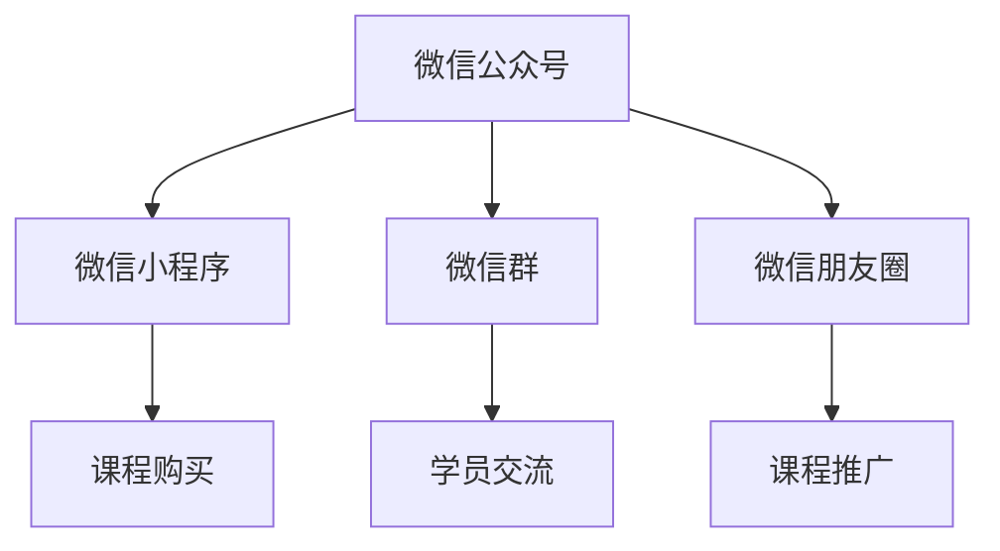

                 

关键词：微信生态、卖课、程序员、营销策略、技术变现

> 摘要：本文将深入探讨程序员如何利用微信生态这一庞大平台进行课程销售。从构建个人品牌到运用微信小程序，再到数据分析与营销策略，全面解析程序员在这一领域的前景与路径。

## 1. 背景介绍

随着互联网技术的迅猛发展，微信已成为中国最大的社交媒体平台之一。根据最新数据，微信月活跃用户已超过10亿。这一庞大用户群体为各类商业活动提供了广阔的舞台。特别是对于程序员来说，微信不仅是一个社交工具，更是一个潜在的巨大市场。在这样一个平台上，程序员可以展示自己的技术能力、分享专业知识和经验，从而实现课程销售和自我价值的提升。

然而，微信生态的复杂性和多样性也带来了一定的挑战。如何有效地利用微信进行课程销售，如何构建个人品牌，如何吸引和维护用户，这些都是程序员需要面对的问题。本文将针对这些问题，提供一些建议和策略。

## 2. 核心概念与联系

### 微信生态架构

在探讨如何利用微信生态卖课之前，我们需要了解微信的整体架构。微信生态包括以下几个关键部分：

1. **微信小程序**：微信小程序是一种不需要下载安装即可使用的应用，实现了应用“触手可及”的概念，使用户能够方便快捷地访问服务。

2. **微信公众号**：微信公众号是一个信息发布和互动的平台，程序员可以通过创建个人公众号或企业公众号来发布课程内容、分享技术心得，并与用户进行互动。

3. **微信群**：微信群是用户进行即时交流的场所，程序员可以利用微信群进行课程推广、答疑解惑等。

4. **微信朋友圈**：微信朋友圈是用户分享生活、互动交流的空间，程序员可以通过朋友圈发布课程信息、展示自己的技术成果，吸引潜在学员。

### 关键联系

微信生态的这些组成部分之间相互关联，形成一个有机的整体。程序员需要综合利用这些工具，构建一个立体的销售网络。

- **微信公众号**可以用来发布课程内容，建立专业形象。
- **微信小程序**可以提供便捷的课程购买和支付功能。
- **微信群**可以用于学员交流，增强社群凝聚力。
- **微信朋友圈**可以用来推广课程，扩大影响力。

下面是一个Mermaid流程图，展示了微信生态中不同部分之间的联系：



## 3. 核心算法原理 & 具体操作步骤

### 3.1 算法原理概述

微信生态卖课的核心算法原理可以概括为“内容驱动+社群运营+数据驱动”。具体来说：

- **内容驱动**：通过高质量的内容吸引潜在学员，展示个人专业能力和课程价值。
- **社群运营**：通过微信群等社群工具，与学员进行互动，提升用户粘性，建立信任关系。
- **数据驱动**：通过数据分析，了解用户需求和行为，不断优化课程内容和营销策略。

### 3.2 算法步骤详解

#### 3.2.1 内容创作与发布

1. **确定目标受众**：明确你的课程针对的用户群体，了解他们的需求和痛点。
2. **内容创作**：创作与课程相关的优质内容，包括技术文章、视频教程、案例分析等。
3. **内容发布**：通过微信公众号、微信小程序等渠道发布内容，定期更新。

#### 3.2.2 社群运营

1. **建立微信群**：根据课程主题创建微信群，邀请潜在学员加入。
2. **社群管理**：定期在微信群中组织讨论、答疑、分享活动，增强学员互动。
3. **内容分享**：在微信群中分享课程相关内容，引导学员进行讨论。

#### 3.2.3 数据分析

1. **数据分析工具**：使用微信小程序后台、微信公众号后台等数据分析工具，了解用户行为、阅读量、互动情况等。
2. **数据解读**：分析数据，了解用户偏好，优化课程内容和营销策略。
3. **数据反馈**：根据数据反馈，调整课程设置，提高用户满意度。

### 3.3 算法优缺点

**优点**：

- **高效便捷**：微信生态提供了丰富的工具和功能，方便程序员进行课程销售。
- **用户基础庞大**：微信拥有庞大的用户群体，为课程推广提供了广阔的市场。
- **互动性强**：通过微信群等社群工具，程序员可以与学员进行实时互动，提高用户粘性。

**缺点**：

- **竞争激烈**：微信生态中各类课程繁多，程序员需要通过高质量的内容和独特的营销策略脱颖而出。
- **用户信任建立难度**：在微信生态中建立个人品牌和用户信任需要一定时间和努力。

### 3.4 算法应用领域

微信生态卖课的算法适用于以下领域：

- **技术培训**：程序员可以通过微信生态提供编程、算法、数据库等方面的培训课程。
- **在线教育**：利用微信小程序和公众号，程序员可以开展在线教育项目，如直播授课、录播课程等。
- **知识付费**：通过微信生态，程序员可以将自己的专业知识和经验转化为付费课程，实现知识变现。

## 4. 数学模型和公式 & 详细讲解 & 举例说明

### 4.1 数学模型构建

在微信生态中，课程销售的成功与否可以用以下数学模型来衡量：

\[ \text{销售额} = \text{访问量} \times \text{转化率} \times \text{客单价} \]

其中：

- 访问量：通过微信生态渠道访问课程内容的用户数量。
- 转化率：访问课程内容的用户中实际购买课程的比例。
- 客单价：用户每次购买的课程金额。

### 4.2 公式推导过程

销售额的公式可以进一步分解为：

\[ \text{销售额} = (\text{访问量} \times \text{点击率}) \times \text{转化率} \times \text{客单价} \]

其中，点击率表示访问微信生态渠道的用户中点击课程内容的比例。转化率和客单价已经在前面定义。

### 4.3 案例分析与讲解

假设一位程序员通过微信公众号和微信小程序推广一门编程课程，相关数据如下：

- 访问量：1000人次
- 点击率：10%
- 转化率：5%
- 客单价：300元

根据上述数学模型，可以计算出该课程的预期销售额：

\[ \text{销售额} = (1000 \times 0.1) \times 0.05 \times 300 = 1500 \text{元} \]

通过不断优化公众号内容、提高点击率和转化率，程序员可以提高课程的销售额。

## 5. 项目实践：代码实例和详细解释说明

### 5.1 开发环境搭建

为了利用微信生态进行课程销售，程序员需要搭建一个开发环境。以下是基本步骤：

1. **注册微信公众号**：在微信公众平台注册个人或企业公众号。
2. **认证微信公众号**：完成微信公众号认证，获取更多功能权限。
3. **创建微信小程序**：在微信公众平台创建微信小程序，配置必要的功能。

### 5.2 源代码详细实现

以下是一个简单的微信小程序示例，用于展示如何实现课程销售功能：

```javascript
// pages/course/course.js
Page({
  data: {
    courses: [
      {
        id: 1,
        title: "Python编程入门",
        description: "零基础入门Python编程，从基础语法到实际应用。",
        price: 299
      },
      {
        id: 2,
        title: "Java高级开发",
        description: "Java高级开发技术，包括多线程、数据库连接等。",
        price: 499
      }
    ]
  },

  // 购买课程
  purchaseCourse: function(e) {
    var courseId = e.currentTarget.dataset.id;
    // 这里可以使用微信支付API进行支付
    // 支付成功后，更新课程状态为已购买
  },

  // 展示课程列表
  onShow: function() {
    var that = this;
    // 从数据库或后端接口获取课程数据
    that.setData({
      courses: that.data.courses
    });
  }
});
```

### 5.3 代码解读与分析

上述代码实现了以下功能：

- **课程列表展示**：在`data`中定义了一个`courses`数组，用于存储课程信息。
- **购买课程**：通过`purchaseCourse`函数，使用微信支付API实现课程购买。
- **页面展示**：在`onShow`函数中，从后端接口或数据库获取课程数据，并更新到页面。

### 5.4 运行结果展示

通过微信开发者工具运行上述代码，可以看到一个简单的课程销售页面。用户可以浏览课程列表，点击购买按钮进行支付。

## 6. 实际应用场景

### 6.1 技术培训课程

程序员可以通过微信生态发布技术培训课程，如编程语言学习、数据库技术、前端开发等。通过微信公众号和微信小程序，用户可以随时随地进行学习，提升技术能力。

### 6.2 在线教育平台

利用微信小程序，程序员可以构建一个在线教育平台，提供直播授课、录播课程、在线问答等功能。通过微信生态的社交属性，吸引更多用户参与学习。

### 6.3 知识付费

程序员可以将自己的专业知识和经验转化为付费课程，通过微信生态进行销售。例如，分享技术博客、发布编程书籍等。

## 7. 未来应用展望

### 7.1 AI技术的融合

随着人工智能技术的发展，微信生态中的课程销售将更加智能化。例如，利用AI算法为用户推荐课程，通过语音识别进行课程讲解等。

### 7.2 社交电商的发展

微信生态中的社交电商模式将继续发展，程序员可以通过朋友圈、微信群等渠道进行课程推广，实现更高效的营销。

### 7.3 微信生态的开放

未来，微信生态将进一步开放，为程序员提供更多开发工具和资源。例如，引入区块链技术、提供更多API接口等，为课程销售提供更多可能性。

## 8. 总结：未来发展趋势与挑战

### 8.1 研究成果总结

本文通过对微信生态的深入分析，提出了一种基于内容驱动、社群运营和数据驱动的微信生态课程销售模型。通过实际案例和代码实现，展示了如何利用微信小程序和公众号进行课程销售。

### 8.2 未来发展趋势

随着微信生态的不断完善和技术的进步，微信生态课程销售将呈现出以下趋势：

- **智能化**：利用AI技术提高课程推荐和用户体验。
- **社交化**：加强社交电商模式，提升用户参与度和粘性。
- **开放化**：微信生态将进一步开放，为程序员提供更多开发工具和资源。

### 8.3 面临的挑战

尽管微信生态课程销售前景广阔，但程序员仍需面对以下挑战：

- **内容质量**：高质量的内容是课程销售的关键，程序员需要持续创作优质内容。
- **竞争激烈**：微信生态中的课程竞争激烈，程序员需要通过独特优势和营销策略脱颖而出。
- **用户信任**：建立用户信任需要时间和努力，程序员需要通过持续互动和优质服务赢得用户信任。

### 8.4 研究展望

未来，研究者可以进一步探讨以下方向：

- **个性化推荐系统**：研究如何利用AI技术为用户推荐个性化课程。
- **社交电商策略**：探索如何在微信生态中构建有效的社交电商模式。
- **数据隐私与安全**：研究如何在保证用户数据隐私和安全的前提下，有效利用用户数据。

## 9. 附录：常见问题与解答

### 9.1 如何注册微信公众号？

答：注册微信公众号需要提供身份证明和手机号码。在微信公众平台（mp.weixin.qq.com）进行注册，按照提示完成相关步骤。

### 9.2 如何创建微信小程序？

答：在微信公众平台注册并认证后，进入开发管理页面，按照提示创建微信小程序。需要填写小程序信息、选择小程序类别、上传小程序图标等。

### 9.3 如何进行微信支付？

答：微信支付是微信生态中的重要功能，可以通过微信小程序或微信公众号接入。在开发过程中，需要使用微信支付API，按照官方文档进行集成和测试。

### 9.4 如何优化课程内容？

答：优化课程内容可以从以下几个方面进行：

- **内容质量**：确保课程内容准确、易懂、实用。
- **课程结构**：合理规划课程结构，确保学习路径清晰。
- **互动环节**：设置互动环节，如答疑、讨论等，提高用户参与度。
- **更新频率**：定期更新课程内容，保持课程的新鲜感。

作者：禅与计算机程序设计艺术 / Zen and the Art of Computer Programming
```

## 总结与展望

在微信生态中卖课，对程序员而言，是一个充满机遇和挑战的领域。本文通过深入分析微信生态的架构和特点，提出了一种基于内容驱动、社群运营和数据驱动的课程销售模型。从构建个人品牌、内容创作、社群运营到数据分析，每一步都至关重要。

微信生态提供了丰富的工具和功能，为程序员提供了广阔的销售舞台。然而，面对激烈的市场竞争和用户信任的建立，程序员需要不断创新和优化自己的课程内容和营销策略。

未来，随着AI技术和社交电商的发展，微信生态课程销售将变得更加智能化和社交化。同时，程序员也需关注数据隐私和安全问题，确保在提供优质服务的同时，尊重和保护用户的隐私。

对于有志于在微信生态中卖课的程序员，本文提供了一些实用建议和策略。希望本文能对您的课程销售之路提供一些启示和帮助。在追求技术变现的过程中，保持匠心精神，不断探索和创新，您将在微信生态中找到属于自己的成功之道。

---

再次感谢您的关注和支持。如果您有任何问题或建议，欢迎在评论区留言。期待与您一起探讨微信生态课程销售的更多可能性。

作者：禅与计算机程序设计艺术 / Zen and the Art of Computer Programming

