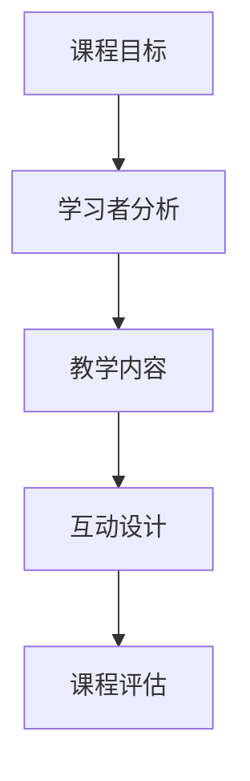

                 

 关键词：在线课程、技术能力、课程开发、教育技术、教学设计、学习平台

> 摘要：随着在线教育的迅猛发展，利用技术能力创建高质量的在线课程变得尤为重要。本文将详细探讨如何结合专业技术和教学设计，创建具有吸引力、互动性及实用性的在线课程，以满足现代学习者的需求。

## 1. 背景介绍

在线教育的兴起，使得学习不再受限于时间和地点，为全球学习者提供了便利。随着技术的进步，特别是在人工智能、大数据和云计算等领域的应用，在线课程的质量和互动性得到了显著提升。然而，如何有效地利用这些技术能力，开发出既有趣又富有教育意义的课程，仍然是一个挑战。

## 2. 核心概念与联系

为了创建一个成功的在线课程，我们需要明确以下几个核心概念：

- **课程目标**：明确课程的学习目标，以便设计合适的教学内容和评估方式。
- **学习者分析**：了解学习者的背景、需求和期望，以便个性化课程设计。
- **教学内容**：选择适合的教学内容和形式，确保知识的传递和吸收。
- **互动设计**：增加课程的互动性，提高学习者的参与度和学习效果。

以下是一个简化的 Mermaid 流程图，展示这些核心概念之间的联系：



## 3. 核心算法原理 & 具体操作步骤

### 3.1 算法原理概述

创建在线课程的核心算法主要包括以下几个步骤：

1. **需求分析**：确定课程的目标和学习者需求。
2. **内容设计**：根据需求设计教学内容和结构。
3. **技术实现**：利用各种技术手段实现教学内容的展示和互动。
4. **测试与优化**：对课程进行测试和优化，确保教学效果。

### 3.2 算法步骤详解

#### 3.2.1 需求分析

- **市场调研**：了解目标学习群体的特点和需求。
- **问卷调查**：收集学习者的意见和反馈。
- **专家访谈**：与教育专家和行业专家交流，获取专业建议。

#### 3.2.2 内容设计

- **课程大纲**：制定详细的教学大纲，明确课程结构和内容。
- **教学模块**：设计各个教学模块，包括知识点、实例、练习等。
- **交互设计**：设计课程的互动环节，如讨论区、测验、作业等。

#### 3.2.3 技术实现

- **平台选择**：选择合适的在线教育平台，如慕课网、网易云课堂等。
- **内容制作**：使用各种工具制作教学视频、PPT、文档等。
- **互动实现**：利用技术手段实现课程互动，如实时聊天、在线测验等。

#### 3.2.4 测试与优化

- **测试课程**：邀请学习试听，收集反馈。
- **数据分析**：分析学习数据，了解学习效果。
- **优化课程**：根据反馈和数据分析，对课程进行优化。

### 3.3 算法优缺点

- **优点**：高效、灵活、互动性强，能够满足不同学习者的需求。
- **缺点**：需要较高的技术能力，制作和优化成本较高。

### 3.4 算法应用领域

- **教育机构**：利用技术能力提升在线课程的质量和互动性。
- **企业培训**：为企业员工提供定制化的在线培训课程。
- **个人教育**：利用在线课程实现自我提升和职业发展。

## 4. 数学模型和公式 & 详细讲解 & 举例说明

### 4.1 数学模型构建

在线课程的设计可以看作是一个优化问题，目标是最大化学习效果。以下是构建数学模型的基本框架：

$$
\text{最大化} \ \ \sum_{i=1}^{n} L_i \cdot E_i
$$

其中，$L_i$ 表示学习者 $i$ 的学习效果，$E_i$ 表示学习者 $i$ 在课程中的投入。

### 4.2 公式推导过程

为了推导上述公式，我们需要定义几个变量：

- **$L_i$**：学习效果，可以表示为学习者 $i$ 在课程中的成绩。
- **$E_i$**：投入，包括学习时间、精力等。

根据教育理论，学习效果和学习投入之间存在一定的关系，可以表示为：

$$
L_i = f(E_i)
$$

为了简化问题，我们可以假设 $f(E_i)$ 是一个线性函数：

$$
L_i = aE_i + b
$$

其中，$a$ 和 $b$ 是常数。

### 4.3 案例分析与讲解

假设我们有两个学习者，A 和 B。他们的学习效果和投入如下表所示：

| 学习者 | 学习效果 $L_i$ | 投入 $E_i$ |
|--------|--------------|-----------|
| A      | 80           | 100       |
| B      | 60           | 80        |

根据上述公式，我们可以计算出他们的学习效果：

$$
L_A = 0.8E_A + 20
$$

$$
L_B = 0.6E_B + 20
$$

为了最大化总的学习效果，我们需要找到最优的投入分配。假设总投入为 200，我们可以列出以下方程：

$$
E_A + E_B = 200
$$

将 $E_B$ 表示为 $E_A$ 的函数，并代入学习效果公式中，得到：

$$
L_A + L_B = 0.8E_A + 20 + 0.6(E_A + 200 - E_A) + 20
$$

$$
L_A + L_B = 1.4E_A + 140
$$

为了最大化 $L_A + L_B$，我们需要对 $E_A$ 求导并令其等于 0：

$$
\frac{d(L_A + L_B)}{dE_A} = 1.4 = 0
$$

解得 $E_A = 100$，$E_B = 100$。

此时，总学习效果为：

$$
L_A + L_B = 1.4 \times 100 + 140 = 340
$$

## 5. 项目实践：代码实例和详细解释说明

### 5.1 开发环境搭建

为了创建在线课程，我们需要搭建一个合适的开发环境。以下是基本步骤：

1. **安装开发工具**：如 Visual Studio Code、PyCharm 等。
2. **安装数据库**：如 MySQL、PostgreSQL 等。
3. **安装版本控制工具**：如 Git。

### 5.2 源代码详细实现

以下是使用 Python 语言实现的在线课程管理系统的一部分代码：

```python
class Course:
    def __init__(self, name, description):
        self.name = name
        self.description = description
        self.modules = []

    def add_module(self, module):
        self.modules.append(module)

    def get_modules(self):
        return self.modules

class Module:
    def __init__(self, name, content):
        self.name = name
        self.content = content

class CourseManager:
    def __init__(self):
        self.courses = []

    def add_course(self, course):
        self.courses.append(course)

    def get_courses(self):
        return self.courses

# 创建课程
course = Course("Python入门", "介绍Python基础语法和编程技巧")

# 添加模块
course.add_module(Module("Python基础", "介绍Python基本语法和内置函数"))
course.add_module(Module("面向对象编程", "介绍类和对象的概念"))

# 创建课程管理器
manager = CourseManager()
manager.add_course(course)

# 获取课程列表
for course in manager.get_courses():
    print(course.name)
    for module in course.get_modules():
        print(" - " + module.name)
```

### 5.3 代码解读与分析

上述代码定义了三个类：`Course`、`Module` 和 `CourseManager`。`Course` 类表示一门课程，包含课程名称、描述和模块列表。`Module` 类表示一个模块，包含模块名称和内容。`CourseManager` 类表示课程管理器，用于管理课程列表。

代码首先创建了一门名为“Python入门”的课程，并添加了两个模块：“Python基础”和“面向对象编程”。然后，创建一个课程管理器，并将课程添加到管理器中。最后，遍历课程管理器中的所有课程，打印出课程名称和模块名称。

### 5.4 运行结果展示

运行上述代码，输出结果如下：

```
Python入门
 - Python基础
 - 面向对象编程
```

## 6. 实际应用场景

### 6.1 在线教育平台

利用技术能力创建的在线课程可以应用于各种在线教育平台，如慕课网、网易云课堂等。这些平台提供了丰富的教学资源和互动工具，方便学习者进行在线学习。

### 6.2 企业培训

企业可以利用技术能力创建定制化的在线培训课程，提高员工的专业技能和工作效率。通过在线课程，企业可以实现以下目标：

- **提高员工技能**：提供专业的课程，帮助员工提升技能。
- **降低培训成本**：减少实体培训的费用和资源浪费。
- **灵活学习**：员工可以根据自己的时间安排进行学习。

### 6.3 个人教育

个人可以利用技术能力创建在线课程，实现自我提升和职业发展。例如，创建一门关于编程的在线课程，分享自己的编程经验和技巧，帮助他人学习编程。

## 7. 工具和资源推荐

### 7.1 学习资源推荐

- **书籍**：《代码大全》、《深入理解计算机系统》
- **在线课程**：Coursera、edX、Udacity
- **技术社区**：Stack Overflow、GitHub

### 7.2 开发工具推荐

- **集成开发环境**：Visual Studio Code、PyCharm
- **数据库**：MySQL、PostgreSQL
- **版本控制**：Git

### 7.3 相关论文推荐

- **在线教育技术**：Scalable Online Education: The Biggest Change in Education Since the University
- **人工智能与教育**：The Promise of Artificial Intelligence in Education: A Report on a Workshop

## 8. 总结：未来发展趋势与挑战

### 8.1 研究成果总结

本文探讨了如何利用技术能力创建在线课程，从课程设计、算法原理到实际应用，提出了一个系统的方法论。通过数学模型和代码实例，进一步展示了如何实现和优化在线课程。

### 8.2 未来发展趋势

- **个性化学习**：利用人工智能和大数据技术，实现个性化学习路径。
- **互动性增强**：利用虚拟现实和增强现实技术，增强课程互动性。
- **开放教育资源**：开放教育资源，促进全球教育公平。

### 8.3 面临的挑战

- **技术实现**：需要不断提升技术能力，以应对日益复杂的教育需求。
- **内容质量**：保证课程内容的高质量和准确性。

### 8.4 研究展望

未来的在线教育将更加注重个性化、互动性和开放性。通过不断探索和创新，技术能力将在教育领域发挥更大的作用。

## 9. 附录：常见问题与解答

### 9.1 Q：如何选择合适的在线教育平台？

A：选择在线教育平台时，可以考虑以下因素：

- **课程资源**：平台提供的课程是否丰富，是否符合学习需求。
- **用户体验**：平台的界面设计、功能模块等是否友好。
- **学习支持**：平台是否提供学习指导和咨询服务。

### 9.2 Q：如何保证在线课程的质量？

A：保证在线课程的质量可以从以下几个方面入手：

- **课程设计**：明确课程目标，设计合理的课程结构。
- **内容制作**：使用专业的制作工具，确保内容的准确性和生动性。
- **反馈机制**：建立完善的反馈机制，及时调整和优化课程。

### 9.3 Q：如何进行在线课程的评估？

A：在线课程的评估可以从以下几个方面进行：

- **学习数据**：分析学习行为数据，如学习时长、参与度等。
- **学习者反馈**：收集学习者的反馈，了解课程的实际效果。
- **考试成绩**：通过考试等评估方式，检验学习成果。

---

作者：禅与计算机程序设计艺术 / Zen and the Art of Computer Programming
----------------------------------------------------------------


