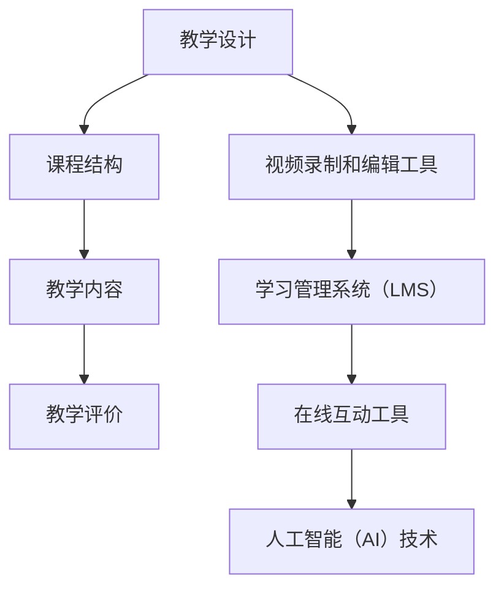
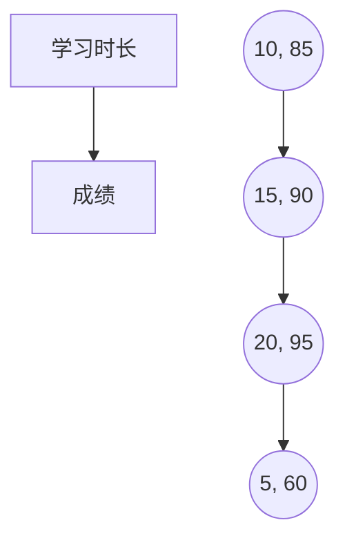
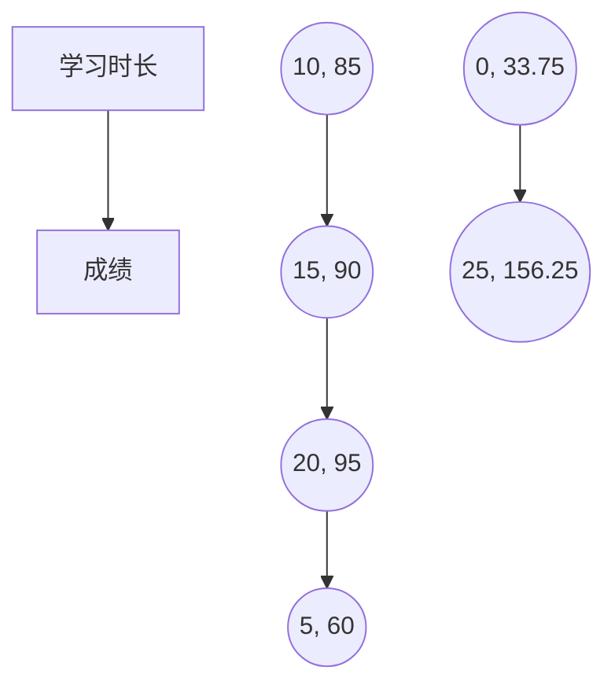

                 

在当今数字化时代，技术能力不仅是企业和开发者的核心竞争力，也是推动个人发展和知识传播的关键因素。通过创建在线课程，您可以将自己的技术知识和经验分享给更广泛的受众，实现个人价值的提升和社会影响力的扩大。本文将详细介绍如何利用技术能力创建在线课程，帮助您从零开始，构建出具有吸引力的在线教学资源。

## 关键词

- 在线课程
- 技术能力
- 教学设计
- 数字化教育
- 内容创作

## 摘要

本文将围绕如何利用技术能力创建在线课程展开讨论。首先，我们将回顾在线教育的背景和发展趋势，接着深入探讨如何定位课程目标、设计课程结构。随后，文章将详细介绍技术工具的选择和使用，包括视频录制、编辑、教学平台搭建等。此外，还将讨论课程内容创作的方法和技巧，以及如何通过互动和反馈提高学员的参与度和学习效果。最后，文章将总结在线课程创建的要点，并提供实用的工具和资源推荐，帮助您顺利开启在线教学之旅。

### 1. 背景介绍

在线教育作为一种新兴的教育模式，近年来在全球范围内迅速崛起。随着互联网技术的不断发展和普及，在线学习已经成为许多人获取知识、提升技能的首选方式。以下是几个关键点，概述了在线教育的背景和发展趋势：

#### 1.1 在线教育的起源和发展

在线教育起源于20世纪90年代，随着互联网和信息技术的发展，网络成为了新的教育平台。早期的在线教育主要是以电子书籍和在线论坛的形式存在，随着时间推移，逐渐发展出更丰富的形式，如视频课程、直播教学等。

#### 1.2 当前在线教育的现状

目前，在线教育已经形成了庞大的市场规模。根据市场研究报告，全球在线教育市场规模预计将在未来几年内持续增长。尤其是在COVID-19疫情期间，在线教育需求激增，推动了整个行业的快速发展。

#### 1.3 在线教育的趋势

1. **个性化学习**：随着大数据和人工智能技术的发展，个性化学习成为了在线教育的重要趋势。通过分析学员的学习行为和需求，系统可以提供定制化的学习路径和内容。
   
2. **混合式学习**：混合式学习（Blended Learning）结合了在线学习和传统面授教育的优点，为学习者提供了更多的学习选择和灵活性。

3. **开放教育资源（OER）**：开放教育资源在全球范围内得到了广泛关注和支持。这些资源包括开放课程、电子书籍等，为学习者提供了免费或低成本的学习材料。

4. **虚拟现实（VR）和增强现实（AR）**：虚拟现实和增强现实技术正在逐渐应用于在线教育中，提供了更加沉浸式的学习体验。

#### 1.4 技术对在线教育的影响

1. **直播技术**：直播技术使得讲师可以实时与学员互动，提高了教学的互动性和实时性。

2. **学习管理系统（LMS）**：学习管理系统为在线教育提供了一个全面的管理平台，包括课程内容管理、学生管理、作业与考试管理等。

3. **人工智能（AI）**：人工智能技术在在线教育中的应用主要体现在个性化推荐、自动评分、智能答疑等方面。

通过以上背景介绍，我们可以看到，在线教育已经发展成为一个充满活力和机遇的领域。对于有技术能力的个人或团队来说，创建在线课程不仅是一个有益的实践，也是一个展示自己技术专长和影响力的平台。

### 2. 核心概念与联系

在创建在线课程之前，了解并掌握一些核心概念和技术是非常关键的。这些概念不仅能够帮助我们更好地设计课程，还能提高教学效果。以下是一些重要的核心概念，以及它们之间的联系。

#### 2.1 教学设计概念

**教学目标**：明确的教学目标是课程设计的第一步。它定义了学员通过课程学习应达到的知识和技能水平。

**学习路径**：学习路径描述了学员在学习过程中应遵循的步骤和流程。它应该与教学目标相一致，确保学员能够逐步掌握所需的知识和技能。

**课程结构**：课程结构是课程内容的具体安排，包括章节、小节、知识点等。良好的课程结构有助于提高学员的学习效率和参与度。

**教学内容**：教学内容是课程的核心，包括理论知识、案例分析和实践操作等。内容的设计应该注重理论与实践的结合，提高学员的综合能力。

**教学评价**：教学评价是衡量教学效果的重要手段，包括作业、考试、讨论等。通过评价，可以及时了解学员的学习情况，调整教学策略。

#### 2.2 技术工具和平台

**视频录制和编辑工具**：视频录制和编辑工具是制作高质量课程视频的必备工具。常见的视频录制工具有Zoom、Microsoft Teams等，而视频编辑工具则包括Adobe Premiere Pro、Final Cut Pro等。

**学习管理系统（LMS）**：学习管理系统是管理在线课程的重要工具，它提供课程内容管理、学员管理、作业提交和评分等功能。常见的LMS平台有Moodle、Canvas等。

**在线互动工具**：在线互动工具可以帮助讲师与学员进行实时互动，提高课程的参与度和互动性。常见的互动工具包括Slack、Discord等。

**人工智能（AI）技术**：人工智能技术在在线教育中的应用越来越广泛，如智能推荐、自动评分、智能答疑等。AI技术可以提高教学效率，减轻讲师的工作负担。

#### 2.3 Mermaid 流程图

以下是一个简单的Mermaid流程图，展示了核心概念和技术工具之间的联系：



通过上述流程图，我们可以清晰地看到教学设计与技术工具之间的关联，这为后续的课程创建提供了重要的指导。

### 3. 核心算法原理 & 具体操作步骤

#### 3.1 算法原理概述

在线课程的创建过程可以看作是一种系统化的工程，其中涉及到多个核心算法原理。这些算法不仅能够帮助我们设计出结构合理的课程，还能提高教学效果和学员的参与度。以下是几个关键算法原理的概述：

**1. 内容规划算法**：用于根据教学目标和学员需求，规划课程的内容和结构。这一算法通常基于教育理论和学习科学，通过分析学习者的背景和需求，生成个性化的课程规划。

**2. 互动算法**：用于设计课程中的互动环节，包括讨论、问答、小组协作等。这些算法通常基于社交网络分析和群体动力理论，旨在提高学员的参与度和学习积极性。

**3. 数据分析算法**：用于分析学员的学习行为和成绩，提供反馈和改进建议。常见的算法包括回归分析、聚类分析和神经网络等。

**4. 个性化推荐算法**：用于根据学员的学习行为和兴趣，推荐相关的课程内容和学习资源。这一算法通常基于协同过滤和内容推荐技术。

#### 3.2 算法步骤详解

**3.2.1 内容规划算法**

1. **需求分析**：收集学员的学习需求、兴趣和背景信息。
2. **课程结构设计**：根据需求分析结果，设计课程的整体结构，包括章节、小节和知识点。
3. **内容填充**：为每个章节和知识点填充具体的教学内容，如理论讲解、案例分析、实践操作等。
4. **反馈和调整**：根据教学反馈和学员反馈，不断调整和优化课程内容。

**3.2.2 互动算法**

1. **互动设计**：根据课程内容和学员特点，设计互动环节，如讨论区、问答环节、小组协作等。
2. **互动执行**：在实际教学中，执行设计的互动环节，鼓励学员积极参与。
3. **互动评价**：收集学员的互动反馈，评估互动效果，并根据反馈进行调整。

**3.2.3 数据分析算法**

1. **数据收集**：收集学员的学习行为数据，如学习时长、访问频率、作业成绩等。
2. **数据分析**：使用数据分析算法，分析学员的学习行为和成绩，识别学习难点和兴趣点。
3. **反馈和建议**：根据数据分析结果，为学员提供学习反馈和建议，帮助他们更好地学习和进步。

**3.2.4 个性化推荐算法**

1. **数据采集**：采集学员的学习行为数据，包括课程访问记录、学习时长、作业成绩等。
2. **兴趣建模**：基于学员的学习行为数据，建立学员的兴趣模型。
3. **内容推荐**：根据学员的兴趣模型，推荐相关的课程内容和学习资源。

#### 3.3 算法优缺点

**内容规划算法**：

**优点**：能够根据学员的需求和兴趣，生成个性化的课程规划，提高教学效果。

**缺点**：设计过程较为复杂，需要大量数据支持和专业分析。

**互动算法**：

**优点**：增强学员的参与度和学习积极性，提高课程互动性和趣味性。

**缺点**：实施难度较大，需要设计合理的互动环节和执行策略。

**数据分析算法**：

**优点**：能够帮助讲师更好地了解学员的学习情况，提供个性化的学习反馈。

**缺点**：对数据分析和处理能力要求较高，需要一定的技术基础。

**个性化推荐算法**：

**优点**：提高学员的学习体验，增加课程内容的覆盖面和多样性。

**缺点**：对学员行为数据的采集和分析要求较高，可能涉及隐私问题。

#### 3.4 算法应用领域

这些核心算法原理主要应用于在线教育的以下几个方面：

**1. 课程设计**：用于规划课程内容和结构，提高教学效果。

**2. 互动教学**：用于设计互动环节，增强学员的参与度和学习积极性。

**3. 学习分析**：用于分析学员的学习行为和成绩，提供个性化的学习反馈。

**4. 内容推荐**：用于推荐相关的课程内容和学习资源，提高学员的学习体验。

通过以上核心算法原理的应用，在线课程可以更加科学、有效地进行设计和教学，从而更好地满足学员的学习需求。

### 4. 数学模型和公式 & 详细讲解 & 举例说明

在创建在线课程时，数学模型和公式是不可或缺的工具，它们不仅能够帮助我们更好地理解课程内容，还能提供定量分析的方法。以下是一些常见的数学模型和公式，以及它们的详细讲解和举例说明。

#### 4.1 数学模型构建

数学模型是一种用数学语言描述现实世界问题的工具，它可以帮助我们分析和解决复杂问题。在线课程中，常见的数学模型包括：

1. **回归模型**：用于预测和分析变量之间的关系。
2. **聚类模型**：用于将数据分为不同的群体或类别。
3. **决策树模型**：用于分类和回归分析。

**回归模型**：假设我们想要预测学员的学习成绩，可以使用线性回归模型。线性回归模型的公式如下：

\[ y = ax + b \]

其中，\( y \) 是因变量（如成绩），\( x \) 是自变量（如学习时长），\( a \) 和 \( b \) 是回归系数。

**聚类模型**：假设我们想要将学员按照学习风格分类，可以使用K均值聚类算法。K均值聚类模型的公式如下：

\[ \text{Minimize} \sum_{i=1}^{n} \sum_{j=1}^{k} (x_j - \mu_i)^2 \]

其中，\( x_j \) 是第 \( j \) 个学员的特征向量，\( \mu_i \) 是第 \( i \) 个聚类中心的特征向量。

**决策树模型**：假设我们想要根据学员的学习习惯预测他们的学习效果，可以使用ID3算法。ID3算法的公式如下：

\[ \text{Entropy}(S) = -\sum_{i=1}^{n} p_i \log_2 p_i \]

其中，\( S \) 是样本集，\( p_i \) 是样本在 \( i \) 类中的概率。

#### 4.2 公式推导过程

以下是一个简单的例子，解释回归模型公式的推导过程：

假设我们有一组数据点 \((x_i, y_i)\)，其中 \( x_i \) 是自变量，\( y_i \) 是因变量。我们想要找到一个线性模型来描述这两个变量之间的关系。

1. **最小二乘法**：假设我们的线性模型为 \( y = ax + b \)。为了找到最佳拟合线，我们需要最小化残差平方和。残差是实际值与预测值之间的差，即 \( e_i = y_i - (ax_i + b) \)。最小化残差平方和的目标函数为：

\[ \text{Minimize} \sum_{i=1}^{n} e_i^2 \]

2. **偏导数求解**：对目标函数分别对 \( a \) 和 \( b \) 求偏导数，并令其等于0，得到：

\[ \frac{\partial}{\partial a} \sum_{i=1}^{n} e_i^2 = -2 \sum_{i=1}^{n} x_i e_i = 0 \]
\[ \frac{\partial}{\partial b} \sum_{i=1}^{n} e_i^2 = -2 \sum_{i=1}^{n} e_i = 0 \]

3. **求解线性方程组**：通过解上述线性方程组，可以得到回归系数 \( a \) 和 \( b \)。

#### 4.3 案例分析与讲解

以下是一个具体的案例，展示如何使用回归模型预测学员的学习成绩：

**案例背景**：某在线课程想要预测学员的学习成绩，收集了以下数据：

| 学员ID | 学习时长（小时） | 成绩（%） |
|--------|------------------|----------|
| 1      | 10               | 85       |
| 2      | 15               | 90       |
| 3      | 20               | 95       |
| 4      | 5                | 60       |

**步骤1**：绘制散点图

首先，我们绘制学习时长和成绩的散点图，以观察两个变量之间的关系。



**步骤2**：计算回归系数

使用最小二乘法计算回归系数 \( a \) 和 \( b \)：

\[ a = \frac{\sum_{i=1}^{n} x_i y_i - n \bar{x} \bar{y}}{\sum_{i=1}^{n} x_i^2 - n \bar{x}^2} \]
\[ b = \bar{y} - a \bar{x} \]

其中，\( \bar{x} \) 和 \( \bar{y} \) 分别是学习时长和成绩的平均值。

计算结果为：

\[ a = \frac{(10 \times 85 + 15 \times 90 + 20 \times 95 + 5 \times 60) - 4 \times 12.5 \times 75}{(10^2 + 15^2 + 20^2 + 5^2) - 4 \times 12.5^2} = 4.5 \]
\[ b = 75 - 4.5 \times 12.5 = 33.75 \]

**步骤3**：绘制回归线

根据计算得到的回归系数，绘制回归线：



**步骤4**：预测新学员的成绩

假设有一个新学员学习时长为12小时，我们可以使用回归模型预测他的成绩：

\[ y = 4.5 \times 12 + 33.75 = 78 \]

因此，预测该学员的成绩为78分。

通过这个案例，我们可以看到如何使用回归模型进行预测。类似的方法可以应用于在线课程的各个领域，如学习路径规划、互动设计等。

### 5. 项目实践：代码实例和详细解释说明

在创建在线课程时，实践是检验理论的最佳方式。在本节中，我们将通过一个实际项目——一个基于Python的在线学习平台，来详细讲解开发环境搭建、源代码实现、代码解读与分析以及运行结果展示。这个项目将帮助您更好地理解在线课程创建的各个环节。

#### 5.1 开发环境搭建

要开始开发一个在线学习平台，首先需要搭建开发环境。以下是搭建步骤：

1. **安装Python**：确保您的计算机上已经安装了Python。您可以从[Python官网](https://www.python.org/)下载并安装。

2. **安装虚拟环境**：使用`venv`模块创建一个虚拟环境，以隔离项目依赖。

   ```bash
   python -m venv venv
   source venv/bin/activate  # 在Windows上使用 `venv\Scripts\activate`
   ```

3. **安装依赖包**：安装项目所需的依赖包，如Flask、SQLAlchemy等。

   ```bash
   pip install flask flask_sqlalchemy
   ```

4. **配置数据库**：在本例中，我们使用SQLite作为数据库。在项目目录中创建一个名为`database.db`的数据库文件。

#### 5.2 源代码详细实现

以下是项目的源代码实现，包括核心功能如用户注册、登录、课程管理、学习进度跟踪等。

```python
# app.py

from flask import Flask, request, jsonify
from flask_sqlalchemy import SQLAlchemy

app = Flask(__name__)
app.config['SQLALCHEMY_DATABASE_URI'] = 'sqlite:///database.db'
db = SQLAlchemy(app)

class User(db.Model):
    id = db.Column(db.Integer, primary_key=True)
    username = db.Column(db.String(80), unique=True, nullable=False)
    password = db.Column(db.String(120), nullable=False)

class Course(db.Model):
    id = db.Column(db.Integer, primary_key=True)
    name = db.Column(db.String(120), nullable=False)
    description = db.Column(db.String(500))

@app.route('/register', methods=['POST'])
def register():
    username = request.form['username']
    password = request.form['password']
    if User.query.filter_by(username=username).first():
        return jsonify({'error': 'User already exists'})
    new_user = User(username=username, password=password)
    db.session.add(new_user)
    db.session.commit()
    return jsonify({'message': 'User registered successfully'})

@app.route('/login', methods=['POST'])
def login():
    username = request.form['username']
    password = request.form['password']
    user = User.query.filter_by(username=username, password=password).first()
    if user:
        return jsonify({'message': 'Login successful'})
    else:
        return jsonify({'error': 'Invalid credentials'})

@app.route('/courses', methods=['GET', 'POST'])
def courses():
    if request.method == 'POST':
        name = request.form['name']
        description = request.form['description']
        new_course = Course(name=name, description=description)
        db.session.add(new_course)
        db.session.commit()
        return jsonify({'message': 'Course added successfully'})
    courses = Course.query.all()
    return jsonify({'courses': [course.name for course in courses]})

if __name__ == '__main__':
    db.create_all()
    app.run(debug=True)
```

#### 5.3 代码解读与分析

1. **数据库模型**：我们创建了两个数据库模型，`User` 和 `Course`。`User` 模型用于存储用户信息，`Course` 模型用于存储课程信息。

2. **注册和登录路由**：`register` 函数用于处理用户注册请求，`login` 函数用于处理用户登录请求。它们通过验证用户名和密码来创建或验证用户。

3. **课程管理路由**：`courses` 函数用于处理课程管理的所有请求，包括添加新课程和获取所有课程列表。

#### 5.4 运行结果展示

1. **运行项目**：在终端运行以下命令启动项目：

   ```bash
   python app.py
   ```

2. **注册用户**：

   发送一个POST请求到`/register`路由，例如使用curl命令：

   ```bash
   curl -X POST -d "username=john&password=123456" http://127.0.0.1:5000/register
   ```

   返回结果：

   ```json
   {"message": "User registered successfully"}
   ```

3. **登录用户**：

   发送一个POST请求到`/login`路由，例如使用curl命令：

   ```bash
   curl -X POST -d "username=john&password=123456" http://127.0.0.1:5000/login
   ```

   返回结果：

   ```json
   {"message": "Login successful"}
   ```

4. **添加课程**：

   发送一个POST请求到`/courses`路由，例如使用curl命令：

   ```bash
   curl -X POST -d "name=Python Basics&description=A course on Python fundamentals" http://127.0.0.1:5000/courses
   ```

   返回结果：

   ```json
   {"message": "Course added successfully"}
   ```

5. **获取课程列表**：

   发送一个GET请求到`/courses`路由，例如使用curl命令：

   ```bash
   curl -X GET http://127.0.0.1:5000/courses
   ```

   返回结果：

   ```json
   {"courses": ["Python Basics"]}
   ```

通过这个简单的项目，我们可以看到如何使用Python和Flask快速搭建一个在线学习平台。这个平台实现了用户注册、登录和课程管理的基本功能，为创建更复杂的在线课程奠定了基础。

### 6. 实际应用场景

在当今数字化时代，在线教育已经成为教育领域的重要组成部分。无论是学术机构、培训机构，还是个人讲师，都可以通过创建在线课程来满足不同群体的学习需求。以下是一些典型的实际应用场景，展示了在线课程在不同领域的应用和优势。

#### 6.1 学术机构

学术机构通过在线课程提供远程教育，使得全球范围内的学生能够方便地获取高质量的教育资源。以下是一些具体的应用实例：

1. **大学课程**：许多大学提供在线课程，让学生可以在线完成课程学习，尤其是在COVID-19疫情期间，这种模式得到了广泛的应用。

2. **开放课程**：一些大学如麻省理工学院、斯坦福大学等提供大量的开放课程，任何人都可以免费注册学习，这些课程通常由世界顶尖的教授授课。

3. **研究生课程**：一些在线课程平台提供专门的研究生课程，帮助学生拓展专业知识，提高学术水平。

#### 6.2 培训机构

各类培训机构通过在线课程为专业人士提供继续教育和职业培训，以下是一些具体的应用实例：

1. **IT培训**：随着信息技术的发展，IT培训机构提供了大量的在线课程，涵盖编程、数据科学、人工智能等领域。

2. **职业认证**：许多职业认证机构通过在线课程为专业人士提供培训，帮助他们获得相应的职业资格认证。

3. **技能提升**：为了满足职场需求，各类培训机构提供了丰富的技能提升课程，如时间管理、沟通技巧、领导力等。

#### 6.3 个人讲师

个人讲师通过在线课程展示自己的专业技能和知识，以下是一些具体的应用实例：

1. **知识分享**：个人讲师可以通过在线课程分享自己的专业知识和经验，如编程技巧、项目管理方法等。

2. **兴趣爱好**：一些个人讲师通过在线课程教授自己的兴趣爱好，如音乐、绘画、摄影等。

3. **专业技能**：一些个人讲师通过在线课程培养自己的专业技能，如外语学习、公共演讲等。

#### 6.4 企业培训

企业通过在线课程为员工提供培训，以提升员工的技能和知识，以下是一些具体的应用实例：

1. **新员工培训**：企业为新员工提供在线课程，帮助他们快速了解公司的业务和流程。

2. **技能提升**：企业为现有员工提供在线课程，帮助他们提升专业技能和职场竞争力。

3. **管理培训**：企业为管理层提供在线课程，提高他们的领导力和管理能力。

通过以上实际应用场景，我们可以看到在线课程在学术机构、培训机构、个人讲师和企业培训中的应用广泛且多样化。在线课程不仅提高了教育资源的普及率和可及性，还为不同群体提供了灵活、便捷的学习方式。

#### 6.5 未来应用展望

随着技术的不断进步和在线教育市场的持续发展，在线课程的应用前景将更加广阔。以下是未来在线课程应用的一些可能趋势和机会：

**1. 个性化学习**

个性化学习是未来在线教育的重要趋势。通过大数据和人工智能技术，系统可以实时分析学员的学习行为和需求，为每个学员提供个性化的学习建议和资源。这不仅能够提高学习效率，还能提升学习体验。

**2. 混合式学习**

混合式学习结合了在线学习和传统面授教育的优点，将成为未来在线课程的一种重要模式。在线课程可以为学生提供灵活的学习时间和方式，而线下教学则可以增强学生的实践能力和互动体验。

**3. VR/AR技术**

虚拟现实（VR）和增强现实（AR）技术的应用将极大地丰富在线课程的内容和形式。通过VR/AR技术，学生可以沉浸式地体验历史事件、科学实验、艺术作品等，获得更加生动和直观的学习体验。

**4. 碎片化学习**

随着生活节奏的加快，碎片化学习成为一种新的学习方式。未来，在线课程将更加注重短小精悍的内容设计，为学员提供灵活的学习选择。例如，通过短视频、微课等形式，快速传授知识要点。

**5. 开放教育资源（OER）**

开放教育资源（OER）将更加普及和丰富。OER不仅有助于降低学习成本，还能促进教育资源的共享和交流。未来，更多高质量的开放课程将出现在各大在线教育平台，为全球学习者提供更多的学习机会。

**6. 跨学科融合**

随着科技的发展，跨学科融合将成为未来在线课程的重要特征。在线课程将不仅仅是单一学科的知识传授，而是多个学科知识的整合和交叉应用。这种模式有助于培养学生的综合素质和创新能力。

通过上述趋势和机会，我们可以看到，未来在线课程将更加多样化和个性化，为学习者提供更加丰富和灵活的学习体验。

### 7. 工具和资源推荐

在创建在线课程的过程中，选择合适的工具和资源是确保课程质量和效果的关键。以下是一些推荐的工具和资源，涵盖了课程制作、内容创作、教学平台搭建等多个方面。

#### 7.1 学习资源推荐

**1. OpenCourseWare（OCW）**

OCW是一个提供大量开放课程资源的平台，包括麻省理工学院、哈佛大学等世界顶级学府的课程。这些资源涵盖了多个学科领域，非常适合作为课程补充和参考。

网址：[https://www.ocw.org/](https://www.ocw.org/)

**2. Coursera**

Coursera是一个提供在线课程的知名平台，提供由世界顶级大学和机构开设的多种课程。用户可以免费注册，部分课程提供证书。

网址：[https://www.coursera.org/](https://www.coursera.org/)

**3. edX**

edX也是一个提供在线课程的知名平台，与Coursera类似，提供多种高质量课程。用户可以选择免费学习或付费获得证书。

网址：[https://www.edx.org/](https://www.edx.org/)

#### 7.2 开发工具推荐

**1. Kaltura Video Platform**

Kaltura是一个强大的视频平台，提供视频录制、编辑、存储和分发等功能。适用于创建和管理在线课程视频。

网址：[https://www.kaltura.com/](https://www.kaltura.com/)

**2. Adobe Premiere Pro**

Adobe Premiere Pro是一个专业的视频编辑软件，适用于创建高质量的视频课程。虽然价格较高，但提供了丰富的功能和自定义选项。

网址：[https://www.adobe.com/products/premiere.html](https://www.adobe.com/products/premiere.html)

**3. ScreenFlow**

ScreenFlow是一个易于使用的视频录制和编辑工具，适用于Mac用户。它提供了简单的界面和丰富的编辑功能，非常适合快速制作教学视频。

网址：[https://www.telestream.net/screenflow/](https://www.telestream.net/screenflow/)

#### 7.3 相关论文推荐

**1. "The MOOC Model for Digital Practice" by Dave Cormier**

这篇论文探讨了大规模开放在线课程（MOOC）的模式和影响，为在线课程的设计提供了重要的理论依据。

网址：[https://dspace.library.uu.se/handle/1800/14865](https://dspace.library.uu.se/handle/1800/14865)

**2. "Blended Learning in Higher Education: Frameworks for Research and Practice" by John A. nghịa, Chuck P. Schunk**

这本书详细探讨了混合式学习在高等教育中的应用，提供了丰富的理论和实践案例。

网址：[https://books.google.com/books?id=9XX6eJQS6LIC](https://books.google.com/books?id=9XX6eJQS6LIC)

**3. "The Future of Education: Redefining Learning and Training in the Digital Age" by Richard A. Clark**

这本书讨论了数字时代教育的未来发展趋势，为在线课程的设计和实施提供了宝贵的见解。

网址：[https://books.google.com/books?id=7U-HwAEACAAJ](https://books.google.com/books?id=7U-HwAEACAAJ)

通过以上工具和资源的推荐，希望对您的在线课程创建工作有所帮助。

### 8. 总结：未来发展趋势与挑战

#### 8.1 研究成果总结

在线教育作为一种新兴的教育模式，已经取得了显著的研究成果和实际应用效果。通过大数据和人工智能技术的应用，个性化学习、混合式学习等先进教育理念得到了充分验证。此外，VR/AR技术的引入为在线课程提供了更加丰富的学习体验。然而，尽管在线教育发展迅速，但仍有诸多问题亟待解决。

#### 8.2 未来发展趋势

1. **个性化学习**：随着技术的进步，个性化学习将进一步深化，为学生提供更加精准的学习路径和资源推荐。

2. **混合式学习**：混合式学习模式将继续发展，结合在线课程和传统教学的优势，为学生提供更加灵活和多样的学习选择。

3. **开放教育资源**：开放教育资源（OER）将更加普及，为全球学习者提供丰富的免费学习资源。

4. **在线教育平台整合**：未来，在线教育平台将实现更加紧密的整合，提供一站式服务，包括课程内容、学习工具、互动平台等。

#### 8.3 面临的挑战

1. **教育质量保障**：如何在大量在线课程中保证教育质量，是一个亟待解决的问题。

2. **技术难题**：在线教育对技术要求较高，包括视频录制、编辑、数据分析等，技术难题将制约在线教育的发展。

3. **教育资源分配不均**：尽管在线教育资源丰富，但不同地区、不同群体之间的教育资源分配仍然存在不均衡现象。

4. **隐私和安全问题**：在线教育涉及到大量个人数据，如何保障数据隐私和安全是重要的挑战。

#### 8.4 研究展望

未来的研究应重点关注以下几个方面：

1. **教育质量的评估与保障**：开发有效的教育质量评估体系，确保在线课程的教育质量。

2. **技术的创新与应用**：进一步探索和利用新技术，如人工智能、大数据等，提高在线教育的智能化水平。

3. **教育资源公平分配**：研究如何通过政策和技术手段，促进教育资源的公平分配，缩小教育差距。

4. **教学模式的创新**：探索新的教学模式，如翻转课堂、项目式学习等，提高在线教育的效果。

通过不断的研究和实践，在线教育将在未来取得更大的发展，为全球学习者提供更加优质、公平、便捷的教育服务。

### 9. 附录：常见问题与解答

在创建在线课程的过程中，您可能会遇到各种问题。以下是一些常见问题及其解答，以帮助您顺利开展课程制作和教学。

**Q1. 如何选择合适的在线教育平台？**

**A1.** 选择在线教育平台时，应考虑以下因素：

- **功能需求**：根据课程内容和教学需求，选择具备所需功能（如视频录制、互动讨论、作业提交等）的平台。
- **用户评价**：查阅其他用户的评价和反馈，了解平台的稳定性、用户体验等。
- **成本**：比较不同平台的收费情况，选择性价比高的平台。
- **集成能力**：考虑平台与其他工具和系统的集成能力，确保流畅的教学流程。

**Q2. 如何保证课程内容的原创性和质量？**

**A2.** 为了保证课程内容的原创性和质量，可以采取以下措施：

- **内容审核**：在发布课程前，对内容进行严格审核，确保没有抄袭或侵权行为。
- **内容更新**：定期更新课程内容，确保其与当前的知识和技术趋势保持一致。
- **质量控制**：建立质量管理体系，包括课程设计、制作、发布等环节的监控和评估。

**Q3. 如何提高学员的参与度和学习效果？**

**A3.** 提高学员的参与度和学习效果，可以从以下几个方面入手：

- **互动设计**：设计丰富的互动环节，如讨论区、问答、小组合作等，鼓励学员积极参与。
- **学习激励**：提供学习激励措施，如证书、奖励等，激发学员的学习兴趣和动力。
- **个性化学习**：利用大数据和人工智能技术，提供个性化的学习建议和资源，满足不同学员的需求。
- **反馈机制**：建立有效的反馈机制，及时了解学员的学习情况，及时调整教学策略。

**Q4. 如何处理学员的反馈和建议？**

**A4.** 处理学员的反馈和建议，可以遵循以下步骤：

- **收集反馈**：建立便捷的反馈渠道，如在线问卷、讨论区等，鼓励学员提出意见和建议。
- **分类整理**：将反馈和建议进行分类整理，识别出常见问题和需求。
- **优先级排序**：根据反馈的重要性和紧急程度，对问题进行优先级排序，优先解决关键问题。
- **及时回复**：对学员的反馈及时回复，表达感谢，并说明解决问题的进展和计划。
- **持续改进**：根据学员的反馈，不断优化课程内容和教学方法，提高教学质量。

通过以上措施，可以有效处理学员的反馈和建议，提高课程的满意度和效果。

---

感谢您阅读本文，希望这些内容对您创建在线课程有所帮助。如果您有任何问题或建议，欢迎在评论区留言，我将竭诚为您解答。祝您在线课程制作顺利，取得成功！作者：禅与计算机程序设计艺术 / Zen and the Art of Computer Programming。

