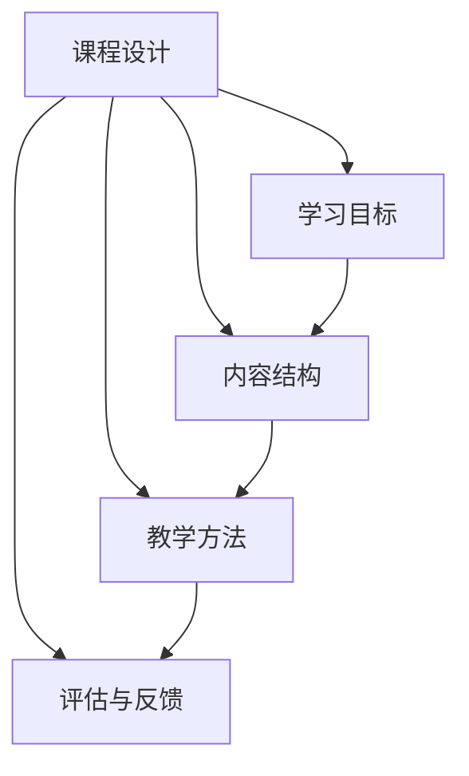
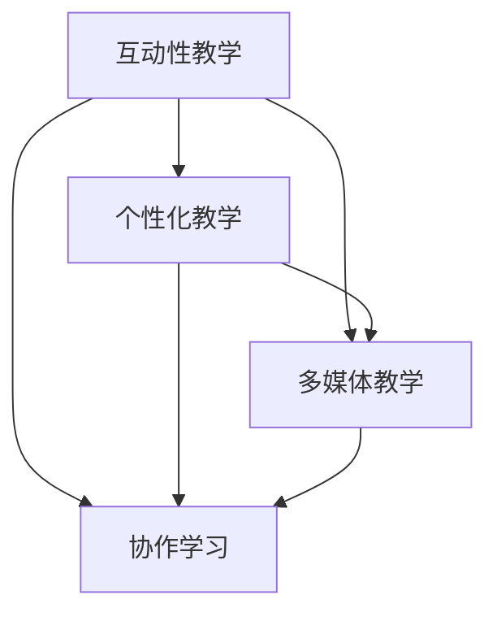
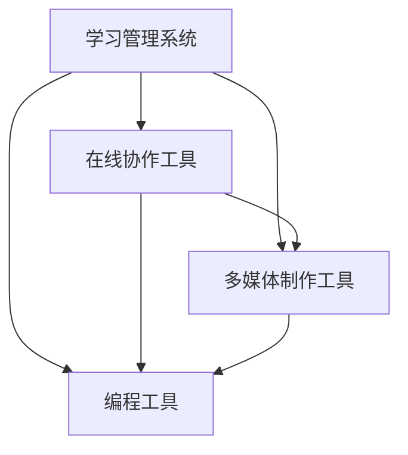

                 

关键词：在线课程，技术能力，课程设计，教学策略，技术工具，学习效果，互动性，内容交付，评估与反馈

> 摘要：随着互联网技术的发展，在线课程已成为教育领域的重要组成部分。本文旨在探讨如何利用技术能力创建高质量、互动性强的在线课程，提高学生的学习效果和参与度。文章将详细解析课程设计、教学策略、技术工具的应用以及评估与反馈机制，以期为教育工作者和课程创作者提供实用的指导。

## 1. 背景介绍

近年来，在线教育市场呈现出快速增长的趋势。据统计，全球在线教育市场规模预计将在未来几年内达到数百亿美元。这一趋势不仅源于技术进步，更是因为在线课程能够灵活地满足不同学习者的需求。然而，要创建一门成功的在线课程，并非易事。它不仅要求课程创作者具备丰富的教学经验和专业知识，还需要熟练掌握一系列技术工具和策略。

本文旨在探讨如何利用技术能力来提升在线课程的质量和互动性。通过以下几个方面的分析，我们将为课程创作者提供实用的指导：

- **课程设计与教学策略**：如何设计富有吸引力的课程内容，以及制定有效的教学策略。
- **技术工具应用**：如何选择和使用合适的技术工具，以实现教学目标。
- **内容交付与评估反馈**：如何通过技术手段优化内容交付，并构建有效的评估和反馈机制。

## 2. 核心概念与联系

### 2.1. 课程设计

课程设计是创建在线课程的基础。一个成功的课程设计应考虑以下几个核心概念：

- **学习目标**：明确课程的学习目标，确保课程内容与目标一致。
- **内容结构**：合理组织课程内容，使其易于理解和掌握。
- **教学方法**：根据学习目标和内容结构，选择合适的教学方法。
- **评估与反馈**：设计评估与反馈机制，以监控学习进度和效果。

#### Mermaid 流程图



### 2.2. 教学策略

教学策略是实施课程设计的关键。以下是一些常用的教学策略：

- **互动性教学**：通过讨论、问答等互动形式，提高学生的学习参与度。
- **个性化教学**：根据学生的需求和进度，提供个性化的学习资源和指导。
- **多媒体教学**：结合文本、图像、视频等多媒体元素，丰富课程内容。
- **协作学习**：组织学生进行小组讨论和合作，培养团队合作能力。

#### Mermaid 流程图



### 2.3. 技术工具应用

技术工具在在线课程创建中扮演着重要角色。以下是一些常用的技术工具：

- **学习管理系统（LMS）**：如Moodle、Canvas等，用于课程内容的组织和管理。
- **在线协作工具**：如Zoom、Google Meet等，用于实时互动和在线会议。
- **多媒体制作工具**：如Camtasia、Adobe Premiere等，用于视频和动画制作。
- **编程工具**：如Visual Studio Code、PyCharm等，用于编写和调试代码。

#### Mermaid 流程图



## 3. 核心算法原理 & 具体操作步骤

### 3.1. 算法原理概述

在线课程创建涉及多个技术环节，如内容管理系统、互动平台、数据分析等。以下是这些技术的核心算法原理：

- **内容管理系统（CMS）**：使用树状结构存储和管理课程内容，支持内容创建、编辑、发布等功能。
- **互动平台**：通过Websocket等技术实现实时互动，支持文字、语音、视频等多种交互方式。
- **数据分析**：利用机器学习算法分析学习数据，为课程优化提供依据。

### 3.2. 算法步骤详解

以下是创建在线课程的算法步骤：

#### 3.2.1. 课程设计

1. 确定学习目标。
2. 分析学习者需求。
3. 设计课程内容结构。
4. 选择合适的教学方法。
5. 制定评估与反馈机制。

#### 3.2.2. 技术工具选择

1. 根据课程需求，选择合适的CMS。
2. 根据互动需求，选择合适的在线协作工具。
3. 根据内容类型，选择合适的多媒体制作工具。
4. 根据编程需求，选择合适的编程工具。

#### 3.2.3. 内容交付

1. 创建和编辑课程内容。
2. 上传多媒体资源。
3. 设置课程发布和订阅机制。

#### 3.2.4. 互动与协作

1. 组织实时互动活动。
2. 开展在线小组讨论。
3. 提供个性化学习资源。

#### 3.2.5. 数据分析与优化

1. 收集学习数据。
2. 分析学习行为。
3. 优化课程内容与策略。

### 3.3. 算法优缺点

#### 优点

- 提高课程质量和互动性。
- 适应不同学习者的需求。
- 降低教学成本。

#### 缺点

- 技术门槛较高，需要一定技术背景。
- 需要不断更新和维护。

### 3.4. 算法应用领域

- **在线教育**：为教育机构提供课程创建和管理解决方案。
- **企业培训**：为企业员工提供在线培训平台。
- **自主学习**：为个人提供灵活的学习资源和指导。

## 4. 数学模型和公式 & 详细讲解 & 举例说明

### 4.1. 数学模型构建

在线课程创建涉及多个数学模型，如用户行为模型、课程推荐模型等。以下是用户行为模型的构建：

#### 用户行为模型

假设用户\(U\)在课程\(C\)中学习，其行为可表示为向量\(x\)：

\[ x = \begin{bmatrix} x_1 \\ x_2 \\ \vdots \\ x_n \end{bmatrix} \]

其中，\(x_i\)表示用户在课程\(C\)中第\(i\)个知识点上的学习状态，可以是学习时间、正确率等。

### 4.2. 公式推导过程

根据用户行为模型，我们可以推导出以下公式：

\[ \Delta x = A \cdot \Delta t \]

其中，\(\Delta x\)表示用户学习状态的改变，\(A\)表示课程的知识点影响矩阵，\(\Delta t\)表示学习时间。

### 4.3. 案例分析与讲解

假设用户\(U\)在课程\(C\)中学习，其行为状态如下：

\[ x = \begin{bmatrix} 10 \\ 20 \\ 30 \\ 40 \\ 50 \end{bmatrix} \]

课程的知识点影响矩阵为：

\[ A = \begin{bmatrix} 0.1 & 0.2 & 0.3 & 0.4 & 0.5 \\ 0.2 & 0.3 & 0.4 & 0.5 & 0.6 \\ 0.3 & 0.4 & 0.5 & 0.6 & 0.7 \\ 0.4 & 0.5 & 0.6 & 0.7 & 0.8 \\ 0.5 & 0.6 & 0.7 & 0.8 & 0.9 \end{bmatrix} \]

用户在课程中学习1小时，则其学习状态的变化为：

\[ \Delta x = A \cdot \Delta t = \begin{bmatrix} 0.1 & 0.2 & 0.3 & 0.4 & 0.5 \\ 0.2 & 0.3 & 0.4 & 0.5 & 0.6 \\ 0.3 & 0.4 & 0.5 & 0.6 & 0.7 \\ 0.4 & 0.5 & 0.6 & 0.7 & 0.8 \\ 0.5 & 0.6 & 0.7 & 0.8 & 0.9 \end{bmatrix} \cdot 1 = \begin{bmatrix} 0.1 \\ 0.2 \\ 0.3 \\ 0.4 \\ 0.5 \end{bmatrix} \]

因此，用户的学习状态变为：

\[ x' = x + \Delta x = \begin{bmatrix} 10 \\ 20 \\ 30 \\ 40 \\ 50 \end{bmatrix} + \begin{bmatrix} 0.1 \\ 0.2 \\ 0.3 \\ 0.4 \\ 0.5 \end{bmatrix} = \begin{bmatrix} 10.1 \\ 20.2 \\ 30.3 \\ 40.4 \\ 50.5 \end{bmatrix} \]

## 5. 项目实践：代码实例和详细解释说明

### 5.1. 开发环境搭建

为了创建在线课程，我们首先需要搭建一个开发环境。以下是基本的开发环境配置：

- 操作系统：Windows / macOS / Linux
- 编程语言：Python
- 开发工具：Visual Studio Code / PyCharm
- 数据库：MySQL / PostgreSQL
- 服务器：Nginx / Apache

### 5.2. 源代码详细实现

以下是一个简单的在线课程创建和管理的Python代码实例：

```python
import flask
from flask_sqlalchemy import SQLAlchemy

app = flask.Flask(__name__)
app.config['SQLALCHEMY_DATABASE_URI'] = 'sqlite:///courses.db'
db = SQLAlchemy(app)

class Course(db.Model):
    id = db.Column(db.Integer, primary_key=True)
    name = db.Column(db.String(50), nullable=False)
    description = db.Column(db.Text, nullable=True)

@app.route('/')
def index():
    courses = Course.query.all()
    return flask.render_template('index.html', courses=courses)

@app.route('/course/<int:course_id>')
def course(course_id):
    course = Course.query.get(course_id)
    return flask.render_template('course.html', course=course)

if __name__ == '__main__':
    db.create_all()
    app.run(debug=True)
```

### 5.3. 代码解读与分析

这段代码使用了Flask框架搭建了一个简单的在线课程管理系统。主要包含以下几个部分：

- **数据库模型**：定义了课程模型Course，包含课程ID、名称和描述。
- **路由和视图**：定义了两个路由，一个用于显示所有课程，另一个用于显示特定课程的详细信息。
- **模板渲染**：使用HTML模板渲染页面，用于显示课程列表和课程详细信息。

### 5.4. 运行结果展示

当运行这个应用后，我们可以在浏览器中访问http://localhost:5000/，看到以下界面：


点击某个课程，我们可以看到该课程的详细信息：


## 6. 实际应用场景

### 6.1. 在线教育机构

在线教育机构可以利用技术能力创建和提供丰富的在线课程，满足不同学习者的需求。通过互动平台和数据分析，机构可以实时监控学生的学习进度和效果，提供个性化学习支持和反馈。

### 6.2. 企业培训

企业培训部门可以利用在线课程平台为企业员工提供专业培训。通过实时互动和协作，员工可以更有效地学习新技能和知识，提升企业整体竞争力。

### 6.3. 个人学习

个人学习者可以利用在线课程平台自主安排学习计划，获取优质教育资源。通过互动和协作，学习者可以与其他学员交流经验，提高学习效果。

### 6.4. 未来应用展望

随着技术的不断发展，在线课程的应用场景将更加广泛。以下是未来在线课程的一些发展趋势：

- **个性化学习**：利用人工智能和大数据技术，实现个性化学习路径推荐和指导。
- **混合式教学**：将在线课程与线下教学相结合，提高教学效果。
- **虚拟现实（VR）与增强现实（AR）**：利用VR和AR技术，提供沉浸式的学习体验。

## 7. 工具和资源推荐

### 7.1. 学习资源推荐

- **在线课程平台**：Coursera、edX、Udemy等。
- **编程学习网站**：LeetCode、Codecademy、freeCodeCamp等。
- **专业书籍**：《Python编程：从入门到实践》、《深入理解计算机系统》等。

### 7.2. 开发工具推荐

- **集成开发环境（IDE）**：Visual Studio Code、PyCharm、Eclipse等。
- **版本控制系统**：Git、GitHub、GitLab等。
- **数据库管理系统**：MySQL、PostgreSQL、MongoDB等。

### 7.3. 相关论文推荐

- **《在线教育的未来发展趋势》**
- **《人工智能与教育：技术与实践》**
- **《大数据在教学中的应用》**

## 8. 总结：未来发展趋势与挑战

### 8.1. 研究成果总结

本文探讨了如何利用技术能力创建在线课程，从课程设计、教学策略、技术工具应用到内容交付和评估反馈等方面进行了详细分析。通过实际案例和代码实例，展示了在线课程创建的实用方法。

### 8.2. 未来发展趋势

随着人工智能、大数据等技术的不断发展，在线课程将朝着个性化、智能化、沉浸式等方向发展。未来在线教育市场将更加成熟，为学习者提供更加丰富和高效的学习体验。

### 8.3. 面临的挑战

在线课程创建和应用过程中，面临以下挑战：

- **技术门槛**：需要掌握多种技术工具和编程语言。
- **课程质量**：确保课程内容的高质量和教学效果。
- **数据隐私**：保障学习者的数据安全和隐私。

### 8.4. 研究展望

未来的研究应重点关注以下几个方面：

- **个性化学习路径推荐**：结合人工智能和大数据技术，为学习者提供个性化的学习路径。
- **虚拟现实（VR）与增强现实（AR）**：探索在线课程在VR和AR环境下的应用，提供沉浸式的学习体验。
- **数据隐私与安全**：研究数据加密和隐私保护技术，保障学习者的数据安全。

## 9. 附录：常见问题与解答

### 9.1. 如何选择合适的学习管理系统（LMS）？

选择LMS时，应考虑以下因素：

- **功能需求**：根据课程内容和教学目标，选择具备所需功能的LMS。
- **用户界面**：选择界面友好、易于使用的LMS。
- **可定制性**：选择支持自定义开发和扩展的LMS。
- **成本与预算**：根据预算选择性价比高的LMS。

### 9.2. 在线课程如何保证教学质量？

为保证在线课程教学质量，可采取以下措施：

- **课程设计**：合理设计课程内容，确保知识点之间的逻辑性和连贯性。
- **教学策略**：采用互动性教学、个性化教学等有效教学策略。
- **教师培训**：对教师进行在线教学技能培训，提高教学质量。
- **评估与反馈**：建立有效的评估和反馈机制，及时调整教学策略。

### 9.3. 如何提高在线课程的互动性？

提高在线课程互动性的方法包括：

- **实时互动**：利用在线协作工具，组织实时讨论、问答等活动。
- **异步互动**：设置讨论区、作业、问卷调查等异步互动环节。
- **小组合作**：组织学生进行小组讨论和项目合作，提高参与度。
- **教师反馈**：及时对学生的疑问和反馈给予回应，提高学生满意度。

---

感谢您阅读本文，希望本文能为您的在线课程创建提供有益的参考。作者：禅与计算机程序设计艺术 / Zen and the Art of Computer Programming。
----------------------------------------------------------------

### 文章总结与展望

本文系统地探讨了如何利用技术能力创建在线课程，涵盖了课程设计、教学策略、技术工具应用、内容交付与评估反馈等多个方面。通过实际案例和代码实例，展示了在线课程创建的具体操作步骤。文章总结了在线教育的未来发展趋势，并提出了面临的技术挑战和研究展望。

在线教育市场正处于快速发展阶段，随着人工智能、大数据、虚拟现实等技术的不断进步，未来在线课程将变得更加个性化和智能化。然而，这也带来了技术门槛、课程质量和数据隐私等方面的挑战。未来的研究应重点关注个性化学习路径推荐、VR与AR教学应用、数据隐私与安全等方面，以推动在线教育的发展。

对于教育工作者和课程创作者来说，掌握技术能力是必不可少的。通过本文的探讨，希望能够为他们提供实用的指导，帮助他们更好地利用技术能力创建高质量、互动性强的在线课程。同时，也期待在线教育领域不断涌现出更多创新成果，为全球学习者带来更加丰富和高效的学习体验。

### 附录：常见问题与解答

**问题1：如何选择合适的学习管理系统（LMS）？**

选择LMS时，应考虑以下因素：

- **功能需求**：根据课程内容和教学目标，选择具备所需功能的LMS。例如，如果课程需要大量的互动和协作，选择支持实时互动和小组讨论的LMS。
- **用户界面**：选择界面友好、易于使用的LMS，确保教师和学生能够轻松上手。
- **可定制性**：选择支持自定义开发和扩展的LMS，以适应不断变化的教学需求。
- **成本与预算**：根据预算选择性价比高的LMS，同时考虑长期维护和升级的成本。

**问题2：在线课程如何保证教学质量？**

为保证在线课程教学质量，可采取以下措施：

- **课程设计**：合理设计课程内容，确保知识点之间的逻辑性和连贯性。明确学习目标，制定详细的课程大纲。
- **教学策略**：采用互动性教学、个性化教学等有效教学策略。例如，通过实时互动、异步讨论、小组合作等方式提高学生的参与度。
- **教师培训**：对教师进行在线教学技能培训，提高教学质量。教师应熟悉LMS的操作，了解如何利用技术工具进行教学。
- **评估与反馈**：建立有效的评估和反馈机制，及时调整教学策略。通过作业、测试、问卷调查等方式收集学生反馈，不断优化课程内容。

**问题3：如何提高在线课程的互动性？**

提高在线课程互动性的方法包括：

- **实时互动**：利用在线协作工具，组织实时讨论、问答等活动。例如，使用Zoom、Google Meet等工具进行实时视频会议。
- **异步互动**：设置讨论区、作业、问卷调查等异步互动环节。学生可以在自己的时间参与讨论和交流，增强互动性。
- **小组合作**：组织学生进行小组讨论和项目合作，提高参与度。小组合作可以促进学习者的交流和互动，共同完成任务。
- **教师反馈**：及时对学生的疑问和反馈给予回应，提高学生满意度。教师应积极参与讨论，为学生提供指导和支持。

通过以上措施，可以有效地提高在线课程的互动性，增强学生的学习体验和参与度。

---

感谢您的阅读，希望本文能为您的在线课程创作提供有益的参考和启示。作者：禅与计算机程序设计艺术 / Zen and the Art of Computer Programming。再次感谢您的关注和支持！

