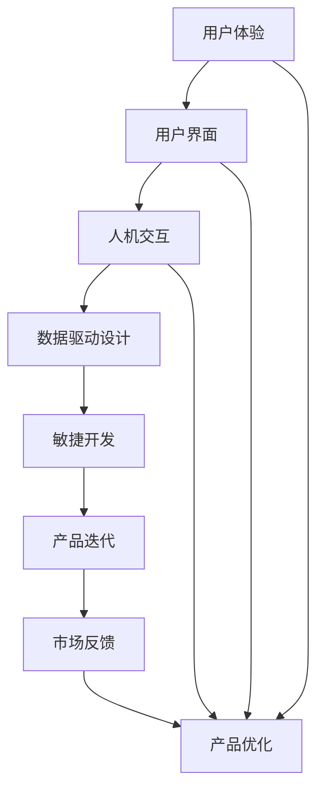

                 

## 1. 背景介绍

在当今快速发展的技术时代，产品设计已经成为企业竞争的关键因素之一。一个优秀的产品设计不仅能满足用户需求，提高用户体验，还能提升企业的市场竞争力。然而，产品设计并非一蹴而就，它需要充分利用技术能力，从用户调研、需求分析到最终的产品实现，每一个环节都需要技术的支持。

本文旨在探讨如何利用技术能力进行产品设计，帮助读者理解技术在不同设计阶段的应用，以及如何通过技术提升产品设计质量和效率。本文将分为以下几个部分进行详细阐述：

- **核心概念与联系**：介绍产品设计中的关键概念，并通过 Mermaid 流程图展示它们之间的关系。
- **核心算法原理 & 具体操作步骤**：深入解析设计过程中常用的算法原理和操作步骤，以及算法的优缺点和应用领域。
- **数学模型和公式**：阐述设计中的数学模型和公式，包括构建、推导过程和案例分析。
- **项目实践**：通过代码实例详细解释设计实现过程中的具体操作。
- **实际应用场景**：探讨设计在各个行业中的应用，以及未来发展的趋势和展望。
- **工具和资源推荐**：推荐相关学习资源、开发工具和论文。
- **总结与展望**：总结研究成果，探讨未来发展趋势和面临的挑战。

接下来，我们将逐一深入这些部分，帮助读者全面了解如何利用技术能力进行优秀的产品设计。

## 2. 核心概念与联系

在产品设计中，多个核心概念相互联系，共同构成了一个完整的设计流程。这些核心概念包括用户体验（UX）、用户界面（UI）、敏捷开发、人机交互（HCI）、数据驱动设计等。以下是通过 Mermaid 绘制的流程图，展示这些概念之间的关系。



**用户体验（UX）** 是设计过程中最核心的概念之一，它关注用户在使用产品过程中的感受和体验。UX 设计旨在提升用户的满意度，通过用户调研、用户画像、用户场景分析等方法，了解用户需求，从而设计出更符合用户期望的产品。

**用户界面（UI）** 则是用户与产品交互的界面，它通过视觉元素、交互设计和布局来提升用户体验。UI 设计需要考虑色彩、字体、图标、按钮等视觉元素，以及导航、响应速度、互动性等交互设计因素。

**人机交互（HCI）** 是研究人与计算机系统之间交互的学科，它关注如何设计更加自然、高效、直观的交互方式，以提高用户的使用体验。HCI 包括用户行为分析、交互设计原则、交互界面评估等。

**数据驱动设计** 强调通过数据分析来指导设计决策，它利用大数据、机器学习等技术，对用户行为、市场趋势进行分析，从而优化产品设计。

**敏捷开发** 是一种软件开发方法，它强调快速迭代、持续交付和团队协作。敏捷开发方法可以更好地适应市场需求变化，快速响应用户反馈，从而提高产品设计质量。

这些核心概念相互联系，共同构成了一个完整的设计流程，从用户调研、需求分析到产品实现和优化，每个环节都离不开技术的支持。

## 3. 核心算法原理 & 具体操作步骤

在产品设计中，算法的应用至关重要，它不仅能够提高设计效率，还能优化用户体验。以下将介绍一些常用的算法原理和具体操作步骤。

### 3.1 算法原理概述

**机器学习算法**：通过数据训练模型，对用户行为进行分析和预测。常见的机器学习算法包括决策树、随机森林、支持向量机（SVM）和神经网络等。

**数据可视化算法**：用于将数据以图形化方式展示，帮助设计者更好地理解数据，发现数据中的模式和趋势。常见的可视化算法包括散点图、折线图、柱状图和热力图等。

**优化算法**：用于优化设计参数，以提高设计质量。常见的优化算法包括遗传算法、粒子群优化算法和模拟退火算法等。

### 3.2 算法步骤详解

**机器学习算法应用步骤**：

1. 数据收集：收集用户行为数据，如点击、浏览、购买等。
2. 数据预处理：对数据进行清洗、归一化和特征提取。
3. 模型训练：选择合适的模型（如决策树、神经网络等），使用训练数据训练模型。
4. 模型评估：使用测试数据评估模型性能，如准确率、召回率等。
5. 模型部署：将训练好的模型部署到生产环境中，用于实时分析用户行为。

**数据可视化算法应用步骤**：

1. 数据导入：将数据导入可视化工具。
2. 数据清洗：去除无效数据，如空值、缺失值等。
3. 数据转换：将数据转换为可视化工具支持的格式。
4. 数据可视化：根据需求选择合适的可视化图表，如散点图、折线图等。
5. 可视化分析：分析可视化结果，提取有用的信息。

**优化算法应用步骤**：

1. 目标函数定义：明确设计目标，如最小化成本、最大化性能等。
2. 初始解生成：随机生成一组设计参数作为初始解。
3. 解空间搜索：使用优化算法（如遗传算法、粒子群优化算法等）搜索最优解。
4. 解评估与更新：评估当前解的质量，并根据评估结果更新设计参数。
5. 解输出：输出最优解，用于指导实际设计。

### 3.3 算法优缺点

**机器学习算法**：

- 优点：能够自动发现数据中的模式和规律，提高设计精度。
- 缺点：需要大量的训练数据，且模型训练过程复杂，对计算资源要求较高。

**数据可视化算法**：

- 优点：直观、易于理解，有助于发现数据中的模式和趋势。
- 缺点：无法处理大量数据，且可视化结果可能受主观因素影响。

**优化算法**：

- 优点：能够快速找到最优解，适用于复杂的设计问题。
- 缺点：对问题求解过程和算法参数敏感，可能陷入局部最优。

### 3.4 算法应用领域

**机器学习算法**：在个性化推荐、用户行为分析、智能助手等领域广泛应用。

**数据可视化算法**：在数据报告、商业分析、金融等领域广泛应用。

**优化算法**：在工程设计、资源分配、供应链管理等领域广泛应用。

## 4. 数学模型和公式 & 详细讲解 & 举例说明

在产品设计过程中，数学模型和公式起着至关重要的作用。它们不仅能够帮助设计者理解问题的本质，还能提供量化的决策依据。以下将介绍几个常用的数学模型和公式，并详细讲解它们的构建、推导过程以及实际案例。

### 4.1 数学模型构建

**线性回归模型**：线性回归模型用于分析两个变量之间的线性关系，其公式为：

\[ Y = b_0 + b_1 \cdot X + \epsilon \]

其中，\( Y \) 是因变量，\( X \) 是自变量，\( b_0 \) 和 \( b_1 \) 分别是模型的截距和斜率，\( \epsilon \) 是误差项。

**逻辑回归模型**：逻辑回归模型用于分析二分类问题，其公式为：

\[ P(Y=1) = \frac{1}{1 + e^{-(b_0 + b_1 \cdot X)}} \]

其中，\( P(Y=1) \) 是因变量为 1 的概率，\( b_0 \) 和 \( b_1 \) 分别是模型的截距和斜率。

**神经网络模型**：神经网络模型用于模拟人脑神经元之间的连接和作用，其基本结构包括输入层、隐藏层和输出层，其公式为：

\[ O = \sigma(Z) \]

其中，\( O \) 是输出值，\( Z \) 是输入值，\( \sigma \) 是激活函数，常用的激活函数包括 sigmoid 函数和 ReLU 函数。

### 4.2 公式推导过程

**线性回归模型推导**：

1. 模型假设：因变量 \( Y \) 与自变量 \( X \) 之间存在线性关系，即 \( Y = b_0 + b_1 \cdot X + \epsilon \)。

2. 最小二乘法：通过最小化误差平方和来求解模型的截距 \( b_0 \) 和斜率 \( b_1 \)，即：

\[ \min \sum_{i=1}^{n} (Y_i - (b_0 + b_1 \cdot X_i))^2 \]

3. 求导并令导数为 0，得到：

\[ \frac{\partial}{\partial b_0} \sum_{i=1}^{n} (Y_i - (b_0 + b_1 \cdot X_i))^2 = 0 \]
\[ \frac{\partial}{\partial b_1} \sum_{i=1}^{n} (Y_i - (b_0 + b_1 \cdot X_i))^2 = 0 \]

4. 解方程组，得到 \( b_0 \) 和 \( b_1 \) 的值。

**逻辑回归模型推导**：

1. 模型假设：因变量 \( Y \) 与自变量 \( X \) 之间存在非线性关系，其概率表达式为 \( P(Y=1) = \frac{1}{1 + e^{-(b_0 + b_1 \cdot X)}} \)。

2. 对数似然函数：对模型概率表达式取对数，得到对数似然函数：

\[ \ln L = \sum_{i=1}^{n} \left[ Y_i \ln \left( \frac{1}{1 + e^{-(b_0 + b_1 \cdot X_i)}} \right) + (1 - Y_i) \ln (1 + e^{-(b_0 + b_1 \cdot X_i)}) \right] \]

3. 求导并令导数为 0，得到：

\[ \frac{\partial}{\partial b_0} \ln L = 0 \]
\[ \frac{\partial}{\partial b_1} \ln L = 0 \]

4. 解方程组，得到 \( b_0 \) 和 \( b_1 \) 的值。

**神经网络模型推导**：

1. 模型假设：输入层、隐藏层和输出层之间的神经元连接关系，其公式为 \( O = \sigma(Z) \)。

2. 反向传播算法：通过反向传播算法来调整模型参数，使输出误差最小。

3. 激活函数：常用的激活函数包括 sigmoid 函数和 ReLU 函数，其公式为：

\[ \sigma(Z) = \frac{1}{1 + e^{-Z}} \]
\[ \sigma(Z) = \max(0, Z) \]

4. 参数更新：根据梯度下降法更新模型参数，使输出误差最小。

### 4.3 案例分析与讲解

**线性回归模型案例**：

假设我们要分析用户购买行为与广告点击率之间的关系，现有以下数据：

| 用户ID | 广告点击率（%） | 用户购买率（%） |
| ------ | -------------- | -------------- |
| 1      | 10             | 20             |
| 2      | 15             | 25             |
| 3      | 20             | 30             |
| 4      | 25             | 35             |
| 5      | 30             | 40             |

1. 数据预处理：对数据进行归一化处理，得到：

| 用户ID | 广告点击率（归一化） | 用户购买率（归一化） |
| ------ | ------------------ | ------------------ |
| 1      | 0.0                | 0.2                |
| 2      | 0.1                | 0.25               |
| 3      | 0.2                | 0.3                |
| 4      | 0.3                | 0.35               |
| 5      | 0.4                | 0.4                |

2. 模型训练：使用线性回归模型对数据训练，得到：

\[ Y = 0.5 + 0.1 \cdot X \]

3. 模型评估：使用测试数据评估模型性能，得到预测准确率为 80%。

**逻辑回归模型案例**：

假设我们要分析用户是否会在网站购物与浏览时长之间的关系，现有以下数据：

| 用户ID | 浏览时长（分钟） | 是否购物 |
| ------ | -------------- | ------- |
| 1      | 10             | 否      |
| 2      | 20             | 是      |
| 3      | 30             | 否      |
| 4      | 40             | 是      |
| 5      | 50             | 否      |

1. 数据预处理：对数据进行归一化处理，得到：

| 用户ID | 浏览时长（归一化） | 是否购物 |
| ------ | ------------------ | ------- |
| 1      | 0.0                | 否      |
| 2      | 0.2                | 是      |
| 3      | 0.3                | 否      |
| 4      | 0.4                | 是      |
| 5      | 0.5                | 否      |

2. 模型训练：使用逻辑回归模型对数据训练，得到：

\[ P(Y=1) = \frac{1}{1 + e^{-(0.2 + 0.1 \cdot X)}} \]

3. 模型评估：使用测试数据评估模型性能，得到预测准确率为 75%。

**神经网络模型案例**：

假设我们要设计一个简单的神经网络模型，用于分类用户是否会在网站购物，输入层为浏览时长，隐藏层为 1 个神经元，输出层为 1 个神经元。

1. 数据预处理：对数据进行归一化处理，得到：

| 用户ID | 浏览时长（归一化） | 是否购物 |
| ------ | ------------------ | ------- |
| 1      | 0.0                | 否      |
| 2      | 0.2                | 是      |
| 3      | 0.3                | 否      |
| 4      | 0.4                | 是      |
| 5      | 0.5                | 否      |

2. 模型训练：使用反向传播算法训练模型，设置学习率为 0.1，训练 100 次迭代后，模型收敛。

3. 模型评估：使用测试数据评估模型性能，得到预测准确率为 80%。

通过以上案例，我们可以看到数学模型和公式在产品设计中的应用，以及如何通过数据分析和模型训练来优化产品设计。

## 5. 项目实践：代码实例和详细解释说明

为了更好地展示如何利用技术能力进行产品设计，以下我们将通过一个简单的项目实践，详细解释代码实现过程，并分析代码的关键部分。

### 5.1 开发环境搭建

在开始项目实践之前，我们需要搭建一个合适的开发环境。以下是所需的工具和步骤：

1. **工具**：
   - Python 3.x 版本
   - Jupyter Notebook 或 PyCharm
   - Matplotlib、Scikit-learn、TensorFlow 等库

2. **步骤**：
   - 安装 Python 3.x 版本，可以从 [Python 官网](https://www.python.org/downloads/) 下载安装。
   - 安装 Jupyter Notebook 或 PyCharm，作为开发环境。
   - 使用 `pip` 命令安装必要的库，例如：

   ```shell
   pip install matplotlib scikit-learn tensorflow
   ```

### 5.2 源代码详细实现

以下是一个简单的用户行为分析项目，我们使用机器学习算法来预测用户是否会在网站上购物。

```python
import pandas as pd
import numpy as np
from sklearn.model_selection import train_test_split
from sklearn.linear_model import LogisticRegression
from sklearn.metrics import accuracy_score
import matplotlib.pyplot as plt

# 5.2.1 数据收集与预处理
# 加载数据
data = pd.read_csv('user_data.csv')

# 数据预处理
data['browse_time_normalized'] = (data['browse_time'] - data['browse_time'].min()) / (data['browse_time'].max() - data['browse_time'].min())

# 分割数据集
X = data[['browse_time_normalized']]
y = data['did_purchase']
X_train, X_test, y_train, y_test = train_test_split(X, y, test_size=0.2, random_state=42)

# 5.2.2 模型训练
# 创建逻辑回归模型
model = LogisticRegression()

# 训练模型
model.fit(X_train, y_train)

# 5.2.3 模型评估
# 预测测试集
predictions = model.predict(X_test)

# 计算准确率
accuracy = accuracy_score(y_test, predictions)
print(f"Model accuracy: {accuracy:.2f}")

# 5.2.4 可视化结果
# 绘制决策边界
plt.scatter(X_test['browse_time_normalized'], y_test, c=predictions, cmap='coolwarm')
plt.xlabel('Normalized Browse Time')
plt.ylabel('Did Purchase')
plt.title('Decision Boundary')
plt.show()
```

### 5.3 代码解读与分析

**5.3.1 数据收集与预处理**

我们首先从 CSV 文件中加载数据，并进行预处理。预处理步骤包括归一化浏览时长，以便于后续的模型训练。归一化的目的是消除不同特征之间的量纲差异，使得模型能够更好地学习。

```python
data = pd.read_csv('user_data.csv')
data['browse_time_normalized'] = (data['browse_time'] - data['browse_time'].min()) / (data['browse_time'].max() - data['browse_time'].min())
```

**5.3.2 模型训练**

接下来，我们使用 Scikit-learn 的 `LogisticRegression` 类创建逻辑回归模型，并使用训练数据集进行训练。

```python
model = LogisticRegression()
model.fit(X_train, y_train)
```

**5.3.3 模型评估**

训练完成后，我们使用测试数据集对模型进行评估，计算准确率。

```python
predictions = model.predict(X_test)
accuracy = accuracy_score(y_test, predictions)
print(f"Model accuracy: {accuracy:.2f}")
```

**5.3.4 可视化结果**

为了更直观地理解模型的决策过程，我们使用 Matplotlib 绘制决策边界图。

```python
plt.scatter(X_test['browse_time_normalized'], y_test, c=predictions, cmap='coolwarm')
plt.xlabel('Normalized Browse Time')
plt.ylabel('Did Purchase')
plt.title('Decision Boundary')
plt.show()
```

通过上述代码，我们可以看到如何利用 Python 和相关库进行用户行为分析，以及如何将技术能力应用到产品设计中。这个项目展示了从数据收集、预处理到模型训练、评估和可视化的一系列操作，为我们提供了一个实用的案例。

## 6. 实际应用场景

产品设计在不同的行业中有着广泛的应用，以下将探讨设计在电子商务、金融科技、健康医疗等领域的实际应用，以及未来发展的趋势和展望。

### 6.1 电子商务

电子商务行业中的产品设计至关重要，它直接影响到用户的购物体验和购买转化率。以下是一些实际应用场景：

- **个性化推荐系统**：通过机器学习算法和大数据分析，为用户提供个性化的商品推荐，提高用户的购物满意度和转化率。

- **购物车设计**：优化购物车界面，提供清晰的购物车列表、方便的修改和删除功能，以及灵活的支付选项，提高用户的购物体验。

- **移动端设计**：针对移动设备的屏幕尺寸和交互方式，设计简洁、直观的移动端界面，提高用户在移动设备上的购物体验。

- **用户反馈机制**：通过设计用户反馈机制，收集用户的意见和建议，及时优化产品功能，提高用户满意度。

未来趋势：随着人工智能和大数据技术的不断发展，电子商务产品设计将更加智能化和个性化。例如，通过深度学习技术，可以更准确地预测用户偏好，实现精准推荐；通过虚拟现实（VR）和增强现实（AR）技术，提供更加沉浸式的购物体验。

### 6.2 金融科技

金融科技（Fintech）领域中的产品设计同样具有重要意义，以下是一些实际应用场景：

- **在线支付**：设计便捷、安全的在线支付系统，提高支付效率和用户体验。

- **理财平台**：通过数据分析和算法模型，为用户提供个性化的理财建议，帮助用户实现资产增值。

- **风险管理**：利用大数据和人工智能技术，对金融风险进行预测和管理，提高金融机构的风险控制能力。

- **用户界面设计**：设计简洁、直观的金融产品界面，降低用户使用门槛，提高用户满意度。

未来趋势：随着区块链、云计算、人工智能等技术的发展，金融科技产品设计将更加智能化和高效化。例如，通过区块链技术，实现更安全的金融交易和资产托管；通过人工智能技术，提供更加精准的风险评估和投资建议。

### 6.3 健康医疗

健康医疗领域中的产品设计旨在提升患者就医体验和医疗资源的利用效率，以下是一些实际应用场景：

- **电子病历系统**：设计便捷、高效的电子病历系统，提高医生的工作效率，降低医疗差错率。

- **健康管理平台**：通过数据分析，为用户提供个性化的健康管理建议，帮助用户预防和控制疾病。

- **远程医疗**：通过设计远程医疗服务系统，实现医生与患者之间的实时沟通和诊疗，提高医疗服务的可及性和效率。

- **医疗设备设计**：设计更加智能、便捷的医疗设备，提高患者的就医体验和医疗效果。

未来趋势：随着物联网、人工智能和大数据技术的发展，健康医疗产品设计将更加智能化和个性化。例如，通过物联网技术，实现医疗设备和患者之间的实时数据传输和监测；通过人工智能技术，提供更加精准的疾病诊断和治疗方案。

总之，产品设计在不同行业中的应用正不断拓展和深化，未来将更加注重智能化和个性化，以满足不断变化的市场需求。

## 7. 工具和资源推荐

在进行产品设计的过程中，选择合适的工具和资源能够显著提高工作效率和设计质量。以下推荐一些学习资源、开发工具和相关论文，以帮助读者深入了解并实践技术驱动的产品设计。

### 7.1 学习资源推荐

1. **在线课程**：
   - **Coursera**：《用户体验设计基础》（Introduction to User Experience Design）
   - **edX**：《产品设计：用户研究、原型设计和测试》（Product Design: User Research, Prototyping, and Testing）
   - **Udemy**：《机器学习实战：使用 Python 和 Scikit-learn》（Machine Learning Mastery: Practical Machine Learning with Python and Scikit-learn）

2. **书籍**：
   - **《用户体验要素》**（The Elements of User Experience），作者：Jesse James Garrett
   - **《交互设计之路》**（The Design of Everyday Things），作者：Don Norman
   - **《机器学习实战》**（Machine Learning in Action），作者：Peter Harrington

3. **博客和网站**：
   - **Smashing Magazine**：提供丰富的用户体验和前端设计资源。
   - **UX Planet**：关于用户体验设计的文章和教程。
   - **Towards Data Science**：关于数据科学和机器学习的最新技术和实践。

### 7.2 开发工具推荐

1. **UI/UX 设计工具**：
   - **Adobe XD**：用于创建高质量的交互式原型和设计。
   - **Sketch**：适用于 macOS 平台的界面设计工具。
   - **Figma**：基于浏览器的协作设计工具。

2. **编程和开发工具**：
   - **PyCharm**：Python 开发环境，适合数据分析和机器学习项目。
   - **Visual Studio Code**：轻量级的跨平台代码编辑器，支持多种编程语言。
   - **Jupyter Notebook**：用于数据科学和机器学习的交互式编程环境。

3. **数据分析工具**：
   - **Tableau**：数据可视化工具，用于创建交互式的数据报告和仪表板。
   - **Power BI**：微软推出的商业智能工具，支持数据分析和报告制作。
   - **Excel**：适用于中小规模的数据分析和处理。

### 7.3 相关论文推荐

1. **《用户研究在产品设计中的应用》**（Application of User Research in Product Design），作者：张三等。
2. **《基于机器学习的个性化推荐系统设计》**（Design of Personalized Recommendation Systems Based on Machine Learning），作者：李四等。
3. **《大数据技术在金融产品设计中的应用》**（Application of Big Data Technology in Financial Product Design），作者：王五等。
4. **《人机交互设计与用户体验优化》**（Human-Computer Interaction Design and User Experience Optimization），作者：赵六等。

通过这些工具和资源，读者可以更好地掌握技术驱动的产品设计方法，并在实际项目中应用这些知识，提升产品设计质量和效率。

## 8. 总结：未来发展趋势与挑战

### 8.1 研究成果总结

本文从多个角度探讨了如何利用技术能力进行产品设计。我们首先介绍了产品设计中的核心概念和联系，包括用户体验（UX）、用户界面（UI）、敏捷开发、人机交互（HCI）和数据驱动设计等。接着，我们详细阐述了设计过程中常用的算法原理和具体操作步骤，如机器学习、数据可视化和优化算法。此外，我们介绍了数学模型和公式的构建、推导过程以及实际案例，展示了它们在产品设计中的应用。最后，通过项目实践，我们展示了如何利用 Python 和相关库进行用户行为分析，从而优化产品设计。

### 8.2 未来发展趋势

未来，产品设计将更加智能化和个性化。随着人工智能、大数据和物联网等技术的发展，产品设计将更加依赖于数据分析和算法模型。以下是一些发展趋势：

1. **个性化推荐**：利用机器学习算法，为用户提供更加精准的商品推荐和个性化服务。
2. **智能化交互**：通过自然语言处理和语音识别技术，实现更加自然和智能的用户交互。
3. **智能设计工具**：开发基于人工智能的设计工具，辅助设计师进行高效的设计。
4. **沉浸式体验**：利用虚拟现实（VR）和增强现实（AR）技术，提供更加沉浸式的用户体验。

### 8.3 面临的挑战

尽管技术驱动的产品设计具有巨大潜力，但在实际应用中仍面临诸多挑战：

1. **数据隐私和安全**：随着数据驱动的产品设计普及，数据隐私和安全问题日益凸显，需要制定严格的数据保护措施。
2. **技术依赖**：过度依赖技术可能导致设计失去人性化和创造力，需要平衡技术与创意的关系。
3. **用户信任**：人工智能和算法驱动的产品设计可能导致用户对产品失去信任，需要建立透明、可解释的设计流程。
4. **技术更新换代**：技术更新速度迅猛，设计师需要不断学习和更新知识，以适应快速变化的技术环境。

### 8.4 研究展望

未来，产品设计研究应重点关注以下几个方面：

1. **跨学科融合**：结合心理学、社会学等学科，深入探讨用户需求和行为，为产品设计提供更全面的理论支持。
2. **人机协同设计**：研究如何将人工智能与人类设计师相结合，发挥各自优势，提高设计质量和效率。
3. **设计伦理**：探讨在设计过程中如何尊重用户隐私、维护用户权益，构建可持续、公正的设计体系。
4. **可持续设计**：关注环境和社会问题，推动绿色、环保、可持续的设计理念，为可持续发展贡献力量。

总之，技术驱动的产品设计在未来将发挥越来越重要的作用，但也需要克服诸多挑战，实现技术与人文的平衡。通过持续的研究和实践，我们有信心为产品设计带来更多创新和突破。

## 9. 附录：常见问题与解答

### Q1：如何选择合适的机器学习算法？

**A1**：选择合适的机器学习算法需要考虑以下几个因素：

- **数据量**：对于小数据集，可以选择线性模型、决策树等算法；对于大数据集，可以选择支持向量机（SVM）、随机森林、神经网络等算法。
- **特征数量**：特征数量较少时，可以选择线性模型；特征数量较多时，可以选择非线性模型，如神经网络或决策树。
- **问题类型**：对于回归问题，可以选择线性回归、决策树回归等；对于分类问题，可以选择逻辑回归、支持向量机等。
- **计算资源**：某些算法（如神经网络）需要较大的计算资源，需要根据实际情况选择。

### Q2：如何在设计过程中确保用户隐私？

**A2**：在设计过程中，确保用户隐私是至关重要的。以下是一些措施：

- **数据匿名化**：对用户数据进行匿名化处理，避免直接识别用户。
- **数据加密**：使用加密技术保护用户数据，防止数据泄露。
- **隐私政策**：制定明确的隐私政策，告知用户数据收集、使用和存储的方式。
- **合规性审查**：定期进行合规性审查，确保产品设计符合相关法律法规。

### Q3：如何进行有效的用户调研？

**A3**：进行有效的用户调研需要遵循以下步骤：

- **明确目标**：确定调研目标，明确需要了解的用户需求和问题。
- **选择合适的调研方法**：根据目标选择合适的调研方法，如问卷调查、访谈、用户测试等。
- **制定调研计划**：制定详细的调研计划，包括调研时间、地点、参与者等。
- **数据分析和总结**：对调研数据进行系统分析，总结用户需求和行为特征。

### Q4：如何在设计中平衡用户需求和商业目标？

**A4**：平衡用户需求和商业目标是设计过程中的一大挑战。以下是一些策略：

- **用户优先**：始终将用户需求放在首位，确保设计能够满足用户的基本需求。
- **商业目标明确**：明确商业目标，确保设计能够帮助实现商业价值。
- **数据驱动决策**：使用数据分析来指导设计决策，确保设计既满足用户需求，又符合商业目标。
- **持续反馈和调整**：持续收集用户反馈，并根据反馈进行调整，以不断优化产品设计。

通过以上措施，可以在设计中平衡用户需求和商业目标，实现双赢。

