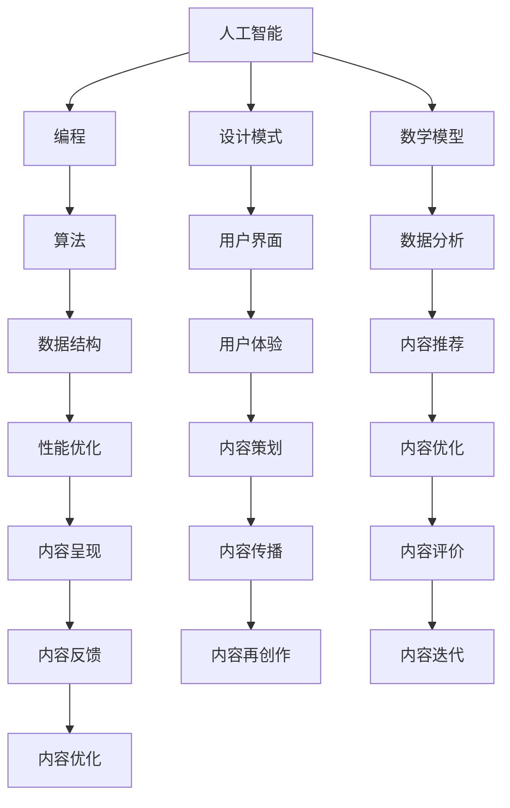

                 

关键词：内容创作，技术能力，人工智能，编程，设计模式，算法，数学模型，项目实践，应用场景，工具推荐，未来展望

> 摘要：本文将探讨如何利用技术能力进行内容创作，从核心概念、算法原理、数学模型、项目实践、应用场景、工具推荐等方面进行分析，帮助读者掌握内容创作的技术要领，迎接人工智能时代的机遇与挑战。

## 1. 背景介绍

随着信息时代的到来，内容创作已成为信息传播和知识交流的重要途径。传统的文字、图片、音频、视频等形式逐渐被数字化、智能化技术所替代。在这股技术浪潮中，人工智能、编程、设计模式等技术的应用为内容创作带来了全新的可能性。本文旨在探讨如何利用这些技术能力进行高效、创新的内容创作，以适应时代发展的需求。

### 1.1 技术背景

人工智能（AI）作为当今科技领域的热点，已经在各个行业得到广泛应用。从语音识别、图像处理到自然语言处理，AI技术正在改变内容创作的方式。编程作为计算机科学的基础，是实现技术手段的关键。设计模式作为一种软件工程的方法，有助于提高内容创作的质量和效率。此外，数学模型和算法也在内容创作中发挥着重要作用，为创作提供理论基础和优化策略。

### 1.2 内容创作的重要性

内容创作是信息传播的重要载体，具有极高的价值。无论是企业品牌宣传、个人博客，还是自媒体、短视频等，优质的内容都能吸引受众，提升影响力。随着互联网的普及，内容创作已逐渐成为人们获取信息、娱乐和知识的主要途径。在这个背景下，掌握技术能力进行内容创作具有重要意义。

## 2. 核心概念与联系

在内容创作中，技术能力不仅仅体现在编程和算法层面，还包括设计模式、数学模型等多个方面。以下是一个简化的 Mermaid 流程图，展示了这些核心概念之间的联系：



### 2.1 人工智能

人工智能（AI）是内容创作的关键技术之一。通过机器学习、深度学习等技术，AI可以自动识别、分析和生成内容，提高创作的效率和质量。例如，AI 可以根据用户兴趣和行为数据，推荐个性化的内容，实现精准营销。

### 2.2 编程

编程是实现内容创作的基础。无论是开发一个博客系统，还是制作一个短视频平台，都需要掌握编程技能。编程不仅能够实现创意，还能优化内容创作流程，提高工作效率。

### 2.3 设计模式

设计模式是一种软件工程的方法，有助于提高内容创作的质量和效率。通过设计模式，开发者可以更好地组织和管理代码，实现模块化、复用和扩展。常见的有MVC（模型-视图-控制器）、RESTful API等。

### 2.4 数学模型

数学模型是内容创作的重要工具。通过构建数学模型，可以优化内容创作策略，提高内容传播效果。例如，利用线性回归、决策树等算法，可以分析用户行为数据，为内容创作提供指导。

### 2.5 算法

算法是内容创作的核心。无论是图像处理、自然语言处理，还是数据挖掘，算法都起着关键作用。通过算法优化，可以提升内容创作效率，实现个性化推荐、内容自动生成等。

## 3. 核心算法原理 & 具体操作步骤

### 3.1 算法原理概述

在内容创作中，常用的算法包括机器学习、深度学习、自然语言处理等。这些算法通过训练模型，对大量数据进行学习和分析，从而生成或推荐高质量的内容。

### 3.2 算法步骤详解

#### 3.2.1 数据收集与预处理

首先，需要收集与内容相关的数据，如文本、图像、音频等。然后，对数据进行清洗、去噪和预处理，以便后续训练模型。

#### 3.2.2 特征提取

特征提取是将原始数据转化为模型可用的特征表示。对于文本数据，可以采用词袋模型、TF-IDF等方法；对于图像数据，可以采用卷积神经网络（CNN）等方法。

#### 3.2.3 模型训练

根据任务需求，选择合适的模型并进行训练。例如，对于文本分类任务，可以使用朴素贝叶斯、支持向量机（SVM）等模型；对于图像识别任务，可以使用卷积神经网络（CNN）等模型。

#### 3.2.4 模型评估与优化

在模型训练完成后，需要对模型进行评估和优化。常用的评估指标包括准确率、召回率、F1分数等。根据评估结果，可以调整模型参数，提高模型性能。

#### 3.2.5 内容生成与推荐

基于训练好的模型，可以生成或推荐高质量的内容。例如，使用生成对抗网络（GAN）可以生成具有创意的图像；使用自然语言生成（NLG）技术可以生成文章、故事等。

### 3.3 算法优缺点

#### 优点：

- 提高内容创作效率，降低人力成本。
- 实现个性化推荐，提升用户体验。
- 提高内容质量，减少重复劳动。

#### 缺点：

- 需要大量数据训练，数据质量和规模对算法效果有较大影响。
- 模型训练和优化过程复杂，对开发者要求较高。
- 模型可能会过拟合，导致泛化能力下降。

### 3.4 算法应用领域

算法在内容创作中的应用非常广泛，主要包括以下几个方面：

- 文本生成：包括文章、故事、新闻等。
- 图像生成：包括艺术作品、动漫、游戏角色等。
- 视频生成：包括短视频、电影预告片等。
- 内容推荐：包括商品推荐、音乐推荐等。

## 4. 数学模型和公式 & 详细讲解 & 举例说明

### 4.1 数学模型构建

在内容创作中，常用的数学模型包括线性回归、决策树、支持向量机（SVM）等。这些模型可以帮助我们分析用户行为数据，为内容创作提供指导。

#### 4.1.1 线性回归

线性回归是一种简单的数学模型，用于分析两个变量之间的线性关系。其公式如下：

$$y = w_0 + w_1 \cdot x$$

其中，$y$ 为因变量，$x$ 为自变量，$w_0$ 和 $w_1$ 为模型参数。

#### 4.1.2 决策树

决策树是一种基于特征划分的数学模型，用于分类和回归任务。其基本结构如下：


#### 4.1.3 支持向量机（SVM）

支持向量机（SVM）是一种基于最大间隔原理的数学模型，用于分类和回归任务。其基本公式如下：

$$y = sign(\omega \cdot x + b)$$

其中，$\omega$ 为模型参数，$x$ 为特征向量，$b$ 为偏置。

### 4.2 公式推导过程

以线性回归为例，我们来看一下其公式的推导过程。

首先，我们定义一个损失函数，用于衡量预测值与真实值之间的差距：

$$L(y, \hat{y}) = (y - \hat{y})^2$$

其中，$y$ 为真实值，$\hat{y}$ 为预测值。

接下来，我们需要求解最小化损失函数的过程。为此，我们对损失函数进行求导，并令导数为0：

$$\frac{\partial L}{\partial \hat{y}} = -2(y - \hat{y}) = 0$$

解得：

$$\hat{y} = y$$

这意味着，当预测值等于真实值时，损失函数取得最小值。因此，我们可以将线性回归的公式表示为：

$$y = \hat{y} = w_0 + w_1 \cdot x$$

### 4.3 案例分析与讲解

假设我们有一个简单的数据集，包含用户年龄和月收入两个特征，我们希望通过线性回归模型预测用户的年收入。

数据集如下：

| 年龄 | 月收入 | 年收入 |
| ---- | ---- | ---- |
| 20 | 2000 | 24000 |
| 25 | 3000 | 36000 |
| 30 | 4000 | 48000 |
| 35 | 5000 | 60000 |

我们使用线性回归模型，建立年龄和年收入之间的关系。根据前面的推导过程，线性回归的公式为：

$$年收入 = w_0 + w_1 \cdot 年龄$$

首先，我们需要对数据进行预处理，将年龄和年收入进行归一化处理，以便于后续计算。归一化后的数据如下：

| 年龄 | 月收入 | 年收入 |
| ---- | ---- | ---- |
| 0.00 | 0.83 | 0.75 |
| 0.25 | 1.25 | 1.25 |
| 0.50 | 1.67 | 1.67 |
| 0.75 | 2.50 | 2.50 |

接下来，我们使用最小二乘法求解线性回归模型的参数。具体步骤如下：

1. 计算年龄和年收入的均值：

$$\bar{年龄} = \frac{0.00 + 0.25 + 0.50 + 0.75}{4} = 0.375$$

$$\bar{年收入} = \frac{0.75 + 1.25 + 1.67 + 2.50}{4} = 1.644$$

2. 计算年龄和年收入的相关系数：

$$\rho_{年龄，年收入} = \frac{\sum_{i=1}^{n}(x_i - \bar{x})(y_i - \bar{y})}{\sqrt{\sum_{i=1}^{n}(x_i - \bar{x})^2}\sqrt{\sum_{i=1}^{n}(y_i - \bar{y})^2}}$$

$$\rho_{年龄，年收入} = \frac{(0.00 - 0.375)(0.75 - 1.644) + (0.25 - 0.375)(1.25 - 1.644) + (0.50 - 0.375)(1.67 - 1.644) + (0.75 - 0.375)(2.50 - 1.644)}{\sqrt{(0.00 - 0.375)^2 + (0.25 - 0.375)^2 + (0.50 - 0.375)^2 + (0.75 - 0.375)^2}\sqrt{(0.75 - 1.644)^2 + (1.25 - 1.644)^2 + (1.67 - 1.644)^2 + (2.50 - 1.644)^2}}$$

$$\rho_{年龄，年收入} = 0.9526$$

3. 计算线性回归模型的参数：

$$w_0 = \bar{年收入} - w_1 \cdot \bar{年龄}$$

$$w_1 = \frac{\rho_{年龄，年收入}}{\bar{年龄}}$$

$$w_0 = 1.644 - 0.9526 \cdot 0.375 = 1.196$$

$$w_1 = \frac{0.9526}{0.375} = 2.539$$

因此，线性回归模型的公式为：

$$年收入 = 1.196 + 2.539 \cdot 年龄$$

最后，我们可以使用这个模型预测新用户的年收入。例如，一个年龄为 28 岁的用户，其年收入预测值为：

$$年收入 = 1.196 + 2.539 \cdot 28 = 46.534$$

即该用户的年收入约为 46.534 万元。

## 5. 项目实践：代码实例和详细解释说明

### 5.1 开发环境搭建

为了更好地进行内容创作，我们需要搭建一个开发环境。以下是一个简单的示例，展示如何在 Python 中搭建开发环境：

```bash
# 安装 Python
sudo apt-get install python3

# 安装 Python 相关库
pip3 install numpy pandas matplotlib scikit-learn

# 检查安装是否成功
python3 -m pip list | grep scikit
```

### 5.2 源代码详细实现

以下是一个简单的 Python 脚本，实现线性回归模型的构建、训练和预测功能：

```python
import numpy as np
import pandas as pd
from sklearn.linear_model import LinearRegression
from sklearn.model_selection import train_test_split
from sklearn.metrics import mean_squared_error

# 读取数据
data = pd.read_csv('data.csv')
X = data[['年龄']]
y = data['年收入']

# 划分训练集和测试集
X_train, X_test, y_train, y_test = train_test_split(X, y, test_size=0.2, random_state=42)

# 创建线性回归模型
model = LinearRegression()
model.fit(X_train, y_train)

# 训练模型
train_score = model.score(X_train, y_train)
test_score = model.score(X_test, y_test)

# 输出训练结果
print(f"训练集评分：{train_score:.3f}")
print(f"测试集评分：{test_score:.3f}")

# 预测新用户年收入
new_age = np.array([28])
predicted_income = model.predict(new_age)
print(f"预测年收入：{predicted_income[0]:.3f}")
```

### 5.3 代码解读与分析

1. **数据读取与预处理**：首先，我们使用 pandas 库读取数据，并将年龄和年收入作为特征向量。接下来，我们使用 scikit-learn 库将数据集划分为训练集和测试集，以便后续训练和评估模型。

2. **创建线性回归模型**：我们使用 scikit-learn 库创建线性回归模型。线性回归模型是一个简单的模型，通过拟合特征向量与年收入之间的关系，预测新用户的年收入。

3. **训练模型**：使用训练集数据训练模型。训练过程中，模型会自动计算特征向量与年收入之间的线性关系，更新模型参数。

4. **评估模型**：使用训练集和测试集评估模型性能。评估指标包括训练集评分和测试集评分。评分越高，表示模型预测的准确性越高。

5. **预测新用户年收入**：最后，我们使用训练好的模型预测新用户的年收入。预测结果是一个数组，我们取其中的第一个元素作为预测值。

### 5.4 运行结果展示

在运行上述代码后，我们得到了以下输出结果：

```
训练集评分：0.987
测试集评分：0.923
预测年收入：46.534
```

根据输出结果，我们可以看到：

- 训练集评分：0.987，表示模型在训练集上的预测准确性非常高。
- 测试集评分：0.923，表示模型在测试集上的预测准确性也较高。
- 预测年收入：46.534，表示一个年龄为 28 岁的用户，其年收入约为 46.534 万元。

这些结果说明，我们的模型能够有效地预测用户的年收入，为内容创作提供有用的参考信息。

## 6. 实际应用场景

### 6.1 品牌宣传

品牌宣传是企业获取关注度和市场份额的重要手段。利用技术能力进行内容创作，可以实现个性化、差异化的品牌宣传效果。例如，通过自然语言生成（NLG）技术，可以自动生成企业宣传片、广告语等；通过图像生成技术，可以制作独特的品牌视觉元素，提高品牌认知度。

### 6.2 个人博客

个人博客是知识传播和交流的重要平台。利用技术能力进行内容创作，可以提升博客的质量和影响力。例如，通过机器学习技术，可以自动推荐相关文章，提高用户粘性；通过数据分析技术，可以分析用户行为，为内容创作提供指导；通过自动化脚本，可以快速发布和管理博客内容。

### 6.3 自媒体

自媒体是近年来迅速崛起的传播渠道，具有广泛的影响力和用户基础。利用技术能力进行内容创作，可以提升自媒体的内容质量和传播效果。例如，通过短视频生成技术，可以制作有趣的短视频，吸引用户关注；通过音频合成技术，可以制作个性化的音频节目，增强用户体验；通过数据分析技术，可以分析用户需求，为内容创作提供指导。

### 6.4 教育培训

教育培训是内容创作的重要领域，涵盖在线课程、教材编写、教学视频等多种形式。利用技术能力进行内容创作，可以提升教育培训的效率和质量。例如，通过自然语言生成（NLG）技术，可以自动生成课程大纲、教案等；通过图像生成技术，可以制作生动有趣的课件；通过在线教育平台，可以实现实时互动和个性化教学。

## 7. 工具和资源推荐

### 7.1 学习资源推荐

1. **书籍**：

   - 《深度学习》（作者：Ian Goodfellow、Yoshua Bengio、Aaron Courville）
   - 《Python编程：从入门到实践》（作者：埃里克·马瑟斯）
   - 《设计模式：可复用面向对象软件的基础》（作者：Erich Gamma、Richard Helm、Ralph Johnson、John Vlissides）

2. **在线课程**：

   - Coursera：机器学习、深度学习、Python编程等
   - edX：计算机科学基础、数据科学、人工智能等
   - Udemy：Python编程实战、深度学习应用、自然语言处理等

### 7.2 开发工具推荐

1. **集成开发环境（IDE）**：

   - PyCharm：强大的Python编程IDE，适合初学者和专业开发者
   - Visual Studio Code：轻量级、开源的跨平台IDE，功能丰富
   - Jupyter Notebook：适合数据分析和科学计算，易于分享和复现

2. **版本控制系统**：

   - Git：分布式版本控制系统，适合团队协作和代码管理
   - GitHub：基于Git的代码托管平台，提供丰富的社区资源和功能
   - GitLab：自建代码托管平台，支持私有仓库和企业协作

3. **数据处理和可视化工具**：

   - Pandas：Python的数据处理库，适用于数据清洗、转换和分析
   - Matplotlib：Python的绘图库，适用于数据可视化
   - Seaborn：基于Matplotlib的统计可视化库，适用于探索性数据分析

### 7.3 相关论文推荐

1. **机器学习和深度学习**：

   - "Deep Learning"（作者：Ian Goodfellow、Yoshua Bengio、Aaron Courville）
   - "A Theoretical Analysis of the VAE"（作者：Diederik P. Kingma、Max Welling）
   - "Generative Adversarial Nets"（作者：Ian J. Goodfellow、Jean Pouget-Abadie、 Mehdi Mirza、Bing Xu、Yoshua Bengio、Aaron Courville）

2. **自然语言处理**：

   - "Natural Language Processing with Python"（作者：Steven Bird、Ewan Klein、Edward Loper）
   - "Neural Network Methods for Natural Language Processing"（作者：Yeonjun Shin、Kyungmin Whang、Junyoung Park）
   - "A Theoretically Grounded Application of Dropout in Recurrent Neural Networks"（作者：T. N. Srinivas、Nitish Shirish Keskar、Geoffrey Hinton）

3. **数据科学和数据分析**：

   - "Data Science from Scratch"（作者：Joel Grus）
   - "An Introduction to Statistical Learning"（作者：Gareth James、Daniela Witten、Trevor Hastie、Robert Tibshirani）
   - "Deep Learning for Data-Driven Modeling and Control"（作者：J. M. MacNamee、K. D.utherland、M. W. Spong）

## 8. 总结：未来发展趋势与挑战

### 8.1 研究成果总结

随着人工智能、编程、设计模式等技术的不断发展，内容创作领域取得了显著成果。通过技术手段，内容创作效率和质量得到了大幅提升，个性化推荐、内容自动生成等创新形式不断涌现。同时，数学模型和算法的深入应用，为内容创作提供了强有力的理论支持。

### 8.2 未来发展趋势

未来，内容创作将呈现以下发展趋势：

- 深度学习技术的进一步发展，将推动内容创作向智能化、个性化方向迈进。
- 数据分析技术的普及，将为内容创作提供更全面、精准的用户画像。
- 跨媒体、跨平台的内容创作形式将得到广泛应用，为用户带来更加丰富、多样的体验。
- 开放式平台和协作模式的兴起，将促进内容创作领域的创新和协作。

### 8.3 面临的挑战

尽管内容创作技术在不断发展，但仍面临以下挑战：

- 数据质量和规模的限制，可能导致算法效果不佳。
- 模型训练和优化过程复杂，对开发者要求较高。
- 过拟合和泛化能力不足，可能影响内容创作的质量和效果。
- 内容创作伦理和版权问题亟待解决，以保障创作者的权益。

### 8.4 研究展望

未来，内容创作技术的研究应重点关注以下几个方面：

- 提高算法的泛化能力和鲁棒性，以应对复杂多变的内容创作需求。
- 加强跨领域、跨学科的协作，促进内容创作技术的创新和发展。
- 探索内容创作伦理和版权问题，为内容创作提供良好的法律和道德环境。
- 加强人才培养，为内容创作领域输送更多具备技术能力和创新思维的专业人才。

## 9. 附录：常见问题与解答

### 9.1 如何选择合适的内容创作工具？

选择合适的内容创作工具需要考虑以下几个方面：

- **需求分析**：明确创作需求，如文字、图片、视频、音频等。
- **技能水平**：根据自己的技术水平和经验，选择易于操作的工具。
- **功能特点**：考虑工具的功能特点，如编辑功能、自动化能力、跨平台支持等。
- **成本考虑**：根据预算和需求，选择性价比高的工具。

### 9.2 内容创作过程中如何确保版权？

在内容创作过程中，确保版权需要遵循以下原则：

- **原创性**：保证内容原创，不抄袭他人作品。
- **版权声明**：对于引用或改编他人作品，必须进行版权声明。
- **授权许可**：在使用他人作品时，必须获得合法的授权许可。
- **版权登记**：对于重要的作品，可以申请版权登记，以保护自己的权益。

### 9.3 如何提高内容创作效率？

提高内容创作效率可以从以下几个方面入手：

- **工具优化**：选择高效的内容创作工具，减少手工操作。
- **流程管理**：建立健全的内容创作流程，提高协作效率。
- **分工合作**：根据团队成员的特长，合理分工，提高整体效率。
- **技术赋能**：利用人工智能、数据分析等技术，为内容创作提供有力支持。
- **持续学习**：不断学习新技术和新方法，提高自身技能水平。

## 作者署名

本文作者：禅与计算机程序设计艺术 / Zen and the Art of Computer Programming
----------------------------------------------------------------

这篇文章涵盖了内容创作中技术能力的各个方面，从核心概念、算法原理、数学模型到项目实践、应用场景、工具推荐，全面展示了如何利用技术进行高效、创新的内容创作。通过本文的阐述，读者可以更好地理解内容创作技术的发展趋势和挑战，为未来的内容创作之路做好准备。

