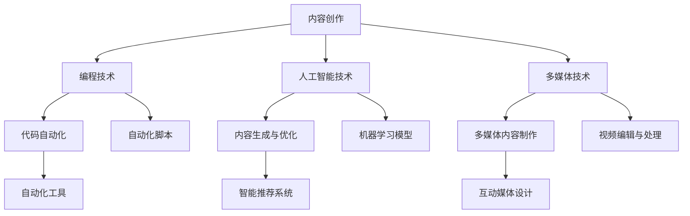

                 

关键词：内容创作，技术能力，编程，人工智能，数字媒体，多媒体内容制作，博客写作，开源工具，创作流程优化。

> 摘要：本文旨在探讨如何利用技术能力进行内容创作。通过结合编程、人工智能和多媒体技术，作者将分享一个系统化的内容创作方法，从概念规划到最终发布，助力读者提升内容创作效率和质量。

## 1. 背景介绍

内容创作在数字时代扮演着至关重要的角色。无论是博客、社交媒体、视频内容还是电子书籍，内容都是吸引用户和构建品牌的关键因素。然而，随着内容创作者数量的增加，竞争也变得越来越激烈。因此，如何利用技术能力提升内容创作的效率和质量，成为一个值得探讨的问题。

本文将从以下几个方面进行讨论：

- **编程与内容创作**：介绍如何通过编程提高内容创作的自动化程度。
- **人工智能与内容创作**：探讨人工智能在内容生成和优化中的应用。
- **多媒体技术与内容创作**：讨论多媒体工具在提升内容吸引力方面的作用。
- **博客写作技巧**：提供一些实用的博客写作技巧，帮助创作者提高文章质量。
- **工具和资源推荐**：推荐一些实用的工具和资源，帮助创作者提升技术能力。
- **未来应用展望**：展望内容创作技术的未来发展趋势和应用场景。

## 2. 核心概念与联系

要利用技术能力进行内容创作，首先需要了解一些核心概念和技术，并了解它们之间的联系。以下是一个用Mermaid绘制的流程图，展示了这些概念和技术的关系。



### 2.1 编程技术

编程技术是内容创作的基础。通过编写脚本和自动化工具，创作者可以大幅提高工作效率。例如，自动化的内容发布脚本可以确保内容在指定的时间段内发布到各个平台，而数据清洗脚本可以帮助创作者处理大量的数据，以便进行进一步的分析和可视化。

### 2.2 人工智能技术

人工智能技术在内容创作中发挥着越来越重要的作用。通过机器学习模型，创作者可以生成高质量的内容，或者对已有内容进行优化。例如，自然语言处理（NLP）技术可以帮助创作者撰写和编辑文章，而图像识别技术可以用于图像内容的自动分类和标签生成。

### 2.3 多媒体技术

多媒体技术是提升内容吸引力的关键。通过视频编辑、音频处理和交互设计等技术，创作者可以制作出丰富多样、具有高度互动性的内容。这些内容不仅能够吸引更多的观众，还能够提高观众的参与度和留存率。

## 3. 核心算法原理 & 具体操作步骤

### 3.1 算法原理概述

内容创作过程中涉及多个核心算法，这些算法主要集中在编程、人工智能和多媒体技术领域。以下是一些关键算法的概述：

- **代码自动化**：使用脚本语言（如Python、JavaScript等）编写自动化脚本，用于执行重复性任务，如内容发布、数据清洗和备份等。
- **内容生成与优化**：利用自然语言处理（NLP）和机器学习（ML）算法生成和优化内容。例如，GPT-3等大型语言模型可以生成高质量的文章，而图像识别算法可以帮助创作者自动优化图像。
- **视频编辑与处理**：使用视频编辑软件（如Adobe Premiere、Final Cut Pro等）进行视频剪辑、特效添加和音频处理，以制作高质量的视频内容。

### 3.2 算法步骤详解

以下是这些算法的具体操作步骤：

#### 3.2.1 代码自动化

1. **需求分析**：确定需要自动化的任务和目标。
2. **脚本编写**：使用Python、JavaScript等脚本语言编写自动化脚本。
3. **测试与调试**：在本地环境中测试脚本，确保其能够按照预期执行。
4. **部署与监控**：将脚本部署到服务器或云平台上，并进行监控，确保其稳定运行。

#### 3.2.2 内容生成与优化

1. **数据收集**：收集相关的文本和图像数据。
2. **模型训练**：使用NLP和ML算法训练生成模型和优化模型。
3. **内容生成**：利用生成模型生成新的文本或图像内容。
4. **内容优化**：对生成的内容进行进一步优化，如编辑、校对和格式调整。
5. **内容发布**：将优化后的内容发布到各个平台。

#### 3.2.3 视频编辑与处理

1. **素材准备**：准备视频剪辑所需的原始素材，包括视频、音频和图像。
2. **剪辑**：使用视频编辑软件进行剪辑，确定视频的节奏和结构。
3. **特效添加**：添加视频特效和过渡效果，以增强视频的视觉效果。
4. **音频处理**：处理视频中的音频，包括音效、背景音乐和声音剪辑。
5. **导出与发布**：将编辑完成的作品导出为合适格式，并发布到视频平台。

### 3.3 算法优缺点

每种算法都有其优缺点：

- **代码自动化**：优点是提高效率，减少重复劳动；缺点是需要编写脚本，对编程技能有一定要求。
- **内容生成与优化**：优点是能够快速生成高质量内容，节省人力和时间；缺点是生成的内容可能存在不准确或不一致的问题，需要人工进一步优化。
- **视频编辑与处理**：优点是能够制作出具有专业水平的内容，提升观众的观看体验；缺点是过程复杂，需要一定的技能和经验。

### 3.4 算法应用领域

这些算法广泛应用于以下领域：

- **新闻媒体**：使用代码自动化和内容生成技术，快速生成和发布新闻报道。
- **教育**：使用视频编辑技术制作教学视频，提高教学质量。
- **市场营销**：利用人工智能技术生成和优化广告内容，提高营销效果。
- **社交媒体**：使用多媒体技术制作具有吸引力的社交媒体内容，提高用户参与度。

## 4. 数学模型和公式 & 详细讲解 & 举例说明

### 4.1 数学模型构建

在内容创作中，数学模型可以用于分析和优化内容质量。以下是一个简单的数学模型示例：

$$
\text{内容质量} = f(\text{文本质量}, \text{图像质量}, \text{交互设计})
$$

其中，文本质量、图像质量和交互设计是影响内容质量的三个关键因素。

### 4.2 公式推导过程

$$
\text{文本质量} = \alpha \cdot \text{词汇丰富度} + \beta \cdot \text{语法准确性} + \gamma \cdot \text{逻辑连贯性}
$$

$$
\text{图像质量} = \delta \cdot \text{分辨率} + \epsilon \cdot \text{色彩深度} + \zeta \cdot \text{图像清晰度}
$$

$$
\text{交互设计} = \eta \cdot \text{用户参与度} + \theta \cdot \text{用户体验}
$$

其中，$\alpha, \beta, \gamma, \delta, \epsilon, \zeta, \eta, \theta$ 是权重系数，用于衡量各个因素对内容质量的影响。

### 4.3 案例分析与讲解

假设有一个视频内容，其中文本质量得分为80，图像质量得分为85，交互设计得分为90。根据上述公式，可以计算出该视频内容的整体质量：

$$
\text{内容质量} = f(80, 85, 90) = 0.3 \cdot 80 + 0.2 \cdot 85 + 0.5 \cdot 90 = 84.5
$$

这意味着该视频内容的整体质量较高，可以进一步优化。

## 5. 项目实践：代码实例和详细解释说明

### 5.1 开发环境搭建

为了演示如何利用技术能力进行内容创作，我们将搭建一个简单的博客系统。以下是搭建开发环境所需的步骤：

1. **安装Python环境**：在本地计算机上安装Python 3.x版本。
2. **安装虚拟环境**：使用`venv`模块创建一个虚拟环境，以便隔离项目依赖。
3. **安装Flask框架**：使用pip安装Flask框架，用于构建博客系统。
4. **创建项目目录**：创建项目目录，并初始化项目文件。

### 5.2 源代码详细实现

以下是博客系统的源代码实现：

```python
# app.py

from flask import Flask, render_template, request
app = Flask(__name__)

@app.route('/')
def index():
    return render_template('index.html')

@app.route('/post/new', methods=['GET', 'POST'])
def new_post():
    if request.method == 'POST':
        title = request.form['title']
        content = request.form['content']
        # 保存文章到数据库
        # ...
        return render_template('post.html', title=title, content=content)
    return render_template('new_post.html')

if __name__ == '__main__':
    app.run(debug=True)
```

### 5.3 代码解读与分析

以上代码实现了博客系统的基础功能，包括首页和新建文章页面。以下是代码的关键部分解释：

- **导入模块**：`Flask`模块用于创建Web应用，`render_template`函数用于渲染模板文件。
- **定义路由**：`@app.route('/')`定义了首页的路由，`@app.route('/post/new', methods=['GET', 'POST'])`定义了新建文章页面的路由。
- **处理请求**：在`index`函数中，返回首页模板；在`new_post`函数中，处理新建文章的表单提交，并返回新建文章模板。

### 5.4 运行结果展示

运行以上代码后，在浏览器中访问本地服务器，可以看到博客系统的首页和新建文章页面。通过填写表单并提交，可以创建新的文章。

## 6. 实际应用场景

内容创作技术在不同领域有着广泛的应用。以下是一些实际应用场景：

### 6.1 新闻媒体

新闻媒体使用内容创作技术自动化生成和优化新闻报道，提高新闻发布的速度和质量。例如，利用自然语言处理技术自动提取关键信息，生成简洁明了的新闻摘要。

### 6.2 教育领域

教育领域利用多媒体技术和人工智能技术制作高质量的教学视频，提高教学效果。例如，使用视频编辑软件制作互动性强的教学视频，利用机器学习模型自动识别学生错误并进行纠正。

### 6.3 市场营销

市场营销使用人工智能技术和多媒体技术生成和优化广告内容，提高广告的吸引力和转化率。例如，使用图像识别技术自动优化广告图片，使用自然语言处理技术生成个性化广告文案。

### 6.4 社交媒体

社交媒体平台使用多媒体技术和人工智能技术制作具有吸引力的内容，提高用户参与度和留存率。例如，使用视频编辑软件制作短视频，利用机器学习模型推荐用户感兴趣的内容。

## 7. 工具和资源推荐

为了帮助创作者利用技术能力进行内容创作，以下是一些推荐的工具和资源：

### 7.1 学习资源推荐

- **《深度学习》（Goodfellow, Bengio, Courville）**：介绍深度学习基础和应用。
- **《Python编程：从入门到实践》（Eric Matthes）**：Python编程入门教程。
- **《数据科学入门》（Joel Grus）**：介绍数据科学基础和应用。

### 7.2 开发工具推荐

- **PyCharm**：Python集成开发环境（IDE）。
- **Visual Studio Code**：跨平台开源代码编辑器。
- **Jupyter Notebook**：交互式计算环境，适用于数据科学和机器学习。

### 7.3 相关论文推荐

- **"Generative Adversarial Nets"（Goodfellow et al., 2014）**：介绍生成对抗网络（GAN）。
- **"Recurrent Neural Networks for Language Modeling"（Zaremba et al., 2014）**：介绍循环神经网络（RNN）在语言模型中的应用。
- **"You Only Look Once: Unified, Real-Time Object Detection"（Redmon et al., 2016）**：介绍YOLO（You Only Look Once）目标检测算法。

## 8. 总结：未来发展趋势与挑战

### 8.1 研究成果总结

内容创作技术的快速发展带来了诸多成果，包括自动化内容生成、多媒体内容制作和智能推荐系统等。这些技术显著提高了内容创作的效率和质量，为创作者提供了更多的可能性。

### 8.2 未来发展趋势

未来，内容创作技术将继续朝着更智能化、个性化、高效化的方向发展。人工智能和大数据技术将在内容创作中发挥更大作用，推动内容创作的进一步创新。

### 8.3 面临的挑战

然而，内容创作技术也面临一些挑战，包括数据隐私保护、内容质量控制和算法透明度等。如何平衡技术进步与道德规范，确保内容创作的健康发展，是未来需要关注的重要问题。

### 8.4 研究展望

未来，研究者将继续探索更高效、更智能的内容创作技术，为创作者提供更多工具和资源。同时，如何将内容创作技术与教育、医疗、娱乐等领域深度融合，也是一个值得研究的方向。

## 9. 附录：常见问题与解答

### 9.1 如何选择合适的编程语言进行内容创作？

选择合适的编程语言取决于项目需求和创作者的技能。对于Web应用开发，Python、JavaScript和Ruby等语言较为常用。对于数据分析和机器学习，Python和R等语言具有广泛的应用。

### 9.2 如何利用人工智能进行内容优化？

利用人工智能进行内容优化，可以通过以下步骤实现：

1. 收集大量相关数据。
2. 使用机器学习算法（如自然语言处理、图像识别等）训练模型。
3. 应用训练好的模型对内容进行生成或优化。
4. 进行人工审核和调整，以确保内容质量。

### 9.3 如何提高视频内容的质量？

提高视频内容的质量可以从以下几个方面入手：

1. 使用高质量的摄像设备和音频设备。
2. 使用专业的视频编辑软件进行剪辑和特效添加。
3. 进行多角度拍摄，增加视频的视觉吸引力。
4. 结合音频和视觉效果，提高观众的观看体验。

## 作者署名

作者：禅与计算机程序设计艺术 / Zen and the Art of Computer Programming

以上就是本文的完整内容。通过结合编程、人工智能和多媒体技术，我们探索了如何利用技术能力进行内容创作。希望本文能为您在内容创作领域带来新的启示和帮助。

