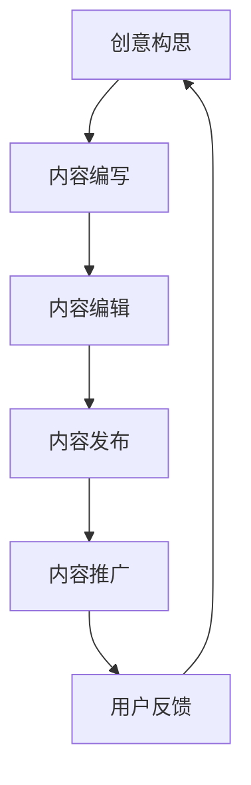

                 

 关键词：内容创作，技术能力，知识共享，创作流程，媒体平台，数据分析

> 摘要：本文旨在探讨如何利用技术能力提升内容创作的效率和质量，分析现代技术工具在创作过程中的应用，以及如何通过技术手段实现内容创作的创新。本文结构如下：

## 1. 背景介绍

内容创作是信息时代最为重要的活动之一，无论是个人博客、社交媒体、新闻媒体还是企业宣传，内容创作都是传递信息、塑造品牌、吸引受众的关键。随着互联网技术的飞速发展，内容创作的方式和工具也在不断革新。现代内容创作者需要掌握多种技术能力，以适应快速变化的市场需求和用户喜好。

### 1.1 内容创作的现状

当前，内容创作已经从传统的文字和图像形式扩展到视频、音频、虚拟现实等多媒体领域。创作者们不再仅仅依赖个人才华，而是利用各种技术工具来提升创作效率和作品质量。例如，视频编辑软件可以帮助创作者快速剪辑和美化视频，音频处理软件可以提升音频质量，AI写作工具可以帮助简化写作流程。

### 1.2 技术能力的重要性

技术能力在内容创作中的重要性体现在以下几个方面：

1. **效率提升**：技术工具可以帮助创作者自动化重复性工作，节省时间，将更多精力投入到创意和内容质量上。
2. **质量保证**：通过技术手段，创作者可以确保内容的专业性和准确性，减少人为错误。
3. **创新驱动**：新技术如虚拟现实、增强现实、AI等，为内容创作带来了新的可能性和表达方式，推动了内容创新。
4. **用户互动**：技术工具可以帮助创作者更好地理解用户需求，通过数据分析优化内容策略，提升用户体验。

## 2. 核心概念与联系

在探讨如何利用技术能力进行内容创作之前，我们需要了解几个核心概念，包括创作流程、媒体平台、数据分析等，以及它们之间的相互联系。

### 2.1 创作流程

内容创作通常包括以下步骤：

1. **创意构思**：确定内容主题、目标受众和内容形式。
2. **内容编写**：撰写文字、脚本或其他形式的内容。
3. **内容编辑**：对内容进行校对、修改和完善。
4. **内容发布**：将内容上传到合适的平台，供用户浏览。
5. **内容推广**：利用各种渠道推广内容，吸引受众。

### 2.2 媒体平台

不同的媒体平台适合不同类型的内容。例如：

1. **博客平台**：适合长篇文章、深度报道。
2. **社交媒体**：适合短篇文章、图片、视频等。
3. **视频平台**：适合视频内容，如YouTube、抖音等。
4. **新闻媒体**：适合专业新闻、时事评论。

### 2.3 数据分析

数据分析在内容创作中起着至关重要的作用：

1. **用户分析**：通过分析用户数据，了解用户喜好、行为习惯，为内容创作提供依据。
2. **内容分析**：通过分析内容表现，了解哪些内容受欢迎，哪些需要改进。
3. **渠道分析**：通过分析不同渠道的表现，优化内容推广策略。

### 2.4 Mermaid 流程图

以下是一个简化的内容创作流程的 Mermaid 流程图：



## 3. 核心算法原理 & 具体操作步骤

### 3.1 算法原理概述

内容创作过程中的核心算法通常包括以下几种：

1. **自然语言处理（NLP）**：用于生成和优化文本内容。
2. **图像识别与处理**：用于处理图片和视频内容。
3. **推荐系统**：用于推荐内容给目标受众。

### 3.2 算法步骤详解

#### 3.2.1 自然语言处理

NLP 算法的基本步骤包括：

1. **分词**：将文本分解为单词或短语。
2. **词性标注**：识别每个单词的词性。
3. **句法分析**：分析句子结构，理解句子的语法关系。
4. **语义分析**：理解句子的语义含义。

#### 3.2.2 图像识别与处理

图像识别与处理的基本步骤包括：

1. **预处理**：对图像进行缩放、裁剪、增强等操作。
2. **特征提取**：从图像中提取特征向量。
3. **分类与识别**：利用特征向量对图像进行分类和识别。

#### 3.2.3 推荐系统

推荐系统的基本步骤包括：

1. **用户画像**：分析用户行为和偏好，构建用户画像。
2. **内容特征提取**：提取内容特征，如标题、标签、关键词等。
3. **推荐算法**：根据用户画像和内容特征，利用协同过滤、基于内容的推荐等方法生成推荐结果。

### 3.3 算法优缺点

每种算法都有其优缺点：

- **NLP**：能够生成高质量的文字内容，但需要大量数据和计算资源。
- **图像识别与处理**：能够快速处理图像内容，但可能存在识别错误。
- **推荐系统**：能够提高内容推荐的相关性，但需要平衡用户隐私和数据安全。

### 3.4 算法应用领域

这些算法在内容创作中的应用领域广泛，包括：

- **内容生成**：自动生成文章、新闻、博客等。
- **内容优化**：优化标题、标签、关键词等，提高内容可见性。
- **内容推荐**：为用户提供个性化内容推荐。

## 4. 数学模型和公式 & 详细讲解 & 举例说明

### 4.1 数学模型构建

在内容创作中，数学模型主要用于分析和优化内容表现。以下是一个简单的数学模型示例：

\[ \text{影响力} = \alpha \cdot \text{内容质量} + \beta \cdot \text{用户参与度} + \gamma \cdot \text{推荐度} \]

其中，\(\alpha\)、\(\beta\)、\(\gamma\)为权重系数。

### 4.2 公式推导过程

该公式的推导过程如下：

1. **内容质量**：通过用户评价、内容丰富度、准确性等指标衡量。
2. **用户参与度**：通过用户互动行为（如点赞、评论、分享等）衡量。
3. **推荐度**：通过内容推荐算法的评分衡量。

### 4.3 案例分析与讲解

以下是一个具体案例：

- **内容质量**：一篇博客文章，平均用户评分4.5分。
- **用户参与度**：文章有100个评论，平均每个评论长度50字。
- **推荐度**：推荐算法评分8分。

代入公式：

\[ \text{影响力} = 0.5 \cdot 4.5 + 0.3 \cdot 100 + 0.2 \cdot 8 = 7.0 \]

这意味着该文章的影响力得分为7分。

## 5. 项目实践：代码实例和详细解释说明

### 5.1 开发环境搭建

为了实现内容创作中的算法应用，我们需要搭建一个开发环境。以下是一个简单的 Python 开发环境搭建步骤：

1. **安装 Python**：下载并安装 Python 3.x 版本。
2. **安装 IDE**：安装一个集成开发环境（如 PyCharm 或 VSCode）。
3. **安装库**：通过 pip 命令安装所需库，如 NLP 库（如 NLTK）、图像处理库（如 OpenCV）等。

### 5.2 源代码详细实现

以下是一个简单的 NLP 算法示例代码：

```python
import nltk
from nltk.tokenize import word_tokenize

# 加载文本
text = "This is an example sentence for tokenization."

# 分词
tokens = word_tokenize(text)

# 打印分词结果
print(tokens)
```

### 5.3 代码解读与分析

这段代码首先导入了自然语言处理库 `nltk` 和分词模块 `word_tokenize`。然后，加载了一段示例文本，使用 `word_tokenize` 函数进行分词，并打印出分词结果。

### 5.4 运行结果展示

运行代码后，输出结果如下：

```
['This', 'is', 'an', 'example', 'sentence', 'for', 'tokenization', '.']
```

这表明代码成功完成了分词任务。

## 6. 实际应用场景

### 6.1 社交媒体内容创作

在社交媒体平台上，技术能力可以帮助创作者快速生成和优化内容。例如，利用 NLP 算法生成吸引人的标题，使用图像识别与处理技术美化图片，利用推荐系统精准推荐内容给目标受众。

### 6.2 新闻媒体内容创作

新闻媒体可以利用技术手段提高内容的质量和准确性。例如，使用自然语言处理技术自动提取和验证新闻内容的关键信息，使用图像识别与处理技术对图片进行审查和优化。

### 6.3 企业宣传内容创作

企业宣传内容创作需要考虑品牌形象和用户需求。技术能力可以帮助企业快速制作高质量的宣传视频、海报等，同时通过数据分析优化宣传策略，提高宣传效果。

## 7. 工具和资源推荐

### 7.1 学习资源推荐

- 《自然语言处理入门》
- 《深度学习入门》
- 《推荐系统实践》

### 7.2 开发工具推荐

- PyCharm
- VSCode
- Jupyter Notebook

### 7.3 相关论文推荐

- "Deep Learning for Natural Language Processing"
- "Recurrent Neural Networks for Text Classification"
- "Convolutional Neural Networks for Visual Recognition"

## 8. 总结：未来发展趋势与挑战

### 8.1 研究成果总结

近年来，随着深度学习、自然语言处理、图像识别等技术的快速发展，内容创作领域取得了显著成果。这些技术不仅提高了内容创作效率，还推动了内容创新。

### 8.2 未来发展趋势

未来，内容创作将进一步融合人工智能技术，实现自动化、个性化、智能化的内容生产。此外，虚拟现实、增强现实等新技术也将为内容创作带来新的可能性。

### 8.3 面临的挑战

然而，内容创作也面临一些挑战，如数据隐私保护、内容版权问题、算法偏见等。如何平衡技术进步和伦理道德，是未来内容创作领域需要解决的重要问题。

### 8.4 研究展望

未来，内容创作领域的研究将更加注重跨学科合作，探索人工智能与其他领域的融合。同时，研究将聚焦于提高算法的透明度和可解释性，确保技术应用的公平性和可持续性。

## 9. 附录：常见问题与解答

### 9.1 问题1：如何确保内容创作的质量？

解答：通过使用技术工具，如 NLP 算法进行文本分析，图像识别与处理技术对图像进行优化，以及推荐系统进行内容推荐，可以有效提高内容创作的质量。

### 9.2 问题2：内容创作中的数据隐私如何保护？

解答：在内容创作过程中，应遵守相关数据保护法规，如 GDPR、CCPA 等。同时，可以使用数据加密、匿名化等技术手段保护用户隐私。

### 9.3 问题3：如何应对算法偏见问题？

解答：在算法设计过程中，应充分考虑多样性和公平性，避免偏见。此外，通过持续监测和评估算法性能，及时发现和纠正偏见。

----------------------------------------------------------------

本文作者：禅与计算机程序设计艺术 / Zen and the Art of Computer Programming

<|im_sep|>

