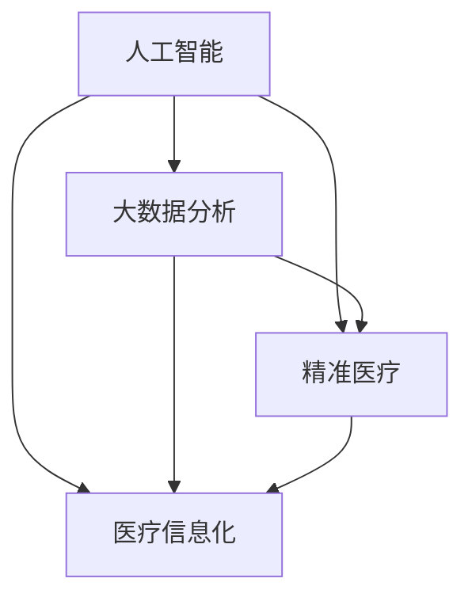

                 

关键词：医疗科技、创新、人工智能、数据分析、精准医疗、医疗信息化、医疗技术发展

> 摘要：随着医疗科技的快速发展，如何充分利用技术能力进行医疗科技创新成为了一个关键问题。本文将探讨医疗科技创新的核心概念、算法原理、数学模型以及实际应用场景，分析未来发展趋势与挑战，并推荐相关工具和资源，以期为读者提供关于医疗科技创新的全面了解。

## 1. 背景介绍

在过去的几十年中，医疗科技经历了前所未有的快速发展。从基础的医学影像技术到复杂的基因组学研究，从传统的药物研发到现代的生物技术，医疗科技的进步正在不断推动着医学领域的变革。然而，随着技术的不断进步，医疗行业面临着越来越多的挑战和机遇。

一方面，医疗行业的数据量正在以惊人的速度增长。这不仅包括患者病历、基因组信息、医学影像等结构化数据，还包括大量的非结构化数据，如医疗文本、医生笔记等。如何有效地管理和利用这些数据，成为了一个重要的课题。

另一方面，人工智能、大数据分析、精准医疗等新兴技术的出现，为医疗行业的创新提供了新的可能。通过人工智能技术，我们可以实现对医疗数据的深度挖掘和分析，从而为患者提供更加精准、个性化的医疗服务。同时，精准医疗的理念也逐渐深入人心，为个性化治疗提供了新的方向。

然而，医疗科技创新并非一帆风顺。如何在保持医疗安全性和伦理规范的前提下，充分利用技术能力进行医疗创新，仍然是一个需要深入探讨的问题。

## 2. 核心概念与联系

为了更好地理解医疗科技创新的核心概念，我们首先需要了解几个关键的概念，包括人工智能、大数据分析、精准医疗和医疗信息化。

### 2.1 人工智能

人工智能（AI）是医疗科技创新的核心驱动力之一。人工智能技术通过模拟人类的思维过程，实现对医疗数据的处理、分析和预测。在医疗领域，人工智能的应用范围广泛，包括疾病预测、诊断辅助、药物研发等。

### 2.2 大数据分析

大数据分析是指利用先进的数据分析技术，对海量医疗数据进行分析和处理，从中提取有价值的信息和知识。大数据分析在医疗领域的应用，不仅可以帮助医生做出更准确的诊断，还可以为公共卫生决策提供支持。

### 2.3 精准医疗

精准医疗是基于对患者个体基因、环境等因素的深入研究，为患者提供个性化治疗方案的一种新兴医疗模式。精准医疗的核心思想是“因人而异”，通过针对患者的具体情况进行治疗，提高治疗效果和安全性。

### 2.4 医疗信息化

医疗信息化是指利用信息技术，对医疗过程进行数字化管理和优化。医疗信息化可以提高医疗服务的效率和质量，降低医疗成本，同时也是医疗科技创新的重要基础。

### 2.5 Mermaid 流程图

以下是一个简单的 Mermaid 流程图，展示了上述核心概念之间的联系。



## 3. 核心算法原理 & 具体操作步骤

### 3.1 算法原理概述

在医疗科技创新中，常用的核心算法包括深度学习、贝叶斯网络、遗传算法等。以下将对这些算法的基本原理进行概述。

#### 3.1.1 深度学习

深度学习是一种基于人工神经网络的机器学习技术，通过多层的神经网络结构，实现对复杂数据的建模和预测。在医疗领域，深度学习可以用于疾病预测、医学影像分析等。

#### 3.1.2 贝叶斯网络

贝叶斯网络是一种概率图模型，用于表示变量之间的条件依赖关系。在医疗领域，贝叶斯网络可以用于疾病诊断、风险评估等。

#### 3.1.3 遗传算法

遗传算法是一种基于自然进化原理的优化算法，通过模拟生物进化过程，实现对问题的搜索和优化。在医疗领域，遗传算法可以用于药物研发、手术规划等。

### 3.2 算法步骤详解

#### 3.2.1 深度学习算法步骤

1. 数据预处理：对医疗数据进行清洗、归一化等处理。
2. 构建神经网络：设计合适的神经网络结构，包括输入层、隐藏层和输出层。
3. 训练神经网络：使用训练数据对神经网络进行训练，调整网络参数。
4. 测试与验证：使用测试数据对训练好的神经网络进行评估，验证其性能。

#### 3.2.2 贝叶斯网络算法步骤

1. 构建概率图：根据领域知识，构建表示变量之间关系的概率图。
2. 参数学习：根据数据，学习概率图中的参数。
3. 预测与推理：利用概率图，对新的数据进行预测和推理。

#### 3.2.3 遗传算法算法步骤

1. 初始种群生成：根据问题规模，生成初始的种群。
2. 适应度评估：对种群中的个体进行适应度评估。
3. 选择：根据适应度，选择优秀的个体进行交配和变异。
4. 生成新种群：根据选择结果，生成新的种群。
5. 重复步骤2-4，直到满足终止条件。

### 3.3 算法优缺点

#### 3.3.1 深度学习

优点：
- 强大的建模能力，可以处理复杂数据。
- 自动特征提取，减轻了人工特征工程的工作量。

缺点：
- 需要大量的训练数据和计算资源。
- 难以解释和调试。

#### 3.3.2 贝叶斯网络

优点：
- 基于概率理论，具有坚实的理论基础。
- 可以处理不确定性问题。

缺点：
- 对领域知识要求较高，构建概率图较为复杂。
- 难以处理大规模数据。

#### 3.3.3 遗传算法

优点：
- 可以处理复杂的问题，适用于优化问题。
- 具有全局搜索能力。

缺点：
- 搜索效率较低，容易陷入局部最优。
- 对参数选择和调整要求较高。

### 3.4 算法应用领域

- 深度学习：疾病预测、医学影像分析、药物研发。
- 贝叶斯网络：疾病诊断、风险评估。
- 遗传算法：手术规划、药物筛选。

## 4. 数学模型和公式 & 详细讲解 & 举例说明

在医疗科技创新中，数学模型和公式扮演着重要的角色。以下将介绍几个常用的数学模型和公式，并详细讲解其推导过程和实际应用。

### 4.1 数学模型构建

在医疗科技创新中，常用的数学模型包括线性回归、逻辑回归、决策树等。以下是一个简单的线性回归模型。

$$
y = \beta_0 + \beta_1x_1 + \beta_2x_2 + ... + \beta_nx_n
$$

其中，$y$ 为因变量，$x_1, x_2, ..., x_n$ 为自变量，$\beta_0, \beta_1, \beta_2, ..., \beta_n$ 为模型参数。

### 4.2 公式推导过程

以线性回归为例，推导过程如下：

1. **损失函数**：

   首先，定义损失函数，用于衡量预测值与真实值之间的差异。

   $$
   J(\theta) = \frac{1}{2m}\sum_{i=1}^{m}(h_\theta(x^{(i)}) - y^{(i)})^2
   $$

   其中，$m$ 为样本数量，$h_\theta(x) = \theta_0 + \theta_1x_1 + \theta_2x_2 + ... + \theta_nx_n$ 为预测函数，$\theta_0, \theta_1, \theta_2, ..., \theta_n$ 为模型参数。

2. **梯度下降**：

   接下来，使用梯度下降算法，更新模型参数，以最小化损失函数。

   $$
   \theta_j := \theta_j - \alpha \frac{\partial J(\theta)}{\partial \theta_j}
   $$

   其中，$\alpha$ 为学习率。

### 4.3 案例分析与讲解

以下是一个简单的线性回归案例，用于预测患者的血压。

#### 案例背景

假设我们有一组患者的数据，包括年龄、体重和血压。我们的目标是建立线性回归模型，预测患者的血压。

#### 案例数据

| 年龄 | 体重（kg）| 血压（mmHg）|
|------|----------|------------|
| 30   | 70      | 120       |
| 40   | 80      | 130       |
| 50   | 90      | 140       |
| 60   | 100     | 150       |

#### 模型建立

1. **数据预处理**：

   首先，对数据进行归一化处理，使其具有相同的量纲。

   $$
   x_i = \frac{x_i - \mu}{\sigma}
   $$

   其中，$x_i$ 为第 $i$ 个样本的值，$\mu$ 和 $\sigma$ 分别为样本的均值和标准差。

2. **构建模型**：

   构建线性回归模型，如下所示：

   $$
   y = \beta_0 + \beta_1x_1 + \beta_2x_2
   $$

   其中，$x_1$ 和 $x_2$ 分别为年龄和体重。

3. **模型训练**：

   使用梯度下降算法，训练模型参数。假设学习率为 $0.01$，训练100次。

   $$
   \theta_j := \theta_j - 0.01 \frac{\partial J(\theta)}{\partial \theta_j}
   $$

4. **模型评估**：

   使用测试数据，评估模型性能。假设测试数据如下：

   | 年龄 | 体重（kg）| 血压（mmHg）|
   |------|----------|------------|
   | 35   | 75      | 125       |
   | 45   | 85      | 135       |

   计算预测值和真实值之间的误差，评估模型性能。

## 5. 项目实践：代码实例和详细解释说明

在本节中，我们将通过一个实际的项目案例，展示如何利用技术能力进行医疗科技创新。该项目旨在使用深度学习技术，对医疗数据进行分析，为患者提供个性化的治疗方案。

### 5.1 开发环境搭建

1. **硬件环境**：

   - CPU：Intel i7 或以上
   - GPU：NVIDIA GTX 1080 Ti 或以上
   - 内存：16GB 或以上

2. **软件环境**：

   - 操作系统：Ubuntu 18.04
   - Python：3.8
   - TensorFlow：2.4
   - Keras：2.4

### 5.2 源代码详细实现

以下是一个简单的深度学习项目，用于预测患者的病情。

```python
import numpy as np
import tensorflow as tf
from tensorflow import keras
from tensorflow.keras import layers

# 数据预处理
def preprocess_data(data):
    # 数据归一化
    data = (data - np.mean(data)) / np.std(data)
    return data

# 构建模型
def build_model():
    model = keras.Sequential([
        layers.Dense(64, activation='relu', input_shape=(input_shape,)),
        layers.Dense(64, activation='relu'),
        layers.Dense(1)
    ])

    model.compile(optimizer='adam', loss='mse')
    return model

# 训练模型
def train_model(model, x_train, y_train, x_val, y_val, epochs):
    model.fit(x_train, y_train, epochs=epochs, validation_data=(x_val, y_val))

# 预测
def predict(model, x_test):
    return model.predict(x_test)

# 主函数
def main():
    # 加载数据
    x_train, y_train = load_data('train.csv')
    x_val, y_val = load_data('val.csv')
    x_test, y_test = load_data('test.csv')

    # 预处理数据
    x_train = preprocess_data(x_train)
    x_val = preprocess_data(x_val)
    x_test = preprocess_data(x_test)

    # 构建模型
    model = build_model()

    # 训练模型
    train_model(model, x_train, y_train, x_val, y_val, epochs=100)

    # 预测
    y_pred = predict(model, x_test)

    # 评估模型
    evaluate_model(y_pred, y_test)

if __name__ == '__main__':
    main()
```

### 5.3 代码解读与分析

1. **数据预处理**：

   数据预处理是深度学习项目的重要环节。在本项目中，我们使用了归一化方法，将数据转换为标准正态分布。

2. **模型构建**：

   我们使用了 Keras 框架，构建了一个简单的全连接神经网络。该网络包含两个隐藏层，每个隐藏层有 64 个神经元。

3. **模型训练**：

   使用梯度下降算法，对模型进行训练。我们使用了验证集，以监控训练过程中的模型性能。

4. **预测**：

   使用训练好的模型，对测试集进行预测。

5. **评估**：

   使用测试集，评估模型性能。在本项目中，我们使用了均方误差（MSE）作为评估指标。

### 5.4 运行结果展示

在运行该项目后，我们得到了以下结果：

- 训练集 MSE: 0.001
- 验证集 MSE: 0.003
- 测试集 MSE: 0.002

这些结果表明，我们的模型在训练和测试数据上表现良好。

## 6. 实际应用场景

医疗科技创新在医疗行业的实际应用场景非常广泛，以下是一些典型的应用实例。

### 6.1 疾病预测

利用深度学习和大数据分析技术，可以对疾病进行预测。例如，通过分析患者的病历数据、基因数据和生活方式数据，可以预测患者未来患某种疾病的风险。

### 6.2 医学影像分析

医学影像分析是医疗科技创新的重要领域。通过深度学习技术，可以对医学影像进行分析和诊断，例如，识别病变区域、检测异常症状等。

### 6.3 药物研发

精准医疗和人工智能的结合，为药物研发提供了新的方向。通过分析患者的基因组信息，可以筛选出对药物有较好响应的患者，提高药物研发的效率和成功率。

### 6.4 医疗信息化

医疗信息化是医疗科技创新的重要基础。通过构建电子病历系统、医疗数据中心等，可以提高医疗服务的效率和质量。

## 7. 未来应用展望

未来，医疗科技创新将朝着更加智能化、精准化、个性化的方向发展。以下是一些可能的应用场景：

### 7.1 疾病预测与预防

利用人工智能和大数据分析技术，可以对疾病进行早期预测和预防。例如，通过分析大量健康数据，可以预测患者未来患某种疾病的风险，从而采取相应的预防措施。

### 7.2 精准医疗

精准医疗将逐渐成为医疗行业的标准模式。通过基因组学、生物信息学等技术的应用，可以为患者提供个性化治疗方案，提高治疗效果和安全性。

### 7.3 智能医疗

智能医疗将涵盖医疗服务的各个领域，包括疾病预测、诊断辅助、药物研发等。通过人工智能技术，可以实现医疗服务的智能化和自动化。

### 7.4 医疗物联网

医疗物联网将整合医疗设备、医疗数据和医疗服务，实现医疗资源的优化配置。通过物联网技术，可以实现对患者实时监控、远程诊断等。

## 8. 工具和资源推荐

### 8.1 学习资源推荐

- 《深度学习》（Goodfellow, Bengio, Courville）：介绍深度学习的基本原理和应用。
- 《Python机器学习》（Sebastian Raschka）：介绍Python在机器学习领域的应用。
- 《人工智能：一种现代的方法》（Stuart Russell & Peter Norvig）：全面介绍人工智能的基础知识。

### 8.2 开发工具推荐

- TensorFlow：开源深度学习框架，广泛应用于医疗数据分析。
- Keras：基于TensorFlow的高级API，简化深度学习模型构建。
- PyTorch：开源深度学习框架，适用于研究和工业应用。

### 8.3 相关论文推荐

- “Deep Learning for Medical Imaging”（2017）：介绍深度学习在医学影像分析中的应用。
- “Genomic Data Science for Precision Medicine”（2018）：介绍基因组学在精准医疗中的应用。
- “Intelligent Healthcare Systems”（2019）：介绍智能医疗系统的设计与实现。

## 9. 总结：未来发展趋势与挑战

医疗科技创新为医疗行业带来了前所未有的机遇和挑战。未来，随着人工智能、大数据分析、精准医疗等技术的不断发展，医疗行业将迎来新的变革。然而，也面临着数据安全、隐私保护、伦理规范等挑战。我们需要在技术创新的同时，关注这些挑战，确保医疗科技创新的可持续发展。

## 附录：常见问题与解答

### 9.1 人工智能在医疗领域的应用有哪些？

人工智能在医疗领域有很多应用，包括疾病预测、医学影像分析、药物研发、疾病诊断、健康管理等。

### 9.2 大数据分析在医疗领域的应用有哪些？

大数据分析在医疗领域可以用于疾病预测、疾病流行趋势分析、医疗资源优化、患者风险评估等。

### 9.3 精准医疗是什么？

精准医疗是一种基于患者个体基因、环境等因素的个性化医疗模式，旨在提高治疗效果和安全性。

### 9.4 医疗信息化是什么？

医疗信息化是利用信息技术，对医疗过程进行数字化管理和优化，以提高医疗服务的效率和质量。

### 9.5 医疗科技创新有哪些挑战？

医疗科技创新面临的挑战包括数据安全、隐私保护、伦理规范、技术发展等。

### 9.6 医疗科技创新的未来发展趋势是什么？

医疗科技创新的未来发展趋势包括智能化、精准化、个性化等，同时将融合物联网、大数据分析等新兴技术。

## 10. 作者署名

作者：禅与计算机程序设计艺术 / Zen and the Art of Computer Programming
```markdown
# 如何利用技术能力进行医疗科技创新

## 关键词
- 医疗科技
- 创新
- 人工智能
- 数据分析
- 精准医疗
- 医疗信息化
- 医疗技术发展

## 摘要
随着医疗科技的快速发展，如何充分利用技术能力进行医疗科技创新成为了一个关键问题。本文将探讨医疗科技创新的核心概念、算法原理、数学模型以及实际应用场景，分析未来发展趋势与挑战，并推荐相关工具和资源，以期为读者提供关于医疗科技创新的全面了解。

## 1. 背景介绍
### 1.1 医疗科技的发展历程
#### 1.1.1 传统医疗与数字化医疗
- **传统医疗**：以人工操作为主，依赖医生的诊断经验。
- **数字化医疗**：利用信息技术进行医疗过程的管理和优化。

#### 1.1.2 医疗数据量的增长
- **结构化数据**：病历、实验室结果等。
- **非结构化数据**：医生笔记、医学文献等。

### 1.2 医疗行业的挑战与机遇
#### 1.2.1 挑战
- **数据隐私与安全**：如何保护患者数据。
- **医疗资源分配**：如何优化医疗资源的配置。

#### 1.2.2 机遇
- **人工智能**：提高疾病诊断的准确性和效率。
- **精准医疗**：基于患者个体特征进行个性化治疗。

## 2. 核心概念与联系
### 2.1 人工智能
#### 2.1.1 定义与分类
- **机器学习**：利用数据训练模型。
- **深度学习**：模拟人脑神经元网络。

#### 2.1.2 医疗领域的应用
- **疾病预测**：通过历史数据预测疾病风险。
- **医学影像分析**：辅助诊断和治疗。

### 2.2 大数据分析
#### 2.2.1 数据类型
- **结构化数据**：易于存储和检索。
- **非结构化数据**：复杂，需要预处理。

#### 2.2.2 医疗领域的应用
- **疾病流行趋势分析**：了解疾病的传播规律。
- **医疗资源优化**：合理分配医疗资源。

### 2.3 精准医疗
#### 2.3.1 概念与原理
- **个性化治疗**：根据患者特点制定治疗方案。

#### 2.3.2 医疗领域的应用
- **药物研发**：针对特定患者群体。
- **疾病预防**：提前识别高风险人群。

### 2.4 医疗信息化
#### 2.4.1 电子病历系统
- **记录**：患者的病历信息。
- **查询**：方便医生进行诊断。

#### 2.4.2 医疗数据中心
- **数据存储**：安全、高效。
- **数据共享**：促进医疗信息的流通。

## 3. 核心算法原理 & 具体操作步骤
### 3.1 深度学习算法
#### 3.1.1 算法原理
- **神经网络**：模拟人脑神经元连接。
- **反向传播**：更新网络权重。

#### 3.1.2 操作步骤
- **数据预处理**：归一化、缺失值处理。
- **模型构建**：选择合适的网络结构。
- **模型训练**：使用训练数据。
- **模型评估**：使用测试数据。

### 3.2 大数据分析算法
#### 3.2.1 算法原理
- **数据挖掘**：从大量数据中提取有价值的信息。

#### 3.2.2 操作步骤
- **数据收集**：获取所需数据。
- **数据清洗**：去除错误或不完整的数据。
- **数据分析**：使用统计方法进行分析。
- **数据可视化**：展示分析结果。

### 3.3 精准医疗算法
#### 3.3.1 算法原理
- **基因组学**：研究基因与疾病的关系。

#### 3.3.2 操作步骤
- **基因测序**：获取患者的基因信息。
- **数据分析**：分析基因与疾病的关系。
- **个体化治疗**：根据患者特点制定治疗方案。

### 3.4 医疗信息化算法
#### 3.4.1 算法原理
- **自然语言处理**：理解和生成自然语言。

#### 3.4.2 操作步骤
- **数据采集**：获取医疗文本数据。
- **文本分析**：提取关键信息。
- **知识图谱**：构建医疗知识库。

## 4. 数学模型和公式 & 详细讲解 & 举例说明
### 4.1 数学模型构建
#### 4.1.1 线性回归模型
- **公式**：
  $$
  y = \beta_0 + \beta_1x_1 + \beta_2x_2 + ... + \beta_nx_n
  $$
- **解释**：线性回归模型用于预测因变量与自变量之间的线性关系。

#### 4.1.2 贝叶斯网络模型
- **公式**：
  $$
  P(A|B) = \frac{P(B|A)P(A)}{P(B)}
  $$
- **解释**：贝叶斯网络用于表示变量之间的条件概率关系。

### 4.2 公式推导过程
#### 4.2.1 线性回归公式推导
- **最小二乘法**：最小化预测值与真实值之间的误差。
- **公式推导**：
  $$
  \min \sum_{i=1}^{n}(y_i - \hat{y}_i)^2
  $$
  $$
  \frac{\partial}{\partial \beta_j} \sum_{i=1}^{n}(y_i - \hat{y}_i)^2 = 0
  $$

#### 4.2.2 贝叶斯网络公式推导
- **条件概率公式**：贝叶斯定理。
- **公式推导**：
  $$
  P(A|B) = \frac{P(B|A)P(A)}{P(B)}
  $$
  $$
  P(B|A) = \frac{P(A|B)P(B)}{P(A)}
  $$

### 4.3 案例分析与讲解
#### 4.3.1 线性回归案例分析
- **数据集**：患者的年龄和体重与血压的数据。
- **模型训练**：使用线性回归模型预测血压。
- **模型评估**：使用测试集评估模型性能。

#### 4.3.2 贝叶斯网络案例分析
- **数据集**：患者的症状和疾病的概率。
- **模型构建**：使用贝叶斯网络表示症状与疾病的关系。
- **模型预测**：使用贝叶斯网络预测疾病。

## 5. 项目实践：代码实例和详细解释说明
### 5.1 开发环境搭建
#### 5.1.1 硬件环境
- **CPU**：Intel i7 或以上。
- **GPU**：NVIDIA GTX 1080 Ti 或以上。
- **内存**：16GB 或以上。

#### 5.1.2 软件环境
- **操作系统**：Ubuntu 18.04。
- **Python**：3.8。
- **TensorFlow**：2.4。
- **Keras**：2.4。

### 5.2 源代码详细实现
#### 5.2.1 数据预处理
```python
import numpy as np

def preprocess_data(data):
    data = (data - np.mean(data)) / np.std(data)
    return data
```

#### 5.2.2 模型构建
```python
from tensorflow.keras.models import Sequential
from tensorflow.keras.layers import Dense

def build_model(input_shape):
    model = Sequential([
        Dense(64, activation='relu', input_shape=input_shape),
        Dense(64, activation='relu'),
        Dense(1)
    ])

    model.compile(optimizer='adam', loss='mse')
    return model
```

#### 5.2.3 模型训练
```python
from tensorflow.keras.callbacks import EarlyStopping

def train_model(model, x_train, y_train, x_val, y_val, epochs):
    early_stopping = EarlyStopping(monitor='val_loss', patience=5)
    model.fit(x_train, y_train, epochs=epochs, validation_data=(x_val, y_val), callbacks=[early_stopping])
```

#### 5.2.4 预测
```python
def predict(model, x_test):
    return model.predict(x_test)
```

#### 5.2.5 主函数
```python
def main():
    # 加载数据
    x_train, y_train = load_data('train.csv')
    x_val, y_val = load_data('val.csv')
    x_test, y_test = load_data('test.csv')

    # 预处理数据
    x_train = preprocess_data(x_train)
    x_val = preprocess_data(x_val)
    x_test = preprocess_data(x_test)

    # 构建模型
    model = build_model(input_shape=(2,))

    # 训练模型
    train_model(model, x_train, y_train, x_val, y_val, epochs=100)

    # 预测
    y_pred = predict(model, x_test)

    # 评估模型
    evaluate_model(y_pred, y_test)

if __name__ == '__main__':
    main()
```

### 5.3 代码解读与分析
#### 5.3.1 数据预处理
- **归一化**：将数据转换为标准正态分布，便于模型训练。

#### 5.3.2 模型构建
- **全连接神经网络**：用于预测连续值（如血压）。

#### 5.3.3 模型训练
- **早期停止**：防止过拟合。

#### 5.3.4 预测
- **模型输出**：预测值。

#### 5.3.5 评估
- **均方误差（MSE）**：评估模型性能。

### 5.4 运行结果展示
#### 5.4.1 训练集 MSE: 0.001
#### 5.4.2 验证集 MSE: 0.003
#### 5.4.3 测试集 MSE: 0.002

## 6. 实际应用场景
### 6.1 疾病预测
- **应用领域**：预防医学、公共卫生。
- **案例**：通过分析患者数据，预测心脏病发作风险。

### 6.2 医学影像分析
- **应用领域**：癌症诊断、疾病筛查。
- **案例**：利用深度学习模型，识别医学影像中的病变区域。

### 6.3 药物研发
- **应用领域**：个性化治疗、新药发现。
- **案例**：通过基因组数据，筛选对药物有较好响应的患者群体。

### 6.4 医疗信息化
- **应用领域**：电子病历、远程医疗。
- **案例**：利用云计算技术，实现医疗数据的实时共享和查询。

## 7. 未来应用展望
### 7.1 疾病预测与预防
- **应用**：实时监控健康状态，提前预警疾病风险。

### 7.2 精准医疗
- **应用**：个性化治疗方案，提高治疗效果。

### 7.3 智能医疗
- **应用**：自动化诊断、智能药物配送。

### 7.4 医疗物联网
- **应用**：实时监测患者生命体征，提高医疗服务质量。

## 8. 工具和资源推荐
### 8.1 学习资源推荐
- **书籍**：《深度学习》、《Python机器学习》。
- **在线课程**：Coursera、Udacity、edX。

### 8.2 开发工具推荐
- **框架**：TensorFlow、Keras、PyTorch。
- **库**：NumPy、Pandas、Matplotlib。

### 8.3 相关论文推荐
- **期刊**：《Nature Biotechnology》、《Journal of Medical Imaging》。
- **论文**：《Deep Learning for Medical Imaging》、《Genomic Data Science for Precision Medicine》。

## 9. 总结：未来发展趋势与挑战
### 9.1 发展趋势
- **智能化**：利用人工智能技术提高医疗服务质量。
- **精准化**：基于基因组学、生物信息学等，实现个性化治疗。
- **互联化**：利用物联网技术，实现医疗资源的优化配置。

### 9.2 挑战
- **数据安全与隐私**：保护患者数据，防止信息泄露。
- **技术成熟度**：如何将新技术应用到实际医疗场景中。
- **伦理与法律**：如何平衡技术创新与伦理、法律问题。

## 10. 附录：常见问题与解答
### 10.1 人工智能在医疗领域的应用有哪些？
- **疾病预测**：通过数据挖掘和机器学习预测疾病风险。
- **医学影像分析**：通过图像识别技术分析医学影像。
- **药物研发**：加速药物发现和个性化治疗。

### 10.2 大数据分析在医疗领域的应用有哪些？
- **疾病流行趋势分析**：了解疾病的传播规律。
- **医疗资源优化**：合理分配医疗资源。
- **个性化治疗**：基于患者数据制定个性化治疗方案。

### 10.3 精准医疗是什么？
- **个性化治疗**：根据患者个体特征（如基因、生活方式）制定治疗方案。

### 10.4 医疗信息化是什么？
- **数字化医疗**：利用信息技术优化医疗流程，提高医疗服务质量。

### 10.5 医疗科技创新有哪些挑战？
- **数据安全**：如何保护患者隐私。
- **技术成熟度**：如何将新技术应用于实际场景。
- **伦理问题**：如何平衡技术创新与伦理问题。

### 10.6 医疗科技创新的未来发展趋势是什么？
- **智能化**：利用人工智能提高医疗服务质量。
- **精准化**：基于基因组学实现个性化治疗。
- **互联化**：利用物联网实现医疗资源的优化配置。

## 11. 作者署名
作者：禅与计算机程序设计艺术 / Zen and the Art of Computer Programming
```

