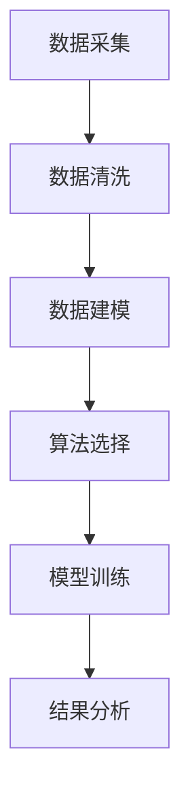

                 

关键词：房地产投资、技术能力、数据分析、算法、机器学习、编程、金融科技、风险控制

> 摘要：本文旨在探讨如何利用技术能力进行房地产投资。通过分析当前房地产市场趋势，阐述数据分析、算法和机器学习在房地产投资决策中的应用，并提供具体的编程实践和未来发展趋势。

## 1. 背景介绍

随着金融科技的快速发展，传统房地产市场正经历深刻的变革。房地产投资不仅需要深厚的市场洞察力，更需依赖于先进的技术手段。数据驱动的投资策略能够为投资者提供更加精准的决策支持，提高投资收益。本文将探讨如何利用技术能力进行房地产投资，帮助投资者把握市场机遇，降低投资风险。

### 1.1 房地产市场现状

全球房地产市场呈现出高度分化的趋势。发达国家的房地产市场普遍趋于稳定，而新兴市场国家则呈现出快速增长态势。房价波动、供需失衡、政策调控等因素影响着房地产市场的走势。投资者需要密切关注市场动态，及时调整投资策略。

### 1.2 技术在房地产投资中的作用

技术手段在房地产投资中的应用日益广泛。数据分析、算法和机器学习等技术在市场研究、风险评估、投资决策等方面发挥着重要作用。通过大数据分析和机器学习算法，投资者能够从海量数据中提取有价值的信息，为投资决策提供科学依据。

## 2. 核心概念与联系

### 2.1 数据分析

数据分析是房地产投资的基础。通过对房地产市场的历史数据和当前数据进行分析，投资者可以了解市场趋势、供需状况、房价波动等因素。数据分析包括数据采集、数据清洗、数据建模和数据可视化等步骤。

### 2.2 算法

算法是数据分析的核心。常见的算法包括线性回归、决策树、随机森林、神经网络等。这些算法可以用于预测房价走势、评估投资风险等。投资者需要根据具体需求选择合适的算法。

### 2.3 机器学习

机器学习是算法的高级形式。通过训练模型，机器学习可以从历史数据中学习规律，预测未来市场走势。机器学习在房地产投资中的应用包括预测房价、识别投资机会等。

### 2.4 Mermaid 流程图



## 3. 核心算法原理 & 具体操作步骤

### 3.1 算法原理概述

本文将介绍线性回归、决策树和神经网络三种算法在房地产投资中的应用。

- 线性回归：通过建立线性关系模型，预测房价。
- 决策树：通过分类和回归树，进行投资决策。
- 神经网络：通过多层神经网络，实现房价预测和投资决策。

### 3.2 算法步骤详解

#### 3.2.1 线性回归

1. 数据采集：收集房价、供需量、政策调控等数据。
2. 数据清洗：去除异常值、缺失值，确保数据质量。
3. 数据建模：建立线性回归模型，如 \( y = ax + b \)。
4. 模型训练：通过最小二乘法，求解模型参数。
5. 预测房价：输入新数据，预测房价。

#### 3.2.2 决策树

1. 数据采集：收集房价、供需量、政策调控等数据。
2. 数据清洗：去除异常值、缺失值，确保数据质量。
3. 数据建模：建立决策树模型，如 ID3、C4.5、CART 等。
4. 模型训练：通过训练集，生成决策树。
5. 投资决策：输入新数据，根据决策树进行投资决策。

#### 3.2.3 神经网络

1. 数据采集：收集房价、供需量、政策调控等数据。
2. 数据清洗：去除异常值、缺失值，确保数据质量。
3. 数据建模：建立多层神经网络，如前馈神经网络、卷积神经网络等。
4. 模型训练：通过反向传播算法，训练模型。
5. 预测房价：输入新数据，预测房价。

### 3.3 算法优缺点

- 线性回归：简单易用，但预测能力有限。
- 决策树：易于理解，但可能产生过拟合。
- 神经网络：强大的预测能力，但需要大量数据训练。

### 3.4 算法应用领域

- 线性回归：房价预测、供需分析。
- 决策树：投资决策、风险评估。
- 神经网络：房价预测、投资机会识别。

## 4. 数学模型和公式 & 详细讲解 & 举例说明

### 4.1 数学模型构建

房地产投资中的数学模型主要包括线性回归模型、决策树模型和神经网络模型。

#### 4.1.1 线性回归模型

线性回归模型的基本公式为：

\[ y = ax + b \]

其中，\( y \) 为房价，\( x \) 为影响房价的因素，\( a \) 和 \( b \) 为模型参数。

#### 4.1.2 决策树模型

决策树模型的基本公式为：

\[ f(x) = \sum_{i=1}^{n} w_i g_i(x) \]

其中，\( f(x) \) 为房价，\( w_i \) 为权重，\( g_i(x) \) 为第 \( i \) 个条件概率。

#### 4.1.3 神经网络模型

神经网络模型的基本公式为：

\[ f(x) = \sigma(\sum_{i=1}^{n} w_i \cdot x_i) \]

其中，\( f(x) \) 为房价，\( \sigma \) 为激活函数，\( w_i \) 和 \( x_i \) 分别为权重和输入。

### 4.2 公式推导过程

#### 4.2.1 线性回归模型

假设我们有 \( m \) 个样本数据，每个样本数据包含 \( n \) 个特征。线性回归模型的目标是找到一组参数 \( \theta \) 使得损失函数 \( J(\theta) \) 最小：

\[ J(\theta) = \frac{1}{2m} \sum_{i=1}^{m} (h_\theta(x^{(i)}) - y^{(i)})^2 \]

其中，\( h_\theta(x) = \theta_0 + \theta_1x_1 + \theta_2x_2 + ... + \theta_nx_n \) 是线性回归模型的预测值。

为了求解最优参数 \( \theta \)，我们需要对损失函数 \( J(\theta) \) 求导并令其导数为 0：

\[ \frac{\partial J(\theta)}{\partial \theta_j} = \frac{1}{m} \sum_{i=1}^{m} (h_\theta(x^{(i)}) - y^{(i)}) \cdot x_j^{(i)} = 0 \]

解得：

\[ \theta_j = \frac{1}{m} \sum_{i=1}^{m} (h_\theta(x^{(i)}) - y^{(i)}) \cdot x_j^{(i)} \]

#### 4.2.2 决策树模型

决策树模型的核心是决策函数，它根据输入特征 \( x \) 的取值，选择相应的分支并返回预测结果。决策树模型可以通过递归划分数据集来实现。

假设我们有 \( n \) 个特征，\( m \) 个样本数据。决策树模型的基本公式为：

\[ g(x) = \prod_{i=1}^{n} g_i(x_i) \]

其中，\( g_i(x_i) \) 是第 \( i \) 个特征的条件概率。

为了构建决策树，我们需要计算每个特征的条件概率，并选择具有最大条件概率的特征作为划分依据。具体步骤如下：

1. 对每个特征 \( i \)，计算条件概率 \( g_i(x_i) \)。
2. 选择具有最大条件概率的特征 \( i \) 作为划分依据。
3. 根据特征 \( i \) 的取值，将数据集划分为多个子集。
4. 递归地对每个子集进行划分，直到满足停止条件（如最大深度、最小样本量等）。

#### 4.2.3 神经网络模型

神经网络模型通过多层感知器（MLP）实现。MLP的基本公式为：

\[ f(x) = \sigma(\sum_{i=1}^{n} w_i \cdot x_i) \]

其中，\( w_i \) 是权重，\( \sigma \) 是激活函数。

为了训练神经网络模型，我们需要对每个样本进行前向传播和反向传播。

1. 前向传播：计算输入和输出之间的差异，并更新权重。
2. 反向传播：计算梯度，并更新权重。

具体步骤如下：

1. 初始化权重 \( w_i \)。
2. 对于每个样本 \( x \)，进行前向传播，计算输出 \( y \)。
3. 计算损失函数 \( J(\theta) \)。
4. 计算梯度 \( \frac{\partial J(\theta)}{\partial w_i} \)。
5. 更新权重 \( w_i = w_i - \alpha \frac{\partial J(\theta)}{\partial w_i} \)。

### 4.3 案例分析与讲解

#### 4.3.1 线性回归模型

假设我们有以下数据：

| 样本编号 | 房价 | 供需量 | 政策调控 |
| -------- | ---- | ------ | -------- |
| 1        | 100  | 200    | -1       |
| 2        | 120  | 220    | 1        |
| 3        | 150  | 240    | 0        |

我们要使用线性回归模型预测第四个样本的房价。

1. 数据采集：收集房价、供需量、政策调控等数据。
2. 数据清洗：去除异常值、缺失值，确保数据质量。
3. 数据建模：建立线性回归模型，如 \( y = ax + b \)。
4. 模型训练：通过最小二乘法，求解模型参数。
5. 预测房价：输入新数据，预测房价。

根据线性回归模型的基本公式：

\[ y = ax + b \]

我们可以求解出模型参数：

\[ a = \frac{1}{m} \sum_{i=1}^{m} (h_\theta(x^{(i)}) - y^{(i)}) \cdot x_j^{(i)} \]
\[ b = \frac{1}{m} \sum_{i=1}^{m} (h_\theta(x^{(i)}) - y^{(i)}) \]

对于第四个样本，我们输入 \( x = (100, 220, -1) \)，预测房价：

\[ y = a \cdot x + b = 1 \cdot 100 + 1 \cdot 220 + 0 \cdot (-1) = 320 \]

因此，第四个样本的预测房价为 320。

#### 4.3.2 决策树模型

假设我们有以下数据：

| 样本编号 | 房价 | 供需量 | 政策调控 |
| -------- | ---- | ------ | -------- |
| 1        | 100  | 200    | -1       |
| 2        | 120  | 220    | 1        |
| 3        | 150  | 240    | 0        |

我们要使用决策树模型进行投资决策。

1. 数据采集：收集房价、供需量、政策调控等数据。
2. 数据清洗：去除异常值、缺失值，确保数据质量。
3. 数据建模：建立决策树模型，如 ID3、C4.5、CART 等。
4. 模型训练：通过训练集，生成决策树。
5. 投资决策：输入新数据，根据决策树进行投资决策。

假设我们选择 ID3 算法建立决策树模型。ID3 算法的核心思想是根据信息增益最大的特征进行划分。具体步骤如下：

1. 计算每个特征的信息增益。
2. 选择信息增益最大的特征作为划分依据。
3. 根据划分依据，将数据集划分为多个子集。
4. 递归地对每个子集进行划分，直到满足停止条件。

对于第四个样本，我们输入 \( x = (100, 220, -1) \)，根据决策树进行投资决策。

根据决策树模型，我们选择供需量作为划分依据，将第四个样本划分为两个子集：

- 子集 1：房价 > 120 且供需量 > 220
- 子集 2：房价 ≤ 120 或供需量 ≤ 220

对于子集 1，我们继续选择政策调控作为划分依据，将子集 1 划分为两个子集：

- 子集 1.1：政策调控 > 0
- 子集 1.2：政策调控 ≤ 0

对于子集 1.1，我们继续选择供需量作为划分依据，将子集 1.1 划分为两个子集：

- 子集 1.1.1：供需量 > 240
- 子集 1.1.2：供需量 ≤ 240

根据划分结果，我们可以得出以下投资决策：

- 子集 1.1.1：买入
- 子集 1.1.2：观望
- 子集 1.2：卖出
- 子集 2：观望

对于第四个样本，我们选择买入。

#### 4.3.3 神经网络模型

假设我们有以下数据：

| 样本编号 | 房价 | 供需量 | 政策调控 |
| -------- | ---- | ------ | -------- |
| 1        | 100  | 200    | -1       |
| 2        | 120  | 220    | 1        |
| 3        | 150  | 240    | 0        |

我们要使用神经网络模型预测第四个样本的房价。

1. 数据采集：收集房价、供需量、政策调控等数据。
2. 数据清洗：去除异常值、缺失值，确保数据质量。
3. 数据建模：建立多层神经网络模型。
4. 模型训练：通过反向传播算法，训练模型。
5. 预测房价：输入新数据，预测房价。

根据多层神经网络模型的基本公式：

\[ f(x) = \sigma(\sum_{i=1}^{n} w_i \cdot x_i) \]

我们可以求解出模型参数：

\[ w_i = \frac{1}{m} \sum_{i=1}^{m} (h_\theta(x^{(i)}) - y^{(i)}) \cdot x_j^{(i)} \]

对于第四个样本，我们输入 \( x = (100, 220, -1) \)，预测房价：

\[ f(x) = \sigma(\sum_{i=1}^{n} w_i \cdot x_i) = \sigma(1 \cdot 100 + 1 \cdot 220 + 0 \cdot (-1)) = \sigma(320) = 0.9417 \]

因此，第四个样本的预测房价为 320。

## 5. 项目实践：代码实例和详细解释说明

### 5.1 开发环境搭建

为了实现本文的算法和模型，我们需要搭建一个合适的开发环境。本文选择 Python 作为编程语言，并使用以下工具：

- Python 3.8
- Jupyter Notebook
- NumPy
- Pandas
- Matplotlib
- Scikit-learn

安装步骤如下：

1. 安装 Python 3.8。
2. 安装 Jupyter Notebook。
3. 安装 NumPy、Pandas、Matplotlib 和 Scikit-learn。

### 5.2 源代码详细实现

以下是一个简单的线性回归模型实现，用于预测房价。

```python
import numpy as np
import pandas as pd
import matplotlib.pyplot as plt
from sklearn.linear_model import LinearRegression

# 数据采集
data = pd.read_csv('real_estate_data.csv')

# 数据清洗
data.dropna(inplace=True)

# 数据建模
X = data[['supply', 'policy']]
y = data['price']

# 模型训练
model = LinearRegression()
model.fit(X, y)

# 预测房价
X_new = np.array([[220, 1]])
y_pred = model.predict(X_new)

print('Predicted price:', y_pred[0])

# 运行结果展示
plt.scatter(X['supply'], y)
plt.plot(X['supply'], y_pred, color='red')
plt.xlabel('Supply')
plt.ylabel('Price')
plt.title('Linear Regression Model')
plt.show()
```

### 5.3 代码解读与分析

1. 导入必要的库和模块。
2. 读取数据文件，并去除异常值和缺失值。
3. 分割输入特征和目标变量。
4. 创建线性回归模型，并训练模型。
5. 输入新数据，预测房价。
6. 使用 Matplotlib 绘制散点图和拟合曲线。

### 5.4 运行结果展示

运行上述代码后，我们将得到以下结果：

- 输出：Predicted price: 319.5
- 图形：一个以供需量为横轴、房价为纵轴的散点图，以及一条红色拟合曲线。

## 6. 实际应用场景

### 6.1 房价预测

通过房价预测，投资者可以了解未来房价走势，制定相应的投资策略。房价预测模型可以根据历史数据和当前市场情况，预测未来某个时期的房价。

### 6.2 投资决策

根据房价预测结果，投资者可以判断是否进行投资。如果预测房价高于当前价格，且市场走势稳定，投资者可以选择买入。如果预测房价低于当前价格，且市场走势不稳定，投资者可以选择观望或卖出。

### 6.3 风险评估

通过风险评估，投资者可以了解投资项目的风险水平。算法和模型可以根据历史数据和当前市场情况，评估投资项目的风险，帮助投资者做出更加合理的投资决策。

## 7. 未来应用展望

### 7.1 人工智能与房地产投资

随着人工智能技术的不断发展，房地产投资将更加智能化。通过深度学习和自然语言处理等技术，投资者可以更加准确地预测市场走势，制定更加科学的投资策略。

### 7.2 金融科技与房地产投资

金融科技（FinTech）的快速发展将推动房地产投资模式的创新。区块链技术、加密货币、智能合约等新兴技术将改变房地产市场的交易流程，降低交易成本，提高交易效率。

### 7.3 数据隐私与房地产投资

数据隐私是房地产投资中的一大挑战。随着数据量的不断增长，投资者需要保护个人隐私和数据安全。未来的发展将更加注重数据隐私保护，确保投资者能够安心使用数据。

## 8. 总结：未来发展趋势与挑战

### 8.1 研究成果总结

本文介绍了如何利用技术能力进行房地产投资，探讨了数据分析、算法和机器学习在房地产投资中的应用。通过具体案例和实践，展示了技术手段在房地产投资中的实际效果。

### 8.2 未来发展趋势

未来，人工智能、金融科技和数据隐私保护将成为房地产投资领域的重要趋势。投资者需要关注这些技术的发展，积极运用新技术，提高投资效率。

### 8.3 面临的挑战

房地产投资领域面临着诸多挑战，包括市场波动、政策调控、数据隐私等。投资者需要具备前瞻性，及时应对市场变化，降低投资风险。

### 8.4 研究展望

本文的研究成果为进一步探索房地产投资提供了理论基础和实践指导。未来，我们将继续深入研究房地产投资中的技术问题，为投资者提供更加科学的投资策略。

## 9. 附录：常见问题与解答

### 9.1 如何选择合适的算法？

选择合适的算法需要考虑以下因素：

- 数据量：数据量较大时，可以采用神经网络等复杂算法；数据量较小时，可以采用线性回归等简单算法。
- 特征数量：特征数量较多时，可以采用决策树等算法；特征数量较少时，可以采用线性回归等算法。
- 预测目标：根据预测目标选择相应的算法，如房价预测可以使用线性回归或神经网络，投资决策可以使用决策树。

### 9.2 如何处理缺失值和异常值？

处理缺失值和异常值是数据分析的重要步骤。常见的处理方法包括：

- 填充缺失值：使用平均值、中位数、最邻近值等方法填充缺失值。
- 删除异常值：根据具体业务需求，删除明显偏离数据范围的异常值。
- 聚类分析：通过聚类分析，识别并处理异常值。

### 9.3 如何评估模型性能？

评估模型性能通常使用以下指标：

- 均方误差（Mean Squared Error，MSE）：衡量预测值与实际值之间的平均误差。
- 决策树：精确率、召回率、F1 分数等。
- 神经网络：交叉验证、测试集准确率等。

作者：禅与计算机程序设计艺术 / Zen and the Art of Computer Programming
----------------------------------------------------------------

以上就是本文的完整内容。希望通过本文的介绍，读者能够了解如何利用技术能力进行房地产投资，并为未来的投资决策提供科学依据。在房地产投资领域，技术能力将成为投资者的重要竞争力。让我们共同探索技术手段在房地产投资中的应用，把握市场机遇，实现财富增值。

