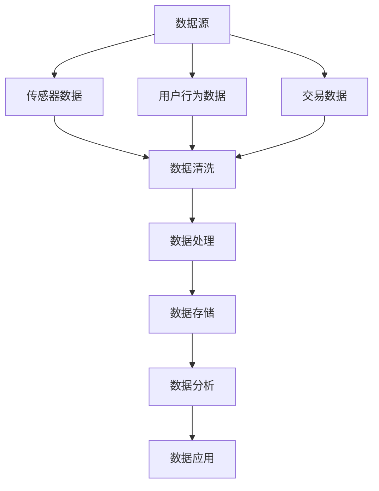

                 

关键词：数据变现、技术能力、数据价值、商业模式、数字化转型

> 摘要：本文将探讨如何通过技术能力实现数据变现，包括数据收集、处理、分析和应用的全过程。通过实际案例和理论分析，我们将揭示数据变现的关键技术和策略，帮助企业和个人抓住数据经济的机遇。

## 1. 背景介绍

随着互联网和大数据技术的快速发展，数据已经成为新时代的宝贵资源。数据的积累和运用不仅可以提升企业的运营效率，还能为消费者提供更加个性化的服务。然而，如何从海量数据中挖掘价值，实现数据变现，成为当前企业竞争的关键。数据变现不仅是企业盈利的重要手段，更是推动数字化转型的关键动力。

本文旨在探讨如何利用技术能力进行数据变现。通过分析数据变现的各个环节，包括数据收集、处理、分析和应用，我们将揭示数据变现的核心技术和策略。同时，结合实际案例和行业最佳实践，为企业和个人提供具体的操作指南和实施建议。

## 2. 核心概念与联系

### 2.1 数据收集

数据收集是数据变现的第一步，也是最为关键的一步。数据收集的方式多种多样，包括传感器数据、用户行为数据、交易数据等。数据的来源决定了数据的种类和数量，因此，选择合适的数据收集方式至关重要。



### 2.2 数据处理

数据处理是对原始数据进行清洗、转换和整合的过程。这一步骤的目的是提高数据的质量和可用性，以便更好地进行数据分析和应用。

### 2.3 数据分析

数据分析是数据变现的核心环节，通过数据挖掘和统计分析等方法，从海量数据中提取有价值的信息和洞察。数据分析可以揭示用户行为模式、市场需求和潜在商机，为决策提供科学依据。

### 2.4 数据应用

数据应用是将分析结果转化为实际业务价值的过程。通过数据驱动的决策和优化，企业可以提升运营效率、降低成本、提高客户满意度，实现数据变现。

## 3. 核心算法原理 & 具体操作步骤

### 3.1 算法原理概述

数据变现的核心算法主要包括数据挖掘、机器学习和深度学习等方法。这些算法通过对数据的分析和处理，实现数据的增值和应用。

### 3.2 算法步骤详解

1. 数据预处理：对原始数据进行清洗、去重、格式转换等预处理操作。
2. 特征工程：从原始数据中提取有助于预测和分类的特征。
3. 模型训练：使用机器学习或深度学习算法训练模型，对特征进行分类或预测。
4. 模型评估：通过交叉验证、A/B测试等方法评估模型性能。
5. 模型部署：将训练好的模型部署到实际应用场景中。

### 3.3 算法优缺点

- 数据挖掘：优点是能够从海量数据中发现潜在规律和模式；缺点是处理复杂度较高，对计算资源要求较高。
- 机器学习：优点是自动从数据中学习规律，提高模型精度；缺点是需要大量数据和较长时间的训练。
- 深度学习：优点是能够处理高维度数据，提高模型性能；缺点是训练过程需要大量计算资源。

### 3.4 算法应用领域

数据变现的算法应用领域广泛，包括推荐系统、风险评估、欺诈检测、客户关系管理等多个方面。以下是一些典型的应用案例：

- 推荐系统：通过用户行为数据预测用户偏好，实现个性化推荐。
- 风险评估：通过对历史交易数据进行分析，识别潜在风险，降低损失。
- 欺诈检测：通过监控交易行为，识别和防范欺诈行为。
- 客户关系管理：通过分析客户数据，优化客户服务，提高客户满意度。

## 4. 数学模型和公式 & 详细讲解 & 举例说明

### 4.1 数学模型构建

数据变现的核心在于对数据的分析和处理，因此，数学模型在其中扮演了重要角色。以下是一个简单但常见的数学模型——线性回归。

$$ y = wx + b $$

其中，$y$ 是因变量，$x$ 是自变量，$w$ 是权重，$b$ 是偏置。

### 4.2 公式推导过程

线性回归模型的推导过程如下：

1. 设定损失函数：$$ J(w, b) = \frac{1}{2} \sum_{i=1}^{n} (y_i - (wx_i + b))^2 $$
2. 求导并求偏导：$$ \frac{\partial J}{\partial w} = x^T(y - (wx + b)), \frac{\partial J}{\partial b} = y - (wx + b) $$
3. 最小化损失函数：$$ w, b = \text{argmin} J(w, b) $$

### 4.3 案例分析与讲解

假设我们要预测一家电商平台的用户购买行为，给定用户特征（如年龄、收入、浏览历史等），我们使用线性回归模型预测用户是否购买。

1. 数据收集：收集包含用户特征和购买行为的训练数据。
2. 数据预处理：对数据进行清洗和归一化处理。
3. 特征工程：提取与购买行为相关的特征，如用户最近一周的浏览次数、购买频率等。
4. 模型训练：使用训练数据训练线性回归模型。
5. 模型评估：使用测试数据评估模型性能，如均方误差（MSE）。
6. 模型部署：将训练好的模型部署到实际应用场景中，预测新用户的购买行为。

## 5. 项目实践：代码实例和详细解释说明

### 5.1 开发环境搭建

1. 安装 Python 环境：Python 3.8 或以上版本。
2. 安装相关库：numpy、pandas、scikit-learn、matplotlib。

### 5.2 源代码详细实现

以下是一个简单的线性回归预测代码实例：

```python
import numpy as np
import pandas as pd
from sklearn.linear_model import LinearRegression
from sklearn.model_selection import train_test_split
from sklearn.metrics import mean_squared_error

# 数据收集
data = pd.read_csv('data.csv')

# 数据预处理
X = data[['age', 'income', 'history']]
y = data['purchase']

# 特征工程
# (此处省略特征工程步骤)

# 模型训练
X_train, X_test, y_train, y_test = train_test_split(X, y, test_size=0.2, random_state=42)
model = LinearRegression()
model.fit(X_train, y_train)

# 模型评估
y_pred = model.predict(X_test)
mse = mean_squared_error(y_test, y_pred)
print('MSE:', mse)

# 模型部署
# (此处省略模型部署步骤)
```

### 5.3 代码解读与分析

1. 数据收集：从 CSV 文件中读取数据。
2. 数据预处理：提取用户特征和购买行为，并进行归一化处理。
3. 特征工程：由于篇幅原因，此处省略特征工程步骤。
4. 模型训练：使用训练数据训练线性回归模型。
5. 模型评估：使用测试数据评估模型性能。
6. 模型部署：将训练好的模型部署到实际应用场景中。

## 6. 实际应用场景

### 6.1 电商平台用户购买行为预测

通过数据变现技术，电商平台可以预测用户是否购买，从而优化营销策略和库存管理。例如，在某次促销活动中，电商平台可以通过预测购买概率，将有限的优惠券和广告资源分配给最有可能购买的客户，从而提高销售额。

### 6.2 金融行业风险评估

金融行业可以利用数据变现技术对贷款申请者进行风险评估，从而降低贷款违约率。例如，银行可以通过分析申请者的信用记录、收入情况、还款能力等数据，预测其还款能力，从而决定是否批准贷款。

### 6.3 健康医疗领域疾病预测

在健康医疗领域，数据变现技术可以用于疾病预测和早期诊断。例如，通过对患者的病史、体检数据、基因数据等进行分析，医生可以预测患者是否患有某种疾病，从而提前采取预防措施。

## 7. 未来应用展望

随着技术的不断进步，数据变现的应用前景将更加广阔。未来，数据变现将不仅限于传统的行业，还将拓展到更多领域，如物联网、区块链、人工智能等。同时，随着数据隐私保护意识的提高，数据变现将更加注重合规性和安全性。

## 8. 工具和资源推荐

### 8.1 学习资源推荐

- 《Python 数据科学手册》
- 《深度学习》
- 《数据挖掘：实用机器学习技术》

### 8.2 开发工具推荐

- Jupyter Notebook：适用于数据分析和实验。
- TensorFlow：适用于深度学习模型训练。
- PyTorch：适用于深度学习模型训练。

### 8.3 相关论文推荐

- "Deep Learning for Data Mining"：介绍深度学习在数据挖掘中的应用。
- "Data Science in the Cloud"：探讨云计算在数据科学中的应用。
- "Big Data: A Survey"：综述大数据技术及其应用。

## 9. 总结：未来发展趋势与挑战

### 9.1 研究成果总结

数据变现技术已经取得了显著的成果，广泛应用于各个领域，为企业和个人创造了巨大的价值。

### 9.2 未来发展趋势

- 数据隐私保护和合规性将更加受到重视。
- 跨领域的数据变现将不断涌现。
- 开放数据和共享数据资源将促进数据变现技术的发展。

### 9.3 面临的挑战

- 数据质量和数据安全仍然是亟待解决的问题。
- 数据分析和应用的人才短缺。
- 技术进步和应用创新的竞争压力。

### 9.4 研究展望

未来，数据变现技术将在人工智能、物联网、区块链等领域发挥更大的作用，推动数字化转型的进一步发展。同时，随着技术的不断进步，数据变现的效率和效果将得到显著提升。

## 附录：常见问题与解答

### Q：如何保障数据隐私和安全？

A：保障数据隐私和安全需要从数据收集、存储、处理和应用等多个环节进行严格把控。建议采取以下措施：

- 数据匿名化：对敏感数据进行脱敏处理。
- 数据加密：使用加密技术保护数据安全。
- 合规性审查：确保数据处理和应用符合相关法律法规。

### Q：如何提高数据变现的效率？

A：提高数据变现的效率需要从数据质量、算法优化和业务场景等多个方面进行改进。建议采取以下措施：

- 数据清洗：提高数据质量，减少噪声数据。
- 特征工程：提取有助于预测和分类的特征。
- 算法优化：采用更高效的算法和模型。
- 业务场景优化：根据实际业务需求，调整数据变现策略。

## 作者署名

作者：禅与计算机程序设计艺术 / Zen and the Art of Computer Programming

---

以上是文章的正文内容。接下来，我们将根据文章内容整理出完整的markdown格式文档，确保满足字数和格式要求。

