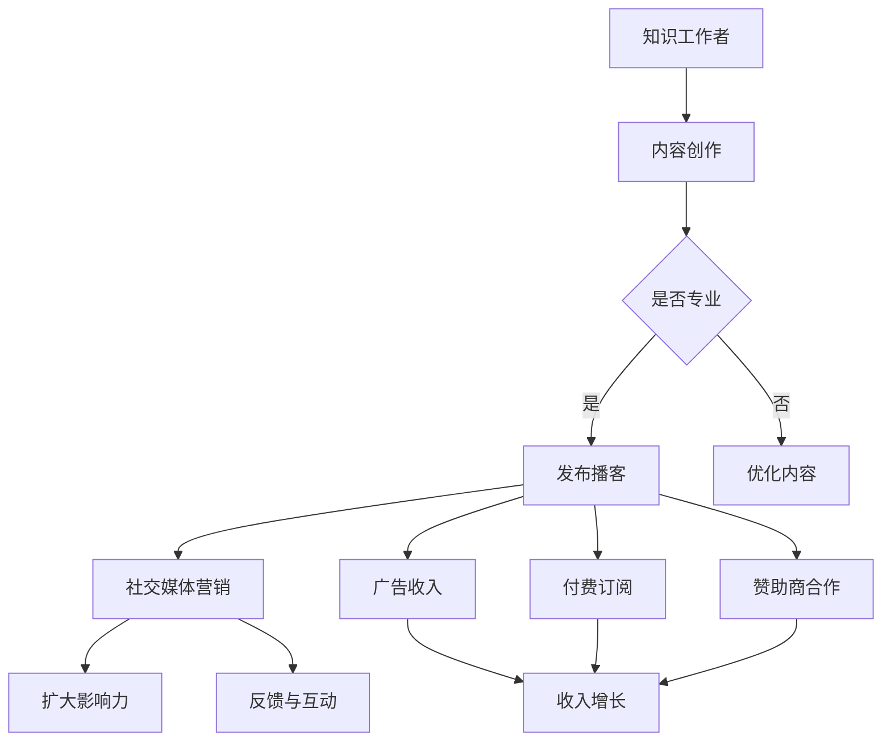

                 

关键词：播客平台，知识变现，内容创作，听众互动，社交媒体营销

摘要：本文将探讨如何利用播客平台实现知识变现，通过分析播客平台的商业模式、内容创作策略、社交媒体营销技巧，以及实际案例分析，为知识工作者提供一整套可行的解决方案。

## 1. 背景介绍

随着互联网的普及和社交媒体的兴起，知识传播和获取的方式发生了翻天覆地的变化。传统的书籍、论文、讲座等知识传播形式逐渐被播客（Podcast）这种新兴的媒介所取代。播客作为一种音频内容形式，具有随时随地收听的便捷性，使得知识传播变得更加广泛和高效。与此同时，越来越多的知识工作者开始通过播客平台分享自己的专业知识和经验，希望通过知识变现实现个人品牌价值的提升和经济效益的增长。

### 1.1 播客平台的兴起

播客平台作为知识传播的重要渠道，近年来在全球范围内迅速崛起。据数据统计，截至2021年，全球播客订阅用户已超过3亿，而且这一数字仍在不断增长。播客平台的用户群体涵盖了各个年龄段、职业背景和兴趣爱好，这为知识工作者提供了广阔的受众基础。

### 1.2 知识变现的概念

知识变现是指将个人的知识、技能、经验等无形资产通过某种方式转化为有形的货币收入。在播客平台上，知识变现主要通过以下几种方式实现：

- 广告收入：播客平台上的广告商根据播放量和订阅量向播客主持人支付费用。
- 付费内容：部分播客主持人提供付费内容，用户需要支付一定费用才能收听。
- 赞助商合作：播客主持人与相关企业或机构合作，为其产品或服务提供宣传。

## 2. 核心概念与联系

为了更好地理解如何利用播客平台实现知识变现，我们首先需要了解以下几个核心概念：

### 2.1 播客平台商业模式

播客平台的商业模式主要包括三种：

- 广告收入：平台通过播放广告为播客主持人提供收入来源。
- 付费订阅：用户订阅播客内容，支付一定费用以获取完整内容。
- 赞助商合作：播客主持人与企业或机构合作，为其产品或服务提供宣传。

### 2.2 内容创作策略

内容创作策略是知识工作者在播客平台上的核心竞争力。一个成功的播客需要具备以下特点：

- 专业性：内容需要具有较高的专业性和权威性，能够为听众提供有价值的信息。
- 可听性：内容需要具有吸引力，能够激发听众的兴趣和好奇心。
- 个性化：内容需要体现主持人的个性和风格，增加听众的认同感。

### 2.3 社交媒体营销技巧

社交媒体营销是知识工作者在播客平台上扩大影响力的关键。以下是一些有效的社交媒体营销技巧：

- 建立个人品牌：通过社交媒体平台展示自己的专业形象和独特风格，提高知名度。
- 互动与反馈：积极与听众互动，回应听众的反馈和建议，建立良好的人际关系。
- 分享与推广：通过社交媒体平台分享播客内容，吸引更多的潜在听众。

### 2.4 Mermaid 流程图

以下是一个简化的 Mermaid 流程图，展示了如何通过播客平台实现知识变现的流程：



## 3. 核心算法原理 & 具体操作步骤

### 3.1 算法原理概述

利用播客平台实现知识变现的核心算法原理主要包括以下几个方面：

- 内容创作与优化：通过分析受众需求和自身专业知识，创作具有吸引力的内容，并根据听众反馈不断优化内容质量。
- 社交媒体营销：通过合理利用社交媒体平台，扩大播客的影响力，提高订阅量和播放量。
- 数据分析：通过数据分析，了解受众特点和行为习惯，调整内容创作和营销策略。

### 3.2 算法步骤详解

#### 3.2.1 内容创作与优化

1. 确定内容主题：根据受众需求和自身专业知识，选择具有吸引力和专业性的主题。
2. 研究受众需求：通过调查问卷、社交媒体互动等方式，了解受众的兴趣偏好和需求。
3. 创作内容：根据研究结果，创作具有吸引力的内容，包括文字、音频、视频等多种形式。
4. 内容优化：根据听众反馈，不断调整和优化内容，提高内容质量。

#### 3.2.2 社交媒体营销

1. 建立个人品牌：通过社交媒体平台展示自己的专业形象和独特风格，提高知名度。
2. 互动与反馈：积极与听众互动，回应听众的反馈和建议，建立良好的人际关系。
3. 分享与推广：通过社交媒体平台分享播客内容，吸引更多的潜在听众。
4. 合作与联盟：与其他领域的知识工作者合作，扩大受众范围。

#### 3.2.3 数据分析

1. 收集数据：通过播客平台提供的数据分析工具，收集听众的基本信息、行为习惯和反馈意见。
2. 数据分析：对收集的数据进行整理和分析，了解受众的特点和需求。
3. 调整策略：根据数据分析结果，调整内容创作和营销策略，提高变现效果。

### 3.3 算法优缺点

#### 优点：

- 个性化：播客内容具有个性化特点，能够满足不同听众的需求。
- 便捷性：播客平台便于随时随地收听，符合现代人快节奏的生活方式。
- 高效性：通过数据分析和社交媒体营销，可以快速了解受众需求，提高内容质量和变现效果。

#### 缺点：

- 制作成本：高质量的播客内容制作需要投入一定的时间和精力，尤其是初期。
- 竞争激烈：随着播客平台的兴起，同领域内容竞争日益激烈，需要不断提升自身竞争力。

### 3.4 算法应用领域

播客平台的知识变现算法主要应用于以下几个方面：

- 专业知识分享：如技术、教育、心理学等领域。
- 个人品牌建设：通过播客平台展示个人专业形象，提高知名度。
- 创业与投资：通过播客内容分享创业经验和投资心得，吸引潜在客户和合作伙伴。
- 娱乐与生活方式：通过播客内容传递生活方式和娱乐理念，吸引受众关注。

## 4. 数学模型和公式 & 详细讲解 & 举例说明

### 4.1 数学模型构建

为了更好地理解播客平台的知识变现过程，我们可以构建一个简单的数学模型。假设播客主持人通过以下几种方式实现知识变现：

- 广告收入：每播放一次广告，获得x元收入。
- 付费订阅：每订阅一次，获得y元收入。
- 赞助商合作：每合作一次，获得z元收入。

### 4.2 公式推导过程

我们可以通过以下公式来表示播客主持人的总收入：

总收入 = 广告收入 + 付费订阅收入 + 赞助商合作收入

总收入 = x × 广告播放次数 + y × 订阅用户数 + z × 合作次数

其中，广告播放次数、订阅用户数和合作次数可以通过播客平台提供的数据进行分析和预测。

### 4.3 案例分析与讲解

假设播客主持人A的播客内容涵盖了技术、教育和创业等领域。根据对受众需求的分析，他制定了以下内容创作和营销策略：

- 广告收入：每播放一次广告，获得10元收入。
- 付费订阅：每订阅一次，获得5元收入。
- 赞助商合作：每合作一次，获得20元收入。

在一个月内，播客主持人A的广告播放次数为1000次，订阅用户数为500人，合作次数为2次。根据以上数据，我们可以计算出他的总收入：

总收入 = 10 × 1000 + 5 × 500 + 20 × 2 = 10500元

### 4.4 案例分析与讲解

播客主持人B的播客内容主要聚焦于心理学和生活方式领域。通过数据分析和社交媒体营销，他吸引了大量关注心理健康和生活方式的受众。以下是他的内容创作和营销策略：

- 广告收入：每播放一次广告，获得8元收入。
- 付费订阅：每订阅一次，获得3元收入。
- 赞助商合作：每合作一次，获得15元收入。

在一个月内，播客主持人B的广告播放次数为800次，订阅用户数为800人，合作次数为3次。根据以上数据，我们可以计算出他的总收入：

总收入 = 8 × 800 + 3 × 800 + 15 × 3 = 6790元

通过以上两个案例，我们可以看到，不同的内容创作和营销策略会对播客主持人的总收入产生显著影响。因此，了解受众需求，制定合适的内容创作和营销策略，是实现知识变现的关键。

## 5. 项目实践：代码实例和详细解释说明

### 5.1 开发环境搭建

为了更好地理解如何利用播客平台实现知识变现，我们将在本节中搭建一个简单的播客平台开发环境。以下是一个基于Python的示例代码，用于搭建一个基本的播客平台。

```python
# 导入必要的库
import os
import json

# 播客平台类
class PodcastPlatform:
    def __init__(self):
        self.episodes = []

    # 添加新播客
    def add_episode(self, title, description, audio_file):
        episode = {
            "title": title,
            "description": description,
            "audio_file": audio_file
        }
        self.episodes.append(episode)

    # 显示所有播客
    def show_episodes(self):
        for episode in self.episodes:
            print(f"标题：{episode['title']}")
            print(f"描述：{episode['description']}")
            print(f"音频文件：{episode['audio_file']}")
            print()

# 实例化播客平台
platform = PodcastPlatform()

# 添加新播客
platform.add_episode("技术分享", "本期的技术分享内容涵盖了人工智能的 最新动态和实用技巧。", "episode1.mp3")
platform.add_episode("心理健康", "本期的心理健康话题探讨了如何应对 压力和焦虑。", "episode2.mp3")

# 显示所有播客
platform.show_episodes()
```

### 5.2 源代码详细实现

在上面的代码中，我们定义了一个名为 `PodcastPlatform` 的类，用于表示播客平台。该类具有两个方法：`add_episode` 和 `show_episodes`。

- `add_episode` 方法用于添加新的播客，需要传递播客的标题、描述和音频文件路径。
- `show_episodes` 方法用于显示所有已添加的播客。

### 5.3 代码解读与分析

在上面的代码中，我们首先导入了必要的库，包括 `os` 和 `json`。然后，我们定义了 `PodcastPlatform` 类，并实现了两个方法。

- 在 `add_episode` 方法中，我们创建了一个包含标题、描述和音频文件路径的字典，并将其添加到 `episodes` 列表中。
- 在 `show_episodes` 方法中，我们遍历 `episodes` 列表，并打印每个播客的标题、描述和音频文件路径。

通过这个简单的示例，我们可以了解如何使用Python构建一个基本的播客平台。在实际应用中，我们可以扩展这个平台，添加更多的功能，如用户注册、评论系统、广告管理等。

### 5.4 运行结果展示

在运行上面的代码后，我们将看到以下输出结果：

```
标题：技术分享
描述：本期的技术分享内容涵盖了人工智能的最新动态和实用技巧。
音频文件：episode1.mp3

标题：心理健康
描述：本期的心理健康话题探讨了如何应对压力和焦虑。
音频文件：episode2.mp3
```

这表明我们已经成功地添加并显示了两个新的播客。

## 6. 实际应用场景

播客平台在知识变现方面具有广泛的应用场景，以下是一些典型的实际应用场景：

### 6.1 教育领域

在教育领域，播客平台可以用于在线教育、学术讲座和知识分享。例如，大学教授可以通过播客平台分享课程内容、研究进展和学术观点，吸引更多学生和学者关注。同时，播客平台也可以作为教育机构的辅助教学工具，提高教育质量和效果。

### 6.2 技术领域

在技术领域，播客平台可以用于技术分享、编程教学和软件开发。例如，技术专家可以通过播客平台分享技术心得、项目经验和编程技巧，吸引技术爱好者和开发者关注。同时，播客平台也可以作为技术公司的宣传工具，提高品牌知名度。

### 6.3 心理健康领域

在心理健康领域，播客平台可以用于心理辅导、情绪管理和自我提升。例如，心理咨询师可以通过播客平台分享心理知识和辅导经验，帮助听众解决心理问题。同时，播客平台也可以作为心理健康机构的宣传渠道，扩大影响力。

### 6.4 健康与生活方式领域

在健康与生活方式领域，播客平台可以用于健康知识传播、健身指导和生活方式分享。例如，健康专家可以通过播客平台分享健康知识和养生技巧，吸引健康爱好者关注。同时，播客平台也可以作为健康品牌的宣传渠道，提高品牌知名度。

### 6.5 艺术与文化领域

在艺术与文化领域，播客平台可以用于艺术鉴赏、文化研究和创意分享。例如，艺术家和学者可以通过播客平台分享艺术作品、文化观点和创作经验，吸引艺术爱好者和研究者关注。同时，播客平台也可以作为艺术和文化机构的宣传渠道，扩大影响力。

## 7. 未来应用展望

随着互联网和人工智能技术的不断发展，播客平台在未来将会呈现出更加丰富的应用场景和更加高效的知识传播方式。以下是几个未来应用展望：

### 7.1 智能播客推荐

通过大数据分析和人工智能技术，未来播客平台将能够根据用户的兴趣和行为习惯，智能推荐符合用户需求的播客内容，提高用户体验和内容分发效率。

### 7.2 深度互动与社交

未来播客平台将更加注重用户互动和社交功能，通过在线问答、评论区互动和直播等方式，增强用户参与感和社区感，提升用户黏性。

### 7.3 跨界合作与多元化内容

未来播客平台将吸引更多跨界合作，如与影视、游戏、文学等领域的合作，推出多元化内容，满足用户多样化的需求。

### 7.4 广告与赞助模式创新

未来播客平台的广告和赞助模式将不断创新，如植入式广告、定制化广告和虚拟商品推广等，提高广告效果和收入。

### 7.5 增值服务与会员体系

未来播客平台将推出更多增值服务，如付费内容、会员专属内容和个性化推荐等，提高用户付费意愿和平台收入。

## 8. 工具和资源推荐

### 8.1 学习资源推荐

1. 《播客制作从入门到精通》：一本全面介绍播客制作技术的书籍，适合初学者阅读。
2. 《内容营销实战手册》：一本关于内容营销策略和技巧的书籍，有助于提高内容创作和营销效果。

### 8.2 开发工具推荐

1. Audacity：一款免费、开源的音频编辑软件，适合用于播客内容的录制和编辑。
2. Adobe Audition：一款专业的音频编辑软件，具有丰富的功能，适合制作高质量的播客内容。

### 8.3 相关论文推荐

1. "The Economics of Podcasting": 分析了播客平台的商业模式和盈利模式。
2. "Podcasting as a Content Marketing Channel": 探讨了播客平台在内容营销中的应用价值。

## 9. 总结：未来发展趋势与挑战

### 9.1 研究成果总结

本文从播客平台的商业模式、内容创作策略、社交媒体营销技巧和实际案例分析等方面，探讨了如何利用播客平台实现知识变现。通过构建数学模型和代码实例，本文总结了实现知识变现的核心算法原理和具体操作步骤。

### 9.2 未来发展趋势

随着互联网和人工智能技术的不断发展，播客平台在未来将呈现出更加丰富的应用场景和更加高效的知识传播方式。智能推荐、深度互动、跨界合作和增值服务等创新模式将为知识工作者提供更多变现途径。

### 9.3 面临的挑战

尽管播客平台具有巨大的发展潜力，但知识工作者在利用播客平台实现知识变现过程中仍面临一系列挑战，如内容制作成本、同领域竞争激烈、广告效果评估等。

### 9.4 研究展望

未来研究可以从以下几个方面展开：首先，探索更加高效的算法模型，提高知识变现效果；其次，研究如何更好地利用大数据和人工智能技术，提升用户体验和内容分发效率；最后，探讨跨界合作和多元化内容在知识变现中的应用价值。

## 附录：常见问题与解答

### 1. 如何选择播客平台？

选择播客平台时，应考虑以下因素：

- 平台知名度：选择知名度较高的平台，有助于提高内容曝光率和受众覆盖范围。
- 用户群体：选择与自身内容定位相匹配的平台，确保目标受众能够找到并关注您的播客。
- 平台政策：了解平台对内容创作、广告投放和赞助合作等方面的政策，确保内容符合平台要求。

### 2. 如何提升播客内容的吸引力？

提升播客内容吸引力的方法包括：

- 确定内容主题：选择具有吸引力和专业性的主题，确保内容能够满足受众需求。
- 优化内容结构：通过引入故事情节、案例分析等元素，提高内容的可听性和吸引力。
- 个性化表达：展示主持人的个性和风格，增强听众的认同感和情感共鸣。
- 持续更新：保持内容更新频率，确保受众能够持续关注并期待新的内容。

### 3. 如何进行有效的社交媒体营销？

进行有效的社交媒体营销的方法包括：

- 建立个人品牌：通过社交媒体平台展示专业形象和独特风格，提高知名度。
- 互动与反馈：积极与听众互动，回应听众的反馈和建议，建立良好的人际关系。
- 分享与推广：通过社交媒体平台分享播客内容，吸引更多的潜在听众。
- 合作与联盟：与其他领域的知识工作者合作，扩大受众范围。

### 4. 如何评估播客广告的效果？

评估播客广告效果的方法包括：

- 播放量：统计播客广告的播放量，了解广告的曝光程度。
- 点击率：统计广告点击率，了解广告吸引力的强弱。
- 订阅量：统计广告带来的订阅量，了解广告对用户行为的直接影响。
- 转化率：统计广告带来的购买或合作机会，了解广告的变现能力。

### 5. 如何拓展播客内容的变现途径？

拓展播客内容变现途径的方法包括：

- 付费内容：提供部分内容付费，吸引用户购买。
- 赞助商合作：与相关企业或机构合作，为其产品或服务提供宣传。
- 在线课程：推出相关在线课程，通过课程销售实现变现。
- 商品销售：销售与播客内容相关的商品，如书籍、音频教材等。```

