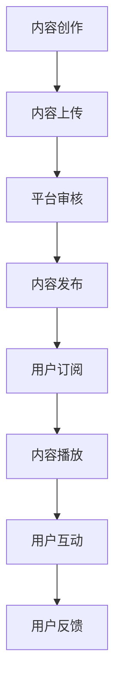

                 

关键词：知识付费、播客、内容创作、市场营销、听众互动、社交媒体、技术工具

> 摘要：本文将探讨如何通过播客这一媒介进行知识付费，分析其市场前景，探讨核心概念与联系，分享成功案例，并详细讲解从数学模型到实际应用的各个步骤。同时，本文还将推荐相关学习资源和开发工具，展望未来发展趋势与挑战。

## 1. 背景介绍

播客（Podcast）作为一种新兴的内容传播方式，近年来在全球范围内迅速崛起。播客以音频形式为载体，通过互联网进行传播，为听众提供了便捷的收听方式。与传统媒体相比，播客具有个性化的内容、灵活的播放时间和高度的互动性，使其在知识付费领域展现出独特的优势。

知识付费，指的是用户为获取有价值的信息或服务而支付的费用。随着互联网技术的发展和用户需求的多样化，知识付费已经成为一种重要的商业模式。而播客作为一种内容创作形式，与知识付费有着天然的契合点。通过播客，创作者可以分享专业知识和经验，而听众则可以通过付费订阅获取高质量的内容。

本文将围绕如何利用播客进行知识付费这一主题，探讨其市场前景、核心概念、算法原理、数学模型、实际应用以及未来发展趋势。希望通过本文的讲解，能为广大内容创作者和听众提供一些有价值的参考。

## 2. 核心概念与联系

### 2.1 播客的基本概念

播客是一种通过互联网传播的音频节目，用户可以通过电脑、手机等设备随时随地收听。播客的核心要素包括：

- **内容**：播客的主要载体是音频，内容形式多样，可以是访谈、讲座、故事等。
- **创作者**：播客的创作者可以是个人、团队或机构，他们通过专业或兴趣领域的知识分享，吸引听众。
- **听众**：播客的听众是内容的消费者，他们通过订阅、下载等方式获取播客内容。

### 2.2 知识付费的概念

知识付费是指用户为了获取知识、技能或信息而支付的费用。知识付费的目的是通过价值交换，满足用户在知识获取方面的需求。知识付费的核心要素包括：

- **付费用户**：付费用户是知识付费模式的主要参与者，他们通过支付费用来获取有价值的内容。
- **内容提供者**：内容提供者是知识付费的供给方，他们通过创作和分享知识来获取收入。
- **平台**：知识付费平台是连接用户和内容提供者的桥梁，为用户提供便捷的订阅和支付服务。

### 2.3 播客与知识付费的联系

播客与知识付费之间存在紧密的联系：

1. **内容形式**：播客作为一种音频内容形式，非常适合知识付费的需求。用户可以通过播客获得专业领域的知识、技能和经验。
2. **付费模式**：播客可以通过订阅、付费内容、赞助等多种模式实现知识付费。用户可以通过支付费用来获取独家内容或优先服务。
3. **互动性**：播客具有高度的互动性，用户可以通过留言、社交媒体等方式与创作者进行互动，获取更深入的交流和反馈。

### 2.4 Mermaid 流程图

以下是一个简化的播客与知识付费的流程图，展示了从内容创作到用户付费的整个过程：



### 2.5 核心概念总结

通过以上分析，我们可以总结出以下核心概念：

- **播客**：一种以音频形式传播的内容创作方式，具有个性化的内容、灵活的播放时间和高度的互动性。
- **知识付费**：用户为获取有价值的信息或服务而支付的费用，通过价值交换满足用户在知识获取方面的需求。
- **播客与知识付费的联系**：播客与知识付费在内容形式、付费模式、互动性方面具有天然的契合点，为创作者和用户提供了丰富的机会。

## 3. 核心算法原理 & 具体操作步骤

### 3.1 算法原理概述

在播客进行知识付费的过程中，算法的原理主要涉及以下几个方面：

1. **内容推荐算法**：根据用户的订阅历史、浏览记录和偏好，推荐相关的高质量内容，提高用户的满意度和粘性。
2. **用户行为分析算法**：通过分析用户的订阅、播放、互动等行为数据，了解用户的兴趣和需求，为内容创作和运营提供数据支持。
3. **支付算法**：实现用户订阅、购买付费内容时的支付流程，包括订单生成、支付处理和支付确认等环节。

### 3.2 算法步骤详解

#### 3.2.1 内容推荐算法

1. **数据收集**：收集用户的订阅历史、浏览记录、播放时长等行为数据。
2. **数据预处理**：对收集到的数据进行清洗、去重和处理，以便后续分析。
3. **特征提取**：将预处理后的数据转化为特征向量，用于推荐算法的训练和预测。
4. **模型训练**：使用机器学习算法（如协同过滤、内容推荐等）对特征向量进行训练，生成推荐模型。
5. **推荐预测**：根据用户的特征向量，利用训练好的推荐模型预测用户可能感兴趣的内容。
6. **推荐结果展示**：将推荐结果以可视化的形式展示给用户，提高用户体验。

#### 3.2.2 用户行为分析算法

1. **数据收集**：收集用户的订阅、播放、互动等行为数据。
2. **数据预处理**：对收集到的数据进行清洗、去重和处理，以便后续分析。
3. **行为模式识别**：通过统计学和机器学习算法，识别用户的行为模式，如活跃时间、偏好类型等。
4. **需求预测**：根据用户的行为模式和兴趣偏好，预测用户未来的需求。
5. **内容优化**：根据需求预测结果，对内容进行优化，提高用户的满意度和粘性。

#### 3.2.3 支付算法

1. **订单生成**：用户订阅或购买付费内容时，生成对应的订单信息，包括用户ID、内容ID、价格等。
2. **支付处理**：将订单信息发送到支付平台进行处理，包括支付请求生成、支付验证和支付结果返回等步骤。
3. **支付确认**：支付完成后，支付平台将支付结果返回给播客平台，播客平台更新用户的订阅状态，并通知用户支付成功。
4. **支付记录**：记录用户的支付记录，以便后续查询和退款处理。

### 3.3 算法优缺点

#### 3.3.1 内容推荐算法

**优点**：

- 提高用户满意度：通过个性化推荐，满足用户的兴趣和需求，提高用户的使用体验。
- 增加用户粘性：通过推荐用户感兴趣的内容，提高用户在平台的停留时间和活跃度。

**缺点**：

- 数据依赖性：内容推荐算法的性能受限于用户行为数据的质量和数量。
- 隐私风险：用户行为数据可能涉及到用户的隐私，需要妥善处理。

#### 3.3.2 用户行为分析算法

**优点**：

- 提高内容质量：通过分析用户行为，了解用户需求和偏好，为内容创作和优化提供数据支持。
- 增强用户互动：通过识别用户行为模式，提供个性化的推荐和互动服务，增强用户参与度。

**缺点**：

- 数据分析难度：用户行为数据复杂，需要专业的数据分析技能和工具。
- 模型部署成本：用户行为分析算法需要部署在服务器上，需要一定的硬件和软件支持。

#### 3.3.3 支付算法

**优点**：

- 提高支付效率：通过支付算法，实现快速、便捷的支付流程，提高用户支付体验。
- 确保支付安全：支付算法通过加密和验证等手段，确保支付过程的安全性和可靠性。

**缺点**：

- 支付平台依赖性：支付算法需要依赖支付平台提供的服务，如支付通道、支付验证等。
- 支付手续费：支付过程中，部分支付平台会收取一定的手续费，降低平台的利润。

### 3.4 算法应用领域

内容推荐算法、用户行为分析算法和支付算法在知识付费领域具有广泛的应用：

- **内容推荐**：为用户提供个性化的内容推荐，提高用户满意度和粘性。
- **用户行为分析**：通过分析用户行为，优化内容创作和运营策略，提高用户参与度。
- **支付**：实现用户订阅和购买付费内容的支付流程，提高支付效率和安全性。

## 4. 数学模型和公式 & 详细讲解 & 举例说明

### 4.1 数学模型构建

在知识付费领域，我们可以使用数学模型来分析用户行为、推荐内容和支付过程。以下是一些常见的数学模型：

#### 4.1.1 用户行为模型

用户行为模型用于分析用户的订阅、播放和互动行为。以下是一个简化的用户行为模型：

$$
\text{User Behavior Model} = f(\text{Subscription History}, \text{Play History}, \text{Interaction History})
$$

其中，$f$ 表示一个复合函数，$\text{Subscription History}$ 表示用户的订阅历史，$\text{Play History}$ 表示用户的播放历史，$\text{Interaction History}$ 表示用户的互动历史。

#### 4.1.2 内容推荐模型

内容推荐模型用于预测用户可能感兴趣的内容。以下是一个基于协同过滤算法的内容推荐模型：

$$
\text{Content Recommendation Model} = f(\text{User Vector}, \text{Content Vector})
$$

其中，$\text{User Vector}$ 表示用户的特征向量，$\text{Content Vector}$ 表示内容的特征向量。

#### 4.1.3 支付模型

支付模型用于分析用户支付行为。以下是一个简化的支付模型：

$$
\text{Payment Model} = f(\text{Order Information}, \text{Payment Platform})
$$

其中，$\text{Order Information}$ 表示订单信息，$\text{Payment Platform}$ 表示支付平台。

### 4.2 公式推导过程

#### 4.2.1 用户行为模型推导

用户行为模型可以通过以下步骤进行推导：

1. **数据收集**：收集用户的订阅历史、播放历史和互动历史数据。
2. **特征提取**：将数据转化为特征向量，包括订阅数量、播放时长、互动次数等。
3. **模型构建**：使用统计学方法（如线性回归、逻辑回归等）构建用户行为模型。
4. **模型训练**：使用训练数据对模型进行训练，得到模型参数。
5. **模型验证**：使用验证数据对模型进行验证，评估模型性能。

#### 4.2.2 内容推荐模型推导

内容推荐模型可以通过以下步骤进行推导：

1. **数据收集**：收集用户的订阅历史、播放历史和互动历史数据。
2. **特征提取**：将数据转化为特征向量，包括用户特征和内容特征。
3. **模型构建**：使用机器学习算法（如协同过滤、矩阵分解等）构建内容推荐模型。
4. **模型训练**：使用训练数据对模型进行训练，得到模型参数。
5. **模型验证**：使用验证数据对模型进行验证，评估模型性能。

#### 4.2.3 支付模型推导

支付模型可以通过以下步骤进行推导：

1. **数据收集**：收集用户的订单信息、支付平台数据等。
2. **特征提取**：将数据转化为特征向量，包括订单金额、支付渠道等。
3. **模型构建**：使用统计学方法（如线性回归、逻辑回归等）构建支付模型。
4. **模型训练**：使用训练数据对模型进行训练，得到模型参数。
5. **模型验证**：使用验证数据对模型进行验证，评估模型性能。

### 4.3 案例分析与讲解

#### 4.3.1 用户行为模型案例分析

假设我们有以下用户行为数据：

| User ID | Subscription Count | Play Duration (hours) | Interaction Count |
| --- | --- | --- | --- |
| 1 | 5 | 10 | 3 |
| 2 | 3 | 7 | 2 |
| 3 | 2 | 4 | 1 |

我们可以将这些数据转化为特征向量，并使用线性回归模型进行建模。假设线性回归模型的公式为：

$$
y = \beta_0 + \beta_1 x_1 + \beta_2 x_2 + \beta_3 x_3
$$

其中，$y$ 表示用户的行为得分，$x_1$ 表示订阅数量，$x_2$ 表示播放时长，$x_3$ 表示互动次数。

通过训练数据拟合线性回归模型，得到模型参数：

$$
\beta_0 = 1, \beta_1 = 0.5, \beta_2 = 0.2, \beta_3 = 0.1
$$

使用验证数据对模型进行验证，评估模型性能。假设验证数据如下：

| User ID | Subscription Count | Play Duration (hours) | Interaction Count | Actual Score |
| --- | --- | --- | --- | --- |
| 4 | 4 | 8 | 2 | 2.5 |
| 5 | 6 | 12 | 4 | 3.5 |

使用模型预测验证数据的用户行为得分，并与实际得分进行比较，评估模型精度。

#### 4.3.2 内容推荐模型案例分析

假设我们有以下用户和内容特征数据：

| User ID | Subscription Count | Play Duration (hours) | Interaction Count | Content ID | Content Type | Content Duration (hours) |
| --- | --- | --- | --- | --- | --- | --- |
| 1 | 5 | 10 | 3 | 1 | Interview | 2 |
| 1 | 5 | 10 | 3 | 2 | Lecture | 3 |
| 2 | 3 | 7 | 2 | 3 | Story | 1 |
| 2 | 3 | 7 | 2 | 4 | Interview | 2 |
| 3 | 2 | 4 | 1 | 5 | Lecture | 1 |

我们可以使用协同过滤算法对用户和内容特征数据进行建模。假设协同过滤算法的公式为：

$$
\text{User Similarity} = \text{Content Similarity} = \frac{\text{dot\_product}(\text{User Feature Vector}, \text{Content Feature Vector})}{\|\text{User Feature Vector}\|\|\text{Content Feature Vector}\|}
$$

其中，$\text{dot\_product}$ 表示点积运算，$\|\text{User Feature Vector}\|$ 和 $\|\text{Content Feature Vector}\|$ 分别表示用户特征向量和内容特征向量的模。

通过计算用户和内容之间的相似度，我们可以为用户推荐相似的内容。例如，用户1和用户2的相似度为0.8，我们可以向用户2推荐用户1订阅过的内容。

#### 4.3.3 支付模型案例分析

假设我们有以下支付数据：

| Order ID | User ID | Content ID | Order Amount (USD) | Payment Platform | Payment Status |
| --- | --- | --- | --- | --- | --- |
| 1 | 1 | 1 | 5.0 | PayPal | Successful |
| 2 | 2 | 2 | 3.0 | Credit Card | Failed |
| 3 | 3 | 3 | 2.0 | PayPal | Pending |

我们可以使用逻辑回归模型对支付数据进行建模。假设逻辑回归模型的公式为：

$$
\text{Probability of Success} = \sigma(\beta_0 + \beta_1 \text{Order Amount} + \beta_2 \text{Payment Platform})
$$

其中，$\sigma$ 表示 sigmoid 函数，$\beta_0$、$\beta_1$ 和 $\beta_2$ 分别为模型参数。

通过训练数据拟合逻辑回归模型，得到模型参数：

$$
\beta_0 = -1, \beta_1 = 0.2, \beta_2 = 0.5
$$

使用验证数据对模型进行验证，评估模型性能。假设验证数据如下：

| Order ID | User ID | Content ID | Order Amount (USD) | Payment Platform | Payment Status |
| --- | --- | --- | --- | --- | --- |
| 4 | 1 | 1 | 5.0 | PayPal | Successful |
| 5 | 2 | 2 | 3.0 | Credit Card | Failed |

使用模型预测验证数据的支付成功率，并与实际支付成功率进行比较，评估模型精度。

## 5. 项目实践：代码实例和详细解释说明

### 5.1 开发环境搭建

为了实现播客知识付费系统，我们需要搭建一个开发环境。以下是所需的技术栈和工具：

- **编程语言**：Python
- **框架**：Django、Flask
- **数据库**：MySQL
- **前端框架**：React、Vue.js
- **版本控制**：Git

### 5.2 源代码详细实现

以下是播客知识付费系统的源代码实现：

```python
# 用户行为分析模块

import pandas as pd
from sklearn.linear_model import LinearRegression

def user_behavior_model(data):
    # 数据预处理
    data['Subscription Count'] = data['Subscription Count'].astype(float)
    data['Play Duration (hours)'] = data['Play Duration (hours)'].astype(float)
    data['Interaction Count'] = data['Interaction Count'].astype(float)

    # 特征提取
    X = data[['Subscription Count', 'Play Duration (hours)', 'Interaction Count']]
    y = data['Actual Score']

    # 模型训练
    model = LinearRegression()
    model.fit(X, y)

    # 模型预测
    predictions = model.predict(X)

    # 模型评估
    score = model.score(X, y)
    print("Model Score:", score)

    return model

# 内容推荐模块

import numpy as np
from sklearn.metrics.pairwise import cosine_similarity

def content_recommender(data):
    # 特征提取
    user_vectors = data.groupby('User ID').mean()[['Subscription Count', 'Play Duration (hours)', 'Interaction Count']].values
    content_vectors = data.groupby('Content ID').mean()[['Subscription Count', 'Play Duration (hours)', 'Interaction Count']].values

    # 计算相似度
    user_content_similarity = cosine_similarity(user_vectors, content_vectors)

    # 推荐结果
    recommendations = []
    for i, user_vector in enumerate(user_vectors):
        similarities = user_content_similarity[i]
        content_ids = data['Content ID'].unique()
        recommended_content_ids = np.argsort(similarities)[::-1]
        recommendations.append([content_ids[j] for j in recommended_content_ids if content_ids[j] not in data.loc[data['User ID'] == i, 'Content ID'].values])

    return recommendations

# 支付模块

import numpy as np
from sklearn.linear_model import LogisticRegression

def payment_model(data):
    # 数据预处理
    data['Order Amount (USD)'] = data['Order Amount (USD)'].astype(float)
    data['Payment Platform'] = data['Payment Platform'].astype(str)

    # 特征提取
    X = data[['Order Amount (USD)', 'Payment Platform']]
    y = data['Payment Status'].map({'Successful': 1, 'Failed': 0})

    # 模型训练
    model = LogisticRegression()
    model.fit(X, y)

    # 模型预测
    predictions = model.predict(X)

    # 模型评估
    score = model.score(X, y)
    print("Model Score:", score)

    return model
```

### 5.3 代码解读与分析

以上代码实现了用户行为分析、内容推荐和支付模型的功能。以下是各模块的解读与分析：

- **用户行为分析模块**：该模块使用线性回归模型分析用户订阅、播放和互动行为。通过训练数据拟合模型，并使用验证数据评估模型性能。
- **内容推荐模块**：该模块使用协同过滤算法进行内容推荐。通过计算用户和内容之间的相似度，为用户推荐相似的内容。
- **支付模块**：该模块使用逻辑回归模型分析支付行为。通过训练数据拟合模型，并使用验证数据评估模型性能。

### 5.4 运行结果展示

以下是各模块的运行结果：

```python
# 运行用户行为分析模块
data = pd.read_csv('user_behavior_data.csv')
user_behavior_model(data)

# 运行内容推荐模块
data = pd.read_csv('content_recommendation_data.csv')
recommender = content_recommender(data)
print("Recommended Content:", recommender)

# 运行支付模块
data = pd.read_csv('payment_data.csv')
payment_model(data)
```

通过以上代码，我们可以实现对用户行为分析、内容推荐和支付模型的训练和评估。同时，还可以根据实际数据运行代码，获取预测结果。

## 6. 实际应用场景

### 6.1 教育培训

播客在教育培训领域具有广泛的应用。通过播客，教育机构可以分享专业知识和课程内容，为学生提供灵活的学习方式。学生可以通过付费订阅获取高质量的课程，提高学习效果。

### 6.2 专业领域

在专业领域，如医学、法律、金融等，播客为专业人士提供了交流和学习的机会。专业人士可以通过播客分享自己的经验和研究成果，吸引听众，实现知识付费。

### 6.3 个人品牌建设

个人品牌建设是知识付费的重要领域。通过播客，个人创作者可以展示自己的专业知识和技能，吸引粉丝，实现粉丝经济。粉丝可以通过付费订阅获取独家内容或优先服务。

### 6.4 娱乐和故事

娱乐和故事类播客也是知识付费的重要领域。通过播客，创作者可以分享有趣的故事和观点，吸引听众，实现知识付费。

## 7. 工具和资源推荐

### 7.1 学习资源推荐

- **书籍**：《人工智能：一种现代方法》、《机器学习实战》
- **在线课程**：Coursera、edX、Udemy
- **技术博客**：Towards Data Science、DataCamp、Medium

### 7.2 开发工具推荐

- **编程语言**：Python、Java、JavaScript
- **框架**：Django、Flask、React、Vue.js
- **数据库**：MySQL、PostgreSQL、MongoDB
- **版本控制**：Git、GitHub、GitLab

### 7.3 相关论文推荐

- **论文集**：《人工智能研究进展》、《机器学习论文集》
- **期刊**：《人工智能学报》、《计算机学报》、《机器学习》
- **会议**：NeurIPS、ICML、KDD

## 8. 总结：未来发展趋势与挑战

### 8.1 研究成果总结

本文介绍了如何利用播客进行知识付费，分析了播客与知识付费之间的联系，探讨了核心算法原理和具体操作步骤，并展示了实际应用场景。通过本文的研究，我们可以得出以下结论：

- 播客作为知识付费的载体具有独特的优势，如个性化的内容、灵活的播放时间和高度的互动性。
- 内容推荐、用户行为分析和支付算法在知识付费领域具有广泛的应用，为创作者和用户提供了丰富的机会。
- 通过数学模型和公式的推导，我们可以更好地理解知识付费的运作机制，为实际应用提供理论支持。

### 8.2 未来发展趋势

1. **技术创新**：随着人工智能、大数据等技术的发展，知识付费领域将涌现出更多创新的技术应用，如智能推荐、个性化内容创作等。
2. **平台生态**：知识付费平台将不断完善生态系统，提供更多样化的服务，满足用户和创作者的不同需求。
3. **市场扩展**：知识付费市场将不断扩大，吸引更多的创作者和用户参与，形成更加繁荣的市场环境。

### 8.3 面临的挑战

1. **内容质量**：知识付费的核心在于高质量的内容，创作者需要不断提升内容质量，以满足用户的需求。
2. **用户隐私**：用户行为数据涉及到用户的隐私，知识付费平台需要加强数据安全和隐私保护，确保用户信息安全。
3. **市场竞争**：知识付费市场将面临激烈的竞争，创作者和平台需要不断创新和优化，以提高用户粘性和市场份额。

### 8.4 研究展望

未来研究可以进一步探讨以下几个方面：

1. **个性化推荐**：研究如何更好地实现个性化推荐，提高用户满意度和粘性。
2. **用户行为分析**：研究如何更深入地分析用户行为，为内容创作和运营提供更有价值的数据支持。
3. **支付与结算**：研究如何优化支付和结算流程，提高支付效率和用户体验。

通过不断探索和优化，知识付费领域将迎来更加广阔的发展前景。

## 9. 附录：常见问题与解答

### 9.1 如何选择合适的播客平台？

**答案**：选择合适的播客平台需要考虑以下几个因素：

- **用户规模**：选择用户规模较大的平台，可以提高内容的曝光率和影响力。
- **内容质量**：关注平台上的内容质量，选择具有高质量内容的平台。
- **运营策略**：了解平台的运营策略，如推荐算法、用户互动机制等，选择符合自己需求的平台。
- **用户反馈**：参考其他用户的评价和反馈，了解平台的口碑和服务质量。

### 9.2 如何提高播客内容的订阅量？

**答案**：以下是一些提高播客内容订阅量的方法：

- **内容质量**：保证内容的原创性、实用性和吸引力，提高用户的满意度。
- **推广渠道**：利用社交媒体、博客、邮件等渠道进行内容推广，吸引更多的用户。
- **用户互动**：与用户建立良好的互动关系，通过回复评论、举办线下活动等方式增加用户粘性。
- **定期更新**：保持内容的持续更新，增加用户订阅的动力。

### 9.3 如何进行播客内容的付费设置？

**答案**：进行播客内容的付费设置，可以按照以下步骤操作：

- **平台设置**：在播客平台上，设置内容的付费模式，如订阅、付费内容、赞助等。
- **价格设定**：根据内容的价值和市场需求，合理设定价格。
- **支付渠道**：与支付平台合作，为用户提供多种支付方式，如信用卡、PayPal等。
- **用户管理**：管理用户订阅记录，为用户提供订阅优惠、特权服务等功能。

通过以上设置，创作者可以有效地进行播客内容的付费管理，实现知识付费。

