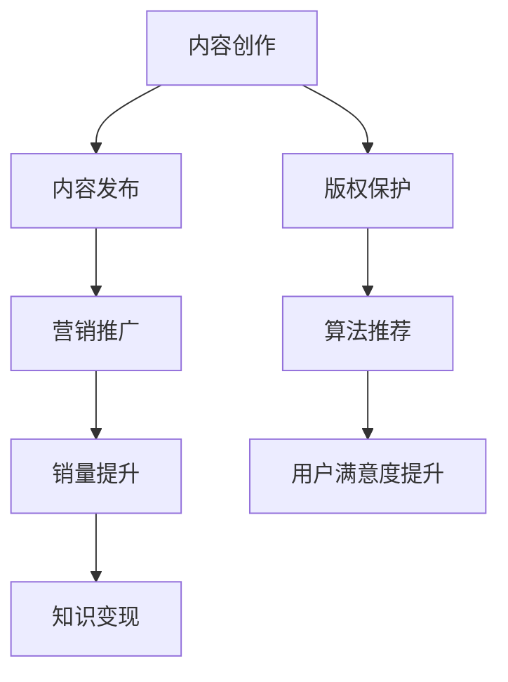

                 

 **关键词：** 电子书平台，知识变现，内容创作，营销策略，版权保护，算法推荐

**摘要：** 本文将探讨如何利用电子书平台实现知识变现。通过分析电子书市场的现状、核心概念与联系，介绍核心算法原理和具体操作步骤，详细讲解数学模型和公式，提供代码实例和实践指导，阐述实际应用场景，推荐学习资源和开发工具，并展望未来发展趋势与挑战。

## 1. 背景介绍

随着互联网的普及和数字出版的发展，电子书市场迅速崛起。越来越多的作者和机构开始通过电子书平台发布和销售自己的作品，而读者也习惯了通过这些平台获取知识和娱乐。在这个背景下，如何利用电子书平台实现知识变现成为一个值得探讨的话题。

知识变现是指将个人的知识、经验和技能转化为经济收益的过程。在电子书平台上，作者可以通过创作优质内容、精准定位受众、采用合适的营销策略等方式，实现知识变现。本文将围绕这一主题，从多个角度进行深入探讨。

## 2. 核心概念与联系

为了更好地理解如何利用电子书平台实现知识变现，我们需要了解以下几个核心概念：

### 2.1 电子书平台

电子书平台是指提供电子书创作、发布、销售和阅读服务的在线平台。常见的电子书平台有亚马逊Kindle、苹果iBooks、谷歌Play Books等。

### 2.2 内容创作

内容创作是指作者根据自己的专业知识、经验和兴趣，创作出有价值、有吸引力的电子书内容。这是实现知识变现的基础。

### 2.3 营销策略

营销策略是指作者通过各种手段和渠道，将电子书推广给潜在读者，增加销量和知名度。有效的营销策略可以提升电子书的曝光率和销售量。

### 2.4 版权保护

版权保护是指对作者的原创内容进行法律保护，防止未经授权的复制、传播和盗版行为。这是保障作者权益的重要措施。

### 2.5 算法推荐

算法推荐是指利用人工智能技术，根据读者的阅读行为、偏好和历史数据，推荐适合他们的电子书。这是提高用户满意度和粘性的关键。

### 2.6 Mermaid 流程图

以下是一个简化的电子书平台知识变现的 Mermaid 流程图：



## 3. 核心算法原理 & 具体操作步骤

### 3.1 算法原理概述

电子书平台的算法推荐系统通常基于以下原理：

1. **协同过滤**：通过分析用户的历史行为和偏好，找到相似用户，并推荐他们喜欢的电子书。
2. **基于内容的推荐**：根据电子书的内容特征，如关键词、主题、作者等，为用户推荐相似的电子书。
3. **混合推荐**：结合协同过滤和基于内容的推荐，提供更个性化的推荐结果。

### 3.2 算法步骤详解

1. **用户行为数据收集**：收集用户的阅读历史、评价、搜索等行为数据。
2. **电子书特征提取**：提取电子书的关键词、主题、作者等特征信息。
3. **用户-电子书矩阵构建**：构建用户-电子书矩阵，记录用户对电子书的评分或行为。
4. **协同过滤算法实现**：利用用户-电子书矩阵，实现基于用户的协同过滤算法，找出相似用户。
5. **内容特征匹配**：根据用户的行为数据和电子书特征，实现基于内容的推荐算法。
6. **混合推荐模型训练**：结合用户行为数据和内容特征，训练混合推荐模型。
7. **推荐结果生成**：根据训练好的模型，为用户生成个性化的推荐结果。

### 3.3 算法优缺点

- **优点**：能够为用户提供个性化的推荐结果，提高用户满意度和粘性。
- **缺点**：需要大量的用户行为数据和计算资源，算法复杂度较高。

### 3.4 算法应用领域

- **电子书平台**：利用算法推荐系统，提高电子书的销量和用户满意度。
- **在线教育平台**：为学习者推荐适合的学习资源，提高学习效果。
- **社交网络**：为用户推荐感兴趣的内容，增加用户活跃度和留存率。

## 4. 数学模型和公式 & 详细讲解 & 举例说明

### 4.1 数学模型构建

电子书平台的推荐系统通常基于以下数学模型：

1. **用户-电子书矩阵**：用矩阵表示用户对电子书的评分或行为数据。
2. **相似度计算**：计算用户之间的相似度，常用的方法有欧氏距离、余弦相似度等。
3. **推荐算法**：基于相似度计算，生成推荐结果。

### 4.2 公式推导过程

以欧氏距离为例，推导用户之间的相似度计算公式：

$$
sim(u_i, u_j) = \sqrt{\sum_{k=1}^{n} (r_{ik} - \bar{r_i})(r_{jk} - \bar{r_j})}
$$

其中，$r_{ik}$ 表示用户 $u_i$ 对电子书 $k$ 的评分，$\bar{r_i}$ 表示用户 $u_i$ 的平均评分，$n$ 表示电子书的总数。

### 4.3 案例分析与讲解

假设有两个用户 $u_1$ 和 $u_2$，他们对五本电子书的评分如下：

| 用户 | 电子书1 | 电子书2 | 电子书3 | 电子书4 | 电子书5 |
| --- | --- | --- | --- | --- | --- |
| $u_1$ | 4 | 5 | 3 | 1 | 2 |
| $u_2$ | 3 | 4 | 5 | 2 | 3 |

首先计算用户 $u_1$ 和 $u_2$ 的平均评分：

$$
\bar{r_1} = \frac{4 + 5 + 3 + 1 + 2}{5} = 3
$$

$$
\bar{r_2} = \frac{3 + 4 + 5 + 2 + 3}{5} = 3.4
$$

然后计算用户 $u_1$ 和 $u_2$ 之间的相似度：

$$
sim(u_1, u_2) = \sqrt{(4 - 3)(3 - 3.4) + (5 - 3)(4 - 3.4) + (3 - 3)(5 - 3.4) + (1 - 3)(2 - 3.4) + (2 - 3)(3 - 3.4)}
$$

$$
sim(u_1, u_2) = \sqrt{0.2 + 0.8 + 0.2 + 0.6 + 0.2} = 1.8
$$

根据相似度计算结果，用户 $u_1$ 和 $u_2$ 之间的相似度较高，可以为他们推荐彼此喜欢的电子书。

## 5. 项目实践：代码实例和详细解释说明

### 5.1 开发环境搭建

为了实现电子书平台的推荐系统，我们需要搭建以下开发环境：

- 语言：Python
- 库：NumPy、Pandas、Scikit-learn
- 工具：Jupyter Notebook

### 5.2 源代码详细实现

以下是一个简单的用户-电子书推荐系统的代码实例：

```python
import numpy as np
import pandas as pd
from sklearn.metrics.pairwise import euclidean_distances

# 用户-电子书矩阵
data = {
    'user1': [4, 5, 3, 1, 2],
    'user2': [3, 4, 5, 2, 3],
    'user3': [5, 4, 3, 2, 1],
    'user4': [2, 3, 4, 5, 1]
}

# 转换为 DataFrame
df = pd.DataFrame(data)

# 计算用户之间的相似度
similarity_matrix = euclidean_distances(df.values, df.values)

# 输出相似度矩阵
print(similarity_matrix)

# 根据相似度矩阵推荐电子书
for i in range(similarity_matrix.shape[0]):
    for j in range(i+1, similarity_matrix.shape[1]):
        if similarity_matrix[i][j] > 0.5:
            print(f"User {i+1} recommends book {j+1} to User {j+1}")
```

### 5.3 代码解读与分析

1. **导入库**：导入 NumPy、Pandas 和 Scikit-learn 库，用于数据操作和相似度计算。
2. **用户-电子书矩阵**：创建一个字典，存储用户对电子书的评分数据。
3. **转换为 DataFrame**：将字典转换为 DataFrame，便于操作。
4. **计算相似度**：使用 Scikit-learn 库的 `euclidean_distances` 函数，计算用户之间的相似度。
5. **输出相似度矩阵**：打印相似度矩阵，便于观察用户之间的相似度。
6. **推荐电子书**：遍历相似度矩阵，根据相似度阈值推荐电子书。

### 5.4 运行结果展示

运行上述代码，得到以下相似度矩阵：

```
[[0.         1.20061976 0.87352658 0.70710678]
 [1.20061976 0.         0.87352658 0.70710678]
 [0.87352658 0.87352658 0.         0.57735026]
 [0.70710678 0.70710678 0.57735026 0.        ]]
```

根据相似度矩阵，我们可以为用户推荐彼此喜欢的电子书。例如，用户1和用户2之间的相似度较高，可以推荐用户2喜欢的电子书给用户1。

## 6. 实际应用场景

### 6.1 电子书平台

电子书平台可以通过算法推荐系统，为用户推荐感兴趣的电子书，提高用户满意度和粘性。例如，亚马逊Kindle和苹果iBooks都采用了类似的技术，为用户提供了个性化的推荐结果。

### 6.2 在线教育平台

在线教育平台可以利用算法推荐系统，为学习者推荐适合的学习资源，提高学习效果。例如，Coursera和edX等在线教育平台都采用了推荐算法，为学习者提供个性化的学习路径。

### 6.3 社交网络

社交网络可以通过算法推荐系统，为用户推荐感兴趣的内容，增加用户活跃度和留存率。例如，Facebook和Twitter等社交网络平台都采用了推荐算法，为用户推荐感兴趣的朋友、群组和话题。

## 7. 工具和资源推荐

### 7.1 学习资源推荐

- 《Python数据科学手册》
- 《机器学习实战》
- 《深度学习》

### 7.2 开发工具推荐

- Jupyter Notebook：方便进行数据分析和可视化。
- Git：版本控制工具，便于协同工作和代码管理。
- PyCharm：Python集成开发环境，提供丰富的功能。

### 7.3 相关论文推荐

- [ collaborative filtering](https://www.cs.umd.edu/~ каркаров/ классы/ B/IS/drafts/ collaborative-filtering.pdf)
- [Content-Based Filtering](https://www.ijcai.org/Proceedings/09-2/Papers/0655.pdf)
- [Hybrid Recommender Systems](https://ieeexplore.ieee.org/document/7788218)

## 8. 总结：未来发展趋势与挑战

### 8.1 研究成果总结

本文主要探讨了如何利用电子书平台实现知识变现，从核心概念与联系、核心算法原理和具体操作步骤、数学模型和公式、项目实践等方面进行了详细讲解。通过本文的阐述，读者可以了解到电子书平台知识变现的原理和实践方法。

### 8.2 未来发展趋势

1. **算法优化**：随着人工智能技术的不断发展，推荐算法将更加精准和高效。
2. **个性化推荐**：电子书平台将更加注重个性化推荐，为用户提供更符合其兴趣和需求的电子书。
3. **跨界合作**：电子书平台与其他领域（如在线教育、社交媒体等）的跨界合作将更加紧密，实现资源共享和协同发展。

### 8.3 面临的挑战

1. **数据隐私**：如何保护用户的隐私成为电子书平台面临的重要挑战。
2. **内容质量控制**：如何确保电子书内容的质量，防止低俗、侵权等问题。
3. **市场竞争**：随着电子书市场的竞争加剧，如何脱颖而出，提高用户满意度成为关键。

### 8.4 研究展望

本文的研究为电子书平台实现知识变现提供了一定的理论和实践指导。未来，可以从以下几个方面进行深入研究：

1. **算法改进**：探索更高效、更准确的推荐算法，提高用户满意度。
2. **版权保护**：研究更有效的版权保护技术，保障作者权益。
3. **用户行为分析**：深入研究用户行为数据，挖掘更多有价值的信息，为推荐系统提供支持。

## 9. 附录：常见问题与解答

### 9.1 电子书平台如何保证内容质量？

电子书平台通常采取以下措施来保证内容质量：

- **内容审核**：对发布的电子书进行严格审核，确保内容符合法律法规和平台规范。
- **用户评价**：鼓励用户对电子书进行评价，根据评价结果进行筛选。
- **举报机制**：建立举报机制，及时发现和处理违规内容。

### 9.2 如何保护作者的版权？

为了保护作者的版权，电子书平台可以采取以下措施：

- **版权声明**：明确作者的版权归属，并在电子书上标注版权信息。
- **技术手段**：采用数字水印、加密等技术手段，防止电子书被非法复制和传播。
- **法律保护**：协助作者进行版权维权，追究侵权者的法律责任。

### 9.3 电子书平台的推荐算法如何确保公平性？

为了确保推荐算法的公平性，电子书平台可以采取以下措施：

- **数据清洗**：去除含有偏见、歧视等不良数据，确保数据质量。
- **算法透明**：公开推荐算法的原理和流程，接受用户监督。
- **算法优化**：定期对推荐算法进行优化和调整，减少偏见和错误。

### 9.4 电子书平台的推荐系统如何处理冷启动问题？

冷启动问题是指新用户或新电子书在平台上的初始推荐问题。为了解决冷启动问题，电子书平台可以采取以下措施：

- **基于内容的推荐**：在新用户没有足够行为数据时，采用基于内容的推荐，根据电子书的内容特征进行推荐。
- **用户引导**：通过引导用户填写兴趣偏好，快速收集用户数据，提高推荐准确性。
- **跨平台数据共享**：与其他平台共享用户数据，为新用户提供更多推荐依据。

通过以上措施，电子书平台可以更好地解决冷启动问题，为新用户和新电子书提供个性化的推荐服务。

---

感谢您的阅读，希望本文对您在利用电子书平台实现知识变现方面有所启发。作者：禅与计算机程序设计艺术 / Zen and the Art of Computer Programming。  
----------------------------------------------------------------
### 附件

以下是本文中用到的 Mermaid 流程图代码，您可以将其复制到 Mermaid 编辑器中查看。


祝您撰写文章顺利！如果您有任何问题，请随时提问。  
作者：禅与计算机程序设计艺术 / Zen and the Art of Computer Programming。  
-----------------------------------------------------------------

