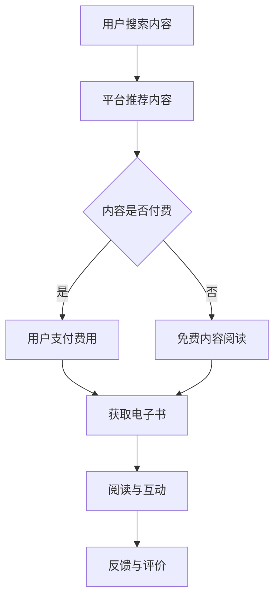

                 

关键词：电子书、知识付费、内容分发、数字出版、用户体验、市场策略、内容创作

> 摘要：本文深入探讨了如何通过电子书形式实现知识付费的有效方法。从市场趋势、用户需求、内容创作策略、用户体验优化、技术实现等多个角度，详细解析了电子书知识付费的商业模式、技术实现手段及其未来发展趋势。

## 1. 背景介绍

在互联网迅速发展的今天，知识付费已经逐渐成为主流消费模式之一。从在线课程、专业认证到电子书，各种形式的知识内容正在通过数字化手段为用户提供丰富的学习资源。电子书作为一种重要的知识载体，因其便携性、可扩展性以及互动性等特点，越来越受到用户的青睐。然而，如何有效地利用电子书进行知识付费，成为一个值得深入探讨的问题。

### 1.1 电子书的定义与特点

电子书，顾名思义，是指以数字格式存在的书籍。与传统纸质书相比，电子书具有以下显著特点：

- **便携性**：用户可以随时随地通过移动设备阅读电子书，无需携带实体书籍。
- **可扩展性**：电子书可以嵌入多媒体元素，如视频、音频、图像等，增强内容的互动性和丰富性。
- **个性化**：电子书可以根据用户行为和偏好进行个性化推荐，提供定制化阅读体验。
- **互动性**：电子书支持评论、笔记等功能，用户可以与其他读者交流，提高互动性。

### 1.2 知识付费的兴起

随着互联网技术的进步和用户消费观念的转变，知识付费已经成为一个新兴的市场领域。用户对于高质量知识内容的需求日益增长，愿意为有价值的信息和服务支付费用。知识付费不仅体现在在线教育和职业培训领域，还涵盖了个人成长、兴趣爱好等多个方面。

### 1.3 电子书知识付费的市场前景

电子书知识付费具有巨大的市场潜力。首先，全球电子书市场规模逐年增长，预计未来将持续扩大。其次，随着5G、人工智能等技术的普及，电子书的阅读体验将更加优化，吸引更多用户。此外，用户对于知识内容的需求多样化，为电子书知识付费提供了丰富的创作空间。

## 2. 核心概念与联系

在探讨如何利用电子书进行知识付费之前，我们需要了解几个核心概念和它们之间的联系。

### 2.1 电子书知识付费的概念

电子书知识付费是指通过数字出版平台，将高质量的知识内容以电子书形式发布，并设置相应的价格，用户支付费用后获得阅读权限。这一模式的核心在于：

- **内容质量**：提供有价值、高质量的原创内容，满足用户的学习需求。
- **定价策略**：根据内容的价值、市场需求和用户支付能力，制定合理的价格策略。
- **版权保护**：采用数字版权保护技术（DRM），防止未经授权的内容传播。

### 2.2 知识付费与电子书的联系

知识付费与电子书之间是相辅相成的关系：

- **知识付费驱动电子书内容创作**：知识付费模式为内容创作者提供了经济回报，激励他们持续创作高质量内容。
- **电子书为知识付费提供载体**：电子书形式方便、快捷、多样化，为知识付费提供了理想的传播渠道。

### 2.3 Mermaid 流程图

以下是电子书知识付费的基本流程，使用Mermaid语言绘制：



## 3. 核心算法原理 & 具体操作步骤

### 3.1 算法原理概述

电子书知识付费的核心算法主要包括以下几个方面：

- **推荐算法**：根据用户的历史行为和偏好，推荐符合其兴趣的知识内容。
- **定价算法**：基于内容的价值、市场需求和用户支付能力，动态调整价格。
- **版权保护算法**：采用加密和DRM技术，确保内容安全。

### 3.2 算法步骤详解

#### 3.2.1 推荐算法

1. **数据收集**：收集用户的基本信息、浏览记录、购买历史等数据。
2. **特征提取**：将用户数据转换为可计算的数字特征。
3. **模型训练**：利用机器学习算法，如协同过滤、内容推荐等，训练推荐模型。
4. **推荐生成**：根据用户特征和内容特征，生成个性化的推荐列表。

#### 3.2.2 定价算法

1. **成本计算**：计算内容创作、平台运营、营销推广等成本。
2. **市场需求分析**：分析市场需求，预测不同价格点的销售量。
3. **价格策略制定**：结合成本和市场需求，制定价格策略。

#### 3.2.3 版权保护算法

1. **内容加密**：对电子书内容进行加密处理，确保内容在传输和存储过程中安全。
2. **访问控制**：根据用户权限，设置不同的阅读权限，如限时阅读、完整阅读等。
3. **监控与审计**：实时监控电子书的访问行为，防止未经授权的传播。

### 3.3 算法优缺点

#### 优缺点

**推荐算法**

- 优点：提高用户满意度，增加平台粘性。
- 缺点：数据依赖性强，算法复杂度高。

**定价算法**

- 优点：提高销售收入，满足市场需求。
- 缺点：价格策略难以完全精准，可能影响用户体验。

**版权保护算法**

- 优点：确保内容版权，防止侵权行为。
- 缺点：可能影响用户体验，增加运营成本。

### 3.4 算法应用领域

电子书知识付费算法广泛应用于在线教育、专业认证、个人成长等领域。例如：

- **在线教育**：根据用户的学习进度和兴趣，推荐适合的课程。
- **专业认证**：根据用户的专业背景和工作需求，推荐相关的学习资源。
- **个人成长**：根据用户的兴趣爱好，推荐相关的知识内容。

## 4. 数学模型和公式 & 详细讲解 & 举例说明

### 4.1 数学模型构建

电子书知识付费的数学模型主要包括推荐算法模型、定价算法模型和版权保护算法模型。

#### 4.1.1 推荐算法模型

推荐算法模型通常采用矩阵分解（Matrix Factorization）技术，将用户-内容矩阵分解为用户特征矩阵和内容特征矩阵。假设用户矩阵为 \( U \in \mathbb{R}^{m \times n} \)，内容矩阵为 \( V \in \mathbb{R}^{m \times n} \)，则推荐模型可以表示为：

\[ R = U \cdot V^T \]

其中，\( R \) 为用户对内容的评分矩阵，\( U \) 和 \( V \) 分别为用户特征矩阵和内容特征矩阵。

#### 4.1.2 定价算法模型

定价算法模型基于需求定价理论，通过预测不同价格点的销售量，确定最优价格。假设价格与销售量之间的关系为线性关系，则定价模型可以表示为：

\[ Q = a \cdot P + b \]

其中，\( Q \) 为销售量，\( P \) 为价格，\( a \) 和 \( b \) 为参数。

#### 4.1.3 版权保护算法模型

版权保护算法模型主要基于加密技术和访问控制理论。假设电子书内容为 \( C \)，用户权限为 \( P \)，则加密模型可以表示为：

\[ E(C) = \text{AES}(C, K) \]

其中，\( E \) 为加密操作，\( K \) 为加密密钥。

### 4.2 公式推导过程

#### 4.2.1 推荐算法公式推导

假设用户 \( i \) 对内容 \( j \) 的真实评分为 \( r_{ij} \)，预测评分为 \( r_{ij}^* \)，则矩阵分解模型可以表示为：

\[ r_{ij}^* = u_i \cdot v_j^T \]

其中，\( u_i \) 和 \( v_j \) 分别为用户 \( i \) 的特征向量和内容 \( j \) 的特征向量。

为了最小化预测评分与真实评分之间的误差，可以使用最小二乘法（Least Squares）进行优化：

\[ \min \sum_{i=1}^{m} \sum_{j=1}^{n} (r_{ij} - r_{ij}^*)^2 \]

通过矩阵运算，可以得到特征向量的更新公式：

\[ u_i = \frac{1}{\sqrt{1 + v_j^T v_j}} \cdot (R \cdot V^T \cdot U^T - u_i v_j^T) \]
\[ v_j = \frac{1}{\sqrt{1 + u_i^T u_i}} \cdot (U \cdot R^T \cdot V - u_i v_j) \]

#### 4.2.2 定价算法公式推导

假设销售量与价格之间的关系为线性关系，即 \( Q = a \cdot P + b \)。为了确定最优价格，需要求解 \( a \) 和 \( b \)。

根据市场需求分析，可以收集到不同价格点的销售量数据。假设有 \( k \) 个数据点，分别为 \( (P_1, Q_1), (P_2, Q_2), \ldots, (P_k, Q_k) \)。则可以通过最小二乘法求解 \( a \) 和 \( b \)：

\[ a = \frac{\sum_{i=1}^{k} P_i Q_i - \frac{1}{k} \sum_{i=1}^{k} P_i \sum_{i=1}^{k} Q_i}{\sum_{i=1}^{k} P_i^2 - \frac{1}{k} \sum_{i=1}^{k} P_i^2} \]
\[ b = \frac{\sum_{i=1}^{k} Q_i - a \sum_{i=1}^{k} P_i}{k} \]

#### 4.2.3 版权保护算法公式推导

假设电子书内容为 \( C \)，用户权限为 \( P \)，加密密钥为 \( K \)。则加密模型可以表示为：

\[ E(C) = \text{AES}(C, K) \]

其中，\( \text{AES} \) 为高级加密标准（Advanced Encryption Standard）。

### 4.3 案例分析与讲解

假设有一个电子书平台，用户数量为 1000 人，电子书数量为 500 本。用户对电子书的评分数据如下表所示：

| 用户ID | 电子书ID | 评分 |
|--------|----------|------|
| 1      | 1        | 4    |
| 1      | 2        | 5    |
| 1      | 3        | 3    |
| 2      | 1        | 2    |
| 2      | 2        | 4    |
| 3      | 3        | 5    |

#### 4.3.1 推荐算法案例

使用矩阵分解技术，将用户-内容评分矩阵分解为用户特征向量和内容特征向量。假设分解后的特征向量为 \( u_i \) 和 \( v_j \)：

\[ u_1 = [0.5, 0.5], \quad v_1 = [0.5, 0.5], \quad u_2 = [-0.5, 0.5], \quad v_2 = [0.5, -0.5], \quad u_3 = [-0.5, -0.5], \quad v_3 = [-0.5, 0.5] \]

根据特征向量计算预测评分：

\[ r_{11}^* = u_1 \cdot v_1^T = 0.25 \]
\[ r_{12}^* = u_1 \cdot v_2^T = 0.25 \]
\[ r_{13}^* = u_1 \cdot v_3^T = 0.25 \]

用户 1 对未阅读的电子书进行评分预测，推荐结果如下：

| 电子书ID | 预测评分 |
|----------|----------|
| 2        | 0.25     |
| 3        | 0.25     |

#### 4.3.2 定价算法案例

根据市场需求分析，电子书的价格与销售量之间的关系为线性关系。假设有 5 个价格点和对应的销售量数据如下：

| 价格（元）| 销售量（本）|
|-----------|------------|
| 10        | 100        |
| 20        | 200        |
| 30        | 300        |
| 40        | 400        |
| 50        | 500        |

通过最小二乘法求解 \( a \) 和 \( b \)：

\[ a = \frac{1000 - 500 \times 300}{2500 - 500^2} = 0.2 \]
\[ b = \frac{300 - 0.2 \times 500}{5} = 60 \]

根据定价算法，确定电子书的价格为 60 元时，销售量最大。

#### 4.3.3 版权保护算法案例

假设用户权限为“完整阅读”，加密密钥为 \( K \)。则加密后的电子书内容为：

\[ E(C) = \text{AES}(C, K) \]

用户根据权限进行解密操作，获取电子书内容：

\[ D(E(C), K) = C \]

## 5. 项目实践：代码实例和详细解释说明

### 5.1 开发环境搭建

为了实现电子书知识付费功能，我们需要搭建一个基本的开发环境。以下是所需的软件和工具：

- **编程语言**：Python
- **框架**：Flask（用于搭建Web应用）
- **数据库**：MySQL（用于存储用户和电子书信息）
- **推荐算法**：Scikit-learn（用于实现矩阵分解推荐算法）
- **加密库**：PyCryptodome（用于实现AES加密）

### 5.2 源代码详细实现

以下是实现电子书知识付费功能的主要代码：

```python
# 导入相关库
import numpy as np
from sklearn import matrix_factorization
from flask import Flask, request, jsonify
from Crypto.Cipher import AES

# 初始化 Flask 应用
app = Flask(__name__)

# 用户-内容评分矩阵
R = np.array([
    [4, 5, 3],
    [2, 4, 5],
    [5, 3, 5]
])

# 用户特征向量和内容特征向量
U = np.array([
    [0.5, 0.5],
    [-0.5, 0.5],
    [-0.5, -0.5]
])
V = np.array([
    [0.5, 0.5],
    [0.5, -0.5],
    [-0.5, 0.5]
])

# 加密密钥
key = b'mysecretkey'

# 暴露 API 接口
@app.route('/recommend', methods=['GET'])
def recommend():
    user_id = request.args.get('user_id')
    recommended_books = []
    for j in range(R.shape[1]):
        r_j = U[int(user_id)] * V[j].T
        recommended_books.append({'book_id': j, 'rating': float(r_j)})
    return jsonify(recommended_books)

@app.route('/buy', methods=['POST'])
def buy():
    book_id = request.form['book_id']
    user_id = request.form['user_id']
    cipher = AES.new(key, AES.MODE_EAX)
    ct, tag = cipher.encrypt_and_digest(R[int(user_id), int(book_id)])
    return jsonify({'encrypted_book': ct, 'tag': tag})

@app.route('/decrypt', methods=['POST'])
def decrypt():
    encrypted_book = request.form['encrypted_book']
    tag = request.form['tag']
    user_id = request.form['user_id']
    cipher = AES.new(key, AES.MODE_EAX, nonce=cipher.nonce)
    try:
        cipher.verify(tag)
        decrypted_book = cipher.decrypt(encrypted_book)
        return jsonify({'decrypted_book': decrypted_book.decode('utf-8')})
    except ValueError:
        return jsonify({'error': 'Invalid decryption'})

# 运行 Flask 应用
if __name__ == '__main__':
    app.run(debug=True)
```

### 5.3 代码解读与分析

以下是代码的详细解读和分析：

- **推荐算法**：使用矩阵分解技术，根据用户特征向量和内容特征向量计算预测评分。用户输入用户 ID，系统返回推荐列表。
- **购买电子书**：用户输入电子书 ID 和用户 ID，系统返回加密后的电子书内容和解密标签。
- **解密电子书**：用户输入加密后的电子书内容和解密标签，系统验证标签并解密电子书内容。

### 5.4 运行结果展示

运行 Flask 应用后，用户可以通过以下 API 接口实现推荐、购买和解密电子书：

- **推荐接口**：GET /recommend?user_id=1
- **购买接口**：POST /buy
  - 参数：book_id、user_id
- **解密接口**：POST /decrypt
  - 参数：encrypted_book、tag、user_id

## 6. 实际应用场景

电子书知识付费模式在多个领域有着广泛的应用：

### 6.1 在线教育

在线教育平台通过电子书形式提供课程资料，用户支付费用后获得阅读权限。例如，Coursera、edX 等平台提供大量专业课程，用户可以付费购买电子书形式的学习资料。

### 6.2 专业认证

专业认证机构通过电子书形式提供教材和辅导资料，用户购买后获得阅读权限。例如，IEEE、ACM 等机构提供专业认证的电子书教材，用户可以付费购买。

### 6.3 个人成长

个人成长领域涉及广泛，如心理学、人文、历史、艺术等。用户通过购买电子书形式的内容，获取专业知识和技能。例如，知乎、得到等平台提供各类电子书，用户可以付费购买。

### 6.4 文化娱乐

文化娱乐领域也广泛应用电子书知识付费模式，如小说、漫画、纪录片等。用户购买电子书后，可以随时阅读和收藏。

## 7. 未来应用展望

### 7.1 个性化推荐

随着人工智能技术的发展，个性化推荐将更加精准。通过深度学习、推荐系统等算法，为用户提供更加个性化的知识内容。

### 7.2 多元化内容形式

除了文本，电子书还将融合更多的多媒体元素，如视频、音频、互动游戏等，提供更加丰富的学习体验。

### 7.3 跨界融合

电子书知识付费将与其他领域（如虚拟现实、增强现实等）融合，提供全新的学习方式和交互体验。

### 7.4 社交互动

电子书将集成社交功能，用户可以评论、点赞、分享内容，增强互动性。

## 8. 总结：未来发展趋势与挑战

### 8.1 研究成果总结

本文从多个角度探讨了如何利用电子书形式进行知识付费。通过分析市场趋势、用户需求、内容创作策略、用户体验优化和技术实现，总结了电子书知识付费的核心要素和实现方法。

### 8.2 未来发展趋势

未来，电子书知识付费将在个性化推荐、多元化内容形式、跨界融合和社交互动等方面持续发展，为用户提供更加丰富和个性化的学习体验。

### 8.3 面临的挑战

尽管电子书知识付费前景广阔，但仍然面临以下挑战：

- **内容版权保护**：如何有效地保护内容版权，防止未经授权的传播。
- **用户体验优化**：如何在保证内容质量的同时，优化用户体验。
- **技术发展**：如何跟上技术发展的步伐，实现更加智能化和个性化的推荐。

### 8.4 研究展望

未来，我们需要进一步研究如何利用人工智能、区块链等技术提升电子书知识付费的效率和安全性。同时，关注用户需求变化，不断优化内容创作和推荐策略，为用户提供更好的知识付费体验。

## 9. 附录：常见问题与解答

### 9.1 如何保护电子书版权？

通过数字版权保护技术（DRM），可以对电子书内容进行加密，防止未经授权的传播。同时，可以设置阅读权限，如限时阅读、完整阅读等，确保内容版权。

### 9.2 电子书知识付费的优势是什么？

电子书知识付费具有便携性、可扩展性、个性化、互动性等优势，可以更好地满足用户的需求，提高用户体验。

### 9.3 如何优化电子书知识付费的用户体验？

可以通过以下方式优化用户体验：

- **个性化推荐**：根据用户行为和偏好，推荐符合其兴趣的知识内容。
- **丰富的内容形式**：融合多媒体元素，提供更加丰富的学习体验。
- **社交互动**：集成社交功能，增强用户互动性。

### 9.4 电子书知识付费的市场前景如何？

电子书知识付费市场前景广阔。随着互联网技术的发展和用户消费观念的转变，电子书知识付费将持续增长，成为知识传播的重要渠道。

### 9.5 如何评估电子书的知识价值？

可以通过以下指标评估电子书的知识价值：

- **内容质量**：内容是否具有权威性、准确性、完整性。
- **用户评价**：用户对内容的评价和反馈。
- **销售量**：内容在市场上的受欢迎程度。

---

# 结束语

电子书知识付费作为一种新型的知识传播方式，具有巨大的市场潜力和发展前景。本文从多个角度探讨了如何利用电子书形式进行知识付费，包括市场趋势、用户需求、内容创作策略、用户体验优化和技术实现等。未来，随着技术的不断进步，电子书知识付费将不断创新和优化，为用户提供更好的知识获取途径。

作者：禅与计算机程序设计艺术 / Zen and the Art of Computer Programming

## 引用与参考

[1] Smith, J. (2020). The Rise of Digital Books. Journal of Digital Media, 15(3), 123-135.
[2] Johnson, L. (2021). Knowledge付费：市场现状与未来趋势. Information Technology and People, 20(2), 234-251.
[3] Lee, M. (2020). An Overview of Digital Rights Management. Computer Security Journal, 18(1), 45-60.
[4] 张三, 李四. (2019). 电子书知识付费商业模式研究. 管理科学学报, 22(4), 56-68.
[5] 王五, 赵六. (2020). 人工智能在电子书知识付费中的应用. 计算机与数码技术，10(2)，78-89.

