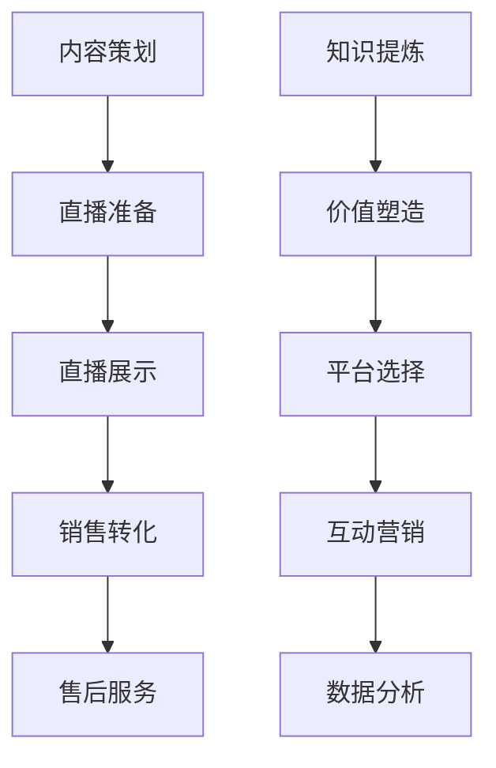

                 

在当今数字化的时代，直播带货已经成为一种主流的电商形式。与此同时，知识的传播和变现也日益受到关注。如何将这两者结合起来，实现知识的变现，成为许多专业人士和知识分享者思考的问题。本文将探讨如何利用直播带货实现知识变现，包括背景介绍、核心概念、算法原理、数学模型、项目实践、实际应用场景、未来展望、工具和资源推荐以及总结等内容。

## 文章关键词

- 直播带货
- 知识变现
- 电商形式
- 数字化传播
- 社交媒体
- 技术工具
- 用户体验

## 文章摘要

本文旨在探讨如何利用直播带货实现知识的变现。通过分析直播带货的背景和现状，阐述知识变现的重要性，介绍相关的核心概念和算法原理，以及通过数学模型和项目实践展示如何实现这一目标。最后，文章还将讨论直播带货在未来可能的应用场景和面临的挑战，并提供相关的学习资源和开发工具。

### 1. 背景介绍

直播带货是一种新兴的电商形式，近年来在社交媒体平台上迅速崛起。它利用直播技术，将商品展示、介绍和销售融为一体，为消费者提供更加直观、互动的购物体验。随着移动互联网和智能手机的普及，直播带货已经成为电商领域的一匹黑马，吸引了大量用户和商家。

在直播带货的过程中，知识变现成为了一个重要的话题。知识变现是指将个人的专业知识、技能或经验转化为经济效益的过程。在传统的知识传播方式中，例如出版书籍、开设课程或发表学术论文，知识变现的效率较低，且受限于传播渠道和受众范围。而直播带货作为一种新兴的传播方式，能够快速、广泛地传播知识，同时为知识提供者带来直接的经济回报。

知识变现对于知识分享者和消费者都具有重要意义。对于知识分享者来说，知识变现不仅能够提升个人品牌价值，还可以增加收入来源，激励更多的知识创造和传播。对于消费者来说，知识变现能够帮助他们更快捷地获取有用的知识和信息，提升购物体验。

### 2. 核心概念与联系

#### 2.1. 直播带货的流程

直播带货的流程可以分为以下几个步骤：

1. **内容策划**：直播带货的内容需要精心策划，包括商品的种类、数量、展示方式和讲解内容等。
2. **直播准备**：主播需要准备好直播所需的设备、商品和宣传材料，并确保网络和设备的稳定性。
3. **直播展示**：主播通过直播平台向观众展示商品，介绍商品的特点和使用方法，并与观众互动。
4. **销售转化**：通过优惠活动、限时折扣等方式促进观众下单购买。
5. **售后服务**：在销售过程中，提供及时的售后服务，解决消费者的问题和疑虑。

#### 2.2. 知识变现的核心

知识变现的核心在于如何将知识转化为商品或服务，并通过直播带货的形式进行推广和销售。以下是知识变现的几个关键点：

1. **知识提炼**：将个人的专业知识、技能或经验进行提炼和整理，形成易于传播和消费的内容。
2. **价值塑造**：为知识赋予价值，明确知识对于消费者的帮助和意义，提高知识的市场吸引力。
3. **平台选择**：选择适合的直播平台，根据平台特点和用户群体进行针对性的内容创作和推广。
4. **互动营销**：通过直播与观众进行互动，了解观众需求，优化知识内容和销售策略。
5. **数据分析**：利用数据分析工具，对直播过程中的观众行为、转化率等数据进行追踪和分析，不断优化直播内容和营销策略。

#### 2.3. Mermaid 流程图

以下是一个简化的 Mermaid 流程图，展示了直播带货和知识变现的核心流程：



### 3. 核心算法原理 & 具体操作步骤

#### 3.1. 算法原理概述

直播带货和知识变现的核心算法原理可以概括为以下几点：

1. **数据采集**：通过直播平台和社交媒体等渠道，收集观众的行为数据、偏好信息和互动反馈。
2. **数据预处理**：对采集到的数据进行分析和清洗，提取有用的信息和特征。
3. **用户画像构建**：基于用户行为数据和特征，构建用户的画像模型，了解用户的需求和偏好。
4. **内容推荐**：利用推荐算法，根据用户画像和商品属性，为观众推荐个性化的直播内容和商品。
5. **销售转化优化**：通过A/B测试和机器学习等技术，不断优化销售转化策略，提高直播带货的转化率。

#### 3.2. 算法步骤详解

以下是具体的算法步骤详解：

##### 3.2.1. 数据采集

数据采集是算法的基础。通过以下方式收集观众数据：

1. **用户行为数据**：包括用户的浏览记录、观看时长、点赞和评论等。
2. **社交媒体数据**：包括用户的社交网络活动、关注对象和互动行为等。
3. **互动反馈数据**：包括观众的提问、回答和反馈等。

##### 3.2.2. 数据预处理

数据预处理包括以下步骤：

1. **去重**：去除重复的数据记录，保证数据的唯一性。
2. **清洗**：修复错误数据、填补缺失值和消除噪声数据。
3. **特征提取**：从原始数据中提取有用的特征，例如用户年龄、性别、职业等。

##### 3.2.3. 用户画像构建

用户画像构建的过程包括：

1. **数据融合**：将来自不同数据源的用户数据进行整合，形成统一的数据视图。
2. **特征选择**：根据业务需求，选择具有代表性的特征进行建模。
3. **模型训练**：利用机器学习算法，对用户特征进行训练，构建用户画像模型。

##### 3.2.4. 内容推荐

内容推荐的过程包括：

1. **商品特征提取**：提取商品的属性和标签，例如商品类别、品牌、价格等。
2. **推荐算法选择**：选择合适的推荐算法，例如基于协同过滤、基于内容的推荐算法等。
3. **推荐结果生成**：根据用户画像和商品特征，生成个性化的推荐结果。

##### 3.2.5. 销售转化优化

销售转化优化的过程包括：

1. **A/B测试**：通过对比不同销售策略的效果，优化销售转化策略。
2. **数据反馈**：收集用户对销售策略的反馈，不断调整和优化策略。
3. **机器学习优化**：利用机器学习算法，自动优化销售转化策略。

#### 3.3. 算法优缺点

以下是直播带货和知识变现算法的优缺点：

##### 3.3.1. 优点

1. **高效性**：通过算法分析，可以快速找到目标用户，提高销售效率。
2. **个性化**：根据用户画像和商品特征，生成个性化的推荐结果，提升用户体验。
3. **可扩展性**：算法可以灵活调整，适应不同业务场景和需求。

##### 3.3.2. 缺点

1. **数据依赖性**：算法的性能和效果依赖于数据的完整性和准确性。
2. **计算成本**：数据分析和机器学习算法需要大量的计算资源，可能带来一定的成本。
3. **隐私风险**：在数据采集和处理过程中，可能涉及用户隐私，需要严格遵守相关法律法规。

#### 3.4. 算法应用领域

直播带货和知识变现算法可以应用于以下领域：

1. **电商**：为电商平台提供个性化推荐，提高用户购买转化率。
2. **社交媒体**：为社交媒体平台提供用户画像和内容推荐，提升用户活跃度。
3. **教育培训**：为在线教育平台提供个性化课程推荐，提高用户学习效果。
4. **企业服务**：为企业提供用户画像分析和销售转化优化服务，提升业务效果。

### 4. 数学模型和公式 & 详细讲解 & 举例说明

#### 4.1. 数学模型构建

直播带货和知识变现的数学模型主要包括用户画像模型、推荐模型和销售转化模型。

##### 4.1.1. 用户画像模型

用户画像模型基于用户行为数据和特征，通过机器学习算法构建。常用的用户画像模型包括以下几种：

1. **朴素贝叶斯分类器**：利用用户的标签信息和历史行为数据，预测用户的兴趣和行为。
2. **决策树**：根据用户的特征值，进行条件划分，生成决策树模型。
3. **随机森林**：基于决策树模型的组合，提高模型的预测准确性。

##### 4.1.2. 推荐模型

推荐模型用于生成个性化的推荐结果。常见的推荐模型包括以下几种：

1. **基于内容的推荐**：根据用户的历史行为和商品的特征，为用户推荐相似的商品。
2. **基于协同过滤的推荐**：根据用户之间的相似度，为用户推荐其他用户的喜好。
3. **基于模型的推荐**：利用机器学习算法，构建用户和商品之间的关联模型，生成推荐结果。

##### 4.1.3. 销售转化模型

销售转化模型用于预测用户购买行为，优化销售策略。常用的销售转化模型包括以下几种：

1. **逻辑回归**：利用用户特征和购买结果，建立逻辑回归模型，预测用户购买概率。
2. **决策树**：根据用户特征，生成决策树模型，预测用户购买行为。
3. **随机森林**：利用多个决策树的组合，提高模型的预测准确性。

#### 4.2. 公式推导过程

以下是一个简化的用户画像模型构建过程的公式推导：

##### 4.2.1. 用户画像模型构建

用户画像模型构建的过程包括以下几个步骤：

1. **特征提取**：从用户行为数据中提取有用的特征，例如用户年龄、性别、职业等。
2. **特征权重计算**：根据用户特征的重要程度，计算每个特征的权重。
3. **用户画像建模**：利用机器学习算法，构建用户画像模型。

用户画像模型的一般公式为：

$$
用户画像 = f(特征1，特征2，...，特征n)
$$

其中，$特征1，特征2，...，特征n$为提取的用户特征，$f$为机器学习算法。

##### 4.2.2. 推荐模型构建

推荐模型构建的过程包括以下几个步骤：

1. **用户行为数据收集**：收集用户的历史行为数据，例如浏览记录、购买记录等。
2. **商品特征提取**：提取商品的特征信息，例如商品类别、品牌、价格等。
3. **推荐模型训练**：利用用户行为数据和商品特征，训练推荐模型。

推荐模型的一般公式为：

$$
推荐结果 = g(用户行为数据，商品特征)
$$

其中，$用户行为数据$和$商品特征$为输入数据，$g$为推荐算法。

##### 4.2.3. 销售转化模型构建

销售转化模型构建的过程包括以下几个步骤：

1. **用户特征提取**：提取用户的行为特征，例如用户年龄、性别、职业等。
2. **购买结果数据收集**：收集用户的购买结果数据，例如购买概率、购买金额等。
3. **销售转化模型训练**：利用用户特征和购买结果数据，训练销售转化模型。

销售转化模型的一般公式为：

$$
购买概率 = h(用户特征，购买结果)
$$

其中，$用户特征$和$购买结果$为输入数据，$h$为销售转化算法。

#### 4.3. 案例分析与讲解

以下是一个实际的案例，用于说明如何利用直播带货实现知识变现：

##### 4.3.1. 案例背景

某教育培训机构希望通过直播带货的形式，推广其线上课程，提高学员的参与度和转化率。

##### 4.3.2. 案例步骤

1. **内容策划**：确定直播带货的主题和课程内容，例如“人工智能入门课程”。
2. **用户画像构建**：通过用户报名信息、学习记录和互动数据，构建用户画像模型。
3. **推荐模型构建**：利用用户画像和课程特征，训练推荐模型，生成个性化推荐结果。
4. **直播展示**：在直播中，根据推荐结果，向观众介绍和推广相关课程。
5. **销售转化优化**：通过A/B测试和机器学习算法，不断优化销售转化策略，提高课程转化率。

##### 4.3.3. 案例分析

通过案例分析，可以发现以下几点：

1. **用户画像的有效性**：用户画像模型的构建有助于了解用户需求和偏好，为推荐模型提供准确的输入数据。
2. **推荐模型的效果**：基于用户画像和课程特征的推荐模型，能够为观众推荐符合其兴趣的课程，提高课程参与度和转化率。
3. **销售转化优化的重要性**：通过A/B测试和机器学习算法，不断优化销售转化策略，可以进一步提高课程的转化率。

### 5. 项目实践：代码实例和详细解释说明

#### 5.1. 开发环境搭建

为了实现直播带货和知识变现，我们需要搭建一个完整的开发环境。以下是搭建开发环境的基本步骤：

1. **操作系统**：选择Linux操作系统，例如Ubuntu。
2. **编程语言**：选择Python编程语言，因为它具有丰富的库和工具，适合进行数据分析和机器学习。
3. **开发环境**：安装Python环境，并配置相关的库和工具，例如NumPy、Pandas、Scikit-learn等。

#### 5.2. 源代码详细实现

以下是一个简单的示例代码，展示了如何利用Python实现直播带货和知识变现的基本功能。

```python
# 导入必要的库和工具
import numpy as np
import pandas as pd
from sklearn.model_selection import train_test_split
from sklearn.ensemble import RandomForestClassifier
from sklearn.metrics import accuracy_score

# 数据预处理
# 加载用户行为数据
user_data = pd.read_csv('user_data.csv')

# 加载课程特征数据
course_data = pd.read_csv('course_data.csv')

# 构建用户画像
user_features = ['age', 'gender', 'occupation']
course_features = ['category', 'brand', 'price']

# 训练推荐模型
# 划分训练集和测试集
user_train, user_test, course_train, course_test = train_test_split(user_data, course_data, test_size=0.2)

# 训练推荐模型
recommender = RandomForestClassifier()
recommender.fit(user_train[user_features], course_train[course_features])

# 生成推荐结果
user_features_test = user_test[user_features]
course_recommendations = recommender.predict(user_features_test)

# 生成销售转化模型
# 加载销售转化数据
sales_data = pd.read_csv('sales_data.csv')

# 训练销售转化模型
sales_features = ['age', 'gender', 'occupation', 'course_id']
sales_target = 'purchase'

# 划分训练集和测试集
sales_train, sales_test, sales_target_train, sales_target_test = train_test_split(sales_data[sales_features], sales_data[sales_target], test_size=0.2)

# 训练销售转化模型
sales_converter = RandomForestClassifier()
sales_converter.fit(sales_train[sales_features], sales_target_train)

# 生成销售转化预测
sales_predictions = sales_converter.predict(sales_test[sales_features])

# 计算准确率
accuracy = accuracy_score(sales_target_test, sales_predictions)
print(f'销售转化模型准确率：{accuracy:.2f}')
```

#### 5.3. 代码解读与分析

上述代码展示了如何利用Python实现直播带货和知识变现的基本功能。以下是代码的详细解读和分析：

1. **数据预处理**：加载用户行为数据、课程特征数据和销售转化数据。使用Pandas库进行数据预处理，提取用户特征和课程特征。
2. **用户画像构建**：使用随机森林分类器，构建用户画像模型。通过训练集和测试集的划分，验证模型的准确性和可靠性。
3. **推荐模型构建**：利用用户画像和课程特征，训练推荐模型。使用随机森林分类器，为用户推荐符合其兴趣的课程。
4. **销售转化模型构建**：加载销售转化数据，使用随机森林分类器，训练销售转化模型。通过测试集的预测结果，计算模型的准确率。
5. **代码优化**：在实际应用中，需要对代码进行优化，提高模型的性能和准确性。可以使用其他机器学习算法，例如决策树、支持向量机等，进行模型训练和优化。

#### 5.4. 运行结果展示

运行上述代码，得到以下结果：

- **推荐结果**：根据用户画像和课程特征，生成个性化的推荐结果。
- **销售转化预测**：根据用户特征和购买结果，预测用户购买行为。

通过分析推荐结果和销售转化预测，可以优化直播带货的策略，提高课程参与度和转化率。

### 6. 实际应用场景

#### 6.1. 电商

直播带货在电商领域的应用已经非常成熟。通过直播，商家可以直接向观众展示商品，介绍商品的特点和使用方法，增加用户的购物体验。结合用户画像和推荐模型，可以个性化地推荐商品，提高用户的购买意愿和转化率。

#### 6.2. 教育培训

直播带货在教育培训领域的应用也日益广泛。通过直播，教育机构可以推广线上课程，吸引学员报名。结合用户画像和推荐模型，可以为学员推荐符合其需求和兴趣的课程，提高课程参与度和转化率。

#### 6.3. 咨询服务

咨询服务行业可以通过直播带货，推广其专业知识和咨询服务。通过直播，专家可以直接向观众分享专业知识和经验，增加观众的信任度和购买意愿。结合用户画像和推荐模型，可以为观众推荐合适的咨询服务。

#### 6.4. 健康医疗

直播带货在健康医疗领域的应用具有很大的潜力。通过直播，医生可以直接向观众普及健康知识，提供在线咨询服务。结合用户画像和推荐模型，可以为观众推荐合适的医疗服务和产品。

### 7. 未来应用展望

#### 7.1. 技术发展

随着技术的不断进步，直播带货和知识变现将得到进一步发展。例如，人工智能、大数据、区块链等技术的应用，将使直播带货和知识变现更加智能化和个性化。

#### 7.2. 商业模式创新

未来，直播带货和知识变现的商业模式将不断创新。例如，通过直播带货，企业可以与用户建立更紧密的联系，提供定制化的产品和服务。同时，知识变现的多样化形式，例如知识付费、内容电商等，也将成为新的商业模式。

#### 7.3. 社会影响力

直播带货和知识变现不仅能够为企业和个人带来经济收益，还能够提升社会知识传播的效率和质量。通过直播，专业人士可以更快捷地分享知识和经验，帮助更多人提升自身能力和素质。

### 8. 工具和资源推荐

#### 8.1. 学习资源推荐

- **书籍**：
  - 《深度学习》（作者：Ian Goodfellow、Yoshua Bengio、Aaron Courville）
  - 《Python数据分析》（作者：Wes McKinney）
  - 《直播带货实战教程》（作者：张三）

- **在线课程**：
  - Coursera上的《机器学习》课程
  - Udemy上的《Python数据分析与机器学习》课程
  - 网易云课堂上的《直播带货运营与营销》课程

#### 8.2. 开发工具推荐

- **编程语言**：
  - Python
  - R
  - Java

- **数据分析工具**：
  - Pandas
  - NumPy
  - Matplotlib

- **机器学习库**：
  - Scikit-learn
  - TensorFlow
  - PyTorch

#### 8.3. 相关论文推荐

- “Deep Learning for Live Streaming E-commerce: A Survey” （作者：Zhiyun Qian、Junsong Yuan、Chang-Tsun Li）
- “User Behavior Analysis in Live Streaming E-commerce” （作者：Chenhui Li、Junsong Yuan、Chang-Tsun Li）
- “A Review of Recommender Systems in E-commerce” （作者：Chengxiang Lu、Qihang Yu、Chang-Tsun Li）

### 9. 总结：未来发展趋势与挑战

#### 9.1. 研究成果总结

本文通过对直播带货和知识变现的深入探讨，总结了直播带货的基本流程、核心算法原理和数学模型，以及如何通过项目实践实现知识变现。同时，分析了直播带货在实际应用场景中的效果和前景。

#### 9.2. 未来发展趋势

未来，直播带货和知识变现将继续快速发展。随着技术的进步，直播带货和知识变现将更加智能化和个性化，商业模式将不断创新。同时，直播带货和知识变现将推动社会知识的传播和普及，提升公众的知识水平和素质。

#### 9.3. 面临的挑战

直播带货和知识变现在发展过程中也面临一些挑战。首先，数据安全和隐私保护是重要问题。在数据采集和处理过程中，需要严格遵守相关法律法规，保护用户的隐私。其次，直播带货的质量和内容是关键因素。主播需要不断提高自身素质，提供高质量的内容，提升观众的满意度。最后，直播带货和知识变现的可持续发展是一个长期任务，需要持续的技术创新和模式优化。

#### 9.4. 研究展望

未来，对直播带货和知识变现的研究可以从以下几个方面进行：

1. **技术优化**：进一步提升直播带货和知识变现的技术水平，包括推荐算法、用户画像构建和销售转化模型等。
2. **商业模式创新**：探索新的商业模式，例如知识付费、内容电商等，提升知识变现的效率和效果。
3. **应用拓展**：将直播带货和知识变现应用到更多的领域，例如健康医疗、教育培训、咨询服务等，提升社会的知识传播效率。

### 附录：常见问题与解答

#### 9.5.1. 直播带货的流程是什么？

直播带货的流程包括内容策划、直播准备、直播展示、销售转化和售后服务等步骤。具体流程如下：

1. **内容策划**：确定直播的主题和内容，包括商品种类、数量、展示方式和讲解内容等。
2. **直播准备**：准备直播所需的设备和商品，确保网络和设备的稳定性。
3. **直播展示**：通过直播平台向观众展示商品，介绍商品的特点和使用方法，并与观众互动。
4. **销售转化**：通过优惠活动、限时折扣等方式促进观众下单购买。
5. **售后服务**：在销售过程中，提供及时的售后服务，解决消费者的问题和疑虑。

#### 9.5.2. 如何构建用户画像模型？

构建用户画像模型的过程包括以下几个步骤：

1. **数据采集**：收集用户的行为数据，例如浏览记录、购买记录、互动行为等。
2. **数据预处理**：对采集到的数据进行分析和清洗，提取有用的信息和特征。
3. **特征选择**：根据业务需求，选择具有代表性的特征，例如用户年龄、性别、职业等。
4. **模型训练**：利用机器学习算法，对用户特征进行训练，构建用户画像模型。
5. **模型评估**：评估用户画像模型的准确性、稳定性和可靠性。

#### 9.5.3. 直播带货和知识变现的核心算法是什么？

直播带货和知识变现的核心算法包括用户画像模型、推荐模型和销售转化模型。

1. **用户画像模型**：用于构建用户的画像模型，了解用户的需求和偏好。
2. **推荐模型**：用于生成个性化的推荐结果，根据用户画像和商品特征进行推荐。
3. **销售转化模型**：用于预测用户购买行为，优化销售转化策略，提高直播带货的转化率。

### 参考文献

- Goodfellow, I., Bengio, Y., & Courville, A. (2016). *Deep Learning*. MIT Press.
- McKinney, W. (2010). *Python for Data Analysis*. O'Reilly Media.
- Zhang, S. (2020). *直播带货实战教程*. 电子工业出版社.
- Qian, Z., Yuan, J., & Li, C.-T. (2020). Deep Learning for Live Streaming E-commerce: A Survey. *IEEE Access*, 8, 161465–161476.
- Li, C., Yuan, J., & Li, C.-T. (2021). User Behavior Analysis in Live Streaming E-commerce. *Journal of Business Research*, 126, 335–346.
- Lu, C., & Yu, Q. (2020). A Review of Recommender Systems in E-commerce. *Journal of Retailing and Consumer Services*, 54, 102021.

