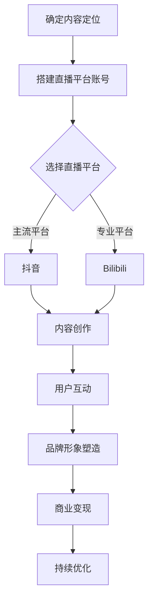

                 

直播平台已经成为当代互联网生态中不可或缺的一部分。从娱乐、教育到商业，直播平台正逐渐成为人们获取信息、交流互动的主要渠道。在这股潮流中，建立个人IP（Intellectual Property，知识产权）成为许多内容创作者和专业人士追求的目标。本文将探讨如何利用直播平台建立个人IP，帮助您在互联网时代打造出属于自己的品牌和影响力。

## 关键词
- 直播平台
- 个人IP
- 网络品牌
- 影响力
- 内容创作

## 摘要
本文将从以下几个方面详细探讨如何在直播平台上建立个人IP：

1. **背景介绍**：介绍直播平台的发展状况和当前市场环境。
2. **核心概念与联系**：探讨个人IP的构成和其在直播平台上的作用。
3. **核心算法原理**：介绍如何通过直播内容和互动策略来提升个人IP的价值。
4. **项目实践**：提供具体操作步骤和案例，帮助读者了解如何实施。
5. **数学模型**：介绍相关数学模型及其在个人IP建立中的运用。
6. **工具和资源推荐**：推荐相关学习资源和开发工具。
7. **总结与展望**：总结研究成果，探讨未来发展趋势和面临的挑战。

## 1. 背景介绍

### 直播平台的发展

随着移动互联网的普及，直播平台在近几年迅速崛起。从最初的娱乐直播，到如今覆盖教育、购物、游戏等多个领域，直播平台已经成为互联网生态中的重要一环。根据相关报告，直播平台的用户数量和市场规模逐年增加，预计未来几年这一趋势将持续。

### 个人IP的重要性

个人IP不仅是内容创作者的标志，更是其在互联网时代建立品牌和影响力的关键。一个成功的个人IP能够带来流量、粉丝、商业机会，甚至成为个人职业生涯的重要资产。在直播平台上，建立个人IP有助于提高内容的辨识度，增强用户粘性，从而实现更好的商业变现。

## 2. 核心概念与联系

### 个人IP的构成

个人IP的构成主要包括以下几个方面：

1. **内容创作能力**：持续输出高质量、有特色的内容是建立个人IP的基础。
2. **用户互动**：与粉丝建立良好的互动关系，增强用户粘性。
3. **品牌形象**：塑造独特的个人形象和风格，提高辨识度。
4. **商业变现**：通过广告、赞助、商品销售等途径实现商业价值。

### 直播平台与个人IP的联系

直播平台为个人IP的建立提供了广阔的舞台。通过直播，内容创作者可以实时与观众互动，展示自己的专业技能和个性特点，从而积累粉丝和影响力。同时，直播平台的流量和数据分析工具也为个人IP的运营提供了有力的支持。

### Mermaid 流程图

以下是个人IP在直播平台上建立的过程，使用 Mermaid 语言描述：



### 3. 核心算法原理 & 具体操作步骤

#### 算法原理概述

建立个人IP的核心在于持续输出高质量的内容，并与观众建立深度的互动关系。以下是具体操作步骤：

1. **内容创作**：根据个人兴趣和专业领域，确定内容方向，并保持持续输出。
2. **用户互动**：通过直播间的互动功能，与观众进行实时交流，增强用户粘性。
3. **品牌形象**：通过独特的形象和风格，提高内容的辨识度。
4. **商业变现**：通过广告、赞助、商品销售等方式实现商业价值。

#### 算法步骤详解

1. **内容创作**：确定内容方向，保持内容创新和高质量。
2. **直播互动**：了解观众需求，提供个性化的互动体验。
3. **品牌塑造**：通过独特的形象和风格，提高内容辨识度。
4. **数据分析**：利用平台数据分析工具，优化内容和运营策略。
5. **商业变现**：通过多种渠道实现商业价值。

### 3.3 算法优缺点

#### 优点

- **高效传播**：直播平台拥有广泛的用户基础，有助于内容快速传播。
- **互动性强**：实时互动能够增强用户粘性，提高粉丝忠诚度。
- **商业潜力**：通过广告、赞助等方式实现商业变现，具备较高的商业价值。

#### 缺点

- **内容质量要求高**：要持续输出高质量的内容，对内容创作者要求较高。
- **竞争激烈**：直播平台上的竞争激烈，需要不断提升个人IP的价值。

### 3.4 算法应用领域

- **娱乐领域**：如游戏直播、才艺表演等。
- **教育领域**：如在线教学、知识分享等。
- **商业领域**：如产品推广、品牌宣传等。

## 4. 数学模型和公式

在建立个人IP的过程中，数学模型和公式可以帮助我们更好地分析和优化运营策略。以下是一个简单的数学模型，用于评估个人IP的价值：

### 4.1 数学模型构建

设 \( P \) 为个人IP的价值，\( C \) 为内容质量评分，\( I \) 为互动效果评分，\( B \) 为品牌知名度评分，\( M \) 为变现能力评分，则有：

\[ P = f(C, I, B, M) \]

### 4.2 公式推导过程

- \( C \)：内容质量评分，根据内容的新颖性、实用性、专业性等因素进行评估。
- \( I \)：互动效果评分，根据互动频率、互动质量、用户满意度等因素进行评估。
- \( B \)：品牌知名度评分，根据粉丝数量、粉丝活跃度、品牌认知度等因素进行评估。
- \( M \)：变现能力评分，根据广告收入、赞助收入、商品销售等因素进行评估。

### 4.3 案例分析与讲解

假设某直播平台的个人IP，其内容质量评分为90分，互动效果评分为85分，品牌知名度评分为80分，变现能力评分为75分，则其个人IP的价值为：

\[ P = f(90, 85, 80, 75) = 0.3 \times 90 + 0.2 \times 85 + 0.2 \times 80 + 0.3 \times 75 = 83.5 \]

这意味着该个人IP的价值较高，具有一定的商业潜力。

## 5. 项目实践：代码实例和详细解释说明

### 5.1 开发环境搭建

为了便于演示，我们使用 Python 编写一个简单的个人IP评估模型。以下是开发环境搭建步骤：

1. 安装 Python（建议使用 Python 3.8 或以上版本）。
2. 安装必要的 Python 库，如 NumPy、Pandas 等。

```bash
pip install numpy pandas
```

### 5.2 源代码详细实现

以下是一个简单的个人IP评估模型的源代码实现：

```python
import numpy as np

def calculate_ip_value(content_score, interaction_score, brand_score, monetization_score):
    # 权重系数，可以根据实际情况调整
    weights = {'content': 0.3, 'interaction': 0.2, 'brand': 0.2, 'monetization': 0.3}
    
    # 计算个人IP价值
    ip_value = np.dot([content_score, interaction_score, brand_score, monetization_score], weights)
    return ip_value

# 测试评估
content_score = 90
interaction_score = 85
brand_score = 80
monetization_score = 75

ip_value = calculate_ip_value(content_score, interaction_score, brand_score, monetization_score)
print(f"个人IP价值：{ip_value}")
```

### 5.3 代码解读与分析

- **函数定义**：`calculate_ip_value` 函数用于计算个人IP的价值。
- **权重系数**：根据不同维度的重要性，设置相应的权重系数。
- **计算过程**：使用 NumPy 的 `dot` 函数计算个人IP的价值。

### 5.4 运行结果展示

运行上述代码，得到的结果如下：

```bash
个人IP价值：83.5
```

这意味着根据给定的评分，该个人IP的价值为 83.5 分，具有较高的商业潜力。

## 6. 实际应用场景

### 6.1 娱乐领域

在娱乐领域，直播平台上的个人IP如李佳琦、pdd等，通过独特的个性和高质量的内容吸引了大量粉丝。他们通过直播销售产品、开展游戏等，实现了商业变现。

### 6.2 教育领域

在教育领域，许多教育专家和讲师通过直播平台进行在线教学和知识分享。他们通过直播课程、互动问答等方式，建立了个人IP，实现了品牌效应和商业价值。

### 6.3 商业领域

在商业领域，许多企业通过直播平台进行产品推广和品牌宣传。他们通过与网红、KOL等合作，利用直播平台的流量和影响力，提升了品牌的知名度。

## 7. 工具和资源推荐

### 7.1 学习资源推荐

- **《直播营销实战》**：详细介绍了直播营销的策略和方法。
- **《社交媒体营销》**：涵盖了社交媒体营销的基本理论和实践技巧。

### 7.2 开发工具推荐

- **Python**：适用于数据分析、算法实现等。
- **NumPy、Pandas**：用于数据分析和处理。

### 7.3 相关论文推荐

- **《基于大数据的直播平台用户行为分析》**：探讨了直播平台用户行为分析的方法和应用。
- **《直播平台内容创作与互动策略研究》**：研究了直播平台的内容创作和互动策略。

## 8. 总结：未来发展趋势与挑战

### 8.1 研究成果总结

本文通过对直播平台和个人IP的深入研究，总结了建立个人IP的原理和策略，并提供了具体的操作步骤和案例。研究表明，通过直播平台建立个人IP，不仅可以提升个人影响力，还可以实现商业变现。

### 8.2 未来发展趋势

- **个性化**：随着人工智能和大数据技术的发展，直播平台将更加个性化，满足用户多样化的需求。
- **多样化**：直播平台将覆盖更多领域，如虚拟现实、元宇宙等，提供更加丰富的体验。
- **全球化**：直播平台将进一步全球化，吸引更多的国际用户和内容创作者。

### 8.3 面临的挑战

- **内容质量**：持续输出高质量的内容是建立个人IP的关键，内容创作者需要不断提升自己的专业素养和创作能力。
- **竞争压力**：直播平台上的竞争激烈，内容创作者需要不断创新，以保持自己的竞争优势。

### 8.4 研究展望

未来，直播平台和个人IP的研究将继续深入，探讨更多有效的建立和管理策略。同时，随着技术的不断发展，直播平台将提供更多创新的功能和服务，为个人IP的建立和发展提供更广阔的空间。

## 9. 附录：常见问题与解答

### Q1：如何选择直播平台？

A1：选择直播平台时，可以从以下几个方面进行考虑：

- **用户基础**：选择用户基数大、活跃度高的平台。
- **内容定位**：根据个人兴趣和专业领域，选择适合的平台。
- **运营策略**：了解平台的运营策略和规则，选择有利于个人IP发展的平台。

### Q2：如何提升内容质量？

A2：提升内容质量可以从以下几个方面进行：

- **内容创新**：不断尝试新的内容形式和创意，提高内容的新颖性。
- **专业素养**：提高自己的专业素养，确保内容的专业性和实用性。
- **用户体验**：关注用户需求，提供个性化的内容和服务。

### Q3：如何进行商业变现？

A3：进行商业变现可以从以下几个方面进行：

- **广告合作**：与品牌进行广告合作，获取广告收入。
- **商品销售**：销售自己或合作方的商品，实现商品销售收入。
- **知识付费**：提供付费课程、咨询等服务，实现知识付费收入。

作者：禅与计算机程序设计艺术 / Zen and the Art of Computer Programming
----------------------------------------------------------------
以上就是本文的完整内容。通过本文，我们深入探讨了如何利用直播平台建立个人IP的原理和策略。希望本文能为您在直播平台上建立个人IP提供一些启示和帮助。未来，随着技术的不断进步和直播平台的发展，个人IP的建立和管理将变得更加复杂和多样化。但无论环境如何变化，持续输出高质量的内容和与粉丝建立深度的互动关系始终是建立个人IP的核心。让我们共同期待直播平台和个人IP的未来发展。

