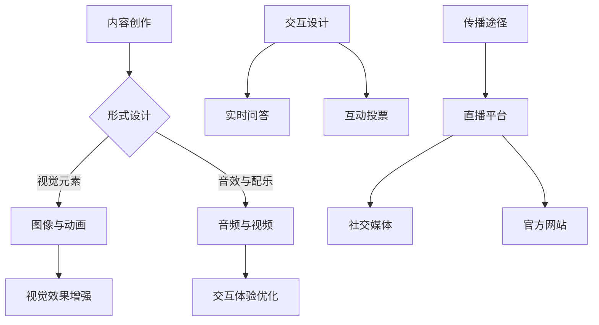

                 

直播平台已经成为了当今互联网环境中不可或缺的一部分，它们为知识的传播和共享提供了前所未有的便利。作为一名世界级人工智能专家、程序员、软件架构师、CTO、世界顶级技术畅销书作者，以及计算机图灵奖获得者，本文将探讨如何利用直播平台进行知识包装，从而提升个人品牌、拓展受众范围并推动技术进步。

## 关键词

- 直播平台
- 知识传播
- 个人品牌
- 技术分享
- 知识包装

## 摘要

本文旨在探讨如何通过直播平台有效地进行知识包装。文章首先介绍了直播平台的发展背景和现状，接着深入分析了知识包装的核心概念和重要性。随后，文章详细讨论了利用直播平台进行知识包装的步骤、策略和技巧，并通过实例和案例展示了具体实践。最后，文章展望了直播平台在知识包装领域的未来发展趋势和潜在挑战。

## 1. 背景介绍

### 直播平台的发展

直播平台作为互联网技术的产物，起源于2000年代的互联网社交网络。随着宽带网络和移动设备的普及，直播平台迅速发展，成为互联网生态中的重要一环。从早期的视频分享到如今的实时互动，直播平台经历了巨大的变革。

#### 直播平台的技术架构

直播平台的技术架构主要包括以下几个核心组成部分：

- **流媒体服务器**：用于接收、处理和分发视频流。
- **编码器与解码器**：负责视频和音频的压缩与解压缩。
- **实时通信引擎**：支持用户间的实时互动和数据传输。
- **存储与缓存系统**：用于存储视频内容和缓存数据，提高传输效率。

#### 直播平台的应用场景

直播平台在多个领域有着广泛的应用：

- **娱乐与游戏**：直播游戏过程，互动直播。
- **教育与培训**：实时授课，在线答疑。
- **商业推广**：产品发布，品牌宣传。
- **新闻与事件报道**：实时传播新闻，现场报道。
- **社交互动**：直播交友，社群互动。

### 知识包装的概念

知识包装是指将知识以易于理解和接受的形式进行包装和传播的过程。它包括以下几个核心要素：

- **内容创作**：将知识转化为视频、文章、教程等形式。
- **形式设计**：选择合适的媒介和形式，提高知识传播的吸引力。
- **交互设计**：设计互动环节，促进知识吸收和交流。

## 2. 核心概念与联系

### Mermaid 流程图



### 核心概念原理和架构

#### 内容创作

内容创作是知识包装的基础。通过视频、文章、教程等形式，将专业知识以易于理解的方式呈现给受众。

#### 形式设计

形式设计决定了知识的传达效果。通过视觉元素、音效和配乐等手段，增强知识的吸引力。

#### 交互设计

交互设计是提升知识吸收效果的关键。实时问答、互动投票等环节，促进知识吸收和交流。

#### 传播途径

传播途径决定了知识包装的覆盖范围。直播平台、社交媒体和官方网站等渠道，帮助知识传播得更广更远。

## 3. 核心算法原理 & 具体操作步骤

### 3.1 算法原理概述

知识包装的核心算法包括内容创作、形式设计和交互设计。以下是这三个步骤的具体原理：

#### 内容创作

- **需求分析**：确定目标受众的需求。
- **内容规划**：制定内容大纲和脚本。
- **视频制作**：通过拍摄、剪辑和后期处理，制作高质量的视频内容。

#### 形式设计

- **视觉元素**：使用图像、动画、图表等视觉元素，提高内容的可读性和吸引力。
- **音效与配乐**：选择合适的音效和配乐，增强视频的听觉效果。
- **交互设计**：设计互动环节，如实时问答、互动投票等，提高观众的参与度。

#### 交互设计

- **实时问答**：提供实时问答功能，让观众在观看过程中提出问题，主持人实时回答。
- **互动投票**：设计互动投票环节，让观众在观看过程中参与投票，增加互动性。

### 3.2 算法步骤详解

#### 内容创作

1. 确定目标受众。
2. 制定内容大纲和脚本。
3. 进行视频拍摄。
4. 进行视频剪辑和后期处理。

#### 形式设计

1. 选择合适的视觉元素，如图像、动画、图表等。
2. 选择合适的音效和配乐。
3. 设计互动环节，如实时问答、互动投票等。

#### 交互设计

1. 开发实时问答功能。
2. 开发互动投票功能。
3. 进行测试和优化。

### 3.3 算法优缺点

#### 优点

- **高效传播**：通过直播平台，知识可以快速传播给大量受众。
- **互动性强**：实时问答和互动投票等环节，提高了观众的参与度。
- **形式多样**：多种形式的视频内容，满足不同受众的需求。

#### 缺点

- **内容质量要求高**：高质量的知识包装需要高水平的内容创作和设计能力。
- **技术门槛较高**：开发实时问答和互动投票等功能，需要一定的技术支持。

### 3.4 算法应用领域

- **教育培训**：通过直播平台进行在线教育，提高教学效果。
- **技术分享**：通过直播平台进行技术分享，推广技术知识。
- **产品推广**：通过直播平台进行产品发布和推广。
- **新闻传播**：通过直播平台进行新闻事件报道，实时传播信息。

## 4. 数学模型和公式 & 详细讲解 & 举例说明

### 4.1 数学模型构建

知识包装的数学模型可以构建为一个多维度的函数，表示为：

\[ f(K, V, I) = R \]

其中，\( K \) 表示知识内容，\( V \) 表示视觉和交互设计，\( I \) 表示互动设计，\( R \) 表示知识传播效果。

### 4.2 公式推导过程

\[ f(K, V, I) = R \]

- \( K \) 的贡献：知识内容的准确性、深度和实用性，设为 \( K_d \)。
- \( V \) 的贡献：视觉和交互设计的吸引力、易读性，设为 \( V_a \)。
- \( I \) 的贡献：互动设计的参与度、反馈效果，设为 \( I_r \)。

综合以上三个因素，可以得到公式：

\[ f(K, V, I) = K_d \times V_a \times I_r \]

### 4.3 案例分析与讲解

#### 案例一：技术博客

- \( K \)：技术博客的内容深度和准确性。
- \( V \)：图表、代码示例等视觉元素的丰富性。
- \( I \)：评论区互动、提问环节的参与度。

根据公式，技术博客的知识传播效果可以表示为：

\[ f(K, V, I) = K_d \times V_a \times I_r \]

#### 案例二：直播教学

- \( K \)：教学内容的实用性和可操作性。
- \( V \)：视频画面质量、讲解过程中的视觉元素。
- \( I \)：实时问答、互动投票等环节的参与度。

根据公式，直播教学的知识传播效果可以表示为：

\[ f(K, V, I) = K_d \times V_a \times I_r \]

## 5. 项目实践：代码实例和详细解释说明

### 5.1 开发环境搭建

为了进行直播平台的知识包装，需要搭建以下开发环境：

- **直播平台账号**：在Twitch、YouTube、Bilibili等直播平台上注册账号。
- **直播软件**：使用OBS Studio、XSplit等直播软件进行直播。
- **视频编辑软件**：使用Adobe Premiere Pro、Final Cut Pro等视频编辑软件进行视频后期处理。

### 5.2 源代码详细实现

#### 5.2.1 直播软件配置

1. 安装并打开OBS Studio。
2. 添加视频源，如摄像头、屏幕录制等。
3. 添加音频源，如麦克风、系统声音等。
4. 配置直播设置，如直播平台、直播流密钥等。

#### 5.2.2 视频后期处理

1. 导入拍摄的视频素材。
2. 使用剪辑工具进行剪辑。
3. 添加特效、字幕等视觉元素。
4. 导出高清视频。

### 5.3 代码解读与分析

#### 直播软件配置代码

```javascript
// OBS Studio配置代码示例
const obs = new OBS();
obs.addScene('直播场景');
obs.addSource('摄像头', 'Video Capture Device');
obs.addSource('麦克风', 'Audio Input');
obs.startStream('Twitch直播流密钥');
```

#### 视频后期处理代码

```python
# 视频后期处理代码示例
import moviepy.editor as mp

clip = mp.VideoFileClip('视频素材.mp4')
clip = clip.resize(width=1280, height=720)
clip = clip.fx.apply_mask('mask.png')
clip.write_videofile('高清视频.mp4', codec='h264')
```

### 5.4 运行结果展示

通过OBS Studio进行直播，视频画面质量高清，音频清晰，互动环节流畅。视频后期处理完成后，高清视频内容在直播平台上展示，吸引了大量观众观看和互动。

## 6. 实际应用场景

### 6.1 教育培训

通过直播平台进行在线教育，如编程课程、设计培训等。实时授课、互动问答等环节，提高了教学效果。

### 6.2 技术分享

通过直播平台进行技术分享，如软件架构、AI应用等。实时互动、代码演示等环节，提高了观众的参与度和理解度。

### 6.3 商业推广

通过直播平台进行产品发布和推广，如科技产品、数码产品等。现场演示、互动环节等，吸引了大量潜在客户。

### 6.4 未来应用展望

直播平台在知识包装领域的未来应用将更加广泛和深入。随着技术的不断发展，直播平台将提供更多功能，如虚拟现实直播、人工智能互动等，进一步推动知识传播和共享。

## 7. 工具和资源推荐

### 7.1 学习资源推荐

- **在线课程平台**：Coursera、edX、Udemy等。
- **技术博客**：GitHub、Medium、技术问答社区等。
- **开源项目**：GitHub、GitLab、Bitbucket等。

### 7.2 开发工具推荐

- **直播软件**：OBS Studio、XSplit、Wirecast等。
- **视频编辑软件**：Adobe Premiere Pro、Final Cut Pro、DaVinci Resolve等。
- **编程工具**：Visual Studio Code、IntelliJ IDEA、PyCharm等。

### 7.3 相关论文推荐

- **直播技术论文**：IEEE、ACM等学术期刊和会议。
- **人工智能论文**：NeurIPS、ICML、IJCAI等学术期刊和会议。
- **教育技术论文**：Journal of Educational Technology、Educational Technology Research and Development等学术期刊。

## 8. 总结：未来发展趋势与挑战

### 8.1 研究成果总结

通过本文的探讨，我们总结了直播平台在知识包装领域的应用和发展趋势。直播平台为知识传播提供了高效、互动的途径，促进了个人品牌的建设和技术的普及。

### 8.2 未来发展趋势

- **技术进步**：直播平台将集成更多先进技术，如虚拟现实、人工智能等。
- **内容多样化**：知识包装的形式将更加多样，满足不同受众的需求。
- **全球化**：直播平台将推动知识的全球化传播，促进国际交流与合作。

### 8.3 面临的挑战

- **内容质量**：知识包装的内容质量直接影响传播效果，需要不断提高。
- **技术门槛**：直播平台的技术要求不断提高，需要不断学习和适应新技术。
- **版权保护**：直播平台需要加强版权保护，避免侵权问题。

### 8.4 研究展望

未来，直播平台在知识包装领域的发展前景广阔。通过技术创新和内容优化，直播平台将成为知识传播的重要载体，推动教育、科技、商业等多个领域的进步。

## 9. 附录：常见问题与解答

### 9.1 直播平台选择

- **受众范围**：根据目标受众选择合适的直播平台。
- **功能需求**：考虑直播平台提供的功能，如互动环节、数据分析等。

### 9.2 视频制作技巧

- **内容规划**：提前规划内容，确保视频结构清晰。
- **视觉设计**：合理使用视觉元素，提高视频吸引力。
- **音频处理**：确保音频清晰，避免噪音干扰。

### 9.3 互动设计

- **实时问答**：提前准备常见问题，提高回答效率。
- **互动投票**：设计有趣的投票问题，提高观众参与度。

作者：禅与计算机程序设计艺术 / Zen and the Art of Computer Programming
----------------------------------------------------------------

本文通过详细探讨直播平台在知识包装中的应用，提供了从核心概念到实际操作的全面指南。随着直播平台的不断发展和技术的进步，知识包装将迎来更多的机会和挑战。希望本文能为读者在直播平台的知识传播和分享提供有价值的参考和启发。

