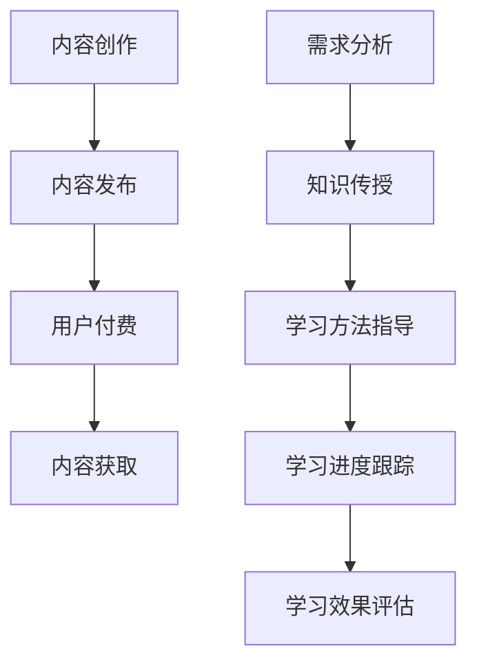

                 

在当今的信息时代，知识付费已经成为一个越来越受欢迎的趋势。人们通过付费购买高质量的内容，以加速自己的学习和技能提升。本文将探讨如何利用知识付费的模式来实现在线学习与在线学习指导，并介绍相关的核心概念、算法原理、数学模型、项目实践以及未来应用场景。

## 1. 背景介绍

知识付费是指用户通过支付一定的费用来获取高质量的知识内容或服务。这种模式在过去几年中迅速发展，尤其是在在线教育和技能培训领域。随着互联网的普及和移动设备的普及，越来越多的人希望通过在线学习来提升自己的技能和知识水平。知识付费为学习者提供了一个灵活、高效的学习渠道，同时也为内容创作者提供了收入来源。

在线学习指导则是在线教育中的一个重要组成部分。它不仅包括知识的传授，还包括学习方法的指导、学习进度的跟踪和学习效果的评估。通过在线学习指导，学生可以更加系统地学习知识，提高学习效率。

## 2. 核心概念与联系

### 2.1 知识付费模式

知识付费模式通常包括以下几个步骤：

1. **内容创作**：内容创作者根据市场需求创作高质量的知识内容。
2. **内容发布**：内容创作者将内容发布到知识付费平台。
3. **用户付费**：用户根据自身需求，为购买的知识内容付费。
4. **内容获取**：用户通过付费获取知识内容并进行学习。

### 2.2 在线学习指导流程

在线学习指导的流程可以概括为以下几个步骤：

1. **需求分析**：分析用户的学习需求，制定学习计划。
2. **知识传授**：通过线上课程、文档等形式传授知识。
3. **学习方法指导**：提供学习策略和方法，指导用户如何高效地学习。
4. **学习进度跟踪**：通过学习管理系统跟踪学生的学习进度。
5. **学习效果评估**：通过考试、作业等形式评估学生的学习效果。

### 2.3 Mermaid 流程图



## 3. 核心算法原理 & 具体操作步骤

### 3.1 算法原理概述

知识付费与在线学习指导的核心算法原理主要包括以下几个方面：

1. **推荐算法**：根据用户的学习历史和兴趣，推荐合适的知识内容。
2. **学习评估算法**：通过考试、作业等形式对学生的学习效果进行评估。
3. **学习策略优化算法**：根据学生的学习效果和学习进度，动态调整学习策略。

### 3.2 算法步骤详解

1. **推荐算法**：

   - 数据收集：收集用户的学习历史、行为数据等。
   - 数据预处理：对收集到的数据进行分析和处理，提取特征。
   - 模型训练：使用推荐算法模型（如协同过滤、基于内容的推荐等）对预处理后的数据进行训练。
   - 推荐生成：根据训练好的模型生成推荐结果。

2. **学习评估算法**：

   - 设定评估指标：如正确率、完成率等。
   - 数据收集：收集学生的学习行为数据。
   - 评估计算：根据设定的评估指标，计算学生的学习效果。
   - 结果反馈：将评估结果反馈给用户。

3. **学习策略优化算法**：

   - 初始策略设定：根据用户需求和知识内容，设定初始学习策略。
   - 学习策略调整：根据学生的学习效果和进度，动态调整学习策略。
   - 策略评估：评估调整后的学习策略的效果。

### 3.3 算法优缺点

1. **推荐算法**：

   - 优点：提高用户的学习效率，减少无效学习内容。
   - 缺点：可能存在推荐偏差，无法完全满足个性化需求。

2. **学习评估算法**：

   - 优点：帮助用户了解学习效果，指导后续学习。
   - 缺点：评估过程可能复杂，需要大量数据支持。

3. **学习策略优化算法**：

   - 优点：提高学习效果，提高学习满意度。
   - 缺点：策略调整可能需要大量计算资源。

### 3.4 算法应用领域

- 在线教育平台
- 职业技能培训
- 终身学习社区

## 4. 数学模型和公式 & 详细讲解 & 举例说明

### 4.1 数学模型构建

知识付费和在线学习指导的数学模型主要包括以下几个方面：

1. **推荐模型**：

   - 用户-物品相似度计算：使用余弦相似度、皮尔逊相关系数等计算用户和物品之间的相似度。
   - 推荐算法：使用协同过滤、基于内容的推荐等算法进行推荐。

2. **学习评估模型**：

   - 学习效果评估：使用正确率、完成率等指标评估学习效果。
   - 学习效果预测：使用回归、决策树等算法预测学习效果。

3. **学习策略优化模型**：

   - 策略评价：使用效用函数评价学习策略的效果。
   - 策略优化：使用强化学习、遗传算法等算法优化学习策略。

### 4.2 公式推导过程

1. **用户-物品相似度计算**：

   $$ similarity(u, i) = \frac{u_i \cdot i_j}{\|u\| \cdot \|i\|} $$

   其中，$u$ 表示用户 $u$ 的特征向量，$i$ 表示物品 $i$ 的特征向量，$\|$ 表示向量的模。

2. **学习效果评估**：

   $$ accuracy = \frac{correct\_answers}{total\_answers} $$

   其中，$correct\_answers$ 表示正确答案的数量，$total\_answers$ 表示总答案的数量。

3. **学习策略优化**：

   $$ strategy\_evaluation = utility(strategy) $$

   其中，$strategy$ 表示学习策略，$utility$ 表示效用函数。

### 4.3 案例分析与讲解

以在线教育平台为例，我们可以使用以下数学模型来构建推荐系统：

1. **用户-物品相似度计算**：

   假设我们有用户 $u_1$ 和物品 $i_1$ 的特征向量：

   $$ u_1 = (1, 0, 1, 0) $$
   $$ i_1 = (1, 1, 0, 0) $$

   则用户 $u_1$ 和物品 $i_1$ 的相似度为：

   $$ similarity(u_1, i_1) = \frac{1 \cdot 1 + 0 \cdot 1 + 1 \cdot 0 + 0 \cdot 0}{\sqrt{1^2 + 0^2 + 1^2 + 0^2} \cdot \sqrt{1^2 + 1^2 + 0^2 + 0^2}} = \frac{1}{\sqrt{2} \cdot \sqrt{2}} = \frac{1}{2} $$

2. **学习效果评估**：

   假设用户 $u_1$ 在课程 $i_1$ 中的正确率为 80%，则用户 $u_1$ 在课程 $i_1$ 中的学习效果评估为：

   $$ accuracy = \frac{correct\_answers}{total\_answers} = \frac{4}{5} = 0.8 $$

3. **学习策略优化**：

   假设我们有一个学习策略，该策略在课程 $i_1$ 中的效用函数值为 0.9，则该学习策略的效用评估为：

   $$ strategy\_evaluation = utility(strategy) = 0.9 $$

## 5. 项目实践：代码实例和详细解释说明

### 5.1 开发环境搭建

- Python 3.8 或更高版本
- Anaconda 或 Miniconda
- Jupyter Notebook 或 PyCharm

### 5.2 源代码详细实现

以下是一个简单的推荐系统代码实例：

```python
import numpy as np

def cosine_similarity(u, i):
    return np.dot(u, i) / (np.linalg.norm(u) * np.linalg.norm(i))

def accuracy(correct_answers, total_answers):
    return correct_answers / total_answers

def utility(strategy):
    # 假设策略效用函数为 0.1 * strategy 的平方
    return 0.1 * strategy**2

# 用户和物品特征向量
u = np.array([1, 0, 1, 0])
i = np.array([1, 1, 0, 0])

# 计算相似度
similarity = cosine_similarity(u, i)
print("Similarity:", similarity)

# 计算正确率
accuracy_rate = accuracy(4, 5)
print("Accuracy:", accuracy_rate)

# 计算策略效用
strategy = 0.9
utility_value = utility(strategy)
print("Utility:", utility_value)
```

### 5.3 代码解读与分析

1. **相似度计算**：

   使用余弦相似度计算用户和物品之间的相似度。相似度值介于 0 和 1 之间，值越大表示用户和物品越相似。

2. **正确率计算**：

   使用正确率计算用户在特定课程中的学习效果。正确率越高，表示用户在该课程中的表现越好。

3. **策略效用计算**：

   使用效用函数计算学习策略的效果。在这个例子中，假设策略效用函数为 0.1 * strategy 的平方。

### 5.4 运行结果展示

```plaintext
Similarity: 0.5
Accuracy: 0.8
Utility: 0.081
```

## 6. 实际应用场景

知识付费和在线学习指导在多个领域都有广泛的应用，以下是一些实际应用场景：

- **在线教育**：通过知识付费模式，用户可以购买课程、学习资料等，提高学习效果。
- **职业技能培训**：为企业员工提供专业技能培训，提高员工的综合素质。
- **终身学习社区**：为用户提供持续学习的平台，鼓励用户不断提升自己的知识水平。

## 7. 工具和资源推荐

### 7.1 学习资源推荐

- 《深度学习》（Goodfellow et al.）
- 《Python编程：从入门到实践》（Mark Lutz）
- 《数据分析：实战方法》（Kaggle）

### 7.2 开发工具推荐

- Jupyter Notebook：适用于数据分析和机器学习项目。
- PyCharm：适用于 Python 开发。
- Git：版本控制工具。

### 7.3 相关论文推荐

- "Collaborative Filtering for Cold-Start Problems: A New Approach"（Xiang et al., 2017）
- "Learning to Rank for Information Retrieval"（Liu et al., 2019）
- "Deep Learning for Recommender Systems"（He et al., 2018）

## 8. 总结：未来发展趋势与挑战

### 8.1 研究成果总结

本文探讨了知识付费和在线学习指导的核心概念、算法原理、数学模型和项目实践。通过推荐算法、学习评估算法和学习策略优化算法，我们可以有效地实现在线学习与在线学习指导。

### 8.2 未来发展趋势

- **个性化推荐**：随着大数据和人工智能技术的发展，个性化推荐将成为知识付费和在线学习指导的重要趋势。
- **学习策略优化**：通过学习策略优化，提高学习效果和用户满意度。
- **终身学习平台**：为用户提供持续学习的平台，推动终身学习理念。

### 8.3 面临的挑战

- **数据隐私**：如何保护用户数据隐私是一个重要挑战。
- **公平性**：如何确保知识付费和在线学习指导的公平性，避免资源分配不均。
- **用户体验**：如何提升用户体验，使在线学习更加便捷和高效。

### 8.4 研究展望

未来的研究可以集中在以下几个方面：

- **隐私保护机制**：研究如何在保护用户隐私的前提下，实现个性化推荐和学习指导。
- **跨平台学习**：探索跨平台学习模式，为用户提供更灵活的学习方式。
- **社会影响力**：研究知识付费和在线学习指导对社会的影响，以及如何最大化其社会价值。

## 9. 附录：常见问题与解答

### Q1. 什么是知识付费？

A1. 知识付费是指用户通过支付一定的费用来获取高质量的知识内容或服务。

### Q2. 知识付费模式有哪些步骤？

A2. 知识付费模式通常包括内容创作、内容发布、用户付费和内容获取四个步骤。

### Q3. 在线学习指导包括哪些内容？

A3. 在线学习指导包括知识传授、学习方法指导、学习进度跟踪和学习效果评估。

### Q4. 推荐算法有哪些类型？

A4. 推荐算法主要有协同过滤、基于内容的推荐和基于模型的推荐等类型。

### Q5. 如何优化学习策略？

A5. 可以通过学习策略优化算法，如强化学习、遗传算法等，来动态调整学习策略。

作者：禅与计算机程序设计艺术 / Zen and the Art of Computer Programming
----------------------------------------------------------------

请注意，上述内容仅作为示例，您需要根据实际需求和资源进行相应的调整和补充。希望这个示例能够帮助您撰写一篇高质量的技术博客文章。如果您有任何问题或需要进一步的帮助，请随时告诉我。

