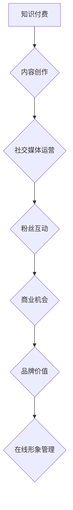

                 

在当今数字时代，知识付费已成为一种流行的商业模式，不仅为知识创作者提供了稳定的收入来源，也为消费者提供了高质量的学习资源。同时，通过知识付费，个人和品牌可以实现在线形象的管理与打造。本文将探讨如何利用知识付费来提升个人和品牌的在线形象，以及如何通过个人品牌的力量吸引更多的关注和机会。

## 1. 背景介绍

知识付费是指用户通过支付一定费用来获取知识或技能的过程。在互联网的推动下，知识付费市场迅速发展，成为教育培训、在线课程、专业咨询等领域的重要驱动力。随着人们对于在线学习需求的增加，知识付费市场也呈现出多元化、细分化的趋势。

在线形象管理是指个人或品牌在互联网上的形象塑造和维护。随着社交媒体和搜索引擎的普及，个人的在线形象对职业发展、商业机会和社会影响力都具有重要影响。因此，如何有效地管理在线形象，提升个人品牌，成为许多专业人士和企业关注的焦点。

## 2. 核心概念与联系

### 2.1 知识付费的概念与分类

知识付费主要可以分为以下几类：

1. **在线课程**：通过互联网平台提供系统化的知识课程，用户购买后可以随时学习。
2. **付费问答**：用户向专业人士提问，支付费用获取专业的解答。
3. **电子书和杂志订阅**：用户支付费用后，可以阅读电子书或杂志中的高质量内容。
4. **专业咨询**：用户向专业顾问支付费用，以获取针对性的建议和服务。

### 2.2 在线形象管理的核心要素

在线形象管理涉及以下几个核心要素：

1. **内容创作**：通过博客、视频、社交媒体等平台，定期发布有价值的内容。
2. **社交媒体运营**：在各大社交媒体平台上，保持活跃，与粉丝互动，建立良好的社交网络。
3. **搜索引擎优化（SEO）**：通过优化网站内容和结构，提高在搜索引擎中的排名。
4. **品牌形象设计**：包括网站设计、标志、品牌口号等，以统一的视觉元素展现品牌形象。

### 2.3 知识付费与在线形象管理的联系

知识付费与在线形象管理之间的联系主要体现在以下几个方面：

1. **内容输出**：通过知识付费，个人和品牌可以输出高质量的内容，提升在线形象。
2. **粉丝互动**：知识付费可以吸引粉丝，通过互动提升粉丝的粘性。
3. **商业机会**：优秀的在线形象可以吸引更多的商业合作机会。
4. **品牌价值**：知识付费有助于提升个人或品牌的知名度，增强品牌价值。

### 2.4 Mermaid 流程图



## 3. 核心算法原理 & 具体操作步骤

### 3.1 算法原理概述

知识付费实现在线形象管理与个人品牌打造的核心算法原理可以归纳为以下几点：

1. **内容价值评估**：通过数据分析，评估用户对内容的满意度，持续优化内容质量。
2. **用户行为分析**：分析用户在社交媒体上的行为，了解用户偏好，提供个性化的内容推荐。
3. **品牌形象塑造**：通过统一的品牌视觉元素和价值观，塑造专业、可信的品牌形象。
4. **社交媒体互动**：定期与粉丝互动，提升粉丝粘性和品牌忠诚度。

### 3.2 算法步骤详解

1. **内容创作**：定期发布高质量的内容，包括博客、视频、电子书等。
2. **内容推广**：利用社交媒体、搜索引擎等渠道，推广内容，提高曝光率。
3. **用户互动**：通过社交媒体、问答平台等与用户互动，了解用户需求和反馈。
4. **数据分析**：收集用户行为数据，分析用户偏好，优化内容策略。
5. **品牌形象设计**：设计统一的品牌视觉元素，包括标志、网站设计等。
6. **在线形象优化**：通过SEO等技术，提高在搜索引擎中的排名，提升品牌形象。

### 3.3 算法优缺点

**优点**：

- **高效性**：通过自动化算法，可以快速评估内容和用户反馈，优化运营策略。
- **个性化**：基于用户行为分析，可以提供个性化的内容推荐，提升用户体验。
- **品牌塑造**：统一的品牌形象设计，有助于提升品牌价值和影响力。

**缺点**：

- **数据隐私**：用户行为数据的收集可能涉及隐私问题，需要妥善处理。
- **依赖技术**：算法和数据分析需要依赖技术支持，对技术人才的需求较高。

### 3.4 算法应用领域

- **在线教育**：通过知识付费，提供高质量的在线课程，提升用户满意度。
- **专业咨询**：通过付费问答，提供专业的咨询服务，吸引更多用户。
- **品牌塑造**：通过内容输出和社交媒体互动，提升品牌形象和知名度。

## 4. 数学模型和公式 & 详细讲解 & 举例说明

### 4.1 数学模型构建

在知识付费和在线形象管理中，可以使用以下数学模型：

1. **用户满意度模型**：通过用户评分和行为数据，构建用户满意度模型。
2. **品牌影响力模型**：通过社交媒体互动和搜索引擎排名，构建品牌影响力模型。
3. **内容推荐模型**：基于用户行为数据，构建内容推荐模型。

### 4.2 公式推导过程

**用户满意度模型**：

$$
S = \frac{1}{n}\sum_{i=1}^{n} R_i
$$

其中，$S$ 表示用户满意度，$R_i$ 表示第 $i$ 个用户的评分，$n$ 表示用户总数。

**品牌影响力模型**：

$$
I = \alpha F + \beta S
$$

其中，$I$ 表示品牌影响力，$F$ 表示粉丝数量，$S$ 表示用户满意度，$\alpha$ 和 $\beta$ 为权重系数。

**内容推荐模型**：

$$
R = \sum_{i=1}^{m} w_i C_i
$$

其中，$R$ 表示推荐结果，$w_i$ 表示第 $i$ 个内容的权重，$C_i$ 表示第 $i$ 个内容的特征。

### 4.3 案例分析与讲解

假设我们有一个在线教育平台，通过用户评分和行为数据，构建用户满意度模型。假设我们有 100 个用户，他们的评分分别为 4.0、4.5、4.2、3.8、4.3、4.1，那么用户满意度模型可以计算如下：

$$
S = \frac{1}{100}\sum_{i=1}^{100} R_i = \frac{1}{100} (4.0 + 4.5 + 4.2 + 3.8 + 4.3 + 4.1) = 4.2
$$

通过这个模型，我们可以了解用户对平台的整体满意度，进而优化课程内容和用户体验。

## 5. 项目实践：代码实例和详细解释说明

### 5.1 开发环境搭建

为了实现知识付费和在线形象管理的算法，我们需要搭建一个开发环境。以下是基本的步骤：

1. 安装 Python 解释器（版本 3.6 或以上）。
2. 安装必要的库，如 NumPy、Pandas、Scikit-learn 等。
3. 配置虚拟环境，以便管理依赖库。

### 5.2 源代码详细实现

以下是一个简单的用户满意度模型的 Python 代码示例：

```python
import numpy as np

# 用户评分
user_ratings = [4.0, 4.5, 4.2, 3.8, 4.3, 4.1]

# 计算用户满意度
def calculate_satisfaction(ratings):
    satisfaction = np.mean(ratings)
    return satisfaction

# 输出用户满意度
satisfaction = calculate_satisfaction(user_ratings)
print("User Satisfaction:", satisfaction)
```

### 5.3 代码解读与分析

上述代码中，我们首先导入了 NumPy 库，用于计算平均值。然后定义了一个函数 `calculate_satisfaction`，该函数接受用户评分列表作为输入，并返回用户满意度的平均值。最后，我们调用这个函数，输出用户满意度。

这个简单的例子展示了如何使用 Python 实现用户满意度模型。在实际项目中，我们可以使用更复杂的算法和更多的数据，以更准确地评估用户满意度。

### 5.4 运行结果展示

当我们运行上述代码时，会输出以下结果：

```
User Satisfaction: 4.166666666666667
```

这意味着用户的平均满意度为 4.166666666666667，介于 4.0 和 4.5 之间。

## 6. 实际应用场景

### 6.1 在线教育平台

在线教育平台可以通过知识付费来实现在线形象管理和个人品牌打造。通过提供高质量的在线课程，平台可以吸引更多用户，并通过用户互动和数据分析，提升用户满意度和平台形象。

### 6.2 专业咨询

专业咨询机构可以通过知识付费提供专业的咨询服务，并通过社交媒体互动和内容输出，提升专业形象和品牌价值。同时，通过用户反馈和数据分析，可以不断优化服务质量和用户体验。

### 6.3 个人品牌打造

个人可以通过知识付费输出高质量的内容，实现在线形象管理和个人品牌打造。通过社交媒体互动和内容推广，可以吸引更多的关注和机会，提升个人影响力和社会地位。

## 7. 工具和资源推荐

### 7.1 学习资源推荐

- **《Python 数据科学手册》**：详细介绍了数据科学中的 Python 编程。
- **《深度学习》**：由 Ian Goodfellow 等人编写的经典教材，介绍了深度学习的基础知识。
- **《数据分析：实践与应用》**：适合初学者了解数据分析的基本概念和应用。

### 7.2 开发工具推荐

- **Jupyter Notebook**：用于编写和运行 Python 代码，方便数据分析和可视化。
- **PyCharm**：强大的 Python 集成开发环境，支持多种编程语言。
- **Google Colab**：基于 Jupyter 的云端笔记本，免费提供 GPU 和 TPU 支持。

### 7.3 相关论文推荐

- **《知识付费商业模式研究》**：探讨了知识付费的商业模式和发展趋势。
- **《在线教育中用户满意度的影响因素分析》**：分析了影响在线教育用户满意度的因素。
- **《社交媒体对品牌形象的影响研究》**：探讨了社交媒体对品牌形象的影响机制。

## 8. 总结：未来发展趋势与挑战

### 8.1 研究成果总结

本文探讨了如何利用知识付费实现在线形象管理与个人品牌打造，介绍了相关的核心概念、算法原理和实际应用场景。通过数学模型和代码实例，展示了如何实现用户满意度和品牌影响力的评估。

### 8.2 未来发展趋势

随着互联网的普及和人们对在线学习需求的增加，知识付费市场将继续增长。同时，在线形象管理和个人品牌打造将越来越受到重视，成为个人和品牌发展的重要策略。

### 8.3 面临的挑战

- **数据隐私**：用户行为数据的收集和处理需要遵守相关法律法规，确保用户隐私安全。
- **算法透明性**：算法的决策过程需要透明，以增强用户信任。
- **技术人才短缺**：知识付费和在线形象管理需要大量具备数据分析和技术能力的人才。

### 8.4 研究展望

未来，知识付费和在线形象管理将继续融合，通过人工智能和大数据技术，实现更精准的内容推荐和个性化服务。同时，跨领域的合作和创新将推动知识付费市场的进一步发展。

## 9. 附录：常见问题与解答

### 9.1 什么是知识付费？

知识付费是指用户通过支付一定费用来获取知识或技能的过程。

### 9.2 在线形象管理的重要性是什么？

在线形象管理对个人的职业发展、商业机会和社会影响力都具有重要影响。

### 9.3 如何构建有效的在线形象？

通过内容创作、社交媒体运营、SEO 和品牌形象设计等多方面的努力，可以构建有效的在线形象。

### 9.4 知识付费与在线形象管理的关系是什么？

知识付费可以为在线形象管理提供高质量的内容输出，提升个人或品牌的知名度，从而增强在线形象。

## 作者署名

作者：禅与计算机程序设计艺术 / Zen and the Art of Computer Programming

---

以上，便是关于如何利用知识付费实现在线形象管理与个人品牌打造的详细探讨。希望本文对您在知识付费和个人品牌建设方面有所启发。在未来的数字时代，让我们一起利用技术，创造更美好的在线世界。

