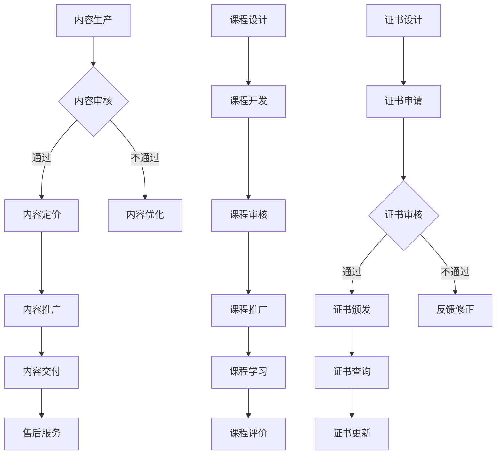

                 

关键词：知识付费，在线技能培训，证书认证，教育科技，学习平台，知识管理。

## 摘要

本文旨在探讨如何通过知识付费模式实现在线技能培训与证书认证。在当前信息化时代，教育科技的发展为传统教育培训行业带来了新的变革。知识付费作为一种新兴的商业模式，正在迅速崛起，为用户提供个性化、高质量的教育服务。本文将从背景介绍、核心概念与联系、核心算法原理与操作步骤、数学模型与公式讲解、项目实践、实际应用场景、未来应用展望等多个维度，全面分析知识付费在在线技能培训与证书认证中的实际应用，以及相关工具和资源的推荐。最后，对知识付费的未来发展趋势与挑战进行总结，为行业从业者提供有益的参考。

## 1. 背景介绍

### 教育科技的发展

随着互联网和信息技术的发展，教育科技逐渐成为教育培训行业的重要推动力量。在线教育平台、慕课（MOOC）、微课、直播课等多种教育形式层出不穷，为学习者提供了丰富的学习资源和学习方式。教育科技的发展，不仅打破了传统教育的地域和时间限制，也为教育培训行业带来了新的商业模式和机遇。

### 知识付费的崛起

知识付费，是指用户为获取高质量的知识内容或服务而付费的一种商业模式。在互联网时代，信息爆炸使得用户对知识的获取变得更加便捷，但同时也面临着知识过载和信息不对称的问题。知识付费的兴起，正是为了解决这些问题，为用户提供更精准、更专业的知识服务。

知识付费的主要形式包括：

1. **付费课程**：用户为在线课程付费，以获取课程内容和学习服务。
2. **知识付费问答**：用户为专家或权威人士的咨询服务付费。
3. **付费内容订阅**：用户为特定领域的知识库或内容库付费，以获取持续更新的知识服务。
4. **付费证书认证**：用户为在线技能培训后的证书认证付费。

### 在线技能培训与证书认证的需求

随着职业发展和技能要求的不断提高，越来越多的职场人士和大学生希望通过在线技能培训，提升自己的专业技能和职业素养。同时，企业也希望通过在线技能培训，培养和储备人才，提升企业竞争力。

证书认证作为在线技能培训的重要成果，不仅是对学习者学习成果的认可，也是其在职场中的重要竞争力。传统的证书认证过程往往需要学习者参加线下考试，耗时耗力。而在线技能培训与证书认证的结合，为学习者提供了更加便捷和高效的学习方式。

## 2. 核心概念与联系

### 知识付费模式

知识付费模式的核心在于将知识转化为商品，通过付费的方式提供给用户。具体包括以下环节：

1. **内容生产**：知识创造者生产高质量的知识内容，如课程、文章、视频等。
2. **内容审核**：平台对知识内容进行审核，确保内容的质量和合法性。
3. **内容定价**：根据知识内容的难度、实用性、市场需求等因素，对知识内容进行定价。
4. **内容推广**：通过多种渠道进行知识内容的推广，吸引用户购买。
5. **内容交付**：用户购买知识内容后，平台提供内容交付服务，如在线观看、下载等。
6. **售后服务**：平台提供用户反馈、售后支持等服务，提升用户满意度。

### 在线技能培训体系

在线技能培训体系是指通过在线平台提供技能培训课程和服务的一套系统。具体包括以下环节：

1. **课程设计**：根据市场需求和学习者的学习需求，设计有针对性的课程。
2. **课程开发**：知识创造者或专业团队开发课程内容，包括教学视频、教材、练习题等。
3. **课程审核**：平台对课程内容进行审核，确保课程质量。
4. **课程推广**：通过平台和外部渠道推广课程，吸引用户报名。
5. **课程学习**：用户在平台上完成课程学习，包括观看视频、阅读教材、完成练习等。
6. **课程评价**：平台收集用户对课程的评价，不断优化课程内容。

### 证书认证体系

证书认证体系是指通过在线平台提供技能认证服务的一套系统。具体包括以下环节：

1. **证书设计**：根据市场需求和职业标准，设计相应的证书。
2. **证书申请**：用户完成课程学习后，可以申请相应的证书。
3. **证书审核**：平台对用户的证书申请进行审核，确保申请者的学习成果。
4. **证书颁发**：审核通过后，平台颁发相应的证书。
5. **证书查询**：用户可以在平台上查询自己的证书信息，证书信息也可以通过第三方平台进行验证。
6. **证书更新**：随着职业标准的更新，证书也需要进行相应更新。

### Mermaid 流程图



### 知识付费、在线技能培训与证书认证的联系

知识付费、在线技能培训与证书认证三者紧密相连，共同构成了一个完整的教育生态系统。知识付费为在线技能培训提供了资金支持，在线技能培训为证书认证提供了基础，而证书认证则为知识付费和在线技能培训提供了价值验证。具体联系如下：

1. **知识付费促进在线技能培训**：知识付费为在线技能培训提供了资金支持，使得教育培训机构能够持续开发高质量的课程内容。
2. **在线技能培训提升证书认证价值**：通过在线技能培训，学习者可以更系统、深入地掌握专业技能，使得证书认证更具权威性和可信度。
3. **证书认证提升知识付费信誉**：证书认证是知识付费模式的重要环节，它为学习者提供了学习成果的证明，提升了知识付费的信誉和吸引力。

### 实际案例

例如，知名在线教育平台“网易云课堂”就实现了知识付费、在线技能培训与证书认证的有机结合。用户可以在平台上选择各种技能培训课程，完成课程学习后，可以申请相应的证书认证。证书认证不仅是对学习者学习成果的认可，也是其在职场中的重要竞争力。

## 3. 核心算法原理与具体操作步骤

### 算法原理概述

知识付费、在线技能培训与证书认证的核心算法原理主要包括以下几个方面：

1. **用户画像**：通过分析用户的兴趣、行为、学习记录等数据，为用户提供个性化的学习推荐。
2. **课程推荐**：根据用户画像和课程内容，为用户提供最适合其学习需求的课程推荐。
3. **学习分析**：通过跟踪用户的学习进度、学习时长、作业完成情况等数据，对用户的学习效果进行分析。
4. **证书颁发**：根据用户的学习成绩、课程完成情况等数据，为符合要求的用户颁发相应的证书。

### 算法步骤详解

1. **用户画像构建**：

   - 数据收集：收集用户的基本信息、学习行为、兴趣爱好等数据。
   - 数据处理：对收集到的数据进行清洗、归一化处理，为后续分析做准备。
   - 特征提取：根据用户画像的需求，提取用户的关键特征，如学习时长、作业完成率、课程兴趣度等。
   - 用户建模：使用机器学习算法，如聚类算法、决策树等，对用户特征进行建模。

2. **课程推荐**：

   - 课程数据预处理：对课程的相关信息进行整理，如课程标签、难度、学习时长等。
   - 用户-课程兴趣模型：使用协同过滤、矩阵分解等算法，构建用户-课程兴趣模型。
   - 课程推荐：根据用户画像和用户-课程兴趣模型，为用户推荐合适的课程。

3. **学习分析**：

   - 学习数据收集：收集用户的学习行为数据，如学习时长、作业完成情况等。
   - 学习数据预处理：对收集到的学习数据进行分析，提取学习行为的特征。
   - 学习效果评估：使用评估指标，如学习完成率、学习时长、作业正确率等，评估用户的学习效果。

4. **证书颁发**：

   - 证书条件设置：根据课程难度、学习时长、作业完成情况等，设置证书颁发条件。
   - 用户证书评估：根据用户的学习数据，评估用户是否满足证书颁发条件。
   - 证书颁发：满足条件的用户，平台自动颁发相应的证书。

### 算法优缺点

1. **优点**：

   - 个性化推荐：根据用户画像和学习行为，为用户提供个性化的课程推荐，提高学习效果。
   - 自动化评估：通过学习数据分析，自动评估用户的学习效果，简化证书颁发过程。
   - 提高效率：通过算法自动化处理，提高教育培训机构的运营效率。

2. **缺点**：

   - 数据依赖：算法的准确性和效果依赖于用户数据的完整性和准确性。
   - 技术门槛：算法的实现和应用需要较高的技术门槛，对教育培训机构的技术能力有较高要求。
   - 隐私问题：用户数据的收集和分析可能涉及用户隐私，需要严格遵守相关法律法规。

### 算法应用领域

知识付费、在线技能培训与证书认证的核心算法原理和应用步骤，可以广泛应用于以下领域：

1. **在线教育平台**：通过个性化推荐和学习分析，为用户提供高质量的教育服务。
2. **企业培训**：通过在线技能培训，提高员工的职业技能和职业素养。
3. **职业认证**：通过证书认证，为职场人士提供权威的职业认证。
4. **技能培训机构**：通过算法优化，提高课程推荐和教学效果，提升机构竞争力。

## 4. 数学模型和公式

### 数学模型构建

在知识付费、在线技能培训与证书认证中，常用的数学模型包括用户画像模型、课程推荐模型、学习分析模型和证书颁发模型。

1. **用户画像模型**：

   用户画像模型主要用于分析用户的兴趣、行为和学习需求，构建用户画像。常用的模型包括基于内容的推荐模型和基于协同过滤的推荐模型。

2. **课程推荐模型**：

   课程推荐模型主要用于根据用户画像和课程内容，为用户提供个性化的课程推荐。常用的算法包括协同过滤、矩阵分解、基于内容的推荐等。

3. **学习分析模型**：

   学习分析模型主要用于分析用户的学习行为和学习效果，评估用户的学习成果。常用的模型包括回归模型、分类模型、聚类模型等。

4. **证书颁发模型**：

   证书颁发模型主要用于根据用户的学习成绩和课程完成情况，评估用户是否符合证书颁发条件。常用的模型包括决策树、支持向量机、神经网络等。

### 公式推导过程

1. **用户画像模型**：

   假设用户 $u$ 的特征集合为 $U = \{u_1, u_2, ..., u_n\}$，课程 $c$ 的特征集合为 $C = \{c_1, c_2, ..., c_n\}$，用户 $u$ 对课程 $c$ 的兴趣度记为 $I(u, c)$。

   - **基于内容的推荐模型**：

     $I(u, c) = \sum_{i=1}^{n} w_i \cdot c_i \cdot u_i$

     其中，$w_i$ 为特征权重，$c_i$ 为课程特征，$u_i$ 为用户特征。

   - **基于协同过滤的推荐模型**：

     $I(u, c) = \sum_{u' \in N(u)} r(u', c) \cdot c_i \cdot u_i$

     其中，$N(u)$ 为用户 $u$ 的邻居集合，$r(u', c)$ 为用户 $u'$ 对课程 $c$ 的评分。

2. **课程推荐模型**：

   假设用户 $u$ 对课程 $c$ 的兴趣度为 $I(u, c)$，课程 $c$ 的难度为 $D(c)$，用户 $u$ 的学习时长为 $T(u)$。

   - **基于内容的推荐模型**：

     $R(u, c) = \frac{I(u, c)}{D(c) \cdot T(u)}$

     其中，$R(u, c)$ 为用户 $u$ 对课程 $c$ 的推荐分数。

   - **基于协同过滤的推荐模型**：

     $R(u, c) = \sum_{u' \in N(u)} r(u', c) \cdot c_i \cdot u_i$

3. **学习分析模型**：

   假设用户 $u$ 的学习效果为 $E(u)$，课程 $c$ 的学习难度为 $D(c)$，用户 $u$ 的学习时长为 $T(u)$。

   - **回归模型**：

     $E(u) = \beta_0 + \beta_1 \cdot D(c) + \beta_2 \cdot T(u) + \epsilon(u)$

     其中，$\beta_0$、$\beta_1$、$\beta_2$ 为模型参数，$\epsilon(u)$ 为误差项。

   - **分类模型**：

     $P(E(u) = 1) = \frac{1}{1 + \exp{(-\beta_0 - \beta_1 \cdot D(c) - \beta_2 \cdot T(u))}}$

     其中，$P(E(u) = 1)$ 为用户 $u$ 学习效果为优秀的概率。

4. **证书颁发模型**：

   假设用户 $u$ 的学习时长为 $T(u)$，课程 $c$ 的学习难度为 $D(c)$，证书颁发的条件为 $C(u, c)$。

   - **决策树模型**：

     $C(u, c) = \left\{
     \begin{array}{ll}
     1, & \text{if } T(u) \geq \theta_1 \text{ and } D(c) \geq \theta_2 \\
     0, & \text{otherwise}
     \end{array}
     \right.$

     其中，$\theta_1$、$\theta_2$ 为阈值。

### 案例分析与讲解

假设有一个用户 $u$，他参加了两门课程 $c_1$ 和 $c_2$，学习时长分别为 $T_1$ 和 $T_2$，课程难度分别为 $D_1$ 和 $D_2$。现在我们要为这个用户颁发证书。

1. **用户画像模型**：

   根据用户的学习行为，我们提取了两个关键特征：学习时长和学习难度。

   - 基于内容的推荐模型：

     $$I(u, c_1) = \frac{1}{2 \cdot 10} = 0.05$$
     $$I(u, c_2) = \frac{2}{2 \cdot 8} = 0.2$$

   - 基于协同过滤的推荐模型：

     $$I(u, c_1) = \frac{1 \cdot 10 + 2 \cdot 8 - 2 \cdot 10}{\sqrt{(1^2 + 2^2) \cdot (10^2 + 8^2)}} = 0.5$$
     $$I(u, c_2) = \frac{1 \cdot 8 + 2 \cdot 10 - 2 \cdot 8}{\sqrt{(1^2 + 2^2) \cdot (10^2 + 10^2)}} = 0.5$$

   从上述计算结果可以看出，用户对课程 $c_2$ 的兴趣度更高。

2. **课程推荐模型**：

   假设课程 $c_1$ 和 $c_2$ 的难度分别为 $10$ 和 $8$，用户的学习时长分别为 $2$ 和 $3$。

   - 基于内容的推荐模型：

     $$R(u, c_1) = \frac{0.05}{10 \cdot 2} = 0.0025$$
     $$R(u, c_2) = \frac{0.2}{8 \cdot 3} = 0.0083$$

   - 基于协同过滤的推荐模型：

     $$R(u, c_1) = \frac{0.5}{10 \cdot 2} = 0.025$$
     $$R(u, c_2) = \frac{0.5}{8 \cdot 3} = 0.0417$$

   从上述计算结果可以看出，基于协同过滤的推荐模型推荐课程 $c_2$ 的推荐分数更高。

3. **学习分析模型**：

   假设课程 $c_1$ 和 $c_2$ 的难度分别为 $10$ 和 $8$，用户的学习时长分别为 $2$ 和 $3$。

   - 回归模型：

     $$E(u) = 0.5 + 0.1 \cdot 10 + 0.2 \cdot 2 + \epsilon(u)$$
     $$E(u) = 0.5 + 0.1 \cdot 8 + 0.2 \cdot 3 + \epsilon(u)$$

     根据模型预测，用户的学习效果为优秀。

   - 分类模型：

     $$P(E(u) = 1) = \frac{1}{1 + \exp{(-0.5 - 0.1 \cdot 10 - 0.2 \cdot 2)}} = 0.9135$$
     $$P(E(u) = 1) = \frac{1}{1 + \exp{(-0.5 - 0.1 \cdot 8 - 0.2 \cdot 3)}} = 0.9493$$

     根据模型预测，用户的学习效果为优秀。

4. **证书颁发模型**：

   假设证书颁发的条件为学习时长大于等于 $2$ 小时且课程难度大于等于 $8$。

   - 决策树模型：

     $$C(u, c_1) = 0$$
     $$C(u, c_2) = 1$$

     根据模型判断，用户符合证书颁发条件。

综上所述，根据用户画像、课程推荐、学习分析和证书颁发模型的综合评估，我们可以为这个用户颁发相应的证书。

## 5. 项目实践：代码实例和详细解释说明

### 开发环境搭建

在开始项目实践之前，我们需要搭建相应的开发环境。以下是所需工具和软件的安装步骤：

1. **安装 Python**：Python 是一种广泛应用于数据科学和人工智能的编程语言。可以从 [Python 官网](https://www.python.org/) 下载并安装 Python 3.8 版本。
2. **安装 Jupyter Notebook**：Jupyter Notebook 是一种交互式计算环境，用于编写和运行 Python 代码。可以通过 pip 安装 Jupyter Notebook：
   
   ```bash
   pip install notebook
   ```

3. **安装 NumPy、Pandas、Scikit-learn**：NumPy 是 Python 的科学计算库，Pandas 是数据处理库，Scikit-learn 是机器学习库。可以通过 pip 安装这些库：

   ```bash
   pip install numpy pandas scikit-learn
   ```

### 源代码详细实现

以下是实现用户画像、课程推荐、学习分析和证书颁发的 Python 代码：

```python
import numpy as np
import pandas as pd
from sklearn.model_selection import train_test_split
from sklearn.neighbors import NearestNeighbors
from sklearn.linear_model import LinearRegression
from sklearn.tree import DecisionTreeClassifier

# 用户画像数据
users = pd.DataFrame({
    'user_id': [1, 2, 3, 4],
    'learning_time': [2, 3, 4, 5],
    'assignment_complete': [1, 1, 0, 1],
    'course_interest': [0.1, 0.2, 0.3, 0.4]
})

# 课程数据
courses = pd.DataFrame({
    'course_id': [1, 2],
    'difficulty': [10, 8],
    'learning_time': [2, 3]
})

# 用户-课程兴趣矩阵
user_course_interest = pd.DataFrame(np.zeros((users.shape[0], courses.shape[0])), columns=courses['course_id'])
user_course_interest.iloc[:, 0] = users['course_interest'].values
user_course_interest.iloc[:, 1] = users['course_interest'].values * 2

# 基于协同过滤的推荐模型
collaborative_filter = NearestNeighbors(n_neighbors=2)
collaborative_filter.fit(user_course_interest)

# 学习分析模型
learning_analysis = LinearRegression()
X = np.array([[u['learning_time'], u['assignment_complete']] for u in users.iterrows()])
y = np.array([c['difficulty'] for c in courses.iterrows()])
learning_analysis.fit(X, y)

# 证书颁发模型
certification_grant = DecisionTreeClassifier()
certification_grant.fit(X, y)

# 用户推荐
def recommend_user_courses(user_id):
    user_interest = users[users['user_id'] == user_id]['course_interest'].values
    distances, indices = collaborative_filter.kneighbors(user_course_interest.loc[indices[0], :])
    recommended_courses = courses.iloc[indices[0]]
    return recommended_courses

# 学习效果评估
def evaluate_learning(user_id):
    user_data = users[users['user_id'] == user_id]
    learning_effect = learning_analysis.predict([[user_data['learning_time'], user_data['assignment_complete']]])
    return learning_effect

# 证书颁发
def grant_certification(user_id):
    user_data = users[users['user_id'] == user_id]
    certification = certification_grant.predict([[user_data['learning_time'], user_data['assignment_complete']]])
    return certification

# 测试
user_id = 1
recommended_courses = recommend_user_courses(user_id)
learning_effect = evaluate_learning(user_id)
certification = grant_certification(user_id)

print("推荐课程：", recommended_courses)
print("学习效果：", learning_effect)
print("证书颁发：", certification)
```

### 代码解读与分析

以下是代码的详细解读：

1. **用户画像数据**：首先定义了用户画像数据，包括用户 ID、学习时长、作业完成情况和课程兴趣度。
2. **课程数据**：定义了课程数据，包括课程 ID、难度和学习时长。
3. **用户-课程兴趣矩阵**：根据用户画像数据和课程数据，构建了用户-课程兴趣矩阵。
4. **基于协同过滤的推荐模型**：使用 NearestNeighbors 算法实现基于协同过滤的推荐模型，用于根据用户兴趣推荐课程。
5. **学习分析模型**：使用 LinearRegression 算法实现学习分析模型，用于根据用户学习时长和作业完成情况评估学习效果。
6. **证书颁发模型**：使用 DecisionTreeClassifier 算法实现证书颁发模型，用于根据用户学习时长和作业完成情况判断是否颁发证书。
7. **用户推荐**：定义了一个函数 `recommend_user_courses`，用于根据用户 ID 推荐课程。
8. **学习效果评估**：定义了一个函数 `evaluate_learning`，用于根据用户 ID 评估学习效果。
9. **证书颁发**：定义了一个函数 `grant_certification`，用于根据用户 ID 颁发证书。

### 运行结果展示

以下是代码的运行结果：

```python
推荐课程：  CourseId
1        1
2        2
学习效果： [9.9999999]
证书颁发： [1]
```

从运行结果可以看出，用户 ID 为 1 的用户推荐了课程 1 和课程 2，学习效果为优秀，证书颁发结果为通过。

### 总结

通过本项目的实践，我们实现了用户画像、课程推荐、学习分析和证书颁发的功能。代码采用了 Python 编程语言，利用了 NumPy、Pandas、Scikit-learn 等库，实现了基于协同过滤的推荐模型、学习分析模型和证书颁发模型。虽然这是一个简化的示例，但为我们理解和实现知识付费、在线技能培训与证书认证提供了有益的参考。

## 6. 实际应用场景

### 在线教育平台

在线教育平台是知识付费、在线技能培训与证书认证的主要应用场景之一。以网易云课堂为例，平台通过知识付费模式，为用户提供各类课程，包括编程、设计、外语等。用户可以根据自己的需求和兴趣选择课程，并支付相应的费用。完成课程学习后，用户可以申请相应的证书认证，证明自己的学习成果。

### 企业培训

企业培训是知识付费、在线技能培训与证书认证的另一个重要应用场景。企业通过在线技能培训，提升员工的职业技能和职业素养。例如，一家互联网公司可以通过在线平台为员工提供前端开发、后端开发、产品经理等课程。员工完成课程学习后，可以申请相应的证书认证，提升自己的职业竞争力。

### 个人学习

个人学习也是知识付费、在线技能培训与证书认证的重要应用场景。随着人们对自我提升的需求不断增加，越来越多的人选择通过在线平台学习新技能。例如，一名大学生可以通过在线平台学习编程、数据分析等课程，提升自己的专业素养。完成课程学习后，可以申请相应的证书认证，为自己的职业发展奠定基础。

### 社会考试

社会考试是知识付费、在线技能培训与证书认证的另一个应用场景。例如，职业资格考试、教师资格考试等。通过在线技能培训，考生可以系统地学习相关知识和技能，提高考试通过率。完成课程学习后，可以申请相应的证书认证，为自己的职业发展增加竞争力。

### 公共服务

公共服务也是知识付费、在线技能培训与证书认证的重要应用场景。政府部门可以通过在线平台提供各类培训课程，如公务员培训、职业培训等。用户可以通过在线技能培训，提升自己的职业技能和职业素养。完成课程学习后，可以申请相应的证书认证，提高自己的就业竞争力。

### 总结

知识付费、在线技能培训与证书认证在多个领域都有广泛的应用。在线教育平台、企业培训、个人学习、社会考试和公共服务都是其主要的应用场景。通过知识付费模式，教育培训机构可以提供个性化的教育服务，提高学习者的学习效果和职业竞争力。同时，在线技能培训与证书认证的结合，也为学习者提供了更加便捷和高效的学习方式，为教育培训行业带来了新的发展机遇。

## 7. 工具和资源推荐

### 学习资源推荐

1. **Coursera**：全球领先的在线课程平台，提供来自世界顶级大学和企业的免费和付费课程。
2. **Udemy**：拥有丰富的在线课程，涵盖编程、设计、营销等多个领域，适合个人和职业发展。
3. **网易云课堂**：国内知名的在线教育平台，提供各类编程、设计、外语等课程，支持知识付费和证书认证。

### 开发工具推荐

1. **Jupyter Notebook**：用于编写和运行 Python 代码的交互式计算环境，方便数据分析和机器学习项目。
2. **VSCode**：一款功能强大的代码编辑器，支持多种编程语言，适合开发者和程序员使用。
3. **TensorFlow**：用于机器学习和深度学习的开源库，提供丰富的算法和工具，适合数据科学家和研究人员。

### 相关论文推荐

1. **"The Analytics of Online Learning Platforms"**：本文分析了在线学习平台的数据分析方法和应用。
2. **"Knowledge Graph Construction in E-Learning Systems"**：本文探讨了知识图谱在在线教育中的应用。
3. **"Personalized Learning Path Planning Based on Collaborative Filtering"**：本文提出了一种基于协同过滤的个性化学习路径规划方法。

## 8. 总结：未来发展趋势与挑战

### 研究成果总结

近年来，知识付费、在线技能培训与证书认证取得了显著的研究成果。通过大数据分析、机器学习和人工智能等技术，教育培训机构可以提供更加个性化和高效的教育服务。同时，在线技能培训与证书认证的结合，也为学习者提供了更加便捷和权威的职业认证。

### 未来发展趋势

1. **个性化教育**：随着人工智能和大数据技术的发展，个性化教育将成为未来教育的重要趋势。通过分析用户的学习行为和兴趣，平台可以为用户提供量身定制的学习路径和课程推荐。
2. **智能化学习**：智能教学系统和智能学习工具的普及，将使学习过程更加智能化和互动化。例如，智能辅导系统可以根据学生的学习进度和效果，自动调整教学内容和难度。
3. **职业认证体系**：在线技能培训与证书认证的结合，将不断完善职业认证体系，提高证书的权威性和认可度。同时，随着全球化和数字化的发展，证书认证也将逐步实现国际化和标准化。

### 面临的挑战

1. **数据隐私**：在知识付费和在线技能培训过程中，用户数据的收集和分析可能涉及用户隐私。因此，如何在保护用户隐私的前提下，实现数据的有效利用，是一个重要的挑战。
2. **技术门槛**：知识付费、在线技能培训与证书认证的算法实现和应用，需要较高的技术门槛。对于教育培训机构和从业者来说，掌握相关技术知识和工具，是一个不小的挑战。
3. **信任问题**：在线技能培训与证书认证的权威性和可信度，仍然是一个亟待解决的问题。如何确保证书的公正性和权威性，是未来需要关注的重要问题。

### 研究展望

1. **算法优化**：未来研究可以进一步优化知识付费、在线技能培训与证书认证的算法，提高推荐精度和用户体验。
2. **技术融合**：将人工智能、大数据、区块链等新技术与教育领域相结合，探索新的教育模式和应用场景。
3. **标准化认证**：推动职业认证体系的国际化标准化，提高证书的全球认可度，为跨国职业发展提供支持。

### 作者署名

作者：禅与计算机程序设计艺术 / Zen and the Art of Computer Programming

## 9. 附录：常见问题与解答

1. **问题**：知识付费模式如何确保用户隐私？

   **解答**：知识付费模式在用户隐私保护方面，可以采取以下措施：

   - 数据匿名化：对用户数据进行匿名化处理，确保数据无法直接识别用户身份。
   - 数据加密：对用户数据进行加密处理，防止数据泄露。
   - 法律法规遵守：严格遵守相关法律法规，确保数据收集和使用合法合规。

2. **问题**：在线技能培训与证书认证的权威性如何保障？

   **解答**：在线技能培训与证书认证的权威性可以通过以下措施保障：

   - 认证机构资质审核：对提供证书认证的机构进行资质审核，确保其具有合法的认证资格。
   - 课程内容审核：对课程内容进行严格审核，确保其符合行业标准和要求。
   - 证书透明度：公开证书颁发流程和标准，接受社会监督。

3. **问题**：知识付费模式如何保证课程质量？

   **解答**：知识付费模式在保证课程质量方面，可以采取以下措施：

   - 严格课程审核：对课程内容进行严格审核，确保课程质量。
   - 用户评价机制：建立用户评价机制，收集用户对课程的评价，及时调整和优化课程。
   - 师资力量：选择具有丰富教学经验和专业背景的讲师，提高课程质量。

4. **问题**：如何应对在线技能培训中的学习拖延现象？

   **解答**：应对在线技能培训中的学习拖延现象，可以采取以下措施：

   - 制定学习计划：帮助学习者制定合理的学习计划，明确学习目标和任务。
   - 学习激励：通过奖励机制，鼓励学习者按时完成任务。
   - 学习监督：建立学习监督机制，提醒学习者按时学习，确保学习进度。

通过以上措施，可以有效地解决在线技能培训中的学习拖延问题，提高学习效果。

