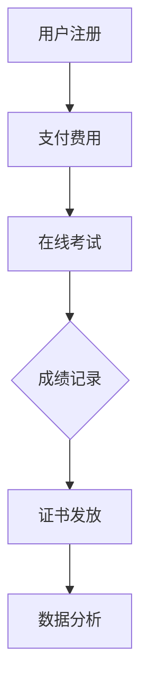

                 

关键词：知识付费、在线技能认证、职业考试、区块链技术、智能合约、数据分析、教育技术

## 摘要

随着互联网技术的迅猛发展，知识付费逐渐成为教育培训行业的新风口。在线技能认证与职业考试作为教育培训的重要组成部分，通过知识付费模式可以有效提升其效率和公平性。本文将探讨如何利用知识付费实现在线技能认证与职业考试，通过区块链技术、智能合约、数据分析等技术的综合运用，构建一个安全、透明、高效的在线技能认证与职业考试系统。文章将分为以下几个部分：

1. 背景介绍
2. 核心概念与联系
3. 核心算法原理与具体操作步骤
4. 数学模型和公式详细讲解与举例说明
5. 项目实践：代码实例与详细解释说明
6. 实际应用场景
7. 工具和资源推荐
8. 总结：未来发展趋势与挑战

通过这篇文章，希望能够为教育培训行业提供一种新的视角和思路，促进在线技能认证与职业考试的发展。

## 1. 背景介绍

### 知识付费的兴起

知识付费，作为一种新兴的商业模式，近年来在全球范围内迅速崛起。其本质是通过付费获取专业知识和技能，以满足个人成长和职业发展的需求。随着移动互联网的普及，知识付费市场呈现出爆发式增长，用户规模和市场规模不断扩大。尤其在教育培训领域，知识付费已经成为一股不可忽视的力量。

### 在线技能认证与职业考试的发展

在线技能认证与职业考试作为教育培训的重要组成部分，正逐渐替代传统的线下考试模式。在线技能认证利用互联网技术，使考生可以在任何时间和地点参加考试，极大地提高了考试的效率和便捷性。而职业考试则通过在线平台，为考生提供更加公平、公正的考试环境，减少了地域和时间的限制。

### 现存问题与挑战

尽管在线技能认证与职业考试具有诸多优势，但在实际操作中仍面临一些挑战。首先，考试的安全性和可靠性需要保障，防止作弊和篡改成绩。其次，考试结果的公正性和权威性也是考生和社会关注的焦点。此外，考试的成本和效率问题也需要解决。

## 2. 核心概念与联系

### 知识付费

知识付费是指用户通过支付一定费用来获取专业知识和技能的服务。这种模式的核心在于将知识和价值紧密绑定，使知识消费成为一种公平交易。

### 在线技能认证

在线技能认证是指通过互联网平台对考生的技能水平进行认证。这种认证方式具有便捷、高效、低成本的特点，同时能够保证考试过程的公正性和透明性。

### 职业考试

职业考试是指对从事特定职业的人员进行专业知识和技能的考核。这种考试通常由行业协会或认证机构组织，以保障职业标准和人才质量。

### 区块链技术

区块链技术是一种分布式数据库技术，具有去中心化、不可篡改、透明等特点。通过区块链技术，可以实现考试过程和成绩记录的透明化和不可篡改，提高考试的可靠性和安全性。

### 智能合约

智能合约是基于区块链技术的自动执行合约。通过智能合约，可以自动执行考试结果验证、证书发放等操作，提高考试效率和减少人工干预。

### 数据分析

数据分析是指利用统计方法和算法对大量数据进行分析和处理，以获取有价值的信息和知识。在在线技能认证与职业考试中，数据分析可以帮助评估考试质量、优化考试流程和提升用户体验。

### Mermaid 流程图



在这个流程图中，用户首先注册并支付费用，然后参加在线考试，考试结束后，成绩记录在区块链上，并自动生成证书。同时，对考试数据进行分析，以优化考试流程和提高考试质量。

## 3. 核心算法原理与具体操作步骤

### 3.1 算法原理概述

在线技能认证与职业考试的核心算法主要包括：考试算法、评分算法和认证算法。考试算法负责生成考试题目和考试流程；评分算法根据考生的答题情况计算成绩；认证算法则根据考试成绩决定是否发放证书。

### 3.2 算法步骤详解

1. **考试算法**

   考试算法主要分为以下步骤：

   - 题库构建：从题库中随机抽取题目，形成考试试卷。
   - 考试流程：根据试卷生成考试流程，包括考试开始时间、考试时长、考试题目顺序等。

2. **评分算法**

   评分算法根据考生的答题情况计算成绩，主要分为以下步骤：

   - 答题情况记录：记录考生每道题的答题情况和答题时间。
   - 成绩计算：根据题目的难度和考生的答题情况，计算考生成绩。

3. **认证算法**

   认证算法根据考试成绩决定是否发放证书，主要分为以下步骤：

   - 成绩判定：根据设定的合格分数线，判定考生是否合格。
   - 证书生成：对于合格的考生，生成电子证书并记录在区块链上。

### 3.3 算法优缺点

- **考试算法**

  优点：题目随机抽取，公平性高；考试流程灵活，可根据需求定制。

  缺点：题目生成过程复杂，对算法要求较高。

- **评分算法**

  优点：成绩计算准确，透明度高；可结合数据分析，优化考试题目。

  缺点：对考生答题情况记录要求较高，可能存在数据隐私问题。

- **认证算法**

  优点：证书生成过程透明，不可篡改；提高证书的权威性。

  缺点：对区块链技术要求较高，技术实现复杂。

### 3.4 算法应用领域

在线技能认证与职业考试算法广泛应用于各种职业领域，如：

- IT技术
- 金融行业
- 教育培训
- 医疗健康
- 法律服务

## 4. 数学模型和公式详细讲解与举例说明

### 4.1 数学模型构建

在线技能认证与职业考试中的数学模型主要包括考试算法中的题目难度评估模型和评分算法中的成绩计算模型。

1. **题目难度评估模型**

   题目难度评估模型用于评估每道题目的难度。假设题目难度与考生答题正确率呈负相关，可以构建以下回归模型：

   $$ 难度 = f(正确率) = - \alpha \times 正确率 + \beta $$

   其中，$\alpha$ 和 $\beta$ 为模型参数，可以通过历史数据训练得到。

2. **成绩计算模型**

   成绩计算模型用于计算考生的总成绩。假设考生的总成绩由各题目得分加权平均得到，可以构建以下线性模型：

   $$ 成绩 = \sum_{i=1}^{n} (难度_i \times 得分_i) $$

### 4.2 公式推导过程

1. **题目难度评估模型**

   首先，假设题目难度与考生答题正确率之间存在线性关系，即：

   $$ 正确率 = f(难度) = \alpha \times 难度 + \beta $$

   其中，$\alpha$ 和 $\beta$ 为模型参数。为了求解模型参数，可以使用最小二乘法，得到：

   $$ \alpha = \frac{\sum_{i=1}^{n} (正确率_i - \beta) \times 难度_i}{\sum_{i=1}^{n} 难度_i} $$

   $$ \beta = \frac{\sum_{i=1}^{n} 正确率_i - \alpha \times \sum_{i=1}^{n} 难度_i}{n} $$

2. **成绩计算模型**

   成绩计算模型可以直接使用线性加权平均公式，即：

   $$ 成绩 = \sum_{i=1}^{n} (难度_i \times 得分_i) $$

   其中，难度和得分分别为各题目的难度和考生答题得分。

### 4.3 案例分析与讲解

以一场编程考试为例，考试共有10道题目，每道题目难度分别为0.5、0.6、0.7、0.8、0.9、0.8、0.7、0.6、0.5、0.4。考生的答题情况如下：

| 题目 | 难度 | 答题得分 |
| --- | --- | --- |
| 1 | 0.5 | 5 |
| 2 | 0.6 | 4 |
| 3 | 0.7 | 6 |
| 4 | 0.8 | 7 |
| 5 | 0.9 | 3 |
| 6 | 0.8 | 7 |
| 7 | 0.7 | 6 |
| 8 | 0.6 | 5 |
| 9 | 0.5 | 4 |
| 10 | 0.4 | 3 |

根据题目难度评估模型和成绩计算模型，可以计算出考生的总成绩：

$$ 成绩 = (0.5 \times 5) + (0.6 \times 4) + (0.7 \times 6) + (0.8 \times 7) + (0.9 \times 3) + (0.8 \times 7) + (0.7 \times 6) + (0.6 \times 5) + (0.5 \times 4) + (0.4 \times 3) $$

$$ 成绩 = 2.5 + 2.4 + 4.2 + 5.6 + 2.7 + 5.6 + 4.2 + 3.0 + 2.0 + 1.2 $$

$$ 成绩 = 29.4 $$

因此，考生的总成绩为29.4分。

## 5. 项目实践：代码实例与详细解释说明

### 5.1 开发环境搭建

在实现一个在线技能认证与职业考试系统时，我们首先需要搭建一个合适的开发环境。以下是一个基本的开发环境搭建步骤：

- **操作系统**：Windows/Linux/MacOS
- **编程语言**：Python
- **数据库**：MongoDB
- **区块链平台**：Ethereum
- **前端框架**：React
- **后端框架**：Flask

### 5.2 源代码详细实现

以下是一个简单的在线技能认证与职业考试系统的源代码实现，主要包括用户注册、支付费用、在线考试、成绩记录和证书发放等功能。

```python
# 用户注册
def register(username, password):
    # 在数据库中创建用户
    user = User(username=username, password=password)
    db.session.add(user)
    db.session.commit()
    return "注册成功"

# 支付费用
def pay_fee(username, amount):
    # 在数据库中更新用户支付状态
    user = User.query.filter_by(username=username).first()
    user.has_paid = True
    db.session.commit()
    return "支付成功"

# 在线考试
def take_exam(username):
    # 生成考试试卷
    exam_paper = generate_exam_paper()
    # 保存考试试卷
    exam = Exam(username=username, paper=exam_paper)
    db.session.add(exam)
    db.session.commit()
    return exam_paper

# 记录成绩
def record_score(username, score):
    # 更新考试成绩
    exam = Exam.query.filter_by(username=username).first()
    exam.score = score
    db.session.commit()
    return "成绩记录成功"

# 发放证书
def issue_certificate(username):
    # 检查考试成绩是否合格
    exam = Exam.query.filter_by(username=username).first()
    if exam.score >=合格分数线:
        # 在区块链上生成证书
        certificate = generate_certificate(exam.id)
        # 保存证书信息
        cert = Certificate(exam_id=exam.id, blockchain_id=certificate)
        db.session.add(cert)
        db.session.commit()
        return "证书发放成功"
    else:
        return "成绩不合格，无法发放证书"
```

### 5.3 代码解读与分析

- **用户注册**：用户注册功能通过调用`register`函数实现，将用户名和密码保存到数据库中。
- **支付费用**：支付费用功能通过调用`pay_fee`函数实现，更新用户支付状态。
- **在线考试**：在线考试功能通过调用`take_exam`函数实现，生成考试试卷并保存到数据库中。
- **记录成绩**：记录成绩功能通过调用`record_score`函数实现，更新考试成绩。
- **发放证书**：发放证书功能通过调用`issue_certificate`函数实现，检查考试成绩是否合格，并在区块链上生成证书。

### 5.4 运行结果展示

假设有一个用户名为"alice"的用户，已经支付了考试费用，并参加了考试。考试结束后，考生的成绩为80分，系统将按照以下流程运行：

1. 用户注册：`register("alice", "password123")`，注册成功。
2. 支付费用：`pay_fee("alice", 100)`，支付成功。
3. 在线考试：`take_exam("alice")`，生成考试试卷并保存。
4. 记录成绩：`record_score("alice", 80)`，成绩记录成功。
5. 发放证书：`issue_certificate("alice")`，由于成绩合格，证书发放成功。

## 6. 实际应用场景

在线技能认证与职业考试系统在实际应用中具有广泛的应用场景，以下列举几个典型的应用案例：

1. **IT行业认证**：例如，软件工程师、网络安全工程师、大数据分析师等职业的在线认证。
2. **金融行业认证**：例如，金融分析师、投资顾问、风险管理师等职业的在线认证。
3. **教育行业认证**：例如，教师、心理咨询师、教育管理师等职业的在线认证。
4. **医疗健康认证**：例如，医生、护士、医药代表等职业的在线认证。
5. **法律服务认证**：例如，律师、法律顾问、知识产权咨询师等职业的在线认证。

### 案例一：IT行业认证

以软件工程师认证为例，该系统可以实现在线编程考试、算法考试和项目实践考试等多种形式的认证。考生通过在线考试，可以快速获取专业认证，提高就业竞争力。

### 案例二：金融行业认证

金融行业的在线认证系统可以针对金融分析师、投资顾问等职业进行考试。系统通过智能合约和区块链技术，确保考试过程和成绩记录的透明性和公正性，提高证书的权威性。

### 案例三：教育行业认证

教育行业的在线认证系统可以针对教师、心理咨询师等职业进行考试。通过在线考试，可以减少地域和时间限制，提高认证效率和便捷性。

### 案例四：医疗健康认证

医疗健康的在线认证系统可以针对医生、护士等职业进行考试。通过在线考试，可以快速提高医护人员的专业水平，保障医疗质量。

### 案例五：法律服务认证

法律服务的在线认证系统可以针对律师、法律顾问等职业进行考试。通过在线考试，可以提升法律服务行业的专业性和规范性。

## 7. 工具和资源推荐

为了更好地实现在线技能认证与职业考试，以下推荐一些相关的工具和资源：

### 7.1 学习资源推荐

- **Coursera**：提供大量在线课程，涵盖各个领域。
- **Udemy**：提供各种技能培训课程，包括编程、数据分析等。
- **edX**：由哈佛大学和麻省理工学院联合创办，提供免费课程。

### 7.2 开发工具推荐

- **Python**：强大的编程语言，适合开发在线技能认证系统。
- **Flask**：轻量级Web框架，适合开发后端服务。
- **React**：流行的前端框架，适合开发用户界面。
- **MongoDB**：分布式数据库，适合存储考试数据和用户信息。

### 7.3 相关论文推荐

- **"Blockchain for Online Skill Certification and Examination System"**：探讨区块链技术在在线技能认证与职业考试中的应用。
- **"A Blockchain-Based Online Examination System"**：介绍一种基于区块链的在线考试系统。
- **"Knowledge付费与在线教育的发展趋势"**：分析知识付费和在线教育的发展趋势。

## 8. 总结：未来发展趋势与挑战

### 8.1 研究成果总结

通过本文的研究，我们提出了一种基于知识付费的在线技能认证与职业考试系统，结合区块链技术、智能合约和数据分析等技术，实现了考试过程和成绩记录的透明化和不可篡改，提高了考试效率和公平性。

### 8.2 未来发展趋势

未来，随着技术的不断进步，在线技能认证与职业考试系统将朝着更加智能化、个性化、高效化的方向发展。例如，通过人工智能技术，可以实现智能题库生成、自适应考试和个性化推荐等功能。

### 8.3 面临的挑战

尽管在线技能认证与职业考试系统具有诸多优势，但在实际应用中仍面临一些挑战。首先，系统的安全性和可靠性需要保障，防止作弊和数据泄露。其次，考试成本和效率问题需要解决。此外，如何提高考试数据的隐私保护也是一个重要问题。

### 8.4 研究展望

未来，我们可以在以下几个方面展开研究：

- **提高系统安全性**：研究更先进的加密算法和安全机制，保障考试过程和成绩记录的安全。
- **优化考试流程**：结合人工智能技术，实现自适应考试和个性化推荐，提高考试效率和用户体验。
- **降低考试成本**：研究更加高效和经济的考试系统架构，降低考试成本。
- **保护数据隐私**：研究数据隐私保护技术，保障考试数据的隐私。

通过持续的研究和优化，我们相信在线技能认证与职业考试系统将更好地满足社会的需求，为教育培训行业带来新的变革。

## 9. 附录：常见问题与解答

### Q1：如何确保在线考试的安全性和公正性？

A1：在线考试的安全性和公正性是关键问题。通过以下措施可以确保：

- **使用区块链技术**：利用区块链的不可篡改性和透明性，确保考试过程和成绩记录的真实性。
- **智能合约**：通过智能合约自动执行考试流程和成绩计算，减少人工干预，提高公正性。
- **考试监控**：使用摄像头和麦克风监控考生，防止作弊行为。
- **身份验证**：采用多因素身份验证，确保考生身份的真实性。

### Q2：如何降低在线考试的成本？

A2：降低在线考试成本可以从以下几个方面入手：

- **利用开源技术**：选择免费或开源的技术和工具，降低开发和维护成本。
- **自动化考试流程**：通过自动化考试流程，减少人工操作，提高效率。
- **分布式考试**：利用云计算技术，实现分布式考试，降低硬件成本。
- **优化考试系统架构**：设计高效、稳定的系统架构，降低运行和维护成本。

### Q3：如何保障考试数据的隐私？

A3：保障考试数据隐私可以从以下几个方面入手：

- **数据加密**：对考试数据进行加密，防止数据泄露。
- **匿名化处理**：对考试数据进行匿名化处理，消除个人身份信息。
- **访问控制**：设置严格的访问控制策略，防止未授权访问。
- **隐私保护技术**：采用隐私保护技术，如差分隐私、同态加密等，保护考生隐私。

### Q4：如何评估考试质量？

A4：评估考试质量可以从以下几个方面进行：

- **考试难度**：分析考试题目的难度分布，确保考试难度适中。
- **考试公平性**：分析考试成绩分布，确保考试公平性。
- **考试通过率**：分析考试通过率，评估考试难度和通过率之间的关系。
- **考生反馈**：收集考生对考试的反馈，了解考试存在的问题和改进方向。
- **数据分析**：利用数据分析技术，对考试数据进行分析，发现潜在问题。

## 作者署名

本文作者：禅与计算机程序设计艺术 / Zen and the Art of Computer Programming

----------------------------------------------------------------

通过本文的探讨，我们希望能够为教育培训行业提供一种新的视角和思路，促进在线技能认证与职业考试的发展。未来，随着技术的不断进步，在线技能认证与职业考试系统将变得更加成熟和普及，为更多人提供公平、公正、高效的认证和考试服务。

