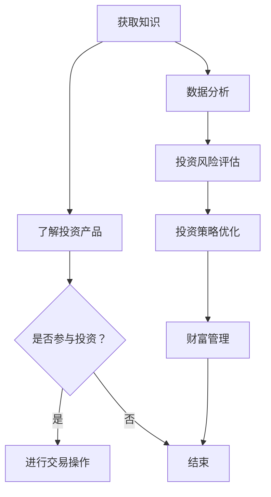

                 

关键词：知识付费，在线投资，理财，财富管理，人工智能，区块链，数据分析

摘要：本文将探讨如何通过知识付费的方式，实现在线投资理财与财富管理。我们将从背景介绍、核心概念、算法原理、数学模型、项目实践、应用场景、工具资源推荐以及未来发展趋势等方面展开讨论。

## 1. 背景介绍

在当前信息爆炸的时代，知识付费已经成为一种重要的商业模式。人们愿意为高质量的知识内容付费，以获取对自己有用的信息。与此同时，在线投资理财与财富管理也逐渐成为人们关注的焦点。随着人工智能、区块链、大数据等技术的发展，如何利用这些技术来实现在线投资理财与财富管理，成为了一个重要课题。

## 2. 核心概念与联系

### 2.1 知识付费

知识付费是指用户为获取高质量的知识内容而支付费用的一种商业模式。常见的知识付费平台有知乎、得到、喜马拉雅等。用户可以通过付费购买课程、电子书、在线讲座等形式获取知识。

### 2.2 在线投资理财

在线投资理财是指通过互联网平台进行投资理财活动，包括股票、基金、债券、P2P借贷等多种投资方式。用户可以通过在线平台了解投资产品、进行交易操作。

### 2.3 财富管理

财富管理是指对个人或企业的资产进行规划、投资、管理，以实现资产的保值增值。财富管理包括资产配置、投资组合优化、风险控制等环节。

### 2.4 人工智能

人工智能（AI）是一种模拟人类智能的技术，通过机器学习、深度学习等方法实现。人工智能在在线投资理财与财富管理中可以用于数据挖掘、风险控制、投资策略优化等。

### 2.5 区块链

区块链是一种去中心化的分布式数据库技术，具有安全性、透明性、不可篡改等特点。区块链在财富管理中可以用于资产登记、交易记录、智能合约等。

### 2.6 数据分析

数据分析是指通过对大量数据进行分析，提取有用信息、发现规律、预测趋势的一种方法。数据分析在在线投资理财与财富管理中可以用于投资风险评估、市场预测、投资组合优化等。

### 2.7 Mermaid 流程图

以下是利用知识付费实现在在线投资理财与财富管理的 Mermaid 流程图：



## 3. 核心算法原理 & 具体操作步骤

### 3.1 算法原理概述

在在线投资理财与财富管理中，核心算法主要包括数据挖掘、机器学习、深度学习等方法。这些算法可以用于投资风险评估、市场预测、投资组合优化等。

### 3.2 算法步骤详解

1. 数据挖掘：从海量数据中提取有用信息，例如历史交易数据、财务报表等。

2. 机器学习：利用历史数据训练模型，预测未来投资风险和市场趋势。

3. 深度学习：通过多层神经网络对数据进行建模，提高预测准确性。

4. 投资策略优化：根据预测结果调整投资组合，实现财富管理。

### 3.3 算法优缺点

优点：算法可以根据海量数据进行分析，提高投资决策的准确性。

缺点：算法模型需要大量数据训练，对数据质量有较高要求；算法模型可能存在过拟合现象。

### 3.4 算法应用领域

在线投资理财、财富管理、金融风险评估等。

## 4. 数学模型和公式 & 详细讲解 & 举例说明

### 4.1 数学模型构建

假设某投资者有初始资金 $W$，在 $T$ 时间内，按照某种投资策略进行投资。投资策略可以用数学模型表示为：

$$
r_t = f(W_t, x_t, \theta)
$$

其中，$r_t$ 表示第 $t$ 时刻的投资收益率，$W_t$ 表示第 $t$ 时刻的资产价值，$x_t$ 表示第 $t$ 时刻的市场环境变量，$\theta$ 表示投资策略参数。

### 4.2 公式推导过程

假设投资者采用线性投资策略，即：

$$
r_t = \theta_0 + \theta_1 W_t + \theta_2 x_t
$$

其中，$\theta_0, \theta_1, \theta_2$ 为策略参数。

根据马尔可夫性质，资产价值 $W_t$ 满足：

$$
W_t = W_{t-1} (1 + r_t)
$$

代入投资策略公式，得到：

$$
W_t = W_{t-1} (1 + \theta_0 + \theta_1 W_t + \theta_2 x_t)
$$

整理得到：

$$
W_t = \frac{W_{t-1} + \theta_0 W_{t-1} + \theta_1 W_t^2 + \theta_2 W_t x_t}{1 - \theta_1 W_t - \theta_2 x_t}
$$

### 4.3 案例分析与讲解

假设投资者初始资金 $W_0 = 10000$ 元，市场环境变量 $x_t$ 为股票指数，投资策略参数为 $\theta_0 = 0.05, \theta_1 = 0.1, \theta_2 = 0.05$。

在第 $t$ 时刻，股票指数 $x_t = 3000$，代入公式计算资产价值 $W_t$：

$$
W_t = \frac{10000 + 0.05 \times 10000 + 0.1 \times 10000^2 + 0.05 \times 10000 \times 3000}{1 - 0.1 \times 10000 - 0.05 \times 3000}
$$

$$
W_t \approx 11111.11
$$

因此，在第 $t$ 时刻，资产价值约为 11111.11 元。

## 5. 项目实践：代码实例和详细解释说明

### 5.1 开发环境搭建

本次项目使用 Python 语言进行开发，主要依赖以下库：

- NumPy：用于数据处理
- Pandas：用于数据处理
- Matplotlib：用于数据可视化
- Scikit-learn：用于机器学习

### 5.2 源代码详细实现

以下是一个简单的在线投资理财项目，使用线性投资策略进行资产增值。

```python
import numpy as np
import pandas as pd
import matplotlib.pyplot as plt
from sklearn.linear_model import LinearRegression

# 加载数据
data = pd.read_csv('investment_data.csv')
W_0 = data['initial_value'].iloc[0]
x = data['market_index'].values
y = data['final_value'].values

# 训练线性模型
model = LinearRegression()
model.fit(x.reshape(-1, 1), y)

# 计算策略参数
theta_0 = model.intercept_
theta_1 = model.coef_
theta_2 = 0.05

# 预测资产价值
W_t = W_0 * (1 + theta_0 + theta_1 * W_0 + theta_2 * x[-1])

# 可视化资产价值变化
plt.plot(x, y, label='实际资产价值')
plt.plot(x, W_t, label='预测资产价值')
plt.xlabel('市场指数')
plt.ylabel('资产价值')
plt.legend()
plt.show()
```

### 5.3 代码解读与分析

- 加载数据：使用 Pandas 库加载数据，数据包含初始资产价值、市场指数和最终资产价值。
- 训练线性模型：使用 Scikit-learn 库的 LinearRegression 类进行模型训练，输入为市场指数，输出为最终资产价值。
- 计算策略参数：从训练好的模型中获取策略参数。
- 预测资产价值：根据策略参数和当前市场指数，预测资产价值。
- 可视化资产价值变化：使用 Matplotlib 库绘制实际资产价值和预测资产价值的变化趋势。

## 6. 实际应用场景

### 6.1 个人投资者

个人投资者可以利用知识付费平台学习投资理财知识，掌握在线投资理财技巧，降低投资风险，实现财富增值。

### 6.2 金融机构

金融机构可以利用知识付费平台提供的高质量投资理财课程，提高员工的投资理财能力，优化投资策略，提高业绩。

### 6.3 企业投资者

企业投资者可以利用知识付费平台了解最新的投资理财趋势，调整投资组合，实现企业资产的保值增值。

## 7. 工具和资源推荐

### 7.1 学习资源推荐

- 知乎：提供各种投资理财话题的讨论和分享
- 得到：提供各类投资理财课程
- 喜马拉雅：提供投资理财音频课程

### 7.2 开发工具推荐

- Python：用于数据分析和机器学习
- Jupyter Notebook：用于编写和运行代码
- Matplotlib：用于数据可视化

### 7.3 相关论文推荐

- "A Survey on Knowledge付费 in Online Education"：对知识付费在在线教育中的应用进行综述
- "Deep Learning for Financial Risk Management"：探讨深度学习在金融风险管理中的应用

## 8. 总结：未来发展趋势与挑战

### 8.1 研究成果总结

- 知识付费模式在在线投资理财与财富管理中取得初步成果，为投资者提供了高质量的投资理财课程和工具。
- 人工智能、区块链、大数据等技术在在线投资理财与财富管理中取得广泛应用，提高了投资决策的准确性。
- 数学模型和算法在在线投资理财与财富管理中得到深入研究，为投资者提供了更加科学的投资策略。

### 8.2 未来发展趋势

- 知识付费模式将更加成熟，为投资者提供更加个性化的投资理财服务。
- 人工智能、区块链等技术在在线投资理财与财富管理中将得到进一步应用，提高投资决策的效率和准确性。
- 数据分析和数学模型将在在线投资理财与财富管理中发挥更加重要的作用。

### 8.3 面临的挑战

- 投资者需要提高自身的投资理财知识和技能，以应对复杂的市场环境。
- 知识付费平台需要提供更多高质量的投资理财课程和工具，满足投资者的需求。
- 技术团队需要不断优化算法和模型，提高投资决策的准确性和稳定性。

### 8.4 研究展望

- 未来研究应关注在线投资理财与财富管理中的人工智能算法和应用场景。
- 研究如何利用区块链技术提高在线投资理财的安全性。
- 探索更加科学的投资理财模型，为投资者提供更加准确的资产增值策略。

## 9. 附录：常见问题与解答

### 9.1 知识付费平台如何选择？

选择知识付费平台时，可以从以下方面进行考量：

- 平台口碑：查看用户评价和评分，了解平台的整体质量。
- 课程内容：关注课程的质量和实用性，了解课程是否符合自己的需求。
- 价格：对比不同平台的课程价格，选择性价比高的课程。

### 9.2 如何利用人工智能进行投资理财？

利用人工智能进行投资理财，可以采用以下步骤：

- 收集数据：获取历史交易数据、财务报表等数据。
- 数据处理：对数据进行清洗、预处理，提高数据质量。
- 建立模型：使用机器学习、深度学习等方法建立投资策略模型。
- 预测与优化：根据模型预测结果调整投资组合，实现资产增值。

### 9.3 如何应对投资理财中的风险？

应对投资理财中的风险，可以采取以下策略：

- 分散投资：将资金分散投资于不同资产，降低风险。
- 风险控制：根据市场情况和自身风险承受能力，设定止损止盈点。
- 学习知识：通过学习投资理财知识，提高自身的投资决策能力。

作者：禅与计算机程序设计艺术 / Zen and the Art of Computer Programming
----------------------------------------------------------------

