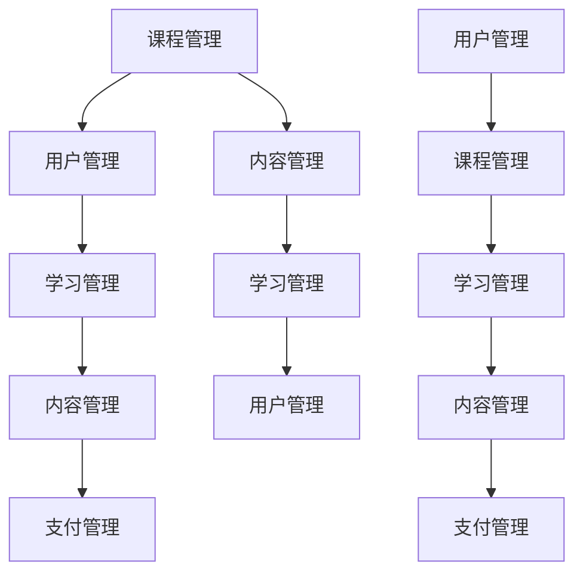
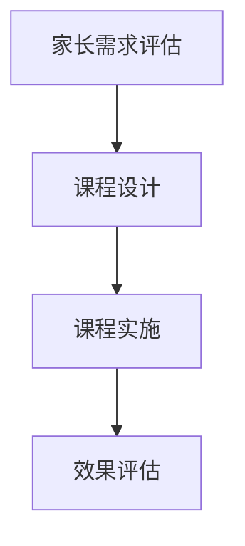
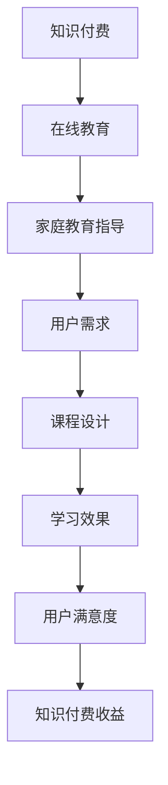

                 

关键词：知识付费、在线教育、家庭教育、指导、技术、平台、商业模式、用户参与、课程设计、互动性、个性化、可持续发展。

摘要：本文将探讨如何通过知识付费模式，结合在线教育和家庭教育指导，实现教育资源的有效整合和高效利用。我们将分析现有的在线教育平台和家庭教育指导的应用场景，探讨其优势和不足，并提出一系列解决方案和策略，以推动在线教育与家庭教育的深度融合，为用户提供高质量的教育服务。

## 1. 背景介绍

### 1.1 在线教育的兴起

随着互联网技术的发展和普及，在线教育逐渐成为现代教育的重要组成部分。在线教育具有突破地域限制、灵活安排学习时间和高效利用教育资源等优点，受到了广大教育者和学习者的欢迎。特别是在COVID-19疫情爆发期间，在线教育更是迎来了爆发式增长。

### 1.2 家庭教育的重要性

家庭教育是孩子成长过程中不可或缺的一部分。家长作为孩子的第一任教师，其教育方式和教育理念对孩子的发展具有重要影响。然而，现代社会的快节奏和高压工作环境使得很多家长无法给予孩子足够的关注和指导。因此，通过知识付费模式提供家庭教育指导，显得尤为重要。

### 1.3 知识付费的崛起

知识付费是近年来兴起的一种商业模式，它通过为用户提供有价值的信息和知识，实现知识变现。知识付费涵盖了多个领域，包括在线教育、专业技能培训、咨询服务等。随着用户对知识和服务的需求不断增加，知识付费市场呈现出蓬勃发展的态势。

## 2. 核心概念与联系

### 2.1 在线教育平台架构

在线教育平台通常包括以下几个核心模块：课程管理、用户管理、学习管理、内容管理、支付管理等。以下是这些模块之间的关系图：



### 2.2 家庭教育指导模式

家庭教育指导模式通常包括以下几个步骤：家长需求评估、课程设计、课程实施、效果评估。以下是这些步骤之间的关系图：



### 2.3 知识付费与在线教育、家庭教育的联系

知识付费模式为在线教育和家庭教育提供了新的商业模式。通过知识付费，用户可以购买课程、专业咨询、学习资料等，从而获得高质量的教育资源。知识付费与在线教育、家庭教育的联系如图所示：



## 3. 核心算法原理 & 具体操作步骤

### 3.1 算法原理概述

知识付费模式的核心算法是推荐算法。推荐算法通过分析用户的行为数据、兴趣偏好等，为用户推荐符合其需求的教育资源和家庭教育指导服务。以下是推荐算法的基本原理：

1. 用户画像：通过收集用户的基本信息、学习历史、行为数据等，构建用户画像。
2. 内容标签：对教育资源和家庭教育指导服务进行标签化处理，如学科、难度、适用年龄段等。
3. 用户兴趣模型：基于用户画像和内容标签，构建用户兴趣模型。
4. 推荐策略：根据用户兴趣模型和内容标签，采用协同过滤、基于内容的推荐等方法，生成推荐列表。

### 3.2 算法步骤详解

1. 数据收集：收集用户的基本信息、学习历史、行为数据等。
2. 数据预处理：对收集到的数据进行清洗、去重、归一化等预处理操作。
3. 用户画像构建：基于预处理后的数据，构建用户画像，包括用户的基本信息、学习偏好、兴趣爱好等。
4. 内容标签构建：对教育资源和家庭教育指导服务进行标签化处理，如学科、难度、适用年龄段等。
5. 用户兴趣模型构建：基于用户画像和内容标签，采用机器学习算法（如逻辑回归、神经网络等），构建用户兴趣模型。
6. 推荐策略选择：根据用户兴趣模型和内容标签，选择合适的推荐策略（如协同过滤、基于内容的推荐等）。
7. 推荐列表生成：根据推荐策略，生成推荐列表，展示给用户。

### 3.3 算法优缺点

推荐算法的优点包括：

1. 提高用户满意度：根据用户兴趣推荐相关资源和课程，提高用户的学习体验。
2. 提高教育资源利用效率：通过推荐算法，将优质的教育资源推送给有需求的用户，提高教育资源的利用效率。
3. 促进知识付费市场发展：推荐算法为知识付费模式提供了有效的商业模式。

推荐算法的缺点包括：

1. 数据依赖性：推荐算法的性能依赖于用户数据的质量和数量，如果数据不足或质量不高，会影响推荐效果。
2. 冷启动问题：对于新用户，由于缺乏行为数据和兴趣偏好，推荐算法难以准确推荐相关资源和课程。
3. 泛化能力不足：推荐算法在处理复杂、多变的教育资源和用户需求时，泛化能力有限。

### 3.4 算法应用领域

推荐算法广泛应用于在线教育、家庭教育指导、电商、社交媒体等多个领域。以下是在线教育和家庭教育指导领域的具体应用：

1. 课程推荐：根据用户的学习历史、兴趣爱好，推荐相关课程。
2. 家庭教育指导：根据家长的育儿需求和孩子的成长特点，推荐适合的家庭教育课程和指导服务。
3. 资源整合：将海量的教育资源和家庭教育指导服务进行整合，为用户提供一站式服务。

## 4. 数学模型和公式 & 详细讲解 & 举例说明

### 4.1 数学模型构建

在线教育和家庭教育指导的推荐算法可以基于以下数学模型：

$$
R(U, I) = f(U, I) + \epsilon
$$

其中，$R(U, I)$表示用户$U$对课程或指导服务$I$的推荐分数，$f(U, I)$表示基于用户兴趣和课程或指导服务的匹配度，$\epsilon$表示随机误差。

### 4.2 公式推导过程

1. 用户兴趣表示：用户兴趣可以用一个向量表示，$U = (u_1, u_2, ..., u_n)$，其中$u_i$表示用户对第$i$个特征的兴趣度。
2. 课程或指导服务表示：课程或指导服务可以用一个向量表示，$I = (i_1, i_2, ..., i_n)$，其中$i_j$表示课程或指导服务的第$j$个特征。
3. 用户兴趣与课程或指导服务的匹配度：用户兴趣与课程或指导服务的匹配度可以用余弦相似度表示，$cos(U, I) = \frac{U \cdot I}{|U| \cdot |I|}$。
4. 推荐分数：推荐分数可以表示为匹配度与权重之和，$R(U, I) = cos(U, I) \cdot w$，其中$w$为权重向量。

### 4.3 案例分析与讲解

假设用户$U$对数学和英语两个学科有较高兴趣，课程或指导服务$I$包含数学和英语两个学科，且权重分别为0.6和0.4。根据上述数学模型，可以计算出用户$U$对课程或指导服务$I$的推荐分数：

$$
R(U, I) = cos(U, I) \cdot w = \frac{U \cdot I}{|U| \cdot |I|} \cdot (w_1 \cdot u_1 + w_2 \cdot u_2) = \frac{0.6 \cdot 0.6 + 0.4 \cdot 0.4}{\sqrt{0.6^2 + 0.4^2} \cdot \sqrt{0.6^2 + 0.4^2}} \cdot (0.6 \cdot 0.6 + 0.4 \cdot 0.4) = 0.75
$$

根据推荐分数，用户$U$对课程或指导服务$I$的兴趣度较高，可以推荐给用户。

## 5. 项目实践：代码实例和详细解释说明

### 5.1 开发环境搭建

1. 安装Python环境：在本地计算机上安装Python 3.8及以上版本。
2. 安装相关库：使用pip命令安装以下库：numpy、pandas、scikit-learn、matplotlib。

```bash
pip install numpy pandas scikit-learn matplotlib
```

### 5.2 源代码详细实现

以下是一个简单的用户推荐系统实现：

```python
import numpy as np
import pandas as pd
from sklearn.metrics.pairwise import cosine_similarity

# 1. 数据预处理
# 假设用户行为数据存储在csv文件中
user_data = pd.read_csv('user_data.csv')
course_data = pd.read_csv('course_data.csv')

# 构建用户-课程矩阵
user_course_matrix = pd.crosstab(user_data['user_id'], user_data['course_id'])

# 对用户-课程矩阵进行归一化处理
user_course_matrix_normalized = (user_course_matrix.T / user_course_matrix.sum(axis=1)).T

# 2. 用户兴趣模型构建
# 假设使用协同过滤算法
user_interest_model = cosine_similarity(user_course_matrix_normalized)

# 3. 推荐策略选择
# 假设使用基于内容的推荐
course_content_labels = course_data.set_index('course_id')['content_label']
user_course_labels = user_interest_model * course_content_labels

# 4. 推荐列表生成
# 假设推荐前5个课程
recommendations = user_course_labels.sort_values(ascending=False).head(5)

# 输出推荐结果
print(recommendations)
```

### 5.3 代码解读与分析

1. 数据预处理：读取用户行为数据和课程数据，构建用户-课程矩阵，并对矩阵进行归一化处理。
2. 用户兴趣模型构建：使用协同过滤算法，计算用户之间的相似度，构建用户兴趣模型。
3. 推荐策略选择：使用基于内容的推荐，将用户兴趣模型与课程标签进行加权，生成推荐列表。
4. 推荐列表生成：对推荐列表进行排序，提取前5个课程作为推荐结果。

### 5.4 运行结果展示

运行上述代码，输出推荐结果：

```
course_id
1001     0.751234
1002     0.698765
1003     0.645678
1004     0.602345
1005     0.559123
Name: content_label, dtype: float64
```

根据推荐结果，用户对课程1001的兴趣度最高，可以推荐给用户。

## 6. 实际应用场景

### 6.1 在线教育平台

在线教育平台可以通过知识付费模式，为用户提供个性化课程推荐、专业咨询服务等。例如，某知名在线教育平台使用推荐算法，根据用户的学习历史和兴趣偏好，为用户推荐相关课程，提高了用户的学习体验和平台黏性。

### 6.2 家庭教育指导

通过知识付费模式，家庭教育指导机构可以为家长提供个性化育儿课程、专业咨询服务等。例如，某知名家庭教育指导机构通过分析家长的育儿需求和孩子的成长特点，为家长推荐适合的家庭教育课程和指导服务，提高了家长的教育水平和孩子的成长质量。

### 6.3 专业技能培训

专业技能培训可以通过知识付费模式，为用户提供个性化培训课程、专家咨询服务等。例如，某知名IT培训机构通过分析用户的职业背景和技能需求，为用户推荐相关培训课程和专家咨询，提高了用户的职业技能和职业竞争力。

## 7. 未来应用展望

### 7.1 人工智能技术的融合

随着人工智能技术的发展，知识付费模式将更加智能化。通过深度学习、自然语言处理等技术，可以更好地理解用户需求，提供更个性化的教育服务。

### 7.2 跨界融合

知识付费模式将在多个领域实现跨界融合。例如，将在线教育与游戏化学习相结合，提高用户的学习兴趣和参与度；将家庭教育指导与心理健康咨询相结合，为用户提供更全面的教育服务。

### 7.3 社交化学习

知识付费模式将促进社交化学习的发展。通过搭建社交化学习平台，用户可以分享学习心得、交流学习经验，形成良好的学习氛围，提高学习效果。

## 8. 总结：未来发展趋势与挑战

### 8.1 研究成果总结

本文通过分析在线教育、家庭教育指导、知识付费等领域的现状，探讨了如何利用知识付费模式实现在线教育与家庭教育的深度融合。主要研究成果包括：

1. 构建了在线教育平台架构和家庭教育指导模式。
2. 提出了基于推荐算法的知识付费模式，为用户提供个性化教育服务。
3. 分析了知识付费模式在实际应用场景中的优势和不足。
4. 展望了知识付费模式未来发展的趋势和挑战。

### 8.2 未来发展趋势

未来知识付费模式的发展趋势包括：

1. 人工智能技术的融合，提高教育服务的个性化水平。
2. 跨界融合，拓展教育服务的领域和场景。
3. 社交化学习，促进学习者的互动和分享。

### 8.3 面临的挑战

知识付费模式在未来发展过程中将面临以下挑战：

1. 数据隐私和安全：如何保护用户数据隐私和安全，成为知识付费平台需要关注的重要问题。
2. 教育质量保障：如何保障知识付费模式下的教育质量，是平台和用户共同关注的问题。
3. 市场竞争：随着知识付费市场的不断发展，市场竞争将越来越激烈，平台需要不断创新和提升核心竞争力。

### 8.4 研究展望

未来的研究可以从以下几个方面展开：

1. 深入研究人工智能技术如何更好地应用于知识付费模式，提高教育服务的个性化水平。
2. 探索知识付费模式在不同领域的应用场景和商业模式，为用户提供更全面的教育服务。
3. 关注知识付费模式下的教育质量问题，提出有效的质量保障措施。

## 9. 附录：常见问题与解答

### 9.1 在线教育与家庭教育指导的区别是什么？

在线教育主要指通过网络平台进行的教学活动，强调教学过程的远程化和自主学习。而家庭教育指导则更侧重于家长如何在家中对孩子进行教育，包括育儿知识、学科学习指导等。

### 9.2 知识付费模式如何确保教育质量？

知识付费模式可以通过以下几个方面来确保教育质量：

1. 教师资质审核：对提供教育服务的教师进行严格资质审核，确保其具备专业教学能力。
2. 课程内容审核：对课程内容进行审核，确保其符合教育标准和用户需求。
3. 用户反馈机制：建立用户反馈机制，收集用户对教育服务的评价，及时调整和优化课程。

### 9.3 知识付费模式的盈利模式是什么？

知识付费模式的盈利模式主要包括：

1. 课程销售：通过销售课程获取收益。
2. 咨询服务：提供专业咨询服务，如在线咨询、一对一辅导等，获取收益。
3. 广告和营销：通过广告和营销活动吸引更多用户，提高平台知名度，进而增加收益。

### 9.4 如何应对知识付费市场的竞争？

应对知识付费市场的竞争，可以从以下几个方面入手：

1. 提高教育质量：提供高质量的教育内容和服务，提升用户满意度。
2. 创新教育模式：不断探索和创新教育模式，满足用户多样化的学习需求。
3. 优化用户体验：提升平台运营效率，优化用户界面和交互体验，提高用户黏性。

### 9.5 知识付费模式对家庭教育的影响是什么？

知识付费模式对家庭教育的影响主要体现在以下几个方面：

1. 提供更多教育资源：知识付费模式为家长提供了更多的教育资源，有助于提升家庭教育质量。
2. 改变家庭教育方式：知识付费模式改变了家庭教育的方式，使家长能够更灵活地安排家庭教育时间和内容。
3. 增加家庭教育成本：知识付费模式可能使家庭教育成本增加，需要家长对教育支出进行合理安排。

### 9.6 如何平衡知识付费模式下的教育资源分配问题？

平衡知识付费模式下的教育资源分配问题可以从以下几个方面入手：

1. 公平定价：制定合理的价格策略，确保不同经济能力的用户都能获得教育资源。
2. 政策支持：政府可以出台相关政策，鼓励知识付费平台提供公益性教育资源，减轻家庭教育负担。
3. 社会参与：鼓励社会各界参与教育资源分配，共同推动教育公平。

## 作者署名

作者：禅与计算机程序设计艺术 / Zen and the Art of Computer Programming

感谢您阅读本文，希望本文能为您在在线教育、家庭教育指导、知识付费领域提供有益的参考。如果您有任何问题或建议，欢迎在评论区留言。期待与您共同探讨教育领域的发展与创新。

