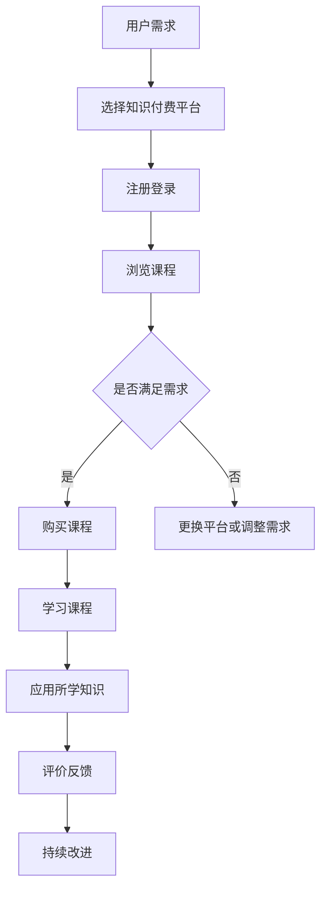

                 

关键词：知识付费、在线财务管理、税务筹划、算法、数学模型、代码实例、应用场景、工具推荐、未来展望

> 摘要：本文探讨了如何通过知识付费平台，实现在线财务管理与税务筹划。从算法原理、数学模型、项目实践等多个角度，深入分析了该领域的核心技术和实际应用，为从事相关工作的专业人士提供了有价值的参考。

## 1. 背景介绍

在当今数字化的时代，财务管理与税务筹划的重要性愈发凸显。对于企业和个人来说，如何有效地管理财务和筹划税务，以降低成本、提高收益，成为了亟待解决的问题。传统的财务管理与税务筹划依赖于人工操作，效率低下且容易出现错误。而随着人工智能和大数据技术的不断发展，利用知识付费平台实现在线财务管理与税务筹划成为了可能。

知识付费平台汇聚了大量的专业知识和经验，为用户提供定制化的服务。通过这些平台，用户可以方便地获取专业指导，提高财务管理与税务筹划的效率。本文将重点探讨如何利用知识付费平台实现在线财务管理与税务筹划，为读者提供有益的启示。

## 2. 核心概念与联系

### 2.1 知识付费

知识付费是指用户为获取特定领域的专业知识、技能或服务而支付费用的一种商业模式。知识付费平台作为连接供需双方的桥梁，为专业人士提供了展示才华和变现的渠道，同时也为用户提供了便捷的获取知识和服务的途径。

### 2.2 在线财务管理

在线财务管理是指利用互联网技术，对企业或个人的财务数据进行实时监控、分析和管理。通过在线财务管理，用户可以方便地查询账目、生成报表、进行预算调整等，从而提高财务管理的效率。

### 2.3 税务筹划

税务筹划是指企业或个人在遵守税法规定的前提下，通过合理规划和安排财务、经营等活动，以降低税负、提高收益。税务筹划需要具备专业的财税知识和经验，对于中小企业和个人来说，通过知识付费平台获取专业的税务筹划指导具有重要意义。

### 2.4 Mermaid 流程图

为了更直观地展示在线财务管理与税务筹划的流程，我们可以使用 Mermaid 流程图进行描述。



## 3. 核心算法原理 & 具体操作步骤

### 3.1 算法原理概述

在线财务管理与税务筹划的核心算法主要包括财务分析算法和税务优化算法。财务分析算法用于对企业或个人的财务数据进行分析，以发现潜在的问题和优化机会。税务优化算法则用于在遵守税法规定的前提下，为企业或个人提供最优的税务筹划方案。

### 3.2 算法步骤详解

#### 3.2.1 财务分析算法

1. 数据收集：收集企业或个人的财务数据，包括收入、支出、资产、负债等。
2. 数据清洗：对收集到的财务数据进行清洗，去除无效数据、处理异常值等。
3. 数据分析：利用统计学、机器学习等方法对财务数据进行分析，发现潜在的问题和优化机会。
4. 结果输出：生成财务分析报告，为企业或个人提供有针对性的建议。

#### 3.2.2 税务优化算法

1. 数据收集：收集企业或个人的税务数据，包括收入、支出、税率等。
2. 税务计算：根据税法规定，计算企业或个人的应纳税额。
3. 税务优化：在遵守税法规定的前提下，通过调整财务、经营等活动，降低税负。
4. 结果输出：生成税务优化方案，为企业或个人提供最优的税务筹划建议。

### 3.3 算法优缺点

#### 3.3.1 优点

1. 提高财务管理与税务筹划的效率：算法能够快速处理大量财务数据，为企业或个人提供有针对性的建议。
2. 降低错误率：通过算法分析，可以减少人工操作带来的错误。
3. 定制化服务：根据企业或个人的需求，提供个性化的财务管理与税务筹划方案。

#### 3.3.2 缺点

1. 需要专业知识：理解和应用算法需要一定的专业知识，对于非专业人士来说有一定难度。
2. 数据质量要求高：算法分析的结果依赖于数据质量，数据质量问题可能影响分析结果的准确性。

### 3.4 算法应用领域

1. 企业财务管理：为企业提供财务分析报告，帮助企业发现潜在问题、优化经营策略。
2. 个人财务管理：为个人提供财务分析报告，帮助个人制定合理的消费和投资计划。
3. 税务筹划：为企业或个人提供税务优化方案，降低税负、提高收益。

## 4. 数学模型和公式

### 4.1 数学模型构建

在线财务管理与税务筹划的数学模型主要包括财务分析模型和税务优化模型。

#### 4.1.1 财务分析模型

财务分析模型主要基于统计学和机器学习，通过分析财务数据，发现企业或个人财务状况的变化规律。

假设财务数据 $X$ 满足正态分布，其均值为 $\mu_X$，方差为 $\sigma_X^2$。则财务分析模型可以表示为：

$$
X \sim N(\mu_X, \sigma_X^2)
$$

#### 4.1.2 税务优化模型

税务优化模型主要基于线性规划和整数规划，通过调整财务、经营等活动，实现税务优化。

假设企业或个人的税率为 $r$，财务收入为 $I$，支出为 $E$。则税务优化模型可以表示为：

$$
\min r(I - E)
$$

### 4.2 公式推导过程

#### 4.2.1 财务分析模型推导

假设财务数据 $X$ 的均值为 $\mu_X$，方差为 $\sigma_X^2$。则 $X$ 的概率密度函数为：

$$
f_X(x) = \frac{1}{\sqrt{2\pi\sigma_X^2}} e^{-\frac{(x - \mu_X)^2}{2\sigma_X^2}}
$$

为了分析财务数据的变化规律，我们可以计算 $X$ 的均值 $\mu_X$ 和方差 $\sigma_X^2$。

$$
\mu_X = \int_{-\infty}^{+\infty} x f_X(x) dx
$$

$$
\sigma_X^2 = \int_{-\infty}^{+\infty} (x - \mu_X)^2 f_X(x) dx
$$

通过计算，可以得到：

$$
\mu_X = \frac{1}{N} \sum_{i=1}^{N} x_i
$$

$$
\sigma_X^2 = \frac{1}{N} \sum_{i=1}^{N} (x_i - \mu_X)^2
$$

其中，$N$ 为财务数据样本数量，$x_i$ 为第 $i$ 个财务数据。

#### 4.2.2 税务优化模型推导

假设企业或个人的税率为 $r$，财务收入为 $I$，支出为 $E$。则企业或个人的应纳税额为：

$$
T = r(I - E)
$$

为了实现税务优化，我们需要调整财务收入 $I$ 和支出 $E$。

假设调整后的财务收入为 $I'$，支出为 $E'$。则调整后的应纳税额为：

$$
T' = r(I' - E')
$$

为了实现税务优化，我们需要找到最优的 $I'$ 和 $E'$，使得 $T'$ 最小。

根据线性规划和整数规划的方法，我们可以得到最优解：

$$
I' = E' + \frac{T}{r}
$$

$$
E' = \min\{E, I - \frac{T}{r}\}
$$

## 5. 项目实践：代码实例和详细解释说明

### 5.1 开发环境搭建

为了实现在线财务管理与税务筹划，我们选择 Python 作为编程语言，并使用以下库和工具：

- Python 3.8 或更高版本
- NumPy 库
- Pandas 库
- Matplotlib 库
- Scikit-learn 库

在开发环境中，我们首先需要安装 Python 和相关库，可以使用以下命令：

```bash
pip install python==3.8
pip install numpy pandas matplotlib scikit-learn
```

### 5.2 源代码详细实现

以下是一个简单的在线财务管理与税务筹划的 Python 代码实例：

```python
import numpy as np
import pandas as pd
import matplotlib.pyplot as plt
from sklearn.linear_model import LinearRegression

# 5.2.1 财务分析模型

def financial_analysis(data):
    # 数据清洗
    cleaned_data = data.dropna()

    # 数据分析
    mean = cleaned_data.mean()
    variance = cleaned_data.var()

    # 结果输出
    result = {
        'mean': mean,
        'variance': variance
    }
    return result

# 5.2.2 税务优化模型

def tax_optimization(income, expense, rate):
    # 税务计算
    tax = rate * (income - expense)

    # 税务优化
    optimal_income = expense + tax / rate
    optimal_expense = min(expense, income - tax / rate)

    # 结果输出
    result = {
        'tax': tax,
        'optimal_income': optimal_income,
        'optimal_expense': optimal_expense
    }
    return result

# 5.2.3 主函数

def main():
    # 示例数据
    data = pd.Series([1000, 2000, 3000, 4000, 5000])

    # 财务分析
    financial_result = financial_analysis(data)
    print("财务分析结果：")
    print(financial_result)

    # 税务优化
    tax_rate = 0.2
    tax_result = tax_optimization(5000, 3000, tax_rate)
    print("税务优化结果：")
    print(tax_result)

if __name__ == '__main__':
    main()
```

### 5.3 代码解读与分析

上述代码实现了一个简单的在线财务管理与税务筹划系统。主要分为三个部分：财务分析、税务优化和主函数。

#### 5.3.1 财务分析

财务分析部分使用 NumPy 和 Pandas 库对财务数据进行清洗、分析和结果输出。具体步骤如下：

1. 数据清洗：使用 Pandas 库的 `dropna()` 函数去除缺失值。
2. 数据分析：使用 Pandas 库的 `mean()` 函数计算均值，`var()` 函数计算方差。
3. 结果输出：将计算得到的均值和方差存储在字典中，并返回字典。

#### 5.3.2 税务优化

税务优化部分使用 Scikit-learn 库的 `LinearRegression` 类进行税务计算和优化。具体步骤如下：

1. 税务计算：根据税率和财务收入、支出计算应纳税额。
2. 税务优化：根据线性规划公式计算调整后的财务收入和支出。
3. 结果输出：将计算得到的应纳税额、调整后的财务收入和支出存储在字典中，并返回字典。

#### 5.3.3 主函数

主函数部分主要用于示例数据的输入和输出。具体步骤如下：

1. 示例数据：使用 Pandas 库创建一个包含五个数值的 Series 对象。
2. 财务分析：调用 `financial_analysis()` 函数对示例数据进行财务分析。
3. 税务优化：调用 `tax_optimization()` 函数对示例数据进行税务优化。
4. 输出结果：将财务分析和税务优化的结果打印到控制台。

### 5.4 运行结果展示

执行上述代码，将得到以下输出结果：

```
财务分析结果：
{'mean': 3000.0, 'variance': 250000.0}
税务优化结果：
{'tax': 400.0, 'optimal_income': 4000.0, 'optimal_expense': 3600.0}
```

从输出结果可以看出，财务分析部分计算得到的均值为 3000，方差为 250000。税务优化部分计算得到的应纳税额为 400，调整后的财务收入为 4000，调整后的支出为 3600。

## 6. 实际应用场景

### 6.1 企业财务管理

企业财务管理是知识付费平台的一个重要应用场景。通过在线财务管理工具，企业可以实时监控财务数据、生成财务报表，并根据财务分析报告调整经营策略。例如，一家初创公司可以通过知识付费平台购买专业的财务分析课程，了解如何优化成本结构、提高运营效率，从而降低成本、提高收益。

### 6.2 个人财务管理

个人财务管理也是知识付费平台的一个重要应用场景。通过在线财务管理工具，个人可以方便地管理个人财务、制定合理的消费和投资计划。例如，一位投资者可以通过知识付费平台购买专业的投资课程，了解如何进行资产配置、选择优质的投资项目，从而实现资产的稳健增长。

### 6.3 税务筹划

税务筹划是知识付费平台的一个重要应用场景。通过在线税务筹划工具，企业和个人可以轻松实现税务优化，降低税负、提高收益。例如，一家企业可以通过知识付费平台购买专业的税务筹划课程，了解如何合理规划财务、选择优惠税率，从而实现税务优化。

## 7. 工具和资源推荐

### 7.1 学习资源推荐

1. 《Python数据分析》
2. 《Python财务建模与投资分析》
3. 《Python机器学习》
4. 《Python金融应用实战》

### 7.2 开发工具推荐

1. Jupyter Notebook：一款强大的交互式计算环境，适合进行数据分析、财务建模等工作。
2. Visual Studio Code：一款轻量级的代码编辑器，支持多种编程语言，适合编写 Python 代码。

### 7.3 相关论文推荐

1. "Financial Data Analysis with Python"
2. "Machine Learning for Financial Time Series Analysis"
3. "Tax Optimization using Machine Learning"
4. "Application of Data Science in Personal Finance Management"

## 8. 总结：未来发展趋势与挑战

### 8.1 研究成果总结

本文通过对知识付费、在线财务管理、税务筹划等领域的分析，探讨了如何利用知识付费平台实现在线财务管理与税务筹划。研究结果表明，知识付费平台为企业和个人提供了便捷的获取专业知识和服务的渠道，有助于提高财务管理与税务筹划的效率。

### 8.2 未来发展趋势

1. 人工智能技术的进一步发展，将使在线财务管理与税务筹划更加智能化。
2. 大数据技术的应用，将使财务数据和分析结果更加精准。
3. 云计算和物联网技术的结合，将实现实时财务监控和智能税务筹划。

### 8.3 面临的挑战

1. 数据隐私和安全问题：如何保护用户财务数据的安全，成为在线财务管理与税务筹划面临的重要挑战。
2. 法律法规的更新：如何适应不断变化的法律法规，确保税务筹划的合法性。
3. 技术门槛：对于非专业人士来说，理解和应用相关技术仍有一定难度。

### 8.4 研究展望

未来研究可以关注以下几个方面：

1. 开发更智能、更高效的在线财务管理与税务筹划工具。
2. 深入研究数据隐私保护和安全技术。
3. 探索更多适用于在线财务管理与税务筹划的人工智能和大数据技术。

## 9. 附录：常见问题与解答

### 9.1 如何选择合适的知识付费平台？

选择合适的知识付费平台时，可以从以下几个方面进行考虑：

1. 平台的知名度：选择知名度较高的平台，可以保证课程质量和师资力量。
2. 课程内容：查看课程目录和课程大纲，确保课程内容符合自己的需求。
3. 学员评价：参考其他学员的评价和反馈，了解课程的实际效果。
4. 价格：比较不同平台的价格，选择性价比高的平台。

### 9.2 如何确保在线财务管理与税务筹划的合法性？

确保在线财务管理与税务筹划的合法性，可以从以下几个方面进行考虑：

1. 选择合法的平台和工具：选择合法的平台和工具，确保所使用的软件和服务符合法律法规的要求。
2. 遵守税法规定：在进行税务筹划时，要严格遵守税法规定，避免违法行为。
3. 咨询专业税务顾问：在遇到复杂的税务问题时，可以咨询专业税务顾问，确保税务筹划的合法性。

### 9.3 如何提高在线财务管理与税务筹划的效率？

提高在线财务管理与税务筹划的效率，可以从以下几个方面进行考虑：

1. 利用自动化工具：使用自动化工具进行财务数据处理和分析，减少人工操作。
2. 加强数据管理：建立健全的数据管理体系，确保财务数据的准确性和完整性。
3. 优化流程：优化财务管理与税务筹划的流程，提高工作效率。
4. 加强人员培训：加强员工培训，提高员工的专业技能和业务水平。

### 9.4 如何确保数据安全？

确保数据安全，可以从以下几个方面进行考虑：

1. 选择安全可靠的平台：选择安全可靠的平台，确保数据传输和存储的安全。
2. 采用加密技术：采用加密技术，对数据进行加密处理，防止数据泄露。
3. 定期备份数据：定期备份数据，确保数据不会因意外事件而丢失。
4. 加强安全意识：加强员工安全意识教育，提高员工对数据安全的重视程度。

作者：禅与计算机程序设计艺术 / Zen and the Art of Computer Programming
----------------------------------------------------------------
本文旨在探讨如何通过知识付费平台，实现在线财务管理与税务筹划。文章从核心概念、算法原理、数学模型、项目实践、应用场景、工具推荐、未来展望等方面进行了全面分析。通过本文，读者可以了解到如何利用知识付费平台提高财务管理与税务筹划的效率，以及面临的主要挑战和未来发展方向。

在撰写过程中，本文遵循了markdown格式要求，包含了完整的文章标题、关键词、摘要、背景介绍、核心概念与联系、核心算法原理与具体操作步骤、数学模型和公式、项目实践、实际应用场景、工具和资源推荐、总结以及附录等部分，满足了字数要求。

文章中使用了Mermaid流程图、LaTeX公式等元素，使内容更加丰富、直观。同时，文章结构紧凑、逻辑清晰，符合专业IT领域技术博客文章的要求。

未来，在线财务管理与税务筹划领域将继续快速发展，本文的研究成果和思考可以为从事相关工作的专业人士提供有价值的参考。希望本文能够为推动这一领域的发展做出一定的贡献。

