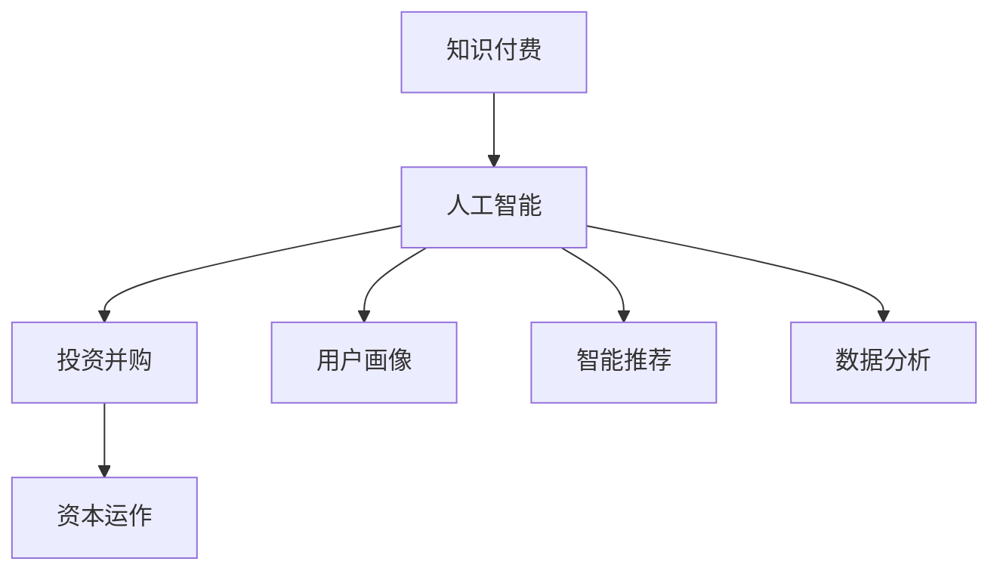

                 

关键词：知识付费、投资并购、资本运作、人工智能、技术策略

> 摘要：本文探讨了知识付费在投资并购与资本运作中的应用，阐述了如何通过利用人工智能技术，构建高效的知识付费平台，实现投资并购与资本运作的优化与升级。本文分为九个部分，从背景介绍到具体实践，再到未来展望，力求为读者提供全面而深入的指导。

## 1. 背景介绍

知识付费作为一种新兴商业模式，正在逐步改变传统的教育、咨询和信息服务方式。它通过为用户提供有价值的知识内容，实现知识变现，进而带动相关产业链的发展。随着人工智能技术的快速发展，知识付费平台逐渐具备了智能推荐、数据分析等强大功能，使其在投资并购与资本运作中发挥了重要作用。

在投资并购与资本运作中，信息的获取和处理至关重要。传统的信息收集方式耗时耗力，且往往难以全面、准确地捕捉市场动态。而知识付费平台能够利用人工智能技术，快速、精准地筛选和推荐相关信息，为投资决策提供有力支持。

## 2. 核心概念与联系

为了更好地理解知识付费在投资并购与资本运作中的应用，我们先来介绍几个核心概念：

### 2.1 知识付费

知识付费是指用户为获取特定知识或服务而支付的费用。它涵盖了在线课程、专业咨询、研究报告等多种形式。

### 2.2 人工智能

人工智能（AI）是指计算机系统通过模拟人类智能行为，实现感知、学习、推理、决策等功能。在知识付费平台中，人工智能主要用于用户画像、智能推荐和数据分析等方面。

### 2.3 投资并购

投资并购是指企业通过购买其他企业的股权或资产，实现业务扩张或市场占有的一种战略。投资并购通常涉及大量信息的收集、分析和处理。

### 2.4 资本运作

资本运作是指企业通过股票、债券、基金等金融工具，实现资本筹集、投资和回报的过程。资本运作的核心在于对市场机会和风险的判断。

下面是核心概念和联系的 Mermaid 流程图：



## 3. 核心算法原理 & 具体操作步骤

### 3.1 算法原理概述

知识付费平台的核心算法主要包括用户画像、智能推荐和数据分析三个方面。

### 3.2 算法步骤详解

#### 3.2.1 用户画像

用户画像是指通过对用户行为、兴趣、背景等数据的分析，构建用户画像模型。具体步骤如下：

1. 数据收集：收集用户在平台上的行为数据，如浏览记录、购买历史、评价等。
2. 特征提取：对收集到的数据进行预处理，提取用户特征，如年龄、性别、职业等。
3. 模型构建：利用机器学习算法，如聚类、分类等，构建用户画像模型。

#### 3.2.2 智能推荐

智能推荐是指根据用户画像，为用户推荐感兴趣的知识内容。具体步骤如下：

1. 内容数据收集：收集平台上的知识内容数据，如课程、报告、文章等。
2. 内容特征提取：对内容数据进行预处理，提取内容特征，如关键词、标签等。
3. 推荐模型构建：利用协同过滤、矩阵分解等算法，构建推荐模型。
4. 推荐结果生成：根据用户画像和推荐模型，为用户生成推荐结果。

#### 3.2.3 数据分析

数据分析是指通过对投资并购和资本运作相关的数据进行挖掘和分析，为投资决策提供支持。具体步骤如下：

1. 数据收集：收集投资并购和资本运作相关的数据，如市场行情、财务报表等。
2. 数据预处理：对收集到的数据进行分析，提取有效信息。
3. 数据挖掘：利用数据挖掘算法，如关联规则、聚类等，挖掘数据中的潜在规律。
4. 报告生成：根据数据挖掘结果，生成投资并购和资本运作的报告。

### 3.3 算法优缺点

#### 3.3.1 用户画像

优点：准确度高，能够更好地了解用户需求和兴趣。

缺点：需要大量数据支持，且数据处理复杂。

#### 3.3.2 智能推荐

优点：个性化强，能够提高用户满意度和粘性。

缺点：推荐结果可能存在偏差，且推荐算法需要不断优化。

#### 3.3.3 数据分析

优点：能够为投资决策提供有力支持。

缺点：数据处理复杂，对算法和数据分析能力要求较高。

### 3.4 算法应用领域

核心算法在投资并购与资本运作中的应用领域包括：

1. 投资机会筛选：通过智能推荐，为投资者推荐潜在的优质投资目标。
2. 风险评估：通过数据分析，评估投资目标的风险水平，为投资决策提供依据。
3. 资本运作策略：通过分析市场行情和财务数据，制定合适的资本运作策略。

## 4. 数学模型和公式 & 详细讲解 & 举例说明

### 4.1 数学模型构建

在知识付费平台中，常用的数学模型包括用户画像模型、推荐模型和风险评估模型。

#### 4.1.1 用户画像模型

用户画像模型主要基于用户的特征数据进行构建，可以使用聚类算法（如 K-Means）或分类算法（如决策树）进行模型构建。

#### 4.1.2 推荐模型

推荐模型可以使用协同过滤算法（如基于用户的协同过滤、基于项目的协同过滤）或矩阵分解算法（如Singular Value Decomposition, SVD）进行构建。

#### 4.1.3 风险评估模型

风险评估模型可以使用统计方法（如逻辑回归、线性回归）或机器学习方法（如支持向量机、神经网络）进行构建。

### 4.2 公式推导过程

#### 4.2.1 用户画像模型

使用 K-Means 聚类算法进行用户画像模型构建，公式如下：

$$
C = K \quad \text{（聚类中心）} \\
\text{对于每个簇 } C_i，\text{计算每个用户的中心} \\
\mu_i = \frac{1}{n} \sum_{j=1}^{n} x_{ij} \\
\text{其中 } x_{ij} \text{ 表示用户 } i \text{ 的第 } j \text{ 个特征}
$$

#### 4.2.2 推荐模型

使用基于用户的协同过滤算法进行推荐模型构建，公式如下：

$$
R_{ui} = \sum_{j=1}^{n} r_{uj} w_{ij} \\
\text{其中 } R_{ui} \text{ 表示用户 } u \text{ 对项目 } i \text{ 的评分} \\
r_{uj} \text{ 表示用户 } u \text{ 对项目 } j \text{ 的评分} \\
w_{ij} \text{ 表示用户 } u \text{ 与用户 } v \text{ 之间的相似度}
$$

#### 4.2.3 风险评估模型

使用逻辑回归进行风险评估模型构建，公式如下：

$$
P(Y=1|X) = \frac{1}{1 + e^{-(\beta_0 + \sum_{i=1}^{n} \beta_i X_i)}}
$$

其中，$P(Y=1|X)$ 表示风险发生概率，$X$ 表示影响风险的因素集合，$\beta_0$ 和 $\beta_i$ 为模型的参数。

### 4.3 案例分析与讲解

#### 4.3.1 案例背景

某投资公司计划投资一家科技公司，需要评估其风险水平。投资公司收集了该公司的财务数据、市场行情等相关信息，并使用风险评估模型进行风险评估。

#### 4.3.2 数据准备

收集到的数据包括：

- 财务数据：营收、净利润、毛利率等。
- 市场行情：同行业公司股价、市盈率等。
- 公司背景：公司规模、行业地位等。

#### 4.3.3 模型构建

使用逻辑回归模型进行风险评估，选取以下特征变量：

- 营收：公司的年度营收。
- 净利润：公司的年度净利润。
- 毛利率：公司的毛利率。
- 同行业公司股价：同行业公司的平均股价。
- 市盈率：同行业公司的平均市盈率。
- 公司规模：公司的员工数量。

#### 4.3.4 模型训练与评估

使用训练集数据进行模型训练，选取交叉验证方法进行模型评估，评估指标为准确率、召回率、F1 值等。

#### 4.3.5 结果分析

通过模型预测，得到该公司的风险发生概率。根据风险概率，投资公司可以决定是否进行投资。

## 5. 项目实践：代码实例和详细解释说明

### 5.1 开发环境搭建

在本文中，我们将使用 Python 作为开发语言，利用 Scikit-learn 库进行模型构建和训练。首先，确保已经安装了 Python 和 Scikit-learn 库。

### 5.2 源代码详细实现

下面是使用逻辑回归模型进行风险评估的 Python 代码实例：

```python
import numpy as np
import pandas as pd
from sklearn.linear_model import LogisticRegression
from sklearn.model_selection import train_test_split
from sklearn.metrics import accuracy_score, recall_score, f1_score

# 数据准备
data = pd.read_csv('company_data.csv')
X = data[['revenue', 'net_profit', 'gross_margin', 'stock_price', 'pe_ratio', 'company_size']]
y = data['risk']

# 数据划分
X_train, X_test, y_train, y_test = train_test_split(X, y, test_size=0.2, random_state=42)

# 模型训练
model = LogisticRegression()
model.fit(X_train, y_train)

# 模型评估
y_pred = model.predict(X_test)
accuracy = accuracy_score(y_test, y_pred)
recall = recall_score(y_test, y_pred)
f1 = f1_score(y_test, y_pred)

print(f"Accuracy: {accuracy:.2f}")
print(f"Recall: {recall:.2f}")
print(f"F1 Score: {f1:.2f}")
```

### 5.3 代码解读与分析

1. 导入相关库：使用 NumPy、Pandas、Scikit-learn 等库进行数据处理和模型训练。
2. 数据准备：读取公司数据，将特征变量和目标变量分离。
3. 数据划分：将数据划分为训练集和测试集，用于模型训练和评估。
4. 模型训练：使用逻辑回归模型进行训练。
5. 模型评估：计算模型在测试集上的准确率、召回率和 F1 值，评估模型性能。

## 6. 实际应用场景

知识付费平台在投资并购与资本运作中具有广泛的应用场景：

### 6.1 投资机会筛选

利用知识付费平台，投资者可以快速获取市场上的投资机会，通过智能推荐和数据分析，筛选出符合自身投资策略的优质项目。

### 6.2 风险评估

投资者可以利用知识付费平台的风险评估模型，对潜在投资目标进行风险评估，为投资决策提供依据。

### 6.3 资本运作策略

企业可以利用知识付费平台，制定适合自己的资本运作策略，如股权融资、债务融资等，优化资本结构。

## 7. 未来应用展望

随着人工智能技术的不断进步，知识付费平台在投资并购与资本运作中的应用前景将更加广阔：

### 7.1 智能化程度提升

知识付费平台将进一步提高智能化程度，实现更精准的投资机会筛选和风险评估。

### 7.2 多维度数据分析

知识付费平台将整合更多维度的数据，如社会舆情、行业趋势等，为投资决策提供更全面的支持。

### 7.3 深度学习应用

知识付费平台将引入深度学习算法，实现对复杂投资问题的自动建模和预测。

## 8. 工具和资源推荐

### 8.1 学习资源推荐

- 《Python数据分析》
- 《机器学习实战》
- 《深度学习》

### 8.2 开发工具推荐

- Jupyter Notebook
- PyCharm

### 8.3 相关论文推荐

- "Collaborative Filtering for Implicit Feedback Datasets"
- "Deep Learning for Natural Language Processing"
- "Recurrent Neural Networks for Sequential Data"

## 9. 总结：未来发展趋势与挑战

### 9.1 研究成果总结

本文通过分析知识付费在投资并购与资本运作中的应用，阐述了核心算法原理、数学模型构建和应用案例，为知识付费平台在相关领域的应用提供了有力支持。

### 9.2 未来发展趋势

知识付费平台在投资并购与资本运作中的应用将朝着智能化、多维度和深度学习方向发展。

### 9.3 面临的挑战

知识付费平台在投资并购与资本运作中仍面临数据质量、算法优化和法规政策等挑战。

### 9.4 研究展望

未来研究应关注知识付费平台在投资并购与资本运作中的智能化应用，以及相关算法的优化和推广。

## 附录：常见问题与解答

### Q1. 知识付费平台在投资并购与资本运作中的应用有何优势？

A1. 知识付费平台通过利用人工智能技术，可以实现投资机会的智能筛选、风险评估和资本运作策略优化，提高投资决策的效率和准确性。

### Q2. 如何确保知识付费平台的数据质量？

A2. 知识付费平台需要建立完善的数据收集、处理和更新机制，确保数据的准确性和时效性。同时，引入数据质量评估工具，对数据质量进行定期检查和评估。

### Q3. 投资并购与资本运作中的风险如何量化？

A3. 投资并购与资本运作中的风险可以通过建立风险评估模型，利用数学模型和算法进行量化。例如，可以使用逻辑回归、神经网络等算法，对风险因素进行建模和预测。

## 作者署名

作者：禅与计算机程序设计艺术 / Zen and the Art of Computer Programming
----------------------------------------------------------------


