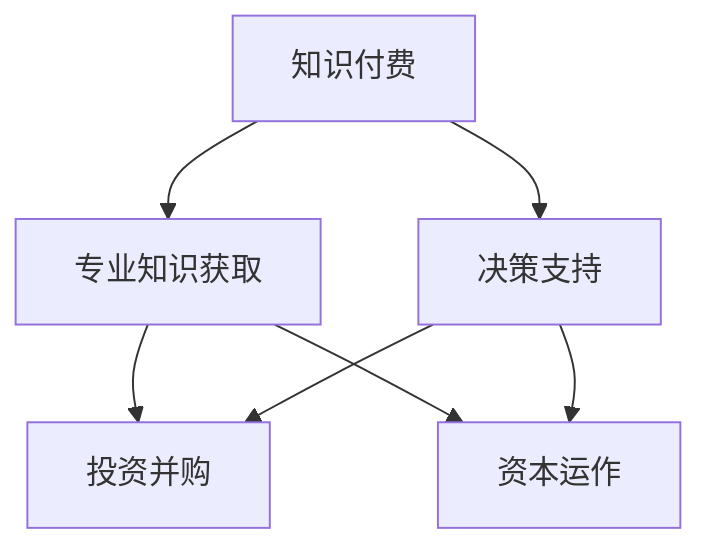

                 

关键词：知识付费、投资并购、资本运作、人工智能、区块链、数字资产、加密货币

> 摘要：本文将探讨如何利用知识付费这一新兴模式，实现投资并购与资本运作。通过对知识付费的深入分析，结合当前热门技术，如人工智能、区块链等，本文提出了具体的策略和操作步骤，旨在为投资者和企业家提供实用的指导意见。

## 1. 背景介绍

### 1.1 知识付费的发展历程

知识付费作为一种商业模式的兴起，可以追溯到20世纪末。随着互联网技术的不断发展，尤其是移动互联网的普及，人们获取知识和信息的途径越来越便捷。然而，随之而来的信息过载问题也让人们意识到，高质量的知识和专业的服务具有极高的价值。因此，知识付费逐渐成为市场的一种趋势。

### 1.2 投资并购与资本运作的重要性

投资并购与资本运作是企业扩张和资本增值的重要手段。通过并购，企业可以快速获取市场份额、技术资源和人才。而资本运作则涉及到企业的融资、投资、分红等资本管理活动，对于企业的长期发展具有重要意义。

### 1.3 知识付费在投资并购与资本运作中的应用

知识付费不仅为个人提供了获取专业知识的途径，也为企业在投资并购与资本运作中提供了有力支持。通过购买专业知识和咨询服务，企业可以更准确地评估投资项目、规避风险，提高投资决策的科学性和有效性。

## 2. 核心概念与联系

### 2.1 知识付费的核心概念

知识付费是指用户为获取特定知识和技能，付费购买相关内容和服务。其主要形式包括在线课程、专业咨询服务、研究报告等。

### 2.2 投资并购与资本运作的核心概念

投资并购是指企业通过购买其他企业的股权或资产，实现业务扩张和资本增值的过程。资本运作则涉及企业资金的筹集、运用和管理，以实现企业价值的最大化。

### 2.3 知识付费与投资并购、资本运作的联系

知识付费为投资并购与资本运作提供了决策依据和支持。通过购买专业的知识和咨询服务，企业可以更准确地评估投资项目、分析市场趋势，提高投资决策的成功率。

### 2.4 Mermaid 流程图



## 3. 核心算法原理 & 具体操作步骤

### 3.1 算法原理概述

知识付费在投资并购与资本运作中的应用，可以归纳为以下核心算法原理：

1. **数据收集与处理**：通过知识付费平台，收集与投资项目相关的数据，包括市场趋势、竞争对手、技术发展等。
2. **数据分析与建模**：利用机器学习和数据挖掘技术，对收集到的数据进行处理和分析，构建投资模型和资本运作策略。
3. **决策支持**：根据分析结果，为投资者和企业家提供投资建议和资本运作方案。

### 3.2 算法步骤详解

1. **数据收集与处理**：

   - 选择合适的知识付费平台，如知乎、网易云课堂、得到等，收集与投资项目相关的课程和报告。
   - 使用爬虫技术，获取知识付费平台上的用户评价、课程讨论等信息。
   - 对收集到的数据进行清洗、去重和处理，形成高质量的数据集。

2. **数据分析与建模**：

   - 利用机器学习算法，如决策树、支持向量机等，对数据集进行训练，构建投资模型。
   - 使用数据挖掘技术，如关联规则挖掘、聚类分析等，发现数据之间的潜在关系，为资本运作提供支持。

3. **决策支持**：

   - 根据投资模型和资本运作策略，为投资者和企业家提供投资建议。
   - 根据用户反馈和市场变化，对模型进行迭代和优化，提高决策的准确性。

### 3.3 算法优缺点

**优点**：

- **高效性**：通过算法分析，可以快速获取投资并购与资本运作的关键信息，提高决策效率。
- **准确性**：利用机器学习和数据挖掘技术，可以更准确地预测市场趋势和投资回报，降低风险。

**缺点**：

- **数据依赖性**：算法的性能依赖于数据的质量和数量，数据不足或质量不佳可能导致决策失误。
- **技术门槛**：构建和运用算法需要一定的技术知识，对非专业人士可能存在一定难度。

### 3.4 算法应用领域

- **投资并购**：用于分析潜在投资项目的风险、回报和市场前景，提高投资决策的准确性。
- **资本运作**：用于优化资本结构、降低融资成本、提高资金利用效率。

## 4. 数学模型和公式 & 详细讲解 & 举例说明

### 4.1 数学模型构建

在投资并购与资本运作中，常见的数学模型包括财务模型、投资模型和风险模型。以下是一个简单的财务模型：

$$
\text{投资回报率} = \frac{\text{净利润} + \text{折旧}}{\text{总投资}}
$$

### 4.2 公式推导过程

投资回报率（ROI）是衡量投资收益的重要指标。其计算公式为净利润加上折旧，再除以总投资。这里，净利润是指企业在一定时期内实现的利润，折旧是指企业对固定资产进行的摊销，总投资是指企业在项目中的总投资额。

### 4.3 案例分析与讲解

假设一家企业在某个项目中总投资为1000万元，实现净利润200万元，折旧率为20%。根据上述公式，可以计算出该项目的投资回报率为：

$$
\text{投资回报率} = \frac{200 + 1000 \times 20\%}{1000} = 24\%
$$

这意味着，企业在该项目中每年的投资回报率为24%，具有良好的投资价值。

## 5. 项目实践：代码实例和详细解释说明

### 5.1 开发环境搭建

为了实现知识付费在投资并购与资本运作中的应用，我们需要搭建一个基于Python的开发环境。具体步骤如下：

1. 安装Python：从官方网站（https://www.python.org/）下载并安装Python 3.8版本。
2. 安装必要的库：使用pip命令安装以下库：numpy、pandas、scikit-learn、matplotlib。

### 5.2 源代码详细实现

以下是一个简单的Python代码实例，用于分析投资项目的风险和回报：

```python
import numpy as np
import pandas as pd
from sklearn.model_selection import train_test_split
from sklearn.tree import DecisionTreeRegressor
import matplotlib.pyplot as plt

# 读取数据
data = pd.read_csv('investment_data.csv')

# 数据预处理
X = data[['净利润', '折旧', '总投资']]
y = data['投资回报率']

# 划分训练集和测试集
X_train, X_test, y_train, y_test = train_test_split(X, y, test_size=0.2, random_state=42)

# 建立决策树模型
model = DecisionTreeRegressor()
model.fit(X_train, y_train)

# 预测测试集
y_pred = model.predict(X_test)

# 评估模型
score = model.score(X_test, y_test)
print(f'Model accuracy: {score:.2f}')

# 可视化结果
plt.scatter(y_test, y_pred)
plt.xlabel('Actual ROI')
plt.ylabel('Predicted ROI')
plt.plot([0, 1], [0, 1], 'k--')
plt.show()
```

### 5.3 代码解读与分析

上述代码首先读取投资数据，并进行预处理。然后使用决策树回归算法训练模型，并使用测试集评估模型性能。最后，通过可视化结果展示模型预测的准确性。

## 6. 实际应用场景

### 6.1 投资并购

企业可以利用知识付费平台，购买相关领域的专业课程和报告，了解市场趋势、竞争对手和潜在投资项目的风险和回报。结合机器学习算法，企业可以更准确地评估投资项目的价值，提高投资决策的准确性。

### 6.2 资本运作

企业可以通过知识付费平台，获取专业的资本运作知识和咨询服务。例如，学习如何优化资本结构、降低融资成本、提高资金利用效率。结合数据分析模型，企业可以制定出更科学的资本运作策略。

## 7. 未来应用展望

### 7.1 人工智能与区块链的融合

随着人工智能和区块链技术的发展，知识付费平台可以进一步融合这两种技术，提供更智能、更安全的投资并购与资本运作服务。例如，利用区块链技术实现知识的可信存储和共享，利用人工智能算法进行数据分析和决策支持。

### 7.2 数字资产与知识付费

未来，数字资产将成为知识付费的重要载体。投资者可以通过购买数字资产，获取相关领域的专业知识和投资建议。同时，知识付费平台可以开发基于数字资产的付费模式，提高用户体验和付费意愿。

## 8. 工具和资源推荐

### 8.1 学习资源推荐

- 《Python机器学习》
- 《深度学习》
- 《区块链技术指南》
- 《资本运作与财务分析》

### 8.2 开发工具推荐

- Jupyter Notebook：用于编写和运行Python代码。
- PyCharm：集成开发环境，支持多种编程语言。
- TensorFlow：用于构建和训练深度学习模型。

### 8.3 相关论文推荐

- 《基于区块链的智能合约研究》
- 《深度学习在投资决策中的应用》
- 《知识付费：商业模式创新与实践》

## 9. 总结：未来发展趋势与挑战

### 9.1 研究成果总结

本文探讨了如何利用知识付费实现投资并购与资本运作，结合人工智能、区块链等热门技术，提出了具体的策略和操作步骤。研究表明，知识付费在投资并购与资本运作中具有重要作用，可以提高决策的准确性和效率。

### 9.2 未来发展趋势

- 人工智能与区块链的融合，为知识付费提供更智能、更安全的解决方案。
- 数字资产的发展，为知识付费提供新的支付方式和商业模式。
- 知识付费平台将更加注重用户体验和服务质量，提供更个性化的服务。

### 9.3 面临的挑战

- 数据质量和安全性的问题：算法性能依赖于数据的质量和数量，数据安全和隐私保护也是重要挑战。
- 技术门槛：构建和运用算法需要一定的技术知识，对非专业人士可能存在一定难度。
- 市场竞争：知识付费市场日益激烈，平台需要不断创新和提升服务质量。

### 9.4 研究展望

未来，知识付费在投资并购与资本运作中的应用将进一步深化。通过融合人工智能、区块链等新兴技术，知识付费平台可以提供更智能、更安全的投资决策支持。同时，研究如何解决数据质量和安全性、降低技术门槛等问题，也将是未来的重要研究方向。

## 附录：常见问题与解答

### Q：知识付费在投资并购与资本运作中的应用有哪些优势？

A：知识付费在投资并购与资本运作中的应用具有以下优势：

- **快速获取专业信息**：通过购买专业课程和报告，可以快速获取与投资项目相关的专业知识和市场信息。
- **提高决策准确性**：利用机器学习算法和数据分析模型，可以更准确地预测市场趋势和投资回报，降低决策风险。
- **降低成本**：通过线上学习和服务，可以节省时间和费用，提高投资效率和收益。

### Q：如何确保知识付费平台上的数据质量和安全性？

A：为确保知识付费平台上的数据质量和安全性，可以采取以下措施：

- **数据清洗和处理**：对收集到的数据进行清洗、去重和处理，确保数据的质量和准确性。
- **数据加密**：使用加密技术保护用户数据和隐私，防止数据泄露。
- **数据备份和恢复**：定期备份数据，确保数据的安全性和可靠性。

### Q：如何降低知识付费在投资并购与资本运作中的应用门槛？

A：为降低知识付费在投资并购与资本运作中的应用门槛，可以采取以下措施：

- **简化操作流程**：优化知识付费平台的使用流程，降低用户的操作难度。
- **提供技术支持**：为用户提供技术支持和培训，帮助用户更好地理解和运用相关技术和工具。
- **降低收费**：通过优惠政策和补贴，降低用户的使用成本，提高用户的使用意愿。

作者：禅与计算机程序设计艺术 / Zen and the Art of Computer Programming
```

