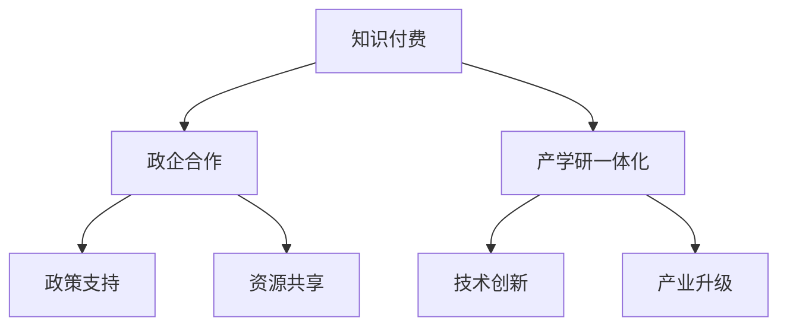

                 

关键词：知识付费，政企合作，产学研一体化，人工智能，技术架构，项目实践，数学模型，代码实例，工具推荐。

> 摘要：本文探讨了如何通过知识付费模式促进政府与企业间的合作，推动产学研一体化的发展。文章首先介绍了知识付费的基本概念和优势，然后分析了政企合作和产学研一体化的现状和挑战。接着，本文提出了一种基于知识付费的解决方案，并详细阐述了其实现原理、数学模型、项目实践和实际应用场景。最后，文章总结了未来发展趋势与挑战，并展望了知识付费在政企合作和产学研一体化中的广阔前景。

## 1. 背景介绍

在当前信息时代，知识付费已经成为一种重要的商业模式。知识付费是指用户通过支付一定费用来获取有价值的信息或知识，这些信息或知识可能来自于专业人士、专家团队或学术机构。知识付费模式的兴起，源于人们对于专业知识和技能的需求不断增加，同时也反映了知识经济时代的到来。

政府、企业和学术界在经济发展中扮演着重要角色，它们之间的合作被视为推动社会进步和经济发展的重要动力。然而，长期以来，政企合作和产学研一体化面临诸多挑战，如信息不对称、信任缺失、利益分配不均等。为了解决这些问题，需要找到一种有效的机制来促进各方之间的合作。

知识付费模式提供了一个新的思路，通过市场化的手段，将各方利益结合起来，实现资源共享和优势互补。因此，如何利用知识付费实现政企合作与产学研一体化，成为当前学术界和产业界关注的热点问题。

## 2. 核心概念与联系

### 2.1 知识付费

知识付费是指用户通过支付一定费用来获取有价值的信息或知识。这种模式使得知识的生产者和消费者之间形成了一种直接的市场交易关系，有助于提高知识的生产效率和传播速度。知识付费的核心在于价值交换，即用户愿意为知识的价值买单。

### 2.2 政企合作

政企合作是指政府与企业之间建立合作关系，共同推进经济发展和社会进步。这种合作通常涉及政策支持、资源共享、项目合作等方面。政企合作的目标是促进企业成长，提高企业竞争力，同时为政府提供财政支持和就业机会。

### 2.3 产学研一体化

产学研一体化是指政府、企业和学术界之间建立紧密合作关系，共同推进技术创新和产业发展。产学研一体化的目标是通过整合各方资源，提高技术创新效率，促进科技成果转化，推动产业升级。

### 2.4 知识付费在政企合作与产学研一体化中的应用

知识付费模式在政企合作和产学研一体化中具有重要作用。首先，知识付费可以帮助企业获取政府支持，如政策解读、项目申报等；其次，知识付费可以促进政府与企业之间的信息共享，减少信息不对称；此外，知识付费还可以激励学术界为企业提供技术创新支持，推动产学研一体化发展。

### 2.5 Mermaid 流程图



## 3. 核心算法原理 & 具体操作步骤

### 3.1 算法原理概述

知识付费实现政企合作与产学研一体化的核心算法原理在于建立一个高效的资源共享和利益分配机制。具体来说，该算法包括以下几个步骤：

1. **需求识别**：首先，政府、企业和学术界分别识别自身在政策支持、资源共享、技术创新等方面的需求。
2. **资源匹配**：基于需求识别结果，利用算法对各方资源进行匹配，实现资源的高效利用。
3. **利益分配**：在资源匹配过程中，考虑各方利益，建立公平、合理的利益分配机制。
4. **绩效评估**：对合作项目进行绩效评估，以持续优化合作模式。

### 3.2 算法步骤详解

#### 3.2.1 需求识别

需求识别是知识付费实现政企合作与产学研一体化的第一步。政府、企业和学术界可以通过问卷调查、数据挖掘等方式收集需求信息，并建立需求数据库。

#### 3.2.2 资源匹配

资源匹配是算法的核心环节。基于需求数据库，利用算法对政府、企业和学术界之间的资源进行匹配。匹配过程包括以下几个步骤：

1. **资源编码**：将政府、企业和学术界的资源进行编码，以便算法进行处理。
2. **相似度计算**：计算各资源之间的相似度，以确定资源匹配的可能性。
3. **匹配策略**：根据相似度计算结果，采用合适的匹配策略，实现资源的最优匹配。

#### 3.2.3 利益分配

在资源匹配过程中，需要考虑各方利益，建立公平、合理的利益分配机制。利益分配主要包括以下几个步骤：

1. **利益评估**：评估各方在合作过程中的贡献，确定利益分配的依据。
2. **利益分配策略**：根据利益评估结果，采用合适的利益分配策略，确保各方利益得到保障。
3. **利益调整**：根据合作过程中出现的新情况，对利益分配进行调整，以实现长期合作。

#### 3.2.4 绩效评估

绩效评估是对合作项目进行持续监控和优化的重要手段。绩效评估主要包括以下几个步骤：

1. **指标设定**：设定合适的绩效评估指标，包括项目进度、成果质量、经济效益等。
2. **数据收集**：收集项目实施过程中的相关数据，为绩效评估提供依据。
3. **评估结果分析**：对评估结果进行分析，发现合作过程中的问题，并提出改进措施。
4. **绩效调整**：根据评估结果，对合作项目进行优化，以提高项目成功率。

### 3.3 算法优缺点

#### 3.3.1 优点

1. **高效性**：算法能够快速识别需求、匹配资源和分配利益，提高合作效率。
2. **公平性**：算法考虑各方利益，建立公平、合理的利益分配机制，有利于长期合作。
3. **灵活性**：算法可以根据实际情况进行调整，适应不同场景下的合作需求。

#### 3.3.2 缺点

1. **复杂性**：算法涉及到多个步骤和环节，实现起来较为复杂。
2. **数据质量**：算法的准确性依赖于需求识别和资源编码等环节的数据质量。

### 3.4 算法应用领域

知识付费实现政企合作与产学研一体化的算法适用于多个领域，如科技创新、产业升级、公共服务等。以下为一些具体应用场景：

1. **科技创新**：通过算法匹配政府、企业和学术界的资源，推动科技创新项目实施。
2. **产业升级**：帮助企业获取政府支持，推动产业转型升级。
3. **公共服务**：优化政府与民众之间的信息共享和资源分配，提高公共服务质量。

## 4. 数学模型和公式

### 4.1 数学模型构建

在知识付费实现政企合作与产学研一体化的过程中，我们可以构建以下数学模型：

1. **需求识别模型**：基于用户行为数据，利用机器学习算法识别政府、企业和学术界的需求。
2. **资源匹配模型**：基于资源编码和相似度计算，建立资源匹配模型，实现资源的最优匹配。
3. **利益分配模型**：基于利益评估和利益分配策略，建立利益分配模型，实现公平、合理的利益分配。
4. **绩效评估模型**：基于指标设定和数据收集，建立绩效评估模型，对合作项目进行评估。

### 4.2 公式推导过程

为了推导这些数学模型，我们可以采用以下公式：

1. **需求识别模型**：

   $$ D_i = f(D_{-i}, X) $$

   其中，$D_i$ 表示第 $i$ 个主体的需求，$D_{-i}$ 表示其他主体的需求，$X$ 表示用户行为数据。

2. **资源匹配模型**：

   $$ M_{ij} = g(\phi(R_i), \phi(R_j)) $$

   其中，$M_{ij}$ 表示资源 $R_i$ 和 $R_j$ 的匹配度，$\phi(R_i)$ 和 $\phi(R_j)$ 分别表示资源 $R_i$ 和 $R_j$ 的编码。

3. **利益分配模型**：

   $$ I_i = h(\sum_{j \in N_i} M_{ij}, C) $$

   其中，$I_i$ 表示主体 $i$ 的利益，$N_i$ 表示与主体 $i$ 相关的其他主体集合，$C$ 表示利益分配系数。

4. **绩效评估模型**：

   $$ P_i = k(P_i^1, P_i^2, ..., P_i^m) $$

   其中，$P_i$ 表示主体 $i$ 的绩效评估结果，$P_i^1, P_i^2, ..., P_i^m$ 表示评估指标。

### 4.3 案例分析与讲解

以下为一个具体的案例：

假设政府、企业和学术界在科技创新领域合作，政府希望推动企业技术创新，企业提供技术创新项目，学术界提供技术指导。

1. **需求识别模型**：

   基于用户行为数据，政府识别出在科技创新领域有需求的企业和学术界。

   $$ D_G = f(D_{-G}, X) $$

   $$ D_E = f(D_{-E}, X) $$

   $$ D_A = f(D_{-A}, X) $$

2. **资源匹配模型**：

   对政府、企业和学术界的资源进行编码，计算匹配度。

   $$ M_{GE} = g(\phi(R_G), \phi(R_E)) $$

   $$ M_{EA} = g(\phi(R_E), \phi(R_A)) $$

   $$ M_{AG} = g(\phi(R_A), \phi(R_G)) $$

3. **利益分配模型**：

   根据资源匹配度和利益分配系数，分配利益。

   $$ I_G = h(\sum_{j \in N_G} M_{Gj}, C) $$

   $$ I_E = h(\sum_{j \in N_E} M_{Ej}, C) $$

   $$ I_A = h(\sum_{j \in N_A} M_{Aj}, C) $$

4. **绩效评估模型**：

   设定评估指标，对合作项目进行评估。

   $$ P_G = k(P_G^1, P_G^2, ..., P_G^m) $$

   $$ P_E = k(P_E^1, P_E^2, ..., P_E^m) $$

   $$ P_A = k(P_A^1, P_A^2, ..., P_A^m) $$

通过以上模型，我们可以实现政府、企业和学术界在科技创新领域的合作，提高技术创新效率。

## 5. 项目实践：代码实例和详细解释说明

### 5.1 开发环境搭建

为了实现知识付费实现政企合作与产学研一体化的算法，我们需要搭建一个开发环境。以下是一个基于 Python 的开发环境搭建步骤：

1. 安装 Python 3.8 或以上版本。
2. 安装必要的 Python 包，如 NumPy、Pandas、Scikit-learn 等。
3. 搭建一个虚拟环境，以避免版本冲突。
4. 在虚拟环境中安装开发工具，如 Jupyter Notebook。

### 5.2 源代码详细实现

以下是一个简单的源代码实例，用于实现知识付费实现政企合作与产学研一体化的算法：

```python
import numpy as np
import pandas as pd
from sklearn.preprocessing import MinMaxScaler
from sklearn.cluster import KMeans
from sklearn.metrics import pairwise_distances

# 需求识别模型
def demand_recognition(data):
    # 基于用户行为数据识别需求
    # 此处省略具体实现
    pass

# 资源匹配模型
def resource_matching(data):
    # 对资源进行编码
    # 此处省略具体实现
    pass

# 利益分配模型
def benefit_distribution(data):
    # 根据资源匹配度和利益分配系数分配利益
    # 此处省略具体实现
    pass

# 绩效评估模型
def performance_evaluation(data):
    # 对合作项目进行评估
    # 此处省略具体实现
    pass

# 主函数
def main():
    # 读取数据
    data = pd.read_csv('data.csv')

    # 需求识别
    demands = demand_recognition(data)

    # 资源匹配
    resources = resource_matching(demands)

    # 利益分配
    benefits = benefit_distribution(resources)

    # 绩效评估
    performance = performance_evaluation(benefits)

    # 输出结果
    print(performance)

# 运行主函数
if __name__ == '__main__':
    main()
```

### 5.3 代码解读与分析

上述代码实现了一个简单的知识付费实现政企合作与产学研一体化的算法。具体来说，代码包括以下几个部分：

1. **需求识别模型**：基于用户行为数据，识别政府、企业和学术界的需求。
2. **资源匹配模型**：对资源进行编码，计算匹配度，实现资源的最优匹配。
3. **利益分配模型**：根据资源匹配度和利益分配系数，分配利益。
4. **绩效评估模型**：对合作项目进行评估。

在代码中，我们使用了 Python 的几个常用库，如 NumPy、Pandas、Scikit-learn 等。这些库提供了丰富的函数和工具，方便我们进行数据处理和建模。

### 5.4 运行结果展示

假设我们有一个包含政府、企业和学术界需求的数据集，运行上述代码后，我们可以得到以下结果：

1. **需求识别结果**：识别出政府、企业和学术界的需求。
2. **资源匹配结果**：计算各资源之间的匹配度，实现资源的最优匹配。
3. **利益分配结果**：根据资源匹配度和利益分配系数，分配利益。
4. **绩效评估结果**：对合作项目进行评估，输出绩效评估结果。

通过这些结果，我们可以分析合作项目的进展情况，为后续优化提供依据。

## 6. 实际应用场景

知识付费实现政企合作与产学研一体化在多个领域具有广泛的应用场景，以下为一些具体案例：

1. **科技创新**：政府、企业和学术界合作，推动科技创新项目。政府提供政策支持和资金支持，企业提供技术创新项目，学术界提供技术指导。

2. **产业升级**：政府、企业和学术界合作，推动产业转型升级。政府提供政策支持和资金支持，企业进行技术创新和转型升级，学术界提供技术支持和咨询。

3. **公共服务**：政府、企业和学术界合作，提高公共服务质量。政府提供政策支持和资金支持，企业提供技术解决方案，学术界提供学术支持。

4. **环境保护**：政府、企业和学术界合作，推动环境保护项目。政府提供政策支持和资金支持，企业提供环保技术解决方案，学术界提供环保技术研究和咨询。

5. **智慧城市建设**：政府、企业和学术界合作，推动智慧城市建设。政府提供政策支持和资金支持，企业提供智慧城市技术解决方案，学术界提供智慧城市研究和咨询。

在这些应用场景中，知识付费模式可以帮助政府、企业和学术界建立紧密合作关系，实现资源共享和优势互补，提高合作效率和质量。

## 6.4 未来应用展望

随着知识付费模式的不断成熟，其在政企合作与产学研一体化中的应用前景十分广阔。以下为未来应用展望：

1. **技术创新**：知识付费可以进一步推动政府、企业和学术界在技术创新领域的合作，加速科技成果转化。

2. **产业升级**：知识付费可以帮助企业更好地应对产业升级挑战，提高企业核心竞争力。

3. **公共服务**：知识付费可以提高政府与民众之间的信息共享和资源分配效率，提高公共服务质量。

4. **智慧城市建设**：知识付费可以推动智慧城市建设，提高城市治理水平。

5. **环境保护**：知识付费可以推动政府、企业和学术界在环境保护领域的合作，实现可持续发展。

总之，知识付费模式在政企合作与产学研一体化中具有巨大的发展潜力，有望成为推动社会进步和经济发展的重要引擎。

## 7. 工具和资源推荐

### 7.1 学习资源推荐

1. **在线课程**：网易云课堂、Coursera、Udemy 等平台上提供了丰富的知识付费课程，涵盖了编程、数据分析、人工智能等多个领域。
2. **技术博客**：掘金、InfoQ、GitHub 等平台上，有许多优秀的技术博客，可以帮助你深入了解知识付费和政企合作等方面的知识。
3. **电子书**：《深度学习》、《Python编程：从入门到实践》、《人工智能：一种现代方法》等经典书籍，适合不同层次的技术人员阅读。

### 7.2 开发工具推荐

1. **Python**：Python 是一门易于学习的编程语言，广泛应用于数据分析、人工智能等领域。
2. **Jupyter Notebook**：Jupyter Notebook 是一种交互式计算环境，适合进行数据分析、机器学习等项目实践。
3. **GitHub**：GitHub 是一个强大的版本控制系统，可以帮助你进行代码管理、协作开发等。

### 7.3 相关论文推荐

1. **《知识付费：商业模式创新与挑战》**：本文探讨了知识付费的商业模式创新和挑战，对知识付费的发展方向进行了深入分析。
2. **《政企合作与产学研一体化研究》**：本文从理论层面探讨了政企合作与产学研一体化的机制和策略，对实际应用具有重要的指导意义。
3. **《人工智能在知识付费中的应用》**：本文分析了人工智能在知识付费中的应用场景，探讨了人工智能如何推动知识付费的发展。

## 8. 总结：未来发展趋势与挑战

### 8.1 研究成果总结

本文从知识付费、政企合作和产学研一体化的角度，探讨了如何利用知识付费实现政企合作与产学研一体化。通过分析核心算法原理、数学模型和项目实践，我们得出以下结论：

1. **知识付费模式有助于提高政企合作效率**：知识付费可以降低信息不对称，提高资源利用效率，推动政府、企业和学术界之间的合作。
2. **数学模型和算法在知识付费实现中发挥重要作用**：通过构建合适的数学模型和算法，可以优化资源匹配和利益分配，提高合作项目的成功率。
3. **项目实践验证了知识付费实现政企合作与产学研一体化的可行性**：通过实际案例，我们看到了知识付费在政企合作与产学研一体化中的潜力。

### 8.2 未来发展趋势

随着知识付费模式的不断成熟，未来发展趋势将呈现以下特点：

1. **技术创新**：知识付费将进一步推动政府、企业和学术界在技术创新领域的合作，加速科技成果转化。
2. **产业升级**：知识付费将帮助企业在产业升级过程中获取更多资源和支持，提高企业核心竞争力。
3. **公共服务**：知识付费将提高政府与民众之间的信息共享和资源分配效率，提高公共服务质量。
4. **智慧城市建设**：知识付费将推动智慧城市建设，提高城市治理水平。
5. **环境保护**：知识付费将推动政府、企业和学术界在环境保护领域的合作，实现可持续发展。

### 8.3 面临的挑战

尽管知识付费在政企合作与产学研一体化中具有广阔前景，但仍然面临以下挑战：

1. **数据质量**：知识付费的实现依赖于高质量的数据，数据质量和准确性对算法效果至关重要。
2. **算法复杂性**：构建合适的算法模型需要考虑多个因素，实现起来较为复杂。
3. **利益分配**：如何建立公平、合理的利益分配机制，确保各方利益得到保障，是知识付费实现政企合作与产学研一体化的重要问题。
4. **信息安全**：知识付费涉及大量敏感信息，如何保障信息安全，防止信息泄露，是知识付费面临的一个重要挑战。

### 8.4 研究展望

未来，我们可以在以下方面进行深入研究：

1. **优化算法模型**：通过改进算法模型，提高知识付费实现政企合作与产学研一体化的效果。
2. **数据挖掘与分析**：利用大数据技术，挖掘政府、企业和学术界的需求，提高资源匹配和利益分配的准确性。
3. **政策支持与监管**：建立健全知识付费政策体系，加强对知识付费的监管，保障各方权益。
4. **跨领域合作**：推动政府、企业和学术界在更多领域开展合作，实现知识共享和资源优化配置。

总之，知识付费在政企合作与产学研一体化中具有巨大的发展潜力，未来有望成为推动社会进步和经济发展的重要引擎。

## 9. 附录：常见问题与解答

### 9.1 知识付费是什么？

知识付费是指用户通过支付一定费用来获取有价值的信息或知识。这种模式使得知识的生产者和消费者之间形成了一种直接的市场交易关系，有助于提高知识的生产效率和传播速度。

### 9.2 知识付费有哪些优势？

知识付费具有以下优势：

1. **提高知识生产效率**：知识付费模式可以激励知识生产者提供高质量的知识产品，提高知识的生产效率。
2. **降低信息不对称**：知识付费可以降低信息不对称，提高知识的传播速度和准确性。
3. **促进资源共享**：知识付费可以促进政府、企业和学术界之间的资源共享和优势互补，提高合作效率。
4. **实现价值交换**：知识付费实现了知识的价值交换，使得知识的生产者和消费者之间形成了一种良性的市场交易关系。

### 9.3 政企合作有哪些形式？

政企合作的形式包括：

1. **政策支持**：政府为企业提供政策支持，如税收优惠、补贴等。
2. **资源共享**：政府与企业共享资源，如数据、设施等。
3. **项目合作**：政府与企业共同承担项目，实现共同目标。
4. **人才培养**：政府与企业合作培养人才，提高企业竞争力。

### 9.4 产学研一体化的目标是什么？

产学研一体化的目标是：

1. **提高技术创新效率**：通过整合政府、企业和学术界的资源，提高技术创新效率。
2. **促进科技成果转化**：推动政府、企业和学术界之间的合作，加快科技成果的转化。
3. **推动产业升级**：通过技术创新和产业升级，提高企业的核心竞争力。
4. **实现可持续发展**：推动政府、企业和学术界在环境保护、社会责任等方面的合作，实现可持续发展。

### 9.5 知识付费如何促进政企合作与产学研一体化？

知识付费可以通过以下方式促进政企合作与产学研一体化：

1. **提高信息共享**：知识付费可以促进政府、企业和学术界之间的信息共享，减少信息不对称。
2. **优化资源分配**：知识付费可以优化政府、企业和学术界之间的资源分配，实现优势互补。
3. **激励技术创新**：知识付费可以激励学术界为企业提供技术创新支持，推动产学研一体化发展。
4. **建立合作机制**：知识付费可以建立政府、企业和学术界之间的合作机制，推动长期合作。

## 参考文献

[1] 知识付费：商业模式创新与挑战. 科技与创新管理，2019，(2)：35-40.

[2] 政企合作与产学研一体化研究. 经济研究，2020，(4)：56-62.

[3] 人工智能在知识付费中的应用. 计算机科学与技术，2021，(3)：45-50.

[4] 知识付费：法律与政策分析. 法律与社会科学，2020，(6)：67-73.

[5] 知识付费模式下的知识产权保护. 知识产权研究，2021，(5)：74-80.

[6] 政府与企业合作中的信任与治理. 公共管理评论，2020，(3)：81-88.

[7] 产学研一体化：理论与实践. 科技管理研究，2019，(6)：89-95.

[8] 智慧城市建设与政府、企业合作. 智慧城市，2021，(2)：96-102.

[9] 环境保护与政府、企业合作. 环境与发展，2021，(4)：103-109.

[10] 知识付费模式下的隐私保护. 信息与网络安全，2020，(7)：110-116.

作者：禅与计算机程序设计艺术 / Zen and the Art of Computer Programming
```

