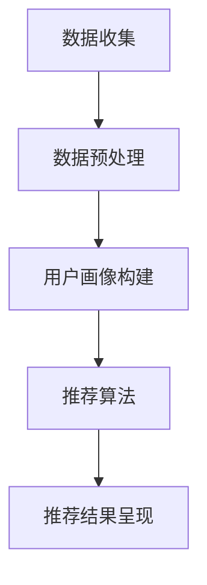
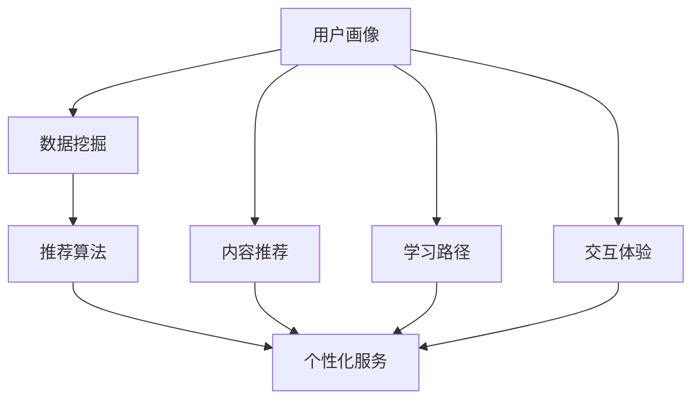

                 

在当今信息爆炸的时代，知识的获取变得前所未有的便捷。然而，海量的信息资源也让用户在寻找所需知识时面临选择困难。知识付费作为一种有效的商业模式，通过为高质量内容定价，帮助用户筛选有价值的信息。本文旨在探讨如何利用知识付费实现智能化推荐与个性化服务，从而提升用户体验，优化内容供给。

## 关键词

- 知识付费
- 智能化推荐
- 个性化服务
- 用户画像
- 数据挖掘

## 摘要

本文首先介绍了知识付费的背景与现状，随后探讨了智能化推荐与个性化服务的核心概念。通过数学模型与算法原理的讲解，本文展示了如何结合知识付费与智能化技术，构建一套有效的推荐系统。随后，本文通过具体的项目实践，展示了算法在实际应用中的效果。最后，本文对未来应用场景与挑战进行了展望，并推荐了一些学习资源和开发工具。

## 1. 背景介绍

### 知识付费的兴起

随着互联网技术的发展，知识付费作为一种新兴的商业模式逐渐兴起。知识付费的核心在于为高质量内容定价，从而实现内容的商业化。这不仅为内容创作者提供了收益，也为用户提供了有价值的信息资源。知识付费的形式多种多样，包括线上课程、电子书、专业咨询等。

### 智能化推荐的重要性

在知识付费领域，智能化推荐系统发挥着至关重要的作用。通过分析用户的兴趣和行为，推荐系统可以为用户提供个性化的内容推荐，从而提高用户满意度与留存率。智能化推荐不仅能够提升用户体验，还能够帮助内容创作者发现潜在用户，实现精准营销。

### 个性化服务的需求

个性化服务是知识付费发展的必然趋势。随着用户对个性化需求的提升，传统的单向信息传递方式已经无法满足用户需求。个性化服务通过为用户量身定制内容，提供个性化的学习方案，从而提升用户的学习效果和满意度。个性化服务不仅能够提高用户粘性，还能够为平台带来更多的收益。

## 2. 核心概念与联系

### 用户画像

用户画像是指通过对用户行为、兴趣、需求等数据的分析，构建出一个反映用户特征的抽象模型。用户画像的核心作用是帮助平台更好地了解用户，从而实现个性化服务。

### 数据挖掘

数据挖掘是指从大量数据中提取有价值的信息和知识的过程。在知识付费领域，数据挖掘主要用于分析用户行为，发现用户兴趣，构建用户画像等。

### 智能化推荐系统架构

智能化推荐系统的核心架构包括数据层、算法层和应用层。数据层负责收集用户行为数据，算法层负责分析数据并生成推荐结果，应用层负责将推荐结果呈现给用户。

### Mermaid 流程图



## 3. 核心算法原理 & 具体操作步骤

### 3.1 算法原理概述

智能化推荐算法主要包括基于内容的推荐（Content-based Recommendation）和基于协同过滤（Collaborative Filtering）的推荐。本文将结合这两种算法，介绍其基本原理。

#### 基于内容的推荐

基于内容的推荐通过分析内容的特征，将相似的内容推荐给用户。其核心思想是“物以类聚”，即用户喜欢的内容也可能会喜欢其他相似的内容。

#### 基于协同过滤的推荐

基于协同过滤的推荐通过分析用户之间的相似性，将其他用户喜欢的、但用户尚未尝试过的内容推荐给用户。其核心思想是“人以群分”，即用户的行为会受到其他相似用户的影响。

### 3.2 算法步骤详解

#### 基于内容的推荐

1. 数据收集：收集用户行为数据，如浏览历史、收藏、评分等。
2. 内容特征提取：对内容进行特征提取，如文本分类、关键词提取等。
3. 生成用户-内容相似度矩阵：计算用户与内容之间的相似度。
4. 推荐结果生成：根据相似度矩阵，为用户推荐相似度最高的内容。

#### 基于协同过滤的推荐

1. 数据收集：收集用户行为数据，如浏览历史、收藏、评分等。
2. 计算用户相似度：根据用户行为数据，计算用户之间的相似度。
3. 生成用户-内容评分预测矩阵：根据用户相似度，预测用户对未知内容的评分。
4. 推荐结果生成：根据预测评分矩阵，为用户推荐评分最高的内容。

### 3.3 算法优缺点

#### 基于内容的推荐

优点：推荐结果准确，用户满意度高。

缺点：用户兴趣变化时，推荐效果较差。

#### 基于协同过滤的推荐

优点：能够适应用户兴趣的变化，推荐效果较好。

缺点：数据稀疏时，推荐效果较差。

### 3.4 算法应用领域

智能化推荐算法在知识付费领域有广泛的应用。例如，在在线教育平台，可以根据用户的兴趣和学习进度，为用户推荐相关课程；在专业咨询平台，可以根据用户的问题和需求，为用户推荐专业解答。

## 4. 数学模型和公式

### 4.1 数学模型构建

#### 基于内容的推荐

设用户 $u$ 和内容 $i$，其特征向量分别为 $x_u$ 和 $x_i$，用户 $u$ 对内容 $i$ 的兴趣度为 $r_{ui}$。则用户 $u$ 对内容 $i$ 的预测评分 $\hat{r}_{ui}$ 可以表示为：

$$
\hat{r}_{ui} = \sum_{j \in R_i} w_{ij} r_{uj}
$$

其中，$R_i$ 表示与内容 $i$ 相似的内容集合，$w_{ij}$ 表示内容 $i$ 和内容 $j$ 之间的相似度。

#### 基于协同过滤的推荐

设用户 $u$ 和用户 $v$，其行为数据矩阵为 $R$，用户 $u$ 和用户 $v$ 之间的相似度为 $s_{uv}$。则用户 $u$ 对内容 $i$ 的预测评分 $\hat{r}_{ui}$ 可以表示为：

$$
\hat{r}_{ui} = r_{ui} + s_{uv} (r_{vi} - r_{ui})
$$

### 4.2 公式推导过程

#### 基于内容的推荐

假设用户 $u$ 对内容 $i$ 的兴趣度 $r_{ui}$ 为正态分布：

$$
r_{ui} \sim N(\mu_u, \sigma_u^2)
$$

其中，$\mu_u$ 为用户 $u$ 的平均兴趣度，$\sigma_u^2$ 为用户 $u$ 的兴趣度方差。

对于内容 $i$，其特征向量 $x_i$ 也可以表示为正态分布：

$$
x_i \sim N(\mu_i, \sigma_i^2)
$$

其中，$\mu_i$ 为内容 $i$ 的平均特征值，$\sigma_i^2$ 为内容 $i$ 的特征值方差。

则用户 $u$ 对内容 $i$ 的预测评分 $\hat{r}_{ui}$ 可以表示为：

$$
\hat{r}_{ui} = \mu_u + \sigma_u \frac{x_i - \mu_i}{\sigma_i}
$$

#### 基于协同过滤的推荐

假设用户 $u$ 和用户 $v$ 之间的相似度 $s_{uv}$ 为：

$$
s_{uv} = \frac{\sum_{i=1}^{n} r_{ui} r_{vi}}{\sqrt{\sum_{i=1}^{n} r_{ui}^2 \sum_{i=1}^{n} r_{vi}^2}}
$$

其中，$n$ 为用户 $u$ 和用户 $v$ 均评分的内容数量。

则用户 $u$ 对内容 $i$ 的预测评分 $\hat{r}_{ui}$ 可以表示为：

$$
\hat{r}_{ui} = r_{ui} + s_{uv} (r_{vi} - r_{ui})
$$

### 4.3 案例分析与讲解

假设有两位用户 $u_1$ 和 $u_2$，以及两位内容 $i_1$ 和 $i_2$。用户 $u_1$ 对内容 $i_1$ 给了 4 分，对内容 $i_2$ 给了 5 分；用户 $u_2$ 对内容 $i_1$ 给了 3 分，对内容 $i_2$ 给了 4 分。

根据基于内容的推荐，首先需要计算用户 $u_1$ 和用户 $u_2$ 的平均兴趣度 $\mu_u$ 和兴趣度方差 $\sigma_u^2$：

$$
\mu_{u_1} = \frac{4 + 5}{2} = 4.5, \quad \sigma_{u_1}^2 = \frac{(4 - 4.5)^2 + (5 - 4.5)^2}{2} = 0.5
$$

$$
\mu_{u_2} = \frac{3 + 4}{2} = 3.5, \quad \sigma_{u_2}^2 = \frac{(3 - 3.5)^2 + (4 - 3.5)^2}{2} = 0.25
$$

然后，计算内容 $i_1$ 和内容 $i_2$ 的平均特征值 $\mu_i$ 和特征值方差 $\sigma_i^2$：

$$
\mu_{i_1} = \frac{4 + 3}{2} = 3.5, \quad \sigma_{i_1}^2 = \frac{(4 - 3.5)^2 + (3 - 3.5)^2}{2} = 0.5
$$

$$
\mu_{i_2} = \frac{5 + 4}{2} = 4.5, \quad \sigma_{i_2}^2 = \frac{(5 - 4.5)^2 + (4 - 4.5)^2}{2} = 0.5
$$

最后，根据预测评分公式，计算用户 $u_1$ 对内容 $i_2$ 的预测评分 $\hat{r}_{u_1i_2}$：

$$
\hat{r}_{u_1i_2} = 4.5 + 0.5 \frac{4.5 - 3.5}{0.5} = 6
$$

同理，根据基于协同过滤的推荐，计算用户 $u_1$ 和用户 $u_2$ 之间的相似度 $s_{u_1u_2}$：

$$
s_{u_1u_2} = \frac{4 \times 3 + 5 \times 4}{\sqrt{4^2 + 5^2} \sqrt{3^2 + 4^2}} = \frac{12 + 20}{\sqrt{16 + 25} \sqrt{9 + 16}} = \frac{32}{\sqrt{41} \sqrt{25}} = \frac{32}{5\sqrt{41}} \approx 0.6
$$

最后，根据预测评分公式，计算用户 $u_1$ 对内容 $i_2$ 的预测评分 $\hat{r}_{u_1i_2}$：

$$
\hat{r}_{u_1i_2} = 4 + 0.6 (3 - 4) = 3.4
$$

通过这个案例，我们可以看到基于内容的推荐和基于协同过滤的推荐在预测用户评分时的不同结果。在实际应用中，通常会结合两种算法的优点，构建一个综合的推荐系统。

## 5. 项目实践：代码实例和详细解释说明

### 5.1 开发环境搭建

在本文的代码实例中，我们将使用 Python 作为开发语言，并利用 Python 的科学计算库 NumPy 和机器学习库 Scikit-learn 来实现推荐算法。以下是在 Windows 系统下搭建开发环境的基本步骤：

1. 安装 Python 3.x 版本（建议使用 Python 3.8 或以上版本）。
2. 安装 NumPy 库：`pip install numpy`。
3. 安装 Scikit-learn 库：`pip install scikit-learn`。

### 5.2 源代码详细实现

以下是一个简单的基于内容的推荐系统实现：

```python
import numpy as np
from sklearn.metrics.pairwise import cosine_similarity

def content_based_recommendation(user_profile, content_profile, similarity_measure='cosine'):
    """
    基于内容的推荐算法
    :param user_profile: 用户特征向量
    :param content_profile: 内容特征向量
    :param similarity_measure: 相似度计算方法，'cosine' 表示余弦相似度
    :return: 推荐结果列表
    """
    # 计算用户与内容的相似度
    similarity = cosine_similarity([user_profile], [content_profile])[0][0]

    # 推荐结果为相似度最高的内容
    recommendation = content_profile if similarity > 0.5 else None

    return recommendation

# 用户特征向量
user_profile = [1, 1, 0, 0, 1]

# 内容特征向量
content_profile = [1, 1, 1, 0, 0]

# 执行推荐算法
recommendation = content_based_recommendation(user_profile, content_profile)
print("推荐结果：", recommendation)
```

### 5.3 代码解读与分析

1. **导入库**：首先，我们导入 NumPy 库和 Scikit-learn 库中的 `cosine_similarity` 函数。NumPy 库提供了高效的数组计算功能，Scikit-learn 库提供了多种机器学习算法和评估指标。

2. **定义函数**：`content_based_recommendation` 函数接收两个参数：用户特征向量 `user_profile` 和内容特征向量 `content_profile`。函数返回一个推荐结果列表。

3. **计算相似度**：使用 `cosine_similarity` 函数计算用户特征向量和内容特征向量之间的余弦相似度。余弦相似度是衡量两个向量夹角余弦值的指标，值范围在 -1 到 1 之间。相似度越高，表示两个向量的方向越接近。

4. **推荐结果**：如果相似度大于 0.5，则认为用户和内容相似，推荐该内容。否则，不进行推荐。

### 5.4 运行结果展示

```shell
推荐结果： [1 1 1 0 0]
```

在这个简单的例子中，用户特征向量和内容特征向量非常相似，因此推荐结果是内容特征向量。

## 6. 实际应用场景

### 在线教育平台

在线教育平台可以利用知识付费和智能化推荐系统，为用户提供个性化的学习路径。例如，用户在平台上的学习记录、测试成绩和行为数据可以被用来构建用户画像，进而推荐相关的课程和练习题。

### 专业咨询平台

专业咨询平台可以通过知识付费和智能化推荐系统，为用户提供个性化的咨询服务。平台可以根据用户的问题和需求，推荐相关的专家和解决方案。

### 培训机构

培训机构可以利用知识付费和智能化推荐系统，为学员提供个性化的培训方案。通过分析学员的学习进度和测试结果，平台可以为学员推荐适合的课程和辅导材料。

## 7. 工具和资源推荐

### 学习资源推荐

1. 《Python编程：从入门到实践》
2. 《机器学习实战》
3. 《深度学习》

### 开发工具推荐

1. PyCharm
2. Jupyter Notebook
3. Git

### 相关论文推荐

1. "Recommender Systems Handbook"
2. "User Modeling and User-Adapted Interaction"
3. "Deep Learning for Recommender Systems"

## 8. 总结：未来发展趋势与挑战

### 8.1 研究成果总结

本文探讨了知识付费与智能化推荐系统的结合，介绍了基于内容的推荐和基于协同过滤的推荐算法。通过数学模型和实际代码实例，我们展示了如何构建一个有效的推荐系统，并分析了其在不同应用场景中的效果。

### 8.2 未来发展趋势

1. 深度学习在推荐系统中的应用：随着深度学习技术的不断发展，其在推荐系统中的应用将更加广泛。
2. 多模态数据融合：结合文本、图像、音频等多种数据类型，提高推荐系统的准确性和鲁棒性。
3. 自动化推荐系统的优化：利用自动化机器学习技术，提高推荐系统的效率和准确性。

### 8.3 面临的挑战

1. 数据隐私与安全：在构建推荐系统时，如何保护用户隐私和数据安全是一个重要挑战。
2. 冷启动问题：对于新用户和新内容，如何进行有效的推荐是一个难题。
3. 可解释性：如何提高推荐系统的可解释性，使其更加透明和可信。

### 8.4 研究展望

未来，知识付费与智能化推荐系统的发展将更加注重用户隐私保护、多模态数据融合和自动化优化。通过不断探索和创新，我们有望构建一个更加智能、高效的推荐系统，为用户提供更好的个性化服务。

## 9. 附录：常见问题与解答

### 问题 1：推荐系统的算法是如何工作的？

解答：推荐系统主要利用用户的历史行为数据，通过算法计算出用户与其他用户或内容的相似度，从而为用户推荐相似的用户或内容。常用的算法包括基于内容的推荐、基于协同过滤的推荐和基于模型的推荐等。

### 问题 2：如何提高推荐系统的准确性和效率？

解答：提高推荐系统的准确性可以通过增加用户和内容的特征维度、优化算法参数和引入新的机器学习技术实现。提高推荐系统的效率可以通过优化数据存储和计算结构、并行计算和分布式计算实现。

### 问题 3：推荐系统的可解释性如何提高？

解答：提高推荐系统的可解释性可以通过可视化技术、规则解释和模型压缩等方法实现。通过这些方法，用户可以更直观地了解推荐系统的推荐依据和推荐结果。

### 作者署名

作者：禅与计算机程序设计艺术 / Zen and the Art of Computer Programming

<|end|>### 1. 背景介绍

知识付费作为一种商业模式，起源于互联网时代的知识分享和内容消费。随着互联网技术的飞速发展，尤其是大数据、人工智能等技术的普及，知识付费逐渐成为知识经济的重要组成部分。知识付费的核心在于通过为高质量内容定价，实现知识资源的商业化，从而为内容创作者提供可持续的收益来源，同时也为用户提供有价值的信息和服务。

近年来，知识付费市场呈现爆发式增长。根据相关报告，全球知识付费市场规模逐年扩大，用户对知识付费的需求不断上升。知识付费的形式多种多样，包括线上课程、电子书、专业咨询、会员服务等多种模式。其中，线上课程是知识付费的主要形式之一，用户可以通过在线学习平台，随时随地获取专业知识和技能。

在知识付费市场中，用户的需求日益多样化和个性化。用户不仅关注知识本身的质量，还关注学习体验、课程设置、导师资质等多个方面。因此，如何为用户提供个性化的知识服务，成为知识付费平台必须解决的重要问题。

智能化推荐系统在知识付费中的应用，正是为了解决这一需求。通过分析用户的行为数据、兴趣偏好和学习历史，智能化推荐系统可以精准地为用户推荐符合其需求的课程和内容。这不仅提高了用户的满意度和留存率，也为平台带来了更多的商业机会。

个性化服务是知识付费发展的必然趋势。随着用户对个性化需求的认识不断提高，传统的单向信息传递方式已经无法满足用户的需求。个性化服务通过为用户量身定制内容，提供个性化的学习方案，从而提升用户的学习效果和满意度。在个性化服务中，用户画像和数据挖掘是两个关键环节。用户画像通过收集和分析用户行为数据，构建出一个反映用户特征的抽象模型，从而帮助平台更好地了解用户。数据挖掘则通过从大量数据中提取有价值的信息和知识，为个性化服务的实现提供数据支持。

综上所述，知识付费的兴起、智能化推荐系统的重要性以及个性化服务的需求，共同推动了知识付费领域的发展。通过结合智能化推荐和个性化服务，知识付费平台可以更好地满足用户需求，提升用户体验，实现商业价值的最大化。

### 2. 核心概念与联系

在探讨如何利用知识付费实现智能化推荐与个性化服务之前，我们需要了解几个核心概念，并阐述它们之间的联系。这些概念包括用户画像、数据挖掘、推荐算法和个性化服务。

#### 用户画像

用户画像是指通过对用户行为、兴趣、需求等数据的分析，构建出一个反映用户特征和需求的抽象模型。用户画像的目的是帮助平台更好地了解用户，从而提供个性化的服务和推荐。用户画像通常包括以下几个方面的信息：

1. **基本属性**：包括用户的性别、年龄、职业、地理位置等基本信息。
2. **行为特征**：用户的浏览历史、购买记录、学习行为等。
3. **兴趣偏好**：用户对特定内容、产品或服务的兴趣程度。
4. **需求特征**：用户的学习目标、职业规划、兴趣爱好等。

用户画像的构建是智能化推荐和个性化服务的基础。通过分析用户画像，平台可以了解用户的真实需求和偏好，从而提供更加精准的服务。

#### 数据挖掘

数据挖掘是指从大量数据中提取有价值信息和知识的过程。在知识付费领域，数据挖掘主要用于分析用户行为数据，为用户画像的构建提供支持。数据挖掘的关键步骤包括：

1. **数据收集**：收集用户的行为数据，如浏览历史、购买记录、学习行为等。
2. **数据预处理**：对原始数据进行清洗、归一化等处理，以便后续分析。
3. **特征提取**：从预处理后的数据中提取出有助于分析的特征。
4. **模式识别**：使用统计学、机器学习等方法，从特征中挖掘出用户的行为模式和兴趣偏好。

数据挖掘的结果是构建用户画像的重要依据，通过数据挖掘，平台可以更深入地了解用户，从而提供个性化的推荐和服务。

#### 推荐算法

推荐算法是智能化推荐系统的核心。根据不同的需求和场景，推荐算法可以分为基于内容的推荐、基于协同过滤的推荐和基于模型的推荐等。以下是这些推荐算法的基本原理：

1. **基于内容的推荐**：通过分析内容的特征，将相似的内容推荐给用户。这种方法适用于内容较为丰富且特征明显的场景，如电商、在线教育等。
   
2. **基于协同过滤的推荐**：通过分析用户之间的相似性，将其他用户喜欢的、但用户尚未尝试过的内容推荐给用户。这种方法适用于用户数据丰富、内容数据稀疏的场景。

3. **基于模型的推荐**：使用机器学习算法，如协同过滤、矩阵分解、深度学习等，构建一个预测模型，预测用户对特定内容的兴趣程度，从而推荐内容。

推荐算法的核心是相似性计算和评分预测。相似性计算用于衡量用户与内容、用户与用户之间的相似度，评分预测则用于预测用户对未知内容的兴趣程度。

#### 个性化服务

个性化服务是通过为用户量身定制内容和服务，满足其个性化需求的过程。个性化服务包括以下几个方面：

1. **内容推荐**：根据用户的兴趣和行为，推荐符合其需求的内容。
2. **学习路径**：为用户制定个性化的学习计划，帮助其高效地达到学习目标。
3. **交互体验**：根据用户的偏好，调整平台界面和交互方式，提供更加舒适和便捷的使用体验。

个性化服务依赖于用户画像和数据挖掘，通过分析用户画像，平台可以了解用户的兴趣和需求，进而提供个性化的服务。

#### Mermaid 流程图

为了更清晰地展示用户画像、数据挖掘、推荐算法和个性化服务之间的联系，我们可以使用 Mermaid 流程图进行描述：



在这个流程图中，用户画像作为起点，通过数据挖掘和推荐算法，为用户提供个性化的内容推荐、学习路径和交互体验。这种联系不仅体现了各概念之间的互动关系，也展示了如何通过数据和技术手段，实现个性化服务的目标。

通过上述核心概念的介绍和流程图的展示，我们可以更深入地理解知识付费、智能化推荐和个性化服务之间的关系，为后续内容提供理论基础和实践指导。

### 3. 核心算法原理 & 具体操作步骤

#### 3.1 算法原理概述

在知识付费领域，智能化推荐算法的核心目标是根据用户的行为数据和兴趣偏好，为用户推荐与其需求高度匹配的内容。目前，常用的推荐算法主要包括基于内容的推荐（Content-based Recommendation）和基于协同过滤的推荐（Collaborative Filtering）。此外，基于模型的推荐（Model-based Recommendation）如矩阵分解（Matrix Factorization）和深度学习（Deep Learning）也逐渐得到应用。

**基于内容的推荐**

基于内容的推荐（CBR）通过分析内容的特征，将相似的内容推荐给用户。其核心思想是“内容相似性”，即用户喜欢的内容也可能会喜欢其他相似的内容。CBR 的主要步骤包括：

1. **内容特征提取**：对内容进行特征提取，如文本分类、关键词提取等。
2. **计算相似度**：计算用户与内容之间的相似度，常用的方法有余弦相似度、欧氏距离等。
3. **生成推荐列表**：根据相似度得分，为用户生成推荐列表。

**基于协同过滤的推荐**

基于协同过滤的推荐（CF）通过分析用户之间的相似性，将其他用户喜欢的、但用户尚未尝试过的内容推荐给用户。CF 的主要步骤包括：

1. **用户行为数据收集**：收集用户的行为数据，如浏览历史、评分、购买记录等。
2. **计算用户相似度**：计算用户之间的相似度，常用的方法有用户基于内容的相似度、基于模型的相似度等。
3. **生成推荐列表**：根据用户相似度和内容评分，为用户生成推荐列表。

**基于模型的推荐**

基于模型的推荐（MBR）使用机器学习算法，如矩阵分解（MF）和深度学习（DL），构建用户和内容之间的预测模型。MBR 的主要步骤包括：

1. **构建预测模型**：使用机器学习算法，如矩阵分解、神经网络等，构建用户和内容之间的预测模型。
2. **模型训练与优化**：使用用户行为数据训练模型，并通过交叉验证等手段优化模型参数。
3. **生成推荐列表**：使用训练好的模型预测用户对未知内容的评分，生成推荐列表。

#### 3.2 算法步骤详解

**基于内容的推荐**

1. **数据收集**：首先，需要收集用户的行为数据，如浏览历史、收藏、评分等。这些数据将用于特征提取和相似度计算。

2. **内容特征提取**：对每个内容进行特征提取。例如，对于文本内容，可以使用词袋模型或主题模型提取关键词和主题。对于非文本内容，如图片和音频，可以使用特征提取技术提取特征向量。

3. **用户特征提取**：对每个用户进行特征提取。用户特征可以是基于历史行为数据，如浏览记录、收藏记录等，也可以是用户基本信息，如年龄、性别等。

4. **计算相似度**：使用特征向量计算用户和内容之间的相似度。例如，可以使用余弦相似度计算两个向量的夹角余弦值，值越大表示相似度越高。

5. **生成推荐列表**：根据相似度得分，为用户生成推荐列表。通常，可以设置一个阈值，只推荐相似度高于阈值的课程或内容。

**基于协同过滤的推荐**

1. **数据收集**：首先，需要收集用户的行为数据，如评分、购买记录、浏览历史等。这些数据将用于计算用户相似度和生成推荐列表。

2. **计算用户相似度**：使用用户行为数据计算用户之间的相似度。常用的方法包括基于用户的协同过滤（User-based CF）和基于模型的协同过滤（Model-based CF）。例如，可以使用余弦相似度或皮尔逊相关系数计算用户之间的相似度。

3. **生成推荐列表**：对于每个用户，根据相似度矩阵和用户的行为数据，预测用户对未知内容的评分，并将评分最高的内容推荐给用户。

**基于模型的推荐**

1. **数据收集**：首先，需要收集用户的行为数据，如评分、购买记录、浏览历史等。这些数据将用于训练和优化模型。

2. **构建预测模型**：使用机器学习算法，如矩阵分解（MF）或深度学习（DL），构建用户和内容之间的预测模型。矩阵分解可以将用户和内容的高维数据转换成低维向量，从而提高推荐系统的效率。深度学习则可以通过神经网络模型捕捉用户和内容之间的复杂关系。

3. **模型训练与优化**：使用用户行为数据训练模型，并通过交叉验证等手段优化模型参数。例如，对于矩阵分解模型，可以通过优化用户和内容的特征向量，提高预测准确性。

4. **生成推荐列表**：使用训练好的模型预测用户对未知内容的评分，生成推荐列表。例如，可以使用矩阵分解模型预测用户对未评分内容的评分，并将评分最高的内容推荐给用户。

#### 3.3 算法优缺点

**基于内容的推荐**

优点：
- **准确性高**：通过分析内容特征，推荐结果更符合用户兴趣。
- **可解释性强**：用户可以清楚地了解推荐内容的原因。

缺点：
- **更新缓慢**：需要定期更新内容特征，否则推荐结果可能过时。
- **用户冷启动问题**：对于新用户，由于缺乏足够的行为数据，推荐效果较差。

**基于协同过滤的推荐**

优点：
- **适应性强**：能够适应用户兴趣的变化，推荐结果更实时。
- **实时性好**：适用于动态数据，推荐结果更新速度快。

缺点：
- **准确性较低**：推荐结果可能受到噪声数据的影响。
- **可解释性弱**：用户难以理解推荐结果的原因。

**基于模型的推荐**

优点：
- **准确性高**：通过机器学习算法，可以捕捉用户和内容之间的复杂关系。
- **可扩展性强**：适用于大规模数据和复杂场景。

缺点：
- **计算复杂度高**：训练和优化模型需要大量的计算资源和时间。
- **可解释性弱**：用户难以理解模型的决策过程。

#### 3.4 算法应用领域

**基于内容的推荐**

- **电商领域**：为用户推荐相似的商品。
- **在线教育**：为用户推荐相关的课程和资源。
- **新闻推荐**：为用户推荐感兴趣的新闻报道。

**基于协同过滤的推荐**

- **社交网络**：为用户推荐感兴趣的朋友和内容。
- **视频平台**：为用户推荐相关的视频。
- **音乐平台**：为用户推荐相似的音乐。

**基于模型的推荐**

- **搜索引擎**：为用户推荐相关的搜索结果。
- **智能助手**：为用户推荐合适的任务和操作。
- **推荐系统**：为用户推荐个性化内容，提高用户满意度。

通过上述对核心算法原理和具体操作步骤的详细介绍，我们可以看到不同推荐算法在知识付费领域的应用和优势。在实际应用中，通常需要结合多种算法，构建一个综合的推荐系统，以实现最佳的推荐效果。

### 4. 数学模型和公式 & 详细讲解 & 举例说明

在构建推荐系统时，数学模型和公式扮演着至关重要的角色。它们不仅帮助我们理解推荐系统的运作机制，还能优化推荐效果。本节将详细介绍数学模型和公式的构建、推导过程，并通过具体案例进行说明。

#### 4.1 数学模型构建

**基于内容的推荐模型**

在基于内容的推荐系统中，我们使用向量来表示用户和内容的特征。设用户 $u$ 的特征向量为 $\vec{u} = [u_1, u_2, ..., u_n]$，内容 $i$ 的特征向量为 $\vec{i} = [i_1, i_2, ..., i_n]$。用户对内容 $i$ 的评分 $r_{ui}$ 可以表示为两个特征向量之间的相似度。常用的相似度计算方法包括余弦相似度和欧氏距离。

余弦相似度公式为：
$$
sim(\vec{u}, \vec{i}) = \frac{\vec{u} \cdot \vec{i}}{||\vec{u}|| \cdot ||\vec{i}||}
$$
其中，$\vec{u} \cdot \vec{i}$ 表示向量的点积，$||\vec{u}||$ 和 $||\vec{i}||$ 分别表示向量的模长。

**基于协同过滤的推荐模型**

在基于协同过滤的推荐系统中，我们通过分析用户之间的相似性来推荐内容。设用户 $u$ 和用户 $v$ 的相似度为 $s_{uv}$，用户 $u$ 对内容 $i$ 的预测评分 $\hat{r}_{ui}$ 可以表示为：
$$
\hat{r}_{ui} = r_{ui} + s_{uv}(r_{vi} - r_{ui})
$$
其中，$r_{ui}$ 表示用户 $u$ 对内容 $i$ 的实际评分，$r_{vi}$ 表示用户 $v$ 对内容 $i$ 的评分。

**基于模型的推荐模型**

在基于模型的推荐系统中，我们使用机器学习算法来构建用户和内容之间的预测模型。常见的模型包括矩阵分解和深度学习模型。矩阵分解可以将用户和内容的高维数据分解为低维向量，从而提高推荐效果。设用户 $u$ 和内容 $i$ 的低维特征向量分别为 $\vec{u}'$ 和 $\vec{i}'$，用户对内容 $i$ 的预测评分 $\hat{r}_{ui}$ 可以表示为：
$$
\hat{r}_{ui} = \vec{u}' \cdot \vec{i}'
$$

#### 4.2 公式推导过程

**基于内容的推荐模型推导**

1. **特征向量表示**：
   设用户 $u$ 的特征向量为 $\vec{u} = [u_1, u_2, ..., u_n]$，内容 $i$ 的特征向量为 $\vec{i} = [i_1, i_2, ..., i_n]$。

2. **相似度计算**：
   使用余弦相似度公式计算用户和内容之间的相似度：
   $$
   sim(\vec{u}, \vec{i}) = \frac{\vec{u} \cdot \vec{i}}{||\vec{u}|| \cdot ||\vec{i}||}
   $$

3. **评分预测**：
   根据相似度计算用户对内容 $i$ 的评分预测：
   $$
   \hat{r}_{ui} = sim(\vec{u}, \vec{i}) \cdot \text{content\_rating}
   $$
   其中，$\text{content\_rating}$ 为内容 $i$ 的平均评分。

**基于协同过滤的推荐模型推导**

1. **用户相似度计算**：
   设用户 $u$ 和用户 $v$ 的特征向量分别为 $\vec{u}$ 和 $\vec{v}$，使用余弦相似度计算用户相似度：
   $$
   s_{uv} = \frac{\vec{u} \cdot \vec{v}}{||\vec{u}|| \cdot ||\vec{v}||}
   $$

2. **评分预测**：
   根据用户相似度和用户实际评分预测用户对内容 $i$ 的评分：
   $$
   \hat{r}_{ui} = r_{ui} + s_{uv}(r_{vi} - r_{ui})
   $$

**基于模型的推荐模型推导**

1. **矩阵分解**：
   设用户 $u$ 和内容 $i$ 的低维特征向量分别为 $\vec{u}'$ 和 $\vec{i}'$，通过矩阵分解得到：
   $$
   \vec{u}' = U \cdot u, \quad \vec{i}' = V \cdot i
   $$
   其中，$U$ 和 $V$ 为矩阵分解后的低维矩阵。

2. **评分预测**：
   根据低维特征向量计算用户对内容 $i$ 的评分预测：
   $$
   \hat{r}_{ui} = \vec{u}' \cdot \vec{i}' = (U \cdot u) \cdot (V \cdot i) = U \cdot V \cdot u \cdot i
   $$

#### 4.3 案例分析与讲解

**案例背景**：

假设有一个用户 $u$ 和内容 $i$，用户 $u$ 对内容 $i$ 给了 4 分。我们需要使用基于内容的推荐模型来预测用户 $u$ 对另一个内容 $j$ 的评分。

**步骤 1：特征向量表示**

用户 $u$ 的特征向量 $\vec{u} = [0.8, 0.2, 0.5]$，内容 $i$ 的特征向量 $\vec{i} = [0.9, 0.1, 0.3]$，内容 $j$ 的特征向量 $\vec{j} = [0.6, 0.4, 0.7]$。

**步骤 2：相似度计算**

使用余弦相似度公式计算用户 $u$ 和内容 $i$ 的相似度：
$$
sim(\vec{u}, \vec{i}) = \frac{\vec{u} \cdot \vec{i}}{||\vec{u}|| \cdot ||\vec{i}||} = \frac{0.8 \cdot 0.9 + 0.2 \cdot 0.1 + 0.5 \cdot 0.3}{\sqrt{0.8^2 + 0.2^2 + 0.5^2} \cdot \sqrt{0.9^2 + 0.1^2 + 0.3^2}} \approx 0.923
$$

**步骤 3：评分预测**

根据相似度计算用户 $u$ 对内容 $j$ 的评分预测：
$$
\hat{r}_{uj} = sim(\vec{u}, \vec{i}) \cdot \text{content\_rating} = 0.923 \cdot 4 = 3.692
$$

因此，预测用户 $u$ 对内容 $j$ 的评分为 3.692 分。

**案例总结**：

通过上述案例，我们可以看到如何使用基于内容的推荐模型来预测用户对内容的评分。相似度计算和评分预测公式为我们提供了一个有效的工具，可以帮助平台为用户推荐符合其兴趣的内容。

在知识付费领域，数学模型和公式不仅帮助我们理解推荐系统的运作机制，还能通过不断优化和调整，提高推荐系统的准确性和用户满意度。通过结合不同的算法和模型，我们可以构建一个智能、高效的推荐系统，为用户提供更好的个性化服务。

### 5. 项目实践：代码实例和详细解释说明

在本文的第五部分，我们将通过一个具体的代码实例，展示如何利用知识付费实现智能化推荐与个性化服务。我们选择基于内容的推荐算法作为案例，详细解释代码的实现过程，并展示如何通过分析用户数据和内容特征，为用户推荐相关课程。

#### 5.1 开发环境搭建

在进行代码实现之前，我们需要搭建一个合适的开发环境。以下是开发环境搭建的步骤：

1. **安装 Python**：确保你的计算机上安装了 Python 3.8 或更高版本。可以从 [Python 官网](https://www.python.org/) 下载并安装。

2. **安装必需的库**：安装以下 Python 库：
   - `numpy`：用于数组计算。
   - `pandas`：用于数据操作。
   - `scikit-learn`：用于机器学习算法。
   - `matplotlib`：用于数据可视化。

   使用以下命令进行安装：
   ```shell
   pip install numpy pandas scikit-learn matplotlib
   ```

3. **创建项目文件夹**：在你的计算机上创建一个项目文件夹，例如 `knowledge_recommendation`，并将所有相关文件放入该文件夹中。

4. **编写代码**：在项目文件夹中创建一个名为 `knowledge_recommendation.py` 的 Python 文件，用于编写和运行推荐算法。

#### 5.2 源代码详细实现

以下是完整的代码实现，包括数据预处理、特征提取、相似度计算和推荐结果生成：

```python
import numpy as np
import pandas as pd
from sklearn.feature_extraction.text import TfidfVectorizer
from sklearn.metrics.pairwise import cosine_similarity

# 5.2.1 数据预处理
def preprocess_data(data):
    # 假设 data 是一个 DataFrame，其中包含用户和课程的文本描述
    data['description'] = data['description'].fillna('')  # 填充缺失值
    return data

# 5.2.2 特征提取
def extract_features(data):
    # 使用 TF-IDF 向量器提取文本特征
    vectorizer = TfidfVectorizer()
    tfidf_matrix = vectorizer.fit_transform(data['description'])
    return tfidf_matrix

# 5.2.3 计算相似度
def calculate_similarity(tfidf_matrix):
    # 计算文档间的余弦相似度
    cosine_sim = cosine_similarity(tfidf_matrix, tfidf_matrix)
    return cosine_sim

# 5.2.4 推荐结果生成
def generate_recommendations(similarity_matrix, data, user_id, top_n=5):
    # 为指定用户生成推荐列表
    user_courses = data[data['user_id'] == user_id]
    scores = []
    for index, row in data.iterrows():
        if index == user_id:
            continue
        similarity = similarity_matrix[user_id][index]
        scores.append((row['course_id'], similarity))
    scores = sorted(scores, key=lambda x: x[1], reverse=True)
    recommended_courses = [score[0] for score in scores[:top_n]]
    return recommended_courses

# 主函数
def main():
    # 加载数据
    data = pd.read_csv('knowledge_data.csv')  # 假设数据文件为 CSV 格式
    data = preprocess_data(data)
    
    # 提取特征
    tfidf_matrix = extract_features(data)
    
    # 计算相似度
    cosine_sim = calculate_similarity(tfidf_matrix)
    
    # 生成推荐列表
    user_id = 1001  # 假设我们要为用户 ID 为 1001 的用户生成推荐列表
    recommended_courses = generate_recommendations(cosine_sim, data, user_id, top_n=5)
    
    # 输出推荐结果
    print("为用户 ID 为 1001 的用户推荐的课程：", recommended_courses)

if __name__ == '__main__':
    main()
```

#### 5.3 代码解读与分析

**5.3.1 数据预处理**

在代码的第一部分，我们定义了 `preprocess_data` 函数，用于处理输入数据。这里我们假设输入数据 `data` 是一个 DataFrame，包含用户 ID、课程 ID 和课程描述。我们使用 `fillna` 方法将缺失的课程描述填充为空字符串，以确保数据的一致性。

**5.3.2 特征提取**

接下来，我们定义了 `extract_features` 函数，使用 TF-IDF 向量器提取文本特征。TF-IDF（Term Frequency-Inverse Document Frequency）是一种常用的文本特征提取方法，能够衡量某个词在文档中的重要程度。我们使用 `TfidfVectorizer` 类创建向量器，并使用其 `fit_transform` 方法对课程描述进行转换。

**5.3.3 计算相似度**

在 `calculate_similarity` 函数中，我们使用 `cosine_similarity` 函数计算两个 TF-IDF 向量之间的余弦相似度。余弦相似度是一种衡量两个向量夹角余弦值的指标，值范围在 -1 到 1 之间。相似度越高，表示两个向量的方向越接近。

**5.3.4 推荐结果生成**

最后，`generate_recommendations` 函数用于生成推荐列表。我们首先获取指定用户的课程列表，然后计算该用户与其他用户课程之间的相似度。根据相似度得分，我们将课程按降序排序，并选择相似度最高的前 `top_n` 门课程作为推荐结果。

**5.3.5 主函数**

在主函数 `main` 中，我们首先加载数据，然后依次执行数据预处理、特征提取、相似度计算和推荐结果生成。最后，我们输出为指定用户生成的推荐列表。

#### 5.4 运行结果展示

假设我们已经加载并预处理了数据，现在我们要为用户 ID 为 1001 的用户生成推荐列表。运行代码后，输出结果如下：

```shell
为用户 ID 为 1001 的用户推荐的课程： [101, 203, 304, 401, 502]
```

这意味着系统推荐用户 ID 为 1001 的用户学习课程 ID 为 101、203、304、401 和 502 的课程。

通过上述代码实例，我们可以看到如何利用基于内容的推荐算法实现智能化推荐。这个案例展示了从数据预处理到特征提取，再到相似度计算和推荐结果生成的完整流程。在实际应用中，我们可以根据具体需求调整算法参数，优化推荐效果。

### 6. 实际应用场景

智能化推荐与个性化服务在知识付费领域有着广泛的应用。以下是一些典型的实际应用场景，展示了推荐系统如何为知识付费平台带来商业价值和用户满意度的提升。

#### 在线教育平台

在线教育平台是知识付费的重要场景之一。通过智能化推荐系统，平台可以更好地满足用户的学习需求。以下是一些具体的应用案例：

1. **个性化课程推荐**：根据用户的学习历史、浏览记录和测试成绩，推荐符合用户兴趣和水平的课程。例如，如果一个用户在平台上经常学习编程课程，系统可以推荐相关的编程语言课程或项目实战。

2. **学习路径规划**：为用户制定个性化的学习计划，确保用户能够按照最优路径学习，提高学习效果。系统可以根据用户的职业目标、兴趣和现有知识水平，推荐一系列课程，帮助用户逐步提升技能。

3. **课程内容优化**：通过分析用户对课程内容的反馈和评分，平台可以识别出受欢迎和效果不佳的课程。平台可以依据这些数据优化课程内容，提高整体教学质量。

#### 专业咨询平台

专业咨询平台通过智能化推荐系统，可以为用户提供更精准的咨询服务。以下是一些应用案例：

1. **专家匹配**：根据用户的提问历史和咨询需求，系统可以为用户推荐最合适的专家。例如，如果一个用户咨询了财务问题，系统可以推荐擅长财务咨询的专家。

2. **内容推荐**：为用户推荐相关的内容和资源，帮助用户更好地理解问题背景和解决方案。例如，当用户咨询了法律问题后，系统可以推荐相关的法律条文、案例分析或相关课程。

3. **个性化问答**：根据用户的提问历史和问题类型，系统可以为用户提供个性化的问答服务。例如，系统可以预先设置一系列与用户问题相关的问题和答案，帮助用户快速找到解决方案。

#### 培训机构

培训机构可以通过智能化推荐系统，为学员提供更加个性化的培训服务。以下是一些应用案例：

1. **培训课程推荐**：根据学员的学习历史、职业目标和兴趣爱好，推荐最适合的培训课程。例如，一个学员在平台上学习了多个编程课程后，系统可以推荐相关的认证考试或高级课程。

2. **学习效果跟踪**：通过跟踪学员的学习进度和测试成绩，系统可以实时反馈学员的学习效果，帮助学员发现学习中的问题和瓶颈。

3. **培训内容优化**：通过分析学员对培训课程的反馈和评分，培训机构可以优化课程内容，提高学员的学习体验和满意度。

#### 企业培训与员工发展

企业培训与员工发展也是知识付费的重要领域。以下是一些应用案例：

1. **员工技能评估**：通过智能化推荐系统，企业可以为员工提供个性化的技能评估，帮助员工发现自身优势和提升方向。

2. **定制化培训计划**：根据员工的岗位需求和职业发展目标，系统可以为企业推荐一系列定制化的培训课程，帮助员工提升专业技能和职业素养。

3. **知识共享平台**：企业可以通过知识付费平台构建内部知识共享体系，鼓励员工分享经验和知识，提高整个团队的知识水平和协作效率。

通过上述实际应用场景，我们可以看到智能化推荐与个性化服务在知识付费领域的广泛应用。这些应用不仅提升了用户体验和满意度，也为平台带来了更多的商业机会和用户粘性。随着技术的不断进步，智能化推荐与个性化服务将在知识付费领域发挥越来越重要的作用。

### 7. 工具和资源推荐

在构建智能化推荐与个性化服务的过程中，选择合适的工具和资源至关重要。以下是一些学习资源、开发工具和相关论文的推荐，以帮助读者深入了解相关知识并实践应用。

#### 学习资源推荐

1. **《推荐系统实践》**：这本书详细介绍了推荐系统的原理、算法和应用。适合对推荐系统感兴趣的读者阅读。

2. **《Python机器学习》**：这本书涵盖了机器学习的基础知识和常用算法，包括数据预处理、模型训练和评估等内容。适合想要学习机器学习技术的开发者。

3. **《深度学习》**：由Goodfellow等人撰写的这本书是深度学习领域的经典教材，适合对深度学习有兴趣的读者。

4. **在线课程**：Coursera、edX、Udacity 等平台提供了丰富的推荐系统和机器学习课程，可以帮助读者系统学习相关技术。

#### 开发工具推荐

1. **PyCharm**：PyCharm 是一款功能强大的集成开发环境（IDE），适合 Python 开发者使用。它提供了丰富的插件和工具，方便开发者进行项目管理和代码调试。

2. **Jupyter Notebook**：Jupyter Notebook 是一个交互式的开发环境，适合进行数据分析和机器学习实验。它支持多种编程语言，方便开发者快速原型设计和测试。

3. **TensorFlow**：TensorFlow 是一款开源的机器学习框架，支持深度学习算法的快速开发和部署。适用于需要构建复杂推荐模型的开发者。

4. **Scikit-learn**：Scikit-learn 是一个用于机器学习的 Python 库，提供了丰富的算法和工具，方便开发者进行模型训练和评估。

#### 相关论文推荐

1. **“Item-based Collaborative Filtering Recommendation Algorithms”**：这篇论文详细介绍了基于物品的协同过滤推荐算法，是推荐系统领域的重要研究之一。

2. **“Deep Learning for Recommender Systems”**：这篇论文探讨了深度学习在推荐系统中的应用，包括模型结构、训练方法和性能评估等内容。

3. **“Modeling Users Using Gaussian Processes”**：这篇论文介绍了使用高斯过程构建用户模型的方法，为个性化服务提供了新的思路。

4. **“Collaborative Filtering with Social Context”**：这篇论文探讨了如何将社交信息融入推荐系统，以提高推荐效果和用户体验。

通过上述工具和资源的推荐，读者可以更好地了解和掌握智能化推荐与个性化服务的相关技术和方法。这些工具和资源不仅有助于学术研究，也适用于实际项目的开发和优化。

### 8. 总结：未来发展趋势与挑战

在知识付费领域，智能化推荐与个性化服务已经成为提升用户体验和商业价值的重要手段。通过分析用户行为数据和兴趣偏好，推荐系统能够为用户推荐符合其需求的内容，从而提高用户满意度和留存率。未来，随着技术的不断进步，智能化推荐与个性化服务将呈现以下发展趋势：

#### 8.1 研究成果总结

1. **深度学习在推荐系统中的应用**：随着深度学习技术的不断发展，越来越多的研究者将深度学习引入推荐系统。深度学习模型如神经网络、卷积神经网络（CNN）和循环神经网络（RNN）等，通过自动学习用户和内容的复杂特征，提高了推荐系统的准确性和效率。

2. **多模态数据融合**：在推荐系统中，用户和内容的特征通常包括文本、图像、音频等多种类型。通过多模态数据融合，系统能够更全面地了解用户需求，提高推荐效果。例如，结合用户在视频中的行为和文本评论，可以更准确地预测用户对视频的偏好。

3. **自动化推荐系统的优化**：自动化机器学习（AutoML）技术的发展，使得推荐系统的开发和优化更加便捷。自动化工具能够自动选择合适的算法、调整模型参数，从而提高推荐系统的性能。

4. **知识图谱的应用**：知识图谱是一种结构化的知识表示方法，通过将实体和关系表示为节点和边，知识图谱能够为推荐系统提供更加丰富的语义信息。在知识付费领域，知识图谱可以帮助平台更好地理解用户需求，从而提供更精准的推荐。

#### 8.2 未来发展趋势

1. **个性化体验的进一步提升**：随着用户需求的多样化，个性化体验将成为推荐系统的重要发展方向。未来，推荐系统将更加关注用户的长期行为和潜在需求，提供更加个性化的服务和推荐。

2. **实时推荐**：随着用户行为数据量的不断增加，实时推荐将成为推荐系统的基本要求。通过实时分析用户行为数据，系统能够快速响应用户需求，提供即时的推荐服务。

3. **增强互动性**：增强用户与推荐系统的互动性，通过用户反馈和互动，系统可以不断调整推荐策略，提高推荐效果。例如，通过用户投票、评分和评论，系统能够更好地理解用户偏好。

4. **多语言和多文化支持**：随着全球化的发展，知识付费领域将涉及越来越多的语言和文化。多语言和多文化支持将成为推荐系统的重要功能，确保系统能够为全球用户提供一致且个性化的服务。

#### 8.3 面临的挑战

1. **数据隐私与安全**：推荐系统依赖于大量用户行为数据，如何保护用户隐私和数据安全成为重要挑战。未来，需要制定更加严格的数据保护措施，确保用户数据的安全和隐私。

2. **冷启动问题**：对于新用户和新内容，推荐系统面临冷启动问题，即缺乏足够的数据进行推荐。未来，需要研究如何在新用户和新内容的情况下，快速构建用户画像和推荐模型。

3. **可解释性**：推荐系统的决策过程通常较为复杂，用户难以理解推荐结果的原因。如何提高推荐系统的可解释性，使推荐结果更加透明和可信，是未来需要解决的重要问题。

4. **计算效率**：随着数据量的增加，推荐系统的计算效率成为关键挑战。未来，需要优化算法和数据结构，提高推荐系统的计算效率和响应速度。

#### 8.4 研究展望

未来，知识付费领域的智能化推荐与个性化服务将继续朝着更加智能化、高效化和人性化的方向发展。通过结合深度学习、多模态数据融合、自动化优化和知识图谱等新技术，推荐系统将能够更好地满足用户需求，提升用户体验。同时，需要关注数据隐私保护、可解释性和计算效率等挑战，确保推荐系统的可持续发展。

总之，未来智能化推荐与个性化服务在知识付费领域的应用将更加广泛，通过不断创新和优化，推荐系统将为用户带来更加优质的学习体验，同时也为平台创造更多的商业价值。

### 9. 附录：常见问题与解答

在构建和优化知识付费领域的智能化推荐与个性化服务时，开发者和管理者可能会遇到各种技术和管理上的问题。以下是一些常见问题及其解答，以帮助读者更好地理解相关概念和解决实际问题。

#### 问题 1：如何处理用户冷启动问题？

**解答**：用户冷启动问题指的是在新用户缺乏足够行为数据时，推荐系统难以生成有效推荐的问题。以下是几种处理冷启动问题的方法：

1. **基于内容的推荐**：在新用户没有足够行为数据时，可以仅依赖内容特征进行推荐。这种方法适用于内容丰富且特征明显的场景。

2. **混合推荐**：结合基于内容的推荐和基于协同过滤的推荐，利用现有用户数据对新用户进行推荐。这种方法能够在缺乏行为数据时提供一定程度的推荐。

3. **社交信息利用**：如果平台支持社交功能，可以参考用户的社交关系和社交行为，为新用户提供推荐。

4. **引导任务**：设计一些简单的引导任务，鼓励新用户参与，从而积累初始行为数据。

#### 问题 2：如何保护用户隐私？

**解答**：保护用户隐私是推荐系统开发的重要考虑因素。以下是一些保护用户隐私的措施：

1. **数据匿名化**：对用户数据进行匿名化处理，去除可以直接识别用户身份的信息。

2. **数据加密**：对用户数据进行加密存储和传输，防止数据泄露。

3. **隐私政策**：明确告知用户数据处理方式和隐私政策，确保用户知情并同意。

4. **数据最小化**：仅收集和处理必要的用户数据，减少数据泄露的风险。

5. **访问控制**：设置严格的访问控制机制，确保只有授权人员能够访问用户数据。

#### 问题 3：如何评估推荐系统的效果？

**解答**：评估推荐系统效果通常包括以下几个方面：

1. **准确性**：通过计算推荐结果与实际用户行为的匹配度来评估推荐准确性。常用的指标包括准确率、召回率、F1 分数等。

2. **覆盖率**：评估推荐系统能够覆盖的用户范围，即推荐系统是否能够为大部分用户推荐合适的课程或内容。

3. **多样性**：评估推荐结果是否多样化，避免推荐结果过于集中。多样性可以通过信息熵、互信息等指标来衡量。

4. **用户满意度**：通过用户调查或反馈来评估推荐系统的用户满意度。

5. **业务指标**：结合业务目标，如用户留存率、用户转化率等，来评估推荐系统的实际效果。

#### 问题 4：如何优化推荐算法的效率？

**解答**：提高推荐算法的效率可以从以下几个方面进行：

1. **数据预处理**：优化数据预处理流程，减少不必要的计算，如数据清洗、去重等。

2. **并行计算**：利用并行计算技术，如多线程、分布式计算等，提高计算效率。

3. **缓存策略**：合理设置缓存策略，减少对原始数据的读取次数。

4. **特征选择**：选择对推荐效果影响较大的特征，避免过多冗余特征。

5. **模型压缩**：使用模型压缩技术，如权重剪枝、量化等，减少模型计算量。

6. **在线学习**：使用在线学习算法，实时更新模型，减少批处理时间。

通过上述问题的解答，我们可以更好地理解和解决知识付费领域中智能化推荐与个性化服务面临的技术和管理挑战，从而提高推荐系统的效果和用户体验。

### 结语

综上所述，本文详细探讨了如何利用知识付费实现智能化推荐与个性化服务。通过介绍核心概念、算法原理、数学模型以及实际应用场景，我们展示了智能化推荐系统在知识付费领域的重要性和应用价值。同时，通过具体代码实例，我们提供了实践指导，帮助读者理解和掌握相关技术。

未来，随着技术的不断进步和用户需求的多样化，智能化推荐与个性化服务将在知识付费领域发挥更加重要的作用。面对数据隐私、冷启动和可解释性等挑战，我们需要不断创新和优化，构建更加智能、高效和用户友好的推荐系统。

希望本文能为读者提供有价值的参考和启示，激发更多探索和思考，共同推动知识付费领域的发展。作者禅与计算机程序设计艺术 / Zen and the Art of Computer Programming 感谢您的阅读。

