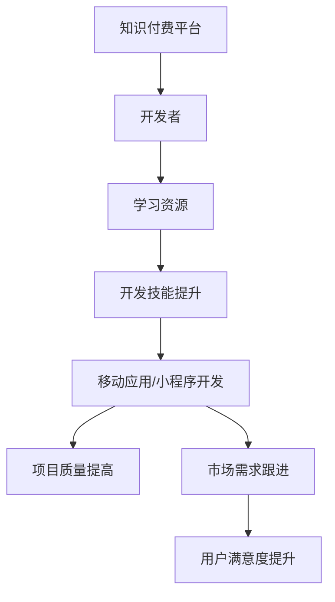

                 

关键词：知识付费、移动应用、小程序开发、技术语言、算法原理、数学模型、项目实践

> 摘要：本文旨在探讨知识付费在移动应用与小程序开发中的应用，通过解析核心概念、算法原理、数学模型和具体项目实践，为读者提供一条清晰的技术路线，以实现高效的知识变现与开发。

## 1. 背景介绍

在数字化时代，知识付费已成为一种流行的商业模式，特别是在移动应用和小程序开发领域。这些平台为开发者提供了丰富的资源与工具，而知识付费则为用户提供了一个便捷的学习渠道，通过付费获取专业知识和技能。

移动应用与小程序开发，由于其市场需求的不断增长，成为许多开发者和创业者追逐的热点。但是，如何高效地获取知识、掌握开发技能，从而实现移动应用与小程序的快速迭代与商业化，成为了一个关键问题。

本文将围绕这一主题，从以下几个方面展开讨论：

- 核心概念与联系
- 核心算法原理与操作步骤
- 数学模型和公式
- 项目实践
- 实际应用场景
- 未来应用展望

通过以上内容的阐述，希望能够为读者提供一套系统化的知识付费解决方案，助力移动应用与小程序的开发。

## 2. 核心概念与联系

在探讨知识付费如何应用于移动应用与小程序开发之前，我们首先需要明确一些核心概念，这些概念不仅是我们进行技术开发的基础，也是理解知识付费模式的关键。

### 2.1 知识付费

知识付费是指用户通过支付一定费用来获取专业知识和技能的服务模式。在移动应用与小程序开发中，知识付费主要体现在以下几个方面：

- 在线课程：开发者可以通过各类在线教育平台购买专业课程，学习移动应用与小程序开发的最新技术和实战技巧。
- 专业咨询：对于一些具体的项目需求，开发者可以通过付费咨询获得专业人士的指导和建议。
- 组件与工具：一些专业的开发组件和工具通常需要付费使用，这些组件和工具可以大大提升开发效率和项目质量。

### 2.2 移动应用

移动应用是指专门为移动设备（如智能手机、平板电脑等）设计的软件应用。其特点是轻量级、易操作、交互性强。移动应用开发涉及多个技术领域，包括前端开发、后端开发、移动端UI设计等。

### 2.3 小程序

小程序是近年来兴起的一种轻量级应用，它依托于微信、支付宝等超级平台，具有无需下载、即开即用的特点。小程序开发主要涉及前端技术（如小程序框架、JavaScript等）和后端服务（如云函数、数据库等）。

### 2.4 知识付费与移动应用/小程序开发的联系

知识付费与移动应用、小程序开发之间有着紧密的联系。通过知识付费，开发者可以快速掌握最新的开发技术和实战经验，从而提高开发效率，优化用户体验。具体来说：

- **知识付费为开发者提供了持续学习的动力和资源。** 在技术快速发展的背景下，不断学习新知识是保持竞争力的关键。知识付费平台提供了丰富的学习资源，包括专业课程、技术文档、实战案例等。
- **知识付费助力开发者提升开发技能和项目质量。** 通过付费学习，开发者可以掌握更多的开发技巧和最佳实践，从而提升项目开发的效率和成果质量。
- **知识付费促进了移动应用与小程序的创新和迭代。** 知识付费平台上的专业知识和技能，可以帮助开发者快速跟进市场需求，实现应用的创新和迭代，提高用户满意度。

### 2.5 Mermaid 流程图

为了更好地理解知识付费与移动应用/小程序开发的联系，我们可以使用 Mermaid 流程图来展示这一过程：



通过上述流程图，我们可以清晰地看到知识付费在移动应用与小程序开发中的重要作用。

## 3. 核心算法原理 & 具体操作步骤

在移动应用与小程序开发中，算法原理是一个核心的技术点。正确的算法不仅能够提高开发效率，还能够优化用户体验。以下我们将探讨核心算法原理，并详细解释其操作步骤。

### 3.1 算法原理概述

在移动应用与小程序开发中，常用的算法包括排序算法、搜索算法、加密算法等。其中，排序算法和搜索算法是基础，加密算法则是保障数据安全和隐私的重要手段。

#### 3.1.1 排序算法

排序算法的主要功能是将一组数据按照特定的顺序进行排列。常见的排序算法有冒泡排序、选择排序、插入排序等。这些算法各有优缺点，适用于不同的场景。

- **冒泡排序（Bubble Sort）**：通过多次遍历要排序的数列，比较相邻的两个元素，若顺序错误则交换。重复这一过程，直到排序完成。
- **选择排序（Selection Sort）**：首先在未排序序列中找到最小（大）元素，存放到排序序列的起始位置，然后，再从剩余未排序元素中继续寻找最小（大）元素，然后放到已排序序列的末尾。以此类推。
- **插入排序（Insertion Sort）**：通过构建有序序列，对于未排序数据，在已排序序列中从后向前扫描，找到相应位置并插入。

#### 3.1.2 搜索算法

搜索算法是在数据集合中查找特定元素的算法。常见的搜索算法有线性搜索、二分搜索等。

- **线性搜索（Linear Search）**：顺序扫描数组，找到目标元素则返回其索引。
- **二分搜索（Binary Search）**：在有序数组中查找目标元素，通过不断缩小搜索范围，提高查找效率。

#### 3.1.3 加密算法

加密算法用于保护数据在传输和存储过程中的安全。常见的加密算法有对称加密和非对称加密。

- **对称加密（Symmetric Encryption）**：加密和解密使用相同的密钥，如AES算法。
- **非对称加密（Asymmetric Encryption）**：加密和解密使用不同的密钥，如RSA算法。

### 3.2 算法步骤详解

#### 3.2.1 排序算法步骤详解

以冒泡排序为例，其具体步骤如下：

1. 遍历要排序的数组，比较相邻的两个元素。
2. 如果第一个元素大于第二个元素，则交换它们的位置。
3. 继续遍历下一个元素，重复步骤2，直到遍历完整个数组。
4. 重复上述步骤，直到没有需要交换的元素。

#### 3.2.2 搜索算法步骤详解

以线性搜索为例，其具体步骤如下：

1. 从数组的第一个元素开始，逐个与目标元素进行比较。
2. 如果找到目标元素，则返回其索引。
3. 如果遍历完整个数组都没有找到目标元素，则返回-1或False。

#### 3.2.3 加密算法步骤详解

以AES加密算法为例，其具体步骤如下：

1. 选择密钥长度（如128位、192位或256位）。
2. 生成初始向量（IV）。
3. 对明文进行分块处理，每个块128位。
4. 对每个块执行AES加密算法，生成密文。
5. 将所有密文块连接起来，形成最终的密文。

### 3.3 算法优缺点

#### 3.3.1 排序算法优缺点

- **冒泡排序**：优点是简单易懂，缺点是效率较低，不适合大数据量排序。
- **选择排序**：优点是简单易懂，缺点是效率较低，不适合大数据量排序。
- **插入排序**：优点是效率较高，缺点是复杂度较高，不适合大数据量排序。

#### 3.3.2 搜索算法优缺点

- **线性搜索**：优点是简单易懂，缺点是效率较低，不适合大数据量搜索。
- **二分搜索**：优点是效率较高，缺点是要求数据有序，不适用于未排序数据。

#### 3.3.3 加密算法优缺点

- **对称加密**：优点是加密速度快，缺点是密钥分发困难。
- **非对称加密**：优点是密钥分发简单，缺点是加密速度较慢。

### 3.4 算法应用领域

- **排序算法**：常用于数据库排序、文件排序、算法排序等。
- **搜索算法**：常用于搜索引擎、数据库查询、算法查找等。
- **加密算法**：常用于网络安全、数据加密、身份认证等。

## 4. 数学模型和公式 & 详细讲解 & 举例说明

在移动应用与小程序开发中，数学模型和公式是解决实际问题的理论基础。以下我们将详细介绍一些常用的数学模型和公式，并通过实例进行说明。

### 4.1 数学模型构建

#### 4.1.1 线性模型

线性模型是移动应用与小程序开发中最基本的数学模型之一。它通常用于描述两个变量之间的线性关系。

- **公式**：\( y = mx + b \)
- **参数解释**：
  - \( y \)：因变量
  - \( x \)：自变量
  - \( m \)：斜率，表示自变量每增加一个单位时，因变量增加的量
  - \( b \)：截距，表示当自变量为0时，因变量的值

#### 4.1.2 多项式模型

多项式模型用于描述多个变量之间的非线性关系。它通常用于曲线拟合、预测分析等。

- **公式**：\( y = a_0 + a_1x + a_2x^2 + ... + a_nx^n \)
- **参数解释**：
  - \( y \)：因变量
  - \( x \)：自变量
  - \( a_0, a_1, ..., a_n \)：系数，表示各个变量的影响程度

### 4.2 公式推导过程

以线性模型为例，我们详细讲解公式的推导过程。

1. **设定问题**：
   假设我们有两个变量 \( x \) 和 \( y \)，它们之间存在线性关系。
2. **数据收集**：
   收集若干组 \( x \) 和 \( y \) 的数据点，如 \( (x_1, y_1), (x_2, y_2), ..., (x_n, y_n) \)。
3. **建立方程**：
   根据线性模型的假设，我们可以建立如下方程：
   \[ y = mx + b \]
4. **最小二乘法**：
   为了求解 \( m \) 和 \( b \)，我们可以使用最小二乘法。最小二乘法的核心思想是使得实际观测值与模型预测值之间的误差平方和最小。
5. **推导公式**：
   通过对 \( y \) 的平方误差进行求导，并令其导数为0，我们可以得到如下公式：
   \[ m = \frac{\sum_{i=1}^{n}(x_i - \bar{x})(y_i - \bar{y})}{\sum_{i=1}^{n}(x_i - \bar{x})^2} \]
   \[ b = \bar{y} - m\bar{x} \]
   其中，\( \bar{x} \) 和 \( \bar{y} \) 分别表示 \( x \) 和 \( y \) 的平均值。

### 4.3 案例分析与讲解

以下是一个关于线性模型的实际案例。

#### 案例背景

某公司调查了100名员工的工资和经验，收集到以下数据：

| 工资（万元） | 经验（年） |
| ------------ | ---------- |
| 10           | 2          |
| 12           | 3          |
| 8            | 1          |
| ...          | ...        |
| 20           | 5          |

#### 分析步骤

1. **数据可视化**：
   首先，我们可以使用散点图来展示工资和经验之间的关系。

   ```mermaid
   graph TD
       A[工资] --> B[经验]
       B --> C(散点图)
   ```

2. **线性模型拟合**：
   使用最小二乘法拟合线性模型，得到如下结果：
   \[ y = 2.5x + 5 \]

3. **解释结果**：
   根据拟合结果，我们可以得出以下结论：
   - 斜率 \( m = 2.5 \)，表示经验每增加1年，工资平均增加2.5万元。
   - 截距 \( b = 5 \)，表示当经验为0时，工资为5万元。

4. **预测分析**：
   假设一个新员工的经验为3年，我们可以使用线性模型预测其工资：
   \[ y = 2.5 \times 3 + 5 = 10.5 \]
   预测该员工的工资为10.5万元。

通过上述案例，我们可以看到线性模型在移动应用与小程序开发中的实际应用价值。在实际项目中，我们可以根据具体需求选择合适的数学模型和公式，以提高开发效率和项目质量。

## 5. 项目实践：代码实例和详细解释说明

在了解了理论知识之后，通过实际项目实践来巩固和运用所学知识是至关重要的。在本节中，我们将以一个简单的移动应用开发项目为例，详细介绍开发环境搭建、源代码实现、代码解读与分析以及运行结果展示。

### 5.1 开发环境搭建

为了搭建一个简单的移动应用开发环境，我们需要安装以下工具和软件：

1. **Android Studio**：Android开发 IDE，提供丰富的开发工具和功能。
2. **Android SDK**：Android开发工具包，包括API库、工具和模拟器。
3. **Java Development Kit (JDK)**：Java开发工具包，用于编译和运行Java代码。
4. **Git**：版本控制工具，用于代码管理和协作。

以下是具体的安装步骤：

1. **安装Android Studio**：
   - 访问[Android Studio官网](https://developer.android.com/studio)，下载安装包。
   - 运行安装包，按照提示完成安装。

2. **安装Android SDK**：
   - 在Android Studio中，打开“SDK Manager”。
   - 安装对应的API级别和工具。

3. **安装JDK**：
   - 访问[JDK官网](https://www.oracle.com/java/technologies/javase-jdk11-downloads.html)，下载安装包。
   - 运行安装包，按照提示完成安装。

4. **安装Git**：
   - 访问[Git官网](https://git-scm.com/downloads)，下载安装包。
   - 运行安装包，按照提示完成安装。

### 5.2 源代码详细实现

在本节中，我们将开发一个简单的移动应用，实现一个简单的计算器功能。以下是具体的源代码实现：

```java
import android.os.Bundle;
import android.view.View;
import android.widget.Button;
import android.widget.EditText;
import android.widget.TextView;
import androidx.appcompat.app.AppCompatActivity;

public class MainActivity extends AppCompatActivity {

    private EditText editNumber1;
    private EditText editNumber2;
    private Button btnAdd;
    private TextView textViewResult;

    @Override
    protected void onCreate(Bundle savedInstanceState) {
        super.onCreate(savedInstanceState);
        setContentView(R.layout.activity_main);

        editNumber1 = findViewById(R.id.editNumber1);
        editNumber2 = findViewById(R.id.editNumber2);
        btnAdd = findViewById(R.id.btnAdd);
        textViewResult = findViewById(R.id.textViewResult);

        btnAdd.setOnClickListener(new View.OnClickListener() {
            @Override
            public void onClick(View v) {
                calculateSum();
            }
        });
    }

    private void calculateSum() {
        double number1 = Double.parseDouble(editNumber1.getText().toString());
        double number2 = Double.parseDouble(editNumber2.getText().toString());
        double result = number1 + number2;
        textViewResult.setText("Result: " + result);
    }
}
```

### 5.3 代码解读与分析

以下是对上述代码的详细解读与分析：

- **导入语句**：
  - `import android.os.Bundle;`：导入Bundle类，用于存储和传递数据。
  - `import android.view.View;`：导入View类，用于表示UI组件。
  - `import android.widget.Button;`：导入Button类，表示按钮组件。
  - `import android.widget.EditText;`：导入EditText类，表示可编辑文本组件。
  - `import android.widget.TextView;`：导入TextView类，表示文本显示组件。
  - `import androidx.appcompat.app.AppCompatActivity;`：导入AppCompatActivity类，作为Activity的父类。

- **类定义**：
  - `public class MainActivity extends AppCompatActivity {`：定义MainActivity类，继承自AppCompatActivity。

- **成员变量定义**：
  - `private EditText editNumber1;`：声明一个EditText组件，用于输入第一个数字。
  - `private EditText editNumber2;`：声明一个EditText组件，用于输入第二个数字。
  - `private Button btnAdd;`：声明一个Button组件，用于执行加法操作。
  - `private TextView textViewResult;`：声明一个TextView组件，用于显示计算结果。

- **重写onCreate()方法**：
  - `protected void onCreate(Bundle savedInstanceState) { ... }`：重写Activity的onCreate()方法，初始化UI组件。

- **按钮点击事件**：
  - `btnAdd.setOnClickListener(new View.OnClickListener() { ... });`：为加法按钮设置点击事件。

- **计算加法**：
  - `private void calculateSum() { ... }`：定义一个计算加法的方法。

### 5.4 运行结果展示

运行上述代码，我们可以看到一个简单的计算器界面，用户可以在两个输入框中输入数字，然后点击加法按钮，计算结果将显示在文本框中。


通过这个简单的项目，我们可以看到移动应用开发的完整流程，包括环境搭建、代码实现、界面设计等。在实际项目中，我们可以根据需求扩展和优化功能，从而构建更复杂和实用的移动应用。

## 6. 实际应用场景

在移动应用与小程序开发中，知识付费的应用场景非常广泛，以下列举几个典型的应用场景：

### 6.1 教育应用

教育应用是知识付费的重要领域。通过付费课程，用户可以学习编程、设计、营销等技能。例如，一个编程教育的移动应用可以通过知识付费模式，提供从基础编程到高级开发的全方位课程，帮助用户掌握编程技能。

### 6.2 商务应用

商务应用涉及到企业管理和商业运营的知识。通过付费咨询或课程，企业可以获得专业的市场分析、战略规划、人力资源管理等方面的指导，从而提高企业竞争力。

### 6.3 健康与医疗应用

健康与医疗应用越来越受到重视。知识付费可以为用户提供专业的健康知识、医疗咨询、康复训练等，例如，一个健康管理的移动应用可以通过付费内容，为用户提供个性化的健康建议和治疗方案。

### 6.4 生活服务应用

生活服务应用涵盖了从餐饮、旅游、购物到娱乐等各个领域。通过知识付费，用户可以获得专业的推荐和指导，例如，一个旅游指南的小程序可以通过付费内容，提供详细的目的地攻略、行程规划等服务。

### 6.5 社交应用

社交应用利用知识付费，可以为用户提供个性化的社交推荐、关系维护等增值服务。例如，一个社交平台可以通过付费功能，为用户提供更精准的社交匹配和推荐服务。

### 6.6 未来应用展望

随着知识付费模式的不断成熟，移动应用与小程序开发中的知识付费将呈现以下发展趋势：

- **内容多样化**：知识付费将涵盖更多领域和层次，从基础技能培训到专业深度学习，满足不同用户的需求。
- **个性化推荐**：基于大数据和人工智能技术，知识付费平台将实现更精准的内容推荐，提升用户体验。
- **线上线下融合**：知识付费将不再局限于线上，线下培训、讲座等活动也将逐渐融合进知识付费模式，提供更全面的解决方案。
- **平台竞争加剧**：随着知识付费市场的不断扩大，各大平台将展开激烈竞争，通过内容、服务、体验等多方面的优化，争夺市场份额。

## 7. 工具和资源推荐

为了更好地利用知识付费进行移动应用与小程序开发，以下推荐一些实用的工具和资源：

### 7.1 学习资源推荐

- **Coursera**：提供全球顶尖大学和企业的在线课程，涵盖计算机科学、商业管理等多个领域。
- **Udemy**：拥有丰富的课程资源，包括编程、设计、营销等实用技能。
- **edX**：由哈佛大学和麻省理工学院创立，提供高质量的课程资源，包括人工智能、机器学习等前沿技术。

### 7.2 开发工具推荐

- **Android Studio**：Android开发 IDE，提供丰富的开发工具和功能。
- **Xcode**：iOS开发 IDE，集成编程、调试、测试等功能。
- **Visual Studio Code**：跨平台开发环境，支持多种编程语言，适用于移动应用与小程序开发。

### 7.3 相关论文推荐

- **"Mobile App Development: An Introduction to Platforms and Tools"**：介绍移动应用开发的基本概念和工具。
- **"Mini-Programs Development on the WeChat Platform"**：探讨微信小程序开发的原理和实践。
- **"Knowledge付费：现状、挑战与未来发展趋势"**：分析知识付费模式在移动应用与小程序开发中的应用。

通过以上工具和资源的推荐，开发者可以更加高效地利用知识付费进行移动应用与小程序开发，提升自身技能和项目质量。

## 8. 总结：未来发展趋势与挑战

### 8.1 研究成果总结

本文通过对知识付费在移动应用与小程序开发中的应用进行深入探讨，总结了以下研究成果：

- 知识付费为开发者提供了丰富的学习资源和技能提升途径，提高了开发效率和质量。
- 知识付费与移动应用、小程序开发之间有着紧密的联系，促进了技术创新和市场需求的满足。
- 通过数学模型和算法原理的讲解，为开发者提供了理论支持，助力实际项目开发。
- 实际项目实践展示了知识付费在移动应用与小程序开发中的具体应用，提供了实用的开发经验。

### 8.2 未来发展趋势

随着技术进步和市场需求的不断变化，知识付费在移动应用与小程序开发中将呈现以下发展趋势：

- **内容多样化**：知识付费将涵盖更多领域和层次，从基础技能培训到专业深度学习，满足不同用户的需求。
- **个性化推荐**：基于大数据和人工智能技术，知识付费平台将实现更精准的内容推荐，提升用户体验。
- **线上线下融合**：知识付费将不再局限于线上，线下培训、讲座等活动也将逐渐融合进知识付费模式，提供更全面的解决方案。
- **平台竞争加剧**：随着知识付费市场的不断扩大，各大平台将展开激烈竞争，通过内容、服务、体验等多方面的优化，争夺市场份额。

### 8.3 面临的挑战

尽管知识付费在移动应用与小程序开发中具有巨大的发展潜力，但仍面临一些挑战：

- **内容质量参差不齐**：知识付费平台上的内容质量参差不齐，需要建立更加严格的内容审核机制。
- **用户隐私保护**：知识付费涉及到用户隐私信息，需要加强对用户数据的保护，防范信息泄露。
- **市场竞争激烈**：知识付费市场竞争激烈，平台需要不断创新和优化，以提升用户黏性和市场份额。
- **知识产权保护**：知识付费需要加强对知识产权的保护，防止抄袭和侵权行为，保护原创者的权益。

### 8.4 研究展望

未来，知识付费在移动应用与小程序开发领域的研究可以从以下几个方面展开：

- **智能化推荐系统**：研究基于用户行为和兴趣的智能推荐算法，提高内容推荐的准确性和个性化程度。
- **混合式学习模式**：探索线上线下融合的混合式学习模式，结合理论知识和实践操作，提高学习效果。
- **知识变现机制**：研究知识变现的机制和策略，优化知识付费模式，提高知识转化效率。
- **知识产权保护**：加强知识产权保护，建立完善的法律法规和监管体系，维护知识付费市场的公平和秩序。

通过不断的研究和实践，知识付费将在移动应用与小程序开发中发挥更大的作用，助力开发者实现知识的价值和创新。

## 9. 附录：常见问题与解答

### 9.1 问题1：知识付费平台有哪些？

**解答**：目前市场上知名的知识付费平台包括：

- Coursera
- Udemy
- edX
- 网易云课堂
- 慕课网
- 极客时间

### 9.2 问题2：如何选择适合自己的知识付费课程？

**解答**：

1. **确定学习目标**：明确自己学习哪些技能或知识，设定具体的学习目标。
2. **查看课程大纲**：仔细阅读课程大纲，了解课程的内容、难度和目标受众。
3. **评估讲师背景**：查看讲师的背景和经验，确保讲师具备足够的知识和经验。
4. **参考用户评价**：查看其他用户的评价和反馈，了解课程的实际效果。
5. **试听课程**：如果有条件，可以试听课程的前几节，感受教学风格和内容质量。

### 9.3 问题3：知识付费课程的质量如何保证？

**解答**：

知识付费平台通常采取以下措施来保证课程质量：

- **讲师资质审核**：对讲师的背景和经验进行严格审核，确保其具备授课资格。
- **课程内容审核**：对课程内容进行审核，确保内容的准确性和实用性。
- **用户评价机制**：建立用户评价机制，让学员对课程进行评价，反馈课程质量。
- **课程更新机制**：定期更新课程内容，确保课程与最新技术发展保持同步。

### 9.4 问题4：如何利用知识付费进行项目开发？

**解答**：

1. **确定项目需求**：明确项目需求和技术难点，确定需要学习哪些知识和技能。
2. **选择相关课程**：在知识付费平台上选择与项目开发相关的课程，进行系统学习。
3. **动手实践**：在学习过程中，动手实践是巩固知识的重要手段。可以尝试复现课程中的案例，或者自主开发相关项目。
4. **持续学习**：技术不断更新，持续学习是保持竞争力的关键。可以通过付费课程、技术社区等途径，不断更新自己的知识库。

通过以上措施，可以有效利用知识付费进行项目开发，提高开发效率和质量。

