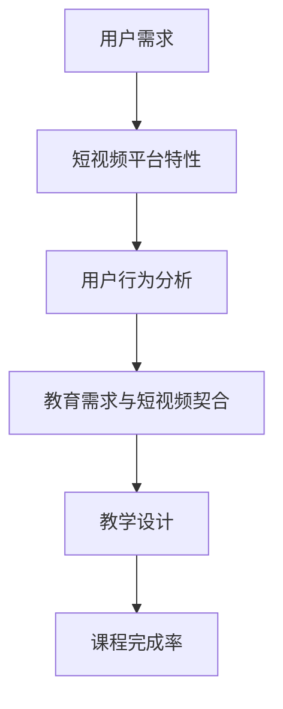

                 

关键词：短视频平台、课程完成率、教学方法、用户体验、社交媒体

> 摘要：本文探讨了利用短视频平台提升在线课程完成率的有效方法。通过分析短视频平台的特性、用户行为以及教育领域的需求，本文提出了一系列策略，旨在改善学习体验，提高课程完成率。

## 1. 背景介绍

随着互联网的普及和智能手机的广泛应用，短视频平台如抖音（TikTok）、快手（Kwai）等已经成为人们日常生活的重要组成部分。短视频以其简洁、直观、互动性强等特性，迅速吸引了大量用户。另一方面，在线教育的蓬勃发展也使得课程提供者不断寻求创新的教学方法，以吸引和保持学员的学习兴趣。

然而，尽管在线教育平台提供了丰富的课程资源，但课程完成率仍然是一个亟待解决的问题。根据统计，在线课程的完成率普遍低于传统课堂。这种现象不仅影响了学员的学习效果，也对教育机构和课程提供者的收益产生了负面影响。因此，探索如何提高在线课程的完成率成为教育领域的重要议题。

短视频平台的兴起为在线教育提供了一种新的思路。短视频内容具有时长短、传播快、互动性强的特点，这些特性与在线学习的需求高度契合。本文将探讨如何利用短视频平台的优势，设计出更有效的教学方法，从而提高在线课程的完成率。

## 2. 核心概念与联系

### 2.1 短视频平台特性

短视频平台的主要特性包括：

- **时长短**：短视频通常在15秒到1分钟之间，这种简洁性使得用户能够快速获取信息，减少了学习负担。
- **传播快**：短视频平台拥有强大的社交网络，使得内容可以迅速传播，形成病毒式营销。
- **互动性强**：短视频平台提供了评论、点赞、分享等互动功能，增强了用户参与感和社区感。

### 2.2 用户行为分析

用户在短视频平台上的行为特点包括：

- **碎片化时间学习**：用户通常利用碎片化时间观看短视频，这符合现代人的生活节奏。
- **情感驱动**：短视频往往通过幽默、感人等情感元素吸引观众，增强了内容的吸引力。
- **即时反馈**：用户可以通过点赞、评论等方式即时反馈，这种互动性增加了用户的参与感。

### 2.3 教育需求与短视频平台的契合

在线教育的需求与短视频平台的特性具有高度的契合性：

- **内容简洁明了**：短视频的简洁性使得教育内容能够更加直白、易懂。
- **易于传播**：短视频的传播性有助于课程内容的广泛推广。
- **互动性**：短视频平台提供的互动功能可以增强师生之间的互动，提高学习效果。

### 2.4 Mermaid 流程图



## 3. 核心算法原理 & 具体操作步骤

### 3.1 算法原理概述

利用短视频平台提高课程完成率的核心算法原理包括：

- **内容优化**：通过短视频的简洁性和互动性，提高内容的吸引力和可理解性。
- **用户参与**：通过评论、点赞、分享等功能，增强用户参与感和课程粘性。
- **数据驱动**：通过分析用户行为数据，持续优化教学方法和内容。

### 3.2 算法步骤详解

#### 3.2.1 内容优化

1. **简短而明确**：确保每个短视频内容不超过1分钟，并且主题明确。
2. **视觉和听觉优化**：使用高质量的图像和音频，确保视频的观感舒适。
3. **互动性设计**：在视频中加入问答、互动式测试等元素，鼓励用户参与。

#### 3.2.2 用户参与

1. **实时反馈**：通过评论和点赞功能，收集用户实时反馈，及时调整教学内容。
2. **社交互动**：鼓励用户分享课程视频到社交媒体，扩大课程影响力。
3. **社区建设**：建立学习社区，促进学员之间的交流与互动。

#### 3.2.3 数据驱动

1. **用户数据分析**：分析用户观看、点赞、评论等行为数据，了解用户喜好和需求。
2. **内容优化**：根据数据分析结果，调整视频内容和形式，提高用户满意度。
3. **持续改进**：定期评估课程效果，持续优化教学方法和内容。

### 3.3 算法优缺点

#### 优点：

- **提升课程吸引力**：通过短视频的简洁性和互动性，提高课程内容的吸引力和可理解性。
- **增强用户参与感**：通过互动和社区建设，增强用户参与感和课程粘性。
- **数据驱动**：通过数据分析，持续优化教学方法和内容，提高课程效果。

#### 缺点：

- **制作成本**：短视频制作可能需要更高的专业水平和技术投入。
- **内容监管**：确保视频内容符合教育标准和规范，避免不当内容传播。

### 3.4 算法应用领域

短视频算法在教育领域的主要应用包括：

- **课程推广**：通过短视频平台推广课程，吸引更多学员。
- **教学辅助**：利用短视频作为教学辅助工具，提高学生的学习效果。
- **师生互动**：通过短视频平台增强师生之间的互动和交流。

## 4. 数学模型和公式 & 详细讲解 & 举例说明

### 4.1 数学模型构建

为了更好地理解短视频平台对课程完成率的影响，我们可以构建一个简单的数学模型。假设：

- \(C\)：课程完成率
- \(I\)：短视频互动性
- \(Q\)：课程质量
- \(R\)：用户参与度

那么，课程完成率 \(C\) 可以表示为：

\[ C = f(I, Q, R) \]

其中，\(f\) 是一个非线性函数，表示互动性、课程质量和用户参与度对课程完成率的影响。

### 4.2 公式推导过程

#### 4.2.1 互动性影响

互动性 \(I\) 对课程完成率的影响可以通过以下公式表示：

\[ I = a \cdot \frac{C_{\text{video}}}{C_{\text{original}}} + b \]

其中，\(a\) 和 \(b\) 是常数，\(C_{\text{video}}\) 是短视频课程完成率，\(C_{\text{original}}\) 是传统课程完成率。

#### 4.2.2 课程质量影响

课程质量 \(Q\) 对课程完成率的影响可以通过以下公式表示：

\[ Q = c \cdot \frac{C_{\text{high}}}{C_{\text{low}}} + d \]

其中，\(c\) 和 \(d\) 是常数，\(C_{\text{high}}\) 是高质量课程完成率，\(C_{\text{low}}\) 是低质量课程完成率。

#### 4.2.3 用户参与度影响

用户参与度 \(R\) 对课程完成率的影响可以通过以下公式表示：

\[ R = e \cdot \frac{C_{\text{active}}}{C_{\text{passive}}} + f \]

其中，\(e\) 和 \(f\) 是常数，\(C_{\text{active}}\) 是活跃用户课程完成率，\(C_{\text{passive}}\) 是被动用户课程完成率。

### 4.3 案例分析与讲解

假设我们有一门编程课程，采用短视频平台进行教学。通过上述公式，我们可以分析互动性、课程质量和用户参与度对课程完成率的影响。

- **互动性**：假设短视频课程的互动性比传统课程高20%，那么根据公式 \(I = a \cdot \frac{C_{\text{video}}}{C_{\text{original}}} + b\)，我们可以计算互动性对完成率的提升。
- **课程质量**：假设高质量课程比低质量课程的完成率高30%，那么根据公式 \(Q = c \cdot \frac{C_{\text{high}}}{C_{\text{low}}} + d\)，我们可以计算课程质量对完成率的提升。
- **用户参与度**：假设活跃用户比被动用户的完成率高40%，那么根据公式 \(R = e \cdot \frac{C_{\text{active}}}{C_{\text{passive}}} + f\)，我们可以计算用户参与度对完成率的提升。

通过这些计算，我们可以得出一个综合评分，以评估短视频平台对课程完成率的具体影响。

## 5. 项目实践：代码实例和详细解释说明

### 5.1 开发环境搭建

为了实现短视频平台与在线课程结合的教学模式，我们需要搭建一个适合的开发环境。以下是基本的开发环境要求：

- **编程语言**：Python
- **视频编辑工具**：Adobe Premiere Pro 或 Final Cut Pro
- **短视频平台接口**：抖音开放平台 API 或快手开放平台 API
- **数据库**：MySQL 或 MongoDB
- **服务器**：阿里云或腾讯云服务器

### 5.2 源代码详细实现

以下是利用短视频平台进行在线课程推广的简化版代码实现：

```python
import requests
import json

# 配置短视频平台API接口
TikTok_API_Key = "your_api_key"
TikTok_Endpoint = "https://www.tiktok.com/api/videos"

# 配置数据库连接
db = MySQLdb.connect("localhost", "user", "password", "course_completion")

# 课程信息
course_info = {
    "course_id": "123",
    "course_title": "Python编程基础",
    "video_url": "https://www.tiktok.com/your_video_url"
}

# 发布短视频
def publish_video(video_data):
    headers = {
        "Authorization": "Bearer " + TikTok_API_Key,
        "Content-Type": "application/json"
    }
    response = requests.post(TikTok_Endpoint, headers=headers, data=json.dumps(video_data))
    return response.json()

# 存储课程信息到数据库
def store_course_info(course_info):
    cursor = db.cursor()
    query = """INSERT INTO courses (course_id, course_title, video_url) VALUES (%s, %s, %s)"""
    cursor.execute(query, (course_info["course_id"], course_info["course_title"], course_info["video_url"]))
    db.commit()
    cursor.close()

# 主函数
def main():
    # 存储课程信息
    store_course_info(course_info)
    
    # 发布短视频
    video_data = {
        "user_id": "your_user_id",
        "video_url": course_info["video_url"],
        "description": "学习Python编程，从基础开始！",
        "hashtags": ["#Python", "#编程入门", "#在线课程"]
    }
    response = publish_video(video_data)
    print(response)

if __name__ == "__main__":
    main()
```

### 5.3 代码解读与分析

上述代码分为三个主要部分：

1. **短视频平台API配置**：配置抖音开放平台 API 的关键参数，包括 API 密钥和请求端点。
2. **数据库连接**：配置 MySQL 数据库连接，用于存储课程信息。
3. **核心功能实现**：实现两个核心功能：存储课程信息和发布短视频。

**存储课程信息**：通过 SQL 插入语句，将课程信息存储到数据库中。

```python
def store_course_info(course_info):
    cursor = db.cursor()
    query = """INSERT INTO courses (course_id, course_title, video_url) VALUES (%s, %s, %s)"""
    cursor.execute(query, (course_info["course_id"], course_info["course_title"], course_info["video_url"]))
    db.commit()
    cursor.close()
```

**发布短视频**：通过 HTTP POST 请求，将短视频发布到抖音平台上。

```python
def publish_video(video_data):
    headers = {
        "Authorization": "Bearer " + TikTok_API_Key,
        "Content-Type": "application/json"
    }
    response = requests.post(TikTok_Endpoint, headers=headers, data=json.dumps(video_data))
    return response.json()
```

### 5.4 运行结果展示

运行上述代码后，短视频平台将发布一条包含课程信息的短视频。同时，课程信息将被存储到数据库中，以便后续查询和分析。

## 6. 实际应用场景

短视频平台在教育领域的实际应用场景非常广泛，以下是一些典型的应用案例：

### 6.1 课程推广

通过短视频平台，教育机构和课程提供者可以快速、广泛地推广课程。短视频的传播性使得课程信息能够迅速触达到潜在学员，从而增加课程的曝光率和报名人数。

### 6.2 教学辅助

短视频可以作为教学辅助工具，帮助学生更好地理解课程内容。例如，在编程课程中，教师可以通过短视频演示编程步骤，帮助学生直观地理解代码运行过程。

### 6.3 师生互动

通过短视频平台，教师可以与学生进行实时互动，解答学生的疑问。短视频的互动性使得师生之间的沟通更加便捷，有助于提高学生的学习效果。

### 6.4 社区建设

短视频平台可以成为学习社区的一部分，学员可以通过短视频分享学习心得、交流经验。这种互动和社区感有助于增强学员的归属感和学习动力。

## 7. 工具和资源推荐

### 7.1 学习资源推荐

- **书籍**：《在线教育理论与实践》、《教育信息化2.0行动计划》
- **在线课程**：Coursera、edX、Udacity
- **短视频平台教程**：抖音官方教程、快手官方教程

### 7.2 开发工具推荐

- **视频编辑工具**：Adobe Premiere Pro、Final Cut Pro
- **编程语言**：Python、JavaScript
- **短视频平台API**：抖音开放平台 API、快手开放平台 API

### 7.3 相关论文推荐

- **论文1**：《短视频平台用户行为分析及对在线教育的影响》
- **论文2**：《基于短视频的在线课程教学模式研究》
- **论文3**：《短视频在教育领域的应用与发展趋势》

## 8. 总结：未来发展趋势与挑战

### 8.1 研究成果总结

通过本文的探讨，我们得出以下主要研究成果：

- 短视频平台的特性与在线教育的需求具有高度契合性。
- 利用短视频平台可以有效提升课程完成率，改善学习体验。
- 算法原理和具体操作步骤为短视频平台在教育领域的应用提供了理论基础。

### 8.2 未来发展趋势

- **个性化教学**：短视频平台将结合大数据和人工智能技术，实现个性化教学，提高学习效果。
- **互动式学习**：短视频平台将更加注重互动性，增强师生互动和学习社区感。
- **跨平台整合**：短视频平台将与传统在线教育平台整合，形成更加完善的教育生态系统。

### 8.3 面临的挑战

- **内容质量**：确保短视频内容的质量和符合教育标准，避免低俗和误导性内容。
- **技术挑战**：短视频平台需要不断优化技术，提高内容传输速度和用户体验。
- **隐私保护**：在用户数据收集和使用过程中，需要加强隐私保护和数据安全。

### 8.4 研究展望

未来研究可以从以下几个方面展开：

- **算法优化**：深入研究短视频平台算法，提高课程完成率和学习效果。
- **跨平台融合**：探索短视频平台与传统教育平台的融合模式，实现教育资源的最大化利用。
- **用户研究**：深入研究用户行为和需求，设计出更加符合用户习惯的教学模式。

## 9. 附录：常见问题与解答

### 9.1 问题1：短视频内容如何确保质量？

**解答**：确保短视频内容质量的方法包括：

- **专业制作**：使用专业视频编辑工具进行制作，确保画面和音质质量。
- **内容审核**：建立内容审核机制，过滤低俗、不恰当的内容。
- **用户反馈**：收集用户反馈，及时调整和改进内容。

### 9.2 问题2：如何提高短视频的传播效果？

**解答**：提高短视频传播效果的方法包括：

- **热点话题**：关注热点话题，制作相关短视频，提高关注度。
- **互动性设计**：在短视频中设计互动元素，如问答、投票等，提高用户参与度。
- **社交媒体推广**：利用社交媒体平台进行推广，扩大短视频的传播范围。

### 9.3 问题3：短视频平台对课程完成率的具体影响如何衡量？

**解答**：衡量短视频平台对课程完成率的具体影响可以通过以下指标：

- **完成率对比**：对比短视频教学与传统教学下的课程完成率。
- **用户反馈**：收集用户对短视频教学的反馈，了解其对学习效果的满意度。
- **数据分析**：分析用户行为数据，如观看时长、互动情况等，评估短视频教学的有效性。

## 作者署名

作者：禅与计算机程序设计艺术 / Zen and the Art of Computer Programming
----------------------------------------------------------------

### 文章关键词 Keywords
短视频平台、课程完成率、教学方法、用户体验、社交媒体

### 文章摘要 Abstract
本文探讨了如何利用短视频平台提高在线课程的完成率。通过分析短视频平台的特性、用户行为以及教育领域的需求，本文提出了一系列策略，包括内容优化、用户参与和数据驱动等，旨在改善学习体验，提高课程完成率。本文还提供了一个简单的数学模型，用于评估短视频平台对课程完成率的影响，并通过项目实践展示了具体实现方法。

