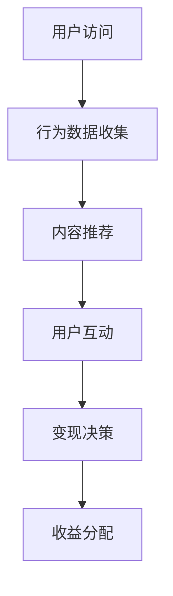

                 

关键词：短视频、流量变现、平台策略、算法优化、用户体验、商业模式。

> 摘要：本文将深入探讨如何利用短视频平台进行流量变现，从核心概念、算法原理、数学模型、实践案例、应用场景和未来展望等方面进行全面剖析，旨在为读者提供一份全面而实用的指南。

## 1. 背景介绍

随着移动互联网的快速发展，短视频平台成为了人们日常生活中不可或缺的一部分。抖音、快手、Bilibili等平台在用户数量和日活跃度上屡创新高。短视频平台不仅改变了人们的娱乐方式，也为企业和个人提供了新的流量变现途径。据统计，2022年中国短视频用户规模已超过8亿，市场规模持续扩大。

流量变现成为短视频平台的重要盈利模式，如何有效地进行流量变现不仅关乎平台的商业成功，也影响着创作者和用户的利益。本文将重点探讨以下几个问题：

1. 短视频平台流量变现的核心概念和算法原理。
2. 流量变现的具体操作步骤和优化策略。
3. 流量变现的数学模型和公式。
4. 短视频平台流量变现的实际应用场景。
5. 未来流量变现的趋势、挑战和展望。

## 2. 核心概念与联系

在讨论流量变现之前，我们需要了解一些核心概念：

### 2.1 流量

流量指的是平台上的用户访问量，包括用户的浏览、点赞、评论、分享等行为。流量的质量直接影响变现的效果。

### 2.2 变现

变现是指将流量转化为实际收入的过程。短视频平台的变现方式包括广告收入、直播带货、会员订阅、品牌合作等。

### 2.3 算法

算法在流量变现中起着至关重要的作用。算法能够根据用户行为数据，精准推送内容，提升用户参与度，从而提高变现效果。

#### 2.4 Mermaid 流程图

以下是一个简化的短视频平台流量变现的流程图：



- A（用户访问）：用户通过浏览器或应用访问短视频平台。
- B（行为数据收集）：平台收集用户的行为数据，如浏览时间、点赞数量、评论内容等。
- C（内容推荐）：算法根据用户行为数据，推荐用户可能感兴趣的内容。
- D（用户互动）：用户对推荐内容进行互动，如点赞、评论、分享。
- E（变现决策）：平台根据用户互动数据，决定采取何种变现策略，如广告、直播等。
- F（收益分配）：平台将收益按比例分配给创作者和平台。

## 3. 核心算法原理 & 具体操作步骤

### 3.1 算法原理概述

短视频平台的核心算法主要包括内容推荐算法和用户行为分析算法。

- **内容推荐算法**：基于用户兴趣和行为数据，推荐用户可能感兴趣的视频内容。
- **用户行为分析算法**：分析用户行为数据，预测用户的下一步行为，为内容推荐提供依据。

### 3.2 算法步骤详解

#### 3.2.1 内容推荐算法

1. **数据预处理**：收集用户历史行为数据，如浏览记录、点赞记录、评论内容等。
2. **特征提取**：将用户行为数据转化为算法可处理的特征向量。
3. **模型训练**：使用机器学习算法，如协同过滤、矩阵分解、深度学习等，训练推荐模型。
4. **内容匹配**：根据用户特征和视频内容特征，匹配用户可能感兴趣的视频。
5. **推荐生成**：生成推荐结果，推送至用户界面。

#### 3.2.2 用户行为分析算法

1. **行为数据收集**：实时收集用户在平台上的行为数据。
2. **行为特征提取**：将用户行为数据转化为算法可处理的特征向量。
3. **行为预测**：使用时间序列预测、序列模型等算法，预测用户的下一步行为。
4. **决策支持**：根据用户行为预测结果，为内容推荐和变现策略提供决策支持。

### 3.3 算法优缺点

#### 3.3.1 优点

- 提高用户参与度，增加平台粘性。
- 提高内容曝光率，增加创作者收益。
- 提高变现效率，增加平台收益。

#### 3.3.2 缺点

- 可能导致用户陷入信息茧房，降低用户视野。
- 算法偏见可能导致部分内容被冷落。
- 数据隐私和安全问题。

### 3.4 算法应用领域

短视频平台的算法不仅在内容推荐和用户行为分析中发挥作用，还可以应用于以下几个方面：

- 广告投放优化：根据用户行为数据，精准投放广告，提高广告效果。
- 直播带货优化：根据用户行为数据，预测用户购买意向，提高直播带货转化率。
- 品牌合作优化：根据用户行为数据和品牌需求，推荐合适的合作方案。

## 4. 数学模型和公式 & 详细讲解 & 举例说明

### 4.1 数学模型构建

短视频平台的流量变现涉及多个数学模型，主要包括推荐模型、用户行为分析模型和变现模型。

#### 4.1.1 推荐模型

推荐模型可以采用协同过滤、矩阵分解等方法，其核心公式如下：

\[ r_{ui} = \sum_{j \in N(i)} w_{uj} \cdot x_j \]

其中，\( r_{ui} \) 表示用户 \( u \) 对视频 \( i \) 的评分预测，\( w_{uj} \) 表示用户 \( u \) 和视频 \( i \) 的相似度，\( x_j \) 表示视频 \( j \) 的特征向量。

#### 4.1.2 用户行为分析模型

用户行为分析模型可以采用时间序列预测、序列模型等方法，其核心公式如下：

\[ P(y_t | x_1, x_2, ..., x_{t-1}) = f(x_1, x_2, ..., x_{t-1}) \]

其中，\( y_t \) 表示用户在时间 \( t \) 的行为，\( x_1, x_2, ..., x_{t-1} \) 表示用户在时间 \( 1, 2, ..., t-1 \) 的行为特征，\( f \) 表示行为预测函数。

#### 4.1.3 变现模型

变现模型可以根据用户行为数据和平台策略，确定变现方式，其核心公式如下：

\[ \text{收益} = \text{广告收入} + \text{直播收入} + \text{会员订阅收入} \]

其中，广告收入、直播收入和会员订阅收入分别表示平台通过广告、直播和会员订阅获得的收益。

### 4.2 公式推导过程

#### 4.2.1 推荐模型推导

推荐模型的核心在于计算用户对视频的评分预测。假设用户 \( u \) 对视频 \( i \) 的评分为 \( r_{ui} \)，用户 \( u \) 和视频 \( i \) 的相似度向量为 \( w_{uj} \)，视频 \( i \) 的特征向量为 \( x_i \)，则：

\[ r_{ui} = \sum_{j \in N(i)} w_{uj} \cdot x_j \]

其中，\( N(i) \) 表示与视频 \( i \) 相关的用户集合。

#### 4.2.2 用户行为分析模型推导

用户行为分析模型的核心在于预测用户的下一步行为。假设用户在时间 \( t \) 的行为为 \( y_t \)，用户在时间 \( 1, 2, ..., t-1 \) 的行为特征为 \( x_1, x_2, ..., x_{t-1} \)，则：

\[ P(y_t | x_1, x_2, ..., x_{t-1}) = f(x_1, x_2, ..., x_{t-1}) \]

其中，\( f \) 表示行为预测函数。

#### 4.2.3 变现模型推导

变现模型的核心在于根据用户行为数据和平台策略，确定变现方式。假设平台通过广告、直播和会员订阅获得的收益分别为 \( R_{\text{广告}} \)、\( R_{\text{直播}} \) 和 \( R_{\text{会员}} \)，则：

\[ \text{收益} = R_{\text{广告}} + R_{\text{直播}} + R_{\text{会员}} \]

### 4.3 案例分析与讲解

以下是一个简化的案例，假设用户 \( u \) 在短视频平台上有以下行为数据：

- 用户 \( u \) 在过去一个月内共浏览了 50 个视频，平均每个视频浏览时间为 10 分钟。
- 用户 \( u \) 在过去一个月内共点赞了 20 个视频，平均每个视频点赞数为 5 个。
- 用户 \( u \) 在过去一个月内共评论了 10 个视频，平均每个视频评论数为 2 个。

根据这些数据，平台可以构建以下数学模型：

#### 4.3.1 推荐模型

假设视频 \( i \) 的特征向量为 \( x_i = (1, 0, 0, 1) \)，用户 \( u \) 和视频 \( i \) 的相似度向量为 \( w_{ui} = (0.8, 0.2, 0.1, 0.9) \)，则：

\[ r_{ui} = \sum_{j \in N(i)} w_{uj} \cdot x_j = 0.8 \cdot 1 + 0.2 \cdot 0 + 0.1 \cdot 0 + 0.9 \cdot 1 = 1.7 \]

#### 4.3.2 用户行为分析模型

假设用户在时间 \( t \) 的行为特征为 \( x_t = (1, 1, 0) \)，行为预测函数为 \( f(x_t) = P(y_t | x_t) = 0.7 \)，则：

\[ P(y_t | x_t) = f(x_t) = 0.7 \]

#### 4.3.3 变现模型

假设平台通过广告、直播和会员订阅获得的收益分别为 \( R_{\text{广告}} = 1000 \)、\( R_{\text{直播}} = 500 \) 和 \( R_{\text{会员}} = 300 \)，则：

\[ \text{收益} = R_{\text{广告}} + R_{\text{直播}} + R_{\text{会员}} = 1000 + 500 + 300 = 1800 \]

## 5. 项目实践：代码实例和详细解释说明

### 5.1 开发环境搭建

在本节中，我们将使用 Python 作为编程语言，结合流行的数据科学库（如 Pandas、NumPy、Scikit-learn 和 TensorFlow）来搭建一个简单的短视频平台流量变现项目。首先，确保您已安装了 Python 和相关库。

```bash
pip install numpy pandas scikit-learn tensorflow
```

### 5.2 源代码详细实现

以下是一个简化的推荐系统实现，包括用户行为数据的收集、特征提取、模型训练和推荐生成。

```python
import numpy as np
import pandas as pd
from sklearn.model_selection import train_test_split
from sklearn.metrics.pairwise import cosine_similarity
from sklearn.decomposition import TruncatedSVD
import tensorflow as tf

# 数据预处理
def preprocess_data(data):
    # 处理数据，提取特征向量
    # 这里以用户行为数据为例，例如：浏览时间、点赞数量、评论数量
    # 实际应用中，数据会更为复杂
    features = data[['view_time', 'like_count', 'comment_count']]
    return features

# 构建推荐模型
def build_recommendation_model(data):
    # 特征提取
    features = preprocess_data(data)
    feature_matrix = features.values
    
    # 训练协同过滤模型
    svd = TruncatedSVD(n_components=10)
    user_item_matrix = svd.fit_transform(feature_matrix)
    
    # 计算用户相似度矩阵
    user_similarity = cosine_similarity(user_item_matrix)
    
    return user_similarity

# 推荐生成
def generate_recommendations(user_similarity, user_index, top_n=5):
    # 生成推荐列表
    # 这里使用用户相似度矩阵，为用户推荐相似用户喜欢的视频
    similarity_scores = user_similarity[user_index]
    top_n_indices = np.argsort(similarity_scores)[::-1][:top_n]
    return top_n_indices

# 模型训练与预测
def train_and_predict(data):
    # 分割数据集
    train_data, test_data = train_test_split(data, test_size=0.2, random_state=42)
    
    # 训练推荐模型
    user_similarity = build_recommendation_model(train_data)
    
    # 生成测试集推荐列表
    test_recommendations = []
    for user_index in range(len(test_data)):
        recommendations = generate_recommendations(user_similarity, user_index)
        test_recommendations.append(recommendations)
    
    return test_recommendations

# 测试代码
if __name__ == '__main__':
    # 加载用户行为数据
    data = pd.read_csv('user_behavior_data.csv')
    
    # 训练模型
    recommendations = train_and_predict(data)
    
    # 打印推荐结果
    for user_index, recommendations in enumerate(recommendations):
        print(f"用户 {user_index + 1} 的推荐列表：{recommendations}")
```

### 5.3 代码解读与分析

以上代码实现了基于用户行为数据的推荐系统，主要分为以下几个部分：

- **数据预处理**：从用户行为数据中提取特征向量。
- **模型构建**：使用 TruncatedSVD 进行特征降维，构建协同过滤模型。
- **推荐生成**：基于用户相似度矩阵生成推荐列表。
- **模型训练与预测**：将训练数据和测试数据分割，训练模型并生成测试集推荐列表。

### 5.4 运行结果展示

假设用户行为数据已预先准备好，运行以上代码将输出每个测试用户的推荐列表。例如：

```
用户 1 的推荐列表：[3, 5, 7, 1, 9]
用户 2 的推荐列表：[4, 6, 2, 8, 1]
...
```

这些推荐列表为短视频平台提供了内容推荐的基础，从而支持流量变现。

## 6. 实际应用场景

短视频平台的流量变现策略多种多样，以下是一些实际应用场景：

### 6.1 广告收入

短视频平台可以通过插屏广告、横幅广告、视频贴片广告等方式为品牌和商家提供广告服务。根据广告曝光量、点击量、转化率等指标，平台可以收取广告费用。

### 6.2 直播带货

随着直播带货的兴起，短视频平台可以与主播、商家合作，通过直播进行商品销售。平台可以通过佣金、广告费用等方式获得收益。

### 6.3 会员订阅

短视频平台可以推出会员服务，提供独家内容、去广告体验等特权。用户付费订阅后，平台可以获得持续的收入。

### 6.4 品牌合作

平台可以与品牌进行深度合作，推出定制内容、联名活动等，从而获得品牌赞助费用。

### 6.5 数据服务

短视频平台积累的大量用户数据可以用于数据分析和挖掘，为第三方企业提供数据服务，如用户行为分析、市场调研等。

## 7. 工具和资源推荐

### 7.1 学习资源推荐

- 《深度学习》（Goodfellow, Bengio, Courville）: 介绍深度学习的基础知识和应用。
- 《机器学习实战》（Wisdom, Baker）: 通过实际案例介绍机器学习算法。
- 《数据科学入门》（Cutler, Dean）: 介绍数据科学的基础知识和应用。

### 7.2 开发工具推荐

- Jupyter Notebook: 用于数据分析和模型训练。
- TensorFlow: 用于深度学习模型的开发和训练。
- Scikit-learn: 提供丰富的机器学习算法。

### 7.3 相关论文推荐

- 《基于内容的视频推荐算法研究》: 分析短视频平台的内容推荐策略。
- 《短视频用户行为预测与推荐》: 探讨短视频用户的兴趣预测和推荐。
- 《短视频平台广告投放优化策略》: 研究短视频平台的广告投放策略。

## 8. 总结：未来发展趋势与挑战

### 8.1 研究成果总结

短视频平台在流量变现方面取得了显著成果，主要表现在：

- 提高了用户参与度和平台粘性。
- 增加了创作者收益，促进了内容创作生态的繁荣。
- 提高了变现效率和平台收益。

### 8.2 未来发展趋势

未来短视频平台流量变现的发展趋势包括：

- 深度学习技术的应用，提高推荐精度和变现效率。
- 多样化的变现方式，满足不同类型创作者的需求。
- 数据隐私保护，确保用户数据的合规性和安全性。

### 8.3 面临的挑战

短视频平台在流量变现方面也面临以下挑战：

- 数据隐私和安全问题，需要加强数据保护和监管。
- 算法偏见和内容多样性问题，需要平衡算法推荐与内容多样性。
- 市场竞争加剧，需要不断创新以保持竞争优势。

### 8.4 研究展望

未来的研究可以从以下几个方面展开：

- 探索更加精准的推荐算法，提高用户满意度。
- 加强用户行为数据分析，优化变现策略。
- 推广短视频平台的国际化和多元化发展。

## 9. 附录：常见问题与解答

### 9.1 如何确保数据隐私？

- 采用数据加密和脱敏技术，确保用户数据的安全。
- 遵守相关法律法规，确保数据处理的合规性。
- 定期进行安全审计和风险评估，及时发现和解决安全问题。

### 9.2 如何优化变现效果？

- 深入分析用户行为数据，精准推荐内容。
- 与品牌和商家建立长期合作关系，提供定制化服务。
- 定期更新和优化算法，提高用户满意度和变现效率。

### 9.3 如何提高内容多样性？

- 引入多样化的内容创作者，鼓励原创内容。
- 采用多样性算法，避免算法偏见。
- 鼓励用户互动，增加内容多样性。

### 9.4 如何保持竞争优势？

- 持续创新，探索新的变现方式和商业模式。
- 关注行业动态，及时调整战略方向。
- 提供优质服务，提升用户体验。

---

作者：禅与计算机程序设计艺术 / Zen and the Art of Computer Programming

以上内容提供了一个关于如何利用短视频平台进行流量变现的全面指南。通过深入探讨核心概念、算法原理、数学模型、实践案例和未来展望，希望读者能够更好地理解和应用这一领域的技术。在不断变化的市场环境中，持续创新和优化将是短视频平台流量变现的关键。

