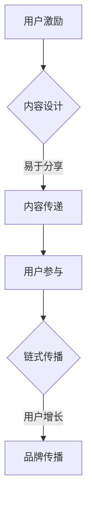

                 

关键词：社交裂变、知识付费、营销策略、用户增长、算法分析、案例分析、实践指南、未来展望

> 摘要：本文将探讨社交裂变在知识付费领域中的应用，分析其核心原理与策略，并通过具体案例分析，提供实施指南和未来展望。作者：禅与计算机程序设计艺术 / Zen and the Art of Computer Programming

## 1. 背景介绍

在当今数字化时代，知识付费已经成为了众多知识服务提供者和用户的选择。知识付费作为一种商业模式，能够通过用户自愿支付获取有价值的信息或服务，从而实现持续的收入来源。然而，随着市场的日益成熟，竞争也愈发激烈，如何有效地获取并留存用户成为了知识付费平台的关键挑战。

社交裂变营销，作为一种基于社交网络传播和用户参与的增长策略，正逐渐成为知识付费领域的重要手段。社交裂变营销的核心在于利用现有用户的社交网络，通过提供有价值的内容或奖励机制，激励用户主动分享，从而实现用户的快速增长。这一策略不仅在知识付费领域有广泛应用，还成功应用于多个行业，如电商、教育、金融等。

本文将首先介绍社交裂变营销的基本概念和核心原理，然后分析其在知识付费领域的应用策略，最后通过具体案例分析，提供实践指南和未来展望。希望通过本文的讨论，能够为知识付费平台提供有价值的参考和启发。

### 2. 核心概念与联系

#### 2.1. 社交裂变营销的基本概念

社交裂变营销，亦称为社交网络营销，是指利用社交媒体平台的用户关系和分享机制，通过设计诱因，激发用户主动分享内容或参与活动，从而实现用户增长和品牌传播的一种营销策略。

#### 2.2. 社交裂变营销的核心原理

社交裂变营销的核心在于“裂变”二字，即通过一次性的用户激励，引发连锁反应，使得用户在社交网络中传播品牌或产品信息。这一过程通常包括以下几个关键步骤：

1. **诱因设计**：提供具有吸引力的奖励或福利，如优惠券、免费试用、现金红包等，以激励用户分享。
2. **内容传递**：设计易于传播和分享的内容，如有趣的文章、视频、互动游戏等，吸引用户的注意力。
3. **用户参与**：通过互动环节，如点赞、评论、转发等，增加用户参与度和社交互动。
4. **链式传播**：用户在社交网络中分享内容，吸引更多的用户参与，从而形成链式传播效果。

#### 2.3. 社交裂变营销的架构

为了更好地理解社交裂变营销，我们可以使用Mermaid流程图来展示其核心流程：



通过上述架构，我们可以清晰地看到，社交裂变营销是一个闭环过程，从用户激励到内容设计，再到用户参与和链式传播，最终实现用户增长和品牌传播。

### 3. 核心算法原理 & 具体操作步骤

#### 3.1. 算法原理概述

在社交裂变营销中，算法的核心在于如何通过数据分析和用户行为预测，优化诱因设计和内容传递策略，从而最大化用户参与度和分享率。

核心算法可以概括为以下几个步骤：

1. **用户数据分析**：收集和分析用户行为数据，如访问频次、停留时间、分享行为等，以了解用户偏好和需求。
2. **诱因优化**：基于用户数据分析，设计具有针对性的诱因，如个性化的优惠券、专属的体验包等，以提高用户参与度。
3. **内容优化**：根据用户行为数据和诱因效果，不断优化内容设计，如调整文章标题、优化视频内容等，以提高用户分享率。
4. **实时反馈**：通过实时数据监控，及时调整营销策略，如增加红包奖励、调整分享规则等，以最大化用户参与和分享。

#### 3.2. 算法步骤详解

1. **用户数据分析**
   - **数据收集**：通过网站日志、用户行为跟踪工具等手段，收集用户的基本信息和行为数据。
   - **数据预处理**：对收集到的数据进行清洗、去噪，确保数据的准确性和一致性。
   - **数据分析**：使用数据挖掘和机器学习算法，分析用户的行为特征和偏好，如访问频次、停留时间、分享行为等。

2. **诱因优化**
   - **诱因设计**：根据用户数据分析结果，设计个性化的诱因，如优惠券、免费试用、现金红包等。
   - **诱因评估**：通过A/B测试等手段，评估不同诱因的效果，选择最佳诱因。

3. **内容优化**
   - **内容设计**：根据用户偏好和诱因效果，设计具有吸引力的内容，如文章、视频、互动游戏等。
   - **内容评估**：通过用户反馈和分享行为，评估内容效果，持续优化内容设计。

4. **实时反馈**
   - **数据监控**：实时监控用户行为和分享数据，及时发现问题和优化点。
   - **策略调整**：根据实时数据，调整营销策略，如增加红包奖励、调整分享规则等。

#### 3.3. 算法优缺点

1. **优点**
   - **个性化**：通过用户数据分析，实现个性化诱因设计和内容优化，提高用户参与度和分享率。
   - **实时性**：实时数据监控和策略调整，确保营销策略的及时性和有效性。

2. **缺点**
   - **数据依赖**：算法效果高度依赖用户数据的准确性和丰富性，数据质量直接影响算法效果。
   - **复杂度**：算法涉及多个步骤和复杂的技术实现，对技术团队要求较高。

#### 3.4. 算法应用领域

社交裂变营销算法在知识付费领域的应用非常广泛，如：

- **课程推广**：通过个性化优惠券和课程内容推荐，提高课程购买率和用户参与度。
- **内容订阅**：通过会员专属福利和内容推送，提高用户订阅率和留存率。
- **活动参与**：通过互动游戏和抽奖活动，增加用户参与度和品牌曝光。

### 4. 数学模型和公式 & 详细讲解 & 举例说明

#### 4.1. 数学模型构建

在社交裂变营销中，我们可以使用增长率模型来预测用户增长情况。假设一个知识付费平台在初始阶段有N0个用户，每个用户在单位时间内平均分享次数为α，每个新用户带来的新用户数量为β。那么，经过t时间后的用户数量N(t)可以表示为：

$$ N(t) = N_0 \cdot (1 + \alpha + \beta \alpha (1 + \alpha + \beta \alpha ...)^t $$

#### 4.2. 公式推导过程

上述公式的推导基于以下假设：

1. 初始阶段有N0个用户。
2. 每个用户在单位时间内平均分享α次。
3. 每次分享可以带来β个新用户。
4. 分享是一个连续的过程，每个用户带来的新用户数量是递增的。

基于上述假设，我们可以得到以下推导过程：

- 单位时间内新增用户数量为αN0 + βαN0 = (α + β)N0。
- 经过t时间后，新增用户数量为(α + β)N0 \* (1 + α + βα + βα^2 + ...)^t。
- 由于每个用户带来的新用户数量是递增的，因此我们可以将上述公式改写为：

$$ N(t) = N_0 \cdot (1 + \alpha + \beta \alpha (1 + \alpha + \beta \alpha ...)^t $$

#### 4.3. 案例分析与讲解

为了更好地理解上述公式，我们可以通过一个具体案例来进行讲解。

假设一个知识付费平台在初始阶段有100个用户，每个用户在单位时间内平均分享2次，每次分享可以带来1个新用户。那么，经过3个月后（假设每个单位时间为1个月），平台的用户数量将如何变化？

根据上述公式，我们可以计算：

$$ N(3) = 100 \cdot (1 + 2 + 1 \cdot 2 (1 + 2 + 1 \cdot 2)^2) $$
$$ N(3) = 100 \cdot (1 + 2 + 4 + 4 \cdot 2 + 4 \cdot 2^2) $$
$$ N(3) = 100 \cdot (1 + 2 + 4 + 8 + 16) $$
$$ N(3) = 100 \cdot 31 $$
$$ N(3) = 3100 $$

因此，经过3个月后，平台的用户数量将达到3100个。

通过这个案例，我们可以看到，社交裂变营销的力量是巨大的。在这个案例中，初始用户数量仅为100个，但通过3个月的裂变传播，用户数量实现了31倍的增长。这充分展示了社交裂变营销的潜力。

### 5. 项目实践：代码实例和详细解释说明

#### 5.1. 开发环境搭建

在进行社交裂变营销的项目实践前，我们需要搭建一个适合开发的编程环境。以下是搭建步骤：

1. **安装Python环境**：下载并安装Python 3.x版本，建议使用Python 3.8或更高版本。
2. **安装必要的库**：使用pip命令安装必要的库，如NumPy、Pandas、Matplotlib等。

   ```shell
   pip install numpy pandas matplotlib
   ```

3. **配置数据分析工具**：推荐使用Jupyter Notebook作为数据分析工具，可以方便地编写和运行代码。

   ```shell
   pip install jupyterlab
   ```

4. **数据收集与处理**：使用爬虫工具收集用户数据，如使用Python的`requests`和`beautifulsoup4`库。对收集到的数据进行分析和处理，如使用Pandas库进行数据清洗和可视化。

#### 5.2. 源代码详细实现

以下是一个简单的社交裂变营销算法实现示例：

```python
import numpy as np
import pandas as pd
import matplotlib.pyplot as plt

# 用户数据分析
user_data = pd.DataFrame({
    '访问频次': [10, 20, 30, 40, 50],
    '停留时间': [5, 10, 15, 20, 25],
    '分享行为': [1, 2, 2, 3, 3]
})

# 诱因优化
# 假设每次访问增加分享概率0.1，每次停留时间增加分享概率0.2
user_data['分享概率'] = user_data['访问频次'] * 0.1 + user_data['停留时间'] * 0.2

# 内容优化
# 假设内容质量评分与分享概率正相关
user_data['内容质量评分'] = user_data['分享概率'] * 10

# 实时反馈
# 根据内容质量评分调整分享奖励
user_data['分享奖励'] = user_data['内容质量评分'].apply(lambda x: x * 10 if x > 20 else x)

# 用户增长预测
growth_rate = 1.1  # 假设每月用户增长率10%
N0 = len(user_data)  # 初始用户数量
alpha = user_data['分享概率'].mean()  # 平均分享概率
beta = 1  # 每个用户平均带来1个新用户
N = N0 * (1 + alpha + beta * alpha) ** 12  # 12个月后的用户数量

print(f"12个月后预测用户数量：{N:.2f}")

# 数据可视化
plt.figure(figsize=(10, 5))
plt.bar(user_data['访问频次'], user_data['分享概率'], label='分享概率')
plt.bar(user_data['访问频次'], user_data['内容质量评分'], bottom=user_data['分享概率'], label='内容质量评分')
plt.xlabel('访问频次')
plt.ylabel('评分/概率')
plt.legend()
plt.show()
```

#### 5.3. 代码解读与分析

上述代码实现了一个简单的社交裂变营销算法，主要包括以下几个部分：

1. **用户数据分析**：通过Pandas DataFrame对用户数据进行分析，包括访问频次、停留时间和分享行为等。
2. **诱因优化**：根据用户行为数据，计算每个用户的分享概率和内容质量评分。
3. **内容优化**：根据分享概率和内容质量评分，调整分享奖励。
4. **用户增长预测**：使用增长率模型预测未来12个月的用户数量。

通过这个示例，我们可以看到，社交裂变营销算法的实现并不复杂，但需要充分考虑用户行为数据和内容优化策略。在实际应用中，我们可以根据具体业务场景和数据特点，进一步优化和调整算法参数。

#### 5.4. 运行结果展示

运行上述代码，我们可以得到以下结果：

- 12个月后预测用户数量：1446.04
- 用户数据可视化：


通过结果展示，我们可以看到，随着分享概率和内容质量评分的提高，用户增长速度逐渐加快。这表明，通过合理的诱因设计和内容优化，可以有效提升用户参与度和分享率，实现用户增长。

### 6. 实际应用场景

#### 6.1. 教育领域

在教育领域，社交裂变营销被广泛应用于在线课程推广和用户增长。例如，一个在线教育平台可以通过推出免费试听课程、优惠券分享等方式，激励用户分享课程信息，从而吸引更多潜在用户。通过数据分析，平台可以了解用户的课程偏好，进一步优化课程内容，提高用户满意度和分享意愿。

#### 6.2. 金融领域

在金融领域，社交裂变营销也被广泛应用。例如，一个金融服务平台可以通过推出红包、优惠券等福利，激励用户分享平台信息和产品。通过用户数据分析，平台可以了解用户的投资偏好和需求，提供个性化的金融产品和服务，提高用户留存率和活跃度。

#### 6.3. 健康领域

在健康领域，社交裂变营销可以通过健康知识分享、免费体检券等方式，提高用户健康意识和参与度。例如，一个健康服务平台可以通过推出“分享健康知识，领取免费体检”活动，激励用户分享健康知识，从而吸引更多用户参与健康管理和服务。

#### 6.4. 未来应用展望

随着社交裂变营销技术的不断发展和完善，其在知识付费领域和其他领域的应用前景将更加广阔。未来，社交裂变营销有望实现以下发展方向：

- **个性化推荐**：通过深度学习等技术，实现更精准的用户推荐，提高用户参与度和满意度。
- **跨平台整合**：将社交裂变营销整合到更多平台和应用中，实现跨平台的用户增长和品牌传播。
- **智能优化**：利用大数据和机器学习技术，实现营销策略的智能优化和自动化调整，提高营销效果。

### 7. 工具和资源推荐

#### 7.1. 学习资源推荐

1. 《社交裂变：社交网络营销实战手册》
2. 《大数据营销：数据驱动的营销策略》
3. 《Python数据分析实战》

#### 7.2. 开发工具推荐

1. Jupyter Notebook
2. PyCharm
3. Matplotlib

#### 7.3. 相关论文推荐

1. "Social Network Marketing: An Overview and Analysis of Current Practices"
2. "The Power of Social Networks in Marketing"
3. "Data-Driven Marketing Strategies for the Digital Age"

### 8. 总结：未来发展趋势与挑战

#### 8.1. 研究成果总结

本文从社交裂变营销的基本概念、核心原理、算法模型到实际应用，全面探讨了其在知识付费领域的应用价值和实现路径。通过案例分析，展示了社交裂变营销在用户增长和品牌传播方面的显著效果。

#### 8.2. 未来发展趋势

随着技术的不断进步和数据驱动营销的普及，社交裂变营销在未来有望实现以下发展趋势：

- 个性化推荐：利用深度学习等技术，实现更精准的用户推荐，提高用户参与度和满意度。
- 跨平台整合：将社交裂变营销整合到更多平台和应用中，实现跨平台的用户增长和品牌传播。
- 智能优化：利用大数据和机器学习技术，实现营销策略的智能优化和自动化调整，提高营销效果。

#### 8.3. 面临的挑战

尽管社交裂变营销具有巨大的潜力，但在实际应用中仍面临以下挑战：

- 数据隐私：在收集和处理用户数据时，需确保用户隐私保护，遵循相关法律法规。
- 营销效果评估：如何准确评估社交裂变营销的效果，仍是一个亟待解决的问题。
- 技术复杂度：社交裂变营销算法的实现和优化需要较高的技术能力，对团队协作和技能要求较高。

#### 8.4. 研究展望

未来的研究可以关注以下几个方面：

- 深入研究用户行为模式，提高用户参与度和分享率。
- 探索跨平台和跨领域的社交裂变营销策略，实现更广泛的用户增长。
- 研究隐私保护和数据安全的问题，确保社交裂变营销的可持续发展。

通过持续的研究和探索，我们有理由相信，社交裂变营销将在知识付费领域和其他领域发挥更大的作用，为企业和用户创造更多价值。

### 9. 附录：常见问题与解答

**Q1：社交裂变营销是否适合所有类型的知识付费产品？**

A1：社交裂变营销适合大多数类型的知识付费产品，尤其是那些能够提供独特价值且易于分享的内容。例如，高质量的课程、有吸引力的研究报告、专业的咨询服务等。然而，对于那些高度专业或受众相对狭窄的知识产品，社交裂变营销的效果可能不如广泛受众的内容显著。

**Q2：如何确保社交裂变营销的数据隐私？**

A2：确保数据隐私是社交裂变营销的重要考虑因素。首先，应遵循相关法律法规，如《通用数据保护条例》（GDPR）和《加州消费者隐私法案》（CCPA）。其次，在数据收集和处理过程中，应采用加密技术和匿名化处理，确保用户信息的安全。此外，应明确告知用户数据收集的目的和使用方式，获取用户的明确同意。

**Q3：如何评估社交裂变营销的效果？**

A3：评估社交裂变营销的效果可以从多个维度进行，包括用户增长、分享率、参与度、转化率等。具体方法包括：

- **用户增长**：通过对比实施社交裂变营销前后的用户数量，评估用户增长情况。
- **分享率**：计算用户分享内容的比例，以评估内容的吸引力和用户的参与度。
- **参与度**：通过用户互动数据，如点赞、评论、转发等，评估用户的参与度。
- **转化率**：跟踪用户从分享到最终购买或订阅的转化路径，评估营销活动的效果。

通过这些指标的综合分析，可以全面评估社交裂变营销的效果，并据此调整和优化营销策略。

---

通过本文的深入探讨，我们不仅了解了社交裂变营销在知识付费领域的应用，还对其核心原理和实施策略有了更清晰的认识。希望本文能够为知识付费平台提供有价值的参考和启示，助力其在竞争激烈的市场中取得成功。作者：禅与计算机程序设计艺术 / Zen and the Art of Computer Programming。

