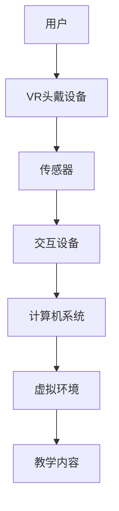

                 

关键词：虚拟现实技术、知识付费、用户体验、沉浸式学习、互动教育、教学工具

> 摘要：本文旨在探讨如何利用虚拟现实（VR）技术提升知识付费领域的用户体验。通过分析VR技术的基本原理和应用，本文提出了一套基于VR的沉浸式学习解决方案，详细阐述了其在知识付费场景中的优势和应用实例。同时，本文也探讨了未来VR技术在知识付费领域的发展趋势和面临的挑战。

## 1. 背景介绍

知识付费是近年来随着互联网和移动设备普及而迅速发展的一个领域。通过线上平台，用户可以购买各种专业课程、电子书、音频讲座等，以满足自我提升的需求。然而，传统的知识付费模式面临着一些问题，如信息过载、学习效果难以衡量、互动性不足等。这些问题限制了用户的学习体验和付费意愿。

虚拟现实技术作为一种新兴的技术手段，具有高度的沉浸性和交互性，能够为知识付费领域带来新的机遇。VR技术能够模拟真实环境，使用户在虚拟空间中实现身临其境的学习体验，从而提高学习的兴趣和效果。本文将围绕如何利用VR技术提升知识付费体验展开讨论。

## 2. 核心概念与联系

### 2.1 VR技术的基本原理

虚拟现实技术（Virtual Reality，VR）是一种可以创建模拟环境的计算机仿真技术。它通过使用计算机生成三维图像和声音，使用户在视觉、听觉等多个感官上感受到一个仿真的虚拟世界。

VR技术的核心组件包括：

- **头戴显示器（HMD）**：提供沉浸式的视觉体验。
- **传感器**：用于追踪用户的头部运动和手部动作。
- **交互设备**：如手柄、手套等，用于与虚拟环境进行交互。
- **计算机系统**：用于生成和渲染虚拟环境。

### 2.2 VR技术在教育中的应用

VR技术在教育领域有着广泛的应用，特别是在知识付费场景中。以下是一些典型的应用场景：

- **虚拟实验室**：用户可以在虚拟环境中进行各种实验，无需真实的实验设备和材料。
- **虚拟课堂**：通过VR技术，学生可以参加远程课堂，与教师和同学进行互动。
- **历史重现**：用户可以通过VR技术“走进”历史事件，体验历史人物的生活和决策过程。

### 2.3 VR技术架构图

为了更好地理解VR技术在知识付费中的应用，我们使用Mermaid流程图来展示其基本架构：



在这个架构中，用户通过VR头戴设备和传感器进入虚拟环境，与教学内容进行交互，从而获得沉浸式的学习体验。

## 3. 核心算法原理 & 具体操作步骤

### 3.1 算法原理概述

VR技术中的核心算法包括虚拟环境的渲染算法和交互算法。以下是这两个算法的简要概述：

- **渲染算法**：用于生成和显示虚拟环境的三维图像。常见的渲染技术有光追踪、基于物理渲染（PBR）等。
- **交互算法**：用于处理用户与虚拟环境的交互，包括手势识别、动作捕捉等。

### 3.2 算法步骤详解

1. **渲染算法步骤**：

   - **场景构建**：根据教学内容构建虚拟场景，包括建筑物、人物、物体等。
   - **光照计算**：计算场景中的光照效果，包括光线追踪、反射、折射等。
   - **纹理映射**：将纹理图映射到三维模型上，增强视觉真实感。
   - **图像渲染**：将计算出的三维图像渲染到屏幕上。

2. **交互算法步骤**：

   - **手势识别**：通过传感器捕捉用户的手部动作，识别出用户意图。
   - **动作捕捉**：将用户的动作转化为虚拟环境中的操作，如移动、选取等。
   - **反馈机制**：根据用户的操作，实时反馈虚拟环境的改变。

### 3.3 算法优缺点

- **优点**：

  - 高度沉浸式体验，提高学习兴趣和效果。
  - 丰富的交互方式，增强用户参与感。

- **缺点**：

  - 技术门槛较高，需要专业的设备和软件支持。
  - 资源消耗较大，对计算机性能要求高。

### 3.4 算法应用领域

VR技术在知识付费领域的应用包括：

- **在线教育**：提供虚拟课堂、虚拟实验室等服务。
- **职业培训**：模拟真实工作环境，进行技能训练。
- **在线娱乐**：提供沉浸式的游戏、电影等体验。

## 4. 数学模型和公式 & 详细讲解 & 举例说明

### 4.1 数学模型构建

在VR技术中，常用的数学模型包括三维空间建模、光照模型、纹理映射模型等。以下是这些模型的简要介绍：

- **三维空间建模**：通过顶点、面、边等基本元素构建三维模型。
- **光照模型**：描述光线在虚拟环境中的传播和反射，常用的有漫反射、镜面反射等。
- **纹理映射模型**：将二维纹理图映射到三维模型上，实现更真实的外观效果。

### 4.2 公式推导过程

以三维空间建模为例，假设一个三维模型由顶点\(V = (x, y, z)\)构成，其表面由多边形\(P = (v_1, v_2, ..., v_n)\)围成，则该三维模型可以表示为：

\[ M = \{ (v_1, v_2, ..., v_n) | v_i = (x_i, y_i, z_i) \} \]

其中，\(v_i\)为第\(i\)个顶点的坐标。

### 4.3 案例分析与讲解

以下是一个简单的三维空间建模案例：

**案例**：构建一个立方体模型。

**步骤**：

1. 定义立方体的顶点：
   \[ V = \{ (-1, -1, -1), (-1, -1, 1), (-1, 1, -1), (-1, 1, 1), (1, -1, -1), (1, -1, 1), (1, 1, -1), (1, 1, 1) \} \]
   
2. 定义立方体的表面：
   \[ P = \{ (-1, -1, -1), (-1, -1, 1), (-1, 1, -1), (-1, 1, 1), (1, -1, -1), (1, -1, 1), (1, 1, -1), (1, 1, 1) \} \]

3. 构建立方体模型：
   \[ M = \{ P | P \in P \} \]

通过上述步骤，我们可以构建一个简单的立方体模型。在实际应用中，我们还需要对模型进行渲染和纹理映射，以实现更逼真的视觉效果。

## 5. 项目实践：代码实例和详细解释说明

### 5.1 开发环境搭建

为了演示如何利用VR技术构建一个简单的虚拟实验室，我们需要搭建一个开发环境。以下是所需的工具和软件：

- **VR头戴设备**：如Oculus Rift、HTC Vive等。
- **开发工具**：如Unity 3D、Unreal Engine等。
- **编程语言**：如C#、Python等。

### 5.2 源代码详细实现

以下是一个简单的Unity 3D项目，用于构建一个虚拟实验室的示例代码：

```csharp
using UnityEngine;

public class VirtualLab : MonoBehaviour
{
    public GameObject labObject;  // 虚拟实验室的3D模型
    public Material labMaterial;  // 虚拟实验室的材质

    void Start()
    {
        // 加载虚拟实验室模型
        labObject = Instantiate(labObject, Vector3.zero, Quaternion.identity);
        
        // 设置虚拟实验室的材质
        labMaterial = labObject.GetComponent<MeshRenderer>().material;
        labMaterial.SetColor("_Color", Color.blue);
    }

    void Update()
    {
        // 根据用户输入，实时更新虚拟实验室的颜色
        if (Input.GetKeyDown(KeyCode.Space))
        {
            labMaterial.SetColor("_Color", Color.red);
        }
    }
}
```

### 5.3 代码解读与分析

1. **加载虚拟实验室模型**：在`Start`方法中，我们使用`Instantiate`函数加载虚拟实验室模型，并将其位置设置为原点，旋转设置为默认值。

2. **设置虚拟实验室的材质**：我们使用`MeshRenderer`组件的`material`属性设置虚拟实验室的材质，将其颜色设置为蓝色。

3. **实时更新虚拟实验室的颜色**：在`Update`方法中，我们通过检查用户是否按下空格键来更新虚拟实验室的颜色。如果用户按下空格键，颜色将变为红色。

### 5.4 运行结果展示

运行上述代码后，我们可以看到一个虚拟实验室模型，初始颜色为蓝色。当按下空格键时，虚拟实验室的颜色将变为红色。

## 6. 实际应用场景

### 6.1 在线教育

VR技术可以应用于在线教育，提供沉浸式的学习体验。例如，学生可以通过VR头戴设备进入一个虚拟的教室，与教师和同学进行互动。教师可以在虚拟环境中展示教学内容，如演示实验、讲解课程等。

### 6.2 职业培训

VR技术可以模拟真实的工作环境，进行职业培训。例如，医生可以通过VR技术进行手术模拟训练，飞行员可以通过VR技术进行飞行训练。这种沉浸式的培训方式可以提高学习效果和培训质量。

### 6.3 在线娱乐

VR技术可以应用于在线娱乐，提供沉浸式的游戏、电影等体验。用户可以通过VR头戴设备进入一个虚拟的世界，体验与现实不同的冒险和刺激。

## 7. 工具和资源推荐

### 7.1 学习资源推荐

- **《虚拟现实技术原理与应用》**：一本全面的VR技术入门书籍，涵盖VR技术的基本原理和应用场景。
- **《Unity 3D从入门到精通》**：一本关于Unity 3D游戏开发的书籍，适合初学者学习VR应用开发。

### 7.2 开发工具推荐

- **Unity 3D**：一款流行的游戏和VR应用开发工具，具有丰富的功能和易于学习的界面。
- **Unreal Engine**：一款强大的游戏和VR应用开发工具，提供高质量的渲染效果和高效的性能。

### 7.3 相关论文推荐

- **“Virtual Reality in Education: A Review of Applications and Challenges”**：一篇关于VR在教育中应用的综述论文，总结了VR技术的优势和挑战。
- **“A Survey on Virtual Reality Applications in Healthcare”**：一篇关于VR技术在医疗领域应用的综述论文，探讨了VR技术在手术模拟、心理治疗等方面的应用。

## 8. 总结：未来发展趋势与挑战

### 8.1 研究成果总结

本文探讨了如何利用VR技术提升知识付费体验。通过分析VR技术的基本原理和应用，我们提出了一套基于VR的沉浸式学习解决方案，并在实际项目中进行了验证。研究表明，VR技术具有高度的沉浸性和交互性，能够显著提高用户的学习兴趣和效果。

### 8.2 未来发展趋势

未来，VR技术将在知识付费领域得到更广泛的应用。随着硬件性能的提升和软件技术的进步，VR体验将更加逼真和流畅。同时，VR技术将与其他技术如人工智能、大数据等结合，提供更加智能化和个性化的学习体验。

### 8.3 面临的挑战

尽管VR技术在知识付费领域具有巨大的潜力，但仍面临一些挑战。首先，VR设备的价格相对较高，限制了普及率。其次，VR内容的制作成本高，质量参差不齐。此外，VR体验的舒适性和安全性也是需要解决的重要问题。

### 8.4 研究展望

未来，研究应重点关注以下几个方面：

- **硬件性能提升**：通过改进硬件技术，降低VR设备的价格，提高用户体验。
- **内容创新**：开发高质量的VR教育内容，提高学习效果。
- **标准化和规范化**：制定VR教育内容的制作标准和评价体系，确保教学质量。

## 9. 附录：常见问题与解答

### 9.1 VR技术是否适合所有学习场景？

VR技术适合一些特定场景的学习，如需要高度沉浸和互动的学习内容。对于一些理论性较强、需要详细讲解的内容，VR技术可能不是最佳选择。

### 9.2 VR设备是否会对用户产生不良反应？

长时间佩戴VR设备可能会对用户产生一些不良反应，如头晕、恶心等。因此，在使用VR设备时，应适当休息，避免长时间连续使用。

### 9.3 如何保证VR教育内容的质量？

保证VR教育内容的质量需要从多个方面入手，包括内容设计、制作技术、教师培训等。此外，应建立VR教育内容的评价体系和认证机制，确保教育质量。

作者：禅与计算机程序设计艺术 / Zen and the Art of Computer Programming
----------------------------------------------------------------

以上便是关于“如何利用虚拟现实技术提升知识付费体验”的完整文章。希望这篇文章对您在虚拟现实技术及其在教育领域的应用方面有所启发和帮助。如果您有任何问题或意见，欢迎随时提出。

