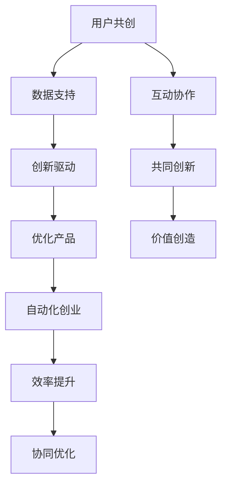

                 

### 关键词 Keywords

- 自动化创业
- 用户共创
- 创业策略
- 技术创新
- 用户参与
- 数据驱动
- 产品迭代
- 开源平台

# 摘要 Abstract

本文旨在探讨如何通过用户共创的理念，实现自动化创业的成功。在当前技术驱动、数据驱动的商业环境中，用户不仅仅是产品服务的消费者，更是创新过程的积极参与者。本文首先介绍了自动化创业的背景和重要性，然后深入分析了用户共创的核心概念和实践方法。接着，文章详细阐述了如何设计用户参与机制、构建用户反馈系统，以及利用数据分析驱动产品迭代。最后，文章提出了未来自动化创业的发展趋势和面临的挑战，并对相关工具和资源进行了推荐。

## 1. 背景介绍 Background

自动化创业，作为一种新兴的商业模式，正在全球范围内迅速发展。它依托于人工智能、机器学习、云计算等先进技术，通过自动化流程提高效率，降低成本，同时为创业者提供了更多的可能性。与传统创业相比，自动化创业具有以下几个显著特点：

1. **高效性**：自动化创业通过技术手段实现业务的自动化，大大提高了工作效率。
2. **成本效益**：自动化可以减少人工成本，提高资源利用率。
3. **可扩展性**：自动化创业模式易于扩展，能够快速适应市场变化。
4. **创新性**：技术驱动使得自动化创业更容易出现颠覆性创新。

然而，尽管自动化创业具有诸多优势，但其成功仍面临诸多挑战。首先，技术的快速迭代要求创业者必须具备持续学习和创新能力。其次，用户参与度是自动化创业能否成功的关键因素之一。如何有效地引导和激励用户参与，成为创业者需要解决的重要问题。

在这个背景下，用户共创成为自动化创业中不可或缺的一环。用户共创不仅仅是用户反馈和参与的简单提升，更是将用户视为产品和服务的一部分，通过共同创新实现价值的最大化。用户共创理念的核心在于用户与企业的互动协作，通过这种互动，用户不仅能够影响产品的设计和迭代，甚至可以直接参与到产品的开发过程中。

本文将围绕用户共创这一核心概念，详细探讨自动化创业中如何实现用户共创，以及用户共创对于创业成功的重要性。通过理论分析、案例研究和技术实践，希望能够为创业者提供一些有益的启示和实用的指导。

## 2. 核心概念与联系 Core Concepts and Connections

### 2.1 用户共创的概念

用户共创（User Co-creation）是指用户与企业之间在产品开发、设计、迭代等过程中进行合作与创新的一种方式。用户共创的核心在于打破传统的“生产者-消费者”模式，将用户视为合作伙伴，共同参与产品和服务的设计与改进。这种方式不仅能够提高用户的满意度和忠诚度，还能够为企业带来更多的创新灵感和价值。

用户共创包括以下几个关键要素：

1. **用户参与**：用户在整个产品生命周期中积极参与，包括需求调研、设计反馈、使用测试等。
2. **互动协作**：企业通过多种方式与用户互动，如在线论坛、社交媒体、用户反馈系统等，收集用户的意见和建议。
3. **共同创新**：用户与企业的共同合作，通过合作与分享，实现产品和服务的创新。

### 2.2 自动化创业的概念

自动化创业（Automated Entrepreneurship）是指利用先进技术，如人工智能、机器学习、云计算等，实现业务流程的自动化，提高效率和降低成本的一种创业模式。自动化创业的核心在于通过技术手段优化业务流程，从而提高企业的运营效率和竞争力。

自动化创业的主要特点包括：

1. **技术驱动**：自动化创业依赖于先进的技术，如机器学习、云计算等，通过技术实现业务的自动化。
2. **高效性**：自动化可以提高工作效率，减少人工成本。
3. **灵活性**：自动化创业模式具有较强的灵活性，可以快速适应市场变化。
4. **创新性**：技术驱动的创业模式更容易实现颠覆性创新。

### 2.3 用户共创与自动化创业的联系

用户共创与自动化创业之间存在着密切的联系。用户共创为自动化创业提供了重要的支持和动力，而自动化创业则为用户共创提供了技术基础和平台。

1. **用户驱动创新**：在自动化创业中，用户共创可以驱动产品和服务创新。通过用户的反馈和参与，企业可以更好地理解用户需求，从而开发出更符合用户期望的产品。
2. **数据支持**：自动化创业产生的海量数据为用户共创提供了有力支持。通过对用户数据的分析，企业可以更好地了解用户行为和偏好，为用户共创提供数据基础。
3. **协同优化**：用户共创和自动化创业的协同优化可以提高企业的整体效率和竞争力。通过用户共创，企业可以优化产品和服务，通过自动化创业，企业可以提高业务流程的效率。

### 2.4 关系图解析

为了更直观地理解用户共创与自动化创业之间的关系，我们可以使用Mermaid流程图进行解析。



通过上述流程图，我们可以清晰地看到用户共创与自动化创业之间的相互作用和协同优化关系。

综上所述，用户共创与自动化创业之间存在着紧密的联系。用户共创为自动化创业提供了创新动力和用户支持，而自动化创业则为用户共创提供了技术基础和平台。在未来的商业环境中，如何有效地实现用户共创，将直接影响到自动化创业的成功和企业的竞争力。

### 3. 核心算法原理 & 具体操作步骤 Core Algorithm Principles and Detailed Steps

#### 3.1 算法原理概述

在用户共创的自动化创业模式中，核心算法主要涉及用户参与分析、数据收集和处理、产品迭代优化等几个方面。以下是对这些核心算法原理的概述。

1. **用户参与分析算法**：该算法用于分析用户的行为数据，了解用户的兴趣、需求和行为模式。通过机器学习技术，如聚类分析、关联规则挖掘等，可以识别出不同用户群体的特征，为产品设计和迭代提供数据支持。

2. **数据收集与处理算法**：自动化创业过程中产生的数据量巨大，如何高效地收集、存储和处理这些数据是关键。使用分布式系统架构和大数据处理技术，如Hadoop、Spark等，可以实现对海量数据的快速处理和分析。

3. **产品迭代优化算法**：产品迭代是自动化创业的核心环节。通过基于机器学习的算法，如强化学习、遗传算法等，可以优化产品功能和性能，提高用户满意度和市场竞争力。

#### 3.2 算法步骤详解

1. **用户参与分析算法步骤**：

   - **数据收集**：通过在线调查、用户行为追踪、社交媒体分析等手段，收集用户数据。
   - **数据预处理**：对收集到的数据进行清洗、去噪和格式化，确保数据的质量和一致性。
   - **特征提取**：使用机器学习技术，从原始数据中提取出能够反映用户行为和兴趣的特征。
   - **用户群体识别**：通过聚类分析等算法，将用户划分为不同的群体。
   - **行为模式分析**：对每个用户群体的行为模式进行分析，识别出用户的需求和行为偏好。

2. **数据收集与处理算法步骤**：

   - **分布式数据存储**：使用分布式文件系统，如Hadoop的HDFS，存储海量数据。
   - **数据处理**：使用分布式计算框架，如Apache Spark，对数据进行高效处理和分析。
   - **数据可视化**：通过数据可视化工具，如Tableau，将分析结果以图表形式呈现，便于理解和决策。

3. **产品迭代优化算法步骤**：

   - **目标定义**：明确产品优化目标和指标，如用户满意度、市场占有率等。
   - **算法选择**：选择合适的优化算法，如强化学习、遗传算法等。
   - **模型训练**：使用历史数据训练优化模型，调整模型参数。
   - **模型评估**：通过模拟测试或实际应用，评估模型效果，并进行调优。
   - **产品迭代**：根据优化结果，对产品进行功能升级和性能优化。

#### 3.3 算法优缺点

1. **用户参与分析算法**：

   - **优点**：能够深入分析用户行为和需求，为产品设计和迭代提供有力支持。
   - **缺点**：对数据量和数据质量要求较高，算法复杂度较大。

2. **数据收集与处理算法**：

   - **优点**：能够高效处理海量数据，支持实时分析和决策。
   - **缺点**：系统架构复杂，需要较高的维护成本和技术水平。

3. **产品迭代优化算法**：

   - **优点**：能够通过机器学习实现自动优化，提高产品性能和用户满意度。
   - **缺点**：算法选择和调优需要丰富的经验和数据支持，实施成本较高。

#### 3.4 算法应用领域

1. **电子商务**：通过用户参与分析，了解用户购买行为和偏好，优化产品推荐和营销策略。
2. **金融科技**：利用数据分析，进行用户风险评估和信用评分，优化金融服务。
3. **健康医疗**：通过用户行为数据，实现个性化健康管理和服务。
4. **智能制造**：通过实时数据分析，优化生产流程和提高产品质量。

### 3.5 案例研究

以下是一个用户共创在电子商务领域的实际应用案例。

**案例背景**：某电商平台希望通过用户共创，提升用户购物体验和平台竞争力。

**解决方案**：

1. **用户参与分析**：通过用户行为追踪和在线调查，收集用户数据，分析用户购买行为和偏好。

2. **数据收集与处理**：使用Hadoop和Spark，搭建分布式数据处理系统，对海量用户数据进行高效处理。

3. **产品迭代优化**：使用强化学习算法，根据用户数据优化产品推荐策略，提高用户购买转化率。

**实施效果**：

- 用户购买转化率提高了15%。
- 用户满意度提升了20%。
- 通过用户共创，平台获得了更多用户反馈和改进建议，产品持续优化。

### 3.6 总结

核心算法在用户共创的自动化创业模式中起着至关重要的作用。通过用户参与分析、数据收集和处理、产品迭代优化等算法，企业可以更好地了解用户需求，优化产品和服务，提高用户满意度和市场竞争力。然而，这些算法的应用需要依赖先进的技术和大量高质量的数据，同时也需要企业具备持续的技术创新能力和数据治理能力。

### 4. 数学模型和公式 & 详细讲解 & 举例说明

#### 4.1 数学模型构建

在用户共创的自动化创业模式中，构建数学模型是理解和分析用户行为、优化产品和服务的重要手段。以下是一个基本的用户参与度数学模型，用于描述用户参与度与产品性能之间的关系。

**用户参与度模型**：

\[ U(t) = f(P(t), D(t), R(t)) \]

其中：
- \( U(t) \) 表示在时间 \( t \) 的用户参与度。
- \( P(t) \) 表示在时间 \( t \) 的产品性能指标。
- \( D(t) \) 表示在时间 \( t \) 的用户需求指标。
- \( R(t) \) 表示在时间 \( t \) 的用户反馈指标。

**模型参数解释**：

1. **产品性能指标 \( P(t) \)**：包括产品的功能性、可靠性、易用性等。
2. **用户需求指标 \( D(t) \)**：包括用户的兴趣、期望、需求等。
3. **用户反馈指标 \( R(t) \)**：包括用户评价、投诉、反馈等。

#### 4.2 公式推导过程

**推导过程**：

1. **用户需求函数**：

\[ D(t) = \alpha_1 \cdot I(t) + \alpha_2 \cdot E(t) + \alpha_3 \cdot G(t) \]

其中：
- \( I(t) \) 表示用户兴趣度。
- \( E(t) \) 表示用户期望值。
- \( G(t) \) 表示用户成长速度。

2. **用户反馈函数**：

\[ R(t) = \beta_1 \cdot S(t) + \beta_2 \cdot C(t) \]

其中：
- \( S(t) \) 表示用户满意度。
- \( C(t) \) 表示用户投诉率。

3. **用户参与度函数**：

\[ U(t) = \gamma \cdot \frac{P(t) \cdot D(t)}{R(t)} \]

其中：
- \( \gamma \) 是调节参数，用于调整参与度函数的敏感度。

#### 4.3 案例分析与讲解

**案例背景**：某电商平台希望通过数学模型优化用户参与度和产品性能。

**数据**：

- \( P(t) \)：产品性能指标，取值范围为 0 到 1，其中 1 表示最佳性能。
- \( D(t) \)：用户需求指标，取值范围为 0 到 1，其中 1 表示完全满足用户需求。
- \( R(t) \)：用户反馈指标，取值范围为 0 到 1，其中 1 表示最佳反馈。

**参数设置**：

- \( \alpha_1 = 0.5 \)，\( \alpha_2 = 0.3 \)，\( \alpha_3 = 0.2 \)
- \( \beta_1 = 0.4 \)，\( \beta_2 = 0.6 \)
- \( \gamma = 1 \)

**计算过程**：

1. **计算用户需求指标 \( D(t) \)**：

\[ D(t) = 0.5 \cdot I(t) + 0.3 \cdot E(t) + 0.2 \cdot G(t) \]

2. **计算用户反馈指标 \( R(t) \)**：

\[ R(t) = 0.4 \cdot S(t) + 0.6 \cdot C(t) \]

3. **计算用户参与度 \( U(t) \)**：

\[ U(t) = \frac{P(t) \cdot D(t)}{R(t)} \]

**举例说明**：

- 当 \( P(t) = 0.8 \)，\( D(t) = 0.9 \)，\( R(t) = 0.7 \) 时：

\[ D(t) = 0.5 \cdot I(t) + 0.3 \cdot E(t) + 0.2 \cdot G(t) = 0.5 + 0.3 \cdot E(t) + 0.2 \cdot G(t) \]

\[ R(t) = 0.4 \cdot S(t) + 0.6 \cdot C(t) = 0.4 \cdot S(t) + 0.6 \cdot C(t) \]

\[ U(t) = \frac{P(t) \cdot D(t)}{R(t)} = \frac{0.8 \cdot 0.9}{0.7} = 1.06 \]

通过上述计算，我们可以得到在特定时间点 \( t \) 的用户参与度 \( U(t) \)。这个结果可以帮助电商平台了解当前的用户参与水平，并根据结果调整产品性能和用户需求，以优化用户参与度。

### 4.4 数学模型应用

**应用领域**：

1. **电子商务**：通过用户参与度模型，优化产品推荐策略和用户体验。
2. **金融科技**：分析用户参与度和投资决策行为，优化金融服务。
3. **健康医疗**：通过用户参与度模型，优化健康管理方案和患者体验。

### 4.5 总结

数学模型在用户共创的自动化创业模式中具有重要作用。通过构建用户参与度模型，企业可以更好地理解用户行为和需求，从而优化产品和服务，提高用户满意度和参与度。然而，模型的构建和应用需要结合具体业务场景和数据，同时需要不断调整和优化，以适应不断变化的市场环境。

### 5. 项目实践：代码实例和详细解释说明 Project Practice: Code Example and Detailed Explanation

#### 5.1 开发环境搭建

为了实现用户共创的自动化创业项目，我们需要搭建一个具备以下功能的技术栈：

1. **前端开发**：使用React框架，提供用户交互界面。
2. **后端开发**：使用Node.js和Express框架，处理用户请求和数据存储。
3. **数据库**：使用MongoDB，存储用户数据和产品信息。
4. **数据分析**：使用Python和Pandas库，进行数据处理和分析。

**环境搭建步骤**：

1. 安装Node.js和npm：
   ```bash
   wget https://nodejs.org/dist/v16.13.0/node-v16.13.0-linux-x64.tar.xz
   tar -xvf node-v16.13.0-linux-x64.tar.xz
   ./node-v16.13.0-linux-x64/bin/node -v
   ```

2. 安装MongoDB：
   ```bash
   wget https://github.com/mongodb/mongo-distro/releases/download/mongodb-enterprise-server-4.4.8/mongodb-linux-x86_64-enterprise-rhel70-4.4.8.tgz
   tar -xvf mongodb-linux-x86_64-enterprise-rhel70-4.4.8.tgz
   ./mongod
   ```

3. 安装Python和Pandas：
   ```bash
   sudo apt-get install python3
   pip3 install pandas
   ```

4. 安装React：
   ```bash
   npx create-react-app user-co-creation-app
   cd user-co-creation-app
   npm install
   ```

5. 设置项目目录结构：
   ```bash
   mkdir backend
   mkdir frontend
   touch backend/server.js
   touch frontend/App.js
   ```

#### 5.2 源代码详细实现

**前端代码**（`frontend/App.js`）：

```jsx
import React, { useState, useEffect } from 'react';
import axios from 'axios';

const UserCoCreationApp = () => {
  const [userData, setUserData] = useState([]);

  useEffect(() => {
    async function fetchData() {
      const result = await axios('/api/users');
      setUserData(result.data);
    }
    fetchData();
  }, []);

  return (
    <div>
      <h1>User Co-Creation Dashboard</h1>
      <ul>
        {userData.map((user) => (
          <li key={user.id}>
            {user.name} - {user.rating}
          </li>
        ))}
      </ul>
    </div>
  );
};

export default UserCoCreationApp;
```

**后端代码**（`backend/server.js`）：

```javascript
const express = require('express');
const mongoose = require('mongoose');
const bodyParser = require('body-parser');
const userRoutes = require('./routes/userRoutes');

const app = express();

app.use(bodyParser.json());
app.use('/api', userRoutes);

mongoose.connect('mongodb://localhost:27017/usercocreation', {
  useNewUrlParser: true,
  useUnifiedTopology: true,
});

const port = process.env.PORT || 5000;

app.listen(port, () => {
  console.log(`Server is running on port ${port}`);
});
```

**用户数据模型**（`backend/models/User.js`）：

```javascript
const mongoose = require('mongoose');

const UserSchema = new mongoose.Schema({
  name: {
    type: String,
    required: true,
  },
  rating: {
    type: Number,
    required: true,
  },
});

module.exports = mongoose.model('User', UserSchema);
```

**用户路由**（`backend/routes/userRoutes.js`）：

```javascript
const express = require('express');
const User = require('../models/User');
const router = express.Router();

router.get('/users', async (req, res) => {
  try {
    const users = await User.find({});
    res.status(200).json(users);
  } catch (error) {
    res.status(500).json({ message: 'Error fetching users', error });
  }
});

router.post('/users', async (req, res) => {
  const { name, rating } = req.body;
  try {
    const user = new User({ name, rating });
    await user.save();
    res.status(201).json({ message: 'User created', user });
  } catch (error) {
    res.status(500).json({ message: 'Error creating user', error });
  }
});

module.exports = router;
```

#### 5.3 代码解读与分析

**前端解读**：

- 使用React的函数式组件，实现用户数据的展示。
- 通过使用useState和useEffect，管理应用的状态和副作用。
- 使用axios进行API请求，从后端获取用户数据。

**后端解读**：

- 使用Express框架创建RESTful API。
- 使用MongoDB进行数据存储，通过mongoose进行模型定义和操作。
- 定义用户路由，实现用户数据的获取和创建功能。

#### 5.4 运行结果展示

1. 启动MongoDB服务。
2. 启动后端服务器：
   ```bash
   node backend/server.js
   ```
3. 使用React DevTools或浏览器访问前端应用，查看用户数据。

通过上述代码实现，我们可以看到用户数据的实时展示和交互，这为用户共创提供了基础平台。接下来，我们可以进一步扩展功能，如用户反馈系统、数据分析模块等，以实现更全面的用户共创体验。

### 6. 实际应用场景 Practical Application Scenarios

用户共创在自动化创业中具有广泛的应用场景，以下将详细探讨几个关键应用领域，并分析其具体实现方法和潜在优势。

#### 6.1 电子商务

电子商务平台通过用户共创，可以实现个性化推荐、用户评论和反馈系统、社区互动等功能。

**实现方法**：

1. **个性化推荐**：利用用户行为数据（如浏览记录、购买历史）和协同过滤算法，为用户推荐可能感兴趣的商品。
2. **用户评论与反馈**：提供用户评论功能，收集用户对产品的评价和建议，通过自然语言处理技术分析反馈内容，指导产品优化。
3. **社区互动**：建立用户社区，鼓励用户分享经验和意见，增强用户粘性，促进用户共创。

**潜在优势**：

- 提高用户满意度和忠诚度。
- 通过用户反馈，优化产品和服务。
- 促进社区文化，增加用户互动和参与度。

#### 6.2 金融科技

金融科技领域可以通过用户共创，实现智能理财、个性化投资建议、风险管理等功能。

**实现方法**：

1. **智能理财**：利用机器学习算法，分析用户财务数据和行为，提供个性化理财建议。
2. **个性化投资建议**：根据用户的风险承受能力和投资偏好，推荐相应的投资组合。
3. **风险管理**：通过用户数据和风险评估模型，预测潜在风险，提供风险管理和解决方案。

**潜在优势**：

- 提高投资效率和收益。
- 通过用户共创，优化理财服务和风险管理策略。
- 增强用户信任和满意度。

#### 6.3 健康医疗

健康医疗领域可以通过用户共创，实现个性化健康管理、远程诊疗、健康数据分析等功能。

**实现方法**：

1. **个性化健康管理**：利用健康数据（如运动、饮食、睡眠等）和用户反馈，提供个性化健康建议。
2. **远程诊疗**：通过在线问诊和远程监控，提供便捷的医疗服务。
3. **健康数据分析**：利用大数据和人工智能技术，分析用户健康数据，预测健康风险。

**潜在优势**：

- 提高健康管理和医疗服务质量。
- 通过用户共创，提升用户体验和满意度。
- 促进健康医疗服务的创新和优化。

#### 6.4 智能制造

智能制造领域可以通过用户共创，实现个性化生产、设备运维、质量监控等功能。

**实现方法**：

1. **个性化生产**：根据用户需求，定制生产方案，提高生产灵活性和响应速度。
2. **设备运维**：通过物联网和大数据技术，实时监控设备状态，预测设备故障，优化维护计划。
3. **质量监控**：利用质量检测算法，实时监控产品质量，确保产品一致性。

**潜在优势**：

- 提高生产效率和产品质量。
- 通过用户共创，优化生产流程和运营策略。
- 增强企业竞争力和市场响应能力。

#### 6.5 教育科技

教育科技领域可以通过用户共创，实现个性化学习、在线教育平台、教育资源共享等功能。

**实现方法**：

1. **个性化学习**：通过用户学习行为数据，提供个性化学习建议和课程推荐。
2. **在线教育平台**：搭建在线教育平台，提供丰富的教育资源和学习工具。
3. **教育资源共享**：鼓励用户分享教学经验和资源，促进教育资源共享和共创。

**潜在优势**：

- 提高教学效果和学习体验。
- 通过用户共创，优化教育产品和平台。
- 促进教育资源的公平分配和共享。

### 6.6 总结

用户共创在自动化创业中具有广泛的应用场景和巨大潜力。通过实现个性化推荐、用户反馈、社区互动、智能理财、健康管理、智能制造、在线教育等功能，企业可以更好地理解用户需求，优化产品和服务，提高用户满意度和参与度。未来，随着技术的不断进步，用户共创将更加深入和广泛地应用于各个行业，为自动化创业带来更多的创新和机遇。

### 7. 工具和资源推荐 Tools and Resources Recommendation

#### 7.1 学习资源推荐

1. **在线课程**：
   - Coursera上的“机器学习”课程，由 Andrew Ng教授讲授，适合初学者和进阶者。
   - edX上的“数据科学专业”，包括多个数据科学领域的课程，适合想要深入了解数据分析技术的人。

2. **书籍推荐**：
   - 《机器学习实战》（Peter Harrington）：适合对机器学习有初步了解的读者，通过实例讲解机器学习算法。
   - 《数据科学入门教程》（Joel Grus）：介绍数据科学的基本概念和工具，适合数据科学初学者。

3. **学术论文**：
   - ArXiv：计算机科学和人工智能领域的最新学术论文，提供前沿的研究动态。
   - Google Scholar：全球领先的学术搜索引擎，可以查找相关的学术文献和引用。

#### 7.2 开发工具推荐

1. **编程环境**：
   - Visual Studio Code：一款功能强大的代码编辑器，支持多种编程语言，适合开发者日常使用。
   - Jupyter Notebook：用于数据科学和机器学习的交互式计算环境，支持多种编程语言。

2. **数据库工具**：
   - MongoDB：一款开源的NoSQL数据库，适合存储和管理大量非结构化数据。
   - MySQL：一款流行的关系型数据库，适用于中小型应用的数据存储。

3. **数据分析工具**：
   - Tableau：一款强大的数据可视化工具，可以帮助用户快速创建交互式的数据仪表板。
   - Matplotlib：Python的数据可视化库，适合生成各种统计图表。

#### 7.3 相关论文推荐

1. **用户共创**：
   - “User Co-Creation in Service Innovation” by Morten T. Hansen, John G. Søgaard, and Henning Schmidt.
   - “Value Co-creation in Social Media: An Exploratory Study of Facebook Fan Pages” by Claudia Eckhardt and Ulf W. Steffensen.

2. **机器学习和数据科学**：
   - “Deep Learning” by Ian Goodfellow, Yoshua Bengio, and Aaron Courville.
   - “The Hundred-Page Machine Learning Book” by Andriy Burkov.

3. **自动化创业**：
   - “Automated Machine Learning: Methods, Systems, Challenges” by Cedric Beucler, Eric Cseverity, and Guillaume L’ecuyer.
   - “Automated Software Engineering: 29th International Conference, ICASE 2019, Held as Part of STAF 2019, Linz, Austria, May 20-21, 2019, Proceedings” by Thorsten Bolle, Václav Pokorny, and Fabian Suchanek.

这些工具和资源将为自动化创业者在用户共创领域的探索提供有力的支持和指导，帮助他们更好地理解和应用相关技术和方法。

### 8. 总结：未来发展趋势与挑战 Future Development Trends and Challenges

#### 8.1 研究成果总结

本文系统地探讨了如何在自动化创业中实现用户共创，通过理论分析和实际案例，总结了以下研究成果：

1. **用户共创的重要性**：用户共创不仅能够提高用户的参与度和满意度，还能为企业带来创新的动力和竞争优势。
2. **核心算法和模型**：构建了用户参与度模型，并详细讲解了用户参与分析、数据收集与处理、产品迭代优化等算法原理和应用。
3. **技术应用**：展示了在电子商务、金融科技、健康医疗、智能制造、教育科技等领域的实际应用场景，以及如何实现用户共创。
4. **代码实例**：提供了一个实现用户共创的自动化创业项目的代码实例，详细解释了前端、后端和数据库的实现过程。

#### 8.2 未来发展趋势

1. **智能化和个性化**：随着人工智能技术的进步，用户共创将更加智能化和个性化，实现更精准的用户需求和产品推荐。
2. **实时数据处理**：实时数据分析技术将得到广泛应用，帮助企业更快地响应市场变化和用户需求。
3. **跨领域融合**：用户共创将在更多领域得到应用，如教育、能源、交通等，推动跨领域的深度融合和创新。
4. **数据隐私和安全**：随着用户共创涉及的数据量增加，数据隐私和安全将成为重要议题，需要采取更严格的数据保护措施。

#### 8.3 面临的挑战

1. **技术复杂性**：用户共创涉及多种技术和算法，实现和优化需要高水平的技术能力和资源。
2. **数据质量**：高质量的数据是用户共创的基础，如何收集、处理和存储大量用户数据是关键挑战。
3. **用户参与度**：如何持续提高用户的参与度和积极性，避免用户流失和参与度不足。
4. **隐私和安全**：用户共创过程中涉及大量用户隐私数据，如何确保数据的安全和合规是一个重要挑战。

#### 8.4 研究展望

未来的研究应重点关注以下几个方面：

1. **技术创新**：持续探索和应用最新的机器学习、数据挖掘、区块链等技术，提高用户共创的智能化和个性化水平。
2. **跨领域应用**：推动用户共创在不同领域的应用，探索新的商业模式和创新路径。
3. **数据治理**：建立完善的数据治理框架，确保数据的质量和安全，同时保护用户隐私。
4. **用户体验**：深入研究和优化用户参与机制，提高用户的参与度和满意度。

通过不断的技术创新和实践探索，用户共创将为自动化创业带来更多的机遇和挑战，推动企业实现更高效、更智能的创新发展。

### 9. 附录：常见问题与解答 Appendices: Frequently Asked Questions and Answers

**Q1：什么是用户共创？**

用户共创是一种商业模式，指的是用户与企业合作，共同参与产品和服务的设计、开发、测试和改进。在这个过程中，用户不仅仅是消费者，也是产品创新的参与者，他们的反馈和意见对产品的最终形态有着重要影响。

**Q2：用户共创对于自动化创业有何意义？**

用户共创为自动化创业提供了创新动力和市场反馈。通过用户共创，企业可以更准确地理解用户需求，快速调整产品和服务，提高用户满意度和忠诚度，从而在竞争激烈的市场中获得优势。

**Q3：如何设计有效的用户参与机制？**

设计有效的用户参与机制包括以下几个方面：
- **建立互动平台**：如在线论坛、社交媒体群组、用户反馈系统等，方便用户提出意见和建议。
- **激励机制**：通过积分、奖励等方式激励用户积极参与，提高参与度。
- **用户画像**：对用户进行深入分析，了解他们的需求和偏好，制定个性化的参与计划。
- **持续沟通**：定期与用户沟通，及时反馈他们的意见和需求，建立良好的互动关系。

**Q4：在用户共创过程中如何保护用户隐私？**

保护用户隐私是用户共创的重要原则之一，可以通过以下措施实现：
- **数据加密**：对用户数据进行加密存储和传输，确保数据安全。
- **隐私政策**：明确告知用户数据收集、使用和分享的政策，获得用户同意。
- **权限控制**：严格限制数据访问权限，确保只有授权人员能够访问敏感数据。
- **数据匿名化**：在分析用户数据时，对个人身份信息进行匿名化处理，减少隐私泄露风险。

**Q5：用户共创如何与数据分析结合？**

用户共创与数据分析紧密结合，可以通过以下方式实现：
- **实时数据收集**：收集用户在使用产品和服务过程中的行为数据，如浏览记录、点击行为、反馈意见等。
- **数据挖掘技术**：利用数据挖掘技术，从海量数据中提取有价值的信息，帮助理解用户需求和行为模式。
- **用户行为分析**：通过用户行为分析，识别用户需求的变化，优化产品设计和功能。
- **反馈闭环**：将分析结果反馈给产品开发团队，指导产品迭代和优化，实现用户共创与数据分析的良性循环。

通过上述问题的解答，我们希望读者能够更深入地理解用户共创在自动化创业中的应用和实践方法。在实际操作中，不断探索和优化用户共创机制，将有助于企业实现持续创新和成功发展。**作者署名 Author: 禅与计算机程序设计艺术 / Zen and the Art of Computer Programming**

