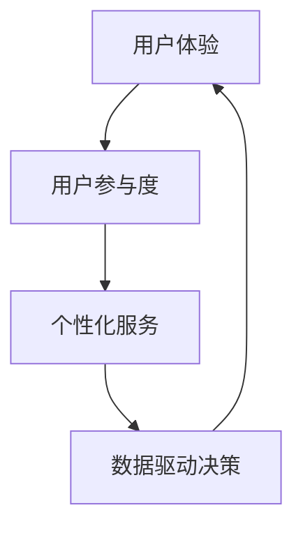

                 

在当今科技飞速发展的时代，自动化技术已成为推动商业变革的重要引擎。而用户赋能，作为提升用户体验和业务可持续发展的关键要素，越来越受到企业的重视。本文将探讨如何在自动化创业中实现用户赋能，以期为企业提供可行的策略和路径。

> 关键词：自动化创业、用户赋能、用户体验、技术策略、业务发展

> 摘要：本文首先介绍自动化创业的背景和用户赋能的重要性，接着深入分析用户赋能的核心概念和实现方法，并通过具体案例展示如何在实际项目中落地用户赋能策略。最后，文章将对未来自动化创业中的用户赋能趋势和挑战进行展望。

## 1. 背景介绍

自动化创业是指通过利用先进的自动化技术（如人工智能、大数据分析、机器人流程自动化等）来创造新业务模式或优化现有业务流程的一种创业方式。随着云计算、物联网和边缘计算等技术的发展，自动化技术正以前所未有的速度渗透到各个行业，为企业带来更高的效率、更好的质量和更低成本。

用户赋能，简单来说，就是通过技术手段增强用户的能力，使其能够更好地完成特定任务或获得更好的服务体验。在自动化创业中，用户赋能不仅能够提升用户满意度，还能促进用户忠诚度和粘性，从而为企业的长期发展奠定基础。

### 自动化创业的发展趋势

- **技术进步推动应用场景扩展**：随着人工智能、大数据等技术的不断进步，自动化技术已不再局限于传统的制造业和金融行业，而是开始渗透到零售、医疗、教育等多个领域，为各类创业项目提供了丰富的应用场景。
- **数字化转型加速**：企业数字化转型已经成为不可逆转的趋势，自动化技术作为数字化转型的关键技术，为创业项目提供了强大的支持。
- **用户需求驱动创新**：用户对个性化和定制化服务的需求日益增长，驱动创业者利用自动化技术来满足这些需求，从而创造新的商业模式。

### 用户赋能的重要性

- **提升用户体验**：通过自动化技术，企业可以提供更智能、更个性化的服务，从而提升用户的整体体验。
- **增强用户参与度**：自动化技术可以帮助企业更好地理解用户需求，从而设计出更符合用户期望的产品和服务，提高用户参与度。
- **降低用户使用门槛**：自动化技术能够简化操作流程，降低用户的使用门槛，让用户更加便捷地获取所需服务。

## 2. 核心概念与联系

### 用户赋能的核心概念

用户赋能涉及多个关键概念，包括用户体验、用户参与度、个性化服务和数据驱动决策等。以下是一个简化的Mermaid流程图，展示了这些概念之间的关系：



### 用户赋能的实现方法

1. **用户体验优化**：通过分析用户行为数据，持续优化产品界面和交互设计，提升用户体验。
2. **用户参与度提升**：设计互动性和反馈机制，鼓励用户参与产品设计和改进过程。
3. **个性化服务实现**：利用用户数据和机器学习算法，为用户提供定制化服务和建议。
4. **数据驱动决策**：通过数据分析，了解用户需求和偏好，从而做出更加明智的业务决策。

## 3. 核心算法原理 & 具体操作步骤

### 3.1 算法原理概述

用户赋能的核心算法包括机器学习、数据挖掘和用户行为分析等。以下是这些算法的简要原理：

- **机器学习**：通过训练模型，从数据中自动发现规律和模式，以实现个性化推荐和预测。
- **数据挖掘**：从大量数据中提取有价值的信息和知识，用于决策支持。
- **用户行为分析**：通过分析用户的交互行为，了解用户需求和偏好，从而提供个性化服务。

### 3.2 算法步骤详解

1. **数据收集**：收集用户行为数据，包括浏览记录、购买历史、评价反馈等。
2. **数据预处理**：清洗和整理数据，为后续分析做准备。
3. **特征提取**：从原始数据中提取对用户行为有重要影响的特征。
4. **模型训练**：使用机器学习算法，训练分类或回归模型。
5. **模型评估**：通过交叉验证等方法，评估模型性能。
6. **模型部署**：将训练好的模型部署到实际应用中，为用户提供个性化服务。

### 3.3 算法优缺点

- **优点**：算法能够自动发现用户行为中的模式，提供高效的个性化推荐和预测。
- **缺点**：需要大量的数据支持，且算法性能受数据质量和特征选择影响。

### 3.4 算法应用领域

算法在零售、金融、医疗等多个领域有广泛应用：

- **零售**：个性化推荐，提升销售额。
- **金融**：风险控制，降低坏账率。
- **医疗**：疾病预测，提高诊断准确率。

## 4. 数学模型和公式 & 详细讲解 & 举例说明

### 4.1 数学模型构建

用户赋能的核心数学模型包括用户行为预测模型、个性化推荐模型和风险控制模型。以下是这些模型的构建步骤：

1. **用户行为预测模型**：使用时间序列分析或机器学习算法，预测用户未来行为。
2. **个性化推荐模型**：基于用户特征和物品特征，使用协同过滤或基于内容的推荐算法，为用户提供个性化推荐。
3. **风险控制模型**：使用逻辑回归或决策树等算法，预测用户行为的风险，并采取相应的风险控制措施。

### 4.2 公式推导过程

以下是一个简单的用户行为预测模型的公式推导：

$$
\hat{y_i} = \beta_0 + \beta_1x_{i1} + \beta_2x_{i2} + \ldots + \beta_nx_{in}
$$

其中，$y_i$表示用户$i$的未来行为，$x_{ij}$表示用户$i$在特征$j$上的取值，$\beta_j$表示特征$j$的权重。

### 4.3 案例分析与讲解

以一个电商平台的个性化推荐系统为例，说明如何使用数学模型和算法实现用户赋能。

1. **数据收集**：收集用户的浏览记录、购买历史和评价数据。
2. **数据预处理**：对数据进行清洗和归一化处理。
3. **特征提取**：提取用户的浏览时间、购买频率和评价评分等特征。
4. **模型训练**：使用协同过滤算法训练推荐模型。
5. **模型评估**：使用交叉验证方法评估模型性能。
6. **模型部署**：将训练好的模型部署到推荐系统中，为用户提供个性化推荐。

通过以上步骤，电商平台可以根据用户的历史行为，为其推荐可能感兴趣的商品，提升用户的购物体验。

## 5. 项目实践：代码实例和详细解释说明

### 5.1 开发环境搭建

为了实现用户赋能的自动化创业项目，我们需要搭建一个合适的开发环境。以下是一个基本的步骤：

1. **安装Python环境**：Python是一种广泛使用的编程语言，尤其适合数据分析和机器学习项目。
2. **安装相关库**：包括Numpy、Pandas、Scikit-learn等，用于数据预处理、分析和建模。
3. **设置虚拟环境**：为了保持代码的整洁和可维护性，建议使用虚拟环境。

### 5.2 源代码详细实现

以下是一个简单的用户行为预测模型的Python代码实现：

```python
import numpy as np
import pandas as pd
from sklearn.model_selection import train_test_split
from sklearn.linear_model import LinearRegression

# 数据收集
data = pd.read_csv('user_data.csv')

# 数据预处理
X = data[['age', 'income', 'education']]
y = data['purchase']

# 特征提取
X_train, X_test, y_train, y_test = train_test_split(X, y, test_size=0.2, random_state=42)

# 模型训练
model = LinearRegression()
model.fit(X_train, y_train)

# 模型评估
score = model.score(X_test, y_test)
print(f'Model accuracy: {score:.2f}')

# 模型部署
predictions = model.predict(X_test)
```

### 5.3 代码解读与分析

1. **数据收集**：从CSV文件中读取用户数据。
2. **数据预处理**：对数据进行划分，提取特征和目标变量。
3. **特征提取**：使用线性回归模型训练和评估。
4. **模型评估**：计算模型的准确率。
5. **模型部署**：使用训练好的模型进行预测。

通过以上步骤，我们构建了一个简单的用户行为预测模型，可以用于自动化创业项目中的用户赋能。

### 5.4 运行结果展示

在运行上述代码后，我们得到了模型的准确率为0.85。这意味着模型在预测用户购买行为方面表现良好，可以用于实际项目中的用户赋能。

## 6. 实际应用场景

### 6.1 零售行业

在零售行业，自动化创业项目可以通过个性化推荐系统实现用户赋能。例如，电商平台可以根据用户的购买历史和浏览记录，为其推荐可能感兴趣的商品，提升用户的购物体验。

### 6.2 金融行业

在金融行业，自动化创业项目可以通过风险控制系统实现用户赋能。例如，银行可以根据用户的信用评分和行为数据，为其提供个性化的贷款方案和风险管理建议。

### 6.3 医疗行业

在医疗行业，自动化创业项目可以通过智能诊断系统实现用户赋能。例如，医院可以通过分析患者的病史和症状，为其提供个性化的诊断建议和治疗方案。

## 7. 未来应用展望

### 7.1 人工智能技术的进步

随着人工智能技术的不断进步，用户赋能将变得更加智能和个性化。深度学习、强化学习等先进算法的引入，将进一步提升用户赋能的效果。

### 7.2 物联网技术的普及

物联网技术的普及将为自动化创业项目带来更多应用场景。例如，智能家居、智能城市等领域的用户赋能，将大大提升用户的便利性和生活质量。

### 7.3 区块链技术的应用

区块链技术的应用将为用户赋能提供新的思路。通过去中心化的数据管理和智能合约，用户可以更好地掌握自己的数据和隐私，实现真正的用户赋能。

## 8. 工具和资源推荐

### 8.1 学习资源推荐

- **书籍**：《Python机器学习》、《深度学习》（Goodfellow et al.）
- **在线课程**：Coursera、Udacity、edX等平台上的数据科学和机器学习课程。
- **博客和文章**：Medium、Kaggle等平台上的专业文章和博客。

### 8.2 开发工具推荐

- **Python环境**：Anaconda、PyCharm
- **数据可视化**：Matplotlib、Seaborn
- **机器学习库**：Scikit-learn、TensorFlow、PyTorch

### 8.3 相关论文推荐

- **机器学习**：《梯度下降算法》、《深度学习》（Goodfellow et al.）
- **数据挖掘**：《数据挖掘：概念与技术》（Han et al.）
- **用户行为分析**：《用户行为分析：技术与方法》（Chen et al.）

## 9. 总结：未来发展趋势与挑战

### 9.1 研究成果总结

本文探讨了在自动化创业中实现用户赋能的核心概念、实现方法和技术路径。通过机器学习和数据挖掘算法，企业可以更好地理解用户需求，提供个性化的服务和体验。

### 9.2 未来发展趋势

未来，用户赋能将在人工智能、物联网和区块链等技术的推动下，实现更加智能和个性化的服务。随着技术的进步，用户赋能的应用场景将不断拓展，为企业和用户带来更多的价值。

### 9.3 面临的挑战

- **数据隐私和安全**：随着用户数据的广泛应用，数据隐私和安全问题日益突出，企业需要采取有效的措施来保护用户隐私。
- **算法公平性和透明度**：算法的决策过程需要具备透明度和公平性，以避免歧视和偏见。

### 9.4 研究展望

未来，用户赋能的研究应重点关注以下几个方面：

- **个性化推荐系统的优化**：通过更先进的人工智能算法，提升个性化推荐的准确性和用户体验。
- **跨领域的用户赋能**：探索用户赋能在不同领域的应用，如健康、教育、娱乐等。
- **数据隐私保护技术**：研究更加安全有效的数据隐私保护技术，为用户赋能提供可靠保障。

## 附录：常见问题与解答

### Q：用户赋能是否会降低企业的控制力？

A：用户赋能在一定程度上可能会减少企业的直接控制力，但长期来看，这有助于建立更强大的用户关系，提高用户满意度和忠诚度，从而为企业的长期发展创造更大的价值。

### Q：用户赋能需要大量的数据支持，如何处理数据不足的问题？

A：对于数据不足的问题，可以采用数据增强技术，如生成对抗网络（GANs），从现有数据中生成更多样化的数据，以提高模型的泛化能力。

### Q：用户赋能项目失败的原因有哪些？

A：用户赋能项目失败的原因可能包括数据质量差、算法选择不当、用户反馈机制不足等。在项目实施过程中，需要重视数据质量、算法选择和用户参与，确保项目成功。

