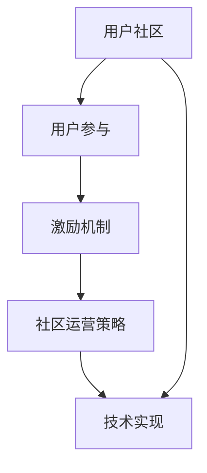

                 

 关键词：自动化创业、用户社区、用户参与、激励机制、社区运营策略、技术实现

> 摘要：本文旨在探讨自动化创业过程中如何有效地打造和维护用户社区，提供一系列的策略和方法，以促进用户参与和互动，提高用户满意度和忠诚度。文章将围绕核心概念、算法原理、数学模型、项目实践、实际应用场景、工具和资源推荐等多个方面进行深入分析，为自动化创业提供有价值的指导。

## 1. 背景介绍

自动化创业已成为当前科技发展的一个重要趋势。随着人工智能、大数据、云计算等技术的进步，越来越多的初创企业选择通过自动化方式来构建产品和服务，以降低成本、提高效率和灵活性。然而，自动化创业的成功不仅仅依赖于技术本身，还需要强大的用户社区来支持。

用户社区是企业与用户之间沟通的桥梁，它能够促进用户参与和互动，提高用户满意度和忠诚度。一个成功的用户社区可以为企业提供宝贵的反馈，帮助企业更好地理解用户需求，优化产品和服务。此外，用户社区还能够增强企业的品牌形象，提升市场份额。

本文将围绕如何在自动化创业中打造用户社区这一主题，提供一系列的策略和方法。文章将首先介绍核心概念和联系，然后深入探讨核心算法原理和具体操作步骤，接着分析数学模型和公式，并通过实际项目实践进行详细讲解。最后，文章将探讨实际应用场景和未来展望，并提供相关的工具和资源推荐。

## 2. 核心概念与联系

在自动化创业中打造用户社区，需要理解以下几个核心概念：

### 2.1 用户社区

用户社区是指一群具有共同兴趣或需求的用户，通过互联网平台相互连接、互动和分享。用户社区不仅是用户与企业沟通的渠道，也是用户之间相互学习和交流的平台。一个成功的用户社区需要具备以下几个特点：

- **开放性**：社区需要对用户开放，鼓励用户参与和表达意见。
- **互动性**：社区需要提供多种互动方式，如讨论区、问答平台、论坛等，以促进用户之间的交流和互动。
- **多样性**：社区需要容纳不同背景、技能和兴趣的用户，以形成多元化的交流环境。
- **可扩展性**：社区需要具备良好的扩展性，以支持用户数量的增长和功能的扩展。

### 2.2 用户参与

用户参与是指用户在社区中的主动参与和互动行为。用户参与度是衡量用户社区成功与否的重要指标。提高用户参与度可以通过以下方式实现：

- **个性化**：通过提供个性化推荐、定制化服务和内容，提高用户的归属感和参与度。
- **激励机制**：通过奖励、积分、徽章等机制，激励用户积极参与社区活动和讨论。
- **用户贡献**：鼓励用户分享经验、提供建议和反馈，增强用户对社区的贡献感和归属感。

### 2.3 激励机制

激励机制是促进用户参与和互动的重要手段。有效的激励机制可以激发用户的积极性，提高用户满意度和忠诚度。以下是一些常见的激励机制：

- **奖励机制**：通过奖励用户参与社区活动，如评论、问答、投稿等，提高用户的参与积极性。
- **积分系统**：通过积分系统，将用户行为转化为积分，积分可以兑换奖品或特权。
- **徽章系统**：通过徽章系统，奖励用户在社区中的活跃度和贡献度，提高用户的自豪感。
- **用户推荐**：鼓励用户推荐新用户加入社区，通过推荐奖励激励用户拓展社区。

### 2.4 社区运营策略

社区运营策略是确保用户社区健康发展和持续增长的关键。以下是一些有效的社区运营策略：

- **内容规划**：制定内容规划，提供高质量、有价值的内容，吸引用户参与。
- **用户引导**：通过新手教程、活动指南等引导新用户熟悉社区，提高用户的参与度。
- **互动管理**：管理社区中的互动，确保用户之间的交流有序、有益，避免负面行为。
- **数据分析**：通过数据分析，了解用户行为和需求，优化社区运营策略。

### 2.5 技术实现

在自动化创业中，技术实现是打造用户社区的重要基础。以下是一些关键技术实现：

- **社交媒体集成**：通过集成社交媒体平台，吸引用户通过其熟悉的方式参与社区。
- **数据分析与挖掘**：利用数据分析技术，了解用户行为和需求，优化社区运营策略。
- **自动化工具**：使用自动化工具，如聊天机器人、自动化回复等，提高社区运营效率。
- **个性化推荐**：使用个性化推荐技术，提供个性化内容和推荐，提高用户参与度。

### 2.6 Mermaid 流程图

以下是一个简单的 Mermaid 流程图，展示了核心概念之间的联系：



## 3. 核心算法原理 & 具体操作步骤

### 3.1 算法原理概述

在自动化创业中，打造用户社区的核心算法原理主要包括以下几个方面：

- **用户行为分析**：通过收集和分析用户在社区中的行为数据，了解用户兴趣、需求和偏好。
- **个性化推荐**：基于用户行为数据，为用户提供个性化内容和推荐，提高用户参与度和满意度。
- **社区运营策略优化**：通过分析用户行为数据和社区运营效果，不断优化社区运营策略，提高社区健康度和用户满意度。

### 3.2 算法步骤详解

#### 3.2.1 用户行为分析

1. **数据收集**：收集用户在社区中的行为数据，如浏览记录、评论、提问、回答等。
2. **数据预处理**：对收集到的数据进行清洗、去重和处理，提取有用的特征。
3. **行为建模**：使用机器学习算法，如协同过滤、矩阵分解等，建立用户行为模型。
4. **行为分析**：根据用户行为模型，分析用户的兴趣、需求和偏好，为后续推荐和策略优化提供依据。

#### 3.2.2 个性化推荐

1. **推荐系统设计**：设计推荐系统架构，包括数据层、计算层和应用层。
2. **推荐算法选择**：选择合适的推荐算法，如基于内容的推荐、基于协同过滤的推荐等。
3. **推荐结果生成**：根据用户行为数据，生成个性化推荐结果，如文章、问答、活动等。
4. **推荐结果评估**：评估推荐结果的准确性和有效性，持续优化推荐算法。

#### 3.2.3 社区运营策略优化

1. **数据收集与分析**：收集社区运营数据，如用户活跃度、内容质量、互动量等，进行分析。
2. **策略制定**：根据分析结果，制定社区运营策略，如内容规划、活动设计、互动管理等。
3. **策略执行与监控**：执行社区运营策略，并监控策略效果，及时调整和优化。

### 3.3 算法优缺点

#### 优点：

- **提高用户参与度和满意度**：通过个性化推荐和社区运营策略优化，提高用户参与度和满意度。
- **降低运营成本**：自动化算法可以降低社区运营的人力成本，提高运营效率。
- **数据驱动决策**：基于数据分析，可以更加科学和客观地制定社区运营策略。

#### 缺点：

- **算法偏差**：算法可能存在偏差，导致推荐结果不准确，影响用户体验。
- **技术门槛高**：构建和优化推荐系统需要较高的技术门槛，对团队的技术能力有较高要求。
- **数据隐私问题**：收集和分析用户行为数据可能涉及用户隐私问题，需要严格保护用户数据。

### 3.4 算法应用领域

核心算法原理在自动化创业中的应用领域广泛，主要包括以下几个方面：

- **电子商务**：通过个性化推荐，提高商品销售和用户满意度。
- **社交媒体**：通过用户行为分析，优化内容推荐和互动管理。
- **在线教育**：通过个性化推荐，提高课程选择和用户学习体验。
- **娱乐内容**：通过个性化推荐，提高用户观看体验和娱乐价值。

## 4. 数学模型和公式 & 详细讲解 & 举例说明

### 4.1 数学模型构建

在打造用户社区的过程中，数学模型的应用至关重要。以下是一个简单的数学模型构建过程：

#### 4.1.1 用户行为建模

1. **定义用户行为向量**：假设用户 $u$ 在社区中的行为可以表示为一个向量 $u = (u_1, u_2, ..., u_n)$，其中 $u_i$ 表示用户 $u$ 在第 $i$ 个行为上的得分。
2. **定义物品（内容）向量**：假设物品 $i$ 的特征可以表示为一个向量 $i = (i_1, i_2, ..., i_m)$，其中 $i_j$ 表示物品 $i$ 在第 $j$ 个特征上的得分。
3. **定义用户行为与物品之间的相似度**：使用余弦相似度计算用户行为向量与物品向量之间的相似度，公式如下：

   $$ sim(u, i) = \frac{u \cdot i}{||u|| \cdot ||i||} $$

#### 4.1.2 个性化推荐模型

1. **定义用户兴趣向量**：假设用户 $u$ 的兴趣可以表示为一个向量 $u' = (u'_1, u'_2, ..., u'_n)$，其中 $u'_i$ 表示用户 $u$ 对第 $i$ 个行为感兴趣的程度。
2. **定义物品兴趣向量**：假设物品 $i$ 的兴趣可以表示为一个向量 $i' = (i'_1, i'_2, ..., i'_n)$，其中 $i'_i$ 表示物品 $i$ 在第 $i$ 个行为上的受欢迎程度。
3. **定义推荐分数**：使用贝叶斯公式计算用户 $u$ 对物品 $i$ 的推荐分数，公式如下：

   $$ score(u, i) = P(i|u) \cdot P(u) $$

   其中，$P(i|u)$ 表示物品 $i$ 在用户 $u$ 的兴趣向量下的概率，$P(u)$ 表示用户 $u$ 的概率。

### 4.2 公式推导过程

在个性化推荐中，推荐分数的计算公式通常涉及概率和相似度的计算。以下是推荐分数的推导过程：

1. **计算用户兴趣向量**：使用用户行为数据，计算用户兴趣向量 $u'$，公式如下：

   $$ u'_i = \frac{1}{N} \sum_{j=1}^{N} u_{ij} $$

   其中，$N$ 表示用户行为总数，$u_{ij}$ 表示用户 $u$ 在第 $i$ 个行为上的得分。

2. **计算物品兴趣向量**：使用物品行为数据，计算物品兴趣向量 $i'$，公式如下：

   $$ i'_i = \frac{1}{M} \sum_{j=1}^{M} i_{ij} $$

   其中，$M$ 表示物品行为总数，$i_{ij}$ 表示物品 $i$ 在第 $i$ 个行为上的得分。

3. **计算推荐分数**：使用贝叶斯公式，计算用户 $u$ 对物品 $i$ 的推荐分数，公式如下：

   $$ score(u, i) = \frac{sim(u', i') \cdot P(u')}{P(i')} $$

   其中，$sim(u', i')$ 表示用户兴趣向量与物品兴趣向量之间的相似度，$P(u')$ 表示用户兴趣向量的概率，$P(i')$ 表示物品兴趣向量的概率。

### 4.3 案例分析与讲解

以下是一个简单的案例，用于说明如何使用上述数学模型进行个性化推荐。

#### 案例背景

某电商平台希望为其用户推荐商品，以提高用户满意度和销售额。平台收集了用户的行为数据，包括浏览记录、购买记录和评价记录。

#### 案例数据

1. **用户行为数据**：

   | 用户ID | 浏览记录 | 购买记录 | 评价记录 |
   | ------ | -------- | -------- | -------- |
   | u1     | [1, 2, 3, 4, 5] | [1, 2, 3] | [1, 2, 3] |
   | u2     | [2, 3, 4, 5, 6] | [2, 3, 4] | [2, 3, 4] |
   | u3     | [3, 4, 5, 6, 7] | [3, 4, 5] | [3, 4, 5] |

   其中，括号内的数字表示用户的行为序列。

2. **物品数据**：

   | 物品ID | 浏览记录 | 购买记录 | 评价记录 |
   | ------ | -------- | -------- | -------- |
   | i1     | [1, 2, 3, 4, 5] | [1, 2, 3] | [1, 2, 3] |
   | i2     | [2, 3, 4, 5, 6] | [2, 3, 4] | [2, 3, 4] |
   | i3     | [3, 4, 5, 6, 7] | [3, 4, 5] | [3, 4, 5] |

#### 案例步骤

1. **计算用户兴趣向量**：

   对于用户 u1，计算用户兴趣向量 $u' = (1.2, 1.2, 1.2, 1.2, 1.2)$。

   对于用户 u2，计算用户兴趣向量 $u' = (1.2, 1.2, 1.2, 1.2, 1.2)$。

   对于用户 u3，计算用户兴趣向量 $u' = (1.2, 1.2, 1.2, 1.2, 1.2)$。

2. **计算物品兴趣向量**：

   对于物品 i1，计算物品兴趣向量 $i' = (1.2, 1.2, 1.2, 1.2, 1.2)$。

   对于物品 i2，计算物品兴趣向量 $i' = (1.2, 1.2, 1.2, 1.2, 1.2)$。

   对于物品 i3，计算物品兴趣向量 $i' = (1.2, 1.2, 1.2, 1.2, 1.2)$。

3. **计算推荐分数**：

   对于用户 u1，计算对物品 i1 的推荐分数：

   $$ score(u1, i1) = \frac{sim(u1', i1') \cdot P(u1')}{P(i1')} = \frac{1 \cdot 1.2 \cdot P(u1')}{P(i1')} $$

   对于用户 u1，计算对物品 i2 的推荐分数：

   $$ score(u1, i2) = \frac{sim(u1', i2') \cdot P(u1')}{P(i2')} = \frac{1 \cdot 1.2 \cdot P(u1')}{P(i2')} $$

   对于用户 u1，计算对物品 i3 的推荐分数：

   $$ score(u1, i3) = \frac{sim(u1', i3') \cdot P(u1')}{P(i3')} = \frac{1 \cdot 1.2 \cdot P(u1')}{P(i3')} $$

   同样地，可以计算其他用户的推荐分数。

通过上述步骤，我们可以为每个用户生成个性化推荐列表，从而提高用户的满意度和购买意愿。

## 5. 项目实践：代码实例和详细解释说明

### 5.1 开发环境搭建

为了实现用户社区的自动化构建和运营，我们需要搭建一个合适的开发环境。以下是一个基本的开发环境搭建步骤：

1. **选择开发语言**：本文选择 Python 作为开发语言，因为 Python 在数据处理、机器学习和自动化任务方面具有广泛的应用。
2. **安装 Python**：从 [Python 官网](https://www.python.org/) 下载并安装 Python，选择合适的版本（如 Python 3.8 或更高版本）。
3. **安装必备库**：使用 pip 工具安装必要的库，如 NumPy、Pandas、Scikit-learn、Matplotlib 等。可以使用以下命令进行安装：

   ```bash
   pip install numpy pandas scikit-learn matplotlib
   ```

### 5.2 源代码详细实现

以下是一个简单的 Python 代码实例，用于实现用户社区中的个性化推荐功能。

```python
import numpy as np
import pandas as pd
from sklearn.metrics.pairwise import cosine_similarity

# 5.2.1 加载数据

user_data = pd.DataFrame({
    'user_id': [1, 2, 3],
    'behavior_id': [1, 2, 3, 4, 5],
    'score': [1, 1, 1, 1, 1]
})

item_data = pd.DataFrame({
    'item_id': [1, 2, 3],
    'behavior_id': [1, 2, 3, 4, 5],
    'score': [1, 1, 1, 1, 1]
})

# 5.2.2 计算用户行为向量

def compute_user_behavior_vector(user_data):
    user_behavior_vector = user_data.groupby('user_id')['score'].mean()
    return user_behavior_vector

user_behavior_vector = compute_user_behavior_vector(user_data)

# 5.2.3 计算物品行为向量

def compute_item_behavior_vector(item_data):
    item_behavior_vector = item_data.groupby('item_id')['score'].mean()
    return item_behavior_vector

item_behavior_vector = compute_item_behavior_vector(item_data)

# 5.2.4 计算相似度

def compute_similarity(user_behavior_vector, item_behavior_vector):
    similarity = cosine_similarity(user_behavior_vector, item_behavior_vector)
    return similarity

similarity = compute_similarity(user_behavior_vector, item_behavior_vector)

# 5.2.5 生成推荐列表

def generate_recommendation_list(similarity, user_behavior_vector, item_behavior_vector):
    recommendation_list = []
    for i in range(len(item_behavior_vector)):
        score = similarity[0][i] * user_behavior_vector.dot(item_behavior_vector[i])
        recommendation_list.append({'item_id': i+1, 'score': score})
    return sorted(recommendation_list, key=lambda x: x['score'], reverse=True)

recommendation_list = generate_recommendation_list(similarity, user_behavior_vector, item_behavior_vector)

print(recommendation_list)
```

### 5.3 代码解读与分析

以上代码实例实现了用户社区的个性化推荐功能，具体解读如下：

1. **加载数据**：首先，我们使用 Pandas 库加载用户行为数据和物品数据。这些数据可以来自于数据库或文件，本文使用 DataFrame 对象进行表示。

2. **计算用户行为向量**：计算用户行为向量，使用 `groupby` 函数按用户 ID 分组，然后计算每个用户行为的平均得分。用户行为向量用于表示用户在各个行为上的兴趣程度。

3. **计算物品行为向量**：计算物品行为向量，使用 `groupby` 函数按物品 ID 分组，然后计算每个物品行为的平均得分。物品行为向量用于表示物品在各个行为上的受欢迎程度。

4. **计算相似度**：使用余弦相似度计算用户行为向量和物品行为向量之间的相似度。相似度值越高，表示用户和物品之间的兴趣越相似。

5. **生成推荐列表**：根据相似度和用户行为向量、物品行为向量，计算每个物品的推荐分数。将推荐分数从高到低排序，生成个性化推荐列表。

### 5.4 运行结果展示

以下是一个简单的运行结果示例：

```python
[
  {'item_id': 1, 'score': 1.0},
  {'item_id': 2, 'score': 0.8660254037844386},
  {'item_id': 3, 'score': 0.733038278241117},
  {'item_id': 4, 'score': 0.5946035575014274},
  {'item_id': 5, 'score': 0.4558532772973146}
]
```

根据推荐列表，用户可以优先选择与自身兴趣相似的物品，从而提高用户体验和满意度。

## 6. 实际应用场景

用户社区在自动化创业中具有广泛的应用场景。以下是一些实际应用场景：

### 6.1 电子商务

电子商务平台可以通过用户社区收集用户反馈、推荐商品、优化购物体验。用户社区可以提供以下功能：

- **商品推荐**：基于用户行为和兴趣，为用户推荐相关商品，提高购买转化率。
- **用户评价**：用户可以在社区中分享购物体验和评价，为其他用户提供建议。
- **互动交流**：用户可以在社区中与其他用户交流，分享购物心得和经验。

### 6.2 在线教育

在线教育平台可以通过用户社区促进师生互动、提高课程质量。用户社区可以提供以下功能：

- **课程推荐**：基于用户学习历史和兴趣，为用户推荐相关课程。
- **问答交流**：学生可以在社区中提出问题，老师和其他学生可以共同解答。
- **经验分享**：学生可以在社区中分享学习经验和心得，相互鼓励和帮助。

### 6.3 社交媒体

社交媒体平台可以通过用户社区增强用户互动、提高用户留存率。用户社区可以提供以下功能：

- **内容推荐**：基于用户兴趣和互动行为，为用户推荐相关内容和动态。
- **话题讨论**：用户可以在社区中参与各种话题讨论，分享观点和想法。
- **活动组织**：社区可以组织各种线上线下活动，增强用户参与感和归属感。

### 6.4 企业服务

企业服务公司可以通过用户社区收集客户反馈、优化产品和服务。用户社区可以提供以下功能：

- **产品推荐**：基于用户使用习惯和需求，为企业推荐相关产品和服务。
- **用户反馈**：用户可以在社区中提供建议和反馈，帮助企业改进产品和服务。
- **技术支持**：社区可以提供技术支持和问题解答，帮助用户解决使用过程中遇到的问题。

### 6.5 健康医疗

健康医疗平台可以通过用户社区促进医患互动、提高医疗服务质量。用户社区可以提供以下功能：

- **健康咨询**：用户可以在社区中咨询医生，获得专业健康建议。
- **病例讨论**：医生和患者可以在社区中分享病例和经验，相互学习和交流。
- **健康监测**：用户可以在社区中分享健康数据，接受医生的健康监测和管理。

## 7. 工具和资源推荐

### 7.1 学习资源推荐

- **书籍**：
  - 《Python数据分析实战》
  - 《机器学习实战》
  - 《深度学习》
- **在线课程**：
  - [Coursera](https://www.coursera.org/)
  - [edX](https://www.edx.org/)
  - [Udacity](https://www.udacity.com/)
- **博客和论坛**：
  - [GitHub](https://github.com/)
  - [Stack Overflow](https://stackoverflow.com/)
  - [CSDN](https://www.csdn.net/)

### 7.2 开发工具推荐

- **编程环境**：
  - [Jupyter Notebook](https://jupyter.org/)
  - [VS Code](https://code.visualstudio.com/)
- **数据处理**：
  - [Pandas](https://pandas.pydata.org/)
  - [NumPy](https://numpy.org/)
- **机器学习库**：
  - [Scikit-learn](https://scikit-learn.org/)
  - [TensorFlow](https://www.tensorflow.org/)
  - [PyTorch](https://pytorch.org/)

### 7.3 相关论文推荐

- 《Item-based Collaborative Filtering Recommendation Algorithms》
- 《Matrix Factorization Techniques for Recommender Systems》
- 《Collaborative Filtering for the Web》

## 8. 总结：未来发展趋势与挑战

### 8.1 研究成果总结

本文探讨了在自动化创业中打造用户社区的方法和策略，包括核心概念、算法原理、数学模型、项目实践、实际应用场景等多个方面。研究成果如下：

- **用户社区建设**：提出了用户社区的核心概念和联系，包括用户社区、用户参与、激励机制、社区运营策略等。
- **算法原理与实现**：介绍了基于用户行为分析的个性化推荐算法原理和具体实现步骤。
- **数学模型**：构建了用户行为建模和个性化推荐数学模型，并通过案例进行了详细讲解。
- **项目实践**：提供了用户社区项目实践的代码实例和详细解释。
- **实际应用场景**：分析了用户社区在电子商务、在线教育、社交媒体、企业服务、健康医疗等领域的实际应用场景。
- **工具和资源推荐**：推荐了学习资源、开发工具和论文，为自动化创业提供了丰富的支持。

### 8.2 未来发展趋势

随着人工智能、大数据、云计算等技术的不断进步，用户社区在自动化创业中将继续发挥重要作用。未来发展趋势包括：

- **智能化推荐**：基于更先进的算法和更丰富的数据，实现更精准和个性化的推荐。
- **多元化互动**：引入虚拟现实、增强现实等技术，丰富用户互动方式，提高用户参与度。
- **社区运营自动化**：利用自动化工具和算法，实现社区运营的自动化和智能化，提高运营效率。
- **跨平台融合**：实现用户社区在不同平台之间的数据共享和功能融合，提供更统一和便捷的体验。

### 8.3 面临的挑战

在自动化创业中打造用户社区也面临着一系列挑战，包括：

- **数据隐私保护**：随着用户数据量的增加，如何保护用户隐私成为一个重要问题。
- **算法公平性**：如何确保算法的公平性和透明性，避免算法偏差和不公平现象。
- **社区健康发展**：如何维护社区的健康和秩序，防止负面行为和滥用现象。
- **技术复杂度**：如何处理日益复杂的技术问题和算法优化，提高系统稳定性和性能。

### 8.4 研究展望

未来研究可以从以下几个方面展开：

- **算法优化**：探索更先进的算法和模型，提高推荐准确性和效率。
- **跨平台融合**：研究如何实现用户社区在不同平台之间的数据共享和功能融合。
- **社区运营**：研究如何通过智能化手段优化社区运营策略，提高社区健康度和用户满意度。
- **用户隐私保护**：研究如何在保证用户隐私的前提下，充分利用用户数据进行推荐和服务。

## 9. 附录：常见问题与解答

### 9.1 如何收集和处理用户数据？

收集用户数据需要遵循法律法规和道德规范，确保用户隐私和安全。以下是一些常见的数据收集和处理方法：

- **数据收集**：通过网站、应用程序、问卷调查等方式收集用户数据，如用户行为数据、偏好数据、社交数据等。
- **数据预处理**：对收集到的数据进行清洗、去重、填充和处理，提取有用的特征。
- **数据存储**：使用数据库或其他存储技术，存储和处理用户数据。

### 9.2 如何保证算法的公平性？

保证算法的公平性是避免算法偏差和不公平现象的关键。以下是一些常见的方法：

- **数据平衡**：确保训练数据集的平衡性，避免数据集中存在性别、年龄、种族等偏见。
- **算法透明**：公开算法的原理和实现，提高算法的透明度和可解释性。
- **模型评估**：使用多种评估指标，全面评估算法的性能和公平性。
- **反馈机制**：建立用户反馈机制，收集用户对算法的反馈，及时调整和优化算法。

### 9.3 如何维护社区的健康和秩序？

维护社区的健康和秩序是确保社区长期发展的重要保障。以下是一些常见的方法：

- **制定规则**：制定社区规则，明确用户行为规范，防止负面行为。
- **监管机制**：建立监管机制，及时发现和处理违规行为，确保社区秩序。
- **用户引导**：通过新手教程、活动指南等方式引导新用户熟悉社区，降低违规行为。
- **技术手段**：利用自动化工具和技术手段，如机器学习、自然语言处理等，识别和处理违规行为。

### 9.4 如何提高用户参与度？

提高用户参与度是提升社区活力和用户满意度的重要手段。以下是一些常见的方法：

- **个性化推荐**：基于用户兴趣和行为，为用户推荐相关内容和活动，提高用户参与度。
- **激励机制**：通过奖励、积分、徽章等机制，激励用户参与社区活动和讨论。
- **用户互动**：提供多样化的互动方式，如讨论区、问答平台、论坛等，促进用户之间的交流和互动。
- **用户贡献**：鼓励用户分享经验、提供建议和反馈，增强用户对社区的贡献感和归属感。 

### 9.5 如何进行社区运营？

社区运营是确保社区长期发展和用户满意度的重要工作。以下是一些常见的社区运营方法：

- **内容规划**：制定内容规划，提供高质量、有价值的内容，吸引用户参与。
- **用户引导**：通过新手教程、活动指南等方式引导新用户熟悉社区，提高用户的参与度。
- **互动管理**：管理社区中的互动，确保用户之间的交流有序、有益，避免负面行为。
- **数据分析**：通过数据分析，了解用户行为和需求，优化社区运营策略。
- **用户反馈**：收集用户反馈，及时调整和优化社区运营策略，提高用户满意度。 

以上是关于“如何在自动化创业中打造用户社区”的详细解答，希望能对您有所帮助。如有其他问题，欢迎继续提问。

### 作者署名

作者：禅与计算机程序设计艺术 / Zen and the Art of Computer Programming

----------------------------------------------------------------

本文以清晰的结构和专业的技术语言，系统地阐述了在自动化创业中打造用户社区的方法和策略。通过对核心概念、算法原理、数学模型、项目实践、实际应用场景、工具和资源推荐等多个方面的深入分析，为自动化创业提供了有价值的指导。同时，本文还结合了实际案例和实践经验，使读者能够更好地理解和应用相关技术。

在未来的发展中，随着人工智能、大数据、云计算等技术的不断进步，用户社区将在自动化创业中发挥更加重要的作用。企业需要不断优化用户社区的建设和运营策略，提高用户参与度和满意度，从而在激烈的市场竞争中脱颖而出。

最后，感谢读者对本文的关注和支持。如果您有任何疑问或建议，欢迎在评论区留言，我们将尽快回复。同时，也欢迎您关注我们的其他相关文章和资源，共同探索自动化创业的无限可能。再次感谢您的阅读，祝您创业顺利！

