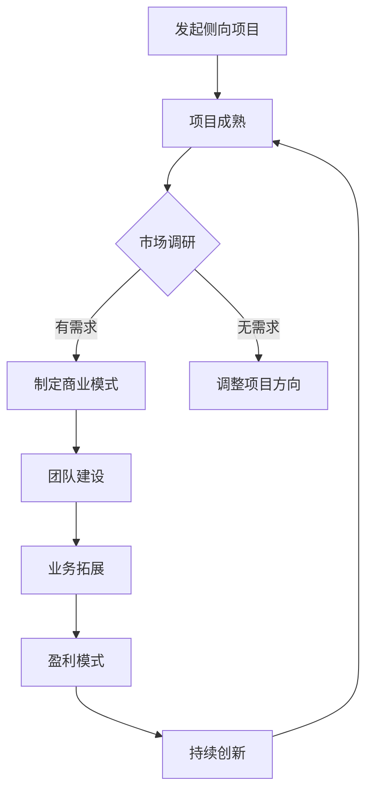

                 

关键词：Side Project，商业化，独立开发，创业，项目管理，增长策略

> 摘要：本文将探讨如何将个人爱好和侧向项目转化为主业，实现从技术爱好者到企业家的转变。我们将通过案例分析、策略规划和实际操作步骤，为侧向项目的主业化提供一套系统的指导方案。

## 1. 背景介绍

在现代技术浪潮的推动下，越来越多的技术爱好者选择将自己的侧向项目发展成为主营业务。这不仅为个人职业发展提供了新的方向，也为整个技术行业注入了创新的活力。然而，将一个侧向项目转化为主业并非易事，需要克服诸多挑战，包括市场定位、团队建设、商业模式和持续创新等方面。

本文将结合实际案例，分析侧向项目转化为主业的成功因素，并提供一整套策略和操作步骤，帮助读者顺利实现这一转变。

## 2. 核心概念与联系

### 2.1 侧向项目的定义

侧向项目（Side Project）通常指的是在主要工作或学习之余，个人投入时间和精力进行的创新性、研究性或实践性的项目。这些项目往往源于个人的兴趣、技术热情或市场需求，具有独立性和灵活性。

### 2.2 主业的定义

主业是指个人或企业主要经营的业务领域，通常涉及核心产品或服务的提供，以及长期的商业运作和盈利模式。将侧向项目转化为主业，意味着项目从个人兴趣转变为具有商业价值和经济回报的活动。

### 2.3 侧向项目与主业的联系

侧向项目与主业之间存在着紧密的联系。侧向项目可以作为主业的技术储备和试验场，通过实践和反馈不断完善，最终形成成熟的主营业务。同时，主业的发展也为侧向项目提供了资源和支持，使得个人或团队能够更加专注于核心技术的研发和市场拓展。

### 2.4 Mermaid 流程图

下面是一个用于描述侧向项目转化为主业流程的 Mermaid 流程图。



## 3. 核心算法原理 & 具体操作步骤

### 3.1 算法原理概述

侧向项目转化为主业的成功依赖于一系列策略和操作步骤。以下是几个关键算法原理：

1. **市场驱动**：以市场需求为导向，确保项目具有商业价值和市场前景。
2. **团队协作**：建立高效的团队，分工合作，提高项目执行效率。
3. **持续创新**：保持技术领先，通过持续创新保持竞争优势。
4. **商业模式**：设计可持续的商业模式，确保项目长期盈利。

### 3.2 算法步骤详解

#### 3.2.1 市场调研

- **需求分析**：通过市场调研，了解目标用户的需求和痛点。
- **竞争分析**：分析竞争对手的产品和策略，找出差异化优势。

#### 3.2.2 制定商业模式

- **价值定位**：明确项目的核心价值和目标市场。
- **盈利模式**：设计可行的盈利模式，如订阅制、广告收入或销售产品。

#### 3.2.3 团队建设

- **角色定位**：明确团队成员的角色和职责。
- **技能匹配**：根据项目需求，招募合适的人才。

#### 3.2.4 业务拓展

- **市场推广**：通过多种渠道推广产品或服务，增加用户基础。
- **合作伙伴**：寻找合作伙伴，扩大业务范围。

#### 3.2.5 盈利模式

- **数据监测**：通过数据监测，了解用户行为和市场反馈。
- **调整策略**：根据数据反馈，调整商业模式和运营策略。

#### 3.2.6 持续创新

- **技术研发**：持续投入研发，保持技术领先。
- **产品迭代**：根据用户反馈，不断优化产品功能。

### 3.3 算法优缺点

**优点**：
- **灵活性**：侧向项目往往具有更高的灵活性，可以快速响应市场变化。
- **创新性**：个人主导的项目往往更具创新性，能够推动技术进步。

**缺点**：
- **资源限制**：个人资源有限，可能难以支撑大规模的商业运作。
- **市场风险**：市场变化快速，需要持续进行市场调研和调整。

### 3.4 算法应用领域

侧向项目转化为主业的算法原理适用于多个领域，如软件开发、互联网服务、硬件制造等。通过灵活运用这些算法，个人或团队能够将侧向项目成功转化为具有商业价值的主营业务。

## 4. 数学模型和公式 & 详细讲解 & 举例说明

### 4.1 数学模型构建

在侧向项目转化为主业的过程中，构建一个有效的数学模型至关重要。该模型应涵盖市场调研、商业模式设计、团队建设等多个方面。

设：
- \( M \) 为市场需求量
- \( P \) 为产品或服务价格
- \( C \) 为成本
- \( R \) 为收入
- \( E \) 为团队效率

则：
\[ R = M \times P - C \]
\[ E = \frac{R}{C} \]

### 4.2 公式推导过程

推导上述公式的过程涉及多个因素的分析：

1. **市场需求量 \( M \)**：
   \( M \) 受到目标用户数量、市场需求强度和竞争状况的影响。
   \[ M = f(u, s, c) \]

2. **产品或服务价格 \( P \)**：
   \( P \) 受到成本、市场竞争和用户价值感知的影响。
   \[ P = g(c, p, v) \]

3. **成本 \( C \)**：
   \( C \) 包括固定成本和可变成本。
   \[ C = h(f_1, f_2, \dots, f_n) \]

4. **收入 \( R \)**：
   \( R \) 是市场需求量和价格的乘积减去成本。
   \[ R = M \times P - C \]

5. **团队效率 \( E \)**：
   \( E \) 是收入和成本的比值，反映了团队的盈利能力。
   \[ E = \frac{R}{C} \]

### 4.3 案例分析与讲解

以一个软件开发项目的市场调研为例，我们通过实际数据来解释上述公式。

假设：
- **市场需求量 \( M \)**：经过调研，目标用户数量为1000人，市场需求强度为中等，竞争状况为低。
- **产品或服务价格 \( P \)**：根据市场分析和用户调研，产品定价为200元/件。
- **成本 \( C \)**：固定成本为10000元，可变成本为100元/件。

则：
\[ R = M \times P - C \]
\[ R = 1000 \times 200 - 10000 \]
\[ R = 200000 - 10000 \]
\[ R = 190000 \]

\[ E = \frac{R}{C} \]
\[ E = \frac{190000}{10000 + 100 \times 1000} \]
\[ E = \frac{190000}{20000} \]
\[ E = 9.5 \]

### 4.4 案例分析与讲解

通过上述例子，我们可以看到如何通过数学模型来分析和评估一个侧向项目的商业潜力。实际操作中，还需考虑更多因素，如市场变化、竞争动态、用户反馈等，以持续优化模型和运营策略。

## 5. 项目实践：代码实例和详细解释说明

### 5.1 开发环境搭建

为了将一个侧向项目成功转化为主业，一个稳定的开发环境是必不可少的。以下是搭建开发环境的基本步骤：

1. **选择合适的编程语言和框架**：根据项目需求，选择适合的编程语言和开发框架。例如，对于Web应用，可以选择Python和Django。

2. **安装必要的开发工具**：安装代码编辑器（如Visual Studio Code）、版本控制系统（如Git）和数据库管理工具（如PostgreSQL）。

3. **配置开发环境**：设置环境变量，安装必要的库和依赖项。

4. **部署测试环境**：在本地或云服务器上搭建测试环境，确保代码能够正常运行。

### 5.2 源代码详细实现

以下是一个简单的Web应用项目的源代码实现示例：

```python
# app.py

from flask import Flask, render_template, request

app = Flask(__name__)

@app.route('/')
def home():
    return render_template('home.html')

@app.route('/contact', methods=['GET', 'POST'])
def contact():
    if request.method == 'POST':
        name = request.form['name']
        email = request.form['email']
        message = request.form['message']
        # 处理和存储用户信息
        return 'Thank you for your message!'
    return render_template('contact.html')

if __name__ == '__main__':
    app.run(debug=True)
```

### 5.3 代码解读与分析

上述代码是一个基于Flask框架的简单Web应用。它包括两个路由：首页（`/`）和联系方式（`/contact`）。以下是代码的主要部分解读：

1. **导入模块**：从Flask模块导入必要的功能。
2. **创建Flask应用实例**：创建一个Flask应用对象。
3. **定义路由函数**：为首页和联系方式页面定义路由函数。
   - `home()` 函数处理首页请求，返回一个HTML模板。
   - `contact()` 函数处理联系方式请求，包括表单提交的处理。
4. **运行应用**：在主函数中运行Flask应用。

### 5.4 运行结果展示

当运行上述代码时，Web应用将启动，并可以通过浏览器访问。首页和联系方式页面的效果如下：

- **首页**：
  ```
  <!DOCTYPE html>
  <html>
  <head>
      <title>Home</title>
  </head>
  <body>
      <h1>Welcome to Our Website</h1>
  </body>
  </html>
  ```

- **联系方式**：
  ```
  <!DOCTYPE html>
  <html>
  <head>
      <title>Contact Us</title>
  </head>
  <body>
      <h1>Contact Us</h1>
      <form method="post">
          <label for="name">Name:</label>
          <input type="text" id="name" name="name"><br><br>
          <label for="email">Email:</label>
          <input type="email" id="email" name="email"><br><br>
          <label for="message">Message:</label>
          <textarea id="message" name="message"></textarea><br><br>
          <input type="submit" value="Submit">
      </form>
  </body>
  </html>
  ```

通过以上示例，我们可以看到如何利用简单的代码实现一个具有实际功能的Web应用。这对于侧向项目转化为主业来说，是一个基本的起点。

## 6. 实际应用场景

### 6.1 开发一个在线教育平台

**项目描述**：开发一个在线教育平台，为用户提供课程学习、课程视频、互动讨论等功能。

**技术架构**：使用Spring Boot作为后端框架，React.js作为前端框架，MySQL作为数据库，Redis作为缓存。

**开发步骤**：
1. **需求分析**：明确平台的功能需求，如用户注册、课程管理、视频播放、讨论区等。
2. **技术选型**：根据需求选择合适的开发技术和框架。
3. **功能实现**：逐步实现平台的功能，包括用户管理、课程管理、视频播放等。
4. **性能优化**：通过Redis缓存、数据库索引等技术手段，优化平台性能。
5. **安全防护**：实现用户身份认证、数据加密等安全措施。

**未来展望**：随着在线教育市场的不断扩大，该平台有望吸引更多的用户和课程，实现商业化运营。

### 6.2 开发一款智能家居控制系统

**项目描述**：开发一款智能家居控制系统，实现智能灯光、智能门锁、智能温控等功能。

**技术架构**：使用Java Spring Boot作为后端框架，Android和iOS作为移动端应用开发框架。

**开发步骤**：
1. **需求分析**：明确用户需求，如远程控制、设备联动、数据监控等。
2. **技术选型**：选择适合的物联网技术和移动端开发框架。
3. **硬件集成**：与智能家居设备厂商合作，实现设备的集成和控制。
4. **应用开发**：开发Android和iOS应用，提供用户友好的操作界面。
5. **云平台搭建**：构建云平台，实现设备数据的存储和处理。

**未来展望**：智能家居市场潜力巨大，该系统有望在未来实现广泛应用，并为用户提供更加便捷、智能的生活体验。

### 6.3 开发一款企业级邮件系统

**项目描述**：开发一款企业级邮件系统，提供邮件收发、邮件管理、邮件过滤等功能。

**技术架构**：使用Java Spring Boot作为后端框架，Thymeleaf作为模板引擎，MySQL作为数据库。

**开发步骤**：
1. **需求分析**：明确企业的邮件管理需求，如用户管理、邮件存储、邮件过滤等。
2. **技术选型**：选择稳定可靠的邮件系统技术框架。
3. **功能实现**：逐步实现邮件收发、邮件管理、邮件过滤等功能。
4. **性能优化**：通过数据库索引、缓存等技术手段，提高系统性能。
5. **安全性增强**：实现用户身份认证、数据加密等安全措施。

**未来展望**：随着企业对邮件系统需求的不断增加，该系统有望在市场上占据一席之地，为用户提供高效、安全的邮件服务。

## 7. 工具和资源推荐

### 7.1 学习资源推荐

1. **书籍**：
   - 《如何创业》（作者：史蒂夫·布兰克）
   - 《精益创业》（作者：埃里克·莱斯）
   - 《产品经理实战手册》（作者：陈中志）

2. **在线课程**：
   - Coursera上的《产品设计与创业策略》
   - Udacity的《初创企业开发实战》
   - edX的《企业策略与商业模型》

### 7.2 开发工具推荐

1. **编程语言**：
   - Python
   - Java
   - JavaScript

2. **开发框架**：
   - Spring Boot
   - Flask
   - React.js

3. **数据库**：
   - MySQL
   - PostgreSQL
   - MongoDB

4. **版本控制**：
   - Git
   - GitHub
   - GitLab

### 7.3 相关论文推荐

1. **论文主题**：侧向项目商业化、创业策略、商业模式创新
2. **关键词**：侧向项目、商业模式、创业成功、市场定位
3. **推荐来源**：学术期刊、会议论文集、行业报告

## 8. 总结：未来发展趋势与挑战

### 8.1 研究成果总结

本文通过对侧向项目转化为主业的探讨，提出了一套系统的策略和操作步骤。研究结果表明，成功的主业化不仅依赖于技术本身，还需要有效的市场调研、团队协作、商业模式设计和持续创新。

### 8.2 未来发展趋势

随着技术的不断进步和市场需求的多样化，侧向项目转化为主业的趋势将进一步增强。人工智能、物联网、区块链等新兴技术的应用，将为侧向项目提供更广阔的发展空间。

### 8.3 面临的挑战

- **资源限制**：个人资源有限，难以支撑大规模的商业运作。
- **市场风险**：市场变化快速，需要持续进行市场调研和调整。
- **竞争压力**：市场竞争激烈，需要不断创新以保持竞争力。

### 8.4 研究展望

未来的研究可以进一步探讨侧向项目在不同领域的具体转化策略，以及如何通过数据分析和人工智能技术提高项目成功率。同时，针对面临的挑战，提出更具操作性的解决方案，以推动侧向项目向主业的成功转化。

## 9. 附录：常见问题与解答

### 9.1 问题1：如何找到市场需求？

**解答**：可以通过市场调研、用户访谈、竞争对手分析等方式，深入了解目标用户的需求和市场趋势。

### 9.2 问题2：如何建立稳定的团队？

**解答**：可以通过招聘、培训、团队文化建设等方式，建立一支高效、稳定的团队。

### 9.3 问题3：如何设计可持续的商业模式？

**解答**：可以通过市场分析、用户反馈、行业报告等方式，设计符合市场需求和项目特点的商业模式。

### 9.4 问题4：如何保持持续创新？

**解答**：可以通过持续投入研发、关注行业动态、参与技术社区等方式，保持持续创新。

---

**作者：禅与计算机程序设计艺术 / Zen and the Art of Computer Programming**

