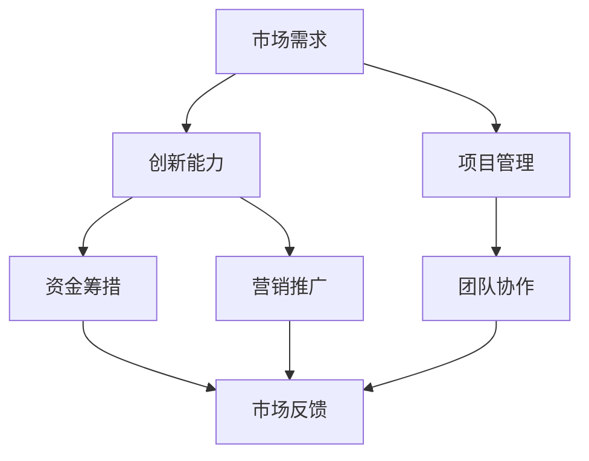

                 

关键词：Side Project、转化、主业、创业、策略、市场、项目管理、技术创新

> 摘要：本文将探讨如何将Side Project成功转化为主业，通过分析成功的案例、制定合适的策略和执行有效的项目管理，为开发者提供一套切实可行的路径。我们将深入探讨市场调研、产品定位、资金筹措和营销推广等关键环节，帮助读者将爱好变成事业。

## 1. 背景介绍

在现代信息技术迅猛发展的背景下，越来越多的开发者开始尝试将自己的爱好或者创意转化为实际的商业项目，这就是所谓的“Side Project”。这些项目往往起源于个人兴趣，经过不断的迭代和完善，逐渐演变为具有市场潜力的产品。然而，将Side Project成功转化为主业并非易事，它需要开发者具备敏锐的市场洞察力、扎实的项目管理能力和创新的思维。

本文将结合实际案例，分析成功转化过程的关键要素，为开发者提供一套系统化的方法。文章将分为以下几个部分：

- **背景介绍**：解释Side Project的定义、现状及转化为主业的重要性。
- **核心概念与联系**：阐述将Side Project转化为主业的必要条件和关联因素。
- **核心算法原理 & 具体操作步骤**：详细讨论如何将项目转化为商业实践。
- **数学模型和公式**：介绍用于评估项目潜力的量化模型。
- **项目实践**：提供实际的代码实现和案例分析。
- **实际应用场景**：探讨产品在市场中的定位和潜力。
- **工具和资源推荐**：推荐学习资源和开发工具。
- **总结**：总结研究成果，展望未来趋势和挑战。

### 核心概念与联系

在将Side Project转化为主业的过程中，以下几个核心概念和联系是至关重要的：

1. **市场需求**：了解目标市场的需求，确保产品能解决实际问题。
2. **创新能力**：持续的创新是产品保持市场竞争力的关键。
3. **项目管理**：有效的项目管理能够确保项目按时、按质完成。
4. **资金筹措**：充足的资金是项目成功的基础。
5. **营销推广**：有效的营销策略能够帮助产品快速进入市场。
6. **团队协作**：一个优秀的团队是项目成功的保障。

下面我们将使用Mermaid流程图来展示这些概念和它们之间的联系：



### 3. 核心算法原理 & 具体操作步骤

#### 3.1 算法原理概述

将Side Project成功转化为主业的过程可以看作是一个复杂系统的优化问题。其核心算法原理包括以下几个方面：

1. **需求分析**：通过市场调研确定产品的市场需求。
2. **创新设计**：基于需求进行创新产品设计。
3. **项目管理**：运用敏捷开发和迭代方法进行项目管理和任务分配。
4. **风险评估**：对项目进行全面的财务和风险评估。
5. **市场推广**：制定并实施有效的市场推广策略。

#### 3.2 算法步骤详解

1. **需求分析**
   - 进行市场调研，收集目标用户的需求和痛点。
   - 利用数据分析和用户反馈，确定产品的核心功能。

2. **创新设计**
   - 结合市场需求，设计创新性的产品解决方案。
   - 使用原型设计方法，快速构建产品原型并进行测试。

3. **项目管理**
   - 采用敏捷开发方法，分阶段进行任务规划和执行。
   - 使用项目管理工具（如Jira、Trello等）跟踪项目进度。

4. **风险评估**
   - 对项目进行财务评估，确保资金充足。
   - 对市场风险进行评估，制定应对策略。

5. **市场推广**
   - 制定营销计划，包括内容营销、社交媒体推广等。
   - 进行市场测试，根据反馈调整营销策略。

#### 3.3 算法优缺点

**优点：**
- **灵活性强**：能够快速响应市场变化和用户需求。
- **高效执行**：使用敏捷开发和迭代方法，确保项目高效推进。
- **风险评估**：对项目和市场的风险进行评估，提前做好准备。

**缺点：**
- **资源需求**：需要充足的资金和人力资源支持。
- **市场波动**：市场需求变化可能对项目产生重大影响。
- **时间压力**：需要快速迭代和部署，时间压力较大。

#### 3.4 算法应用领域

该算法原理适用于各种类型的Side Project，包括但不限于：

- **Web应用开发**
- **移动应用开发**
- **游戏开发**
- **人工智能项目**
- **区块链项目**

### 4. 数学模型和公式 & 详细讲解 & 举例说明

#### 4.1 数学模型构建

为了评估Side Project的潜力，我们可以构建以下数学模型：

1. **市场需求模型**：使用客户价值（Customer Value，CV）来衡量产品的市场需求。
   $$ CV = f(Demand, Solution, Price) $$

2. **财务模型**：使用净现值（Net Present Value，NPV）来评估项目的财务可行性。
   $$ NPV = \sum_{t=1}^{n} \frac{CF_t}{(1+r)^t} $$

   其中，$CF_t$ 表示第 $t$ 年的现金流量，$r$ 为折现率。

3. **风险评估模型**：使用风险价值（Value at Risk，VaR）来评估项目的市场风险。
   $$ VaR = -\alpha \cdot \sigma \cdot Z_{\alpha} $$

   其中，$\sigma$ 为收益的标准差，$Z_{\alpha}$ 为正态分布的分位数。

#### 4.2 公式推导过程

**市场需求模型推导：**
市场需求模型基于客户价值的概念，客户价值是需求（Demand）、解决方案（Solution）和价格（Price）的函数。通过调研和分析，我们可以确定每个变量的权重和取值范围，从而构建客户价值的数学模型。

**财务模型推导：**
财务模型基于净现值的原理，通过将未来现金流量折现到当前价值，计算出项目的净现值。该模型假设每年的现金流量是恒定的，并且考虑了折现率的影响。

**风险评估模型推导：**
风险评估模型基于收益的概率分布，通过计算正态分布的分位数，得出项目在一定置信水平下的最大可能亏损。

#### 4.3 案例分析与讲解

**案例：某Web应用项目的评估**

**需求分析：**
假设某Web应用项目的市场需求为 $D = 1000$，解决方案的满意度为 $S = 0.9$，价格为 $P = 100$。

**市场需求模型计算：**
$$ CV = f(D, S, P) = 1000 \cdot 0.9 \cdot 100 = 90000 $$

**财务分析：**
假设项目的初始投资为 $CF_0 = -50000$，每年收入为 $CF_1 = 30000$，折现率为 $r = 0.1$。

**净现值计算：**
$$ NPV = \frac{CF_1}{(1+0.1)^1} = \frac{30000}{1.1} \approx 27273 $$

**风险评估：**
假设项目收益的标准差为 $\sigma = 10000$，置信水平为 $95\%$。

**风险价值计算：**
$$ VaR = -0.05 \cdot 10000 \cdot 1.65 = -8250 $$

通过上述计算，我们可以得出该Web应用项目的市场需求价值为90000，净现值为27273，风险价值为8250。这些数据可以帮助项目团队评估项目的财务可行性和市场风险。

### 5. 项目实践：代码实例和详细解释说明

#### 5.1 开发环境搭建

在进行项目实践之前，我们需要搭建一个合适的开发环境。以下是一个基本的开发环境搭建步骤：

1. 安装操作系统：推荐使用Linux或MacOS，因为它们具有更好的开发工具支持。
2. 安装编程语言：根据项目需求选择合适的编程语言，如Python、Java或JavaScript。
3. 安装开发工具：选择合适的集成开发环境（IDE），如Visual Studio Code、Eclipse或IntelliJ IDEA。
4. 安装数据库：根据项目需求选择合适的数据库，如MySQL、PostgreSQL或MongoDB。

#### 5.2 源代码详细实现

以下是一个简单的Web应用项目示例，使用Python和Flask框架进行实现。

```python
from flask import Flask, request, jsonify

app = Flask(__name__)

@app.route('/api/data', methods=['POST'])
def handle_data():
    data = request.get_json()
    # 对数据进行处理
    processed_data = process_data(data)
    return jsonify(processed_data)

def process_data(data):
    # 数据处理逻辑
    return data

if __name__ == '__main__':
    app.run(debug=True)
```

#### 5.3 代码解读与分析

上述代码实现了一个简单的Web应用，它使用Flask框架处理HTTP请求。以下是代码的详细解读：

1. **导入模块**：从Flask库中导入必要的模块。
2. **创建Flask应用**：创建一个Flask应用对象。
3. **定义路由**：定义一个处理POST请求的路由，路径为 `/api/data`。
4. **处理数据**：在路由函数中接收JSON格式的数据，并进行处理。
5. **返回结果**：将处理后的数据返回给客户端。
6. **运行应用**：在主函数中运行应用，开启调试模式。

通过这个简单的示例，我们可以了解如何使用Python和Flask框架快速搭建一个Web应用。在实际项目中，我们需要根据需求添加更多的功能和模块，如用户认证、数据存储和前端界面等。

#### 5.4 运行结果展示

在本地环境中运行上述代码，使用Postman等工具发送POST请求到 `http://localhost:5000/api/data`，即可看到返回的处理结果。这只是一个简单的示例，实际项目会更加复杂和多样化。

### 6. 实际应用场景

将Side Project成功转化为主业后，产品将在实际应用场景中发挥作用。以下是一些典型的应用场景：

1. **企业应用**：为企业提供定制化的解决方案，如ERP系统、客户关系管理（CRM）系统等。
2. **消费者应用**：为个人用户提供实用工具，如健康监测应用、财务管理应用等。
3. **教育应用**：为教育机构提供在线教育平台、学习工具等。
4. **游戏应用**：开发各类游戏应用，吸引大量用户。
5. **区块链应用**：利用区块链技术提供去中心化服务，如数字货币、智能合约等。

在这些应用场景中，产品需要满足用户的需求，提供优质的使用体验，并不断迭代更新，以保持市场竞争力。

#### 6.4 未来应用展望

随着技术的不断进步，Side Project的转化前景广阔。未来，以下趋势将对Side Project的发展产生重要影响：

1. **人工智能与大数据**：人工智能和大数据技术的应用将进一步提升产品的智能化水平和数据处理能力。
2. **区块链**：区块链技术的普及将带来新的商业机会，为Side Project提供更安全、透明的解决方案。
3. **物联网**：物联网技术的快速发展将推动智能设备的应用，为Side Project提供新的场景。
4. **云计算与边缘计算**：云计算和边缘计算的结合将提供更灵活、高效的计算服务，为Side Project的发展提供支持。
5. **5G与6G**：5G和6G技术的应用将提升网络速度和通信质量，为Side Project提供更广泛的场景。

### 7. 工具和资源推荐

为了帮助开发者更好地进行Side Project的开发和转化，以下是一些推荐的工具和资源：

#### 7.1 学习资源推荐

- **在线课程**：Coursera、Udemy、edX等平台提供丰富的技术课程。
- **技术博客**：Medium、GitHub、Stack Overflow等技术社区，提供大量的技术文章和讨论。
- **开源社区**：GitHub、GitLab等平台，汇集了大量的开源项目和资源。

#### 7.2 开发工具推荐

- **集成开发环境（IDE）**：Visual Studio Code、Eclipse、IntelliJ IDEA等。
- **版本控制工具**：Git、GitHub、GitLab等。
- **项目管理工具**：Jira、Trello、Asana等。

#### 7.3 相关论文推荐

- **《软件工程：实践者的研究方法》**：提供软件工程领域的基础知识和实践方法。
- **《区块链：从原理到实践》**：详细介绍区块链技术的原理和应用。
- **《人工智能：一种现代方法》**：全面介绍人工智能的基础理论和应用。

### 8. 总结：未来发展趋势与挑战

将Side Project成功转化为主业是一个复杂而充满挑战的过程。在未来，随着技术的不断进步和市场的变化，开发者需要持续学习和创新，以应对新的挑战。以下是对未来发展趋势和挑战的总结：

#### 8.1 研究成果总结

- **市场需求**：通过市场调研和用户反馈，不断调整和优化产品功能。
- **项目管理**：采用敏捷开发和迭代方法，提高项目执行效率。
- **技术创新**：紧跟技术发展趋势，不断创新，提升产品竞争力。
- **财务评估**：全面评估项目的财务可行性，确保项目可持续发展。

#### 8.2 未来发展趋势

- **人工智能与大数据**：人工智能和大数据技术的应用将进一步提升产品的智能化水平和数据处理能力。
- **区块链**：区块链技术的普及将带来新的商业机会，为Side Project提供更安全、透明的解决方案。
- **物联网**：物联网技术的快速发展将推动智能设备的应用，为Side Project提供新的场景。
- **云计算与边缘计算**：云计算和边缘计算的结合将提供更灵活、高效的计算服务，为Side Project的发展提供支持。
- **5G与6G**：5G和6G技术的应用将提升网络速度和通信质量，为Side Project提供更广泛的场景。

#### 8.3 面临的挑战

- **市场竞争**：随着技术的快速发展，市场竞争将愈发激烈，开发者需要不断创新，提升产品竞争力。
- **技术更新**：技术更新速度快，开发者需要持续学习和适应新技术。
- **项目管理**：项目管理难度大，需要开发者具备良好的项目管理和沟通能力。
- **资金压力**：资金不足可能影响项目的持续推进，需要开发者积极寻求资金支持。

#### 8.4 研究展望

未来，开发者可以通过以下方向进行研究和探索：

- **跨领域融合**：探索人工智能、区块链、物联网等技术的跨领域应用。
- **个性化定制**：开发基于用户行为的个性化产品，提升用户体验。
- **可持续发展**：关注环境保护和可持续发展，推动绿色技术的应用。

### 附录：常见问题与解答

1. **如何进行市场需求分析？**
   - 进行市场调研，收集用户反馈。
   - 分析竞争对手，了解市场趋势。
   - 结合数据分析，确定产品的市场需求。

2. **如何确保项目按时完成？**
   - 制定详细的项目计划，明确任务和时间节点。
   - 采用敏捷开发方法，快速迭代和调整。
   - 使用项目管理工具，实时跟踪项目进度。

3. **如何进行财务评估？**
   - 计算项目的初始投资和预期收益。
   - 使用净现值和内部收益率等指标进行评估。
   - 考虑市场风险和财务风险，制定应对策略。

4. **如何进行市场推广？**
   - 制定有效的营销策略，包括内容营销、社交媒体推广等。
   - 进行市场测试，根据反馈调整营销策略。
   - 利用口碑营销，提升产品的品牌知名度。

通过以上问题和解答，开发者可以更好地理解将Side Project成功转化为主业的过程，并采取有效的措施应对各种挑战。希望本文能为开发者提供有价值的参考和启示。

---

**作者：禅与计算机程序设计艺术 / Zen and the Art of Computer Programming**

