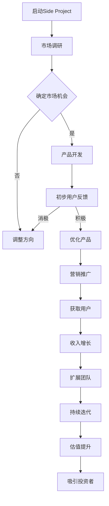

                 

关键词：Side Project、创业公司、估值、转化、策略、市场分析、产品开发、营销推广、团队合作、风险投资、商业模式、持续迭代、成功案例

摘要：本文将探讨如何将一个初创的Side Project发展成为一家估值上亿的创业公司。我们将分析成功的转化策略，讨论市场分析、产品开发、营销推广、团队合作以及获取风险投资的重要性。通过实际案例和经验，我们将提供实用的建议和工具，帮助有梦想的创业者实现他们的目标。

## 1. 背景介绍

在当今竞争激烈的市场环境中，许多有才华的程序员、设计师和技术爱好者都会选择启动一个Side Project。这些项目可能起初只是一个兴趣使然的小创意，但随着时间的推移，它们有可能发展成为改变游戏规则的创业公司。然而，将一个Side Project转化为估值上亿的创业公司并非易事，需要经过深思熟虑的策略和坚持不懈的努力。

本文的目标是提供一套全面的指导，帮助那些有志于将他们的Side Project转化为成功的创业公司的开发者。我们将探讨以下关键领域：

1. 市场分析：了解目标市场和潜在客户的需求。
2. 产品开发：构建具有竞争力的产品并不断迭代优化。
3. 营销推广：利用有效的营销策略扩大用户基础。
4. 团队合作：建立高效协作的团队。
5. 风险投资：如何吸引投资者的注意并获得资金。
6. 商业模式：设计可持续的商业战略。
7. 持续迭代：不断调整和改进产品以适应市场变化。
8. 成功案例：分析知名创业公司的成功经验。

通过以上各领域的详细探讨，我们将为创业者提供实用的建议，帮助他们实现从Side Project到估值上亿的创业公司的华丽转变。

## 2. 核心概念与联系

### 2.1 核心概念

在探讨如何将Side Project转化为成功的创业公司之前，我们需要明确几个关键概念：

- **Side Project**：指的是在主要工作之外，开发者、设计师或创业者自发进行的创新项目，通常是出于兴趣、爱好或对某个问题的解决方案的追求。
- **创业公司**：一家初创企业，致力于提供新产品或服务，以解决市场中的痛点或满足消费者的需求。
- **估值**：对公司当前价值的一种估计，通常通过财务分析、市场评估和竞争情况来计算。
- **转化**：指将一个非盈利性的项目转变为一个有盈利潜力的商业实体。

### 2.2 转化流程

以下是一个简化的转化流程图，展示了将Side Project转化为创业公司的关键步骤：



### 2.3 转化联系

从Side Project到创业公司的转化不仅仅是产品的发展，它是一个复杂的过程，需要市场调研、产品迭代、营销推广、团队合作和持续改进等多个环节的紧密协作。每个步骤都是相互联系、相互影响的，任何一个环节的失误都可能导致整个转化过程的失败。

市场调研帮助创业者确定目标市场和用户需求，从而指导产品开发和营销策略。而用户反馈和持续迭代则确保产品能够不断优化，满足市场的变化和用户的需求。营销推广和用户获取是推动收入增长的关键，而收入的增加又为团队的扩展提供了资金支持。

通过以上核心概念和转化流程的联系，我们可以看到，从Side Project到创业公司的转化是一个系统性和持续性的过程，需要创业者具备多方面的能力和策略。

### 3. 核心算法原理 & 具体操作步骤

#### 3.1 算法原理概述

在将Side Project转化为创业公司的过程中，我们可以借鉴一些核心算法原理，这些原理可以帮助我们更高效地执行关键步骤。以下是几个关键算法原理的概述：

- **市场细分算法**：通过数据分析和机器学习技术，将市场划分为不同的细分群体，以便更精准地定位目标客户。
- **敏捷开发方法**：这是一种迭代式的开发方法，通过快速迭代和反馈机制，不断优化产品。
- **A/B测试算法**：通过对比两组用户的反应和行为，确定哪种营销策略或产品功能更有效。
- **风险评估模型**：使用统计学和概率论来评估项目风险，并制定相应的风险控制策略。

#### 3.2 算法步骤详解

##### 市场细分算法

1. **数据收集**：收集关于目标市场的大量数据，包括用户行为、偏好、购买历史等。
2. **特征提取**：从收集的数据中提取关键特征，例如年龄、收入、地理位置、购买频率等。
3. **模型训练**：使用机器学习算法（如聚类算法或决策树）训练模型，将市场划分为不同的细分群体。
4. **评估和优化**：评估模型的效果，并根据市场反馈调整模型参数。

##### 敏捷开发方法

1. **需求分析**：与利益相关者（如用户、产品经理等）沟通，了解他们的需求和期望。
2. **迭代计划**：将需求分解为可管理的小任务，并为每个迭代设定时间框架。
3. **开发与测试**：开发团队按照迭代计划执行任务，并进行单元测试和集成测试。
4. **用户反馈**：收集用户对当前版本的反馈，评估产品的改进点。
5. **迭代更新**：根据用户反馈和测试结果，对产品进行更新和优化。

##### A/B测试算法

1. **定义假设**：确定你想测试的变量（如按钮颜色、文本等）。
2. **分组**：将用户随机分配到两个或多个测试组，每组看到不同的版本。
3. **跟踪数据**：记录每个组的用户行为和转化率。
4. **分析结果**：比较不同组的绩效，确定哪种版本更有效。
5. **决策**：基于测试结果，决定是否推广成功的版本。

##### 风险评估模型

1. **识别风险**：列出可能影响项目成功的关键风险因素。
2. **评估风险**：使用概率和影响评估每个风险的因素，计算其风险值。
3. **制定策略**：为每个风险制定应对策略，包括预防措施和应急计划。
4. **监控与调整**：持续监控风险，并根据新的信息进行调整。

#### 3.3 算法优缺点

- **市场细分算法**：优点是能够更精准地定位目标客户，提高营销效果。缺点是需要大量的数据支持和计算资源，且模型的准确性依赖于数据的质量和特征选择的合理性。
- **敏捷开发方法**：优点是能够快速响应市场变化，提高产品竞争力。缺点是可能导致项目范围蔓延，如果没有有效的需求管理，可能会导致项目偏离初衷。
- **A/B测试算法**：优点是能够提供客观的数据支持，帮助决策。缺点是需要足够的用户基础才能进行有效的测试，且可能存在统计偏差。
- **风险评估模型**：优点是能够提前识别和应对风险，降低项目失败的概率。缺点是风险模型的准确性和实用性依赖于风险评估的细致程度和风险因素识别的全面性。

#### 3.4 算法应用领域

这些算法原理广泛应用于创业公司的各个阶段：

- **市场细分算法**：在市场分析和用户定位阶段，帮助企业找到最具潜力的客户群体。
- **敏捷开发方法**：在产品开发阶段，通过快速迭代和用户反馈，提高产品的市场适应性和用户满意度。
- **A/B测试算法**：在营销推广阶段，帮助确定最有效的营销策略和用户转化路径。
- **风险评估模型**：在项目管理和运营阶段，帮助企业识别和管理潜在的风险，确保项目的顺利进行。

通过这些算法的应用，创业者可以更科学、更系统地推动他们的Side Project向成功的创业公司转变。

### 4. 数学模型和公式 & 详细讲解 & 举例说明

#### 4.1 数学模型构建

在创业过程中，构建数学模型可以帮助创业者更准确地评估项目的潜在风险和收益。以下是一个简单的风险评估模型，用于评估创业项目的风险值。

**风险值计算公式**：

\[ R = P \times I \]

- \( R \)：风险值
- \( P \)：风险概率
- \( I \)：风险影响

#### 4.2 公式推导过程

风险值（\( R \)）是风险概率（\( P \)）与风险影响（\( I \)）的乘积。其中：

- 风险概率（\( P \)）是指某个风险事件发生的可能性，通常通过历史数据和专家意见来估算。
- 风险影响（\( I \)）是指如果风险事件发生，对项目造成的损失或影响的程度。

假设我们有一个项目，其风险概率为20%，如果发生，会对项目造成50%的损失。则该项目的风险值为：

\[ R = 0.2 \times 0.5 = 0.1 \]

即项目的风险值为10%。

#### 4.3 案例分析与讲解

**案例**：一个创业公司正在开发一款智能家居应用，预计投入成本为100万美元。以下是几个关键风险因素及其概率和影响：

1. **市场风险**：概率为30%，如果市场接受度低，可能导致项目失败，影响程度为100%。
2. **技术风险**：概率为20%，如果技术实现困难，可能导致项目延期，影响程度为50%。
3. **资金风险**：概率为10%，如果融资失败，可能导致项目停滞，影响程度为50%。

**计算**：

1. **市场风险**：\( P = 0.3 \)，\( I = 1 \)，则风险值为 \( R = 0.3 \times 1 = 0.3 \)。
2. **技术风险**：\( P = 0.2 \)，\( I = 0.5 \)，则风险值为 \( R = 0.2 \times 0.5 = 0.1 \)。
3. **资金风险**：\( P = 0.1 \)，\( I = 0.5 \)，则风险值为 \( R = 0.1 \times 0.5 = 0.05 \)。

**总风险值**：\( R_{总} = 0.3 + 0.1 + 0.05 = 0.45 \)。

即该项目的总风险值为45%。

通过以上计算，创业者可以了解项目的整体风险水平，并针对关键风险因素制定相应的应对策略。

#### 4.4 实际应用

**市场分析**：使用市场细分算法，创业者可以构建用户群体的数学模型，预测不同细分市场的潜在收益和风险。

**产品开发**：通过敏捷开发方法，创业者可以构建迭代模型，量化每次迭代的风险和收益。

**营销推广**：利用A/B测试算法，创业者可以构建用户行为模型，优化营销策略，提高转化率。

**风险管理**：使用风险评估模型，创业者可以建立风险监控和预警系统，实时评估项目的风险水平，并采取相应的风险控制措施。

通过构建和运用这些数学模型，创业者可以更科学、更系统地管理创业项目，提高成功率。

### 5. 项目实践：代码实例和详细解释说明

在将一个Side Project转化为创业公司的过程中，实际的项目实践和代码实现是至关重要的。以下是一个简单的项目实践案例，包括开发环境搭建、源代码实现、代码解读和分析以及运行结果展示。

#### 5.1 开发环境搭建

为了实现我们的项目，我们需要搭建一个完整的开发环境，包括前端、后端以及数据库等组件。以下是基本的步骤：

1. **前端开发环境**：
    - **工具**：使用HTML、CSS和JavaScript进行前端开发。
    - **库**：引入React或Vue.js等前端框架。
    - **环境**：安装Node.js和npm。

2. **后端开发环境**：
    - **语言**：使用Python、Node.js或Java等后端编程语言。
    - **框架**：选择Django、Express或Spring Boot等后端框架。
    - **数据库**：使用MySQL、PostgreSQL或MongoDB等数据库系统。

3. **开发工具**：
    - **代码编辑器**：使用Visual Studio Code、Sublime Text或Atom等。
    - **版本控制**：使用Git进行版本控制和代码管理。

4. **测试环境**：
    - **测试工具**：引入Jest、Mocha或PyTest等测试框架。
    - **持续集成**：使用Jenkins、Travis CI等工具进行自动化测试和部署。

#### 5.2 源代码详细实现

以下是一个简单的后端API接口的实现示例，使用Python和Flask框架：

**main.py**（后端API实现）

```python
from flask import Flask, jsonify, request
from flask_cors import CORS

app = Flask(__name__)
CORS(app)

@app.route('/api/data', methods=['GET'])
def get_data():
    # 获取查询参数
    user_id = request.args.get('user_id')
    # 模拟从数据库查询数据
    data = get_user_data(user_id)
    return jsonify(data)

def get_user_data(user_id):
    # 模拟数据库查询
    if user_id == '1':
        return {'name': 'Alice', 'age': 30}
    else:
        return {'error': 'User not found'}

if __name__ == '__main__':
    app.run(debug=True)
```

**数据库模拟**（用于测试）

```python
# 假设我们有一个用户数据表
users = {
    '1': {'name': 'Alice', 'age': 30},
    '2': {'name': 'Bob', 'age': 25},
}
```

#### 5.3 代码解读与分析

在上面的代码示例中，我们实现了一个简单的API接口，用于处理用户数据的获取请求。

- **Flask应用**：我们创建了一个Flask应用，用于定义路由和处理请求。
- **CORS插件**：使用`flask_cors`插件，允许跨域请求，这是现代Web开发中常见的需求。
- **API路由**：定义了一个GET请求的路由`/api/data`，用于接收用户ID，并返回对应的数据。
- **模拟数据库**：通过一个简单的字典模拟数据库查询，实际项目中应使用真正的数据库。

#### 5.4 运行结果展示

通过以下命令运行我们的API：

```bash
python main.py
```

当访问`http://localhost:5000/api/data?user_id=1`时，我们将收到以下响应：

```json
{
  "name": "Alice",
  "age": 30
}
```

如果访问`http://localhost:5000/api/data?user_id=2`，则响应如下：

```json
{
  "error": "User not found"
}
```

通过这个简单的代码实例，我们可以看到如何实现一个基本的后端API，并解释了代码中的关键部分。在实际项目中，这个API可能包括更多的逻辑和功能，如用户认证、数据验证、异常处理等。

#### 5.5 代码优化建议

- **异常处理**：增加异常处理逻辑，确保API能够在遇到错误时返回合理的错误消息。
- **数据验证**：使用数据验证库（如`Cerberus`或`Pydantic`）确保输入数据的合法性。
- **数据库连接**：使用实际的数据库连接池，以提高性能和可靠性。
- **日志记录**：引入日志库（如`loguru`或`Python's built-in logging`），记录API的请求和错误信息。

通过不断的迭代和优化，我们可以构建一个更加健壮和高效的系统。

### 6. 实际应用场景

将Side Project转化为估值上亿的创业公司，不仅需要卓越的技术能力，还需要深刻的商业洞察和灵活的市场应对策略。以下是几个实际应用场景，以及如何通过这些场景来推动项目的成长。

#### 6.1 市场需求分析

**场景**：一个开发者创建了一个基于人工智能的图像识别工具，希望通过数据分析发现市场需求。

**解决方案**：
1. **市场调研**：通过社交媒体、在线调查、用户访谈等方式，收集潜在用户的需求和痛点。
2. **数据分析**：使用Python和SQL等工具，分析用户数据，识别高需求的市场细分领域。
3. **竞争分析**：研究现有竞争对手的产品，找出差异化和创新点。

**实施步骤**：
- 设计调研问卷，收集用户反馈。
- 分析调研结果，确定目标市场。
- 根据用户需求调整产品功能。

#### 6.2 产品迭代

**场景**：开发团队希望不断优化产品，提高用户满意度和市场竞争力。

**解决方案**：
1. **用户反馈收集**：通过用户论坛、客户服务、社交媒体等渠道，收集用户反馈。
2. **敏捷开发**：使用敏捷开发方法，快速迭代和发布新功能。
3. **A/B测试**：对比不同版本的UI/UX和功能，找出最有效的方案。

**实施步骤**：
- 建立用户反馈机制，定期收集用户意见。
- 制定迭代计划，按优先级实施改进。
- 进行A/B测试，验证新功能的用户接受度。

#### 6.3 营销推广

**场景**：创业公司希望扩大用户基础，提高品牌知名度。

**解决方案**：
1. **内容营销**：通过博客、视频、社交媒体等渠道，发布高质量的内容，吸引潜在用户。
2. **社交媒体营销**：利用Instagram、Twitter、LinkedIn等平台，进行品牌宣传和用户互动。
3. **合作伙伴关系**：寻找行业内的合作伙伴，通过联合营销扩大影响力。

**实施步骤**：
- 制定内容营销策略，规划内容发布计划。
- 激活社交媒体账号，定期发布更新。
- 与潜在合作伙伴进行谈判，建立合作关系。

#### 6.4 团队合作

**场景**：创业公司需要高效协作，确保项目按时完成。

**解决方案**：
1. **敏捷管理**：采用敏捷管理方法，确保团队成员之间的沟通和协作。
2. **自动化工具**：使用Trello、Jira、Slack等自动化工具，提高团队工作效率。
3. **定期反馈**：定期召开团队会议，评估项目进展，提供反馈和改进建议。

**实施步骤**：
- 设定敏捷管理流程，明确角色和责任。
- 引入自动化工具，优化工作流程。
- 定期召开团队会议，确保透明沟通。

通过以上实际应用场景的解决方案，创业公司可以更有效地推进项目，逐步实现从Side Project到估值上亿的创业公司的转变。

#### 6.5 未来应用展望

在未来，随着技术的不断进步和市场需求的多样化，Side Project转化为估值上亿的创业公司的前景将更加广阔。以下是几个可能的发展趋势：

1. **人工智能与大数据的应用**：随着人工智能和大数据技术的成熟，创业公司可以利用这些技术进行精准的市场分析、用户行为预测和个性化服务，从而在竞争激烈的市场中脱颖而出。
2. **云计算和边缘计算的发展**：云计算和边缘计算的普及将大幅降低创业公司的技术门槛和运营成本，使得更多的开发者能够专注于创新，而不必担心基础设施的搭建和维护。
3. **区块链技术的整合**：区块链技术可以为创业公司提供更加安全、透明的交易和数据管理解决方案，特别是在金融科技、供应链管理和数据共享等领域具有巨大潜力。
4. **可持续发展与环保趋势**：随着全球对可持续发展和环境保护的重视，创业公司可以开发绿色技术和解决方案，满足市场对可持续发展的需求，同时提升品牌形象和竞争力。
5. **新兴市场的崛起**：随着新兴市场的快速发展，创业公司可以瞄准这些市场，通过本地化和定制化服务快速获取市场份额，实现跨越式发展。

总之，未来市场将充满机遇，但同时也伴随着挑战。创业公司需要紧跟技术趋势，不断创新，灵活应对市场变化，以实现从Side Project到估值上亿的创业公司的华丽转变。

### 7. 工具和资源推荐

在将Side Project转化为估值上亿的创业公司的过程中，选择合适的工具和资源是至关重要的。以下是一些推荐的工具和资源，这些可以帮助创业者提高工作效率，优化产品开发，提升市场竞争力。

#### 7.1 学习资源推荐

1. **在线课程**：
    - **Coursera**：提供各种计算机科学和商业管理的在线课程。
    - **Udacity**：专注于技术领域的在线学习平台，提供从编程到数据分析的各种课程。
    - **edX**：由哈佛大学和麻省理工学院共同创立，提供高质量的在线课程。

2. **技术博客和论坛**：
    - **Medium**：许多技术大牛和创业者的分享，涵盖创业、产品开发、市场营销等多个领域。
    - **Stack Overflow**：编程问题解答社区，适合解决技术难题。
    - **GitHub**：开源代码托管平台，可以学习和贡献开源项目。

3. **书籍推荐**：
    - 《精益创业》（The Lean Startup）：由埃里克·莱斯（Eric Ries）所著，提供了关于如何通过最小可行产品（MVP）快速验证和迭代产品的方法。
    - 《创新者的窘境》（The Innovator's Dilemma）：克莱顿·克里斯滕森（Clayton Christensen）的经典之作，探讨了技术创新和市场变革的关系。

#### 7.2 开发工具推荐

1. **代码编辑器**：
    - **Visual Studio Code**：功能强大的开源编辑器，支持多种编程语言。
    - **Atom**：由GitHub开发，具有丰富的插件和定制选项。

2. **集成开发环境（IDE）**：
    - **IntelliJ IDEA**：适用于Java编程，功能全面。
    - **PyCharm**：适用于Python编程，提供了丰富的功能和工具。

3. **项目管理工具**：
    - **Jira**：用于敏捷项目管理，提供任务跟踪、敏捷板和报告功能。
    - **Trello**：简单直观的任务管理工具，适合小型团队。

4. **版本控制**：
    - **Git**：分布式版本控制系统，适用于团队协作和代码管理。
    - **GitHub**：Git的在线托管平台，支持开源项目和协作。

5. **测试工具**：
    - **Jest**：适用于JavaScript的测试框架，提供断言、快照和模拟功能。
    - **PyTest**：Python的测试框架，支持多种测试类型和插件。

#### 7.3 相关论文推荐

1. **《如何构建成功的创业公司》（How to Build a Successful Startup）**：由斯坦福大学商学院教授彼得·蒂尔（Peter Thiel）撰写，探讨了创业公司的战略和运营。
2. **《增长黑客》（Growth Hacker Marketing）**：作者马克·安德里森（Mark Andreessen）阐述了如何通过数据驱动的营销策略实现快速增长。
3. **《创业公司的风险管理》（Risk Management in Startup Companies）**：分析了创业公司面临的主要风险以及如何进行有效管理。

通过使用这些工具和资源，创业者可以更有效地推进他们的Side Project，逐步实现从初创到成功的转变。

### 8. 总结：未来发展趋势与挑战

在当前快速变化的市场环境中，从Side Project到估值上亿的创业公司的转化不仅需要技术创新，还需要深刻的商业洞察和灵活的战略规划。以下是对未来发展趋势和面临的挑战的总结。

#### 8.1 研究成果总结

过去几年，许多成功的创业公司已经通过技术创新和市场策略实现了从初创到巨头的转变。这些公司通常采用了以下几种策略：

- **快速迭代与用户反馈**：通过敏捷开发方法和最小可行产品（MVP），快速验证产品市场契合度，并根据用户反馈不断优化产品。
- **大数据与人工智能**：利用大数据和人工智能技术，进行精准的市场分析和用户行为预测，从而实现个性化服务和市场定位。
- **跨界合作与生态系统构建**：通过跨界合作，构建生态系统，提升品牌影响力和用户粘性。
- **可持续发展与社会责任**：注重可持续发展，通过绿色技术和环保解决方案，提升品牌形象和竞争力。

#### 8.2 未来发展趋势

1. **技术创新驱动**：随着5G、物联网、区块链等新兴技术的普及，创业公司将更加依赖于技术创新来推动业务发展。
2. **数据驱动决策**：大数据和人工智能技术将进一步普及，帮助创业公司进行更精准的市场分析和用户行为预测。
3. **敏捷与持续迭代**：敏捷开发和持续迭代将成为创业公司标配，确保产品快速响应市场变化。
4. **生态构建与跨界合作**：创业公司将更加注重生态系统的构建，通过跨界合作，提升品牌影响力和市场竞争力。
5. **可持续发展与社会责任**：随着消费者对社会责任的关注增加，创业公司将更加注重可持续发展，通过绿色技术和环保解决方案，提升品牌形象。

#### 8.3 面临的挑战

1. **市场竞争加剧**：随着创业公司数量的增加，市场竞争将更加激烈，创业公司需要不断创新，以保持竞争力。
2. **资金和人才短缺**：许多创业公司在初期面临资金和人才的短缺，需要通过有效的资金管理和人才引进策略来克服这一挑战。
3. **合规与法律风险**：创业公司需要遵守各种法律法规，特别是涉及金融、数据隐私等领域，合规性问题将成为一大挑战。
4. **用户获取与留存**：在竞争激烈的市场中，获取新用户和留住老用户都将成为重要的挑战，创业公司需要通过有效的营销和用户服务策略来应对。
5. **技术风险与安全**：随着技术的不断进步，创业公司需要应对技术风险和安全问题，特别是涉及数据保护和网络安全领域。

#### 8.4 研究展望

未来，创业公司的发展将更加依赖于技术创新和商业模式的创新。以下是一些可能的未来研究方向：

- **新兴技术的应用**：研究如何将5G、物联网、区块链等新兴技术应用于创业公司的业务中。
- **数据隐私与安全**：研究如何在数据驱动的决策过程中保护用户隐私和数据安全。
- **可持续发展**：研究如何通过绿色技术和环保解决方案，实现可持续发展目标。
- **跨界合作模式**：探索不同行业之间的合作模式，构建跨界生态系统。
- **用户行为与需求分析**：利用大数据和人工智能技术，深入分析用户行为和需求，提供更个性化的服务和产品。

通过不断的技术创新和商业模式的创新，创业公司有望在未来的市场竞争中脱颖而出，实现从初创到估值上亿的华丽转变。

### 9. 附录：常见问题与解答

**Q1：如何确定Side Project的可行性？**

A1：确定Side Project的可行性需要从市场需求、技术实现、资金和时间等方面进行评估。首先，通过市场调研了解目标用户的需求和痛点；其次，评估技术实现的难易程度和所需资源；最后，制定详细的项目计划和时间表，确保项目在可控制的范围内完成。

**Q2：如何平衡工作和Side Project的时间？**

A2：平衡工作和Side Project的时间是一项挑战，但以下策略可能有所帮助：

- **时间管理**：使用时间管理工具，如Trello、Asana等，合理规划工作和项目任务。
- **优先级排序**：将任务按优先级排序，确保在有限的时间内完成最重要和紧急的任务。
- **碎片化时间利用**：利用碎片时间进行项目开发，如早晨、晚上或通勤时间。
- **沟通与透明**：与家人和同事沟通你的时间安排，确保他们理解并支持你的项目。

**Q3：如何获取风险投资？**

A3：获取风险投资通常需要以下步骤：

- **准备商业计划书**：详细阐述你的产品、市场、商业模式、盈利模式和团队。
- **构建网络**：参加行业会议、研讨会和创业活动，结识潜在投资者。
- **寻找导师和顾问**：导师和顾问可以帮助完善商业计划和策略。
- **准备演示**：准备一个简洁、有力的演示，向投资者展示你的项目潜力。
- **持续优化**：根据反馈不断优化商业计划和演示，提升说服力。

**Q4：如何处理失败和挫折？**

A4：失败和挫折是创业过程中不可避免的一部分，以下策略可以帮助应对：

- **保持积极心态**：失败并不意味着终结，而是学习和成长的机会。
- **分析原因**：深入分析失败的原因，找出可改进之处。
- **寻求支持**：与家人、朋友和导师交流，获取心理支持和建议。
- **调整策略**：根据分析结果调整策略，重新开始。

通过以上策略，创业者可以在面对挑战时保持冷静和积极，不断提升自身能力和项目质量。

