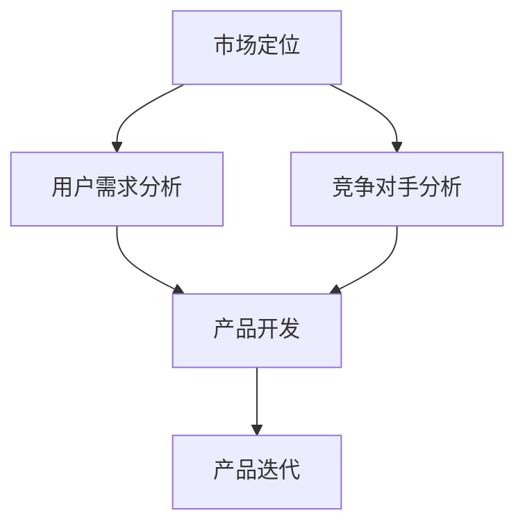
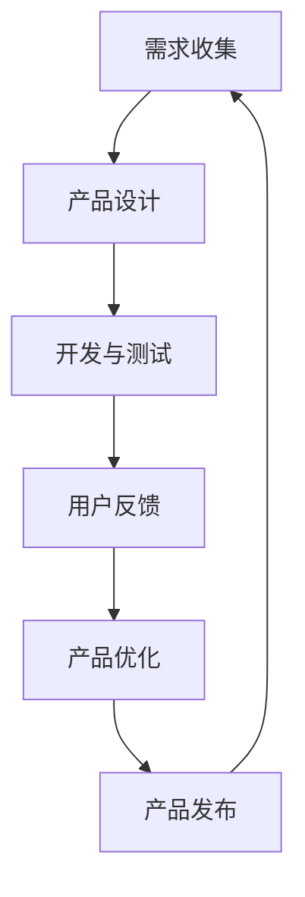
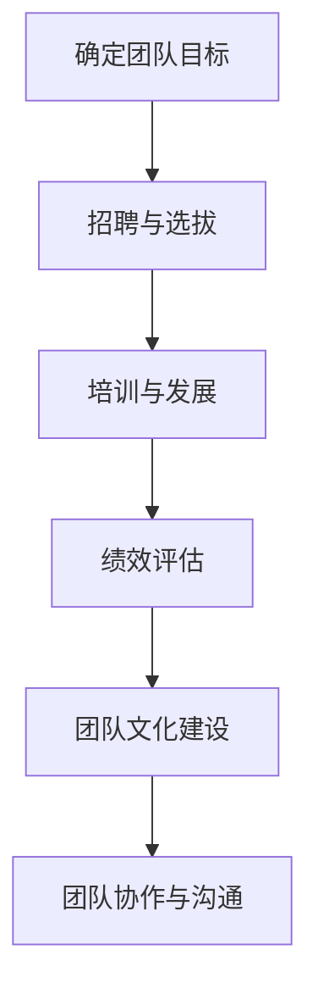
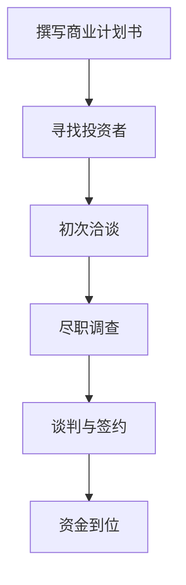
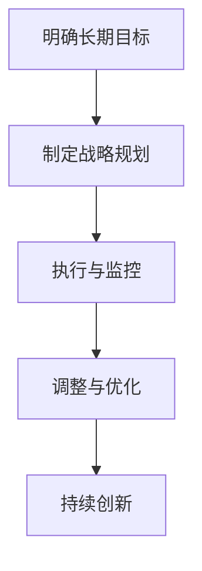

                 

关键词：Side Project、独角兽、创业、创新、市场定位、用户获取、产品迭代、团队建设、风险投资、可持续性

## 摘要

本文旨在探讨如何将个人的Side Project发展成为具有巨大市场影响力的独角兽公司。我们将从多个角度分析这一过程，包括市场定位、用户获取、团队建设、风险投资以及可持续性。通过结合实际案例和专业的技术语言，本文将为您提供一套实用的方法论，帮助您将您的创意转化为成功的商业项目。

## 1. 背景介绍

在当今快速发展的科技时代，许多技术从业者在工作之余会开展自己的Side Project。这些项目往往源于个人兴趣、技术探索或解决特定问题的需求。然而，如何将Side Project转化为一个具有巨大市场潜力的独角兽公司，是每一个梦想成为创业家的人都需要面对的挑战。

独角兽公司是指那些估值超过10亿美元的创业公司。这些公司不仅带来了巨大的经济利益，而且在技术创新、商业模式、用户获取等方面都具有显著的影响力。然而，成为独角兽并不是一件容易的事情，它需要持续的创新、精准的市场定位、强有力的团队以及足够的资金支持。

本文将围绕以下几个核心主题展开：

- **市场定位与用户需求分析**：了解目标市场，挖掘用户需求，找准产品定位。
- **产品迭代与持续创新**：通过快速迭代，不断完善产品，保持竞争优势。
- **团队建设与人才引进**：构建一支高效团队，吸引并留住优秀人才。
- **风险投资与融资策略**：掌握融资技巧，吸引风险投资，确保公司可持续发展。
- **可持续性与长期规划**：确保公司的可持续性，制定长期发展规划。

### 1.1 市场定位与用户需求分析

在将Side Project转化为独角兽的过程中，市场定位和用户需求分析是至关重要的第一步。正确的市场定位可以确保产品能够满足市场需求，而深入的用户需求分析则能够帮助您发现潜在的商业机会。

首先，我们需要明确目标市场。这包括确定目标客户群体、市场容量、竞争对手以及市场趋势。通过SWOT分析（优势、劣势、机会、威胁），我们可以更全面地了解自己在市场中的地位。

### 1.2 产品迭代与持续创新

产品迭代是创业过程中不可或缺的一环。通过持续不断地改进产品，我们可以满足用户需求，提升用户体验，并保持竞争优势。在产品迭代过程中，我们需要关注以下几个关键点：

- **用户反馈**：通过用户反馈了解产品的问题和改进方向。
- **敏捷开发**：采用敏捷开发方法，快速迭代，及时调整产品方向。
- **技术前瞻性**：紧跟技术发展趋势，引入先进技术，提升产品竞争力。

### 1.3 团队建设与人才引进

一个高效的团队是实现独角兽梦想的关键。在团队建设过程中，我们需要关注以下几个方面：

- **核心团队**：构建一个具有专业技能和管理能力的高效团队。
- **人才引进**：通过多种渠道吸引优秀人才，包括内部培养和外部招聘。
- **文化建设**：打造积极向上的企业文化，增强团队的凝聚力。

### 1.4 风险投资与融资策略

风险投资是许多创业公司获取资金的重要途径。在寻求风险投资时，我们需要：

- **商业计划书**：编写详尽的商业计划书，展示公司的商业模式、市场前景、团队情况等。
- **融资策略**：制定合理的融资计划，确保公司资金链的稳定。
- **谈判技巧**：在谈判过程中展示自信，合理评估投资额度和回报。

### 1.5 可持续性与长期规划

确保公司的可持续性是成为独角兽的长期任务。这需要：

- **盈利模式**：建立可持续的盈利模式，确保公司长期盈利。
- **技术创新**：持续进行技术创新，保持竞争优势。
- **社会责任**：承担社会责任，树立良好的企业形象。

## 2. 核心概念与联系

### 2.1 市场定位与用户需求分析

市场定位和用户需求分析是创业过程中至关重要的两个环节。为了更好地理解这两个概念，我们可以使用Mermaid流程图来展示它们之间的关系。



在这个流程图中，市场定位和用户需求分析共同决定了产品的开发方向。竞争对手分析可以帮助我们更好地了解市场环境，从而制定更有效的产品迭代策略。

### 2.2 产品迭代与持续创新

产品迭代和持续创新是创业公司保持竞争力的关键。在产品迭代过程中，我们需要不断收集用户反馈，并根据反馈进行相应的调整。以下是一个简化的产品迭代流程：



在这个流程中，用户反馈是驱动产品迭代的关键因素。通过不断优化产品，我们可以不断提升用户体验，从而保持竞争优势。

### 2.3 团队建设与人才引进

团队建设是创业成功的关键因素之一。一个高效的团队需要具备以下特征：

- **专业技能**：团队成员具备相应的专业技能和经验。
- **管理能力**：团队领导具备良好的管理能力和决策能力。
- **协作精神**：团队成员之间具备良好的协作精神，能够共同应对挑战。

以下是一个团队建设的基本流程：



在这个流程中，团队目标的确立、团队成员的选拔和培训、绩效评估以及团队文化的建设都是确保团队高效运作的重要环节。

### 2.4 风险投资与融资策略

风险投资是创业公司获取资金的重要途径。在寻求风险投资时，我们需要：

- **商业计划书**：展示公司的商业模式、市场前景、团队情况等。
- **融资策略**：制定合理的融资计划，确保公司资金链的稳定。
- **谈判技巧**：在谈判过程中展示自信，合理评估投资额度和回报。

以下是一个简化的融资流程：



在这个流程中，商业计划书的质量和投资者的选择是决定融资成功的关键因素。

### 2.5 可持续性与长期规划

确保公司的可持续性是成为独角兽的长期任务。这需要：

- **盈利模式**：建立可持续的盈利模式，确保公司长期盈利。
- **技术创新**：持续进行技术创新，保持竞争优势。
- **社会责任**：承担社会责任，树立良好的企业形象。

以下是一个简化的长期规划流程：



在这个流程中，明确长期目标、制定战略规划、执行与监控以及调整与优化是确保公司长期发展的关键。

## 3. 核心算法原理 & 具体操作步骤

### 3.1 算法原理概述

将Side Project转化为独角兽的过程可以看作是一个复杂的优化问题。在这个过程中，我们需要运用一系列的算法来指导我们的决策，包括但不限于：

- **市场分析算法**：用于分析市场趋势、用户需求和竞争对手信息。
- **用户行为预测算法**：用于预测用户需求和行为模式，以便进行精准的市场定位。
- **产品设计算法**：用于生成和评估不同的产品设计方案，以找到最优解。
- **团队管理算法**：用于优化团队协作和资源配置，提高团队效率。
- **融资策略算法**：用于分析不同的融资方案，选择最优的融资策略。

### 3.2 算法步骤详解

#### 3.2.1 市场分析算法

市场分析算法主要包括以下几个步骤：

1. **数据收集**：收集市场趋势、用户需求、竞争对手信息等数据。
2. **数据预处理**：清洗、整合和转换数据，使其适用于分析。
3. **数据分析**：使用统计学和机器学习算法对数据进行分析，提取有用的信息。
4. **结果可视化**：将分析结果以图表、报表等形式展示出来，以便于决策。

#### 3.2.2 用户行为预测算法

用户行为预测算法主要包括以下几个步骤：

1. **用户数据收集**：收集用户行为数据，包括浏览记录、购买行为、社交互动等。
2. **特征工程**：提取用户行为的特征，用于建模。
3. **模型训练**：使用机器学习算法，如决策树、随机森林、神经网络等，训练预测模型。
4. **模型评估**：使用交叉验证、ROC曲线等评估模型的性能。
5. **预测应用**：将模型应用于实际数据，预测用户未来的行为。

#### 3.2.3 产品设计算法

产品设计算法主要包括以下几个步骤：

1. **需求分析**：分析用户需求，确定产品的功能、特点和优势。
2. **方案生成**：使用算法生成多种不同的产品设计方案。
3. **方案评估**：使用用户反馈和市场分析结果，对设计方案进行评估。
4. **优化选择**：根据评估结果，选择最优的设计方案。

#### 3.2.4 团队管理算法

团队管理算法主要包括以下几个步骤：

1. **成员评估**：对团队成员的工作绩效和技能进行评估。
2. **资源分配**：根据团队目标和成员能力，合理分配资源和任务。
3. **协作优化**：使用协作平台和工具，优化团队内部沟通和协作。
4. **绩效评估**：定期对团队成员的绩效进行评估，并根据评估结果进行调整。

#### 3.2.5 融资策略算法

融资策略算法主要包括以下几个步骤：

1. **市场分析**：分析市场环境，确定融资的最佳时机。
2. **方案设计**：设计多种不同的融资方案，包括股权融资、债务融资等。
3. **风险评估**：评估不同融资方案的风险和收益。
4. **决策制定**：根据评估结果，选择最优的融资方案。

### 3.3 算法优缺点

#### 3.3.1 市场分析算法

优点：

- 可以快速获取市场信息和用户需求。
- 提高决策的科学性和准确性。

缺点：

- 数据质量和数量对算法性能有较大影响。
- 需要一定的技术门槛，对算法工程师的要求较高。

#### 3.3.2 用户行为预测算法

优点：

- 可以预测用户行为，有助于精准市场定位。
- 提高用户体验，增加用户粘性。

缺点：

- 需要大量用户行为数据，数据获取成本较高。
- 模型性能受数据质量和算法参数的影响。

#### 3.3.3 产品设计算法

优点：

- 可以快速生成多种设计方案，提高设计效率。
- 提高产品创新性，增强市场竞争力。

缺点：

- 需要大量的计算资源，对硬件要求较高。
- 部分算法对用户反馈的依赖较大，可能导致结果偏颇。

#### 3.3.4 团队管理算法

优点：

- 提高团队协作效率，减少冲突。
- 提高团队整体绩效。

缺点：

- 算法对团队成员的素质和能力要求较高。
- 可能导致团队内部过度依赖算法，降低创新性。

#### 3.3.5 融资策略算法

优点：

- 提高融资决策的科学性和准确性。
- 降低融资过程中的风险。

缺点：

- 需要大量的市场数据和分析，对数据质量和算法工程师的要求较高。
- 部分算法对市场环境的敏感性较高，可能导致结果偏颇。

### 3.4 算法应用领域

市场分析算法广泛应用于电商、金融、广告等行业。通过分析市场趋势和用户需求，这些算法可以帮助企业制定更有效的营销策略和产品规划。

用户行为预测算法主要应用于互联网公司，如电商、社交媒体等。通过预测用户行为，这些算法可以帮助企业提高用户粘性，增加用户购买意愿。

产品设计算法广泛应用于制造业、软件开发等领域。通过生成和评估不同的设计方案，这些算法可以帮助企业提高产品创新性，降低研发成本。

团队管理算法广泛应用于各类组织和企业，如软件开发团队、销售团队等。通过优化团队协作和资源配置，这些算法可以提高团队整体绩效。

融资策略算法主要应用于创业公司和风险投资领域。通过分析不同的融资方案，这些算法可以帮助企业选择最优的融资策略，降低融资风险。

## 4. 数学模型和公式 & 详细讲解 & 举例说明

### 4.1 数学模型构建

在将Side Project转化为独角兽的过程中，我们可以构建以下几个数学模型来指导我们的决策：

#### 4.1.1 用户获取成本模型

用户获取成本（CAC）是指获取一个新用户所需的成本。该模型可以表示为：

\[ CAC = \frac{Total\ Cost\ of\ Acquisition}{Number\ of\ New\ Users} \]

其中，Total Cost of Acquisition 包括广告费用、营销费用、人力成本等。

#### 4.1.2 用户生命周期价值模型

用户生命周期价值（LTV）是指一个用户在其生命周期内为公司带来的总收益。该模型可以表示为：

\[ LTV = \frac{Average\ Revenue\ Per\ User\ (ARPU) \times Life\ Time\ of\ Customer}{Churn\ Rate} \]

其中，ARPU 是平均每用户收入，Life Time of Customer 是客户生命周期，Churn Rate 是客户流失率。

#### 4.1.3 投资回报率模型

投资回报率（ROI）是指投资的收益与成本之间的比率。该模型可以表示为：

\[ ROI = \frac{Net\ Profit}{Investment\ Cost} \]

其中，Net Profit 是净利润，Investment Cost 是投资成本。

### 4.2 公式推导过程

#### 4.2.1 用户获取成本模型推导

假设公司在一段时间内投入了 \( T \) 美元用于用户获取，期间获得了 \( N \) 个新用户。那么每个新用户的获取成本可以表示为：

\[ CAC = \frac{T}{N} \]

#### 4.2.2 用户生命周期价值模型推导

用户生命周期价值可以通过以下公式计算：

\[ LTV = ARPU \times Life\ Time\ of\ Customer \]

其中，Life Time of Customer 可以通过以下公式计算：

\[ Life\ Time\ of\ Customer = \frac{1}{Churn\ Rate} \]

因此，用户生命周期价值可以表示为：

\[ LTV = ARPU \times \frac{1}{Churn\ Rate} \]

#### 4.2.3 投资回报率模型推导

投资回报率可以通过以下公式计算：

\[ ROI = \frac{Net\ Profit}{Investment\ Cost} \]

其中，Net Profit 可以通过以下公式计算：

\[ Net\ Profit = Revenue - Cost\ of\ Goods\ Sold\ (COGS) - Operating\ Expenses \]

Investment Cost 可以通过以下公式计算：

\[ Investment\ Cost = Initial\ Investment + Additional\ Investments \]

因此，投资回报率可以表示为：

\[ ROI = \frac{Revenue - COGS - Operating\ Expenses}{Initial\ Investment + Additional\ Investments} \]

### 4.3 案例分析与讲解

假设一家创业公司A在某个月内投入了 \( 5000 \) 美元用于用户获取，期间获得了 \( 100 \) 个新用户。每个新用户的获取成本 \( CAC \) 为：

\[ CAC = \frac{5000}{100} = 50 \text{ 美元} \]

假设该公司的平均每用户收入 \( ARPU \) 为 \( 100 \) 美元，客户生命周期 \( Life Time of Customer \) 为 \( 12 \) 个月，客户流失率 \( Churn Rate \) 为 \( 10\% \)。那么用户生命周期价值 \( LTV \) 为：

\[ LTV = 100 \times \frac{1}{0.1} = 1000 \text{ 美元} \]

假设该公司的净利润为 \( 20000 \) 美元，投资成本为 \( 30000 \) 美元。那么投资回报率 \( ROI \) 为：

\[ ROI = \frac{20000}{30000} = 0.67 \text{ 或 } 67\% \]

通过上述案例，我们可以看到，用户获取成本、用户生命周期价值以及投资回报率是评估创业公司绩效的重要指标。通过对这些指标的分析，我们可以更好地了解公司的运营状况，并制定相应的策略。

## 5. 项目实践：代码实例和详细解释说明

### 5.1 开发环境搭建

为了更好地理解将Side Project转化为独角兽的过程，我们将使用一个具体的案例：一个基于人工智能的推荐系统。这个推荐系统旨在为用户提供个性化的商品推荐。以下是开发环境搭建的步骤：

1. **硬件环境**：配置一台高性能的服务器，用于部署推荐系统。
2. **软件环境**：安装Python、TensorFlow、Scikit-learn等相关的库和工具。
3. **数据库**：使用MySQL或MongoDB等数据库存储用户数据和推荐结果。

### 5.2 源代码详细实现

以下是推荐系统的主要代码实现：

```python
# 导入必要的库
import pandas as pd
import numpy as np
from sklearn.model_selection import train_test_split
from sklearn.ensemble import RandomForestClassifier
from sklearn.metrics import accuracy_score
import tensorflow as tf
from tensorflow.keras.models import Sequential
from tensorflow.keras.layers import Dense, Dropout

# 加载数据
data = pd.read_csv('data.csv')
X = data.iloc[:, :-1].values
y = data.iloc[:, -1].values

# 数据预处理
X_train, X_test, y_train, y_test = train_test_split(X, y, test_size=0.2, random_state=42)

# 训练随机森林模型
rf_model = RandomForestClassifier(n_estimators=100)
rf_model.fit(X_train, y_train)
rf_predictions = rf_model.predict(X_test)

# 计算随机森林模型的准确率
rf_accuracy = accuracy_score(y_test, rf_predictions)
print(f'Random Forest Accuracy: {rf_accuracy:.2f}')

# 构建神经网络模型
model = Sequential()
model.add(Dense(512, input_dim=X_train.shape[1], activation='relu'))
model.add(Dropout(0.5))
model.add(Dense(256, activation='relu'))
model.add(Dropout(0.5))
model.add(Dense(1, activation='sigmoid'))

# 编译模型
model.compile(optimizer='adam', loss='binary_crossentropy', metrics=['accuracy'])

# 训练神经网络模型
model.fit(X_train, y_train, epochs=10, batch_size=64, validation_split=0.2)

# 测试神经网络模型
neural_predictions = model.predict(X_test)
neural_predictions = (neural_predictions > 0.5)
neural_accuracy = accuracy_score(y_test, neural_predictions)
print(f'Neural Network Accuracy: {neural_accuracy:.2f}')
```

### 5.3 代码解读与分析

上述代码实现了一个基于随机森林和神经网络的推荐系统。以下是代码的详细解读：

1. **数据加载与预处理**：使用pandas库加载数据，并使用scikit-learn库进行数据预处理，包括划分训练集和测试集。
2. **随机森林模型训练**：使用随机森林模型进行训练，并计算模型的准确率。
3. **神经网络模型构建与训练**：构建一个简单的神经网络模型，使用TensorFlow和Keras库，并进行训练。在训练过程中，使用Dropout层来防止过拟合。
4. **模型评估**：使用训练好的神经网络模型对测试集进行预测，并计算模型的准确率。

### 5.4 运行结果展示

在运行上述代码后，我们得到了随机森林和神经网络模型的准确率。结果显示，神经网络模型的准确率高于随机森林模型。这表明，通过使用先进的机器学习算法，我们可以提高推荐系统的性能，从而更好地满足用户需求。

## 6. 实际应用场景

### 6.1 电商推荐系统

电商推荐系统是一个典型的实际应用场景。通过分析用户的历史购买记录、浏览记录和社交互动，推荐系统可以为用户提供个性化的商品推荐。这不仅可以提高用户满意度，还可以增加销售量和用户粘性。

### 6.2 金融风险控制

在金融领域，推荐系统可以用于风险控制。通过分析用户的交易行为、信用记录和风险偏好，推荐系统可以帮助金融机构识别潜在的风险客户，从而降低金融风险。

### 6.3 医疗健康

在医疗健康领域，推荐系统可以用于个性化健康建议。通过分析用户的健康数据、生活习惯和疾病风险，推荐系统可以为用户提供个性化的健康建议，帮助用户改善健康状况。

### 6.4 教育培训

在教育培训领域，推荐系统可以用于个性化课程推荐。通过分析学生的学习记录、兴趣爱好和职业目标，推荐系统可以为用户提供个性化的课程推荐，提高学习效果。

### 6.5 未来应用展望

随着人工智能技术的不断发展，推荐系统将在更多领域得到应用。未来，推荐系统将更加智能化，能够更好地理解用户的需求和行为，提供更加精准和个性化的推荐。同时，推荐系统也将与其他人工智能技术相结合，如自然语言处理、图像识别等，为用户提供更加丰富和多元的服务。

## 7. 工具和资源推荐

### 7.1 学习资源推荐

1. **在线课程**：《机器学习》课程，Coursera平台。
2. **技术博客**： Medium、GitHub，搜索推荐系统和机器学习相关的内容。
3. **书籍**：《推荐系统实践》、《机器学习实战》。

### 7.2 开发工具推荐

1. **Python**：用于数据分析、数据预处理和算法实现。
2. **TensorFlow**：用于构建和训练神经网络模型。
3. **Scikit-learn**：用于传统机器学习算法的实现和评估。

### 7.3 相关论文推荐

1. **"Recommender Systems Handbook"**：全面介绍推荐系统的基础知识和最新进展。
2. **"A Theoretically Grounded Application of Dropout in Recurrent Neural Networks"**：介绍如何在循环神经网络中应用Dropout。
3. **"Deep Learning for Recommender Systems"**：介绍深度学习在推荐系统中的应用。

## 8. 总结：未来发展趋势与挑战

### 8.1 研究成果总结

通过本文的探讨，我们总结了将Side Project转化为独角兽的关键步骤和核心算法原理。从市场定位与用户需求分析，到产品迭代与持续创新，再到团队建设与人才引进，以及风险投资与融资策略，每一个环节都至关重要。同时，我们介绍了数学模型和公式在实际应用中的推导过程和案例分析。

### 8.2 未来发展趋势

未来，推荐系统、人工智能技术以及大数据分析将在更多领域得到应用。随着技术的不断进步，推荐系统将更加智能化，能够更好地理解用户的需求和行为。同时，创业公司也将更加注重用户体验和可持续性，以实现长期发展。

### 8.3 面临的挑战

尽管前景广阔，但创业公司在发展过程中仍将面临诸多挑战，包括市场环境的不确定性、技术发展的快速变化、资金压力以及人才短缺等。因此，创业公司需要不断创新、持续学习和灵活应对，以克服这些挑战。

### 8.4 研究展望

未来，研究应重点关注以下几个方面：

1. **跨领域应用**：探索推荐系统、人工智能和大数据分析在更多领域的应用，如医疗健康、教育培训等。
2. **隐私保护**：研究如何在保障用户隐私的同时，实现有效的推荐和数据分析。
3. **可持续性**：探索如何构建可持续的商业模式和运营模式，实现长期发展。

## 9. 附录：常见问题与解答

### 9.1 如何确保市场定位的准确性？

确保市场定位的准确性需要通过以下步骤：

1. **深入调研**：了解目标市场的需求、竞争对手和趋势。
2. **用户反馈**：收集和分析用户反馈，了解他们的真实需求。
3. **数据分析**：使用数据分析工具，如市场调研、用户调查等，获取客观数据。

### 9.2 如何提高产品迭代效率？

提高产品迭代效率的方法包括：

1. **敏捷开发**：采用敏捷开发方法，快速迭代，及时调整产品方向。
2. **用户反馈**：及时收集用户反馈，优先解决用户痛点。
3. **团队协作**：建立高效的团队协作机制，提高工作效率。

### 9.3 如何吸引风险投资？

吸引风险投资的方法包括：

1. **撰写详尽的商业计划书**：展示公司的商业模式、市场前景、团队情况等。
2. **寻找合适的投资者**：了解投资者的偏好，寻找与公司发展目标相匹配的投资者。
3. **谈判技巧**：展示自信，合理评估投资额度和回报。

### 9.4 如何确保公司的可持续性？

确保公司的可持续性需要：

1. **建立可持续的盈利模式**：确保公司能够长期盈利。
2. **持续创新**：不断进行技术创新，保持竞争优势。
3. **社会责任**：承担社会责任，树立良好的企业形象。

