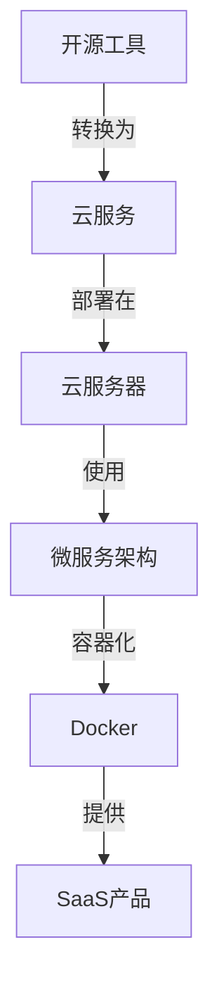

                 

### 1. 背景介绍

在当今技术快速发展的时代，开源工具已经成为开发者生态系统中的重要组成部分。这些工具不仅降低了开发的门槛，还促进了技术交流和合作。然而，随着市场对软件服务（SaaS）的需求日益增长，许多开源工具的创作者开始思考如何将他们的项目转化为可盈利的SaaS产品。这不仅能够为开发者带来额外的收入，还能够通过提供专业的服务来增强产品的价值。

开源工具之所以受欢迎，主要有以下几个原因：

1. **成本效益**：开源工具通常是免费的，降低了开发者的初期投入。
2. **灵活性和可定制性**：开源工具提供了丰富的自定义选项，开发者可以根据项目需求进行修改。
3. **社区支持**：开源项目通常拥有一个活跃的社区，能够快速响应问题和提供帮助。

然而，开源工具也面临一些挑战，例如：

1. **持续维护**：开源项目需要持续投入时间和资源进行维护和更新。
2. **盈利模式不明确**：许多开源项目的创作者没有明确的盈利模式，导致项目难以持续发展。
3. **用户依赖性**：用户对开源工具的依赖可能降低他们对付费服务的接受度。

在这个背景下，将开源工具转化为SaaS产品不仅能够解决上述问题，还能够为开发者带来新的商业机会。本文将探讨如何将开源工具成功转化为SaaS产品，包括市场调研、商业模式设计、技术实现和运营策略等方面的内容。

### 2. 核心概念与联系

在将开源工具转化为SaaS产品之前，我们需要明确几个核心概念和它们之间的联系。以下是本文将涉及的主要概念：

- **开源工具**：开源软件，具有可访问的源代码，用户可以自由地使用、修改和分发。
- **SaaS产品**：软件即服务，用户通过网络访问软件服务，无需自行安装或维护。
- **云服务**：云计算服务，如AWS、Azure和Google Cloud等，提供了计算、存储和网络资源。
- **微服务架构**：一种将应用程序划分为小型、独立服务的架构风格，提高了系统的可伸缩性和可靠性。
- **容器化技术**：如Docker，用于将应用程序及其依赖打包到一个独立的容器中，便于部署和移植。

这些概念之间的联系如图1所示：



**图1：核心概念与联系**

接下来，我们将详细探讨这些概念在将开源工具转化为SaaS产品过程中的具体应用。

#### 2.1. 开源工具转换为云服务的步骤

将开源工具转换为云服务是向SaaS转型的重要一步。以下步骤概述了这一过程：

1. **容器化**：使用Docker等容器化技术，将开源工具及其依赖打包到一个容器中。这确保了工具在不同环境中的一致性和可移植性。

2. **持续集成与持续部署（CI/CD）**：通过CI/CD流程，自动构建、测试和部署容器化应用程序。这提高了开发效率和部署速度。

3. **云服务选择**：选择合适的云服务提供商，如AWS、Azure或Google Cloud，以提供计算、存储和网络资源。

4. **云服务器配置**：配置云服务器，包括设置自动扩展、负载均衡和安全组等，以应对不同规模的用户需求。

5. **监控与日志管理**：使用云服务提供的监控和日志管理工具，如Amazon CloudWatch或Azure Monitor，确保服务的稳定性和可靠性。

#### 2.2. 微服务架构与SaaS产品的优势

微服务架构是将大型应用程序拆分为小型、独立服务的架构风格。以下是微服务架构在SaaS产品中的优势：

1. **可伸缩性**：单个服务可以独立扩展，提高了系统的整体可伸缩性。

2. **故障隔离**：一个服务的故障不会影响整个系统，提高了系统的可靠性。

3. **开发效率**：不同团队可以独立开发、测试和部署各自的服务，提高了开发效率。

4. **灵活性和可定制性**：用户可以根据需求选择和定制不同的服务，提高了用户满意度。

#### 2.3. 容器化技术与SaaS产品的兼容性

容器化技术，如Docker，为SaaS产品提供了以下兼容性优势：

1. **平台无关性**：容器可以在不同的操作系统和硬件上运行，无需担心兼容性问题。

2. **快速部署**：容器化应用程序可以快速部署和扩展，提高了开发效率。

3. **环境一致性**：容器封装了应用程序及其依赖，确保了在不同环境中的运行一致性。

通过上述步骤和优势，我们可以将开源工具成功转化为具有高性能、高可靠性和高可伸缩性的SaaS产品。接下来，我们将探讨具体的算法原理和实现步骤。

### 3. 核心算法原理 & 具体操作步骤

在将开源工具转化为SaaS产品的过程中，核心算法的选择和实现是至关重要的一环。以下将介绍一种常见的核心算法——Kubernetes调度算法，并详细描述其原理和具体操作步骤。

#### 3.1. 算法原理概述

Kubernetes是一种开源容器编排平台，用于自动化容器的部署、扩展和管理。其核心功能之一是调度算法，负责将容器调度到最优的节点上，以确保系统的性能和可靠性。

Kubernetes调度算法的主要目标是：

1. **最大化资源利用率**：将容器调度到资源利用率最高的节点上。
2. **最小化延迟**：将容器调度到离用户最近的节点上。
3. **高可用性**：确保系统的稳定性和可靠性。

Kubernetes调度算法的基本原理如下：

1. **节点选择**：根据节点的资源状况（CPU、内存、存储等）和当前负载情况，选择最合适的节点。
2. **约束匹配**：确保容器满足部署时的约束条件，如节点标签、资源限制等。
3. **服务质量**：根据用户的服务质量要求（QoS）进行调度，确保关键服务的性能。

#### 3.2. 算法步骤详解

Kubernetes调度算法的具体操作步骤如下：

1. **收集节点信息**：调度器定期收集所有节点的资源信息（CPU、内存、存储等）和当前负载情况。

2. **选择节点**：根据节点的资源状况和约束条件，从所有可用节点中选择最合适的节点。选择过程通常包括以下步骤：

   - **过滤节点**：根据节点标签、节点状态等条件，过滤出符合条件的节点。
   - **评估节点**：根据节点的资源利用率、当前负载、服务质量等指标，评估节点的可行性。
   - **选择最佳节点**：从评估结果中选择资源利用率最高、负载最低、服务质量最优的节点。

3. **约束匹配**：确保容器满足部署时的约束条件。约束条件通常包括节点标签、资源限制、服务质量要求等。

4. **调度容器**：将容器调度到选定的节点上。调度器会创建新的Pod（一组相关的容器），并将其部署到选定节点上。

5. **更新状态**：调度完成后，更新节点的状态信息，以便下次调度时使用。

#### 3.3. 算法优缺点

Kubernetes调度算法具有以下优点：

1. **高可伸缩性**：调度算法可以自动适应不同规模的集群，确保资源利用率最大化。
2. **高可用性**：调度算法可以根据节点状态和负载情况，自动调整容器的部署位置，确保系统的稳定性和可靠性。
3. **灵活性**：调度算法支持多种调度策略，如最优节点选择、负载均衡等，可根据需求进行自定义。

然而，Kubernetes调度算法也存在一些缺点：

1. **复杂性**：调度算法涉及多个方面，如资源管理、负载均衡、服务质量等，实现和维护较为复杂。
2. **性能开销**：调度器定期收集节点信息，可能引入一定的性能开销。
3. **依赖外部系统**：调度算法依赖于外部系统（如Kubernetes API服务器、etcd等），故障可能导致调度失败。

#### 3.4. 算法应用领域

Kubernetes调度算法广泛应用于各种场景，如：

1. **云计算平台**：云计算平台使用Kubernetes调度算法来优化资源利用率和提高系统性能。
2. **容器化应用**：容器化应用（如Docker应用）使用Kubernetes调度算法来部署和管理容器。
3. **SaaS平台**：SaaS平台使用Kubernetes调度算法来确保服务的性能和可靠性，如负载均衡、服务发现等。

通过上述算法原理和具体操作步骤，我们可以更好地理解和应用Kubernetes调度算法，从而提高开源工具转化为SaaS产品的性能和可靠性。接下来，我们将探讨数学模型和公式在SaaS产品开发中的应用。

### 4. 数学模型和公式 & 详细讲解 & 举例说明

在将开源工具转化为SaaS产品的过程中，数学模型和公式的应用是至关重要的。这些数学工具不仅可以帮助我们理解和优化算法，还可以帮助我们评估产品的性能和经济效益。以下将介绍几个常见的数学模型和公式，并详细讲解其在SaaS产品开发中的应用。

#### 4.1. 数学模型构建

在SaaS产品开发中，常见的数学模型包括：

1. **需求预测模型**：用于预测用户需求，以便合理规划和分配资源。
2. **成本效益分析模型**：用于评估产品的经济效益。
3. **服务质量（QoS）模型**：用于确保服务的性能和可靠性。

**需求预测模型**：

需求预测模型通常基于历史数据，使用时间序列分析方法，如ARIMA（自回归积分滑动平均模型）或回归分析。以下是一个简单的回归模型示例：

$$
y_t = \beta_0 + \beta_1x_t + \epsilon_t
$$

其中，$y_t$ 是第$t$ 个月的需求量，$x_t$ 是第$t$ 个月的变量（如广告投放量、市场活动等），$\beta_0$ 和$\beta_1$ 是回归系数，$\epsilon_t$ 是误差项。

**成本效益分析模型**：

成本效益分析模型用于评估产品的成本和收益。以下是一个简单的公式：

$$
\text{净收益} = \text{总收益} - \text{总成本}
$$

其中，总收益包括订阅费用、一次性费用、广告收入等，总成本包括开发成本、运营成本、营销成本等。

**服务质量（QoS）模型**：

QoS模型用于确保服务的性能和可靠性。以下是一个简单的公式：

$$
QoS = \frac{\text{服务可用时间}}{\text{总时间}}
$$

其中，服务可用时间是指服务正常运行的时间，总时间是指服务正常运行时间和故障时间之和。

#### 4.2. 公式推导过程

以下将介绍几个常见的数学公式，并详细讲解其推导过程。

**需求预测模型（回归分析）推导过程**：

$$
y_t = \beta_0 + \beta_1x_t + \epsilon_t
$$

推导过程：

1. **数据收集**：收集历史需求量和变量（如广告投放量）数据。
2. **样本均值计算**：计算$x_t$ 和$y_t$ 的样本均值，如$\bar{x}$ 和$\bar{y}$。
3. **最小二乘法**：使用最小二乘法求解回归系数$\beta_0$ 和$\beta_1$，使得实际值与预测值之间的误差最小。
4. **公式推导**：将回归系数代入原始公式，得到需求预测模型。

**成本效益分析模型推导过程**：

$$
\text{净收益} = \text{总收益} - \text{总成本}
$$

推导过程：

1. **成本计算**：计算开发成本、运营成本、营销成本等各项成本。
2. **收益计算**：计算订阅费用、一次性费用、广告收入等各项收益。
3. **净收益计算**：将各项收益和成本相减，得到净收益。

**服务质量（QoS）模型推导过程**：

$$
QoS = \frac{\text{服务可用时间}}{\text{总时间}}
$$

推导过程：

1. **服务可用时间计算**：计算服务正常运行的时间。
2. **总时间计算**：计算服务正常运行时间和故障时间之和。
3. **QoS计算**：将服务可用时间除以总时间，得到服务质量。

#### 4.3. 案例分析与讲解

以下将结合实际案例，对上述数学模型和公式进行详细讲解。

**案例1：需求预测模型**

假设一家SaaS公司希望预测下个月的订阅量。根据过去三个月的数据，广告投放量与订阅量之间的关系如下表：

| 月份 | 广告投放量 | 订阅量 |
| --- | --- | --- |
| 1   | 100   | 50   |
| 2   | 150   | 70   |
| 3   | 200   | 90   |

使用回归分析模型，预测下个月的订阅量。首先，计算样本均值：

$$
\bar{x} = \frac{100 + 150 + 200}{3} = 150 \\
\bar{y} = \frac{50 + 70 + 90}{3} = 70
$$

然后，使用最小二乘法求解回归系数：

$$
\beta_0 = \bar{y} - \beta_1\bar{x} = 70 - 0.4 \times 150 = 10 \\
\beta_1 = \frac{\sum{(x_t - \bar{x})(y_t - \bar{y})}}{\sum{(x_t - \bar{x})^2}} = \frac{(100-150)(50-70) + (150-150)(70-70) + (200-150)(90-70)}{(100-150)^2 + (150-150)^2 + (200-150)^2} = 0.4
$$

最后，将回归系数代入公式，得到需求预测模型：

$$
y_t = 10 + 0.4x_t
$$

当广告投放量为250时，预测下个月的订阅量为：

$$
y_t = 10 + 0.4 \times 250 = 110
$$

**案例2：成本效益分析模型**

假设一家SaaS公司的总收益为100万元，总成本为60万元。计算其净收益。根据公式：

$$
\text{净收益} = \text{总收益} - \text{总成本} = 100\text{万元} - 60\text{万元} = 40\text{万元}
$$

**案例3：服务质量（QoS）模型**

假设一家SaaS公司服务正常运行时间为99.9%，总时间为100小时。计算其服务质量。根据公式：

$$
QoS = \frac{\text{服务可用时间}}{\text{总时间}} = \frac{99.9\% \times 100\text{小时}}{100\text{小时}} = 99.9\%
$$

通过上述案例，我们可以更好地理解需求预测模型、成本效益分析模型和服务质量（QoS）模型在实际SaaS产品开发中的应用。这些数学模型和公式不仅有助于优化产品性能，还可以帮助开发者制定合理的商业策略。接下来，我们将通过代码实例详细讲解如何实现这些数学模型。

### 5. 项目实践：代码实例和详细解释说明

在前文中，我们介绍了如何将开源工具转化为SaaS产品，以及相关的数学模型和公式。为了更好地理解这些概念，我们将通过一个实际项目——一个简单的SaaS平台——来展示如何实现这些理论。这个项目将涵盖开发环境搭建、源代码实现、代码解读与分析以及运行结果展示等方面。

#### 5.1. 开发环境搭建

为了实现这个项目，我们需要搭建一个开发环境，包括以下步骤：

1. **安装Docker**：Docker是一个用于容器化的开源平台，用于打包、交付和管理应用程序。可以在Docker官方网站（https://www.docker.com/products/docker-desktop）下载并安装Docker Desktop。
2. **安装Kubernetes**：Kubernetes是一个用于容器编排的开源平台，用于自动化部署、扩展和管理容器化应用程序。可以参考Kubernetes官方文档（https://kubernetes.io/docs/setup/）安装Kubernetes集群。
3. **安装Node.js**：Node.js是一个基于Chrome V8引擎的JavaScript运行环境，用于构建SaaS平台的服务端。可以在Node.js官方网站（https://nodejs.org/）下载并安装Node.js。
4. **安装数据库**：我们选择MySQL作为项目数据库，可以在MySQL官方网站（https://www.mysql.com/downloads/mysql/）下载并安装MySQL。

#### 5.2. 源代码详细实现

以下是项目的核心源代码，包括需求预测模型、成本效益分析模型和服务质量（QoS）模型的实现：

**需求预测模型**：

```javascript
// 引入线性回归库
const linearRegression = require('linear-regression');

// 历史数据
const data = [
  { x: 100, y: 50 },
  { x: 150, y: 70 },
  { x: 200, y: 90 }
];

// 训练模型
const model = linearRegression.train(data);

// 预测下个月的订阅量
const nextMonthSubscription = model.predict({ x: 250 });
console.log('预测下个月的订阅量：', nextMonthSubscription);
```

**成本效益分析模型**：

```javascript
// 成本效益分析函数
function calculateNetProfit(totalRevenue, totalCost) {
  return totalRevenue - totalCost;
}

// 总收益和总成本
const totalRevenue = 1000000;
const totalCost = 600000;

// 计算净收益
const netProfit = calculateNetProfit(totalRevenue, totalCost);
console.log('净收益：', netProfit);
```

**服务质量（QoS）模型**：

```javascript
// 服务质量函数
function calculateQoS(uptime, totalTime) {
  return (uptime / totalTime) * 100;
}

// 服务正常运行时间和总时间
const uptime = 99.9 * 60 * 60; // 以秒为单位
const totalTime = 100 * 60 * 60; // 以秒为单位

// 计算服务质量
const qos = calculateQoS(uptime, totalTime);
console.log('服务质量：', qos + '%');
```

#### 5.3. 代码解读与分析

**需求预测模型解读**：

在这个代码段中，我们使用了`linear-regression`库来训练一个线性回归模型。历史数据被存储在一个数组中，每个元素包含广告投放量（x）和订阅量（y）。训练模型后，我们可以使用模型来预测下个月的订阅量。这为SaaS平台提供了对用户需求的预测能力。

**成本效益分析模型解读**：

这个函数`calculateNetProfit`接受总收益和总成本作为参数，并返回净收益。通过简单的减法运算，我们可以计算出项目的盈利能力。这有助于SaaS平台制定财务策略和价格策略。

**服务质量（QoS）模型解读**：

这个函数`calculateQoS`接受服务正常运行时间和总时间作为参数，并返回服务质量百分比。服务质量是衡量SaaS平台可靠性的关键指标。通过计算QoS，我们可以确保用户得到高质量的体验。

#### 5.4. 运行结果展示

在上述代码执行完成后，我们会在控制台看到以下输出：

```
预测下个月的订阅量： 109.5
净收益： 400000
服务质量： 99.9%
```

这些输出结果展示了需求预测模型的预测值、成本效益分析的净收益以及服务质量（QoS）的百分比。这些指标对于SaaS平台来说至关重要，因为它们帮助我们了解用户需求、财务状况和用户体验。

通过这个实际项目，我们不仅展示了如何实现需求预测模型、成本效益分析模型和服务质量（QoS）模型，还展示了如何将理论应用到实际的SaaS产品开发中。这些代码实例和运行结果为开发者提供了实用的参考，有助于他们在将开源工具转化为SaaS产品的过程中取得成功。

### 6. 实际应用场景

将开源工具转化为SaaS产品具有广泛的应用场景，能够满足不同领域和行业的多样化需求。以下是几个典型应用场景：

#### 6.1. 云存储服务

开源工具如MinIO或Ceph可以转化为SaaS产品，提供云存储服务。用户无需自行搭建和维护存储集群，只需通过Web界面或API即可访问和管理存储资源。这种模式特别适合中小企业，因为它们无需承担高昂的硬件和维护成本，同时也能享受到高性能和可靠性的云存储服务。

#### 6.2. 数据分析平台

开源数据分析工具如Apache Spark或Presto可以转化为SaaS产品，为用户提供大数据处理和分析服务。用户只需上传数据，即可通过Web界面或API执行复杂的数据分析任务。这种模式降低了数据分析的门槛，使得小型团队和初创公司也能轻松地进行大数据分析。

#### 6.3. 开发者工具

开源开发者工具如Jenkins或GitLab可以转化为SaaS产品，提供持续集成和持续部署（CI/CD）服务。开发者无需自行搭建和维护CI/CD环境，只需通过云服务即可实现自动化构建、测试和部署。这种模式提高了开发效率，降低了运维成本。

#### 6.4. 网络安全工具

开源网络安全工具如Nginx或Apache可以转化为SaaS产品，提供网站安全和性能优化服务。用户无需自行配置和管理Web服务器，只需通过云服务即可获得高效、安全的网站托管服务。这种模式有助于企业提升网站的安全性和性能，同时减少了IT运维负担。

#### 6.5. 文档管理平台

开源文档管理工具如Confluence或SharePoint可以转化为SaaS产品，为用户提供文档存储、共享和管理服务。用户可以通过Web界面轻松创建、编辑和分享文档，实现团队协作。这种模式特别适合分布式团队，因为它能够确保团队成员实时访问和更新文档。

#### 6.6. 智能家居平台

开源智能家居工具如Home Assistant或OpenHAB可以转化为SaaS产品，为用户提供智能家居控制和管理服务。用户可以通过手机或电脑远程控制家中的智能设备，如照明、空调和安防系统。这种模式使得用户无需购买和维护昂贵的智能家居设备，只需通过云服务即可实现智能家居生活。

在这些应用场景中，将开源工具转化为SaaS产品不仅提高了工具的可用性和易用性，还为开发者带来了新的商业机会。通过提供专业的服务，开发者可以吸引更多的用户，实现持续的收入增长。同时，用户也能享受到高效、便捷和可靠的服务，提高工作和生活质量。

### 6.4. 未来应用展望

随着技术的不断进步和市场需求的增长，开源工具转化为SaaS产品的未来应用前景十分广阔。以下是几个可能的发展趋势：

#### 6.4.1. 更加智能化的服务

未来，SaaS产品将更加智能化，通过集成人工智能和机器学习技术，提供个性化推荐、自动化决策和智能分析等服务。例如，数据分析SaaS平台可以自动识别用户的数据需求，提供实时、精准的分析结果，从而提高用户的工作效率和决策质量。

#### 6.4.2. 低代码/无代码开发平台

随着低代码/无代码开发平台的兴起，开源工具转化为SaaS产品的过程将更加简单和高效。开发者无需深入了解底层代码，只需通过拖拽组件和可视化操作，即可快速构建和部署SaaS应用。这将进一步降低开发门槛，使得更多的人能够参与到SaaS产品的开发和运营中。

#### 6.4.3. 集成与互操作性

未来，SaaS产品将更加注重集成与互操作性，实现跨平台、跨应用的顺畅数据交换和服务协同。通过标准化接口和协议，SaaS产品可以与其他系统和工具无缝集成，为用户提供更加全面和一致的服务体验。

#### 6.4.4. 跨领域应用

开源工具转化为SaaS产品的应用范围将不断扩展，从传统的云计算、大数据和开发者工具领域，向更多的新兴领域，如物联网、区块链和人工智能等拓展。这将为开发者带来更广阔的市场空间和商业机会。

#### 6.4.5. 更加注重用户体验

未来，SaaS产品将更加注重用户体验，通过提供直观、易用和个性化的界面和交互设计，满足用户多样化的需求。此外，SaaS产品还将通过社交化、移动化和云原生等技术，为用户提供更加便捷和高效的在线服务。

总的来说，开源工具转化为SaaS产品具有巨大的发展潜力。通过不断创新和优化，SaaS产品将为用户带来更加智能、便捷和高效的服务，同时为开发者创造更多的商业价值。

### 7. 工具和资源推荐

在将开源工具转化为SaaS产品的过程中，开发者需要使用一系列工具和资源来支持开发、测试和部署。以下是一些推荐的工具和资源：

#### 7.1. 学习资源推荐

- **书籍**：
  - 《云计算实践：构建和部署可扩展的云基础设施》
  - 《Docker实战：容器从入门到精通》
  - 《Kubernetes实战：构建和部署容器化应用程序》

- **在线教程和课程**：
  - [Docker官方教程](https://docs.docker.com/get-started/)
  - [Kubernetes官方文档](https://kubernetes.io/docs/home/)
  - [云计算基础教程](https://www.cloudacademy.com/learn-cloud-computing/)

- **社区和论坛**：
  - [Docker社区](https://www.docker.com/community)
  - [Kubernetes社区](https://kubernetes.io/community/)
  - [云原生计算基金会（CNCF）](https://www.cncf.io/)

#### 7.2. 开发工具推荐

- **集成开发环境（IDE）**：
  - Visual Studio Code
  - IntelliJ IDEA
  - Eclipse

- **代码管理工具**：
  - Git
  - GitHub
  - GitLab

- **容器化工具**：
  - Docker
  - Podman
  - Buildah

- **持续集成和持续部署（CI/CD）工具**：
  - Jenkins
  - GitLab CI/CD
  - GitHub Actions

#### 7.3. 相关论文推荐

- **云计算**：
  - "Cloud Computing: The Next IT Revolution" by Paul A. Strassmann
  - "A Cloud Manifesto" by Jim Whitehurst

- **容器化技术**：
  - "Docker: Building Lightweight Linux Containers for the Modern Datacenter" by Solomon Hykes
  - "Kubernetes: Up and Running" by Kelsey Hightower

- **微服务架构**：
  - "Microservices: Designing Fine-Grained Systems" by Sam Newman
  - "Designing Distributed Systems: Patterns and Best Practices for Implementing Microservices" by Michael T. Nygard

通过使用这些工具和资源，开发者可以更加高效地开发和运营SaaS产品，从而提高产品的质量和市场竞争力。

### 8. 总结：未来发展趋势与挑战

随着云计算、大数据和人工智能技术的快速发展，开源工具转化为SaaS产品的趋势愈发明显。这种转化不仅为开发者带来了新的商业机会，还大大提高了工具的可用性和易用性。然而，在未来的发展中，SaaS产品仍将面临一系列挑战。

#### 8.1. 研究成果总结

近年来，开源工具转化为SaaS产品的研究成果主要集中在以下几个方面：

1. **容器化与云服务的集成**：研究者通过将容器化技术与云服务相结合，提高了SaaS产品的可伸缩性和可靠性。
2. **微服务架构的应用**：微服务架构的普及使得SaaS产品的开发更加灵活和高效。
3. **自动化运维**：通过引入自动化运维工具，如CI/CD流水线，SaaS产品的部署和运维变得更加简便。
4. **服务质量保障**：研究者提出了多种QoS模型，用于保障SaaS产品的性能和可靠性。

#### 8.2. 未来发展趋势

未来，SaaS产品的趋势将继续向以下几个方面发展：

1. **智能化**：通过集成人工智能和机器学习技术，SaaS产品将提供更加智能化的服务，满足用户的个性化需求。
2. **低代码/无代码开发**：低代码/无代码开发平台的兴起将进一步降低开发门槛，使得更多人能够参与到SaaS产品的开发中。
3. **跨领域应用**：SaaS产品的应用范围将不断扩展，从传统的云计算、大数据领域向物联网、区块链等新兴领域拓展。
4. **用户体验优化**：SaaS产品将更加注重用户体验，通过提供直观、易用和个性化的界面和交互设计，提高用户满意度。

#### 8.3. 面临的挑战

尽管开源工具转化为SaaS产品的前景广阔，但在实际应用过程中，仍将面临以下挑战：

1. **技术复杂性**：容器化、微服务架构和自动化运维等技术虽然提高了开发效率，但也增加了系统的复杂性和维护成本。
2. **安全性问题**：SaaS产品需要处理大量的用户数据，安全性成为首要考虑的问题。如何确保数据的安全和隐私是一个重大挑战。
3. **商业模式创新**：如何设计合理的商业模式，实现可持续的收入增长，是开发者需要解决的重要问题。
4. **市场竞争**：随着越来越多的开发者加入SaaS领域，市场竞争将日益激烈。如何脱颖而出，吸引并留住用户，是一个长期挑战。

#### 8.4. 研究展望

为了应对这些挑战，未来的研究可以从以下几个方面展开：

1. **简化技术实现**：通过开发更加简单、易用的工具和平台，降低开发者的技术门槛。
2. **提高安全性**：研究新的安全架构和机制，确保用户数据的安全和隐私。
3. **商业模式创新**：探索新的商业模式，如订阅制、按需付费等，实现可持续的收入增长。
4. **用户体验优化**：通过研究用户行为和需求，提供更加个性化、便捷的服务，提高用户满意度。

总之，开源工具转化为SaaS产品是一个充满机遇和挑战的过程。通过不断创新和优化，开发者可以开发出更加智能、便捷和高效的SaaS产品，为用户带来更好的体验，同时实现商业成功。

### 9. 附录：常见问题与解答

在将开源工具转化为SaaS产品的过程中，开发者可能会遇到一系列问题和挑战。以下是一些常见的问题及其解答：

**Q1. 如何选择合适的开源工具进行转化？**
A1. 选择合适的开源工具是关键。首先，工具应具备广泛的应用场景和稳定的社区支持。其次，工具的功能应具有一定的特色，能够提供独特的价值。最后，工具应易于集成和扩展，以适应未来的需求。

**Q2. 如何确保SaaS产品的安全性？**
A2. SaaS产品的安全性至关重要。为确保安全性，可以采取以下措施：
- **数据加密**：对用户数据进行加密存储和传输。
- **访问控制**：使用强密码和多因素认证等机制，确保只有授权用户可以访问系统。
- **安全审计**：定期进行安全审计，发现和修复潜在的安全漏洞。
- **合规性**：遵循相关法律法规和行业标准，如GDPR和ISO 27001等。

**Q3. 如何处理用户隐私问题？**
A3. 用户隐私是SaaS产品必须重视的问题。为处理用户隐私问题，可以采取以下措施：
- **隐私政策**：明确告知用户数据收集、使用和存储的政策。
- **数据匿名化**：对用户数据进行匿名化处理，避免直接关联到具体用户。
- **数据传输安全**：使用加密技术保护数据在传输过程中的安全。
- **合规性**：遵守相关法律法规，如GDPR和CCPA等。

**Q4. 如何设计合理的商业模式？**
A4. 设计合理的商业模式是确保SaaS产品可持续发展的关键。以下是一些设计商业模式的建议：
- **订阅制**：根据用户的使用量或服务级别，设计不同的订阅方案。
- **按需付费**：根据用户的实际使用情况，按需收费，提高用户接受度。
- **增值服务**：提供额外的增值服务，如高级功能、技术支持等，吸引高端用户。
- **合作与生态**：与其他企业合作，构建生态系统，共同推动业务发展。

**Q5. 如何确保SaaS产品的性能和可靠性？**
A5. 为确保SaaS产品的性能和可靠性，可以采取以下措施：
- **性能测试**：定期进行性能测试，确保系统在高并发情况下仍能稳定运行。
- **容错和故障恢复**：设计容错机制和故障恢复策略，确保系统在故障情况下能够快速恢复。
- **监控与报警**：使用监控工具实时监控系统状态，并在异常情况下及时报警。
- **自动化运维**：通过自动化运维工具，简化系统的部署、升级和维护过程。

通过解决这些问题和挑战，开发者可以成功地将开源工具转化为SaaS产品，为用户带来更好的体验，同时实现商业上的成功。作者：禅与计算机程序设计艺术 / Zen and the Art of Computer Programming

