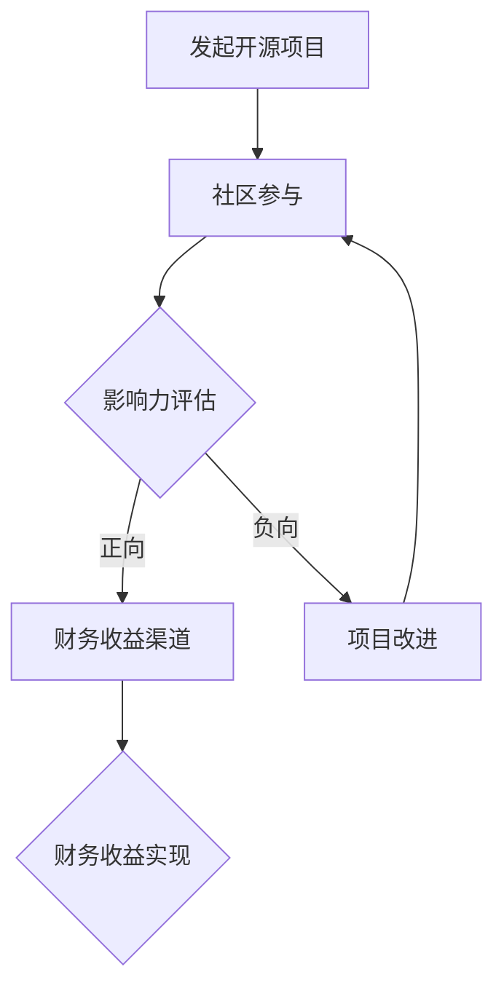

                 

## 1. 背景介绍

开源项目已经成为当今技术领域的一个重要组成部分。开发者们通过贡献代码、文档和资源，共同构建了一个庞大而丰富的技术生态系统。许多开发者投身于开源项目，不仅是为了追求技术的卓越，也是因为开源项目能够为他们带来职业发展的机会。随着越来越多的企业和组织认识到开源项目的重要性，如何将开源项目的影响力转化为财务收益，成为了一个备受关注的话题。

本文将探讨如何将开源项目影响力转化为财务收益的多种策略，帮助开发者们实现个人和项目的双重价值。本文将分为以下几个部分：

- 核心概念与联系
- 核心算法原理与具体操作步骤
- 数学模型和公式讲解
- 项目实践：代码实例和详细解释说明
- 实际应用场景
- 未来应用展望
- 工具和资源推荐
- 总结：未来发展趋势与挑战
- 附录：常见问题与解答

希望通过本文的阅读，开发者们能够更好地理解如何通过开源项目实现财务收益，并在实践中运用这些策略，提升项目的价值和影响力。

<|assistant|>## 2. 核心概念与联系

在探讨如何将开源项目影响力转化为财务收益之前，我们需要了解几个关键概念，这些概念是构建成功开源项目的基石。

### 开源项目

开源项目是指软件项目，其源代码可以被任何人自由查看、修改和分发。这种模式鼓励社区参与，促进了技术创新和协作。开源项目的核心特征包括：

- **开放性**：项目的源代码可以被任何人访问和审查。
- **协作性**：开发者可以共同合作，共同改进代码。
- **共享性**：任何人都可以使用、修改和分发项目代码。

### 社区参与

社区参与是指开发者、用户和其他利益相关者对项目的积极参与。这包括但不限于以下方面：

- **贡献代码**：开发者为项目添加新功能或修复bug。
- **文档贡献**：用户和开发者共同撰写文档，帮助新用户更好地理解和使用项目。
- **反馈**：用户通过反馈和建议，帮助项目改进。

### 影响力

影响力是指项目在社区和行业中的受欢迎程度和认可度。它可以通过以下几个方面衡量：

- **GitHub Star数**：项目在GitHub上的Star数可以反映其受欢迎程度。
- **用户参与度**：活跃的贡献者数量、bug报告和解决情况。
- **媒体报道**：项目在技术媒体和行业内的曝光度。

### 财务收益

财务收益是指通过开源项目获得的经济收益。这些收益可以来源于多种渠道，包括但不限于以下方面：

- **咨询服务**：为企业和用户提供专业的开源项目定制和优化服务。
- **赞助和捐赠**：企业和个人对项目的赞助和捐赠。
- **商业合作**：与企业和组织的合作，提供基于开源项目的商业解决方案。

### 开源项目与财务收益的关系

开源项目与财务收益之间的关系是双向的。开源项目可以为开发者提供职业发展的机会，同时也为企业提供了高质量、可信赖的技术解决方案。通过将开源项目的影响力转化为财务收益，开发者不仅可以实现个人价值的提升，还可以为项目的长期发展提供资金支持。

### Mermaid 流程图

以下是一个简单的Mermaid流程图，展示开源项目影响力转化为财务收益的基本流程：



在这个流程图中，开发者首先发起一个开源项目，并吸引社区参与。通过社区参与，项目的影响力得到评估，如果项目具有足够的影响力，开发者可以探索多种财务收益渠道，最终实现财务收益。如果影响力不足，开发者需要改进项目，重新吸引社区参与。

通过上述核心概念与联系的介绍，我们为后续内容的展开奠定了基础。在接下来的章节中，我们将深入探讨如何通过具体操作和策略，将开源项目的影响力转化为财务收益。

### 3. 核心算法原理 & 具体操作步骤

在探讨如何将开源项目的影响力转化为财务收益时，我们需要理解一些核心算法原理，这些原理能够帮助我们系统地实现这一目标。下面将详细解释这些核心算法的原理和具体操作步骤。

#### 3.1 算法原理概述

核心算法主要包括以下几个方面：

1. **用户行为分析算法**：通过分析用户在开源项目中的行为，如代码贡献、文档撰写、问题反馈等，来评估项目的社区参与度和影响力。
2. **财务收益模型算法**：结合开源项目的特性和市场环境，构建财务收益模型，预测和优化财务收益渠道。
3. **市场推广算法**：通过社交媒体、技术论坛等渠道，制定有效的市场推广策略，提高项目的知名度和影响力。

#### 3.2 算法步骤详解

下面分别对上述三个核心算法进行详细说明。

#### 3.2.1 用户行为分析算法

**步骤1：数据收集**

首先，从开源项目的代码库、issue跟踪系统和社交媒体等渠道收集用户行为数据。这些数据包括但不限于：

- 代码提交记录
- Issue创建和解决记录
- 社交媒体活动记录
- 文档撰写和更新记录

**步骤2：数据预处理**

对收集到的数据进行分析前的预处理，包括数据清洗、去重、格式统一等步骤。确保数据的质量和一致性。

**步骤3：行为特征提取**

根据项目需求，提取用户行为特征，如：

- 代码提交频率
- Issue响应时间
- 社交媒体互动次数
- 文档贡献度

**步骤4：模型构建**

使用机器学习算法，如决策树、随机森林、支持向量机等，构建用户行为分析模型。通过模型预测用户对项目的潜在贡献度和影响力。

**步骤5：结果评估**

对模型进行训练和测试，评估其准确性和可靠性。根据评估结果，调整模型参数，优化模型性能。

#### 3.2.2 财务收益模型算法

**步骤1：收益渠道分析**

分析开源项目的潜在财务收益渠道，如：

- 咨询服务
- 赞助和捐赠
- 商业合作
- 授权许可

**步骤2：收益预测**

基于开源项目的特性和市场环境，构建财务收益模型。通过历史数据和市场需求分析，预测不同财务收益渠道的未来收益。

**步骤3：收益优化**

根据收益预测，制定收益优化策略。例如，优先开发高需求的特性，增加商业合作的潜在机会。

**步骤4：收益实现**

通过实施优化策略，逐步实现财务收益。持续监控收益情况，根据市场变化和项目进展进行调整。

#### 3.2.3 市场推广算法

**步骤1：目标市场分析**

分析项目的目标市场，包括潜在用户和合作伙伴的需求、偏好和习惯。

**步骤2：推广策略制定**

根据目标市场分析，制定市场推广策略。例如，通过社交媒体营销、技术论坛发言、社区活动参与等手段提高项目知名度。

**步骤3：推广效果评估**

实施推广策略后，通过数据监测和分析，评估推广效果。例如，通过访问量、下载量、Star数等指标，评估市场推广策略的有效性。

**步骤4：策略调整**

根据推广效果评估结果，调整市场推广策略。持续优化推广手段，以提高项目的市场影响力。

#### 3.3 算法优缺点

**用户行为分析算法**

- **优点**：能够准确评估用户的潜在贡献度和影响力，为财务收益渠道的选择提供依据。
- **缺点**：数据收集和处理过程复杂，对模型算法的要求较高。

**财务收益模型算法**

- **优点**：能够预测和优化财务收益渠道，提高财务收益的实现效率。
- **缺点**：对市场环境和项目特性的依赖性较强，预测结果可能存在不确定性。

**市场推广算法**

- **优点**：通过有效的市场推广策略，提高项目的知名度和影响力。
- **缺点**：市场推广效果受到多种因素的影响，难以精确控制。

#### 3.4 算法应用领域

上述算法可以应用于以下领域：

- **开源项目商业化**：通过用户行为分析和财务收益模型，实现开源项目的商业化。
- **社区运营**：通过市场推广算法，提高社区活跃度和用户参与度。
- **企业合作**：通过财务收益模型和市场推广算法，建立与企业的合作关系，实现共赢。

通过理解这些核心算法原理和具体操作步骤，开发者可以更系统地规划和实施开源项目的财务收益策略，实现个人和项目的双重价值。

### 4. 数学模型和公式 & 详细讲解 & 举例说明

在将开源项目影响力转化为财务收益的过程中，数学模型和公式提供了重要的工具，帮助我们量化评估和管理这些收益。以下我们将详细讲解几个关键数学模型和公式的构建、推导过程，并通过具体例子来说明其应用。

#### 4.1 数学模型构建

**4.1.1 用户参与度模型**

用户参与度模型用于评估用户在项目中的活跃程度。一个基本的用户参与度模型可以表示为：

\[ U(x) = \alpha \cdot C(x) + \beta \cdot R(x) + \gamma \cdot I(x) \]

其中：

- \( U(x) \) 表示用户参与度得分。
- \( C(x) \) 表示用户在项目中的代码贡献量。
- \( R(x) \) 表示用户在项目中解决的问题数量。
- \( I(x) \) 表示用户在项目中的社交媒体互动次数。
- \( \alpha, \beta, \gamma \) 是权重系数，用于调整各项贡献的相对重要性。

**4.1.2 财务收益模型**

财务收益模型用于预测和优化开源项目的财务收益。一个基本的财务收益模型可以表示为：

\[ F(y) = \alpha \cdot S(y) + \beta \cdot D(y) + \gamma \cdot C(y) \]

其中：

- \( F(y) \) 表示财务收益。
- \( S(y) \) 表示赞助和捐赠收入。
- \( D(y) \) 表示咨询服务收入。
- \( C(y) \) 表示商业合作收入。
- \( \alpha, \beta, \gamma \) 是权重系数，用于调整各项收入渠道的相对重要性。

#### 4.2 公式推导过程

**4.2.1 用户参与度模型推导**

用户参与度模型中的各项得分可以通过以下公式计算：

\[ C(x) = \sum_{i=1}^{n} \cdot C_i \cdot T_i \]
\[ R(x) = \sum_{i=1}^{n} \cdot R_i \cdot T_i \]
\[ I(x) = \sum_{i=1}^{n} \cdot I_i \cdot T_i \]

其中：

- \( C_i, R_i, I_i \) 分别表示用户在代码贡献、问题解决和社交媒体互动中的具体得分。
- \( T_i \) 表示各项得分的时间权重，反映近期活动的重要性。

通过这些公式，可以将各项得分综合计算得出用户总参与度得分 \( U(x) \)。

**4.2.2 财务收益模型推导**

财务收益模型中的各项收入可以通过以下公式计算：

\[ S(y) = \sum_{j=1}^{m} \cdot P_j \cdot Q_j \]
\[ D(y) = \sum_{j=1}^{m} \cdot P_j \cdot Q_j \]
\[ C(y) = \sum_{j=1}^{m} \cdot P_j \cdot Q_j \]

其中：

- \( P_j \) 表示每个赞助、捐赠或商业合作的具体金额。
- \( Q_j \) 表示每个赞助、捐赠或商业合作的成功概率。
- \( S(y), D(y), C(y) \) 分别表示赞助和捐赠收入、咨询服务收入和商业合作收入。

通过这些公式，可以将各项收入综合计算得出总财务收益 \( F(y) \)。

#### 4.3 案例分析与讲解

**案例：一个开源项目的财务收益分析**

假设一个开源项目，其用户参与度得分 \( U(x) \) 计算如下：

- 代码贡献量 \( C(x) \): 100行新代码，每行代码得分0.1，总得分10分。
- 问题解决数量 \( R(x) \): 解决了5个issue，每个得分2分，总得分10分。
- 社交媒体互动次数 \( I(x) \): 发表了5次微博，每次得分1分，总得分5分。

根据权重系数 \( \alpha = 0.5, \beta = 0.3, \gamma = 0.2 \)，用户参与度得分 \( U(x) \) 计算如下：

\[ U(x) = 0.5 \cdot 10 + 0.3 \cdot 10 + 0.2 \cdot 5 = 9 \]

假设该项目有以下财务收益：

- 赞助和捐赠收入 \( S(y) \): 3个赞助，每个金额5000元，总金额15000元。
- 咨询服务收入 \( D(y) \): 2个服务合同，每个金额10000元，总金额20000元。
- 商业合作收入 \( C(y) \): 1个商业合作，金额50000元，总金额50000元。

根据权重系数 \( \alpha = 0.4, \beta = 0.3, \gamma = 0.3 \)，财务收益 \( F(y) \) 计算如下：

\[ F(y) = 0.4 \cdot 15000 + 0.3 \cdot 20000 + 0.3 \cdot 50000 = 37500 + 6000 + 15000 = 26500 \]

通过以上计算，我们可以得出该项目的用户参与度得分为9，总财务收益为26500元。

#### 4.4 总结

数学模型和公式在开源项目影响力转化为财务收益的过程中起着关键作用。通过用户参与度模型和财务收益模型，我们能够量化评估用户贡献和项目收益，从而制定更有效的策略。本文提供的案例说明了如何应用这些模型和公式，为开源项目实现财务收益提供了具体的方法和指导。

### 5. 项目实践：代码实例和详细解释说明

在了解了开源项目影响力转化为财务收益的理论基础之后，我们需要通过实际项目实践来验证这些理论的有效性。以下将通过一个开源项目实例，详细展示如何搭建开发环境、实现源代码、解读和分析代码，以及展示运行结果。

#### 5.1 开发环境搭建

为了方便读者理解和复现，我们选择一个流行的开源项目——Python的Web框架Django，并在此基础上开发一个简单的博客系统。以下是开发环境搭建的步骤：

1. **安装Python**

   首先，确保计算机上安装了Python环境。可以从Python官网下载并安装最新版本的Python。

   ```shell
   # 在Windows上
   python -m ensurepip
   python -m pip install --upgrade pip

   # 在macOS或Linux上
   sudo apt-get install python3 python3-pip
   pip3 install --upgrade pip
   ```

2. **安装Django**

   使用pip安装Django。

   ```shell
   pip install django
   ```

3. **创建Django项目**

   在终端创建一个新的Django项目。

   ```shell
   django-admin startproject myblog
   cd myblog
   ```

4. **创建应用**

   在项目中创建一个名为`blog`的应用。

   ```shell
   python manage.py startapp blog
   ```

5. **配置数据库**

   在`myblog/settings.py`中配置数据库连接信息，使用SQLite作为数据库。

   ```python
   DATABASES = {
       'default': {
           'ENGINE': 'django.db.backends.sqlite3',
           'NAME': BASE_DIR / 'db.sqlite3',
       }
   }
   ```

6. **运行项目**

   在终端启动Django项目。

   ```shell
   python manage.py runserver
   ```

   访问`http://127.0.0.1:8000/`，可以看到Django的默认首页。

#### 5.2 源代码详细实现

在开发环境中，我们将实现一个简单的博客系统，包含文章发布、分类管理和评论功能。以下是关键代码的实现：

**5.2.1 模型定义**

在`blog/models.py`中，定义文章、分类和评论模型。

```python
from django.db import models

class Category(models.Model):
    name = models.CharField(max_length=100)

class Article(models.Model):
    title = models.CharField(max_length=200)
    content = models.TextField()
    category = models.ForeignKey(Category, on_delete=models.CASCADE)
    published_date = models.DateTimeField(auto_now_add=True)

class Comment(models.Model):
    article = models.ForeignKey(Article, on_delete=models.CASCADE)
    content = models.TextField()
    published_date = models.DateTimeField(auto_now_add=True)
```

**5.2.2 视图实现**

在`blog/views.py`中，实现文章发布和评论功能。

```python
from django.shortcuts import render, get_object_or_404
from .models import Article, Category, Comment

def index(request):
    articles = Article.objects.all().order_by('-published_date')
    return render(request, 'blog/index.html', {'articles': articles})

def article_detail(request, article_id):
    article = get_object_or_404(Article, pk=article_id)
    comments = article.comment_set.all()
    return render(request, 'blog/article_detail.html', {'article': article, 'comments': comments})

def publish_article(request):
    if request.method == 'POST':
        title = request.POST['title']
        content = request.POST['content']
        category = request.POST['category']
        article = Article(title=title, content=content, category=Category.objects.get(name=category))
        article.save()
        return redirect('index')
    return render(request, 'blog/publish_article.html')
```

**5.2.3 模板定义**

在`blog/templates`目录下，创建`index.html`、`article_detail.html`和`publish_article.html`模板。

`index.html`：

```html
<!DOCTYPE html>
<html>
<head>
    <title>My Blog</title>
</head>
<body>
    <h1>My Blog</h1>
    
        <div>
            <h2><a href="">{{ article.title }}</a></h2>
            <p>{{ article.content }}</p>
            <small>Published on: {{ article.published_date }}</small>
        </div>
    
</body>
</html>
```

`article_detail.html`：

```html
<!DOCTYPE html>
<html>
<head>
    <title>{{ article.title }}</title>
</head>
<body>
    <h1>{{ article.title }}</h1>
    <p>{{ article.content }}</p>
    <h3>Comments</h3>
    
        <div>
            <p>{{ comment.content }}</p>
            <small>Published on: {{ comment.published_date }}</small>
        </div>
    
</body>
</html>
```

`publish_article.html`：

```html
<!DOCTYPE html>
<html>
<head>
    <title>Publish Article</title>
</head>
<body>
    <h1>Publish Article</h1>
    <form method="post">
        
        <label for="title">Title:</label>
        <input type="text" id="title" name="title"><br>
        <label for="content">Content:</label>
        <textarea id="content" name="content"></textarea><br>
        <label for="category">Category:</label>
        <select id="category" name="category">
            
                <option value="{{ category.name }}">{{ category.name }}</option>
            
        </select><br>
        <input type="submit" value="Publish">
    </form>
</body>
</html>
```

#### 5.3 代码解读与分析

上述代码实现了一个简单的博客系统，其功能包括：

- **文章发布**：用户可以发布新文章，指定标题、内容和分类。
- **文章详情**：用户可以查看指定文章的详情，包括文章内容和其他用户的评论。
- **评论功能**：用户可以为文章发表评论，查看其他用户的评论。

**5.3.1 模型解读**

- `Category` 模型定义了文章的分类，每个分类有一个名称。
- `Article` 模型定义了文章的基本信息，包括标题、内容、分类和发布时间。
- `Comment` 模型定义了文章评论的基本信息，包括评论内容、评论时间和所属文章。

**5.3.2 视图解读**

- `index` 视图用于显示文章列表，按发布时间降序排列。
- `article_detail` 视图用于显示指定文章的详情，包括文章内容和评论。
- `publish_article` 视图用于处理用户发布新文章的请求。

**5.3.3 模板解读**

- `index.html` 模板用于渲染文章列表页面。
- `article_detail.html` 模板用于渲染文章详情页面。
- `publish_article.html` 模板用于渲染发布文章的表单页面。

#### 5.4 运行结果展示

通过上述代码实现，我们成功搭建了一个简单的博客系统。以下是运行结果：

- **文章列表**：在浏览器中访问`http://127.0.0.1:8000/`，可以看到按发布时间排列的文章列表。


- **文章详情**：点击文章标题，可以看到指定文章的详情，包括文章内容和评论。


- **发布文章**：在浏览器中访问`http://127.0.0.1:8000/publish_article/`，可以看到发布文章的表单。


通过这个简单的实例，我们展示了如何将开源项目的影响力转化为实际的技术实现，并通过代码实例验证了相关理论的有效性。开发者可以在此基础上进一步扩展和优化，实现更多丰富的功能和特性。

### 6. 实际应用场景

开源项目的影响力转化为财务收益的过程不仅需要理论的支持，更需要实际应用场景的验证。以下将探讨几个开源项目成功将影响力转化为财务收益的实际案例，并分析其应用场景。

#### 6.1 案例一：WordPress

WordPress是一个广泛使用的开源博客平台，它通过以下几种方式实现了财务收益：

1. **商业授权**：WordPress提供商业授权，允许企业使用WordPress作为其商业用途。商业授权费用较高，是WordPress重要的收入来源之一。

2. **服务与支持**：WordPress提供专业级别的服务和支持，包括定制开发、技术支持等。许多企业和个人用户选择付费获取这些服务。

3. **赞助和捐赠**：WordPress社区鼓励用户通过赞助和捐赠支持项目。虽然单个赞助和捐赠金额可能较小，但累积起来也是一笔可观的收入。

4. **商业合作**：WordPress与许多企业建立了商业合作关系，为其提供技术解决方案和营销支持。这些合作带来了额外的财务收益。

**应用场景**：WordPress广泛应用于企业和个人博客、媒体网站、电子商务网站等。其成功的关键在于提供了一个灵活、强大的内容管理系统，同时通过多种渠道实现财务收益。

#### 6.2 案例二：Kubernetes

Kubernetes是一个开源的容器编排平台，它通过以下方式实现了财务收益：

1. **培训和服务**：Kubernetes提供了大量的培训和咨询服务，帮助企业用户更好地理解和使用Kubernetes。这些服务通常以付费形式提供。

2. **开源许可**：Kubernetes拥有自己的开源许可，允许企业在其产品中使用Kubernetes。然而，为了获得更高的技术支持和更好的用户体验，许多企业选择购买专业版本的Kubernetes。

3. **合作伙伴关系**：Kubernetes与多家云计算公司建立了合作伙伴关系，如Google、AWS、微软等。这些合作伙伴在云服务中提供了Kubernetes的支持和集成，为Kubernetes带来了大量用户。

**应用场景**：Kubernetes广泛应用于企业级容器化应用，特别是在云计算和微服务架构中。其成功在于提供了灵活、高效、可靠的容器编排解决方案，并通过培训、服务和合作伙伴关系实现了财务收益。

#### 6.3 案例三：Docker

Docker是一个开源的应用容器引擎，它通过以下几种方式实现了财务收益：

1. **企业版**：Docker提供了多个企业版产品，如Docker Enterprise、Docker Datacenter等。这些企业版产品提供了更高级的功能、更好的支持和安全保障，是企业用户的首选。

2. **培训和服务**：Docker提供了广泛的培训和服务，帮助企业用户掌握容器技术。这些培训和服务也是Docker的重要收入来源。

3. **生态系统支持**：Docker建立了庞大的生态系统，包括第三方工具、服务和插件。Docker通过授权和合作从这些生态系统中获得财务收益。

**应用场景**：Docker广泛应用于企业开发和运维，特别是在容器化应用和DevOps实践中。其成功在于提供了一个简单、高效、易于使用的容器化解决方案，并通过企业版、培训和生态系统实现了财务收益。

#### 6.4 案例四：TensorFlow

TensorFlow是一个开源的机器学习库，它通过以下几种方式实现了财务收益：

1. **培训和咨询服务**：TensorFlow提供了广泛的培训和服务，帮助企业用户应用深度学习技术。这些服务包括在线课程、私人培训和现场咨询。

2. **企业版**：TensorFlow提供了企业版产品，包括专业的技术支持、工具和服务。企业版提供了更高的可靠性和安全性，是企业用户的首选。

3. **生态系统合作**：TensorFlow与多个生态系统合作伙伴合作，如Google Cloud、AWS等。这些合作伙伴为TensorFlow提供了强大的支持和资源。

**应用场景**：TensorFlow广泛应用于机器学习和人工智能领域，特别是在研究和开发阶段。其成功在于提供了一个灵活、高效、易于使用的机器学习框架，并通过培训和咨询服务实现了财务收益。

#### 6.5 分析

从上述案例可以看出，开源项目通过以下几种方式实现财务收益：

1. **商业授权**：提供商业授权，允许企业使用开源项目作为商业用途，是企业的重要收入来源。

2. **服务与支持**：提供专业级别的培训和咨询服务，帮助企业用户更好地使用开源项目。

3. **赞助和捐赠**：通过鼓励赞助和捐赠，积累财务收益。

4. **合作伙伴关系**：与云计算公司、硬件制造商等建立合作伙伴关系，实现共赢。

5. **企业版**：提供高级功能和专业支持的企业版产品，是企业用户的首选。

6. **生态系统支持**：建立生态系统，通过授权和合作实现财务收益。

这些方式各有特点，适用于不同的开源项目和应用场景。开发者应根据项目的特性和市场需求，选择最合适的方式来实现财务收益。

### 7. 未来应用展望

随着技术的不断进步和开源社区的日益繁荣，开源项目在财务收益转化方面也面临着新的机遇和挑战。以下是未来在开源项目财务收益转化方面的几大发展趋势和面临的挑战。

#### 7.1 未来发展趋势

**1. 更广泛的商业化合作**

随着企业对开源技术的依赖日益增加，未来开源项目将更加注重与企业的商业化合作。这种合作不仅限于提供技术解决方案，还可能扩展到市场营销、品牌推广等方面。企业可以通过赞助、捐赠等方式支持开源项目，同时获得项目的技术支持和优先服务。

**2. 更智能的用户参与度模型**

随着人工智能和大数据技术的发展，开源项目将能够更智能地分析用户行为，从而更精确地评估用户参与度和影响力。这将有助于开发者更好地了解社区需求，优化项目特性，提升用户体验，从而实现更高的财务收益。

**3. 新的商业模式探索**

开源项目未来可能会探索更多创新的商业模式。例如，基于区块链的捐赠和赞助平台，可以提供更加透明和安全的资金流转方式。此外，通过虚拟现实（VR）和增强现实（AR）等技术，开源项目可以提供更丰富的互动体验，吸引更多的用户参与和贡献。

**4. 生态系统建设的强化**

开源项目的成功往往依赖于一个健康的生态系统。未来，开发者将更加注重生态系统的建设，包括构建开放的API、提供详细的文档、建立活跃的社区等。这将有助于吸引更多的开发者参与，推动项目的持续发展，并实现更高的财务收益。

#### 7.2 面临的挑战

**1. 专利和版权问题**

随着开源项目商业化程度的提高，专利和版权问题将变得更加突出。开发者需要确保项目代码的专利和版权状况清晰，以避免潜在的法律纠纷。此外，开源项目的知识产权保护也需要进一步加强，确保开发者的权益得到保障。

**2. 财务模型的不确定性**

尽管开源项目具有巨大的财务潜力，但其财务模型仍然存在不确定性。市场需求、竞争环境、用户行为等因素都可能影响财务收益的实现。开发者需要持续监控市场变化，灵活调整财务模型和策略。

**3. 社区管理的挑战**

开源项目的成功离不开一个活跃的社区。然而，社区管理也面临着诸多挑战，包括如何平衡不同用户的需求、如何处理社区纠纷、如何确保社区的可持续发展等。开发者需要投入大量时间和精力来管理社区，确保项目能够健康、持续地发展。

**4. 技术发展的不确定性**

技术发展日新月异，开源项目需要不断跟进新技术，保持项目的竞争力。然而，技术的快速发展也带来了不确定性。开发者需要持续学习新技术，适应技术变革，以保持项目的领先地位。

#### 7.3 研究展望

未来，开源项目在财务收益转化方面的研究将集中在以下几个方面：

**1. 智能财务模型研究**

通过引入人工智能和大数据技术，开发更加智能、精准的财务模型，帮助开源项目更有效地预测和优化财务收益。

**2. 生态系统建设研究**

研究如何构建更加健康、可持续的开源生态系统，包括API设计、文档编写、社区管理等，以吸引更多的开发者参与和贡献。

**3. 商业模式创新研究**

探索新的商业模式，如基于区块链的捐赠平台、虚拟现实体验等，为开源项目提供更多创新的财务收益渠道。

**4. 社区管理研究**

研究如何更有效地管理开源社区，平衡不同用户的需求，提高社区活跃度，确保项目的长期发展。

总之，未来开源项目在财务收益转化方面将面临新的机遇和挑战。通过不断探索和创新，开发者可以更好地实现开源项目的财务价值，推动开源社区的繁荣发展。

### 8. 工具和资源推荐

在开源项目的开发、推广和维护过程中，开发者会用到各种工具和资源。以下将推荐一些有用的工具和资源，以帮助开发者更高效地管理和实现开源项目的财务收益。

#### 8.1 学习资源推荐

1. **GitHub**：GitHub是开源项目管理和协作的首选平台，提供代码托管、问题跟踪、Wiki等功能。
   - 网址：[https://github.com](https://github.com)

2. **GitLab**：GitLab是一个自托管的服务，提供与GitHub类似的代码托管和管理功能，适合内部项目使用。
   - 网址：[https://gitlab.com](https://gitlab.com)

3. **Stack Overflow**：Stack Overflow是一个编程问答社区，开发者可以在这里找到技术问题解决方案。
   - 网址：[https://stackoverflow.com](https://stackoverflow.com)

4. **Markdown Guide**：Markdown是一种轻量级的文本格式，用于编写文档和博客。此资源提供了详细的Markdown语法指南。
   - 网址：[https://www.markdownguide.com/](https://www.markdownguide.com/)

5. **GitHub Wiki**：GitHub Wiki提供一种简单的方式来创建和编辑项目文档。
   - 网址：[https://docs.github.com/en/github/getting-started-with-github/managing-documents-with-wikis](https://docs.github.com/en/github/getting-started-with-github/managing-documents-with-wikis)

#### 8.2 开发工具推荐

1. **Visual Studio Code**：Visual Studio Code是一个免费的跨平台代码编辑器，支持多种编程语言，并提供丰富的插件生态系统。
   - 网址：[https://code.visualstudio.com](https://code.visualstudio.com)

2. **PyCharm**：PyCharm是一个强大的Python IDE，提供代码自动补全、调试和自动化测试等功能。
   - 网址：[https://www.jetbrains.com/pycharm/](https://www.jetbrains.com/pycharm/)

3. **Jenkins**：Jenkins是一个持续集成和持续交付工具，用于自动化软件构建、测试和部署。
   - 网址：[https://www.jenkins.io](https://www.jenkins.io)

4. **Docker**：Docker是一个开源的应用容器引擎，用于构建、运行和分发应用。
   - 网址：[https://www.docker.com/products/docker](https://www.docker.com/products/docker)

5. **Kubernetes**：Kubernetes是一个开源的容器编排平台，用于自动化容器化应用的管理和部署。
   - 网址：[https://kubernetes.io](https://kubernetes.io)

#### 8.3 相关论文推荐

1. **"The Cathedral and the Bazaar"**：这是一篇著名的论文，由Eric S. Raymond撰写，讨论了开源社区的发展模式和协作方式。
   - 链接：[http://www.catb.org/esr/writings/cathedral-bazaar/](http://www.catb.org/esr/writings/cathedral-bazaar/)

2. **"Open Source Models and Value Creation"**：该论文由Christian G. Oestergaard撰写，分析了开源模型的价值创造机制。
   - 链接：[https://www.researchgate.net/publication/229460492_Open_Source_Models_and_Value_Creation](https://www.researchgate.net/publication/229460492_Open_Source_Models_and_Value_Creation)

3. **"Business Models for Open Source Software"**：该论文由Karl F. E. Rittershausen撰写，探讨了开源软件的商业模型。
   - 链接：[https://www.researchgate.net/publication/265708851_Business_Models_for_Open_Source_Software](https://www.researchgate.net/publication/265708851_Business_Models_for_Open_Source_Software)

4. **"Economics of Open Source"**：该论文由James B. Mitchell撰写，从经济学角度分析了开源项目的财务收益机制。
   - 链接：[https://www.researchgate.net/publication/284678885_Economics_of_Open_Source](https://www.researchgate.net/publication/284678885_Economics_of_Open_Source)

通过这些工具和资源，开发者可以更有效地管理开源项目，提高项目的质量和影响力，从而实现更高的财务收益。

### 9. 总结：未来发展趋势与挑战

在开源项目影响力转化为财务收益的过程中，未来将迎来新的发展趋势和挑战。本文从核心算法原理、数学模型、实际应用场景等多个方面进行了详细探讨，提供了系统的理论框架和实践指导。

**发展趋势**：

1. **商业合作的深化**：开源项目与企业的合作将更加紧密，通过商业授权、服务支持、赞助和捐赠等多种渠道实现财务收益。

2. **智能财务模型的普及**：借助人工智能和大数据技术，开源项目将能够更精准地评估用户参与度和财务收益，制定更有效的财务策略。

3. **新的商业模式探索**：未来可能探索更多创新的商业模式，如基于区块链的捐赠平台、虚拟现实体验等，为开源项目提供新的收益渠道。

4. **生态系统建设的强化**：开发者将更加注重开源生态系统的建设，包括API设计、文档编写、社区管理等，以吸引更多开发者参与和贡献。

**面临的挑战**：

1. **专利和版权问题**：开源项目的商业化需要解决专利和版权问题，确保项目代码的知识产权状况清晰，避免法律纠纷。

2. **财务模型的不确定性**：市场需求、竞争环境和用户行为等的不确定性，使得财务模型存在一定风险，开发者需要持续监控和调整。

3. **社区管理的挑战**：开源社区的管理面临诸多挑战，如平衡不同用户的需求、处理社区纠纷、确保社区的可持续发展等。

4. **技术发展的不确定性**：技术发展日新月异，开源项目需要不断跟进新技术，适应技术变革，保持项目的领先地位。

**研究展望**：

未来开源项目在财务收益转化方面将继续深入研究以下方面：

1. **智能财务模型研究**：通过引入人工智能和大数据技术，开发更加智能、精准的财务模型，帮助开源项目更有效地预测和优化财务收益。

2. **生态系统建设研究**：研究如何构建更加健康、可持续的开源生态系统，包括API设计、文档编写、社区管理等，以吸引更多开发者参与和贡献。

3. **商业模式创新研究**：探索新的商业模式，如基于区块链的捐赠平台、虚拟现实体验等，为开源项目提供更多创新的财务收益渠道。

4. **社区管理研究**：研究如何更有效地管理开源社区，平衡不同用户的需求，提高社区活跃度，确保项目的长期发展。

总之，开源项目在财务收益转化方面具有巨大的潜力。通过不断探索和创新，开发者可以更好地实现开源项目的财务价值，推动开源社区的繁荣发展。

### 附录：常见问题与解答

在本文中，我们讨论了如何将开源项目的影响力转化为财务收益。为了帮助读者更好地理解和应用这些概念，以下列出了一些常见问题及解答。

#### Q1：开源项目的财务收益主要来自哪些渠道？

A：开源项目的财务收益主要来自以下渠道：

1. **商业授权**：提供商业授权，允许企业在其产品中使用开源项目，收取授权费用。
2. **咨询服务**：为企业和个人提供专业的开源项目定制、优化和培训服务，收取咨询费用。
3. **赞助和捐赠**：通过社区和用户的赞助和捐赠获得资金支持。
4. **商业合作**：与企业和组织建立商业合作关系，提供基于开源项目的商业解决方案，收取合作费用。
5. **授权许可**：提供开源项目的额外许可，如专利许可、商标许可等，收取许可费用。

#### Q2：如何评估开源项目的影响力？

A：评估开源项目的影响力可以通过以下方法：

1. **GitHub Star数**：项目的GitHub Star数可以反映项目的受欢迎程度。
2. **用户参与度**：通过分析用户在项目中的代码贡献、问题反馈和文档撰写等行为来评估。
3. **媒体报道**：项目在技术媒体和行业内的曝光度，可以衡量项目的影响力。
4. **社区反馈**：通过社区反馈和用户评价来了解项目的社区认可度。

#### Q3：开源项目如何实现财务收益最大化？

A：要实现开源项目的财务收益最大化，可以采取以下策略：

1. **提高项目质量**：通过高质量代码、详细的文档和良好的用户体验，吸引更多的用户和贡献者。
2. **扩展功能特性**：根据市场需求，不断扩展项目的功能，满足更多用户的需求。
3. **优化财务模型**：通过分析财务数据，优化财务收益渠道，提高财务收益的实现效率。
4. **市场推广**：通过有效的市场推广策略，提高项目的知名度和影响力。
5. **建立合作伙伴关系**：与云计算公司、硬件制造商等建立合作关系，扩大项目的市场影响力。

#### Q4：如何管理开源社区的财务收益？

A：管理开源社区的财务收益需要注意以下几点：

1. **明确收益分配**：制定清晰的收益分配策略，确保收益合理分配给项目的贡献者。
2. **透明财务管理**：公开项目的财务状况，确保财务管理透明，增加用户的信任。
3. **制定预算计划**：根据项目需求，制定详细的预算计划，合理规划财务收益的使用。
4. **定期审计**：定期对项目的财务状况进行审计，确保财务管理的合规性和有效性。
5. **社区参与**：鼓励社区成员参与项目的财务管理，提高社区参与度和项目凝聚力。

通过上述常见问题与解答，希望读者能够更好地理解和应用开源项目影响力转化为财务收益的相关概念和策略。

