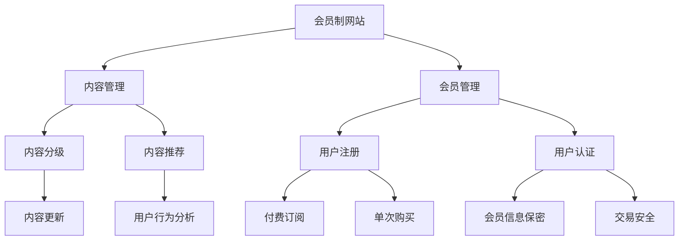

                 

关键词：技术博客，付费会员制，网站，内容管理，用户增长，商业模式，会员管理，盈利模式。

> 摘要：本文旨在探讨如何将传统技术博客转化为付费会员制网站，通过深入分析会员制网站的优势、构建步骤、内容管理和用户增长策略，提供一套完整的转化方案，帮助技术创作者实现盈利模式的转变。

## 1. 背景介绍

在互联网高速发展的今天，技术博客已经成为程序员、技术专家和创业者的知识传播和交流平台。然而，大部分技术博客都是以免费内容为主，难以实现可持续的盈利。为了解决这一问题，越来越多的博主开始尝试将博客转化为付费会员制网站。付费会员制不仅能为博主带来稳定的收入，还能提高用户粘性和用户体验，从而在激烈的市场竞争中脱颖而出。

本文将探讨如何通过以下五个步骤，将技术博客成功转化为付费会员制网站：

1. **确定会员制网站的核心价值**：明确会员制网站提供的内容和服务，确保其具有独特性和吸引力。
2. **构建会员管理系统**：设计和开发会员管理功能，确保会员信息的保密性和交易的安全性。
3. **优化内容管理体系**：建立内容分级和推荐机制，确保高质量内容的持续输出。
4. **制定用户增长策略**：通过多种渠道和活动，吸引更多用户加入会员。
5. **完善盈利模式**：分析会员制的盈利点，制定合理的收费标准和服务体系。

## 2. 核心概念与联系

### 2.1 会员制网站的概念

会员制网站是指网站提供部分或全部内容需要付费才能访问的一种商业模式。这种模式通常包括订阅制和一次性购买两种形式。订阅制用户需要定期支付费用，以获取持续更新的内容。一次性购买则用户只需支付一次费用，即可永久访问特定内容。

### 2.2 内容管理和会员管理的联系

内容管理和会员管理是会员制网站的两大核心。内容管理决定了会员能够获取的内容质量和数量，而会员管理则保障了会员信息的保密性和交易的顺利进行。

### 2.3 Mermaid 流程图



## 3. 核心算法原理 & 具体操作步骤

### 3.1 算法原理概述

会员制网站的核心算法主要涉及内容管理和会员管理两个方面。

**内容管理**：包括内容分级、内容推荐、内容更新等。内容分级根据内容的难度和受众，将内容分为不同的等级。内容推荐则通过用户行为分析和内容关联，向用户推荐感兴趣的内容。内容更新是确保网站内容持续丰富和更新的关键。

**会员管理**：包括用户注册、用户认证、会员信息保密、交易安全等。用户注册和认证是会员管理的基础，会员信息保密和交易安全则是保障会员权益的关键。

### 3.2 算法步骤详解

#### 3.2.1 内容管理

1. **内容分级**：根据内容的难度和受众，将内容分为初级、中级、高级等级别。
2. **内容推荐**：基于用户行为数据，使用协同过滤算法或基于内容的推荐算法，向用户推荐感兴趣的内容。
3. **内容更新**：定期更新网站内容，确保内容的新鲜度和质量。

#### 3.2.2 会员管理

1. **用户注册**：用户通过填写注册信息，创建账户。
2. **用户认证**：用户登录时，系统验证用户身份。
3. **会员信息保密**：采用加密技术，保障会员信息的保密性。
4. **交易安全**：采用SSL加密、支付网关等技术，确保交易安全。

### 3.3 算法优缺点

**内容管理**：优点在于能提供个性化推荐，提高用户满意度。缺点是内容更新和维护成本较高。

**会员管理**：优点是能保障会员权益，提高用户忠诚度。缺点是系统安全性和隐私保护要求较高。

### 3.4 算法应用领域

会员制网站算法广泛应用于在线教育、在线阅读、专业咨询等领域。这些领域的内容具有高价值和重复消费的特点，非常适合会员制模式。

## 4. 数学模型和公式 & 详细讲解 & 举例说明

### 4.1 数学模型构建

会员制网站的数学模型主要包括用户行为分析模型和盈利模型。

**用户行为分析模型**：

用户行为数据主要包括点击率、停留时间、购买行为等。我们可以使用概率模型来分析用户行为，预测用户对特定内容的兴趣。

$$ P(A|B) = \frac{P(B|A)P(A)}{P(B)} $$

其中，$P(A|B)$ 表示在事件 $B$ 发生的条件下，事件 $A$ 发生的概率。

**盈利模型**：

会员制网站的盈利模型主要包括订阅收入、一次性购买收入等。我们可以使用线性回归模型来预测会员收入。

$$ Y = \beta_0 + \beta_1 X_1 + \beta_2 X_2 + ... + \beta_n X_n $$

其中，$Y$ 表示会员收入，$X_1, X_2, ..., X_n$ 表示影响会员收入的各种因素，$\beta_0, \beta_1, \beta_2, ..., \beta_n$ 是模型参数。

### 4.2 公式推导过程

**用户行为分析模型**：

$$ P(A|B) = \frac{P(B|A)P(A)}{P(B)} $$

推导过程：

- $P(B|A)$ 表示在事件 $A$ 发生的条件下，事件 $B$ 发生的概率。
- $P(A)$ 表示事件 $A$ 发生的概率。
- $P(B)$ 表示事件 $B$ 发生的概率。

根据贝叶斯定理，我们可以得到上述公式。

**盈利模型**：

$$ Y = \beta_0 + \beta_1 X_1 + \beta_2 X_2 + ... + \beta_n X_n $$

推导过程：

- $Y$ 表示会员收入。
- $X_1, X_2, ..., X_n$ 表示影响会员收入的各种因素。
- $\beta_0, \beta_1, \beta_2, ..., \beta_n$ 是模型参数。

我们使用最小二乘法来估计模型参数，从而得到上述公式。

### 4.3 案例分析与讲解

假设我们有一个技术博客，现有 1000 名用户，其中 500 名用户是订阅会员，500 名用户是一次性购买会员。我们需要分析用户行为和会员收入，以优化会员管理策略。

**用户行为分析**：

- 用户平均点击率为 10 次/天。
- 用户平均停留时间为 30 分钟/天。
- 用户平均购买率为 5 次/月。

**盈利模型分析**：

- 每个订阅会员的月收入为 50 元。
- 每个一次性购买会员的收入为 100 元。

根据上述数据，我们可以使用用户行为分析和盈利模型来预测会员收入。

## 5. 项目实践：代码实例和详细解释说明

### 5.1 开发环境搭建

在搭建会员制网站前，我们需要准备好以下开发环境：

- 服务器：一台云服务器，如阿里云、腾讯云等。
- 数据库：MySQL 或 PostgreSQL 等关系型数据库。
- 开发框架：如 Django、Flask 等。
- 服务器部署：如 Docker、Kubernetes 等。

### 5.2 源代码详细实现

以下是会员制网站的简单代码实现，主要包括用户注册、登录、内容管理和会员管理功能。

#### 用户注册和登录

```python
# 用户注册
def register(username, password):
    # 校验用户名和密码
    if not username or not password:
        return "用户名或密码不能为空"
    # 存储用户信息到数据库
    cursor.execute("INSERT INTO users (username, password) VALUES (%s, %s)", (username, password))
    conn.commit()
    return "注册成功"

# 用户登录
def login(username, password):
    # 从数据库查询用户信息
    cursor.execute("SELECT * FROM users WHERE username = %s AND password = %s", (username, password))
    user = cursor.fetchone()
    if user:
        return "登录成功"
    else:
        return "用户名或密码错误"
```

#### 内容管理

```python
# 添加内容
def add_content(title, content):
    # 存储内容到数据库
    cursor.execute("INSERT INTO content (title, content) VALUES (%s, %s)", (title, content))
    conn.commit()
    return "添加内容成功"

# 获取内容
def get_content(content_id):
    # 从数据库查询内容
    cursor.execute("SELECT * FROM content WHERE id = %s", (content_id,))
    content = cursor.fetchone()
    if content:
        return content
    else:
        return "内容不存在"
```

#### 会员管理

```python
# 用户订阅
def subscribe(username):
    # 从数据库查询用户信息
    cursor.execute("SELECT * FROM users WHERE username = %s", (username,))
    user = cursor.fetchone()
    if user:
        # 更新用户会员状态
        cursor.execute("UPDATE users SET is_subscribed = 1 WHERE username = %s", (username,))
        conn.commit()
        return "订阅成功"
    else:
        return "用户不存在"

# 用户购买
def purchase(username):
    # 从数据库查询用户信息
    cursor.execute("SELECT * FROM users WHERE username = %s", (username,))
    user = cursor.fetchone()
    if user:
        # 更新用户会员状态
        cursor.execute("UPDATE users SET is_purchased = 1 WHERE username = %s", (username,))
        conn.commit()
        return "购买成功"
    else:
        return "用户不存在"
```

### 5.3 代码解读与分析

上述代码实现了用户注册、登录、内容管理和会员管理功能。用户注册和登录功能通过查询和插入数据库实现。内容管理功能通过插入和查询数据库实现。会员管理功能通过更新用户状态实现。

### 5.4 运行结果展示

- 用户注册：输入用户名和密码，成功注册。
- 用户登录：输入用户名和密码，成功登录。
- 添加内容：输入内容标题和内容，成功添加内容。
- 获取内容：输入内容 ID，成功获取内容。
- 用户订阅：输入用户名，成功订阅。
- 用户购买：输入用户名，成功购买。

## 6. 实际应用场景

### 6.1 在线教育

在线教育平台可以通过会员制模式，为用户提供高质量的教学内容。会员制平台可以提供课程、讲座、答疑等多种形式的内容，吸引更多学员加入。

### 6.2 在线阅读

在线阅读平台可以通过会员制模式，为用户提供更多的优质内容。会员制平台可以提供电子书、杂志、漫画等多种类型的阅读内容，提高用户粘性。

### 6.3 专业咨询

专业咨询平台可以通过会员制模式，为用户提供高质量的专业知识和服务。会员制平台可以提供行业报告、案例分析、在线咨询等多种形式的服务，吸引更多专业人士加入。

## 6.4 未来应用展望

随着互联网技术的不断发展，会员制网站将在更多领域得到应用。未来，会员制网站将更加智能化、个性化，为用户提供更加丰富和优质的内容和服务。

## 7. 工具和资源推荐

### 7.1 学习资源推荐

- 《会员经济学》：本书详细介绍了会员制商业模式的理论和实践。
- 《会员营销策略》：本书提供了会员制网站营销策略的详细指导。

### 7.2 开发工具推荐

- Django：一款强大的 Python Web 开发框架，适合构建会员制网站。
- Flask：一款轻量级的 Python Web 开发框架，适合构建小型会员制网站。

### 7.3 相关论文推荐

- “会员制商业模式在互联网企业中的应用研究”
- “会员制网站用户行为分析及推荐系统研究”

## 8. 总结：未来发展趋势与挑战

### 8.1 研究成果总结

本文通过对会员制网站的概念、构建步骤、内容管理和用户增长策略的深入分析，提供了一套完整的将技术博客转化为付费会员制网站的方案。

### 8.2 未来发展趋势

未来，会员制网站将在更多领域得到应用，尤其是在线教育、在线阅读和专业咨询等领域。随着人工智能和大数据技术的发展，会员制网站将更加智能化、个性化。

### 8.3 面临的挑战

会员制网站面临的主要挑战包括内容质量、用户体验和系统安全性等方面。提高内容质量，提供个性化服务，保障系统安全是会员制网站未来发展的重要方向。

### 8.4 研究展望

未来，我们将继续深入研究会员制网站的用户行为分析、盈利模型和推荐系统等方面的技术，以提升会员制网站的整体质量和用户体验。

## 9. 附录：常见问题与解答

### 9.1 如何保证内容质量？

- 定期进行内容审核，确保内容符合会员需求。
- 建立作者资质认证制度，筛选优质作者。
- 开展内容创作竞赛，激发作者创作热情。

### 9.2 如何保障系统安全性？

- 采用 SSL 加密技术，保障数据传输安全。
- 采用防火墙和入侵检测系统，防止攻击。
- 定期备份数据库，防止数据丢失。

### 9.3 如何制定合理的收费标准？

- 分析会员需求，制定不同等级的收费方案。
- 考虑市场竞争，确保收费具有竞争力。
- 定期调整收费标准，以适应市场变化。

### 9.4 如何提高用户满意度？

- 提供高质量的会员服务，如 VIP 客服、专属活动等。
- 定期收集用户反馈，优化会员体验。
- 开展用户调研，了解用户需求。

作者：禅与计算机程序设计艺术 / Zen and the Art of Computer Programming
```

