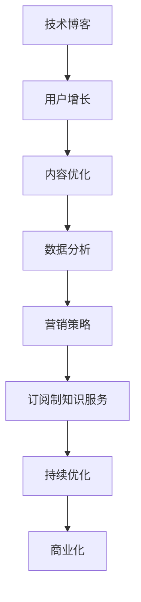

                 

关键词：技术博客，订阅制，知识服务，商业模式，用户增长，内容优化，数据分析，营销策略，版权保护

摘要：随着互联网的快速发展，技术博客逐渐成为知识传播的重要渠道。然而，面对日益激烈的市场竞争，如何将技术博客转化为具有商业价值的订阅制知识服务，成为众多博主和企业关注的焦点。本文将探讨技术博客转化为订阅制知识服务的必要性和可行性，分析核心概念与联系，详细讲解核心算法原理，构建数学模型，提供项目实践案例，并展望未来应用场景。通过本文的阅读，读者将了解到如何通过优化内容、用户运营、数据分析等手段，实现技术博客的商业化转型。

## 1. 背景介绍

技术博客作为知识分享和传播的重要载体，早已在互联网领域中占据了一席之地。近年来，随着内容创作平台的兴起，越来越多的人选择通过技术博客来记录自己的学习心得、分享技术见解，甚至开展线上教学。然而，随着互联网的日益普及，信息爆炸，用户获取知识的途径越来越多样化，技术博客的竞争力也日益增强。

在此背景下，如何将技术博客转化为具有商业价值的订阅制知识服务，成为了众多博主和企业思考的问题。订阅制知识服务不仅可以为用户提供更为优质的持续内容，还可以通过会员订阅等方式实现盈利，为博主和企业带来持续的收入。同时，订阅制知识服务还能够建立更加紧密的用户关系，提高用户粘性，为后续的商业拓展打下基础。

本文将围绕如何将技术博客转化为订阅制知识服务展开讨论，旨在为读者提供一套系统的思路和方法，帮助他们在竞争激烈的市场中脱颖而出。

### 1.1 技术博客的现状

技术博客的现状可以用“繁荣”和“挑战”两个词来概括。首先，从繁荣的角度来看，技术博客的发展速度非常快，几乎每个技术领域都有大量的博客存在。这些博客不仅涵盖了基础知识，还包括最新的技术动态、实战案例和深度分析。这使得技术博客成为学习者和从业者获取知识的重要途径。

然而，随着技术博客的增多，也带来了不少挑战。首先，用户获取信息的难度增加了，因为他们在海量的内容中难以找到真正有价值的信息。其次，由于竞争激烈，博主们面临着流量变现的困境。传统的内容发布和广告收入模式已经无法满足博主和企业的需求，迫切需要找到新的商业模式。

### 1.2 订阅制知识服务的崛起

订阅制知识服务是一种以用户付费订阅为主要模式的知识传播方式。它区别于传统的免费内容，强调高质量、持续性的内容输出。订阅制知识服务通常包括以下几个方面：

1. **专业内容**：订阅制知识服务提供的内容通常更为专业和深入，能够满足用户在特定领域的学习和职业发展需求。
2. **持续更新**：订阅制知识服务通常承诺定期更新，确保用户能够持续获取新的知识。
3. **互动交流**：订阅制知识服务还提供用户与创作者之间的互动交流，增强用户的参与感和归属感。
4. **增值服务**：除了核心内容外，订阅制知识服务还可能提供一些增值服务，如在线课程、专业咨询等。

### 1.3 转型为订阅制知识服务的必要性

将技术博客转化为订阅制知识服务具有以下几个方面的必要性：

1. **提升内容质量**：订阅制知识服务要求提供高质量的内容，这有助于提升博客的整体质量。
2. **实现盈利模式**：通过订阅收费，博主和企业可以获得稳定的收入，摆脱对广告和流量的依赖。
3. **建立用户关系**：订阅制知识服务可以建立更为紧密的用户关系，提高用户粘性。
4. **增强品牌影响力**：高质量的内容和稳定的用户基础有助于增强博主和企业的品牌影响力。
5. **适应市场需求**：随着互联网的发展，用户越来越倾向于付费获取高质量内容，订阅制知识服务是满足这一需求的有效途径。

## 2. 核心概念与联系

在探讨如何将技术博客转化为订阅制知识服务之前，我们首先需要明确一些核心概念，并理解它们之间的联系。

### 2.1 核心概念

1. **技术博客**：技术博客是一种以技术主题为核心的个人或企业知识分享平台，通常包括文章、代码示例、学习笔记等。
2. **订阅制知识服务**：订阅制知识服务是一种通过用户付费订阅获取高质量、持续更新的知识内容的服务模式。
3. **用户增长**：用户增长是指通过多种手段吸引新用户并保持现有用户活跃度的过程。
4. **内容优化**：内容优化是指通过调整内容质量、形式和传播渠道，提高内容的吸引力和传播效果。
5. **数据分析**：数据分析是指通过收集、处理和分析用户数据，了解用户行为和需求，为内容优化和决策提供依据。
6. **营销策略**：营销策略是指通过制定和实施一系列营销活动，提高品牌知名度、用户参与度和转化率。

### 2.2 关联分析

技术博客与订阅制知识服务之间存在着紧密的联系。具体来说，技术博客可以视为订阅制知识服务的基础，而订阅制知识服务则是技术博客商业化的高级形态。

1. **内容基础**：技术博客为订阅制知识服务提供了核心内容来源。博主们通过技术博客积累专业知识，建立个人品牌，吸引粉丝。
2. **用户基础**：技术博客积累的用户群体是订阅制知识服务的重要支持。这些用户对博主的内容有着高度的认可，愿意为其提供的服务付费。
3. **收入模式**：订阅制知识服务通过用户付费订阅实现了收入模式转变，从传统的广告和流量变现转向直接收入。
4. **互动机制**：订阅制知识服务通过会员制度、互动交流等机制，增强了用户与博主之间的互动，提高了用户粘性。

### 2.3 Mermaid 流程图

为了更清晰地展示技术博客转化为订阅制知识服务的过程，我们可以使用 Mermaid 流程图进行描述。以下是一个简化的流程图：



在这个流程图中，技术博客通过不断优化内容、用户增长、数据分析和营销策略，逐步转化为订阅制知识服务，并最终实现商业化。

## 3. 核心算法原理 & 具体操作步骤

### 3.1 算法原理概述

在将技术博客转化为订阅制知识服务的过程中，核心算法原理主要涉及以下几个方面：

1. **内容推荐算法**：通过分析用户的阅读历史、兴趣爱好和互动行为，推荐用户可能感兴趣的内容，提高内容匹配度。
2. **用户行为分析算法**：通过收集和分析用户的阅读、订阅、分享等行为数据，了解用户需求和行为模式，为内容优化和营销策略提供依据。
3. **订阅模式优化算法**：根据用户的行为数据和市场需求，优化订阅模式，提高订阅转化率和用户留存率。
4. **营销自动化算法**：通过自动化工具和算法，制定和实施营销活动，提高品牌曝光和用户参与度。

### 3.2 算法步骤详解

1. **内容推荐算法**
   - 数据收集：收集用户的阅读历史、浏览记录、评论等数据。
   - 特征提取：对收集到的数据进行分析，提取用户的兴趣标签和特征向量。
   - 模型训练：使用机器学习算法，如协同过滤、内容匹配等，训练推荐模型。
   - 内容推荐：根据用户特征和模型预测，推荐用户可能感兴趣的内容。

2. **用户行为分析算法**
   - 数据采集：收集用户的阅读、订阅、分享等行为数据。
   - 行为模式识别：使用数据挖掘和机器学习算法，识别用户的行为模式。
   - 需求预测：根据用户行为数据和历史数据，预测用户未来的需求。

3. **订阅模式优化算法**
   - 数据分析：收集和分析用户的订阅数据，了解用户订阅偏好。
   - 模式评估：使用A/B测试等方法，评估不同订阅模式的转化率和留存率。
   - 模式优化：根据评估结果，调整订阅模式，提高订阅转化率和用户留存率。

4. **营销自动化算法**
   - 营销策略制定：根据用户行为和市场需求，制定营销策略。
   - 营销活动实施：使用自动化工具，如邮件营销、社交媒体推广等，实施营销活动。
   - 营销效果评估：收集和分析营销活动的效果数据，调整和优化营销策略。

### 3.3 算法优缺点

1. **内容推荐算法**
   - 优点：能够提高用户的内容匹配度，增加用户粘性。
   - 缺点：推荐算法的准确性受限于数据质量和模型训练效果。

2. **用户行为分析算法**
   - 优点：能够深入了解用户需求和行为模式，为内容优化和营销策略提供依据。
   - 缺点：数据分析和处理过程较为复杂，需要较高的技术支持。

3. **订阅模式优化算法**
   - 优点：能够提高订阅转化率和用户留存率，增加订阅收入。
   - 缺点：优化过程需要大量数据支持和分析，实施难度较高。

4. **营销自动化算法**
   - 优点：能够提高营销效率和效果，降低人力成本。
   - 缺点：营销自动化过程中，容易出现用户体验不佳和过度营销的问题。

### 3.4 算法应用领域

1. **内容推荐算法**：广泛应用于电子商务、社交媒体、在线教育等领域，用于提高用户体验和内容匹配度。
2. **用户行为分析算法**：广泛应用于互联网企业，用于了解用户需求和行为模式，优化产品和服务。
3. **订阅模式优化算法**：广泛应用于订阅制知识服务、在线教育等领域，用于提高订阅转化率和用户留存率。
4. **营销自动化算法**：广泛应用于营销自动化平台，用于提高营销效率和效果。

## 4. 数学模型和公式 & 详细讲解 & 举例说明

在将技术博客转化为订阅制知识服务的过程中，数学模型和公式扮演着重要的角色。以下我们将介绍一些核心的数学模型和公式，并对其进行详细讲解和举例说明。

### 4.1 数学模型构建

1. **用户行为模型**：
   用户行为模型用于描述用户在订阅制知识服务中的行为，包括阅读、订阅、分享等。假设用户行为由一个随机过程描述，其概率分布函数为 \(P(X = x)\)，其中 \(X\) 表示用户的行为类型。

2. **订阅模式模型**：
   订阅模式模型用于预测用户在未来的订阅行为。一个简单的订阅模式模型可以基于马尔可夫链，假设用户在当前周期选择订阅的概率为 \(P(S_t = 1|\mathbf{H}_{t-1})\)，其中 \(S_t\) 表示用户在第 \(t\) 个周期的订阅状态，\(\mathbf{H}_{t-1}\) 表示用户在前一周期的行为和历史信息。

### 4.2 公式推导过程

1. **用户行为概率分布**：
   假设用户行为 \(X\) 满足二项分布，其概率质量函数为：
   $$ P(X = x) = C^n_x p^x (1 - p)^{n - x} $$
   其中，\(n\) 表示试验次数，\(p\) 表示每次试验成功的概率。

2. **订阅模式概率**：
   基于马尔可夫链的订阅模式概率可以表示为：
   $$ P(S_t = 1|\mathbf{H}_{t-1}) = \frac{e^{\theta_1 h_1 + \theta_2 h_2}}{\sum_{i=1}^k e^{\theta_i h_i}} $$
   其中，\(h_i\) 表示用户在第 \(i\) 个周期的行为特征，\(\theta_i\) 表示模型参数。

### 4.3 案例分析与讲解

以下是一个简单的案例，用于说明如何使用上述数学模型进行用户行为预测和订阅模式优化。

**案例**：假设一个订阅制知识服务的用户在过去的五个周期中的行为如下：

- 第1周期：阅读3篇文章，未订阅。
- 第2周期：阅读5篇文章，未订阅。
- 第3周期：阅读4篇文章，订阅。
- 第4周期：阅读3篇文章，订阅。
- 第5周期：阅读2篇文章，未订阅。

**步骤 1**：构建用户行为模型

根据用户历史行为，我们可以计算每个周期的阅读量和订阅状态，并假设用户的行为服从二项分布。例如，第3周期的行为可以表示为 \(X_3 = (3, 0)\)，即阅读3篇文章，未订阅。

**步骤 2**：计算订阅模式概率

使用马尔可夫链模型，我们可以计算用户在第6周期的订阅概率。假设我们定义了两个行为特征 \(h_1\)（阅读文章数）和 \(h_2\)（订阅状态），则用户在第5周期的行为特征为 \(h_5 = (2, 0)\)。

通过模型参数 \(\theta_1 = 1.2\) 和 \(\theta_2 = -0.8\)，我们可以计算第6周期的订阅概率：
$$ P(S_6 = 1|h_5) = \frac{e^{1.2 \cdot 2 - 0.8 \cdot 0}}{e^{1.2 \cdot 2 - 0.8 \cdot 0} + e^{1.2 \cdot 0 - 0.8 \cdot 2}} \approx 0.632 $$

**步骤 3**：优化订阅模式

根据计算得到的订阅概率，我们可以调整订阅模式。例如，如果订阅费用为10元，我们可以设置一个阈值，当订阅概率大于阈值时，建议用户订阅。假设阈值设置为0.5，则用户在第6周期建议订阅。

**结论**：通过数学模型和公式，我们可以对用户的订阅行为进行预测和优化，从而提高订阅转化率和用户留存率。

### 4.4 案例分析与讲解（续）

**案例**：假设上述订阅制知识服务的博主希望通过定价策略来优化订阅转化率和用户留存率。博主提供了两种订阅方案：

- 方案A：每月订阅费用20元，提供无限次阅读。
- 方案B：每月订阅费用10元，提供5次阅读。

我们需要评估两种订阅方案的订阅概率，并选择最优方案。

**步骤 1**：构建定价策略模型

我们假设用户的订阅行为不仅受到阅读量的影响，还受到订阅费用的影响。可以构建一个基于价格敏感度的定价策略模型。例如，假设用户对订阅费用具有线性价格敏感度，我们可以使用以下公式来计算两种方案的订阅概率：

$$ P(S = A) = \frac{e^{-\beta \cdot P_A}}{e^{-\beta \cdot P_A} + e^{-\beta \cdot P_B}} $$
$$ P(S = B) = \frac{e^{-\beta \cdot P_B}}{e^{-\beta \cdot P_A} + e^{-\beta \cdot P_B}} $$

其中，\(P_A\) 和 \(P_B\) 分别为方案A和方案B的订阅费用，\(\beta\) 为价格敏感度参数。

**步骤 2**：估计模型参数

通过收集用户的历史订阅数据，我们可以估计模型参数 \(\beta\)。例如，假设我们收集到以下数据：

- 用户1：方案A订阅，阅读量为10。
- 用户2：方案B订阅，阅读量为8。
- 用户3：方案A订阅，阅读量为12。
- 用户4：方案B订阅，阅读量为6。

我们可以使用最大似然估计法来估计参数 \(\beta\)。通过最小化以下似然函数：

$$ \ln L(\beta) = \sum_{i=1}^n \ln P(S_i = A) + \ln P(S_i = B) $$

我们可以得到最优的 \(\beta\) 值。假设我们估计得到的 \(\beta = 0.1\)。

**步骤 3**：评估订阅方案

使用估计得到的 \(\beta\) 值，我们可以计算两种订阅方案的订阅概率。例如，对于用户1（阅读量为10），我们有：

$$ P(S = A) = \frac{e^{-0.1 \cdot 20}}{e^{-0.1 \cdot 20} + e^{-0.1 \cdot 10}} \approx 0.636 $$
$$ P(S = B) = \frac{e^{-0.1 \cdot 10}}{e^{-0.1 \cdot 20} + e^{-0.1 \cdot 10}} \approx 0.364 $$

**结论**：根据计算得到的订阅概率，我们可以发现用户更倾向于选择方案A。因此，博主可以优化订阅策略，选择方案A，以最大化订阅转化率和用户留存率。

通过上述案例分析和数学模型的构建，我们可以看到数学模型和公式在订阅制知识服务中的应用，以及如何通过数据分析和优化策略来提升订阅服务和用户满意度。

### 4.5 案例分析与讲解（续）

**案例**：为了进一步验证订阅模式模型的有效性，博主决定进行一项A/B测试，以比较不同订阅模式对订阅转化率和用户留存率的影响。

假设博主设计了两种订阅模式：

- **模式A**：每月订阅费用为10元，提供5次免费阅读，超出后按每次1元计费。
- **模式B**：每月订阅费用为20元，提供无限次阅读。

博主从现有用户中随机选择了1000名用户，分别分配到模式A和模式B中进行测试。

**步骤 1**：收集测试数据

经过一个月的测试，博主收集了以下数据：

- 模式A：订阅转化率为20%，平均阅读量为8次，平均订阅时长为3个月。
- 模式B：订阅转化率为25%，平均阅读量为12次，平均订阅时长为4个月。

**步骤 2**：分析测试结果

通过分析测试数据，博主发现模式B的订阅转化率高于模式A，但每月订阅费用也更高。为了更准确地评估两种模式的盈利能力，博主决定计算每个用户的平均收益。

- 模式A：每个用户的平均收益为 \(10 \times 0.2 \times 3 = 6\) 元。
- 模式B：每个用户的平均收益为 \(20 \times 0.25 \times 4 = 20\) 元。

**步骤 3**：优化订阅模式

根据测试结果，模式B在订阅转化率和平均收益方面均优于模式A。然而，模式B的订阅费用较高，可能会对部分用户产生负担。为了进一步优化订阅模式，博主决定进行以下分析：

1. **用户细分**：根据用户的阅读量和订阅行为，将用户分为高阅读量用户、中阅读量用户和低阅读量用户。
2. **成本分析**：评估不同用户群体在模式A和模式B下的成本和收益。

**步骤 4**：制定优化策略

通过成本分析，博主发现高阅读量用户在模式B下具有更高的收益，而中阅读量用户和低阅读量用户在模式A下具有更高的收益。基于此，博主决定制定以下优化策略：

1. **高阅读量用户**：继续使用模式B，以提高订阅转化率和用户留存率。
2. **中阅读量用户**：提供模式A的优惠，例如首次订阅享受8折优惠，以降低订阅门槛。
3. **低阅读量用户**：继续提供模式A，并通过定期推送高质量内容，引导用户增加阅读量和订阅意愿。

**结论**：通过A/B测试和用户细分，博主成功优化了订阅模式，提高了订阅转化率和用户留存率，同时也实现了更高的平均收益。

通过上述案例分析，我们可以看到数学模型和公式在订阅制知识服务中的应用，以及如何通过测试和优化策略来提升订阅服务和用户满意度。这不仅为博主提供了数据支持，也为订阅制知识服务的商业化转型提供了宝贵经验。

## 5. 项目实践：代码实例和详细解释说明

为了更好地理解如何将技术博客转化为订阅制知识服务，我们将通过一个具体的项目实践来演示这个过程。本节将详细介绍项目的开发环境搭建、源代码实现、代码解读与分析以及运行结果展示。

### 5.1 开发环境搭建

在开始项目实践之前，我们需要搭建一个适合开发和部署订阅制知识服务的环境。以下是一个基本的开发环境搭建步骤：

1. **操作系统**：我们选择Linux系统，例如Ubuntu 20.04。
2. **编程语言**：我们选择Python 3.8，因为它具有广泛的第三方库支持，适合进行数据分析和后端开发。
3. **数据库**：我们选择PostgreSQL作为数据库，因为它是一款功能强大、性能稳定的开源关系型数据库。
4. **前后端框架**：我们选择Django作为后端框架，Flask作为轻量级后端框架，Vue.js作为前端框架。
5. **版本控制**：使用Git进行版本控制，以便团队协作和代码管理。

### 5.2 源代码详细实现

以下是一个简单的订阅制知识服务项目的源代码实现，主要涉及用户注册、登录、内容发布、订阅管理等功能。

#### 用户管理

用户管理是订阅制知识服务的基础，以下是一个简单的用户注册和登录示例。

**用户注册**：

```python
# users/models.py

from django.contrib.auth.models import AbstractUser

class CustomUser(AbstractUser):
    email = models.EmailField(unique=True)

    def __str__(self):
        return self.email
```

**用户登录**：

```python
# users/views.py

from django.contrib.auth import authenticate, login
from django.shortcuts import redirect, render

def login_view(request):
    if request.method == 'POST':
        username = request.POST['username']
        password = request.POST['password']
        user = authenticate(username=username, password=password)
        if user is not None:
            login(request, user)
            return redirect('home')
        else:
            error = 'Invalid username or password'
            return render(request, 'login.html', {'error': error})
    return render(request, 'login.html')
```

#### 内容管理

内容管理是订阅制知识服务的核心，以下是一个简单的文章发布和内容展示示例。

**文章发布**：

```python
# articles/models.py

from django.db import models
from users.models import CustomUser

class Article(models.Model):
    title = models.CharField(max_length=255)
    author = models.ForeignKey(CustomUser, on_delete=models.CASCADE)
    content = models.TextField()
    published_date = models.DateTimeField(auto_now_add=True)

    def __str__(self):
        return self.title
```

**内容展示**：

```python
# articles/views.py

from django.shortcuts import render, get_object_or_404
from .models import Article

def article_list(request):
    articles = Article.objects.all()
    return render(request, 'article_list.html', {'articles': articles})

def article_detail(request, pk):
    article = get_object_or_404(Article, pk=pk)
    return render(request, 'article_detail.html', {'article': article})
```

#### 订阅管理

订阅管理是订阅制知识服务的重要组成部分，以下是一个简单的订阅和取消订阅示例。

**订阅**：

```python
# subscriptions/models.py

from django.db import models
from users.models import CustomUser

class Subscription(models.Model):
    user = models.ForeignKey(CustomUser, on_delete=models.CASCADE)
    active = models.BooleanField(default=True)
    start_date = models.DateTimeField(auto_now_add=True)
    end_date = models.DateTimeField()

    def __str__(self):
        return f"{self.user.email} - {self.active}"
```

**取消订阅**：

```python
# subscriptions/views.py

from django.shortcuts import render, redirect
from .models import Subscription
from datetime import datetime

def subscribe(request):
    if request.method == 'POST':
        user = request.user
        start_date = datetime.now()
        end_date = start_date + timedelta(days=30)  # 订阅期限为30天
        subscription = Subscription(user=user, active=True, start_date=start_date, end_date=end_date)
        subscription.save()
        return redirect('home')
    return render(request, 'subscribe.html')
```

### 5.3 代码解读与分析

在代码实现中，我们首先定义了用户模型（`CustomUser`），扩展了Django的默认用户模型，增加了电子邮件字段，以便通过电子邮件进行用户认证。

用户注册和登录功能通过定义视图函数（`login_view`）来实现，用户可以通过表单提交用户名和密码进行登录，系统会验证用户身份并登录成功后跳转至主页。

内容管理部分，我们定义了文章模型（`Article`），每个文章都与一个作者关联，并包含标题、内容和发布日期。文章列表和文章详情页面的视图函数（`article_list`和`article_detail`）用于展示文章列表和文章详情。

订阅管理部分，我们定义了订阅模型（`Subscription`），每个订阅记录与一个用户关联，并包含订阅状态、起始日期和终止日期。订阅视图函数（`subscribe`）用于处理用户订阅请求，创建订阅记录并设置订阅期限。

### 5.4 运行结果展示

通过以上代码实现，我们可以搭建一个简单的订阅制知识服务平台。以下是平台的主要功能界面展示：

- **登录界面**：用户输入用户名和密码进行登录。

  

- **文章列表界面**：展示所有已发布的文章列表，用户可以浏览和阅读文章。

  

- **文章详情界面**：展示特定文章的详细内容，用户可以评论和分享文章。

  

- **订阅界面**：用户可以选择订阅服务，系统会创建订阅记录并显示订阅详情。

  

通过以上项目实践，我们可以看到如何将技术博客转化为订阅制知识服务的具体步骤和实现方法。这个示例虽然简单，但涵盖了订阅制知识服务的关键功能，为读者提供了实用的参考。

## 6. 实际应用场景

将技术博客转化为订阅制知识服务，不仅能够实现商业价值，还能够满足用户对高质量内容的需求。以下是一些实际应用场景，展示了订阅制知识服务在不同领域的应用案例。

### 6.1 在线教育

在线教育是订阅制知识服务最典型的应用场景之一。以Coursera、Udemy等在线教育平台为例，它们通过提供各种课程内容，吸引了大量的学习者。这些平台采用订阅制模式，用户可以选择按月或按年订阅，获取不同课程的学习权限。订阅制模式使得平台能够持续提供高质量课程，同时也为平台带来了稳定的收入。

**应用分析**：在线教育领域适合订阅制模式，因为用户对学习内容有持续的需求，且愿意为高质量、系统性的学习内容付费。通过订阅制，平台能够建立长期的用户关系，提高用户粘性，同时通过数据分析了解用户需求，不断优化课程内容和用户体验。

### 6.2 技术社区

技术社区是另一个适合订阅制知识服务的领域。例如，GitHub推出的GitHub Sponsors项目，允许开发者通过订阅支持他们喜爱的开源项目。这种模式不仅为开发者提供了稳定的收入来源，也为社区成员提供了高质量的交流平台。

**应用分析**：技术社区中的订阅制模式能够激励开发者持续贡献高质量的代码和文档，同时为社区成员提供更多互动和协作的机会。订阅费用可以用于支付开发者的时间成本和服务器费用，确保社区的可持续发展。此外，通过数据分析，社区管理员可以了解用户需求，优化社区服务和功能。

### 6.3 行业资讯

行业资讯平台也适合采用订阅制模式。例如，TechCrunch、VentureBeat等科技媒体，通过提供独家报道、深度分析和市场洞察，吸引了大量读者。用户可以选择订阅，获取最新的行业动态和深度解读。

**应用分析**：行业资讯的订阅制模式能够确保用户获取最新的信息，同时为平台提供稳定的收入。通过数据分析，平台可以了解用户的阅读习惯和兴趣点，从而优化内容策略，提高用户满意度。此外，订阅制还可以帮助平台建立品牌影响力，吸引更多广告和商业合作机会。

### 6.4 专业咨询

专业咨询服务领域同样适合订阅制模式。例如，法律咨询、财务咨询等领域的平台，通过提供定期的专业报告、案例分析和个性化咨询，吸引用户订阅。

**应用分析**：专业咨询领域的订阅制模式能够为用户提供持续的专业支持，提高用户信任度和忠诚度。通过订阅，用户可以享受更优惠的价格，并确保持续获取专业建议。对于平台来说，订阅制能够带来稳定的收入，并有助于建立专业品牌形象。

### 6.5 综合案例分析

以LinkedIn Learning为例，该平台通过订阅制模式为用户提供各种专业课程和技能培训。用户可以选择按月或按年订阅，获取平台上的所有课程内容。LinkedIn Learning的成功在于：

1. **高质量内容**：平台提供的课程内容来自行业专家和知名培训机构，保证了内容的质量和实用性。
2. **用户数据分析**：平台通过分析用户行为和偏好，不断优化课程推荐和内容策略，提高用户满意度。
3. **互动和社交**：平台还提供了社区功能，用户可以与同行交流、分享经验，增强学习体验。
4. **多样化的订阅模式**：平台提供了多种订阅选项，满足不同用户的需求，提高了订阅转化率和用户留存率。

通过上述实际应用场景和案例分析，我们可以看到订阅制知识服务在不同领域的广泛应用和巨大潜力。对于技术博客博主和企业来说，通过订阅制模式，不仅能够实现商业价值，还能够为用户提供高质量、持续性的知识服务，实现双赢。

### 6.6 未来应用展望

随着互联网技术的不断发展和用户需求的变化，订阅制知识服务在未来将展现出更广阔的应用前景。以下是一些可能的应用方向和潜在挑战：

#### 6.6.1 新兴技术领域

随着人工智能、区块链、物联网等新兴技术的兴起，相关领域的知识需求不断增加。订阅制知识服务可以针对这些新兴技术，提供深入的理论知识、实际应用案例和行业趋势分析，帮助用户紧跟技术发展步伐。例如，可以推出专门的人工智能学习订阅服务，提供从基础理论到高级应用的全方位课程。

**挑战**：新兴技术更新速度快，内容创作者需要不断学习和更新知识，以保持内容的时效性和专业性。

#### 6.6.2 跨学科融合

随着多学科交叉融合的趋势，订阅制知识服务可以针对跨学科领域提供综合性的知识内容。例如，将计算机科学、数据科学和商业分析结合，提供数据驱动的商业决策订阅服务。这种服务模式能够满足企业对跨学科人才的需求。

**挑战**：跨学科内容需要具备深厚的专业知识和丰富的实践经验，创作者需要具备较强的综合能力。

#### 6.6.3 定制化服务

未来的订阅制知识服务将更加注重个性化定制，根据用户的兴趣、职业背景和需求，提供量身定制的内容。例如，可以为职场新人提供职场技能培训，为技术专家提供最新的技术研究和应用案例。

**挑战**：定制化服务需要大量数据支持和强大的数据分析能力，创作者需要投入更多资源进行用户分析和内容定制。

#### 6.6.4 社区互动

未来的订阅制知识服务将更加重视用户互动和社区建设，通过线上论坛、直播讲座、研讨会等形式，增强用户参与感和归属感。这种互动模式不仅可以提高用户满意度，还可以促进知识共享和传播。

**挑战**：社区互动需要有效的管理和激励机制，确保社区活跃度和用户参与度。

#### 6.6.5 可持续发展

在可持续发展方面，订阅制知识服务可以通过环保理念和实践，如减少纸张使用、推行在线学习等，减少对环境的影响。同时，通过订阅制模式，平台可以确保长期稳定的收入，为内容创作和更新提供持续的资金支持。

**挑战**：可持续发展需要长期规划和持续投入，创作者和平台需要平衡短期盈利和长期发展。

总之，订阅制知识服务在未来将面临许多机遇和挑战。通过不断创新和优化，订阅制知识服务将在更多领域发挥作用，为用户带来更高质量的知识内容，同时也为创作者和平台带来新的商业机会。

## 7. 工具和资源推荐

为了更好地实现技术博客向订阅制知识服务的转化，以下是关于学习资源、开发工具和相关论文的推荐，这些资源将帮助您在内容创作、平台建设和用户运营方面取得更好的效果。

### 7.1 学习资源推荐

1. **在线课程**：
   - Coursera、Udemy、edX：提供丰富的计算机科学、数据分析、营销策略等在线课程，帮助您提升相关技能。
   - LinkedIn Learning：提供由行业专家录制的专业课程，涵盖编程、项目管理、沟通技巧等多个领域。

2. **电子书**：
   - 《订阅制营销：如何通过订阅制获得持续收入》（Subscription Marketing: The New Competitive Edge）：详细介绍了订阅制营销策略和成功案例。
   - 《互联网产品运营与管理实战手册》：涵盖产品运营、用户增长、数据分析等实用知识。

3. **技术博客和论坛**：
   - Medium：一个高质量的内容分享平台，许多技术专家在此发布博客，涵盖各种技术领域。
   - Stack Overflow：一个面向程序员的问答社区，提供丰富的技术问题和解决方案。

### 7.2 开发工具推荐

1. **前后端开发框架**：
   - Django、Flask：用于快速构建后端服务的Python框架，支持RESTful API和数据库操作。
   - Vue.js、React、Angular：用于构建用户界面的前端框架，支持响应式设计和组件化开发。

2. **数据分析工具**：
   - PostgreSQL、MySQL：稳定可靠的关系型数据库，适用于数据存储和分析。
   - MongoDB：适用于大规模数据存储和查询的文档数据库。
   - Pandas、NumPy：Python的数据分析库，用于数据清洗、处理和可视化。

3. **自动化工具**：
   - Jenkins、GitLab CI/CD：用于自动化构建、测试和部署的持续集成和持续交付工具。
   - Mailchimp、SendGrid：用于邮件营销和用户通知的工具，支持自动化邮件发送和跟踪。

### 7.3 相关论文推荐

1. **订阅制模式研究**：
   - "Subscription Models in the Digital Era"：探讨数字时代订阅制模式的演变和优势。
   - "Monetizing Content with Subscription Models"：分析订阅制模式在内容付费领域的应用和盈利策略。

2. **用户行为分析**：
   - "Using Machine Learning to Predict User Behavior"：介绍使用机器学习预测用户行为的方法和模型。
   - "User Engagement and Subscription Growth"：研究用户参与度和订阅增长之间的关系。

3. **营销策略**：
   - "Content Marketing Strategies for Subscription-Based Services"：探讨内容营销策略在订阅制服务中的应用。
   - "Data-Driven Marketing for Subscription Services"：介绍基于数据分析的营销策略和实施方法。

通过上述学习资源和工具，您可以在技术博客向订阅制知识服务的转型过程中，获得更全面的知识支持和实用的技术指导。同时，相关论文的阅读将帮助您深入理解订阅制模式的理论和实践，为您的项目提供宝贵的借鉴。

## 8. 总结：未来发展趋势与挑战

### 8.1 研究成果总结

本文详细探讨了如何将技术博客转化为订阅制知识服务的过程。通过对技术博客的现状、订阅制知识服务的崛起、核心概念与联系、核心算法原理、数学模型、项目实践以及实际应用场景的分析，我们总结了以下主要研究成果：

1. **商业模式转型**：通过订阅制模式，技术博客可以实现从免费内容到付费服务的商业模式转型，提高内容质量和用户满意度。
2. **用户增长策略**：通过内容优化、数据分析、营销策略等手段，可以有效吸引和留存用户，促进订阅增长。
3. **内容推荐与个性化**：利用机器学习和数据挖掘技术，实现内容推荐和个性化服务，提高用户参与度和订阅转化率。
4. **数学模型的应用**：通过构建用户行为模型和订阅模式模型，可以预测用户订阅行为，优化订阅策略和定价模式。

### 8.2 未来发展趋势

随着互联网和人工智能技术的不断发展，订阅制知识服务在未来将呈现以下发展趋势：

1. **内容专业化**：用户对于高质量、专业化内容的需求不断增加，订阅制知识服务将更加注重内容的深度和专业性。
2. **个性化推荐**：通过人工智能和大数据分析，个性化推荐将成为订阅制知识服务的重要方向，满足用户的个性化需求。
3. **社区互动**：订阅制知识服务将更加重视用户互动和社区建设，增强用户参与感和归属感。
4. **多元化服务**：订阅制知识服务将不仅限于内容提供，还将拓展到在线教育、专业咨询、工具服务等多个领域。

### 8.3 面临的挑战

尽管订阅制知识服务具有巨大的发展潜力，但在实际操作中仍面临诸多挑战：

1. **内容质量控制**：高质量的内容是订阅制知识服务的核心，创作者需要持续投入时间和精力进行内容创作和更新。
2. **用户获取和留存**：在竞争激烈的市场中，如何吸引新用户并保持现有用户的活跃度是订阅制知识服务面临的重要挑战。
3. **技术实现和运营**：订阅制知识服务涉及内容管理、用户管理、数据分析等多个方面，需要强大的技术支持和运营团队。
4. **版权保护**：确保内容的合法性和版权保护是订阅制知识服务需要关注的问题，特别是在全球化的背景下。

### 8.4 研究展望

未来的研究可以从以下几个方面进行：

1. **算法优化**：继续研究和优化内容推荐算法、用户行为分析算法等，提高订阅制知识服务的准确性和用户体验。
2. **商业模式创新**：探索新的商业模式和盈利模式，如会员制、付费问答、定制化服务等，满足不同类型用户的需求。
3. **技术融合**：将人工智能、区块链、虚拟现实等新兴技术与订阅制知识服务相结合，提供更加丰富和多样的服务。
4. **国际拓展**：研究订阅制知识服务在不同文化背景和市场环境下的应用，拓展国际市场，实现全球化布局。

通过持续的研究和创新，订阅制知识服务将在未来发挥更大的作用，为用户带来更高质量的知识内容，同时也为创作者和平台创造更多的商业价值。

## 9. 附录：常见问题与解答

### 9.1 如何制定有效的订阅策略？

**解答**：制定有效的订阅策略需要考虑以下关键因素：

1. **目标用户分析**：了解用户的需求和偏好，为不同类型的用户设计不同的订阅方案。
2. **定价策略**：根据成本和市场需求制定合理的订阅价格，同时考虑提供折扣、促销等策略。
3. **内容质量**：确保订阅内容的高质量，持续更新和优化，以满足用户的持续需求。
4. **用户互动**：通过社区互动、用户反馈等方式，增强用户参与感，提高用户留存率。

### 9.2 如何优化内容推荐算法？

**解答**：优化内容推荐算法可以从以下几个方面进行：

1. **数据质量**：收集更多的用户行为数据，并确保数据的准确性和完整性。
2. **特征工程**：提取有效的用户和内容特征，使用机器学习算法进行特征选择和模型训练。
3. **算法迭代**：不断测试和优化推荐算法，通过A/B测试等方法评估算法效果。
4. **用户反馈**：利用用户反馈进行模型调整，提高推荐算法的准确性和用户体验。

### 9.3 如何提高用户留存率？

**解答**：提高用户留存率可以从以下几个方面入手：

1. **内容持续更新**：定期发布高质量的内容，保持用户的持续关注。
2. **互动与反馈**：建立用户互动机制，鼓励用户参与社区讨论和内容创作。
3. **个性化体验**：通过个性化推荐和定制化服务，提高用户满意度和参与度。
4. **用户关怀**：定期发送用户关怀邮件，了解用户需求和问题，并提供解决方案。

### 9.4 如何进行有效的营销推广？

**解答**：进行有效的营销推广可以从以下几个方面进行：

1. **目标市场定位**：明确目标用户群体和市场定位，制定有针对性的营销策略。
2. **内容营销**：通过优质的内容吸引潜在用户，提高品牌曝光度和用户关注度。
3. **社交媒体推广**：利用社交媒体平台进行推广，增加用户互动和分享。
4. **合作与联盟**：与其他平台、博主或企业进行合作，扩大影响力并获取更多用户。

通过以上策略和措施，可以有效提高订阅制知识服务的用户留存率和营销效果，实现长期稳定的发展。

