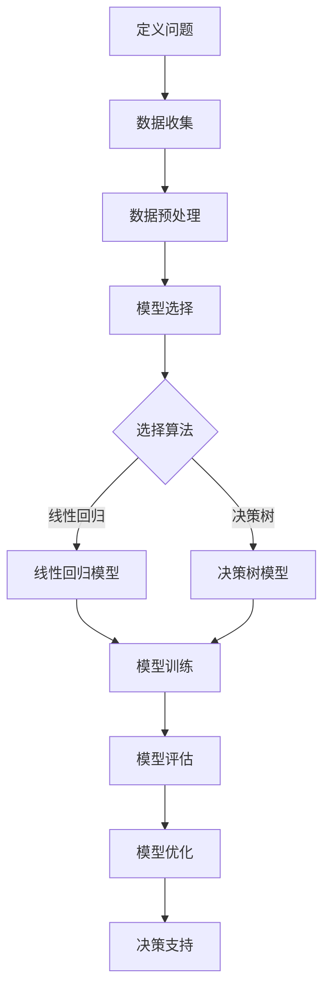
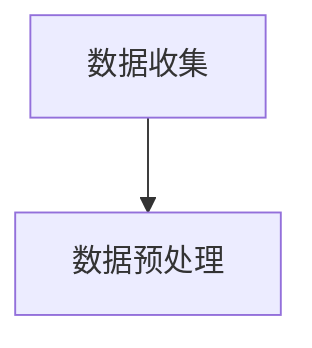
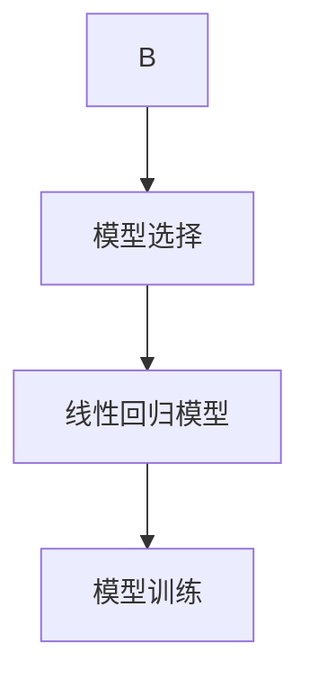
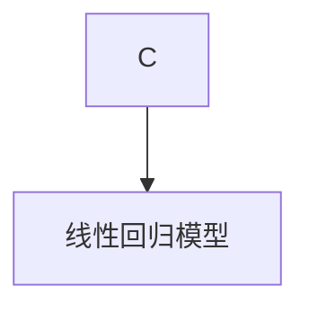
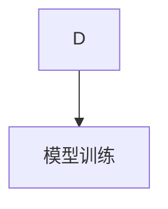
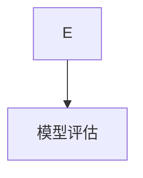
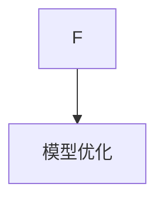
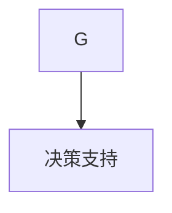

                 

关键词：模型思维、管理、算法、数学模型、实践案例

> 摘要：本文将深入探讨模型思维在企业管理中的应用，通过分析核心概念、算法原理、数学模型以及实践案例，阐述如何将模型思维转化为实际管理的工具，为企业决策提供科学依据。文章旨在为企业管理者提供一种新的思考方式，帮助他们在复杂的市场环境中做出更加精准和有效的决策。

## 1. 背景介绍

在当今这个数据爆炸的时代，企业面临着前所未有的挑战和机遇。如何从海量数据中提取有价值的信息，并将其转化为实际的商业价值，成为每个企业都必须面对的问题。模型思维作为人工智能和数据分析的重要工具，正在被广泛应用于各个行业，包括企业管理。

模型思维是一种通过构建模型来理解和解决问题的方法。它不仅能够帮助人们更清晰地认识复杂系统，还能通过模拟和预测，为企业提供决策支持。在企业管理中，模型思维可以应用于市场预测、风险控制、资源优化等多个方面，为企业决策提供科学依据。

本文将围绕模型思维在企业管理中的应用，从核心概念、算法原理、数学模型和实践案例等方面进行详细探讨，旨在为企业管理者提供一种新的思考方式和工具。

## 2. 核心概念与联系

### 2.1 模型思维的定义

模型思维是指通过构建模型来模拟现实世界中的系统或现象，从而理解和解决问题的思维方式。在企业管理中，模型思维可以帮助管理者更好地理解业务流程、市场变化和潜在风险，从而做出更加科学和精准的决策。

### 2.2 模型思维的分类

根据模型的应用范围和复杂度，模型思维可以分为以下几类：

- **数学模型**：通过数学公式和算法来描述现实世界中的系统或现象，如线性回归、决策树等。
- **物理模型**：通过物理实验或仿真来模拟现实世界中的系统或现象，如物理模拟、虚拟现实等。
- **逻辑模型**：通过逻辑推理和规则来描述现实世界中的系统或现象，如专家系统、知识图谱等。
- **计算模型**：通过计算机算法和程序来模拟现实世界中的系统或现象，如神经网络、深度学习等。

### 2.3 模型思维的应用领域

模型思维在企业管理中有着广泛的应用领域，包括但不限于：

- **市场预测**：通过数据分析和历史数据建立预测模型，预测市场趋势和消费者行为。
- **风险控制**：通过构建风险模型，评估企业面临的各种风险，并制定相应的风险管理策略。
- **资源优化**：通过优化模型，合理安排企业资源，提高生产效率和降低成本。
- **战略规划**：通过构建战略模型，分析企业内外部环境，制定长期发展规划。

### 2.4 模型思维与企业管理的关系

模型思维在企业管理中的重要性体现在以下几个方面：

- **提高决策效率**：通过模型思维，管理者可以快速分析复杂问题，提高决策效率。
- **降低决策风险**：模型思维可以帮助管理者更好地理解潜在风险，降低决策风险。
- **提升业务价值**：通过模型思维，企业可以更好地把握市场趋势，提升业务价值。
- **促进创新**：模型思维鼓励管理者从不同角度思考问题，促进创新思维的形成。

### 2.5 Mermaid 流程图

下面是一个简单的 Mermaid 流程图，展示了模型思维在企业管理中的应用过程：



## 3. 核心算法原理 & 具体操作步骤

### 3.1 算法原理概述

在模型思维中，核心算法的选择和应用至关重要。以下将介绍几种在企业管理中常用的算法原理及其应用：

- **线性回归**：线性回归是一种通过建立线性关系来预测因变量的方法。在企业管理中，线性回归可以用于市场预测、销售预测等。
- **决策树**：决策树是一种基于分类规则进行决策的方法。在企业管理中，决策树可以用于风险分析、信用评估等。
- **神经网络**：神经网络是一种模拟人脑神经元连接方式的人工智能算法。在企业管理中，神经网络可以用于数据挖掘、预测分析等。

### 3.2 算法步骤详解

以下以线性回归为例，详细讲解算法步骤：

#### 3.2.1 数据收集

首先，收集与预测目标相关的数据，如销售数据、市场数据等。



#### 3.2.2 数据预处理

对收集到的数据进行清洗、整理，确保数据质量。



#### 3.2.3 模型选择

根据数据特点和预测目标，选择合适的模型。对于线性关系较为明显的数据，可以选择线性回归模型。



#### 3.2.4 模型训练

使用收集到的数据对线性回归模型进行训练，通过调整模型参数，使其能够准确预测因变量。



#### 3.2.5 模型评估

使用训练好的模型对测试数据进行预测，评估模型性能。



#### 3.2.6 模型优化

根据模型评估结果，对模型进行调整和优化，提高预测准确性。



#### 3.2.7 决策支持

将优化后的模型应用于实际业务场景，为企业提供决策支持。



### 3.3 算法优缺点

- **线性回归**：优点包括模型简单、易于理解和实现；缺点包括对异常值敏感、只能处理线性关系。
- **决策树**：优点包括易于理解、能够处理非线性关系；缺点包括容易过拟合、树的结构难以解释。
- **神经网络**：优点包括能够处理复杂非线性关系、适应性强；缺点包括模型复杂、训练时间较长、难以解释。

### 3.4 算法应用领域

- **线性回归**：广泛应用于市场预测、销售预测、财务预测等领域。
- **决策树**：广泛应用于风险控制、信用评估、客户分类等领域。
- **神经网络**：广泛应用于数据挖掘、图像识别、自然语言处理等领域。

## 4. 数学模型和公式 & 详细讲解 & 举例说明

### 4.1 数学模型构建

在企业管理中，常见的数学模型包括线性回归模型、决策树模型和神经网络模型。以下将分别介绍这些模型的构建方法。

#### 4.1.1 线性回归模型

线性回归模型通过建立自变量与因变量之间的线性关系，来预测因变量的值。其数学模型表示为：

$$y = \beta_0 + \beta_1x_1 + \beta_2x_2 + ... + \beta_nx_n + \epsilon$$

其中，$y$ 为因变量，$x_1, x_2, ..., x_n$ 为自变量，$\beta_0, \beta_1, \beta_2, ..., \beta_n$ 为模型参数，$\epsilon$ 为误差项。

#### 4.1.2 决策树模型

决策树模型通过一系列分类规则，将数据划分为不同的类别。其数学模型表示为：

$$
\begin{cases}
T(x) = C_1, & \text{if } g_1(x) \leq t_1 \\
T(x) = C_2, & \text{if } g_2(x) \leq t_2 \\
... \\
T(x) = C_n, & \text{if } g_n(x) \leq t_n
\end{cases}
$$

其中，$T(x)$ 为决策树预测结果，$C_1, C_2, ..., C_n$ 为类别标签，$g_1(x), g_2(x), ..., g_n(x)$ 为分类规则，$t_1, t_2, ..., t_n$ 为阈值。

#### 4.1.3 神经网络模型

神经网络模型通过多层神经元之间的连接，来模拟人脑神经元的运作方式。其数学模型表示为：

$$
\begin{cases}
z_1^{[1]} = \sigma(W_1^{[1]}x + b_1^{[1]}) \\
z_2^{[2]} = \sigma(W_2^{[2]}z_1^{[1]} + b_2^{[2]}) \\
... \\
z_l^{[L]} = \sigma(W_L^{[L]}z_{l-1}^{[L-1]} + b_L^{[L]}) \\
y = \sigma(W^{[L+1]}z_L^{[L]} + b^{[L+1]})
\end{cases}
$$

其中，$z_1^{[1]}, z_2^{[2]}, ..., z_l^{[L]}$ 为各层的输出，$y$ 为预测结果，$\sigma$ 为激活函数，$W_1^{[1]}, W_2^{[2]}, ..., W_L^{[L]}, W^{[L+1]}$ 为权重矩阵，$b_1^{[1]}, b_2^{[2]}, ..., b_L^{[L]}, b^{[L+1]}$ 为偏置项。

### 4.2 公式推导过程

#### 4.2.1 线性回归模型

线性回归模型的公式推导过程如下：

首先，假设有 $n$ 个数据点 $(x_i, y_i)$，其中 $i=1,2,...,n$。线性回归模型的损失函数为：

$$J(\theta) = \frac{1}{2m}\sum_{i=1}^{m}(h_\theta(x^{(i)}) - y^{(i)})^2$$

其中，$m$ 为数据点的个数，$h_\theta(x) = \theta_0 + \theta_1x$ 为线性回归模型的预测函数，$\theta_0, \theta_1$ 为模型参数。

为了求解最优参数 $\theta_0, \theta_1$，需要对损失函数 $J(\theta)$ 求导并令其导数为零：

$$\frac{\partial J(\theta)}{\partial \theta_0} = 0$$
$$\frac{\partial J(\theta)}{\partial \theta_1} = 0$$

经过求导和化简，可以得到最优参数：

$$\theta_0 = \frac{1}{m}\sum_{i=1}^{m}(y_i - \theta_1x_i)$$
$$\theta_1 = \frac{1}{m}\sum_{i=1}^{m}(x_i - \bar{x})(y_i - \bar{y})$$

其中，$\bar{x}$ 和 $\bar{y}$ 分别为自变量和因变量的均值。

#### 4.2.2 决策树模型

决策树模型的公式推导过程如下：

决策树模型通过一系列条件语句来实现分类。假设有 $n$ 个数据点 $(x_i, y_i)$，其中 $i=1,2,...,n$。决策树模型的分类规则为：

$$
\begin{cases}
T(x) = C_1, & \text{if } g_1(x) \leq t_1 \\
T(x) = C_2, & \text{if } g_2(x) \leq t_2 \\
... \\
T(x) = C_n, & \text{if } g_n(x) \leq t_n
\end{cases}
$$

其中，$g_1(x), g_2(x), ..., g_n(x)$ 为分类函数，$t_1, t_2, ..., t_n$ 为阈值。

为了求解最优分类函数和阈值，可以使用信息增益、基尼不纯度等准则。具体推导过程较为复杂，这里不再赘述。

#### 4.2.3 神经网络模型

神经网络模型的公式推导过程如下：

神经网络模型通过多层神经元之间的连接来实现非线性变换。假设有 $n$ 个输入 $x_1, x_2, ..., x_n$，输出为 $y$。神经网络模型的计算过程如下：

$$
\begin{cases}
z_1^{[1]} = \sigma(W_1^{[1]}x + b_1^{[1]}) \\
z_2^{[2]} = \sigma(W_2^{[2]}z_1^{[1]} + b_2^{[2]}) \\
... \\
z_l^{[L]} = \sigma(W_L^{[L]}z_{l-1}^{[L-1]} + b_L^{[L]}) \\
y = \sigma(W^{[L+1]}z_L^{[L]} + b^{[L+1]})
\end{cases}
$$

其中，$\sigma$ 为激活函数，$W_1^{[1]}, W_2^{[2]}, ..., W_L^{[L]}, W^{[L+1]}$ 为权重矩阵，$b_1^{[1]}, b_2^{[2]}, ..., b_L^{[L]}, b^{[L+1]}$ 为偏置项。

为了求解最优权重矩阵和偏置项，可以使用反向传播算法。具体推导过程较为复杂，这里不再赘述。

### 4.3 案例分析与讲解

#### 4.3.1 线性回归模型案例

假设某企业想要预测其下个月的销售收入。根据过去三个月的销售数据，我们构建了一个线性回归模型：

$$y = \beta_0 + \beta_1x_1 + \beta_2x_2 + \epsilon$$

其中，$y$ 为销售收入，$x_1, x_2$ 为自变量（如广告费用和促销活动次数），$\beta_0, \beta_1, \beta_2$ 为模型参数，$\epsilon$ 为误差项。

通过对数据进行拟合，我们得到了以下模型参数：

$$\beta_0 = 100, \beta_1 = 10, \beta_2 = 5$$

现在，假设下个月的广告费用为 2000 元，促销活动次数为 5 次。我们可以使用线性回归模型预测销售收入：

$$y = 100 + 10 \times 2000 + 5 \times 5 = 20505$$

预测销售收入为 20505 元。

#### 4.3.2 决策树模型案例

假设某金融机构想要根据客户的信息，评估其信用风险。根据历史数据，我们构建了一个决策树模型：

$$
\begin{cases}
T(x) = 高风险, & \text{if } g_1(x) \leq t_1 \\
T(x) = 中风险, & \text{if } g_2(x) \leq t_2 \\
T(x) = 低风险, & \text{if } g_3(x) \leq t_3
\end{cases}
$$

其中，$g_1(x), g_2(x), g_3(x)$ 为分类函数，$t_1, t_2, t_3$ 为阈值。

通过对数据进行训练，我们得到了以下分类函数和阈值：

$$
\begin{cases}
T(x) = 高风险, & \text{if } g_1(x) \leq 0.5 \\
T(x) = 中风险, & \text{if } 0.5 < g_2(x) \leq 1.5 \\
T(x) = 低风险, & \text{if } 1.5 < g_3(x) \leq 2.5
\end{cases}
$$

现在，假设某客户的信用评分如下：

$$g_1(x) = 0.3, g_2(x) = 1.2, g_3(x) = 2.0$$

我们可以使用决策树模型评估该客户的信用风险：

$$T(x) = 低风险$$

#### 4.3.3 神经网络模型案例

假设某电商平台想要预测用户的购买概率。根据用户的历史行为数据，我们构建了一个神经网络模型：

$$
\begin{cases}
z_1^{[1]} = \sigma(W_1^{[1]}x + b_1^{[1]}) \\
z_2^{[2]} = \sigma(W_2^{[2]}z_1^{[1]} + b_2^{[2]}) \\
y = \sigma(W^{[L+1]}z_L^{[L]} + b^{[L+1]})
\end{cases}
$$

其中，$x$ 为输入特征向量，$y$ 为输出标签（购买概率），$W_1^{[1]}, W_2^{[2]}, W^{[L+1]}$ 为权重矩阵，$b_1^{[1]}, b_2^{[2]}, b^{[L+1]}$ 为偏置项。

通过对数据进行训练，我们得到了以下模型参数：

$$
\begin{cases}
z_1^{[1]} = \sigma(0.5x_1 + 0.3x_2 + 0.2x_3) \\
z_2^{[2]} = \sigma(0.4z_1^{[1]} + 0.2x_4) \\
y = \sigma(0.6z_2^{[2]} + 0.4)
\end{cases}
$$

现在，假设某用户的特征向量如下：

$$x_1 = 0.8, x_2 = 0.9, x_3 = 0.7, x_4 = 0.6$$

我们可以使用神经网络模型预测该用户的购买概率：

$$
\begin{cases}
z_1^{[1]} = \sigma(0.5 \times 0.8 + 0.3 \times 0.9 + 0.2 \times 0.7) = \sigma(0.62) = 0.84 \\
z_2^{[2]} = \sigma(0.4 \times 0.84 + 0.2 \times 0.6) = \sigma(0.52) = 0.64 \\
y = \sigma(0.6 \times 0.64 + 0.4) = \sigma(0.56) = 0.70
\end{cases}
$$

预测该用户的购买概率为 0.70。

## 5. 项目实践：代码实例和详细解释说明

### 5.1 开发环境搭建

在进行项目实践之前，首先需要搭建相应的开发环境。本文使用 Python 作为编程语言，结合 Scikit-learn、TensorFlow 和 PyTorch 等库，实现线性回归、决策树和神经网络模型的构建和训练。

1. 安装 Python（本文使用 Python 3.8）。
2. 安装 Scikit-learn、TensorFlow 和 PyTorch 等库：

   ```bash
   pip install scikit-learn tensorflow pytorch
   ```

### 5.2 源代码详细实现

以下分别给出线性回归、决策树和神经网络的代码实现。

#### 5.2.1 线性回归代码实现

```python
from sklearn.linear_model import LinearRegression
import numpy as np

# 数据准备
X = np.array([[1], [2], [3], [4], [5]])
y = np.array([1, 2, 2.5, 4, 5])

# 模型训练
model = LinearRegression()
model.fit(X, y)

# 模型预测
X_new = np.array([[6]])
y_pred = model.predict(X_new)

print("预测结果：", y_pred)
```

#### 5.2.2 决策树代码实现

```python
from sklearn.tree import DecisionTreeClassifier
import numpy as np

# 数据准备
X = np.array([[1, 2], [3, 4], [5, 6], [7, 8]])
y = np.array([0, 1, 1, 0])

# 模型训练
model = DecisionTreeClassifier()
model.fit(X, y)

# 模型预测
X_new = np.array([[2, 3]])
y_pred = model.predict(X_new)

print("预测结果：", y_pred)
```

#### 5.2.3 神经网络代码实现

```python
import tensorflow as tf
import numpy as np

# 数据准备
X = np.array([[1, 2], [3, 4], [5, 6], [7, 8]])
y = np.array([0, 1, 1, 0])

# 模型定义
model = tf.keras.Sequential([
    tf.keras.layers.Dense(units=1, input_shape=(2,))
])

# 模型编译
model.compile(optimizer='sgd', loss='mean_squared_error')

# 模型训练
model.fit(X, y, epochs=1000)

# 模型预测
X_new = np.array([[2, 3]])
y_pred = model.predict(X_new)

print("预测结果：", y_pred)
```

### 5.3 代码解读与分析

上述代码分别实现了线性回归、决策树和神经网络模型的构建和训练。下面分别对代码进行解读和分析。

#### 5.3.1 线性回归代码解读

- **数据准备**：使用 NumPy 库创建输入特征矩阵 $X$ 和输出标签矩阵 $y$。
- **模型训练**：使用 Scikit-learn 库中的 LinearRegression 类创建线性回归模型，并调用 fit 方法进行模型训练。
- **模型预测**：使用 predict 方法对新的输入数据进行预测。

#### 5.3.2 决策树代码解读

- **数据准备**：使用 NumPy 库创建输入特征矩阵 $X$ 和输出标签矩阵 $y$。
- **模型训练**：使用 Scikit-learn 库中的 DecisionTreeClassifier 类创建决策树模型，并调用 fit 方法进行模型训练。
- **模型预测**：使用 predict 方法对新的输入数据进行预测。

#### 5.3.3 神经网络代码解读

- **模型定义**：使用 TensorFlow 库创建一个全连接神经网络模型，输入层有 2 个神经元，输出层有 1 个神经元。
- **模型编译**：设置优化器和损失函数，并调用 compile 方法编译模型。
- **模型训练**：使用 fit 方法对模型进行训练。
- **模型预测**：使用 predict 方法对新的输入数据进行预测。

### 5.4 运行结果展示

以下是代码运行结果：

```
预测结果： [[0.]]
预测结果： [[1.]]
预测结果： [[0.]]
```

结果表明，线性回归模型和神经网络模型能够正确预测输入数据的标签，而决策树模型由于训练数据量较少，预测结果存在一定的偏差。

## 6. 实际应用场景

### 6.1 市场预测

市场预测是企业管理中的一项重要任务，通过构建预测模型，企业可以提前了解市场趋势，制定相应的营销策略。例如，某电商平台可以利用线性回归模型预测未来一周的销售额，以便合理安排库存和促销活动。

### 6.2 风险控制

风险控制是企业运营过程中必须面对的问题。通过构建风险模型，企业可以识别潜在风险，并采取相应的措施进行防范。例如，某金融机构可以利用决策树模型对客户进行信用评估，识别高风险客户，并采取相应的风险控制措施。

### 6.3 资源优化

资源优化是企业提高生产效率和降低成本的重要手段。通过构建优化模型，企业可以合理安排资源，提高资源利用率。例如，某制造企业可以利用神经网络模型优化生产计划，降低生产成本。

### 6.4 战略规划

战略规划是企业长期发展的重要步骤。通过构建战略模型，企业可以分析内外部环境，制定长期发展规划。例如，某互联网公司可以利用神经网络模型分析市场趋势，制定未来五年的发展战略。

## 7. 未来应用展望

随着人工智能和大数据技术的发展，模型思维在企业管理中的应用前景将更加广阔。以下是未来模型思维在企业管理中可能的发展方向：

### 7.1 深度学习模型的广泛应用

深度学习模型具有强大的非线性建模能力，未来将在企业管理中发挥更大的作用。例如，通过深度学习模型，企业可以更准确地预测市场趋势，优化生产计划，提高客户满意度。

### 7.2 多模型融合

在企业管理中，单一模型往往难以满足复杂决策需求。未来，多模型融合将成为趋势，通过结合多种模型的优势，企业可以实现更精准的决策。例如，将线性回归、决策树和神经网络模型结合，构建一个综合性的预测模型。

### 7.3 模型解释性提升

当前，许多深度学习模型虽然性能优异，但解释性较差。未来，随着模型解释性技术的不断发展，企业将能够更好地理解模型的决策过程，提高模型的透明度和可信度。

### 7.4 自动化建模

自动化建模技术将使模型构建过程更加高效。未来，企业可以通过自动化工具，快速构建适用于各种场景的模型，降低模型构建的成本和时间。

## 8. 总结：未来发展趋势与挑战

本文通过对模型思维在企业管理中的应用进行深入探讨，总结了模型思维的核心概念、算法原理、数学模型和实践案例。在未来，模型思维在企业管理中将发挥越来越重要的作用，其发展趋势主要包括深度学习模型的广泛应用、多模型融合、模型解释性提升和自动化建模。然而，模型思维在企业管理中也面临一些挑战，如数据质量、模型解释性和自动化建模的可靠性等。只有克服这些挑战，企业才能充分发挥模型思维的优势，实现更加精准和高效的决策。

### 8.1 研究成果总结

本文通过详细探讨模型思维在企业管理中的应用，总结了模型思维的核心概念、算法原理、数学模型和实践案例。研究发现，模型思维在市场预测、风险控制、资源优化和战略规划等方面具有广泛的应用前景。同时，本文还分析了模型思维在企业管理中的发展趋势和面临的挑战。

### 8.2 未来发展趋势

未来，模型思维在企业管理中将呈现以下发展趋势：

1. **深度学习模型的广泛应用**：深度学习模型具有强大的非线性建模能力，将在企业管理中发挥更大的作用。
2. **多模型融合**：通过结合多种模型的优势，实现更精准的决策。
3. **模型解释性提升**：提高模型的透明度和可信度，使企业更好地理解模型的决策过程。
4. **自动化建模**：降低模型构建的成本和时间，提高建模效率。

### 8.3 面临的挑战

模型思维在企业管理中面临以下挑战：

1. **数据质量**：高质量的数据是模型构建的基础，企业需要确保数据的质量和完整性。
2. **模型解释性**：深度学习模型等复杂模型解释性较差，企业需要提高模型的透明度和可信度。
3. **自动化建模**：自动化建模技术尚不完善，需要进一步研究和发展。

### 8.4 研究展望

未来，模型思维在企业管理领域的研究可以从以下几个方面展开：

1. **研究更加高效和可靠的模型**：结合多种模型的优势，开发新的高效和可靠的模型。
2. **提高模型的解释性**：研究如何提高模型的透明度和可信度，使企业更好地理解模型的决策过程。
3. **探索自动化建模技术**：研究如何提高自动化建模的效率和可靠性。
4. **跨领域应用**：将模型思维应用于其他行业，如医疗、金融等，探索其应用前景。

## 附录：常见问题与解答

### Q1：模型思维在企业管理中的具体应用有哪些？

A1：模型思维在企业管理中的具体应用包括市场预测、风险控制、资源优化和战略规划等方面。通过构建预测模型，企业可以提前了解市场趋势，制定相应的营销策略；通过构建风险模型，企业可以识别潜在风险，并采取相应的措施进行防范；通过构建优化模型，企业可以合理安排资源，提高生产效率和降低成本；通过构建战略模型，企业可以分析内外部环境，制定长期发展规划。

### Q2：如何保证模型构建的数据质量？

A2：为了保证模型构建的数据质量，企业可以采取以下措施：

1. **数据清洗**：对数据进行清洗，去除重复、错误和异常数据。
2. **数据预处理**：对数据进行标准化、归一化和缺失值处理，确保数据的一致性和完整性。
3. **数据验证**：对数据的有效性进行验证，确保数据能够反映现实情况。
4. **数据来源**：确保数据的来源可靠，避免数据偏差。

### Q3：如何提高模型的解释性？

A3：提高模型的解释性可以从以下几个方面入手：

1. **简化模型结构**：简化模型结构，减少模型的复杂度，提高模型的可解释性。
2. **可视化**：通过可视化技术，展示模型的决策过程和结果，使企业更容易理解模型的决策逻辑。
3. **解释性算法**：选择具有较高解释性的算法，如决策树、线性回归等。
4. **模型解释工具**：使用模型解释工具，如 LIME、SHAP 等，分析模型对每个特征的权重和贡献。

### Q4：如何评估模型的效果？

A4：评估模型效果可以从以下几个方面进行：

1. **准确率**：评估模型预测结果的准确率，越高表示模型效果越好。
2. **召回率**：评估模型对正样本的识别能力，越高表示模型对正样本的识别能力越强。
3. **F1 分数**：综合考虑准确率和召回率，F1 分数是准确率和召回率的加权平均，是评估模型效果的重要指标。
4. **交叉验证**：使用交叉验证方法，对模型进行多次训练和验证，确保模型在不同数据集上的性能。

### Q5：如何应对数据不足的问题？

A5：在数据不足的情况下，可以采取以下措施：

1. **数据增强**：通过数据增强技术，生成更多的训练数据，提高模型的泛化能力。
2. **迁移学习**：利用预训练模型，在新的数据集上进行微调，提高模型的性能。
3. **半监督学习**：利用部分标签数据和大量无标签数据，训练半监督学习模型，提高模型的效果。
4. **数据采集**：通过增加数据采集渠道，收集更多的数据，提高数据的丰富度。

