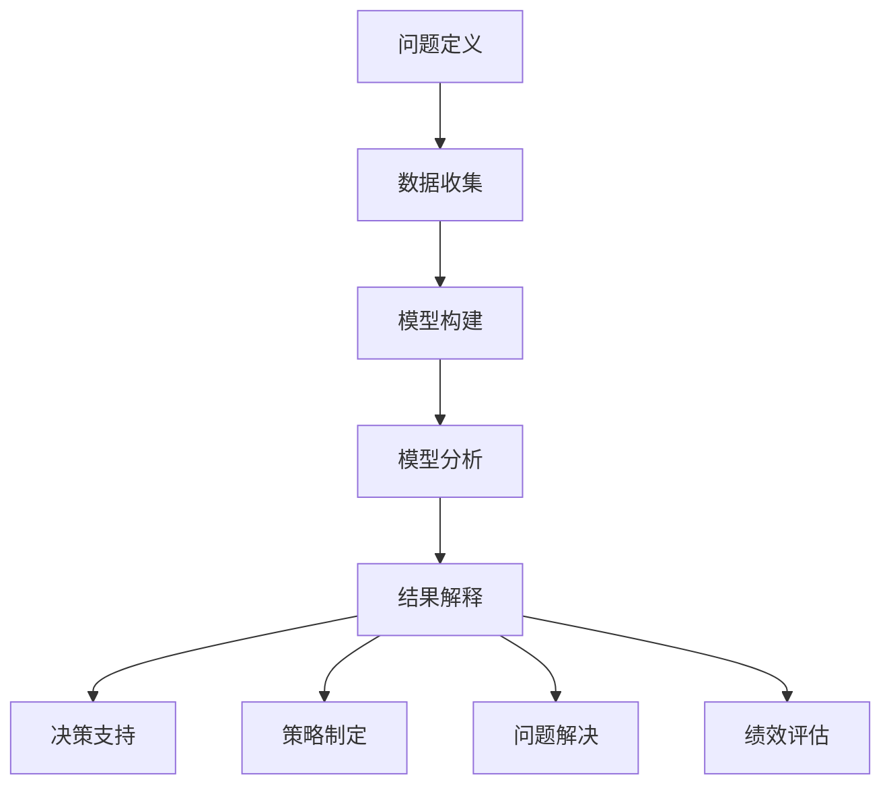

                 

关键词：模型思维、管理、实际应用、策略优化、问题解决

> 摘要：本文旨在探讨模型思维在企业管理中的实际应用。通过介绍模型思维的基本概念，阐述其在决策、策略制定和问题解决中的重要性，并分享一些实用的方法和技巧，帮助企业管理者更有效地应对复杂的管理挑战。

## 1. 背景介绍

在信息爆炸和技术迅速发展的时代，企业管理面临着前所未有的复杂性。无论是市场竞争、资源分配，还是团队协作和员工管理，都需要管理者具备更高的智慧和前瞻性。传统的经验管理和直觉决策已经无法满足现代企业对高效和精准的要求。因此，模型思维作为一种系统化的分析方法和工具，逐渐受到重视。

模型思维，又称模型构建思维，是指通过构建和分析模型来理解和解决问题的一种思维方式。它不仅帮助管理者从复杂的现象中抽象出关键因素，还能提供量化的分析和预测，为决策提供有力支持。

## 2. 核心概念与联系

### 2.1 模型思维的定义

模型思维是一种通过构建和分析抽象模型来理解和解决问题的方法论。它包括以下几个关键步骤：

1. **问题定义**：明确需要解决的问题或目标。
2. **数据收集**：收集与问题相关的数据和信息。
3. **模型构建**：根据问题特点构建相应的数学或逻辑模型。
4. **模型分析**：利用模型进行模拟、预测和优化。
5. **结果解释**：根据分析结果提出解决方案或决策。

### 2.2 模型思维的应用场景

模型思维在企业管理中的应用场景非常广泛，以下是一些典型例子：

1. **决策支持**：在市场分析、资源配置和风险管理等方面，通过模型分析提供决策依据。
2. **策略制定**：利用模型预测市场趋势和竞争对手行为，为企业制定长期和短期策略。
3. **问题解决**：通过模型分析和优化，解决生产和运营中的瓶颈问题。
4. **绩效评估**：利用模型进行员工绩效评估和团队协作分析，优化人力资源管理。

### 2.3 Mermaid 流程图



## 3. 核心算法原理 & 具体操作步骤

### 3.1 算法原理概述

模型思维的核心在于构建和分析模型，而模型构建的方法有很多，包括统计模型、决策树、神经网络等。以下是几种常见的模型构建方法及其基本原理：

1. **统计模型**：通过数据分析和统计分析方法，建立变量之间的关系模型。如线性回归、逻辑回归等。
2. **决策树**：基于树形结构，通过一系列规则对数据进行分类或回归。其优点是易于理解和解释。
3. **神经网络**：模拟人脑神经元的工作方式，通过多层网络进行数据特征提取和分类。其优点是处理复杂数据和模式识别能力强。

### 3.2 算法步骤详解

1. **问题定义**：明确需要解决的问题或目标，如市场预测、成本优化等。
2. **数据收集**：收集与问题相关的数据，如历史销售数据、市场趋势数据等。
3. **数据预处理**：清洗和标准化数据，以消除噪声和提高数据质量。
4. **模型选择**：根据问题特点和数据特征，选择合适的模型类型。
5. **模型训练**：利用训练数据对模型进行训练，调整模型参数。
6. **模型验证**：利用验证数据测试模型性能，调整模型参数。
7. **模型应用**：将训练好的模型应用于实际问题，进行预测或决策。

### 3.3 算法优缺点

**统计模型**：
- 优点：简单易懂，适用于线性关系问题。
- 缺点：对非线性关系和复杂数据的处理能力较差。

**决策树**：
- 优点：易于理解和解释，可以处理非线性关系。
- 缺点：可能产生过拟合，对大样本数据的处理能力有限。

**神经网络**：
- 优点：强大的非线性处理能力，适用于复杂数据和模式识别问题。
- 缺点：训练过程复杂，对数据质量和特征工程要求较高。

### 3.4 算法应用领域

模型思维在企业管理中的应用领域非常广泛，以下是一些具体的应用：

1. **市场预测**：通过建立市场趋势预测模型，帮助企业制定市场策略。
2. **成本优化**：通过优化模型降低生产和运营成本，提高企业竞争力。
3. **风险管理**：通过风险模型评估和管理企业风险，确保企业安全运营。
4. **人力资源管理**：通过员工绩效评估模型，优化人力资源配置和员工激励。

## 4. 数学模型和公式 & 详细讲解 & 举例说明

### 4.1 数学模型构建

在企业管理中，常见的数学模型包括线性回归模型、决策树模型和神经网络模型等。以下是这些模型的构建方法：

#### 线性回归模型

线性回归模型的基本形式为：

\[ y = \beta_0 + \beta_1x + \epsilon \]

其中，\( y \) 是因变量，\( x \) 是自变量，\( \beta_0 \) 和 \( \beta_1 \) 是模型参数，\( \epsilon \) 是误差项。

#### 决策树模型

决策树模型基于树形结构，每个节点表示一个决策点，每个分支表示一个决策结果。其基本形式为：

\[ T = \sum_{i=1}^{n} w_i \cdot t_i \]

其中，\( T \) 是决策结果，\( w_i \) 是权重，\( t_i \) 是特征值。

#### 神经网络模型

神经网络模型的基本形式为：

\[ y = \sigma(\theta^T \cdot x) \]

其中，\( y \) 是输出值，\( \sigma \) 是激活函数，\( \theta \) 是权重矩阵，\( x \) 是输入向量。

### 4.2 公式推导过程

以线性回归模型为例，其公式推导过程如下：

1. **目标函数**：

\[ J(\theta) = \frac{1}{2m} \sum_{i=1}^{m} (h_\theta(x^{(i)}) - y^{(i)})^2 \]

其中，\( m \) 是训练样本数量，\( h_\theta(x) \) 是线性回归模型的预测函数。

2. **梯度下降**：

\[ \theta_j := \theta_j - \alpha \frac{\partial J(\theta)}{\partial \theta_j} \]

其中，\( \alpha \) 是学习率。

### 4.3 案例分析与讲解

以下是一个市场预测的案例：

**问题**：预测某品牌手机在下一季度的销售额。

**数据**：历史销售数据、市场趋势数据、竞争对手信息等。

**模型**：线性回归模型。

**步骤**：

1. **数据收集**：收集相关数据，如历史销售额、市场需求量等。
2. **数据预处理**：清洗和标准化数据。
3. **模型构建**：根据数据特征，选择线性回归模型。
4. **模型训练**：利用训练数据训练模型，调整模型参数。
5. **模型验证**：利用验证数据测试模型性能。
6. **模型应用**：根据模型预测下一季度的销售额。

## 5. 项目实践：代码实例和详细解释说明

### 5.1 开发环境搭建

- **Python**：安装 Python 3.8 以上版本。
- **NumPy**：安装 NumPy 库。
- **Pandas**：安装 Pandas 库。
- **Scikit-learn**：安装 Scikit-learn 库。

### 5.2 源代码详细实现

以下是一个基于线性回归模型的市场预测项目代码实例：

```python
import numpy as np
import pandas as pd
from sklearn.linear_model import LinearRegression
from sklearn.model_selection import train_test_split

# 1. 数据收集
data = pd.read_csv('sales_data.csv')
X = data[['market_demand']]
y = data['sales']

# 2. 数据预处理
X = X.values
y = y.values

# 3. 模型构建
model = LinearRegression()

# 4. 模型训练
X_train, X_test, y_train, y_test = train_test_split(X, y, test_size=0.2, random_state=42)
model.fit(X_train, y_train)

# 5. 模型验证
score = model.score(X_test, y_test)
print('Model accuracy:', score)

# 6. 模型应用
next_quarter_demand = np.array([[next_quarter_demand]])
predicted_sales = model.predict(next_quarter_demand)
print('Predicted sales:', predicted_sales)
```

### 5.3 代码解读与分析

- **数据收集**：从 CSV 文件中读取销售数据。
- **数据预处理**：将数据分为特征和标签。
- **模型构建**：选择线性回归模型。
- **模型训练**：训练模型参数。
- **模型验证**：评估模型性能。
- **模型应用**：预测下一季度的销售额。

## 6. 实际应用场景

### 6.1 市场预测

通过模型思维，企业可以更准确地预测市场趋势，制定相应的营销策略，提高市场竞争力。

### 6.2 成本优化

利用模型分析，企业可以优化生产流程和资源配置，降低成本，提高盈利能力。

### 6.3 风险管理

通过模型分析，企业可以评估和管理各类风险，确保企业运营的安全和稳定。

### 6.4 人力资源管理

利用模型进行员工绩效评估和团队协作分析，优化人力资源管理和员工激励。

## 7. 工具和资源推荐

### 7.1 学习资源推荐

- **《模型思维：理解复杂系统的指南》**：一本介绍模型思维的入门书籍。
- **《Python 数据科学手册》**：一本关于数据科学和机器学习的经典教材。

### 7.2 开发工具推荐

- **PyCharm**：一款功能强大的 Python 集成开发环境。
- **Jupyter Notebook**：一款支持多种编程语言的交互式开发环境。

### 7.3 相关论文推荐

- **《线性回归模型的优化算法》**：一篇关于线性回归模型优化算法的论文。
- **《基于深度学习的市场预测方法》**：一篇关于深度学习在市场预测中的应用论文。

## 8. 总结：未来发展趋势与挑战

### 8.1 研究成果总结

本文介绍了模型思维在企业管理中的实际应用，包括决策支持、策略制定和问题解决等方面。通过数学模型和算法的构建，模型思维为企业提供了量化的分析和预测工具，提高了管理效率和决策质量。

### 8.2 未来发展趋势

随着人工智能和大数据技术的发展，模型思维在企业管理中的应用前景将更加广阔。未来的研究方向包括模型的可解释性、实时性和多维度数据融合等。

### 8.3 面临的挑战

模型思维在企业管理中面临的主要挑战包括数据质量、模型复杂度和应用成本等方面。如何提高数据质量，简化模型构建过程，降低应用成本，是未来研究的重要方向。

### 8.4 研究展望

未来，模型思维将在更多领域得到应用，如供应链管理、客户关系管理和金融风险管理等。通过不断优化和拓展模型思维的方法和技术，企业将能够更好地应对复杂的管理挑战，实现持续发展和竞争优势。

## 9. 附录：常见问题与解答

### Q：模型思维与数据驱动决策有什么区别？

A：模型思维和数据驱动决策都是基于数据和模型的方法，但有所区别。模型思维更侧重于构建和分析模型，通过模型提供量化的分析和预测；而数据驱动决策更侧重于利用数据直接指导决策，强调数据的实际应用价值。

### Q：如何选择合适的模型？

A：选择合适的模型需要考虑问题类型、数据特征和计算资源等因素。通常，可以通过以下步骤进行模型选择：

1. **理解问题**：明确问题的目标和数据特征。
2. **评估模型类型**：根据问题类型和数据特征，选择合适的模型类型。
3. **模型评估**：利用验证数据评估模型性能，选择性能较好的模型。
4. **模型调整**：根据模型评估结果，调整模型参数，优化模型性能。

### Q：如何提高模型的可解释性？

A：提高模型的可解释性是模型思维应用中的一个重要挑战。以下是一些方法：

1. **简化模型**：选择结构简单、易于解释的模型。
2. **特征工程**：选择有意义的特征，提高模型的解释性。
3. **可视化**：利用可视化工具展示模型结构和决策过程。
4. **模型解释库**：使用专门的模型解释库，如 LIME、SHAP 等，对模型进行解释。

---

作者：禅与计算机程序设计艺术 / Zen and the Art of Computer Programming

本文旨在探讨模型思维在企业管理中的实际应用，通过介绍模型思维的基本概念、核心算法原理和具体操作步骤，以及数学模型和公式的详细讲解，帮助企业管理者更好地理解和应用模型思维。同时，通过项目实践和实际应用场景的分享，展示了模型思维在企业管理中的广泛应用和巨大潜力。未来，随着人工智能和大数据技术的发展，模型思维将在企业管理中发挥更加重要的作用，为企业提供更加精准和高效的决策支持。希望本文能为企业管理者提供一些有益的启示和借鉴。

