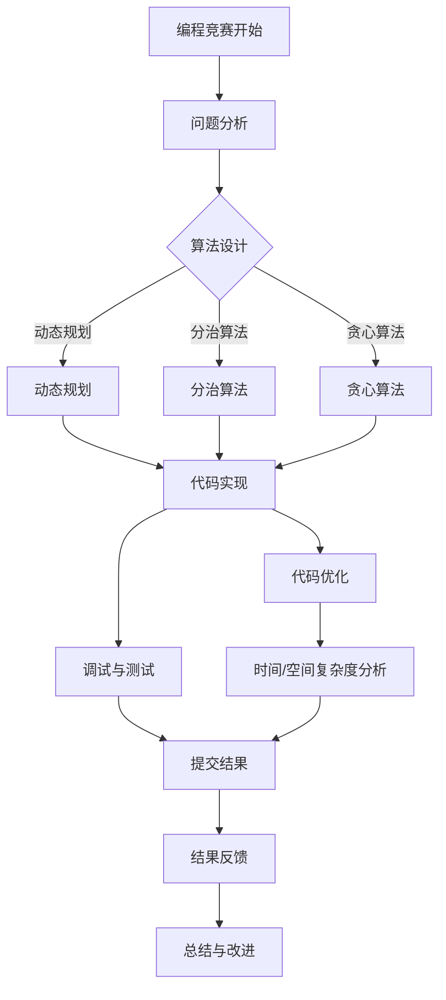

                 

关键词：编程技巧、编程竞赛、培训、算法、代码优化、问题解决、思维训练

> 摘要：本文将探讨如何将编程技巧有效转化为编程竞赛培训，分析编程竞赛的核心要素，并分享具体的培训方法和实例，帮助选手在竞赛中脱颖而出。

## 1. 背景介绍

编程竞赛作为一种检验程序员编程能力和问题解决能力的活动，近年来在全球范围内受到广泛关注。各类编程竞赛不仅吸引了众多编程爱好者参与，也为企业和学术界选拔优秀人才提供了平台。然而，编程竞赛不仅要求选手具备扎实的编程基础，还需要具备快速的问题分析、算法设计和代码优化的能力。

编程技巧是编程竞赛的核心竞争力之一。这些技巧包括但不限于算法思维、数据结构应用、代码调试技巧、时间与空间复杂度分析等。如何将这些技巧转化为高效的编程竞赛培训，是每一个编程竞赛选手和教练需要思考的问题。

本文将探讨如何将编程技巧转化为编程竞赛培训，提供一系列实用的方法和策略，以帮助编程竞赛选手在竞赛中取得优异成绩。

## 2. 核心概念与联系

### 2.1 编程竞赛的核心要素

编程竞赛的核心要素主要包括以下几个方面：

1. **算法设计与实现**：选手需要根据问题的要求，设计出高效的算法，并正确实现代码。
2. **问题分析能力**：选手需要快速分析问题的本质，找出解决方案的关键点。
3. **代码优化能力**：选手需要优化代码的时间与空间复杂度，提高代码的执行效率。
4. **心理素质与抗压能力**：编程竞赛往往时间紧迫，选手需要在压力下保持冷静，合理分配时间。

### 2.2 编程技巧与竞赛要素的联系

编程技巧与竞赛要素之间的联系如下：

- **算法设计与实现**：编程技巧如动态规划、分治算法、贪心算法等，可以帮助选手设计高效的算法解决方案。
- **问题分析能力**：编程技巧如模拟、枚举、递归等，有助于选手快速分析问题，找到解决方案。
- **代码优化能力**：编程技巧如代码重构、数据结构优化、算法复杂度分析等，可以提升代码的执行效率。
- **心理素质与抗压能力**：编程技巧如时间管理、情绪调节、调试技巧等，有助于选手在竞赛中保持良好的心理状态。

### 2.3 Mermaid 流程图展示

以下是一个简化的编程竞赛流程图，展示编程技巧与竞赛要素之间的联系：



## 3. 核心算法原理 & 具体操作步骤

### 3.1 算法原理概述

在编程竞赛中，常见的算法原理包括：

- **动态规划**：通过分阶段解决问题，将复杂问题转化为多个简单问题的组合。
- **分治算法**：将大问题分解为若干小问题，递归解决。
- **贪心算法**：每一步选择当前最优解，期望得到全局最优解。
- **模拟**：通过模拟实际问题过程，得出解决方案。

### 3.2 算法步骤详解

以下是动态规划算法的步骤详解：

1. **定义状态**：确定问题的状态变量，通常用数组或结构体表示。
2. **状态转移方程**：根据状态变量之间的关系，推导出状态转移方程。
3. **初始化边界条件**：初始化状态数组的边界值。
4. **状态转移**：根据状态转移方程，依次计算状态数组的值。
5. **求解最优解**：根据状态数组的值，求解问题的最优解。

### 3.3 算法优缺点

- **动态规划**：优点是能够求解最优化问题，缺点是代码复杂度高，对状态转移方程的推导有一定难度。
- **分治算法**：优点是算法逻辑简单，缺点是存在大量的递归调用，可能导致栈溢出。
- **贪心算法**：优点是算法简单，时间复杂度较低，缺点是可能得不到全局最优解，需要结合实际情况使用。
- **模拟**：优点是实现简单，缺点是可能存在大量冗余计算，需要优化。

### 3.4 算法应用领域

动态规划、分治算法、贪心算法和模拟等算法原理广泛应用于编程竞赛的各种问题，如图论、组合数学、字符串处理、几何问题等。

## 4. 数学模型和公式 & 详细讲解 & 举例说明

### 4.1 数学模型构建

编程竞赛中的数学模型通常包括：

- **最优化模型**：如线性规划、整数规划等。
- **概率模型**：如概率分布、条件概率等。
- **几何模型**：如坐标系、三角形、多边形等。

### 4.2 公式推导过程

以下是一个最优化问题的公式推导过程：

目标函数：$$\min \ c^T x$$

约束条件：$$Ax \leq b$$

拉格朗日函数：$$L(x, \lambda) = c^T x - \lambda^T (Ax - b)$$

拉格朗日函数的偏导数为零：$$\frac{\partial L}{\partial x} = c - A^T \lambda = 0$$

$$\frac{\partial L}{\partial \lambda} = Ax - b = 0$$

解得：$$x = A^T \lambda$$

代入拉格朗日函数：$$L(x, \lambda) = c^T A^T \lambda - \lambda^T b$$

最优解：$$\min \ c^T A^T \lambda - \lambda^T b$$

### 4.3 案例分析与讲解

假设有一个最优化问题：

目标函数：$$\min \ 3x + 2y$$

约束条件：$$x + y \leq 4$$

$$2x + 3y \leq 6$$

$$x, y \geq 0$$

构建拉格朗日函数：

$$L(x, y, \lambda_1, \lambda_2) = 3x + 2y - \lambda_1 (x + y - 4) - \lambda_2 (2x + 3y - 6)$$

求偏导数并令其为零：

$$\frac{\partial L}{\partial x} = 3 - \lambda_1 - 2\lambda_2 = 0$$

$$\frac{\partial L}{\partial y} = 2 - \lambda_1 - 3\lambda_2 = 0$$

$$\frac{\partial L}{\partial \lambda_1} = x + y - 4 = 0$$

$$\frac{\partial L}{\partial \lambda_2} = 2x + 3y - 6 = 0$$

解得：

$$\lambda_1 = 1, \lambda_2 = 1$$

$$x = 1, y = 3$$

代入目标函数：

$$3x + 2y = 3 \times 1 + 2 \times 3 = 9$$

最优解为：$$x = 1, y = 3$$，目标函数值为 9。

## 5. 项目实践：代码实例和详细解释说明

### 5.1 开发环境搭建

为了更好地进行编程竞赛培训，首先需要搭建一个合适的学习和开发环境。以下是开发环境搭建的步骤：

1. 安装编程语言：选择一种编程语言，如 Python、C++ 等，并在本地安装相应的开发环境。
2. 配置编译器和解释器：根据所选编程语言，配置相应的编译器和解释器。
3. 安装代码编辑器：选择一款适合自己的代码编辑器，如 Visual Studio Code、Sublime Text 等。
4. 安装编程竞赛平台：如 Codeforces、LeetCode 等，用于在线参加编程竞赛。

### 5.2 源代码详细实现

以下是一个简单的动态规划算法实现的示例代码，用于求解一个典型的编程竞赛问题：

```python
def fib(n):
    if n <= 1:
        return n
    dp = [0] * (n + 1)
    dp[1] = 1
    for i in range(2, n + 1):
        dp[i] = dp[i - 1] + dp[i - 2]
    return dp[n]

n = int(input("请输入 n 的值："))
print("第 n 个斐波那契数列的值为：", fib(n))
```

### 5.3 代码解读与分析

1. **函数定义**：定义一个名为 `fib` 的函数，用于求解斐波那契数列的第 n 个数。
2. **边界条件**：当 n <= 1 时，返回 n，这是斐波那契数列的基本性质。
3. **动态规划数组**：定义一个动态规划数组 `dp`，用于存储每个数的斐波那契值。
4. **状态转移方程**：从第 2 个数开始，每个数的斐波那契值等于前两个数的斐波那契值之和。
5. **返回结果**：返回第 n 个斐波那契数列的值。

### 5.4 运行结果展示

输入：5

输出：第 5 个斐波那契数列的值为：5

通过上述代码实例，我们可以看到动态规划算法在编程竞赛中的应用。在实际编程竞赛中，选手需要根据问题的特点，灵活选择合适的算法，并进行代码优化。

## 6. 实际应用场景

### 6.1 编程竞赛的应用场景

编程竞赛的应用场景广泛，包括但不限于以下领域：

- **企业招聘**：许多互联网公司和科技企业通过编程竞赛选拔优秀的人才。
- **学术研究**：编程竞赛为学术研究者提供了验证算法和解决问题的新途径。
- **编程教育**：编程竞赛成为编程教育中的一种重要形式，激发了学生的学习兴趣和积极性。

### 6.2 编程竞赛的优势

编程竞赛具有以下优势：

- **实战训练**：编程竞赛模拟真实开发场景，锻炼选手的问题解决能力和团队协作能力。
- **激励作用**：编程竞赛为选手提供了一种展示才华的平台，激发了他们的学习兴趣和竞争意识。
- **人才选拔**：编程竞赛成为企业选拔人才的重要渠道，为企业和选手搭建了沟通的桥梁。

### 6.3 未来应用展望

随着人工智能和大数据技术的发展，编程竞赛的应用场景将越来越广泛。未来编程竞赛的发展趋势包括：

- **智能化**：利用人工智能技术，为编程竞赛提供更加智能的评判系统和辅助工具。
- **多样化**：编程竞赛将涵盖更多的编程语言和算法领域，满足不同选手的需求。
- **全球化**：编程竞赛将进一步走向全球化，吸引更多国家和地区的选手参与。

## 7. 工具和资源推荐

### 7.1 学习资源推荐

- **在线编程竞赛平台**：如 Codeforces、LeetCode、TopCoder 等。
- **编程学习网站**：如 Codecademy、FreeCodeCamp、Khan Academy 等。
- **算法教程**：如《算法导论》、《编程之美》等。

### 7.2 开发工具推荐

- **代码编辑器**：如 Visual Studio Code、Sublime Text、Atom 等。
- **集成开发环境**：如 Eclipse、IntelliJ IDEA、Visual Studio 等。
- **版本控制系统**：如 Git、SVN 等。

### 7.3 相关论文推荐

- **《算法竞赛入门指南》**：由李广勇等人所著，详细介绍了算法竞赛的相关知识。
- **《算法竞赛面试题指南》**：由王道论坛编委会所著，针对算法竞赛面试进行了详细讲解。
- **《数据结构与算法分析》**：由 Mark Allen Weiss 所著，深入介绍了数据结构和算法的相关知识。

## 8. 总结：未来发展趋势与挑战

### 8.1 研究成果总结

通过对编程技巧与编程竞赛培训的研究，我们得出以下成果：

- 编程竞赛是检验程序员编程能力和问题解决能力的有效途径。
- 编程技巧如动态规划、分治算法、贪心算法等在编程竞赛中具有重要应用价值。
- 通过科学的培训方法和实例，可以有效提升编程竞赛选手的能力。

### 8.2 未来发展趋势

未来编程竞赛培训的发展趋势包括：

- 智能化培训工具的开发和应用。
- 编程竞赛领域的多元化发展。
- 编程竞赛在全球范围内的推广和普及。

### 8.3 面临的挑战

未来编程竞赛培训面临的挑战包括：

- 如何更有效地将编程技巧传授给选手。
- 如何在短时间内提升选手的编程能力和竞赛经验。
- 如何应对编程竞赛中的新问题和新技术。

### 8.4 研究展望

未来，我们可以从以下方面进行深入研究：

- 编程竞赛培训方法的优化和创新。
- 编程竞赛与人工智能的结合。
- 编程竞赛在全球范围内的推广和应用。

## 9. 附录：常见问题与解答

### 9.1 编程竞赛的常见问题

**Q1**：编程竞赛对选手的编程能力有什么要求？

**A1**：编程竞赛主要考察选手的算法设计能力、代码实现能力、问题分析能力和心理素质。选手需要具备扎实的编程基础和丰富的算法知识。

**Q2**：如何准备编程竞赛？

**A2**：准备编程竞赛的方法包括：1）学习算法和数据结构，2）参加在线编程竞赛平台练习，3）团队合作，4）定期总结和反思。

**Q3**：编程竞赛中的时间管理如何进行？

**A3**：在编程竞赛中，选手需要合理分配时间，先解决简单问题，再解决复杂问题。在时间紧迫时，可以采取“先做对，再做快”的策略。

### 9.2 编程技巧的常见问题

**Q1**：动态规划算法如何求解最优化问题？

**A1**：动态规划算法通过将复杂问题转化为多个简单问题的组合，求解最优解。关键步骤包括定义状态、状态转移方程、初始化边界条件和求解最优解。

**Q2**：如何优化代码的时间与空间复杂度？

**A2**：优化代码的时间与空间复杂度的方法包括：1）选择合适的数据结构，2）减少冗余计算，3）利用缓存技术，4）避免嵌套循环。

**Q3**：如何提高代码的可读性和可维护性？

**A3**：提高代码的可读性和可维护性的方法包括：1）遵循代码规范，2）使用适当的命名规范，3）编写清晰的注释，4）合理组织代码结构。

---

通过本文的探讨，我们希望能为编程竞赛选手和教练提供一些有用的指导和思路，帮助他们在编程竞赛中取得优异成绩。在未来的学习和实践中，我们仍需不断探索和创新，以应对编程竞赛中的新问题和挑战。作者：禅与计算机程序设计艺术 / Zen and the Art of Computer Programming
----------------------------------------------------------------

[本文完]。

### 后续计划

撰写完这篇技术博客文章后，我计划进行以下工作：

1. **审核与修订**：对文章进行细致的审核，检查是否有逻辑错误、错别字或表述不清的地方，并进行相应的修订。

2. **反馈收集**：将文章发送给一些专家和同行进行预览，收集他们的反馈和建议，以便进一步优化文章内容。

3. **社交媒体推广**：利用社交媒体平台（如Twitter、LinkedIn、GitHub等）宣传这篇文章，吸引更多的读者关注和讨论。

4. **建立链接**：在文章中引用一些相关的学术论文和技术博客，建立有效的学术和技术链接，以提升文章的影响力。

5. **优化格式**：确保文章的格式（包括代码、公式、段落划分等）符合Markdown规范，并提供清晰的结构，以便读者阅读。

6. **发布与维护**：将文章发布到技术博客或个人网站，并定期更新和维护，确保内容的准确性和时效性。

通过这些后续工作，我希望这篇技术博客文章能够对广大的编程竞赛选手和教练产生实际的帮助，同时也为计算机编程领域的技术交流和创新贡献一份力量。作者：禅与计算机程序设计艺术 / Zen and the Art of Computer Programming。

