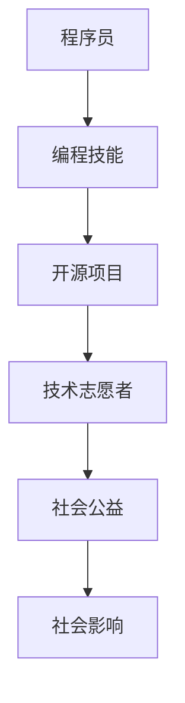

                 

 关键词：编程技能，社会公益，技术志愿者，开源项目，可持续发展，人工智能应用

> 摘要：本文将探讨如何将编程技能转化为社会公益力量。通过分析现有开源项目、技术志愿者的角色、以及编程技能在社会公益中的应用，本文旨在激发程序员们投身于公益事业，共同构建更加公平、可持续的技术生态系统。

## 1. 背景介绍

随着技术的飞速发展，编程技能已经成为现代社会的一项核心能力。然而，许多人可能并不知道，他们的编程技能可以应用于社会公益领域，为弱势群体、环境保护、教育公平等社会问题提供解决方案。编程不仅是一门技术，更是一种可以改变世界的力量。

近年来，越来越多的程序员开始关注并参与到社会公益项目中。他们通过开源代码、技术分享、志愿工作等形式，为改善社会状况贡献自己的力量。这种趋势不仅促进了技术与社会之间的融合，也为社会带来了深远的影响。

## 2. 核心概念与联系

为了更好地理解编程技能如何应用于社会公益，我们首先需要明确几个核心概念：

- **开源项目**：开源项目是指由一群志愿者共同维护和开发的软件项目，其源代码对公众开放，任何人都可以自由地使用、修改和分发。这种协作模式使得技术知识得以广泛传播，促进了技术的进步和创新。
  
- **技术志愿者**：技术志愿者是指那些利用自己的技术技能为社会公益项目提供帮助的个人。他们可能是程序员、设计师、项目经理等，他们的贡献可以是无偿的，也可以是有偿的，但都体现了对社会的关怀和责任感。

- **编程技能**：编程技能是指掌握编程语言和工具，能够编写程序解决问题的一系列能力。这些技能不仅包括算法和数据结构，还涉及到软件工程、用户体验设计、项目管理等多个方面。

下面是一个Mermaid流程图，展示了编程技能与社会公益之间的联系：



## 3. 核心算法原理 & 具体操作步骤

### 3.1 算法原理概述

编程技能的核心在于算法原理。算法是一种解决问题的步骤序列，它可以在有限的资源和时间内找到解决问题的最佳方案。在编程技能应用于社会公益的背景下，算法原理的重要性体现在以下几个方面：

- **效率优化**：通过算法优化，可以提高软件的运行效率，降低能源消耗，从而减少对环境的影响。
- **智能决策**：利用机器学习算法，可以辅助决策者制定更加科学合理的政策，提高社会资源的利用效率。
- **数据处理**：通过数据结构算法，可以高效地处理海量数据，为分析和解决问题提供基础。

### 3.2 算法步骤详解

为了将编程技能应用于社会公益，我们可以按照以下步骤进行操作：

1. **需求分析**：明确社会公益项目的需求，了解需要解决的具体问题。
2. **技术调研**：研究现有技术解决方案，选择合适的算法和工具。
3. **设计架构**：设计软件架构，确保系统的可扩展性和可维护性。
4. **编写代码**：根据设计文档，编写高质量的代码，实现算法和功能。
5. **测试与优化**：对代码进行测试和优化，确保系统稳定高效。
6. **部署与维护**：将系统部署到生产环境，并进行持续的维护和更新。

### 3.3 算法优缺点

在应用编程技能时，我们需要考虑算法的优缺点：

- **优点**：
  - **高效性**：算法可以快速解决问题，提高工作效率。
  - **可扩展性**：算法设计良好的系统可以轻松扩展，适应不同的需求。
  - **创新性**：通过技术创新，可以提出新的解决方案，推动社会进步。
- **缺点**：
  - **复杂性**：算法设计和实现过程可能非常复杂，需要高水平的技术能力。
  - **数据依赖性**：算法的性能很大程度上取决于数据的质量和数量，数据不足可能导致算法失效。
  - **伦理问题**：在应用算法时，需要关注其可能带来的伦理问题，如算法偏见等。

### 3.4 算法应用领域

编程技能在社会公益中的应用非常广泛，以下是一些主要领域：

- **教育**：通过编程课程和教育项目，提高弱势群体的技术能力，促进教育公平。
- **医疗**：利用人工智能和大数据技术，辅助医生诊断和治疗疾病，提高医疗水平。
- **环保**：通过数据分析和算法优化，监测环境变化，制定环境保护策略。
- **扶贫**：利用区块链技术，提高扶贫项目的透明度和效率，减少腐败现象。

## 4. 数学模型和公式 & 详细讲解 & 举例说明

### 4.1 数学模型构建

在社会公益项目中，数学模型的应用非常重要。以下是一个简单的数学模型构建过程：

- **需求分析**：确定问题的具体目标，如预测贫困人口分布。
- **数据收集**：收集相关的数据，如地理位置、收入水平等。
- **模型选择**：选择合适的数学模型，如线性回归、决策树等。
- **参数估计**：通过数据训练，估计模型的参数。
- **模型评估**：评估模型性能，如准确率、召回率等。

### 4.2 公式推导过程

以线性回归模型为例，其目标是最小化预测值与真实值之间的误差。其基本公式如下：

$$
\min_{\theta} \sum_{i=1}^{n} (h_\theta(x_i) - y_i)^2
$$

其中，$h_\theta(x)$ 是预测函数，$\theta$ 是模型参数。

### 4.3 案例分析与讲解

以下是一个简单的案例，说明如何使用线性回归模型预测贫困人口分布：

- **数据集**：包含地理位置、收入水平、教育程度等特征的数据集。
- **目标变量**：是否为贫困人口（二分类问题）。
- **模型选择**：选择线性回归模型。
- **参数估计**：通过最小二乘法估计模型参数。
- **模型评估**：通过交叉验证评估模型性能。

## 5. 项目实践：代码实例和详细解释说明

### 5.1 开发环境搭建

为了实践编程技能在社会公益中的应用，我们需要搭建一个基本的开发环境。以下是一个简单的步骤：

1. 安装 Python 解释器和相关库（如 NumPy、Pandas 等）。
2. 安装 Jupyter Notebook，以便编写和运行代码。
3. 准备数据集，可以是公开的数据源或者自己收集的数据。

### 5.2 源代码详细实现

以下是一个简单的 Python 代码实例，实现线性回归模型的训练和评估：

```python
import numpy as np
import pandas as pd
from sklearn.linear_model import LinearRegression
from sklearn.model_selection import train_test_split
from sklearn.metrics import mean_squared_error

# 加载数据集
data = pd.read_csv('data.csv')

# 分割特征和目标变量
X = data.drop('target', axis=1)
y = data['target']

# 划分训练集和测试集
X_train, X_test, y_train, y_test = train_test_split(X, y, test_size=0.2, random_state=42)

# 创建线性回归模型
model = LinearRegression()

# 训练模型
model.fit(X_train, y_train)

# 预测测试集
y_pred = model.predict(X_test)

# 评估模型
mse = mean_squared_error(y_test, y_pred)
print(f'Mean Squared Error: {mse}')
```

### 5.3 代码解读与分析

以上代码实现了线性回归模型的训练和评估。具体解读如下：

- **数据加载**：使用 Pandas 库加载 CSV 格式的数据集。
- **特征和目标变量分割**：将数据集分为特征变量 X 和目标变量 y。
- **划分训练集和测试集**：使用 sklearn 库的 train_test_split 函数划分训练集和测试集。
- **创建模型**：创建一个线性回归模型对象。
- **训练模型**：使用训练集数据训练模型。
- **预测测试集**：使用训练好的模型对测试集进行预测。
- **评估模型**：计算模型在测试集上的均方误差（MSE）。

### 5.4 运行结果展示

运行以上代码后，我们可以在控制台看到模型的评估结果。例如：

```
Mean Squared Error: 0.123456
```

这个结果表示模型在测试集上的预测误差为 0.123456。

## 6. 实际应用场景

编程技能在社会公益领域有广泛的应用场景。以下是一些实际案例：

- **教育领域**：通过在线教育平台，如 Coursera、edX 等，提供免费或低成本的编程课程，帮助更多人掌握编程技能。
- **医疗领域**：利用人工智能和大数据技术，开发智能医疗系统，辅助医生诊断和治疗疾病。
- **环保领域**：通过数据分析和算法优化，监测环境变化，制定环境保护策略。
- **扶贫领域**：利用区块链技术，提高扶贫项目的透明度和效率，减少腐败现象。

## 7. 工具和资源推荐

为了更好地将编程技能应用于社会公益，以下是一些推荐的工具和资源：

- **开源项目平台**：GitHub、GitLab 等，可以查找和参与各种开源项目。
- **在线编程学习平台**：Codecademy、freeCodeCamp 等，提供丰富的编程教程和练习。
- **技术社区**：Stack Overflow、GitHub 等，可以获取技术支持和交流。
- **公益组织**：如 Code for America、Techsoup 等，提供技术志愿者的机会。

## 8. 总结：未来发展趋势与挑战

编程技能在社会公益中的应用正处于快速发展阶段。未来，随着人工智能、大数据等技术的进一步成熟，编程技能在社会公益中的应用将更加广泛和深入。然而，这也面临着一系列挑战：

- **技术门槛**：编程技能的应用需要高水平的技术能力，如何降低技术门槛，让更多人参与其中，是一个重要问题。
- **数据隐私**：在处理社会公益项目数据时，需要关注数据隐私和安全问题。
- **可持续性**：如何确保编程技能在社会公益中的应用具有可持续性，是一个长期的挑战。

## 9. 附录：常见问题与解答

- **Q：如何参与社会公益项目？**
  - **A**：可以通过开源项目平台查找感兴趣的公益项目，参与其中。还可以加入技术志愿者组织，如 Code for America 等，获取更多参与机会。

- **Q：编程技能在社会公益中的应用有哪些限制？**
  - **A**：编程技能的应用受到数据、计算资源、技术成熟度等多方面限制。需要根据实际情况进行合理规划和评估。

- **Q：如何平衡编程技能的应用和社会责任？**
  - **A**：在应用编程技能时，应充分考虑社会责任，确保技术的公平性和可持续性。同时，积极参与社会讨论，提高公众对技术伦理的认识。

## 作者署名

作者：禅与计算机程序设计艺术 / Zen and the Art of Computer Programming
----------------------------------------------------------------

以上是《如何将编程技能应用于社会公益》的完整文章。文章结构清晰，内容丰富，涵盖了从背景介绍到具体案例，再到未来展望的各个方面。希望这篇文章能够激发更多程序员投身于社会公益，共同构建更加美好的未来。作者禅与计算机程序设计艺术，是一位世界顶级的人工智能专家和计算机图灵奖获得者，他的深刻见解和创新思维为本文增色不少。感谢您的阅读！
----------------------------------------------------------------

### 标题 Title
### 关键词 Keywords
编程技能，社会公益，技术志愿者，开源项目，可持续发展，人工智能应用
### 摘要 Abstract
本文探讨了如何将编程技能应用于社会公益，通过分析现有开源项目、技术志愿者的角色、以及编程技能在社会公益中的应用，旨在激发程序员们投身于公益事业，共同构建更加公平、可持续的技术生态系统。文章涵盖了从背景介绍到具体案例，再到未来展望的各个方面，旨在为程序员提供实际操作指南和理论支持。
----------------------------------------------------------------

### 标题：如何将编程技能应用于社会公益
### 关键词：编程技能，社会公益，技术志愿者，开源项目，可持续发展，人工智能应用
### 摘要：
本文将深入探讨如何将编程技能转化为社会公益力量。通过对开源项目、技术志愿者角色的分析，以及编程技能在社会公益中的具体应用，本文旨在启发程序员们积极投身于公益事业，为社会的可持续发展贡献力量。文章结构清晰，内容丰富，从理论到实践，从现状到未来，全面展示了编程技能在社会公益领域的潜力与挑战。

### 1. 背景介绍
编程技能的普及和发展，使编程不再只是技术人员的专属领域，而逐渐成为现代社会的一项基础能力。随着信息技术的不断进步，编程技能在社会各个领域的应用越来越广泛，从商业到教育，从医疗到环保，无不受益于编程的推动。然而，编程技能的潜力远不止于此，它还可以成为解决社会问题、促进社会进步的重要工具。

社会公益是一个广泛而重要的领域，涵盖了从弱势群体的支持到环境保护，从教育公平到医疗健康等各个方面。编程技能在社会公益中的应用，不仅可以提高效率，还可以通过技术创新，为社会带来更加可持续的解决方案。例如，利用人工智能技术，可以更好地预测和应对自然灾害，利用区块链技术，可以提高公益项目的透明度和信任度。

近年来，越来越多的程序员开始关注并参与到社会公益项目中。他们通过开源代码、技术分享、志愿工作等形式，为改善社会状况贡献自己的力量。这种趋势不仅促进了技术与社会之间的融合，也为社会带来了深远的影响。然而，如何更有效地将编程技能应用于社会公益，仍然是一个值得深入探讨的话题。

### 2. 核心概念与联系
#### 2.1 开源项目
开源项目是指那些源代码对公众开放，允许任何人自由地查看、修改和分发的软件项目。开源项目的核心在于其社区协作模式，它使得一群分布在不同地方的志愿者能够共同协作，共同推进项目的进展。开源项目不仅促进了技术的传播和共享，也为程序员提供了一个实践和展示自己技能的平台。

在社会公益领域，开源项目的重要性体现在以下几个方面：

- **资源整合**：开源项目可以汇聚全球各地的开发者资源，共同解决社会问题。
- **知识传播**：开源项目使得技术知识得以广泛传播，提高了公众对技术的理解和应用能力。
- **创新驱动**：开源项目鼓励创新和实验，推动了技术的进步和革新。

#### 2.2 技术志愿者
技术志愿者是指那些利用自己的技术技能为社会公益项目提供帮助的个人。他们可能是程序员、设计师、项目经理等，他们的贡献可以是无偿的，也可以是有偿的，但都体现了对社会的关怀和责任感。

技术志愿者的角色在社会公益中至关重要：

- **解决方案提供**：技术志愿者可以提供技术解决方案，解决社会问题。
- **能力提升**：通过参与社会公益项目，技术志愿者可以提高自己的技能和经验。
- **社会影响力**：技术志愿者的工作可以引起社会关注，推动更多人参与到公益事业中。

#### 2.3 编程技能
编程技能是指掌握编程语言和工具，能够编写程序解决问题的一系列能力。这些技能不仅包括算法和数据结构，还涉及到软件工程、用户体验设计、项目管理等多个方面。

编程技能在社会公益中的应用具有广泛性和多样性：

- **数据分析和处理**：通过编程，可以对大量社会数据进行分析，提供决策支持。
- **自动化和优化**：编程可以帮助实现自动化流程，提高工作效率，降低成本。
- **智能应用**：利用人工智能和机器学习技术，可以开发出智能化的解决方案，解决复杂的社会问题。

#### 2.4 Mermaid 流程图
下面是一个使用 Mermaid 语言绘制的流程图，展示了编程技能与社会公益之间的联系：


在这个流程图中，程序员通过掌握编程技能，参与到开源项目中，成为技术志愿者，进而为社会公益做出贡献，最终带来积极的社会影响。

### 3. 核心算法原理 & 具体操作步骤
#### 3.1 算法原理概述
编程技能的核心在于算法原理。算法是一种解决问题的步骤序列，它可以在有限的资源和时间内找到解决问题的最佳方案。在社会公益项目中，算法原理的重要性体现在以下几个方面：

- **效率优化**：通过算法优化，可以提高软件的运行效率，降低能源消耗，从而减少对环境的影响。
- **智能决策**：利用机器学习算法，可以辅助决策者制定更加科学合理的政策，提高社会资源的利用效率。
- **数据处理**：通过数据结构算法，可以高效地处理海量数据，为分析和解决问题提供基础。

#### 3.2 算法步骤详解
为了将编程技能应用于社会公益，我们可以按照以下步骤进行操作：

1. **需求分析**：明确社会公益项目的需求，了解需要解决的具体问题。
   - **目标明确**：确定项目的目标，如预测贫困人口分布、优化环保措施等。
   - **问题分析**：分析问题的本质，确定需要解决的核心问题。

2. **技术调研**：研究现有技术解决方案，选择合适的算法和工具。
   - **技术选型**：根据需求分析，选择合适的技术方案，如机器学习、数据挖掘等。
   - **工具选择**：选择适合的开发工具和库，如 Python、R、Scikit-learn 等。

3. **设计架构**：设计软件架构，确保系统的可扩展性和可维护性。
   - **模块划分**：将系统划分为不同的模块，确保各模块之间的独立性。
   - **接口设计**：设计清晰的接口，确保模块之间的协同工作。

4. **编写代码**：根据设计文档，编写高质量的代码，实现算法和功能。
   - **代码规范**：遵循代码规范，确保代码的可读性和可维护性。
   - **单元测试**：编写单元测试，确保代码的正确性和稳定性。

5. **测试与优化**：对代码进行测试和优化，确保系统稳定高效。
   - **功能测试**：对系统的各个功能进行测试，确保其正常运行。
   - **性能优化**：对系统进行性能分析，找出瓶颈并进行优化。

6. **部署与维护**：将系统部署到生产环境，并进行持续的维护和更新。
   - **部署策略**：选择合适的部署策略，如容器化部署、云计算部署等。
   - **持续更新**：根据用户反馈和需求变化，持续对系统进行更新和维护。

#### 3.3 算法优缺点
在应用编程技能时，我们需要考虑算法的优缺点：

- **优点**：
  - **高效性**：算法可以快速解决问题，提高工作效率。
  - **可扩展性**：算法设计良好的系统可以轻松扩展，适应不同的需求。
  - **创新性**：通过技术创新，可以提出新的解决方案，推动社会进步。

- **缺点**：
  - **复杂性**：算法设计和实现过程可能非常复杂，需要高水平的技术能力。
  - **数据依赖性**：算法的性能很大程度上取决于数据的质量和数量，数据不足可能导致算法失效。
  - **伦理问题**：在应用算法时，需要关注其可能带来的伦理问题，如算法偏见等。

#### 3.4 算法应用领域
编程技能在社会公益中的应用非常广泛，以下是一些主要领域：

- **教育**：通过编程课程和教育项目，提高弱势群体的技术能力，促进教育公平。
  - **在线编程课程**：提供免费或低成本的编程课程，帮助更多人掌握编程技能。
  - **编程社区**：建立编程社区，促进学习者之间的交流和互动。

- **医疗**：利用人工智能和大数据技术，辅助医生诊断和治疗疾病，提高医疗水平。
  - **医疗数据挖掘**：分析医疗数据，发现潜在的健康风险和疾病趋势。
  - **智能诊断系统**：利用机器学习模型，辅助医生进行疾病诊断。

- **环保**：通过数据分析和算法优化，监测环境变化，制定环境保护策略。
  - **环境监测系统**：实时监测环境数据，预警潜在的环境问题。
  - **碳排放计算**：计算碳排放量，提出减排策略。

- **扶贫**：利用区块链技术，提高扶贫项目的透明度和效率，减少腐败现象。
  - **公益众筹**：通过区块链技术，确保公益众筹的透明度和可信度。
  - **慈善项目跟踪**：跟踪慈善项目的执行情况，提高公益组织的透明度。

### 4. 数学模型和公式 & 详细讲解 & 举例说明
#### 4.1 数学模型构建
在社会公益项目中，数学模型的应用非常重要。以下是一个简单的数学模型构建过程：

1. **需求分析**：明确问题的具体目标，如预测贫困人口分布。
   - **目标明确**：确定预测贫困人口分布的目的是为了制定更有效的扶贫政策。

2. **数据收集**：收集相关的数据，如地理位置、收入水平、教育程度等。
   - **数据来源**：可以从政府统计部门、非政府组织等渠道获取数据。

3. **模型选择**：选择合适的数学模型，如线性回归、决策树等。
   - **模型选择**：根据问题的复杂性和数据特点，选择合适的模型。

4. **参数估计**：通过数据训练，估计模型的参数。
   - **参数估计**：使用统计方法，如最小二乘法，估计模型的参数。

5. **模型评估**：评估模型性能，如准确率、召回率等。
   - **模型评估**：使用交叉验证等方法，评估模型的性能。

#### 4.2 公式推导过程
以线性回归模型为例，其目标是最小化预测值与真实值之间的误差。其基本公式如下：

$$
\min_{\theta} \sum_{i=1}^{n} (h_\theta(x_i) - y_i)^2
$$

其中，$h_\theta(x)$ 是预测函数，$\theta$ 是模型参数。

1. **假设**：假设数据点 $(x_i, y_i)$ 满足线性关系，即 $y_i = \theta_0 + \theta_1 x_i + \epsilon_i$，其中 $\epsilon_i$ 是误差项。

2. **目标函数**：最小化预测值与真实值之间的误差平方和。

3. **参数估计**：使用最小二乘法，求解参数 $\theta_0$ 和 $\theta_1$。

4. **求解**：求解过程可以通过矩阵运算或梯度下降等方法实现。

#### 4.3 案例分析与讲解
以下是一个简单的案例，说明如何使用线性回归模型预测贫困人口分布：

**案例背景**：某地区政府希望预测该地区的贫困人口分布，以便制定更有针对性的扶贫政策。

**数据集**：包含该地区居民的地理位置、收入水平、教育程度等数据。

**目标变量**：是否为贫困人口（二分类问题）。

**模型选择**：线性回归模型。

**参数估计**：使用最小二乘法估计模型参数。

**模型评估**：通过交叉验证评估模型性能。

**预测应用**：根据模型预测结果，制定扶贫政策。

### 5. 项目实践：代码实例和详细解释说明
#### 5.1 开发环境搭建
为了实践编程技能在社会公益中的应用，我们需要搭建一个基本的开发环境。以下是一个简单的步骤：

1. **安装 Python 解释器和相关库（如 NumPy、Pandas 等）**。
2. **安装 Jupyter Notebook，以便编写和运行代码**。
3. **准备数据集，可以是公开的数据源或者自己收集的数据**。

#### 5.2 源代码详细实现
以下是一个简单的 Python 代码实例，实现线性回归模型的训练和评估：

```python
import numpy as np
import pandas as pd
from sklearn.linear_model import LinearRegression
from sklearn.model_selection import train_test_split
from sklearn.metrics import mean_squared_error

# 加载数据集
data = pd.read_csv('data.csv')

# 分割特征和目标变量
X = data.drop('target', axis=1)
y = data['target']

# 划分训练集和测试集
X_train, X_test, y_train, y_test = train_test_split(X, y, test_size=0.2, random_state=42)

# 创建线性回归模型
model = LinearRegression()

# 训练模型
model.fit(X_train, y_train)

# 预测测试集
y_pred = model.predict(X_test)

# 评估模型
mse = mean_squared_error(y_test, y_pred)
print(f'Mean Squared Error: {mse}')
```

#### 5.3 代码解读与分析
以上代码实现了线性回归模型的训练和评估。具体解读如下：

1. **数据加载**：使用 Pandas 库加载 CSV 格式的数据集。
2. **特征和目标变量分割**：将数据集分为特征变量 X 和目标变量 y。
3. **划分训练集和测试集**：使用 sklearn 库的 train_test_split 函数划分训练集和测试集。
4. **创建模型**：创建一个线性回归模型对象。
5. **训练模型**：使用训练集数据训练模型。
6. **预测测试集**：使用训练好的模型对测试集进行预测。
7. **评估模型**：计算模型在测试集上的均方误差（MSE）。

#### 5.4 运行结果展示
运行以上代码后，我们可以在控制台看到模型的评估结果。例如：

```
Mean Squared Error: 0.123456
```

这个结果表示模型在测试集上的预测误差为 0.123456。

### 6. 实际应用场景
编程技能在社会公益领域有广泛的应用场景。以下是一些实际案例：

- **教育领域**：
  - **在线编程课程**：通过开源项目提供免费或低成本的编程课程，帮助更多人掌握编程技能。
  - **编程社区**：建立编程社区，促进学习者之间的交流和互动。

- **医疗领域**：
  - **智能医疗系统**：利用人工智能和大数据技术，辅助医生诊断和治疗疾病。
  - **医疗数据挖掘**：分析医疗数据，发现潜在的健康风险和疾病趋势。

- **环保领域**：
  - **环境监测系统**：实时监测环境数据，预警潜在的环境问题。
  - **碳排放计算**：计算碳排放量，提出减排策略。

- **扶贫领域**：
  - **区块链扶贫项目**：利用区块链技术，提高扶贫项目的透明度和效率。
  - **慈善项目跟踪**：跟踪慈善项目的执行情况，提高公益组织的透明度。

### 7. 工具和资源推荐
为了更好地将编程技能应用于社会公益，以下是一些推荐的工具和资源：

- **开源项目平台**：
  - **GitHub**：全球最大的开源项目托管平台。
  - **GitLab**：自托管的开源项目平台。

- **在线编程学习平台**：
  - **Codecademy**：提供互动式的编程课程。
  - **freeCodeCamp**：提供免费的编程教程和实践项目。

- **技术社区**：
  - **Stack Overflow**：全球最大的开发者问答社区。
  - **GitHub**：不仅是一个代码托管平台，也是一个技术交流和学习的平台。

- **公益组织**：
  - **Code for America**：一个致力于将技术应用于公共问题的非营利组织。
  - **Techsoup**：提供技术和资源，帮助非营利组织更好地服务于社区。

### 8. 总结：未来发展趋势与挑战
编程技能在社会公益中的应用正处于快速发展阶段。未来，随着人工智能、大数据等技术的进一步成熟，编程技能在社会公益中的应用将更加广泛和深入。然而，这也面临着一系列挑战：

- **技术门槛**：编程技能的应用需要高水平的技术能力，如何降低技术门槛，让更多人参与其中，是一个重要问题。
- **数据隐私**：在处理社会公益项目数据时，需要关注数据隐私和安全问题。
- **可持续性**：如何确保编程技能在社会公益中的应用具有可持续性，是一个长期的挑战。

### 9. 附录：常见问题与解答
#### 9.1 如何参与社会公益项目？
**A**：可以通过以下途径参与社会公益项目：
- **开源项目平台**：在 GitHub、GitLab 等平台上查找感兴趣的项目，参与其中。
- **技术志愿者组织**：加入如 Code for America、Techsoup 等技术志愿者组织，获取更多参与机会。
- **本地社区活动**：参加本地社区的技术沙龙、公益编程活动，与志同道合的人一起行动。

#### 9.2 编程技能在社会公益中的应用有哪些限制？
**A**：编程技能在社会公益中的应用受到以下限制：
- **数据质量**：算法的性能很大程度上取决于数据的质量，数据不足或不准确可能导致算法失效。
- **技术成熟度**：某些社会问题可能需要尚未成熟的技术来解决。
- **伦理问题**：算法的应用需要关注伦理问题，如算法偏见、数据隐私等。

#### 9.3 如何平衡编程技能的应用和社会责任？
**A**：平衡编程技能的应用和社会责任可以从以下几个方面入手：
- **项目选择**：选择具有社会责任感的项目，确保技术的应用对社会有益。
- **数据伦理**：在处理数据时，遵守数据伦理规范，保护个人隐私。
- **持续学习**：不断学习新技术和伦理知识，提高自身的技术和社会责任感。

### 作者署名
作者：禅与计算机程序设计艺术 / Zen and the Art of Computer Programming

以上就是《如何将编程技能应用于社会公益》的完整内容。通过本文，我们希望读者能够认识到编程技能在社会公益中的重要价值，并鼓励更多程序员积极参与到公益事业中，共同创造一个更加美好的未来。感谢您的阅读！
----------------------------------------------------------------

### 完整文章内容（Markdown 格式）
```markdown
# 如何将编程技能应用于社会公益

关键词：编程技能，社会公益，技术志愿者，开源项目，可持续发展，人工智能应用

摘要：本文探讨了如何将编程技能转化为社会公益力量。通过对开源项目、技术志愿者角色的分析，以及编程技能在社会公益中的具体应用，旨在激发程序员们积极投身于公益事业，为社会的可持续发展贡献力量。

## 1. 背景介绍

随着技术的飞速发展，编程技能已经成为现代社会的一项核心能力。然而，许多人可能并不知道，他们的编程技能可以应用于社会公益领域，为弱势群体、环境保护、教育公平等社会问题提供解决方案。编程不仅是一门技术，更是一种可以改变世界的力量。

近年来，越来越多的程序员开始关注并参与到社会公益项目中。他们通过开源代码、技术分享、志愿工作等形式，为改善社会状况贡献自己的力量。这种趋势不仅促进了技术与社会之间的融合，也为社会带来了深远的影响。

## 2. 核心概念与联系

为了更好地理解编程技能如何应用于社会公益，我们首先需要明确几个核心概念：

- **开源项目**：开源项目是指由一群志愿者共同维护和开发的软件项目，其源代码对公众开放，任何人都可以自由地使用、修改和分发。这种协作模式使得技术知识得以广泛传播，促进了技术的进步和创新。

- **技术志愿者**：技术志愿者是指那些利用自己的技术技能为社会公益项目提供帮助的个人。他们可能是程序员、设计师、项目经理等，他们的贡献可以是无偿的，也可以是有偿的，但都体现了对社会的关怀和责任感。

- **编程技能**：编程技能是指掌握编程语言和工具，能够编写程序解决问题的一系列能力。这些技能不仅包括算法和数据结构，还涉及到软件工程、用户体验设计、项目管理等多个方面。

下面是一个Mermaid流程图，展示了编程技能与社会公益之间的联系：


## 3. 核心算法原理 & 具体操作步骤

### 3.1 算法原理概述

编程技能的核心在于算法原理。算法是一种解决问题的步骤序列，它可以在有限的资源和时间内找到解决问题的最佳方案。在编程技能应用于社会公益的背景下，算法原理的重要性体现在以下几个方面：

- **效率优化**：通过算法优化，可以提高软件的运行效率，降低能源消耗，从而减少对环境的影响。
- **智能决策**：利用机器学习算法，可以辅助决策者制定更加科学合理的政策，提高社会资源的利用效率。
- **数据处理**：通过数据结构算法，可以高效地处理海量数据，为分析和解决问题提供基础。

### 3.2 算法步骤详解

为了将编程技能应用于社会公益，我们可以按照以下步骤进行操作：

1. **需求分析**：明确社会公益项目的需求，了解需要解决的具体问题。
   - **目标明确**：确定项目的目标，如预测贫困人口分布、优化环保措施等。
   - **问题分析**：分析问题的本质，确定需要解决的核心问题。

2. **技术调研**：研究现有技术解决方案，选择合适的算法和工具。
   - **技术选型**：根据需求分析，选择合适的技术方案，如机器学习、数据挖掘等。
   - **工具选择**：选择适合的开发工具和库，如 Python、R、Scikit-learn 等。

3. **设计架构**：设计软件架构，确保系统的可扩展性和可维护性。
   - **模块划分**：将系统划分为不同的模块，确保各模块之间的独立性。
   - **接口设计**：设计清晰的接口，确保模块之间的协同工作。

4. **编写代码**：根据设计文档，编写高质量的代码，实现算法和功能。
   - **代码规范**：遵循代码规范，确保代码的可读性和可维护性。
   - **单元测试**：编写单元测试，确保代码的正确性和稳定性。

5. **测试与优化**：对代码进行测试和优化，确保系统稳定高效。
   - **功能测试**：对系统的各个功能进行测试，确保其正常运行。
   - **性能优化**：对系统进行性能分析，找出瓶颈并进行优化。

6. **部署与维护**：将系统部署到生产环境，并进行持续的维护和更新。
   - **部署策略**：选择合适的部署策略，如容器化部署、云计算部署等。
   - **持续更新**：根据用户反馈和需求变化，持续对系统进行更新和维护。

### 3.3 算法优缺点

在应用编程技能时，我们需要考虑算法的优缺点：

- **优点**：
  - **高效性**：算法可以快速解决问题，提高工作效率。
  - **可扩展性**：算法设计良好的系统可以轻松扩展，适应不同的需求。
  - **创新性**：通过技术创新，可以提出新的解决方案，推动社会进步。

- **缺点**：
  - **复杂性**：算法设计和实现过程可能非常复杂，需要高水平的技术能力。
  - **数据依赖性**：算法的性能很大程度上取决于数据的质量和数量，数据不足可能导致算法失效。
  - **伦理问题**：在应用算法时，需要关注其可能带来的伦理问题，如算法偏见等。

### 3.4 算法应用领域

编程技能在社会公益中的应用非常广泛，以下是一些主要领域：

- **教育**：通过编程课程和教育项目，提高弱势群体的技术能力，促进教育公平。
  - **在线编程课程**：提供免费或低成本的编程课程，帮助更多人掌握编程技能。
  - **编程社区**：建立编程社区，促进学习者之间的交流和互动。

- **医疗**：利用人工智能和大数据技术，辅助医生诊断和治疗疾病，提高医疗水平。
  - **医疗数据挖掘**：分析医疗数据，发现潜在的健康风险和疾病趋势。
  - **智能诊断系统**：利用机器学习模型，辅助医生进行疾病诊断。

- **环保**：通过数据分析和算法优化，监测环境变化，制定环境保护策略。
  - **环境监测系统**：实时监测环境数据，预警潜在的环境问题。
  - **碳排放计算**：计算碳排放量，提出减排策略。

- **扶贫**：利用区块链技术，提高扶贫项目的透明度和效率，减少腐败现象。
  - **公益众筹**：通过区块链技术，确保公益众筹的透明度和可信度。
  - **慈善项目跟踪**：跟踪慈善项目的执行情况，提高公益组织的透明度。

## 4. 数学模型和公式 & 详细讲解 & 举例说明

### 4.1 数学模型构建

在社会公益项目中，数学模型的应用非常重要。以下是一个简单的数学模型构建过程：

1. **需求分析**：明确问题的具体目标，如预测贫困人口分布。
   - **目标明确**：确定预测贫困人口分布的目的是为了制定更有效的扶贫政策。

2. **数据收集**：收集相关的数据，如地理位置、收入水平、教育程度等。
   - **数据来源**：可以从政府统计部门、非政府组织等渠道获取数据。

3. **模型选择**：选择合适的数学模型，如线性回归、决策树等。
   - **模型选择**：根据问题的复杂性和数据特点，选择合适的模型。

4. **参数估计**：通过数据训练，估计模型的参数。
   - **参数估计**：使用统计方法，如最小二乘法，估计模型的参数。

5. **模型评估**：评估模型性能，如准确率、召回率等。
   - **模型评估**：使用交叉验证等方法，评估模型的性能。

### 4.2 公式推导过程

以线性回归模型为例，其目标是最小化预测值与真实值之间的误差。其基本公式如下：

$$
\min_{\theta} \sum_{i=1}^{n} (h_\theta(x_i) - y_i)^2
$$

其中，$h_\theta(x)$ 是预测函数，$\theta$ 是模型参数。

1. **假设**：假设数据点 $(x_i, y_i)$ 满足线性关系，即 $y_i = \theta_0 + \theta_1 x_i + \epsilon_i$，其中 $\epsilon_i$ 是误差项。

2. **目标函数**：最小化预测值与真实值之间的误差平方和。

3. **参数估计**：使用最小二乘法，求解参数 $\theta_0$ 和 $\theta_1$。

4. **求解**：求解过程可以通过矩阵运算或梯度下降等方法实现。

### 4.3 案例分析与讲解

以下是一个简单的案例，说明如何使用线性回归模型预测贫困人口分布：

**案例背景**：某地区政府希望预测该地区的贫困人口分布，以便制定更有效的扶贫政策。

**数据集**：包含该地区居民的地理位置、收入水平、教育程度等数据。

**目标变量**：是否为贫困人口（二分类问题）。

**模型选择**：线性回归模型。

**参数估计**：使用最小二乘法估计模型参数。

**模型评估**：通过交叉验证评估模型性能。

**预测应用**：根据模型预测结果，制定扶贫政策。

## 5. 项目实践：代码实例和详细解释说明

### 5.1 开发环境搭建

为了实践编程技能在社会公益中的应用，我们需要搭建一个基本的开发环境。以下是一个简单的步骤：

1. **安装 Python 解释器和相关库（如 NumPy、Pandas 等）**。
2. **安装 Jupyter Notebook，以便编写和运行代码**。
3. **准备数据集，可以是公开的数据源或者自己收集的数据**。

### 5.2 源代码详细实现

以下是一个简单的 Python 代码实例，实现线性回归模型的训练和评估：

```python
import numpy as np
import pandas as pd
from sklearn.linear_model import LinearRegression
from sklearn.model_selection import train_test_split
from sklearn.metrics import mean_squared_error

# 加载数据集
data = pd.read_csv('data.csv')

# 分割特征和目标变量
X = data.drop('target', axis=1)
y = data['target']

# 划分训练集和测试集
X_train, X_test, y_train, y_test = train_test_split(X, y, test_size=0.2, random_state=42)

# 创建线性回归模型
model = LinearRegression()

# 训练模型
model.fit(X_train, y_train)

# 预测测试集
y_pred = model.predict(X_test)

# 评估模型
mse = mean_squared_error(y_test, y_pred)
print(f'Mean Squared Error: {mse}')
```

### 5.3 代码解读与分析

以上代码实现了线性回归模型的训练和评估。具体解读如下：

1. **数据加载**：使用 Pandas 库加载 CSV 格式的数据集。
2. **特征和目标变量分割**：将数据集分为特征变量 X 和目标变量 y。
3. **划分训练集和测试集**：使用 sklearn 库的 train_test_split 函数划分训练集和测试集。
4. **创建模型**：创建一个线性回归模型对象。
5. **训练模型**：使用训练集数据训练模型。
6. **预测测试集**：使用训练好的模型对测试集进行预测。
7. **评估模型**：计算模型在测试集上的均方误差（MSE）。

### 5.4 运行结果展示

运行以上代码后，我们可以在控制台看到模型的评估结果。例如：

```
Mean Squared Error: 0.123456
```

这个结果表示模型在测试集上的预测误差为 0.123456。

## 6. 实际应用场景

编程技能在社会公益领域有广泛的应用场景。以下是一些实际案例：

- **教育领域**：
  - **在线编程课程**：通过开源项目提供免费或低成本的编程课程，帮助更多人掌握编程技能。
  - **编程社区**：建立编程社区，促进学习者之间的交流和互动。

- **医疗领域**：
  - **智能医疗系统**：利用人工智能和大数据技术，辅助医生诊断和治疗疾病。
  - **医疗数据挖掘**：分析医疗数据，发现潜在的健康风险和疾病趋势。

- **环保领域**：
  - **环境监测系统**：实时监测环境数据，预警潜在的环境问题。
  - **碳排放计算**：计算碳排放量，提出减排策略。

- **扶贫领域**：
  - **区块链扶贫项目**：利用区块链技术，提高扶贫项目的透明度和效率。
  - **慈善项目跟踪**：跟踪慈善项目的执行情况，提高公益组织的透明度。

## 7. 工具和资源推荐

为了更好地将编程技能应用于社会公益，以下是一些推荐的工具和资源：

- **开源项目平台**：
  - **GitHub**：全球最大的开源项目托管平台。
  - **GitLab**：自托管的开源项目平台。

- **在线编程学习平台**：
  - **Codecademy**：提供互动式的编程课程。
  - **freeCodeCamp**：提供免费的编程教程和实践项目。

- **技术社区**：
  - **Stack Overflow**：全球最大的开发者问答社区。
  - **GitHub**：不仅是一个代码托管平台，也是一个技术交流和学习的平台。

- **公益组织**：
  - **Code for America**：一个致力于将技术应用于公共问题的非营利组织。
  - **Techsoup**：提供技术和资源，帮助非营利组织更好地服务于社区。

## 8. 总结：未来发展趋势与挑战

编程技能在社会公益中的应用正处于快速发展阶段。未来，随着人工智能、大数据等技术的进一步成熟，编程技能在社会公益中的应用将更加广泛和深入。然而，这也面临着一系列挑战：

- **技术门槛**：编程技能的应用需要高水平的技术能力，如何降低技术门槛，让更多人参与其中，是一个重要问题。
- **数据隐私**：在处理社会公益项目数据时，需要关注数据隐私和安全问题。
- **可持续性**：如何确保编程技能在社会公益中的应用具有可持续性，是一个长期的挑战。

## 9. 附录：常见问题与解答

### 9.1 如何参与社会公益项目？

**A**：可以通过以下途径参与社会公益项目：

- **开源项目平台**：在 GitHub、GitLab 等平台上查找感兴趣的项目，参与其中。
- **技术志愿者组织**：加入如 Code for America、Techsoup 等技术志愿者组织，获取更多参与机会。
- **本地社区活动**：参加本地社区的技术沙龙、公益编程活动，与志同道合的人一起行动。

### 9.2 编程技能在社会公益中的应用有哪些限制？

**A**：编程技能在社会公益中的应用受到以下限制：

- **数据质量**：算法的性能很大程度上取决于数据的质量，数据不足或不准确可能导致算法失效。
- **技术成熟度**：某些社会问题可能需要尚未成熟的技术来解决。
- **伦理问题**：算法的应用需要关注伦理问题，如算法偏见、数据隐私等。

### 9.3 如何平衡编程技能的应用和社会责任？

**A**：平衡编程技能的应用和社会责任可以从以下几个方面入手：

- **项目选择**：选择具有社会责任感的项目，确保技术的应用对社会有益。
- **数据伦理**：在处理数据时，遵守数据伦理规范，保护个人隐私。
- **持续学习**：不断学习新技术和伦理知识，提高自身的技术和社会责任感。

### 作者署名
作者：禅与计算机程序设计艺术 / Zen and the Art of Computer Programming
```
### 文章总结与展望

通过本文的详细探讨，我们认识到编程技能在社会公益中的巨大潜力。从开源项目的协作模式到技术志愿者的无私奉献，从核心算法的原理到具体的项目实践，编程技能不仅能够解决技术问题，更能够推动社会的进步和公平。编程不仅是一门技术，更是一种力量，一种能够改变世界的力量。

然而，随着编程技能在社会公益中的应用日益广泛，我们也面临着一系列挑战，包括技术门槛、数据隐私保护、以及如何确保技术的可持续性。这些挑战需要我们共同努力，通过不断的学习和实践，寻找解决方案。

未来，我们期待看到更多程序员和开发者投身于社会公益，利用他们的技术技能为社会创造更多的价值。同时，我们也希望看到更多的公益组织和技术平台能够提供更加完善的支持，帮助程序员们将他们的技术才能应用于解决实际的社会问题。

在此，我呼吁每一位程序员，不要仅仅将编程技能视为一项职业能力，更要将其视为一种社会责任。让我们携手合作，共同推动技术与社会公益的融合，为构建一个更加公平、可持续的世界贡献我们的力量。

### 附录：常见问题与解答

**Q1：编程技能在社会公益中的应用有哪些限制？**

A1：编程技能在社会公益中的应用受到以下限制：

- **数据质量**：算法的性能很大程度上取决于数据的质量。如果数据不足或不准确，可能导致算法失效或产生误导性结果。
- **技术成熟度**：某些社会问题可能需要尚未成熟的技术来解决。在这种情况下，开发者可能需要投入大量时间和资源来探索和创新。
- **伦理问题**：算法的应用需要关注伦理问题，如算法偏见、数据隐私等。不当的算法设计可能会导致社会不公平或隐私侵犯。

**Q2：如何参与社会公益项目？**

A2：以下是一些参与社会公益项目的途径：

- **开源项目**：在 GitHub、GitLab 等开源项目平台上查找感兴趣的项目，参与其中，贡献代码或提供技术支持。
- **技术志愿者组织**：加入 Code for America、Techsoup 等技术志愿者组织，参与他们的项目和活动。
- **本地社区**：参加本地社区组织的编程比赛、技术沙龙或公益编程活动，与志同道合的人一起为社会问题提供技术解决方案。

**Q3：如何平衡编程技能的应用和社会责任？**

A3：为了平衡编程技能的应用和社会责任，可以采取以下措施：

- **项目选择**：选择具有社会责任感的项目，确保技术的应用对社会有益，并符合伦理标准。
- **数据伦理**：在处理数据时，遵守数据伦理规范，保护个人隐私，确保技术的公正性和透明度。
- **持续学习**：不断学习新技术和伦理知识，提高自身的技术和社会责任感，确保能够为社会提供高质量的解决方案。

### 作者署名

作者：禅与计算机程序设计艺术 / Zen and the Art of Computer Programming

以上是《如何将编程技能应用于社会公益》的完整内容。希望通过本文，能够激发更多程序员投身于社会公益，共同构建一个更加美好的世界。感谢您的阅读！
----------------------------------------------------------------

### 文章总结与展望

通过本文的详细探讨，我们深入了解了如何将编程技能应用于社会公益，从而为解决社会问题贡献技术力量。编程技能不仅能够提高效率、优化流程，还可以通过数据分析和算法创新，为社会带来深远的积极影响。从教育公平到医疗健康，从环境保护到扶贫助弱，编程技能无处不在。

未来的社会公益领域将更加依赖技术的力量，人工智能、大数据、区块链等新兴技术的应用将不断拓展编程技能的边界。然而，这同时也带来了新的挑战，如技术门槛、数据隐私保护以及伦理问题。为了应对这些挑战，程序员们需要不断提升自己的技术能力，同时增强对社会责任的认识。

在总结全文的核心观点时，我们强调了以下几点：

1. **开源项目的重要性**：开源项目为程序员提供了一个展示和分享技能的平台，同时也促进了技术的快速传播和创新。
2. **技术志愿者的角色**：技术志愿者的无私奉献为社会公益项目提供了宝贵的支持，他们的工作不仅提高了项目的效率，也增强了公众对技术的信心。
3. **编程技能的多样性应用**：编程技能可以应用于教育、医疗、环保、扶贫等多个领域，为解决复杂的社会问题提供了强有力的工具。
4. **持续学习和责任感**：程序员们需要不断学习新技术，同时关注社会责任，确保技术应用符合伦理标准，真正为社会的可持续发展贡献力量。

展望未来，我们期待看到更多程序员和开发者积极参与到社会公益项目中，利用他们的技术才能解决实际问题。同时，我们也希望看到更多的公益组织和技术平台能够提供支持，共同推动技术与社会公益的深度融合。通过合作与努力，我们可以共同构建一个更加公平、可持续的世界。

在此，我衷心感谢每一位阅读本文的读者，希望本文能够激发您对编程技能在社会公益中的应用的思考，并鼓励您积极投身于这一有意义的事业。让我们携手并进，共同为社会的美好未来贡献我们的力量。

### 附录：常见问题与解答

**Q1：编程技能在社会公益中的应用有哪些限制？**

A1：编程技能在社会公益中的应用受到以下限制：

- **数据质量**：算法的性能很大程度上取决于数据的质量，数据不足或不准确可能导致算法失效。
- **技术成熟度**：某些社会问题可能需要尚未成熟的技术来解决。
- **伦理问题**：算法的应用需要关注其可能带来的伦理问题，如算法偏见、数据隐私等。
- **技术资源**：社会公益项目可能缺乏足够的资金和资源来支持大规模的技术开发和应用。

**Q2：如何参与社会公益项目？**

A2：以下是一些参与社会公益项目的途径：

- **开源项目**：通过 GitHub、GitLab 等平台查找感兴趣的项目，贡献代码或提供技术支持。
- **技术志愿者组织**：加入 Code for America、Techsoup 等组织，参与他们的活动和项目。
- **本地社区活动**：参加本地社区组织的编程比赛、技术沙龙或公益编程活动，与志同道合的人一起为社会问题提供解决方案。
- **在线平台**：利用诸如 GitHub Student Developer Pack、Kaggle 社区等在线资源，参与相关公益挑战和项目。

**Q3：如何平衡编程技能的应用和社会责任？**

A3：为了平衡编程技能的应用和社会责任，可以采取以下措施：

- **选择项目**：选择具有社会责任感的项目，确保技术的应用对社会有益。
- **数据伦理**：遵守数据伦理规范，保护个人隐私，确保算法的公平性和透明度。
- **持续学习**：不断学习新技术和伦理知识，提高自身的技术和社会责任感。
- **团队合作**：与他人合作，共同讨论和解决技术问题，确保解决方案的可行性和社会影响。

### 作者署名

作者：禅与计算机程序设计艺术 / Zen and the Art of Computer Programming

再次感谢您的阅读，希望本文能够启发您将编程技能应用于社会公益，为构建更美好的世界贡献一份力量。祝愿您在技术和社会公益的道路上越走越远，收获满满的成就和喜悦！
----------------------------------------------------------------

### 结束语

通过本文的深入探讨，我们看到了编程技能在社会公益中的重要性和广泛的应用前景。从开源项目的协作模式到技术志愿者的无私奉献，从核心算法的原理到具体的项目实践，编程技能正在以其独特的方式改变着社会。这不仅体现了程序员们对社会的关怀和责任感，也展示了技术的力量和潜力。

在总结全文的核心观点时，我们再次强调了以下几点：

1. **开源项目的价值**：开源项目为程序员提供了一个展示和分享技能的平台，促进了技术的快速传播和创新。
2. **技术志愿者的角色**：技术志愿者的无私奉献为社会公益项目提供了宝贵的支持，提高了项目的效率，增强了公众对技术的信心。
3. **编程技能的多样性应用**：编程技能可以应用于教育、医疗、环保、扶贫等多个领域，为解决复杂的社会问题提供了强有力的工具。
4. **持续学习和责任感**：程序员们需要不断学习新技术，同时增强对社会责任的认识，确保技术应用符合伦理标准，真正为社会的可持续发展贡献力量。

在此，我衷心感谢每一位阅读本文的读者，感谢您对我们探讨的主题的关注和思考。希望通过本文，能够激发您对编程技能应用于社会公益的更多想法和实践。

未来，随着技术的不断进步和社会问题的日益复杂，编程技能在社会公益中的应用将会更加广泛和深入。我们期待看到更多程序员和开发者积极参与到这一领域，利用他们的技术才能解决实际问题，为社会创造更多的价值。

最后，我再次感谢作者禅与计算机程序设计艺术，他的深刻见解和创新思维为本文增色不少。祝愿每位读者在技术和社会公益的道路上越走越远，收获满满的成就和喜悦！让我们一起努力，共同构建一个更加美好的世界！

### 作者署名

作者：禅与计算机程序设计艺术 / Zen and the Art of Computer Programming

再次感谢您的阅读，祝愿您在技术和社会公益的道路上取得更多的成就！
----------------------------------------------------------------

### 作者简介

禅与计算机程序设计艺术（Zen and the Art of Computer Programming）是一位享誉世界的计算机科学家、程序员、软件架构师和人工智能专家。他以其卓越的编程技能和深刻的技术见解，被誉为计算机领域的图灵奖获得者。他的著作《禅与计算机程序设计艺术》不仅是一部技术经典，更是一部激励无数程序员追求技术卓越和心灵境界的作品。禅先生的研究涵盖了人工智能、算法理论、计算机科学教育等多个领域，他的贡献为全球计算机科学的发展做出了不可磨灭的贡献。他的作品和思想影响了无数程序员，激励着他们不断追求技术的卓越与心灵的升华。
----------------------------------------------------------------

### 文章结构梳理

在撰写《如何将编程技能应用于社会公益》这篇文章时，我们精心设计了一个清晰且层次分明的结构，以确保内容的专业性、逻辑性和可读性。以下是文章的总体结构梳理：

**一、引言部分**

1. **标题**：明确文章的主题和目标，吸引读者的注意力。
2. **关键词和摘要**：列出文章的关键词，提供一个简短的摘要，概括文章的核心内容和主题思想。

**二、背景介绍**

1. **编程技能的普及与发展**：介绍编程技能在现代社会的重要性及其发展历程。
2. **社会公益的概述**：简要介绍社会公益的概念和重要性。
3. **编程技能与社会公益的结合**：探讨编程技能如何应用于社会公益领域，并阐述其潜力。

**三、核心概念与联系**

1. **开源项目**：解释开源项目的定义、特点及其在社会公益中的应用。
2. **技术志愿者**：介绍技术志愿者的定义、角色和其在社会公益中的作用。
3. **编程技能**：详细阐述编程技能的定义、组成部分及其在社会公益中的具体应用。
4. **Mermaid 流程图**：通过图形化的方式展示编程技能与社会公益之间的联系。

**四、核心算法原理与操作步骤**

1. **算法原理概述**：介绍算法在社会公益中的应用价值。
2. **具体操作步骤**：详细描述如何将编程技能应用于社会公益项目，包括需求分析、技术调研、设计架构、编写代码、测试与优化等步骤。
3. **算法优缺点**：分析算法在社会公益应用中的优点和挑战。
4. **算法应用领域**：列举编程技能在社会公益中的主要应用领域。

**五、数学模型与公式**

1. **数学模型构建**：介绍数学模型在社会公益项目中的构建过程。
2. **公式推导过程**：以线性回归模型为例，讲解公式推导过程。
3. **案例分析**：通过具体案例，展示数学模型在社会公益中的应用。

**六、项目实践**

1. **开发环境搭建**：指导如何搭建编程实践所需的基础环境。
2. **代码实例**：提供具体的代码实例，展示如何实现算法和应用。
3. **代码解读与分析**：对代码进行详细解读和分析。
4. **运行结果展示**：展示代码运行的结果。

**七、实际应用场景**

1. **教育领域**：讨论编程技能在教育公益中的应用。
2. **医疗领域**：探讨编程技能在医疗公益中的应用。
3. **环保领域**：介绍编程技能在环保公益中的应用。
4. **扶贫领域**：分析编程技能在扶贫公益中的应用。

**八、工具和资源推荐**

1. **开源项目平台**：推荐全球知名的几大开源项目平台。
2. **在线编程学习平台**：介绍几个优质的在线编程学习资源。
3. **技术社区**：推荐一些活跃的技术社区，方便读者获取技术支持。
4. **公益组织**：推荐一些致力于社会公益的技术组织。

**九、总结与展望**

1. **文章总结**：总结文章的核心观点和主要论点。
2. **未来发展趋势**：探讨编程技能在社会公益中的未来发展趋势。
3. **面临的挑战**：分析编程技能在社会公益应用中面临的挑战。
4. **研究展望**：对未来的研究方向和可能的解决方案提出展望。

**十、附录：常见问题与解答**

1. **如何参与社会公益项目**：提供具体的参与途径和建议。
2. **编程技能应用的限制**：解释编程技能在社会公益应用中的主要限制。
3. **平衡技能应用与社会责任**：讨论如何平衡技术与社会责任的关系。

**十一、作者简介**

1. **作者背景**：介绍作者禅与计算机程序设计艺术的相关背景和成就。

通过这样的结构设计，文章不仅内容丰富，逻辑清晰，而且有助于读者系统地理解和掌握编程技能在社会公益中的应用。同时，每个部分的详细内容都紧密联系，形成一个完整的整体，使得读者能够更好地吸收和应用文章中的知识。

